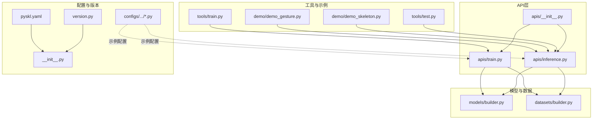
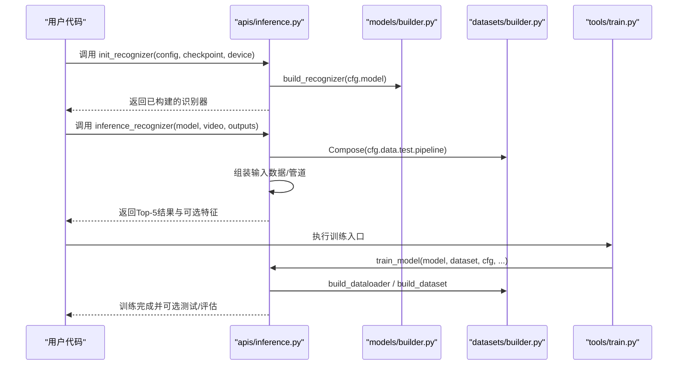
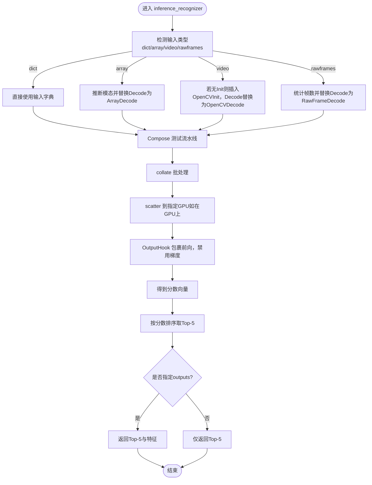
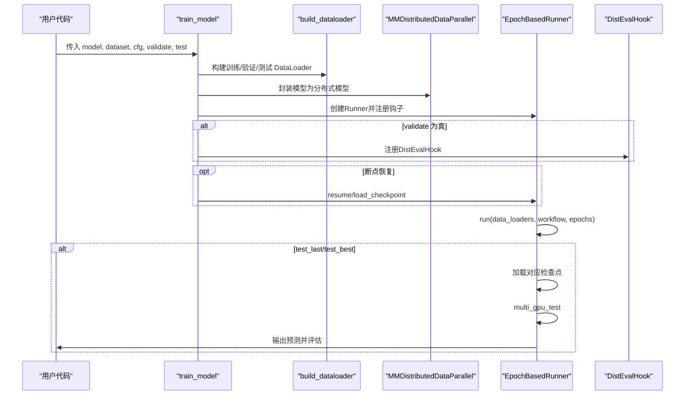
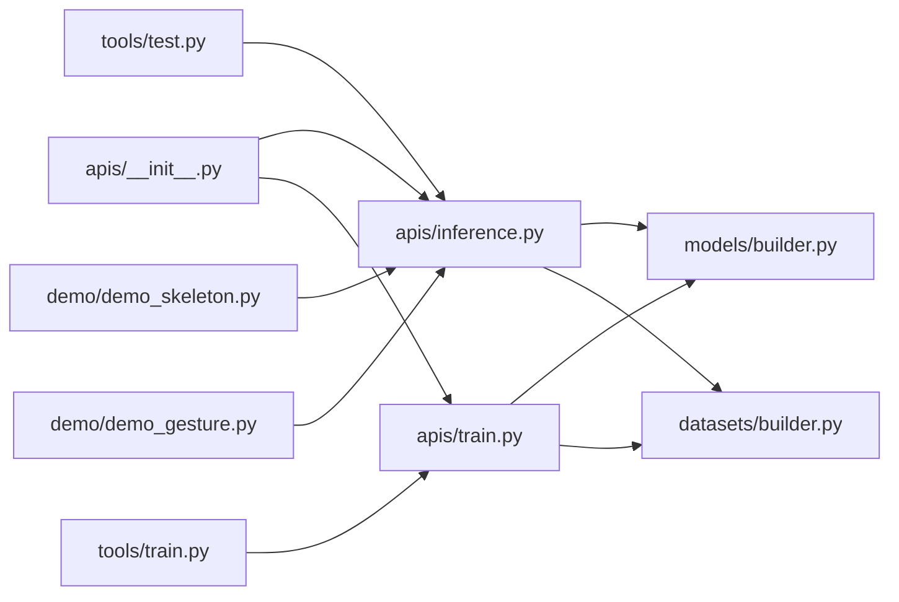

# API接口参考

<cite>
**本文引用的文件**
- [pyskl/apis/__init__.py](file://pyskl/apis/__init__.py)
- [pyskl/apis/inference.py](file://pyskl/apis/inference.py)
- [pyskl/apis/train.py](file://pyskl/apis/train.py)
- [pyskl/models/builder.py](file://pyskl/models/builder.py)
- [pyskl/datasets/builder.py](file://pyskl/datasets/builder.py)
- [pyskl/version.py](file://pyskl/version.py)
- [pyskl/__init__.py](file://pyskl/__init__.py)
- [tools/train.py](file://tools/train.py)
- [tools/test.py](file://tools/test.py)
- [demo/demo_skeleton.py](file://demo/demo_skeleton.py)
- [demo/demo_gesture.py](file://demo/demo_gesture.py)
- [configs/posec3d/slowonly_r50_ntu60_xsub/joint.py](file://configs/posec3d/slowonly_r50_ntu60_xsub/joint.py)
- [configs/aagcn/aagcn_pyskl_ntu60_xsub_3dkp/b.py](file://configs/aagcn/aagcn_pyskl_ntu60_xsub_3dkp/b.py)
- [pyskl.yaml](file://pyskl.yaml)
</cite>

## 目录
1. [简介](#简介)
2. [项目结构](#项目结构)
3. [核心组件](#核心组件)
4. [架构总览](#架构总览)
5. [详细组件分析](#详细组件分析)
6. [依赖关系分析](#依赖关系分析)
7. [性能与内存优化](#性能与内存优化)
8. [故障排查指南](#故障排查指南)
9. [结论](#结论)
10. [附录：配置文件与版本兼容](#附录配置文件与版本兼容)

## 简介
本文件为 PySKL 的完整 API 接口参考，覆盖以下内容：
- 推理接口：init_recognizer、inference_recognizer 的参数、返回值、异常与最佳实践
- 训练接口：train_model 的训练流程、配置参数、回调与钩子、分布式训练、测试与评估
- 配置文件：YAML 与 Python 字典两种格式的语法规范、参数含义与默认值
- 公共接口调用示例：常见使用场景与代码片段路径
- 版本兼容性、废弃功能迁移与向后兼容策略
- 错误码与异常类型分类、调试技巧
- 性能优化与内存管理建议

## 项目结构
PySKL 的 API 主要位于 pyskl/apis 下，配合模型与数据集构建器、工具脚本与示例演示构成完整的训练与推理管线。

**图表来源**
- [pyskl/apis/__init__.py](file://pyskl/apis/__init__.py#L1-L11)
- [pyskl/apis/inference.py](file://pyskl/apis/inference.py#L1-L184)
- [pyskl/apis/train.py](file://pyskl/apis/train.py#L1-L213)
- [pyskl/models/builder.py](file://pyskl/models/builder.py#L1-L39)
- [pyskl/datasets/builder.py](file://pyskl/datasets/builder.py#L1-L134)
- [tools/train.py](file://tools/train.py#L1-L165)
- [tools/test.py](file://tools/test.py#L1-L185)
- [demo/demo_skeleton.py](file://demo/demo_skeleton.py#L1-L314)
- [demo/demo_gesture.py](file://demo/demo_gesture.py#L1-L174)
- [configs/posec3d/slowonly_r50_ntu60_xsub/joint.py](file://configs/posec3d/slowonly_r50_ntu60_xsub/joint.py#L1-L80)
- [configs/aagcn/aagcn_pyskl_ntu60_xsub_3dkp/b.py](file://configs/aagcn/aagcn_pyskl_ntu60_xsub_3dkp/b.py#L1-L61)
- [pyskl/version.py](file://pyskl/version.py#L1-L19)
- [pyskl/__init__.py](file://pyskl/__init__.py#L1-L17)
- [pyskl.yaml](file://pyskl.yaml#L1-L132)

**章节来源**
- [pyskl/apis/__init__.py](file://pyskl/apis/__init__.py#L1-L11)
- [pyskl/apis/inference.py](file://pyskl/apis/inference.py#L1-L184)
- [pyskl/apis/train.py](file://pyskl/apis/train.py#L1-L213)
- [pyskl/models/builder.py](file://pyskl/models/builder.py#L1-L39)
- [pyskl/datasets/builder.py](file://pyskl/datasets/builder.py#L1-L134)
- [tools/train.py](file://tools/train.py#L1-L165)
- [tools/test.py](file://tools/test.py#L1-L185)
- [demo/demo_skeleton.py](file://demo/demo_skeleton.py#L1-L314)
- [demo/demo_gesture.py](file://demo/demo_gesture.py#L1-L174)
- [configs/posec3d/slowonly_r50_ntu60_xsub/joint.py](file://configs/posec3d/slowonly_r50_ntu60_xsub/joint.py#L1-L80)
- [configs/aagcn/aagcn_pyskl_ntu60_xsub_3dkp/b.py](file://configs/aagcn/aagcn_pyskl_ntu60_xsub_3dkp/b.py#L1-L61)
- [pyskl/version.py](file://pyskl/version.py#L1-L19)
- [pyskl/__init__.py](file://pyskl/__init__.py#L1-L17)
- [pyskl.yaml](file://pyskl.yaml#L1-L132)

## 核心组件
- 推理 API
  - init_recognizer：从配置文件或配置对象构建识别器，支持加载检查点、指定设备、返回模型对象
  - inference_recognizer：对视频、原始帧目录、数组或字典输入进行推理，返回前五的识别结果及可选特征输出
- 训练 API
  - train_model：训练入口，负责数据加载、分布式封装、优化器与学习率调度、评估钩子、断点恢复、最终测试
  - init_random_seed：随机种子初始化与广播，确保分布式一致性
- 构建器
  - 模型构建器：基于注册表构建识别器、骨干网络、头、损失等
  - 数据集构建器：构建数据集与 DataLoader，支持分布式采样、持久化工作进程、随机种子初始化
- 工具与示例
  - tools/train.py、tools/test.py：命令行训练与测试入口，集成分布式初始化、日志、缓存与评估
  - demo_skeleton.py、demo_gesture.py：端到端示例，展示从检测/姿态估计到动作识别的完整流程

**章节来源**
- [pyskl/apis/inference.py](file://pyskl/apis/inference.py#L19-L54)
- [pyskl/apis/inference.py](file://pyskl/apis/inference.py#L57-L183)
- [pyskl/apis/train.py](file://pyskl/apis/train.py#L50-L144)
- [pyskl/apis/train.py](file://pyskl/apis/train.py#L17-L47)
- [pyskl/models/builder.py](file://pyskl/models/builder.py#L12-L39)
- [pyskl/datasets/builder.py](file://pyskl/datasets/builder.py#L31-L124)
- [tools/train.py](file://tools/train.py#L60-L161)
- [tools/test.py](file://tools/test.py#L110-L181)
- [demo/demo_skeleton.py](file://demo/demo_skeleton.py#L227-L314)
- [demo/demo_gesture.py](file://demo/demo_gesture.py#L83-L174)

## 架构总览
下图展示了推理与训练的关键交互流程，以及与构建器、工具脚本的关系。

**图表来源**
- [pyskl/apis/inference.py](file://pyskl/apis/inference.py#L19-L183)
- [pyskl/models/builder.py](file://pyskl/models/builder.py#L22-L24)
- [pyskl/datasets/builder.py](file://pyskl/datasets/builder.py#L31-L124)
- [tools/train.py](file://tools/train.py#L121-L156)
- [pyskl/apis/train.py](file://pyskl/apis/train.py#L50-L144)

## 详细组件分析

### 推理接口：init_recognizer 与 inference_recognizer

- init_recognizer
  - 功能：从配置文件或配置对象构建识别器；可选加载检查点；设置设备；返回模型
  - 参数
    - config：字符串（配置文件路径）或 mmcv.Config 对象
    - checkpoint：字符串（检查点路径或URL），可为 None
    - device：目标设备（字符串或 torch.device）
    - kwargs：保留参数（如已弃用的 use_frames 等会触发警告）
  - 返回：识别器模型对象（已移动至指定设备并设置为 eval）
  - 异常：当 config 类型不合法时抛出 TypeError
  - 最佳实践
    - 优先使用 mmcv.Config.fromfile 加载配置
    - 使用缓存检查点以提升网络加载效率
    - 显式设置 device，避免默认设备差异导致的错误
    - 在推理前调用 model.eval()，确保 Dropout/BN 等行为正确

- inference_recognizer
  - 功能：对多种输入形式进行推理，返回 Top-5 分类结果与可选中间特征
  - 输入支持
    - 字符串：视频文件路径或 URL
    - 字典：符合流水线输入规范的数据字典
    - NumPy 数组：形状为 T x H x W x C 的视频张量
    - 原始帧目录：自动统计匹配模板的帧数量
  - 关键参数
    - model：已初始化的识别器
    - video：输入源
    - outputs：需要返回的层名列表/元组/单个名称；为 None 则仅返回 Top-5
    - as_tensor：是否以张量形式返回中间特征
    - kwargs：兼容历史参数（如 use_frames、label_path），会发出弃用警告
  - 返回
    - 默认：Top-5 结果，每个元素为 (类别索引, 分数) 的元组
    - 若指定 outputs：额外返回对应层的特征映射（张量或 NumPy 数组）
  - 异常
    - 不支持的输入类型会抛出运行时错误
    - 数组输入需满足四维且通道维度符合 RGB/Flow 的推断
  - 最佳实践
    - 对于 GCN 模型，确保 FormatGCNInput 的 num_person 与实际人数一致
    - 大视频建议使用 URL 或分段处理，避免一次性加载过大内存
    - 使用 OutputHook 指定 outputs 时，注意显存占用

**图表来源**
- [pyskl/apis/inference.py](file://pyskl/apis/inference.py#L57-L183)

**章节来源**
- [pyskl/apis/inference.py](file://pyskl/apis/inference.py#L19-L54)
- [pyskl/apis/inference.py](file://pyskl/apis/inference.py#L57-L183)

### 训练接口：train_model

- 功能概述
  - 训练入口，负责数据加载、分布式封装、优化器与学习率调度、评估钩子、断点恢复、最终测试
- 关键参数
  - model：待训练的识别器模型
  - dataset：训练数据集（支持列表/元组）
  - cfg：训练配置字典（包含 data、optimizer、lr_config、checkpoint_config、log_config、evaluation、work_dir、total_epochs、workflow 等）
  - validate：是否在训练过程中进行验证
  - test：测试选项（test_last、test_best）
  - timestamp、meta：日志与元信息
- 训练流程要点
  - 构建 DataLoader：videos_per_gpu、workers_per_gpu、persistent_workers、seed 等
  - 分布式封装：MMDistributedDataParallel，find_unused_parameters 可配置
  - 构建优化器与 Runner：EpochBasedRunner，注册训练钩子（学习率、优化器、检查点、日志、动量等）
  - 评估钩子：DistEvalHook，支持分布式评估
  - 断点恢复：支持 resume_from 或 load_from
  - 最终测试：根据 test_last/test_best 选择相应检查点，执行 multi_gpu_test 并评估
- 回调与钩子
  - 训练钩子：OptimizerHook、DistSamplerSeedHook 等
  - 评估钩子：DistEvalHook
- 分布式训练
  - 通过 get_dist_info 获取 rank/world_size，使用 DistributedSampler/ClassSpecificDistributedSampler
  - barrier 与 sleep 用于同步与稳定输出
- 最佳实践
  - 合理设置 videos_per_gpu 与 workers_per_gpu，避免 OOM
  - 开启 persistent_workers（PyTorch>=1.8）减少每轮初始化开销
  - 使用 DistSamplerSeedHook 保证分布式采样的随机性一致性
  - 在 validate=True 时，确保 cfg.evaluation 正确配置

**图表来源**
- [pyskl/apis/train.py](file://pyskl/apis/train.py#L50-L144)
- [pyskl/datasets/builder.py](file://pyskl/datasets/builder.py#L48-L124)

**章节来源**
- [pyskl/apis/train.py](file://pyskl/apis/train.py#L50-L144)
- [pyskl/datasets/builder.py](file://pyskl/datasets/builder.py#L48-L124)

### 随机种子与环境初始化：init_random_seed

- 功能：在未指定 seed 时生成随机种子，并在分布式环境中广播，确保各进程一致
- 参数
  - seed：整数或 None
  - device：种子放置的设备，默认 'cuda'
- 返回：最终使用的 seed

**章节来源**
- [pyskl/apis/train.py](file://pyskl/apis/train.py#L17-L47)

## 依赖关系分析

**图表来源**
- [pyskl/apis/__init__.py](file://pyskl/apis/__init__.py#L1-L11)
- [pyskl/apis/inference.py](file://pyskl/apis/inference.py#L1-L184)
- [pyskl/apis/train.py](file://pyskl/apis/train.py#L1-L213)
- [pyskl/models/builder.py](file://pyskl/models/builder.py#L1-L39)
- [pyskl/datasets/builder.py](file://pyskl/datasets/builder.py#L1-L134)
- [tools/train.py](file://tools/train.py#L1-L165)
- [tools/test.py](file://tools/test.py#L1-L185)
- [demo/demo_skeleton.py](file://demo/demo_skeleton.py#L1-L314)
- [demo/demo_gesture.py](file://demo/demo_gesture.py#L1-L174)

**章节来源**
- [pyskl/apis/__init__.py](file://pyskl/apis/__init__.py#L1-L11)
- [pyskl/apis/inference.py](file://pyskl/apis/inference.py#L1-L184)
- [pyskl/apis/train.py](file://pyskl/apis/train.py#L1-L213)
- [pyskl/models/builder.py](file://pyskl/models/builder.py#L1-L39)
- [pyskl/datasets/builder.py](file://pyskl/datasets/builder.py#L1-L134)
- [tools/train.py](file://tools/train.py#L1-L165)
- [tools/test.py](file://tools/test.py#L1-L185)
- [demo/demo_skeleton.py](file://demo/demo_skeleton.py#L1-L314)
- [demo/demo_gesture.py](file://demo/demo_gesture.py#L1-L174)

## 性能与内存优化
- DataLoader 优化
  - videos_per_gpu：根据 GPU 显存调整批次大小
  - workers_per_gpu：适度增大以提升数据加载吞吐，注意 CPU/IO 限制
  - persistent_workers：开启可减少每轮工作进程重启开销（PyTorch>=1.8）
  - pin_memory：启用可加速主机到 GPU 的数据传输
- 分布式与采样
  - 使用 DistributedSampler/ClassSpecificDistributedSampler，避免数据重复与分布不均
  - seed 与 DistSamplerSeedHook 保证可复现性
- 模型与推理
  - 推理时禁用梯度，减少内存与计算开销
  - 对于大视频，优先使用 URL 或分段处理
  - GCN 模型注意 num_person 与实际人数一致，避免无效填充
- 缓存与 I/O
  - 使用缓存检查点与可选 memcached（见工具脚本）提升 I/O 效率
- PyTorch 2.0
  - 条件编译（torch.compile）可提升推理/训练速度（需满足版本要求）

**章节来源**
- [pyskl/datasets/builder.py](file://pyskl/datasets/builder.py#L48-L124)
- [tools/train.py](file://tools/train.py#L121-L123)
- [tools/test.py](file://tools/test.py#L98-L99)

## 故障排查指南
- 常见异常与定位
  - 配置类型错误：init_recognizer 对 config 类型有严格要求，非字符串或 Config 会抛出 TypeError
  - 输入类型不支持：inference_recognizer 对 video 的类型有限制，非法类型会抛出运行时错误
  - 分布式初始化失败：tools/train.py/tools/test.py 中 init_dist 与 get_dist_info 依赖环境变量与后端
  - 评估指标缺失：tools/test.py 中评估指标需与数据集匹配，否则 evaluate 抛错
- 日志与调试
  - 使用 get_root_logger 设置日志级别，记录环境信息与配置摘要
  - 在分布式场景下，注意 rank 与 world_size 的输出顺序与同步
- 内存与显存
  - 降低 videos_per_gpu 或切换到更小模型
  - 关闭不必要的 outputs，减少中间特征保存
  - 使用 persistent_workers 与 pin_memory 提升 I/O 效率

**章节来源**
- [pyskl/apis/inference.py](file://pyskl/apis/inference.py#L40-L42)
- [pyskl/apis/inference.py](file://pyskl/apis/inference.py#L96-L98)
- [tools/train.py](file://tools/train.py#L78-L78)
- [tools/test.py](file://tools/test.py#L118-L121)

## 结论
本文档系统梳理了 PySKL 的推理与训练 API，给出了参数、返回值、异常与最佳实践，并结合配置文件与示例演示帮助用户快速上手。通过合理的 DataLoader 设置、分布式采样与缓存策略，可在保证稳定性的同时获得良好性能。

## 附录：配置文件与版本兼容

### 配置文件格式说明
- YAML 格式
  - 用途：环境与依赖声明（如 Conda 环境定义）
  - 注意：本仓库中的 YAML 文件主要用于环境打包，不直接作为训练/推理配置
- Python 字典格式（推荐）
  - 位置：configs 下各模型配置文件（如 posec3d、aagcn 等）
  - 关键字段
    - model：模型结构定义（type、backbone、head、test_cfg 等）
    - data：训练/验证/测试数据集与流水线（train/val/test、train_dataloader/val_dataloader/test_dataloader、videos_per_gpu、workers_per_gpu 等）
    - optimizer/optimizer_config：优化器与梯度裁剪
    - lr_config：学习率策略
    - total_epochs/workflow/checkpoint_config/log_config：训练周期与日志
    - evaluation：评估指标与间隔
    - work_dir：工作目录
    - 其他：如 cudnn_benchmark、dist_params、memcached 等
  - 示例参考
    - [configs/posec3d/slowonly_r50_ntu60_xsub/joint.py](file://configs/posec3d/slowonly_r50_ntu60_xsub/joint.py#L1-L80)
    - [configs/aagcn/aagcn_pyskl_ntu60_xsub_3dkp/b.py](file://configs/aagcn/aagcn_pyskl_ntu60_xsub_3dkp/b.py#L1-L61)

**章节来源**
- [configs/posec3d/slowonly_r50_ntu60_xsub/joint.py](file://configs/posec3d/slowonly_r50_ntu60_xsub/joint.py#L1-L80)
- [configs/aagcn/aagcn_pyskl_ntu60_xsub_3dkp/b.py](file://configs/aagcn/aagcn_pyskl_ntu60_xsub_3dkp/b.py#L1-L61)
- [pyskl.yaml](file://pyskl.yaml#L1-L132)

### 版本兼容性与废弃功能
- 版本范围
  - PySKL 当前版本：参见 [pyskl/version.py](file://pyskl/version.py#L3-L3)
  - MMCV 兼容范围：最小版本与最大版本由 [pyskl/__init__.py](file://pyskl/__init__.py#L7-L14) 控制
- 废弃与迁移
  - inference_recognizer 与 init_recognizer 中的 use_frames、label_path 参数已弃用，会触发警告
  - 迁移建议：删除相关参数，保持默认行为即可
- 向后兼容性
  - 通过注册表与 MMEngine/MMDetection 等生态协同，尽量维持配置与接口稳定性
  - 如需升级，请先核对 MMCV 版本范围并在 CI 中验证

**章节来源**
- [pyskl/version.py](file://pyskl/version.py#L1-L19)
- [pyskl/__init__.py](file://pyskl/__init__.py#L1-L17)
- [pyskl/apis/inference.py](file://pyskl/apis/inference.py#L33-L36)
- [pyskl/apis/inference.py](file://pyskl/apis/inference.py#L74-L81)

### 公共接口调用示例（代码片段路径）
- 初始化识别器并推理
  - [demo/demo_skeleton.py](file://demo/demo_skeleton.py#L246-L246)
  - [demo/demo_gesture.py](file://demo/demo_gesture.py#L86-L87)
- 训练入口
  - [tools/train.py](file://tools/train.py#L156-L156)
- 测试与评估
  - [tools/test.py](file://tools/test.py#L167-L176)

**章节来源**
- [demo/demo_skeleton.py](file://demo/demo_skeleton.py#L227-L314)
- [demo/demo_gesture.py](file://demo/demo_gesture.py#L83-L174)
- [tools/train.py](file://tools/train.py#L121-L156)
- [tools/test.py](file://tools/test.py#L110-L181)