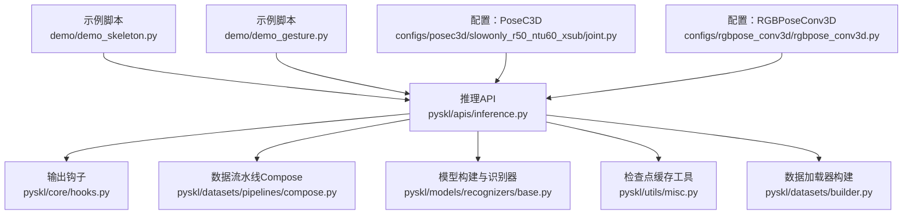
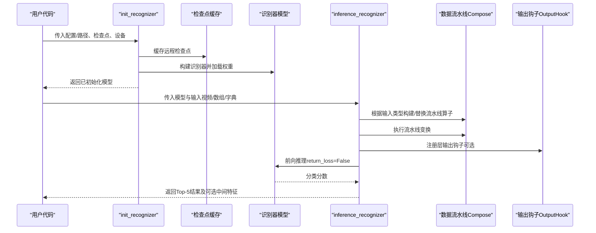
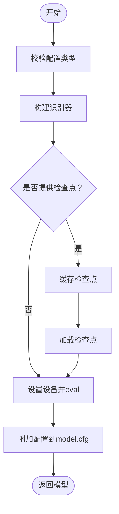
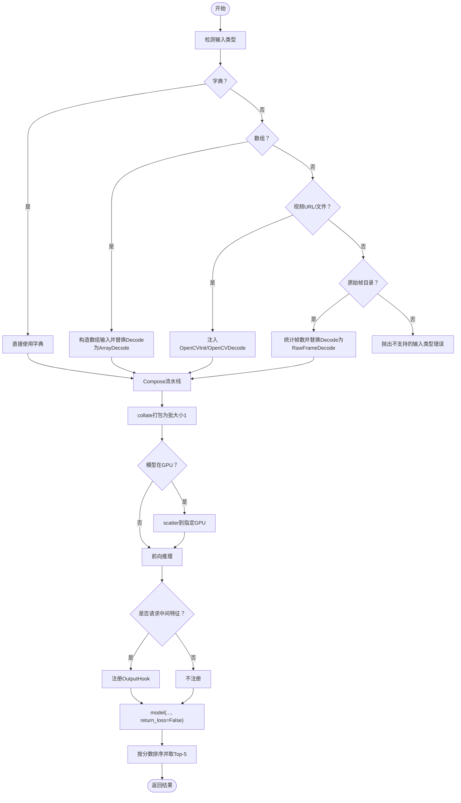
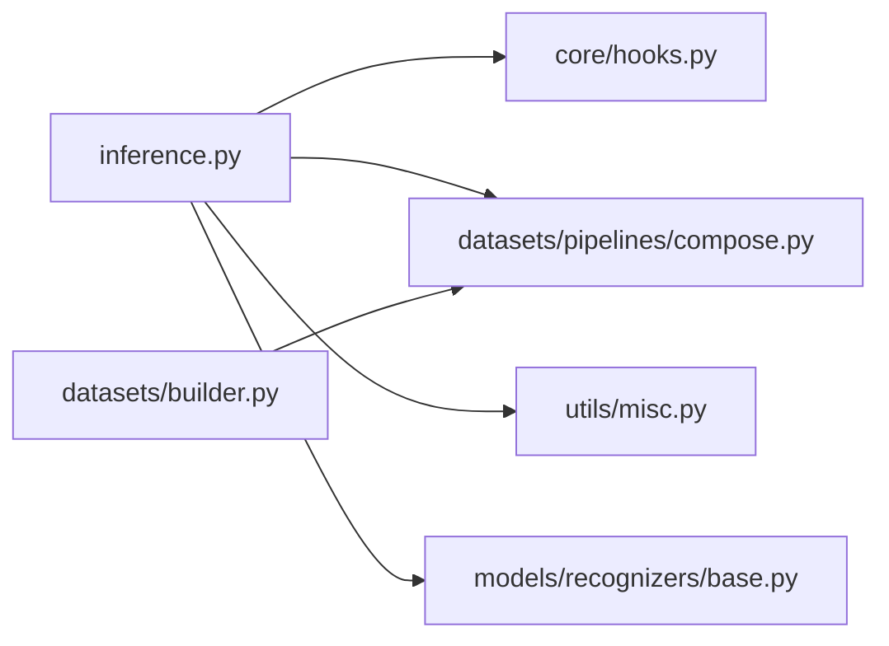

# 推理接口

<cite>
**本文引用的文件**
- [pyskl/apis/inference.py](file://pyskl/apis/inference.py)
- [pyskl/apis/__init__.py](file://pyskl/apis/__init__.py)
- [pyskl/core/hooks.py](file://pyskl/core/hooks.py)
- [pyskl/datasets/pipelines/compose.py](file://pyskl/datasets/pipelines/compose.py)
- [pyskl/datasets/builder.py](file://pyskl/datasets/builder.py)
- [pyskl/utils/misc.py](file://pyskl/utils/misc.py)
- [pyskl/models/recognizers/base.py](file://pyskl/models/recognizers/base.py)
- [demo/demo_skeleton.py](file://demo/demo_skeleton.py)
- [demo/demo_gesture.py](file://demo/demo_gesture.py)
- [configs/posec3d/slowonly_r50_ntu60_xsub/joint.py](file://configs/posec3d/slowonly_r50_ntu60_xsub/joint.py)
- [configs/rgbpose_conv3d/rgbpose_conv3d.py](file://configs/rgbpose_conv3d/rgbpose_conv3d.py)
- [examples/inference_speed.ipynb](file://examples/inference_speed.ipynb)
</cite>

## 目录
1. [简介](#简介)
2. [项目结构](#项目结构)
3. [核心组件](#核心组件)
4. [架构总览](#架构总览)
5. [详细组件分析](#详细组件分析)
6. [依赖关系分析](#依赖关系分析)
7. [性能考虑](#性能考虑)
8. [故障排查指南](#故障排查指南)
9. [结论](#结论)
10. [附录](#附录)

## 简介
本文件面向PySKL推理接口，系统性地文档化以下内容：
- 初始化接口 init_recognizer 的参数与用法、模型加载流程与内存管理
- 推理接口 inference_recognizer 的输入数据格式、预处理、前向传播与结果后处理
- 不同输入模态的处理方式：3D关键点、RGB视频、RGBPose混合模态
- 异常处理机制与常见问题定位
- 性能优化建议：批处理大小、设备选择、内存使用

## 项目结构
与推理接口直接相关的模块分布如下：
- 推理API：pyskl/apis/inference.py
- 导出入口：pyskl/apis/__init__.py
- 数据流水线：pyskl/datasets/pipelines/compose.py
- 输出钩子：pyskl/core/hooks.py
- 数据集与数据加载：pyskl/datasets/builder.py
- 检查点缓存：pyskl/utils/misc.py
- 识别器基类：pyskl/models/recognizers/base.py
- 示例与配置：demo/*、configs/*

图表来源
- [pyskl/apis/inference.py](file://pyskl/apis/inference.py#L1-L184)
- [pyskl/core/hooks.py](file://pyskl/core/hooks.py#L1-L67)
- [pyskl/datasets/pipelines/compose.py](file://pyskl/datasets/pipelines/compose.py#L1-L53)
- [pyskl/datasets/builder.py](file://pyskl/datasets/builder.py#L1-L134)
- [pyskl/utils/misc.py](file://pyskl/utils/misc.py#L115-L125)
- [pyskl/models/recognizers/base.py](file://pyskl/models/recognizers/base.py#L1-L196)
- [demo/demo_skeleton.py](file://demo/demo_skeleton.py#L1-L314)
- [demo/demo_gesture.py](file://demo/demo_gesture.py#L1-L174)
- [configs/posec3d/slowonly_r50_ntu60_xsub/joint.py](file://configs/posec3d/slowonly_r50_ntu60_xsub/joint.py#L1-L80)
- [configs/rgbpose_conv3d/rgbpose_conv3d.py](file://configs/rgbpose_conv3d/rgbpose_conv3d.py#L1-L107)

章节来源
- [pyskl/apis/inference.py](file://pyskl/apis/inference.py#L1-L184)
- [pyskl/apis/__init__.py](file://pyskl/apis/__init__.py#L1-L11)

## 核心组件
- init_recognizer：从配置文件或配置对象构建识别器，加载检查点，设置设备与评估模式，并返回模型实例。
- inference_recognizer：根据输入类型（字典、数组、视频URL或本地视频、原始帧目录），构建测试流水线，执行预处理、批处理、前向推理与Top-K结果排序。

章节来源
- [pyskl/apis/inference.py](file://pyskl/apis/inference.py#L19-L54)
- [pyskl/apis/inference.py](file://pyskl/apis/inference.py#L57-L184)

## 架构总览
推理接口的整体调用链如下：

图表来源
- [pyskl/apis/inference.py](file://pyskl/apis/inference.py#L19-L54)
- [pyskl/apis/inference.py](file://pyskl/apis/inference.py#L57-L184)
- [pyskl/core/hooks.py](file://pyskl/core/hooks.py#L7-L58)
- [pyskl/datasets/pipelines/compose.py](file://pyskl/datasets/pipelines/compose.py#L8-L44)
- [pyskl/utils/misc.py](file://pyskl/utils/misc.py#L115-L125)

## 详细组件分析

### init_recognizer 组件分析
- 功能概述
  - 接受配置文件路径或配置对象，构建识别器
  - 可选加载检查点（支持本地路径或HTTP/HTTPS URL）
  - 设置设备（CPU/GPU）与评估模式
  - 返回可直接用于推理的模型实例
- 关键参数
  - config：字符串（配置文件路径）或 mmcv.Config 对象
  - checkpoint：字符串（检查点路径或URL），可为 None
  - device：目标设备字符串或 torch.device，默认 'cuda:0'
- 加载流程
  - 将 config 转换为 mmcv.Config
  - 禁用预训练权重（避免重复加载）
  - 通过 build_recognizer 构建模型
  - 若提供 checkpoint，则先缓存到本地再加载
  - 将配置对象挂载到 model.cfg，移动至指定设备，设为 eval 模式
- 内存管理
  - 检查点下载采用本地缓存，避免重复下载
  - 模型移动到目标设备后，进入推理模式以减少梯度计算开销

图表来源
- [pyskl/apis/inference.py](file://pyskl/apis/inference.py#L19-L54)
- [pyskl/utils/misc.py](file://pyskl/utils/misc.py#L115-L125)

章节来源
- [pyskl/apis/inference.py](file://pyskl/apis/inference.py#L19-L54)
- [pyskl/utils/misc.py](file://pyskl/utils/misc.py#L115-L125)

### inference_recognizer 组件分析
- 输入类型与预处理
  - 字典输入：直接作为流水线输入
  - 数组输入：要求四维 T x H x W x C；自动推断模态（2通道=Flow，3通道=RGB）
  - 视频URL或本地视频文件：自动注入 OpenCV 初始化与解码算子
  - 原始帧目录：统计匹配模板的帧数量，注入 RawFrameDecode
- 流水线构建与替换
  - 读取 cfg.data.test.pipeline
  - 根据输入类型替换 Init 与 Decode 算子为对应实现
  - 使用 Compose 应用流水线
  - 使用 collate 打包为批大小为1的样本
- 设备与前向传播
  - 若模型在GPU上，使用 scatter 将数据散播到指定GPU
  - 使用 OutputHook 注册需要的中间层输出（可选）
  - 前向推理：model(return_loss=False, **data)
- 结果后处理
  - 将分类分数映射为 (类别索引, 分数) 元组并按分数降序排序
  - 返回 Top-5 结果；若指定了输出层，则额外返回对应特征

图表来源
- [pyskl/apis/inference.py](file://pyskl/apis/inference.py#L57-L184)
- [pyskl/datasets/pipelines/compose.py](file://pyskl/datasets/pipelines/compose.py#L8-L44)
- [pyskl/core/hooks.py](file://pyskl/core/hooks.py#L7-L58)

章节来源
- [pyskl/apis/inference.py](file://pyskl/apis/inference.py#L57-L184)
- [pyskl/datasets/pipelines/compose.py](file://pyskl/datasets/pipelines/compose.py#L8-L44)
- [pyskl/core/hooks.py](file://pyskl/core/hooks.py#L7-L58)

### 数据流水线与多模态处理
- Compose 流水线
  - 支持配置字典与可调用对象，顺序执行变换
- 多模态输入适配
  - 数组输入：自动识别 RGB/Flow 并替换解码器
  - 视频输入：OpenCV 解码
  - 原始帧：RawFrameDecode，按模板匹配统计帧数
- RGBPose混合模态
  - 通过 MM* 系列算子同时处理 RGB 帧与姿态热图
  - 配置示例见 RGBPoseConv3D

章节来源
- [pyskl/datasets/pipelines/compose.py](file://pyskl/datasets/pipelines/compose.py#L8-L44)
- [configs/rgbpose_conv3d/rgbpose_conv3d.py](file://configs/rgbpose_conv3d/rgbpose_conv3d.py#L50-L85)

### 示例与用法
- 使用预训练模型进行实时推理与批量推理
  - 示例脚本演示了从配置与检查点初始化模型、执行推理、可视化与写入视频的完整流程
  - 参考路径：[demo/demo_skeleton.py](file://demo/demo_skeleton.py#L227-L314)，[demo/demo_gesture.py](file://demo/demo_gesture.py#L83-L174)

章节来源
- [demo/demo_skeleton.py](file://demo/demo_skeleton.py#L227-L314)
- [demo/demo_gesture.py](file://demo/demo_gesture.py#L83-L174)

## 依赖关系分析
- 推理API依赖
  - 输出钩子：用于捕获中间层特征
  - 数据流水线：按输入类型动态替换 Init/Decode 算子
  - 检查点缓存：统一处理本地/远程检查点
  - 识别器基类：提供 forward_test 等通用接口
  - 数据加载器构建：提供批处理与分布式采样能力（训练侧）

图表来源
- [pyskl/apis/inference.py](file://pyskl/apis/inference.py#L1-L184)
- [pyskl/core/hooks.py](file://pyskl/core/hooks.py#L1-L67)
- [pyskl/datasets/pipelines/compose.py](file://pyskl/datasets/pipelines/compose.py#L1-L53)
- [pyskl/utils/misc.py](file://pyskl/utils/misc.py#L115-L125)
- [pyskl/models/recognizers/base.py](file://pyskl/models/recognizers/base.py#L1-L196)
- [pyskl/datasets/builder.py](file://pyskl/datasets/builder.py#L1-L134)

章节来源
- [pyskl/apis/inference.py](file://pyskl/apis/inference.py#L1-L184)
- [pyskl/datasets/builder.py](file://pyskl/datasets/builder.py#L1-L134)

## 性能考虑
- 批处理大小
  - 推理侧使用 samples_per_gpu=1，适合单样本推理；若需批处理，请在外层循环中多次调用 inference_recognizer 或自定义批处理逻辑
- 设备选择
  - 将模型移动到 GPU 可显著提升速度；注意显存占用与输入尺寸
- 内存使用
  - 使用 OutputHook 捕获中间特征会增加内存占用，仅在需要时开启
  - 检查点缓存避免重复下载，降低IO等待
- 模型与配置
  - 不同模型（如 PoseC3D、RGBPoseConv3D、GCN 系列）在相同硬件下的推理速度差异较大，可参考示例中的速度测试
- 参考资源
  - 推理速度示例：[examples/inference_speed.ipynb](file://examples/inference_speed.ipynb#L68-L111)

章节来源
- [pyskl/apis/inference.py](file://pyskl/apis/inference.py#L164-L174)
- [examples/inference_speed.ipynb](file://examples/inference_speed.ipynb#L68-L111)

## 故障排查指南
- 模型加载失败
  - 检查 checkpoint 是否为有效路径或可访问的URL；确认缓存目录可写
  - 确认配置文件正确且与检查点匹配
- 输入格式错误
  - 数组输入必须为四维 T x H x W x C，且通道数为2（Flow）或3（RGB）
  - 视频输入必须为本地文件路径或HTTP(S) URL
  - 原始帧目录需满足配置中的 filename_tmpl 与 modality
- 设备不兼容
  - 确保 device 字符串与实际可用设备一致；若模型在GPU上，确保 CUDA 可用
- 中间特征输出异常
  - 确认 outputs 传入的是层名字符串或列表；若层名不存在将抛出 AttributeError
- 训练/推理混淆
  - 推理时应使用 model(return_loss=False)；训练侧使用 return_loss=True

章节来源
- [pyskl/apis/inference.py](file://pyskl/apis/inference.py#L83-L98)
- [pyskl/core/hooks.py](file://pyskl/core/hooks.py#L40-L47)
- [pyskl/utils/misc.py](file://pyskl/utils/misc.py#L115-L125)

## 结论
本文档系统梳理了 PySKL 推理接口的初始化与推理流程，覆盖了多模态输入、流水线适配、设备与内存管理、异常处理与性能优化建议。结合示例脚本与配置文件，用户可快速完成从预训练模型到实时/批量推理的落地应用。

## 附录
- API清单
  - init_recognizer(config, checkpoint=None, device='cuda:0', **kwargs)
  - inference_recognizer(model, video, outputs=None, as_tensor=True, **kwargs)
- 关键配置参考
  - PoseC3D（3D关键点+时间序列）：[configs/posec3d/slowonly_r50_ntu60_xsub/joint.py](file://configs/posec3d/slowonly_r50_ntu60_xsub/joint.py#L1-L80)
  - RGBPoseConv3D（RGB+姿态混合模态）：[configs/rgbpose_conv3d/rgbpose_conv3d.py](file://configs/rgbpose_conv3d/rgbpose_conv3d.py#L1-L107)
- 示例参考
  - 实时骨架动作识别：[demo/demo_skeleton.py](file://demo/demo_skeleton.py#L227-L314)
  - 手势实时推理（MediaPipe+PySKL）：[demo/demo_gesture.py](file://demo/demo_gesture.py#L83-L174)