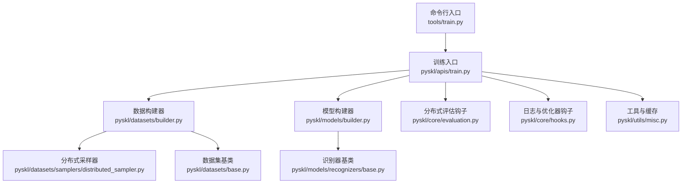
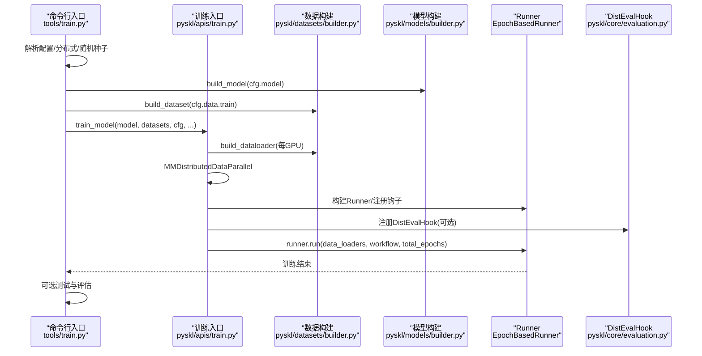
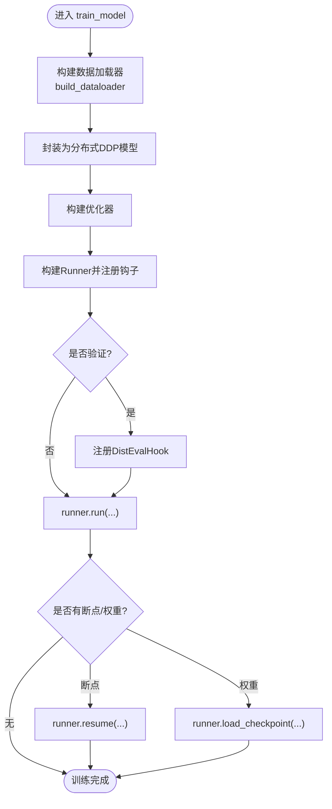
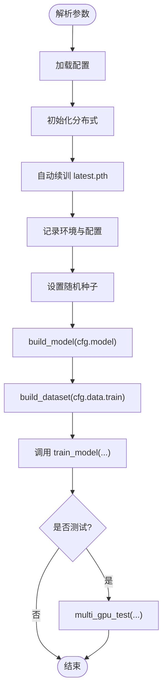
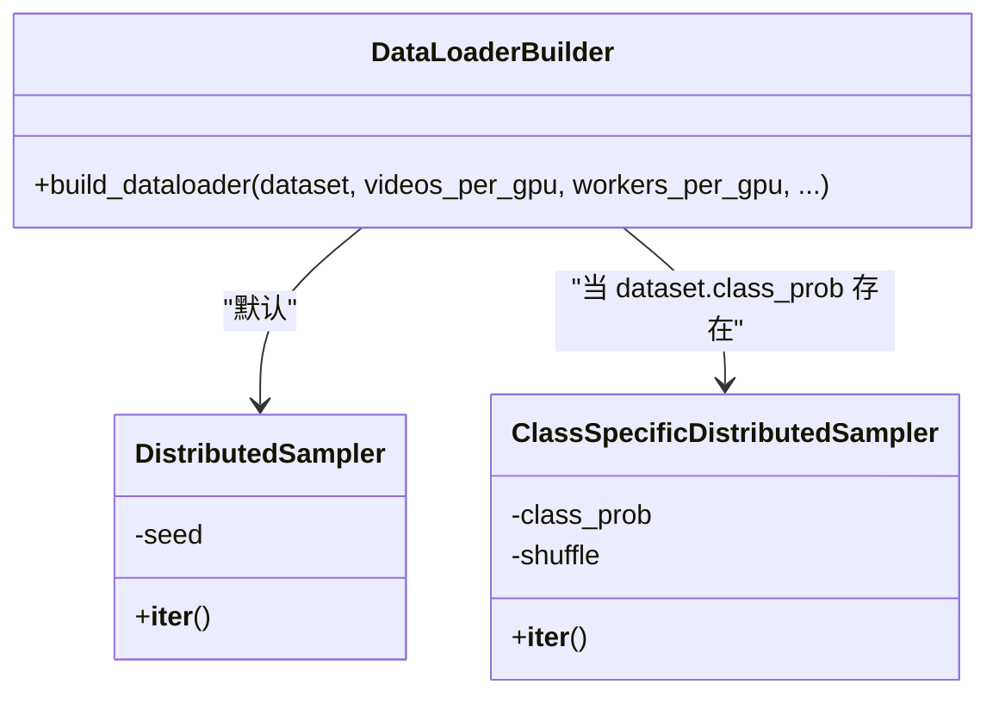
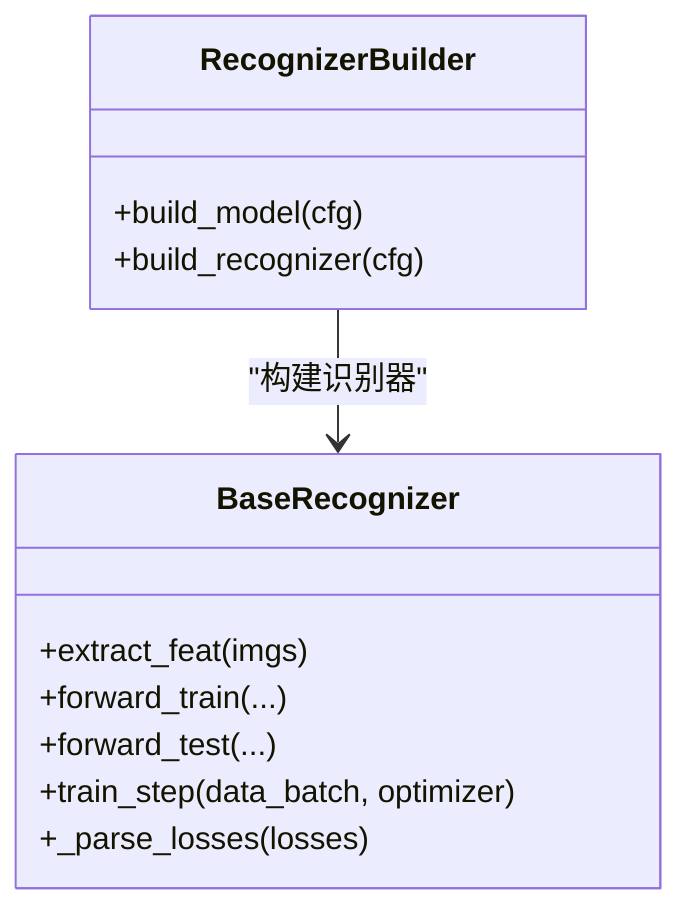
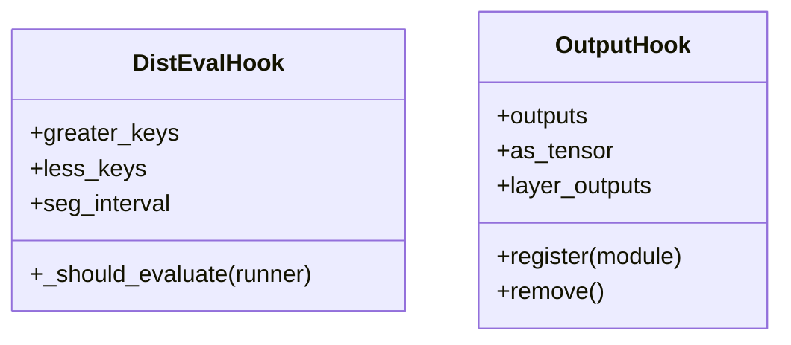
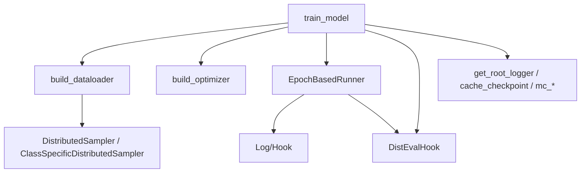

# 训练接口

<cite>
**本文引用的文件**
- [pyskl/apis/train.py](file://pyskl/apis/train.py)
- [tools/train.py](file://tools/train.py)
- [pyskl/datasets/builder.py](file://pyskl/datasets/builder.py)
- [pyskl/datasets/samplers/distributed_sampler.py](file://pyskl/datasets/samplers/distributed_sampler.py)
- [pyskl/models/builder.py](file://pyskl/models/builder.py)
- [pyskl/models/recognizers/base.py](file://pyskl/models/recognizers/base.py)
- [pyskl/core/evaluation.py](file://pyskl/core/evaluation.py)
- [pyskl/core/hooks.py](file://pyskl/core/hooks.py)
- [pyskl/utils/misc.py](file://pyskl/utils/misc.py)
- [pyskl/datasets/base.py](file://pyskl/datasets/base.py)
- [configs/stgcn/stgcn_pyskl_ntu60_xsub_3dkp/b.py](file://configs/stgcn/stgcn_pyskl_ntu60_xsub_3dkp/b.py)
- [configs/aagcn/aagcn_pyskl_ntu60_xsub_3dkp/b.py](file://configs/aagcn/aagcn_pyskl_ntu60_xsub_3dkp/b.py)
- [configs/msg3d/msg3d_pyskl_ntu60_xsub_3dkp/b.py](file://configs/msg3d/msg3d_pyskl_ntu60_xsub_3dkp/b.py)
- [requirements.txt](file://requirements.txt)
</cite>

## 目录
1. [简介](#简介)
2. [项目结构](#项目结构)
3. [核心组件](#核心组件)
4. [架构总览](#架构总览)
5. [组件详解](#组件详解)
6. [依赖关系分析](#依赖关系分析)
7. [性能考量](#性能考量)
8. [故障排查指南](#故障排查指南)
9. [结论](#结论)
10. [附录](#附录)

## 简介
本文件面向PySKL的训练接口，围绕train_model函数提供全面的API文档与最佳实践指导。内容覆盖训练配置参数、训练流程控制、分布式训练支持、监控指标、回调机制、常见问题诊断与完整训练脚本示例。读者无需深入底层实现即可高效使用训练接口。

## 项目结构
训练相关的关键文件分布如下：
- 命令行入口：tools/train.py
- 训练主流程：pyskl/apis/train.py
- 数据集构建与分布式采样：pyskl/datasets/builder.py、pyskl/datasets/samplers/distributed_sampler.py
- 模型构建：pyskl/models/builder.py、pyskl/models/recognizers/base.py
- 评估与日志钩子：pyskl/core/evaluation.py、pyskl/core/hooks.py
- 工具与缓存：pyskl/utils/misc.py
- 数据集基类与评估指标：pyskl/datasets/base.py
- 配置示例：configs/*/.../*.py
- 依赖声明：requirements.txt

**图示来源**
- [tools/train.py](file://tools/train.py#L60-L165)
- [pyskl/apis/train.py](file://pyskl/apis/train.py#L50-L213)
- [pyskl/datasets/builder.py](file://pyskl/datasets/builder.py#L31-L134)
- [pyskl/datasets/samplers/distributed_sampler.py](file://pyskl/datasets/samplers/distributed_sampler.py#L8-L112)
- [pyskl/models/builder.py](file://pyskl/models/builder.py#L32-L39)
- [pyskl/models/recognizers/base.py](file://pyskl/models/recognizers/base.py#L20-L196)
- [pyskl/core/evaluation.py](file://pyskl/core/evaluation.py#L6-L38)
- [pyskl/core/hooks.py](file://pyskl/core/hooks.py#L7-L68)
- [pyskl/utils/misc.py](file://pyskl/utils/misc.py#L97-L131)
- [pyskl/datasets/base.py](file://pyskl/datasets/base.py#L18-L354)

**章节来源**
- [tools/train.py](file://tools/train.py#L60-L165)
- [pyskl/apis/train.py](file://pyskl/apis/train.py#L50-L213)

## 核心组件
- 训练入口函数：train_model
  - 功能：组织训练流程，构建分布式模型、优化器、Runner与钩子，注册评估钩子，支持断点续训与权重加载，运行训练循环，并在需要时进行测试。
  - 关键参数：model、dataset、cfg、validate、test、timestamp、meta。
  - 关键行为：构建分布式DDP模型、构建优化器、注册学习率/优化器/日志/检查点钩子、注册分布式采样种子钩子、注册DistEvalHook（可选）、支持resume/load、调用runner.run执行训练。
- 命令行入口：tools/train.py
  - 功能：解析配置、初始化分布式环境、设置随机种子、构建模型与数据集、调用train_model。
  - 关键行为：解析参数、加载配置、初始化分布式、自动续训、记录环境信息、调用train_model。
- 数据构建与分布式采样：pyskl/datasets/builder.py、pyskl/datasets/samplers/distributed_sampler.py
  - 功能：根据配置构建DataLoader；在分布式场景下使用DistributedSampler或ClassSpecificDistributedSampler；支持可复用worker与内存锁页。
- 模型构建：pyskl/models/builder.py、pyskl/models/recognizers/base.py
  - 功能：通过配置构建识别器（recognizer），识别器基类提供特征提取、训练步封装、损失解析与分布式归约。
- 评估与日志：pyskl/core/evaluation.py、pyskl/core/hooks.py
  - 功能：DistEvalHook用于分布式评估与保存最优模型；OutputHook用于在推理阶段捕获中间层特征。
- 工具与缓存：pyskl/utils/misc.py
  - 功能：根日志器、检查点缓存、memcached启动/关闭与端口检测、警告仅在rank0输出。
- 数据集基类：pyskl/datasets/base.py
  - 功能：统一的数据集接口、评估指标（top_k_accuracy、mean_class_accuracy、mean_average_precision）、结果dump与memcached缓存支持。

**章节来源**
- [pyskl/apis/train.py](file://pyskl/apis/train.py#L50-L213)
- [tools/train.py](file://tools/train.py#L60-L165)
- [pyskl/datasets/builder.py](file://pyskl/datasets/builder.py#L31-L134)
- [pyskl/datasets/samplers/distributed_sampler.py](file://pyskl/datasets/samplers/distributed_sampler.py#L8-L112)
- [pyskl/models/builder.py](file://pyskl/models/builder.py#L32-L39)
- [pyskl/models/recognizers/base.py](file://pyskl/models/recognizers/base.py#L20-L196)
- [pyskl/core/evaluation.py](file://pyskl/core/evaluation.py#L6-L38)
- [pyskl/core/hooks.py](file://pyskl/core/hooks.py#L7-L68)
- [pyskl/utils/misc.py](file://pyskl/utils/misc.py#L97-L131)
- [pyskl/datasets/base.py](file://pyskl/datasets/base.py#L18-L354)

## 架构总览
训练流程自上而下的调用链如下：

**图示来源**
- [tools/train.py](file://tools/train.py#L121-L156)
- [pyskl/apis/train.py](file://pyskl/apis/train.py#L74-L144)
- [pyskl/datasets/builder.py](file://pyskl/datasets/builder.py#L31-L134)
- [pyskl/models/builder.py](file://pyskl/models/builder.py#L32-L39)
- [pyskl/core/evaluation.py](file://pyskl/core/evaluation.py#L6-L38)

## 组件详解

### 训练入口函数 train_model
- 主要职责
  - 构建数据加载器（支持分布式采样与可复用worker）
  - 将模型封装为分布式DataParallel（DDP）
  - 构建优化器与Runner，注册学习率、优化器、日志、检查点钩子
  - 注册分布式采样种子钩子
  - 可选注册DistEvalHook并在训练后进行测试与评估
  - 支持从latest.pth或指定路径断点续训/加载权重
- 关键钩子
  - 学习率调度：由cfg.lr_config驱动
  - 优化器：由cfg.optimizer与cfg.optimizer_config驱动
  - 日志：由cfg.log_config驱动
  - 检查点：由cfg.checkpoint_config驱动
  - 分布式采样种子：确保各rank的随机性一致
  - 分布式评估：DistEvalHook，支持按区间评估与保存最优模型

**图示来源**
- [pyskl/apis/train.py](file://pyskl/apis/train.py#L74-L144)

**章节来源**
- [pyskl/apis/train.py](file://pyskl/apis/train.py#L50-L213)

### 命令行入口 tools/train.py
- 主要职责
  - 解析参数（配置文件、分布式启动器、是否验证/测试、确定性、编译等）
  - 初始化分布式环境与GPU ID
  - 自动续训（若存在latest.pth）
  - 记录环境信息与配置
  - 构建模型与数据集
  - 调用train_model并可选测试
- 关键点
  - 自动设置work_dir与日志文件名
  - 设置随机种子并记录到meta
  - 可选启用torch.compile（PyTorch 2.0+）

**图示来源**
- [tools/train.py](file://tools/train.py#L60-L165)

**章节来源**
- [tools/train.py](file://tools/train.py#L60-L165)

### 数据构建与分布式采样
- 数据构建器
  - 支持videos_per_gpu、workers_per_gpu、shuffle、seed、drop_last、pin_memory、persistent_workers等参数
  - 在分布式场景下自动选择DistributedSampler或ClassSpecificDistributedSampler
  - 使用MMCV的collate与worker_init_fn保证一致性
- 分布式采样器
  - 标准分布式采样：按epoch与seed打乱，保证各rank样本不重复
  - 类别特定采样：根据class_prob按类别比例采样，适用于单类别识别数据集

**图示来源**
- [pyskl/datasets/builder.py](file://pyskl/datasets/builder.py#L48-L124)
- [pyskl/datasets/samplers/distributed_sampler.py](file://pyskl/datasets/samplers/distributed_sampler.py#L8-L112)

**章节来源**
- [pyskl/datasets/builder.py](file://pyskl/datasets/builder.py#L48-L124)
- [pyskl/datasets/samplers/distributed_sampler.py](file://pyskl/datasets/samplers/distributed_sampler.py#L8-L112)

### 模型构建与训练步
- 模型构建器
  - 通过cfg.model构造识别器（recognizer），内部委托给MMCV注册表
- 识别器基类
  - 提供extract_feat、forward_train、forward_test、train_step、_parse_losses等
  - _parse_losses会将损失张量求平均并进行分布式归约，写入log_vars供日志钩子记录

**图示来源**
- [pyskl/models/builder.py](file://pyskl/models/builder.py#L32-L39)
- [pyskl/models/recognizers/base.py](file://pyskl/models/recognizers/base.py#L20-L196)

**章节来源**
- [pyskl/models/builder.py](file://pyskl/models/builder.py#L32-L39)
- [pyskl/models/recognizers/base.py](file://pyskl/models/recognizers/base.py#L20-L196)

### 评估与日志钩子
- DistEvalHook
  - 支持greater_keys与less_keys，自动判断“更好”指标
  - 支持分段评估间隔seg_interval
- 日志钩子
  - 由cfg.log_config注册，通常包含TextLoggerHook
- 输出钩子OutputHook
  - 用于在推理阶段捕获指定层的特征图，支持tensor或numpy格式

**图示来源**
- [pyskl/core/evaluation.py](file://pyskl/core/evaluation.py#L6-L38)
- [pyskl/core/hooks.py](file://pyskl/core/hooks.py#L7-L68)

**章节来源**
- [pyskl/core/evaluation.py](file://pyskl/core/evaluation.py#L6-L38)
- [pyskl/core/hooks.py](file://pyskl/core/hooks.py#L7-L68)

### 工具与缓存
- 日志器：get_root_logger，支持文件与流处理器
- 检查点缓存：cache_checkpoint，支持HTTP/HTTPS远程权重本地缓存
- memcached：mc_on/mc_off/test_port，支持数据缓存加速
- 警告：warning_r0，仅在rank0输出

**章节来源**
- [pyskl/utils/misc.py](file://pyskl/utils/misc.py#L97-L131)

### 数据集基类与评估指标
- BaseDataset
  - 统一接口：load_annotations、prepare_train_frames、prepare_test_frames、evaluate、dump_results
  - 支持多模态/多模型输出的评估聚合
  - 支持memcached缓存
- 评估指标
  - top_k_accuracy、mean_class_accuracy、mean_average_precision

**章节来源**
- [pyskl/datasets/base.py](file://pyskl/datasets/base.py#L18-L354)
- [pyskl/core/evaluation.py](file://pyskl/core/evaluation.py#L125-L215)

## 依赖关系分析
- 训练主流程依赖
  - 数据：DataLoader构建与分布式采样
  - 模型：识别器构建与训练步
  - 评估：DistEvalHook与指标计算
  - 日志：文本日志钩子
  - 工具：日志器、检查点缓存、memcached
- 外部依赖
  - PyTorch、MMCV、MMDet、MMPose、pymemcache等

**图示来源**
- [pyskl/apis/train.py](file://pyskl/apis/train.py#L74-L144)
- [pyskl/datasets/builder.py](file://pyskl/datasets/builder.py#L48-L124)
- [pyskl/datasets/samplers/distributed_sampler.py](file://pyskl/datasets/samplers/distributed_sampler.py#L8-L112)
- [pyskl/utils/misc.py](file://pyskl/utils/misc.py#L97-L131)

**章节来源**
- [requirements.txt](file://requirements.txt#L1-L14)

## 性能考量
- 数据加载
  - 使用persistent_workers减少epoch切换时的worker重启开销
  - pin_memory提升CPU到GPU传输效率
  - 合理设置workers_per_gpu与videos_per_gpu平衡吞吐与显存
- 分布式
  - 使用DistributedSampler确保数据均匀分布，避免重复
  - find_unused_parameters可根据模型结构调整
- 训练步
  - _parse_losses在分布式场景下进行all_reduce，注意日志同步
- 缓存
  - memcached可显著降低IO瓶颈，需确保端口可用与稳定性

[本节为通用建议，无需列出具体文件来源]

## 故障排查指南
- 过拟合
  - 现象：训练集准确率高但验证集下降
  - 措施：增加正则（weight_decay）、早停（DistEvalHook结合save_best）、数据增强、减少模型复杂度
- 欠拟合
  - 现象：训练/验证集准确率均低
  - 措施：增大模型容量、调整学习率、增加训练轮次、改进数据质量
- 梯度爆炸/消失
  - 现象：loss爆炸或收敛极慢
  - 措施：梯度裁剪（optimizer_config.grad_clip）、学习率衰减、权重初始化、BN/激活函数规范化
- 分布式训练异常
  - 现象：不同rank卡顿或报错
  - 措施：确认NCCL后端、端口可用、world_size与GPU数量匹配、确保所有rank同步初始化
- 评估指标异常
  - 现象：top_k_accuracy为NaN或极低
  - 措施：检查标签编码、类别数与num_classes一致、评估输入格式正确

**章节来源**
- [pyskl/core/evaluation.py](file://pyskl/core/evaluation.py#L125-L215)
- [pyskl/models/recognizers/base.py](file://pyskl/models/recognizers/base.py#L118-L149)

## 结论
通过train_model与tools/train.py的协同，PySKL提供了清晰、可扩展的训练接口。配合分布式采样、评估钩子与日志系统，用户可在多种硬件环境下高效训练骨架动作识别模型。建议优先参考配置示例，按需调整学习率策略、早停与检查点策略，并结合评估指标持续优化。

[本节为总结性内容，无需列出具体文件来源]

## 附录

### 训练配置参数速览（来自配置文件）
- 模型
  - type：识别器类型（如RecognizerGCN）
  - backbone：骨干网络配置（如STGCN/AAGCN/MSG3D）
  - cls_head：分类头配置（num_classes、in_channels等）
- 数据
  - videos_per_gpu、workers_per_gpu、persistent_workers
  - train/val/test数据集与流水线
  - RepeatDataset、ClassSpecificDistributedSampler适用场景
- 优化器与学习率
  - optimizer：type、lr、momentum、weight_decay、nesterov等
  - optimizer_config：grad_clip等
  - lr_config：policy（如CosineAnnealing）、min_lr、by_epoch等
- 训练与日志
  - total_epochs、checkpoint_config.interval
  - evaluation：interval、metrics（如top_k_accuracy）
  - log_config：interval与日志钩子类型
- 运行时
  - cudnn_benchmark、work_dir、log_level、dist_params.backend

**章节来源**
- [configs/stgcn/stgcn_pyskl_ntu60_xsub_3dkp/b.py](file://configs/stgcn/stgcn_pyskl_ntu60_xsub_3dkp/b.py#L1-L61)
- [configs/aagcn/aagcn_pyskl_ntu60_xsub_3dkp/b.py](file://configs/aagcn/aagcn_pyskl_ntu60_xsub_3dkp/b.py#L1-L61)
- [configs/msg3d/msg3d_pyskl_ntu60_xsub_3dkp/b.py](file://configs/msg3d/msg3d_pyskl_ntu60_xsub_3dkp/b.py#L1-L61)

### 分布式训练支持说明
- 多GPU并行训练
  - 通过MMDistributedDataParallel封装模型，使用DistributedSampler进行数据分片
  - 通过tools/train.py的init_dist与cfg.dist_params配置后端（默认nccl）
- 数据并行 vs 模型并行
  - 当前实现为数据并行（每GPU一份模型副本，各自读取不同数据分片）
  - 模型并行可通过自定义模型结构实现，需结合框架能力与显存约束
- 评估与测试
  - DistEvalHook在验证集上评估并保存最优模型
  - 训练结束后可选择测试last与best权重并输出评估结果

**章节来源**
- [pyskl/apis/train.py](file://pyskl/apis/train.py#L89-L144)
- [tools/train.py](file://tools/train.py#L75-L80)

### 监控指标与日志
- 指标
  - 损失：由模型train_step返回的loss与log_vars
  - 准确率：top_k_accuracy、mean_class_accuracy、mean_average_precision
  - 学习率：由lr_config策略更新
  - 梯度统计：可通过自定义钩子或在模型内部记录（示例中未内置梯度钩子）
- 日志
  - TextLoggerHook按interval输出训练日志
  - DistEvalHook按interval输出评估日志

**章节来源**
- [pyskl/models/recognizers/base.py](file://pyskl/models/recognizers/base.py#L118-L149)
- [pyskl/core/evaluation.py](file://pyskl/core/evaluation.py#L125-L215)
- [configs/stgcn/stgcn_pyskl_ntu60_xsub_3dkp/b.py](file://configs/stgcn/stgcn_pyskl_ntu60_xsub_3dkp/b.py#L52-L56)

### 最佳实践
- 学习率调度
  - 使用CosineAnnealing等策略，结合by_epoch与min_lr
- 早停机制
  - 通过DistEvalHook的save_best与seg_interval实现阶段性评估与保存
- 检查点
  - checkpoint_config.interval定期保存；auto_resume自动续训
- 模型检查点保存与恢复
  - 支持resume_from与load_from；cache_checkpoint支持远程权重缓存
- 数据缓存
  - memcached加速数据读取，注意端口与稳定性

**章节来源**
- [tools/train.py](file://tools/train.py#L82-L86)
- [pyskl/utils/misc.py](file://pyskl/utils/misc.py#L115-L125)
- [pyskl/core/evaluation.py](file://pyskl/core/evaluation.py#L12-L22)

### 完整训练脚本示例（步骤说明）
以下为从数据准备到模型训练的全流程步骤说明（非代码片段）：
1. 准备配置文件
   - 在configs目录下选择或编写配置，定义model、data、optimizer、lr_config、evaluation、checkpoint_config、log_config等
2. 准备数据
   - 准备标注文件与数据集，确保ann_file与pipeline正确
3. 启动训练
   - 使用tools/train.py传入配置文件路径，可选--validate/--test-last/--test-best/--deterministic/--compile
   - 分布式训练通过--launcher选择pytorch或slurm
4. 查看日志与评估
   - 训练日志与评估日志输出至work_dir
   - 验证阶段输出top_k_accuracy等指标
5. 测试与评估
   - 若开启test-last或test-best，训练结束后自动测试并输出评估结果

**章节来源**
- [tools/train.py](file://tools/train.py#L22-L57)
- [tools/train.py](file://tools/train.py#L121-L156)
- [configs/stgcn/stgcn_pyskl_ntu60_xsub_3dkp/b.py](file://configs/stgcn/stgcn_pyskl_ntu60_xsub_3dkp/b.py#L37-L61)