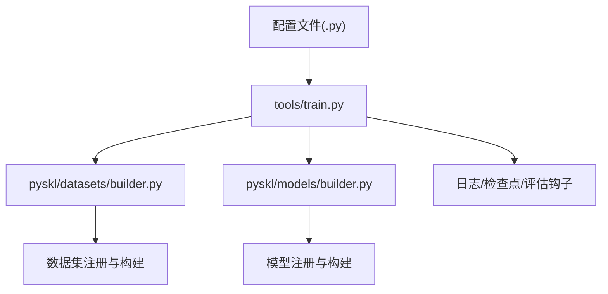
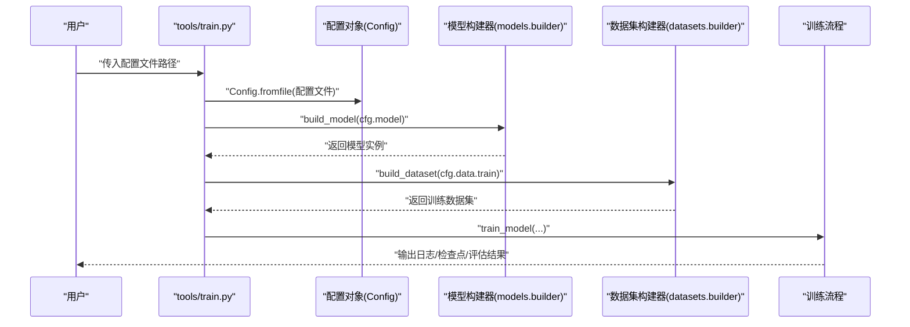
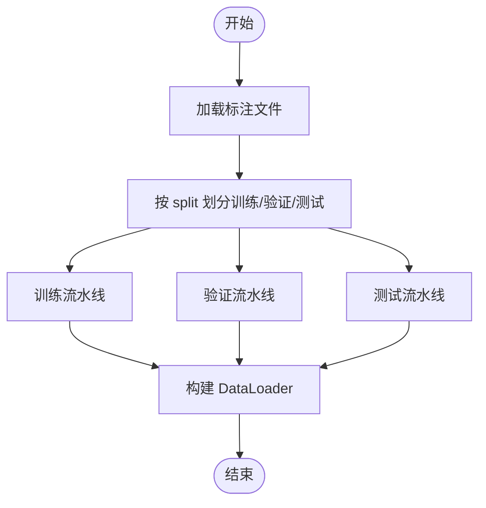
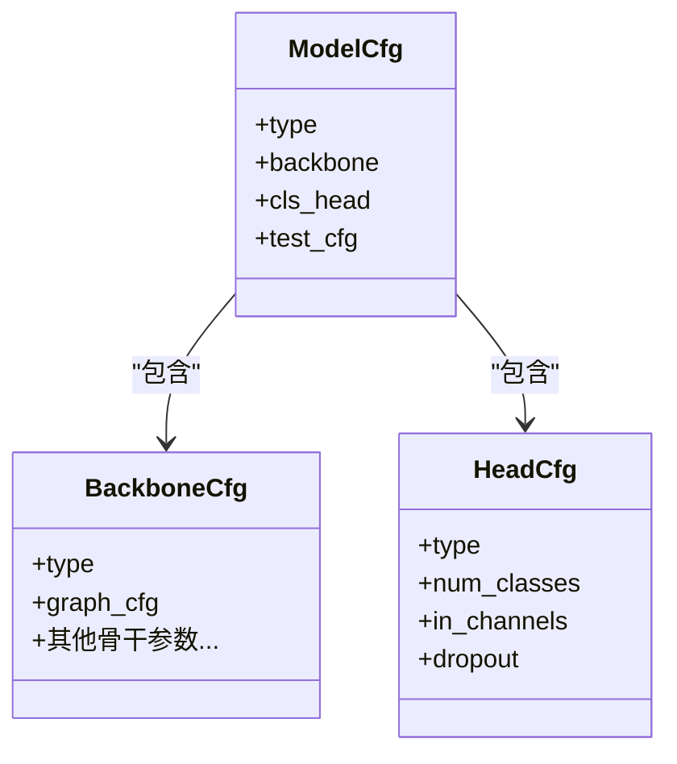
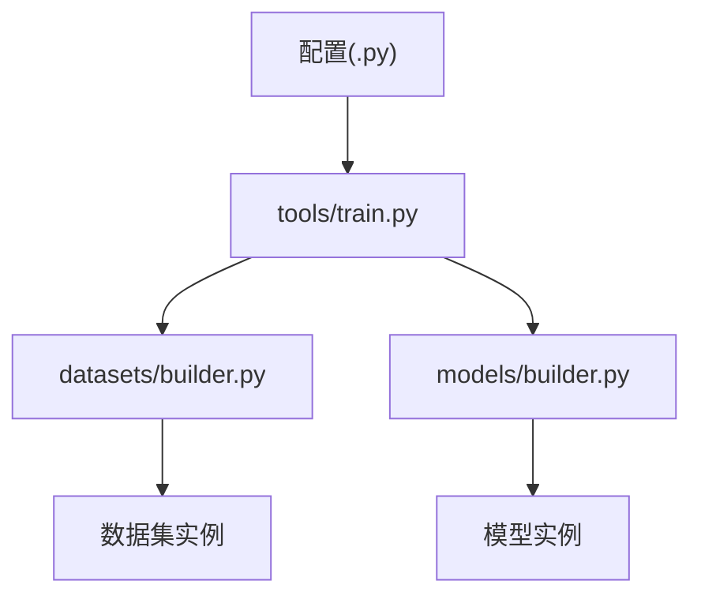

# 配置系统

<cite>
**本文引用的文件**
- [configs/stgcn/stgcn_pyskl_ntu120_xset_3dkp/b.py](file://configs/stgcn/stgcn_pyskl_ntu120_xset_3dkp/b.py)
- [configs/stgcn/stgcn_pyskl_ntu120_xset_3dkp/jm.py](file://configs/stgcn/stgcn_pyskl_ntu120_xset_3dkp/jm.py)
- [configs/stgcn/stgcn_pyskl_ntu120_xset_3dkp/bm.py](file://configs/stgcn/stgcn_pyskl_ntu120_xset_3dkp/bm.py)
- [configs/aagcn/aagcn_pyskl_ntu60_xsub_3dkp/b.py](file://configs/aagcn/aagcn_pyskl_ntu60_xsub_3dkp/b.py)
- [configs/posec3d/slowonly_r50_ntu60_xsub/joint.py](file://configs/posec3d/slowonly_r50_ntu60_xsub/joint.py)
- [configs/msg3d/msg3d_pyskl_ntu60_xsub_3dkp/b.py](file://configs/msg3d/msg3d_pyskl_ntu60_xsub_3dkp/b.py)
- [tools/train.py](file://tools/train.py)
- [pyskl/datasets/builder.py](file://pyskl/datasets/builder.py)
- [pyskl/models/builder.py](file://pyskl/models/builder.py)
- [pyskl.yaml](file://pyskl.yaml)
- [configs/stgcn/README.md](file://configs/stgcn/README.md)
- [configs/aagcn/README.md](file://configs/aagcn/README.md)
- [configs/posec3d/README.md](file://configs/posec3d/README.md)
</cite>

## 目录
1. [简介](#简介)
2. [项目结构](#项目结构)
3. [核心组件](#核心组件)
4. [架构总览](#架构总览)
5. [详细组件分析](#详细组件分析)
6. [依赖分析](#依赖分析)
7. [性能考虑](#性能考虑)
8. [故障排查指南](#故障排查指南)
9. [结论](#结论)
10. [附录](#附录)

## 简介
本文件为 PySKL 配置系统的详细 API 文档，面向使用者与开发者，系统性说明配置文件的两种格式（Python 字典格式与 YAML 格式）、参数结构与嵌套关系；详解配置的三大核心部分：数据集配置（训练/验证/测试划分、数据增强与预处理流水线）、模型配置（网络架构、层数、通道数、图结构与激活等）、训练配置（优化器、学习率策略、损失与正则）。同时解释配置的继承与派生机制、完整配置模板示例（ST-GCN、AAGCN、PoseC3D、MSG3D 等）、默认值与取值范围、参数间的依赖关系、配置校验与错误提示、调试方法与常见问题排查，并给出按数据集与任务场景定制配置的实践建议。

## 项目结构
PySKL 的配置系统采用“按算法/数据集/模态”分层组织的 Python 字典配置文件（.py），配合工具脚本与框架构建器完成从配置到训练/测试的全链路执行。核心目录与文件如下：
- 配置根目录：configs/
  - 子目录按算法命名（如 stgcn、aagcn、posec3d、msg3d、ctrgcn 等）
  - 每个算法下按数据集与标注方式进一步细分（如 ntu60_xsub_3dkp、ntu120_xset_hrnet 等）
  - 每个子目录内包含若干模态配置文件（如 j.py、b.py、jm.py、bm.py 等）
- 工具脚本：tools/train.py、tools/test.py（训练/测试入口）
- 框架构建器：pyskl/datasets/builder.py、pyskl/models/builder.py
- 环境与依赖：pyskl.yaml

图表来源
- [tools/train.py](file://tools/train.py#L60-L165)
- [pyskl/datasets/builder.py](file://pyskl/datasets/builder.py#L31-L134)
- [pyskl/models/builder.py](file://pyskl/models/builder.py#L32-L39)

章节来源
- [tools/train.py](file://tools/train.py#L60-L165)
- [pyskl/datasets/builder.py](file://pyskl/datasets/builder.py#L31-L134)
- [pyskl/models/builder.py](file://pyskl/models/builder.py#L32-L39)

## 核心组件
- 配置文件（Python 字典格式）
  - 顶层键：model、data、optimizer、optimizer_config、lr_config、total_epochs、checkpoint_config、evaluation、log_config、log_level、work_dir 等
  - data 下包含 train/val/test 数据集定义，以及 videos_per_gpu、workers_per_gpu、test_dataloader 等
  - pipeline 由若干字典组成，描述数据增强与预处理步骤
- 训练入口（tools/train.py）
  - 读取配置文件，初始化分布式环境，构建模型与数据集，启动训练流程
- 构建器（pyskl/datasets/builder.py、pyskl/models/builder.py）
  - 基于 MMEngine/注册表机制动态构建数据集与模型组件

章节来源
- [tools/train.py](file://tools/train.py#L60-L165)
- [pyskl/datasets/builder.py](file://pyskl/datasets/builder.py#L31-L134)
- [pyskl/models/builder.py](file://pyskl/models/builder.py#L32-L39)

## 架构总览
下面的序列图展示了从配置文件到训练执行的关键调用链：

图表来源
- [tools/train.py](file://tools/train.py#L60-L165)
- [pyskl/models/builder.py](file://pyskl/models/builder.py#L32-L39)
- [pyskl/datasets/builder.py](file://pyskl/datasets/builder.py#L31-L45)

## 详细组件分析

### 配置文件格式与语法
- Python 字典格式（推荐）
  - 以 Python 变量形式声明配置项，便于 IDE 提示与静态检查
  - 典型键：model、data、optimizer、optimizer_config、lr_config、total_epochs、checkpoint_config、evaluation、log_config、log_level、work_dir
  - data 键下包含 train/val/test，每个子键可直接指定 type、ann_file、pipeline、split 等
  - pipeline 为有序字典列表，描述数据增强与预处理步骤
- YAML 格式（可选）
  - 通过 Config.fromfile 支持 YAML 输入，但仓库中主要使用 .py 配置
  - 若需使用 YAML，请确保键名与类型与 .py 配置一致

章节来源
- [configs/stgcn/stgcn_pyskl_ntu120_xset_3dkp/b.py](file://configs/stgcn/stgcn_pyskl_ntu120_xset_3dkp/b.py#L1-L61)
- [configs/posec3d/slowonly_r50_ntu60_xsub/joint.py](file://configs/posec3d/slowonly_r50_ntu60_xsub/joint.py#L1-L80)
- [pyskl.yaml](file://pyskl.yaml#L1-L132)

### 数据集配置（训练/验证/测试、数据增强与流水线）
- 关键字段
  - dataset_type、ann_file：数据集类型与标注文件路径
  - train/val/test：分别定义训练/验证/测试数据集
  - split：数据划分（如 xsub_train/xsub_val/xset_train/xset_val 等）
  - pipeline：数据增强与预处理步骤列表
  - videos_per_gpu、workers_per_gpu、test_dataloader.videos_per_gpu：批量大小与并行度
- 流水线典型步骤（示例）
  - 3D 骨骼：PreNormalize3D、GenSkeFeat、UniformSample、PoseDecode、FormatGCNInput、Collect、ToTensor
  - 视频骨架：UniformSampleFrames、PoseDecode、PoseCompact、Resize、RandomResizedCrop、Flip、GeneratePoseTarget、FormatShape、Collect、ToTensor
- 示例参考
  - ST-GCN（3D 骨骼）：见 b.py、jm.py、bm.py
  - AAGCN（3D 骨骼）：见 b.py
  - PoseC3D（视频骨架）：见 joint.py
  - MSG3D（3D 骨骼）：见 b.py

图表来源
- [configs/stgcn/stgcn_pyskl_ntu120_xset_3dkp/b.py](file://configs/stgcn/stgcn_pyskl_ntu120_xset_3dkp/b.py#L37-L46)
- [configs/posec3d/slowonly_r50_ntu60_xsub/joint.py](file://configs/posec3d/slowonly_r50_ntu60_xsub/joint.py#L59-L68)

章节来源
- [configs/stgcn/stgcn_pyskl_ntu120_xset_3dkp/b.py](file://configs/stgcn/stgcn_pyskl_ntu120_xset_3dkp/b.py#L8-L46)
- [configs/aagcn/aagcn_pyskl_ntu60_xsub_3dkp/b.py](file://configs/aagcn/aagcn_pyskl_ntu60_xsub_3dkp/b.py#L8-L46)
- [configs/posec3d/slowonly_r50_ntu60_xsub/joint.py](file://configs/posec3d/slowonly_r50_ntu60_xsub/joint.py#L22-L68)
- [configs/msg3d/msg3d_pyskl_ntu60_xsub_3dkp/b.py](file://configs/msg3d/msg3d_pyskl_ntu60_xsub_3dkp/b.py#L8-L46)

### 模型配置（网络架构、图结构、头结构）
- 关键字段
  - model.type：识别器类型（如 RecognizerGCN、Recognizer3D）
  - model.backbone：骨干网络配置
    - STGCN/AAGCN/MSG3D：graph_cfg（layout、mode）
    - ResNet3dSlowOnly：in_channels、base_channels、num_stages、stage_blocks、inflate、spatial_strides、temporal_strides 等
  - model.cls_head：分类头配置（type、num_classes、in_channels、dropout 等）
  - test_cfg：测试阶段配置（如 average_clips）
- 示例参考
  - ST-GCN：见 b.py、jm.py、bm.py
  - AAGCN：见 b.py
  - PoseC3D：见 joint.py
  - MSG3D：见 b.py

图表来源
- [configs/stgcn/stgcn_pyskl_ntu120_xset_3dkp/b.py](file://configs/stgcn/stgcn_pyskl_ntu120_xset_3dkp/b.py#L1-L6)
- [configs/posec3d/slowonly_r50_ntu60_xsub/joint.py](file://configs/posec3d/slowonly_r50_ntu60_xsub/joint.py#L1-L20)

章节来源
- [configs/stgcn/stgcn_pyskl_ntu120_xset_3dkp/b.py](file://configs/stgcn/stgcn_pyskl_ntu120_xset_3dkp/b.py#L1-L6)
- [configs/aagcn/aagcn_pyskl_ntu60_xsub_3dkp/b.py](file://configs/aagcn/aagcn_pyskl_ntu60_xsub_3dkp/b.py#L1-L6)
- [configs/posec3d/slowonly_r50_ntu60_xsub/joint.py](file://configs/posec3d/slowonly_r50_ntu60_xsub/joint.py#L1-L20)
- [configs/msg3d/msg3d_pyskl_ntu60_xsub_3dkp/b.py](file://configs/msg3d/msg3d_pyskl_ntu60_xsub_3dkp/b.py#L1-L6)

### 训练配置（优化器、学习率、损失与正则）
- 关键字段
  - optimizer：优化器类型、学习率、动量、权重衰减、Nesterov 等
  - optimizer_config：梯度裁剪等配置
  - lr_config：学习率策略（如 CosineAnnealing）、最小学习率、是否按轮次更新
  - total_epochs：总训练轮次
  - checkpoint_config：检查点间隔
  - evaluation：评估指标与间隔
  - log_config/log_level：日志频率与级别
  - work_dir：工作目录
- 示例参考
  - ST-GCN：见 b.py、jm.py、bm.py
  - AAGCN：见 b.py
  - PoseC3D：见 joint.py
  - MSG3D：见 b.py

章节来源
- [configs/stgcn/stgcn_pyskl_ntu120_xset_3dkp/b.py](file://configs/stgcn/stgcn_pyskl_ntu120_xset_3dkp/b.py#L48-L61)
- [configs/aagcn/aagcn_pyskl_ntu60_xsub_3dkp/b.py](file://configs/aagcn/aagcn_pyskl_ntu60_xsub_3dkp/b.py#L48-L61)
- [configs/posec3d/slowonly_r50_ntu60_xsub/joint.py](file://configs/posec3d/slowonly_r50_ntu60_xsub/joint.py#L69-L80)
- [configs/msg3d/msg3d_pyskl_ntu60_xsub_3dkp/b.py](file://configs/msg3d/msg3d_pyskl_ntu60_xsub_3dkp/b.py#L48-L61)

### 继承与派生机制
- 配置派生
  - 在同一算法/数据集目录下，不同模态（j/b/jm/bm）共享基础结构，仅替换 feats 或 split 等差异项
  - 可通过复制基础配置文件并局部修改实现快速派生
- 实践建议
  - 将公共参数上提至基础配置，再在子配置中覆盖差异项
  - 使用注释明确各参数的作用域与来源

章节来源
- [configs/stgcn/stgcn_pyskl_ntu120_xset_3dkp/b.py](file://configs/stgcn/stgcn_pyskl_ntu120_xset_3dkp/b.py#L1-L61)
- [configs/stgcn/stgcn_pyskl_ntu120_xset_3dkp/jm.py](file://configs/stgcn/stgcn_pyskl_ntu120_xset_3dkp/jm.py#L1-L61)
- [configs/stgcn/stgcn_pyskl_ntu120_xset_3dkp/bm.py](file://configs/stgcn/stgcn_pyskl_ntu120_xset_3dkp/bm.py#L1-L61)

### 完整配置模板与示例
- ST-GCN（NTURGB+D）
  - 3D 骨骼：见 configs/stgcn/stgcn_pyskl_ntu120_xset_3dkp/{b,j,jm,bm}.py
  - HRNet 2D 骨骼：见 configs/stgcn/stgcn_pyskl_ntu120_xset_hrnet/{b,j,jm,bm}.py
- AAGCN（NTURGB+D）
  - 3D 骨骼：见 configs/aagcn/aagcn_pyskl_ntu60_xsub_3dkp/{b,j,jm,bm}.py
  - HRNet 2D 骨骼：见 configs/aagcn/aagcn_pyskl_ntu60_xsub_hrnet/{b,j,jm,bm}.py
- PoseC3D（多数据集/多骨干）
  - 见 configs/posec3d/*/joint.py、limb.py
- MSG3D（NTURGB+D）
  - 3D 骨骼：见 configs/msg3d/msg3d_pyskl_ntu60_xsub_3dkp/{b,j,jm,bm}.py

章节来源
- [configs/stgcn/README.md](file://configs/stgcn/README.md#L1-L67)
- [configs/aagcn/README.md](file://configs/aagcn/README.md#L1-L59)
- [configs/posec3d/README.md](file://configs/posec3d/README.md#L1-L120)

### 参数默认值、取值范围与依赖关系
- 默认值与取值范围
  - videos_per_gpu、workers_per_gpu：通常为正整数，受显存与 CPU 资源限制
  - lr（学习率）：通常为正浮点数，需与 batch size 成比例缩放
  - weight_decay：非负浮点数
  - clip_len、num_clips：正整数，影响输入时序长度与多片段采样
  - num_classes：正整数，与数据集类别数一致
- 依赖关系
  - pipeline 中的步骤顺序严格，例如 PreNormalize3D 应在 GenSkeFeat 前
  - graph_cfg.layout 与 mode 必须与所选骨干网络兼容
  - test_cfg.average_clips 与测试阶段的多片段采样策略一致

章节来源
- [configs/stgcn/stgcn_pyskl_ntu120_xset_3dkp/b.py](file://configs/stgcn/stgcn_pyskl_ntu120_xset_3dkp/b.py#L10-L36)
- [configs/posec3d/slowonly_r50_ntu60_xsub/joint.py](file://configs/posec3d/slowonly_r50_ntu60_xsub/joint.py#L26-L58)

### 配置验证与错误提示
- 运行时校验
  - tools/train.py 会读取配置并进行基本校验（如 cudnn_benchmark、dist_params、work_dir 等）
  - 若未显式设置 dist_params，则自动填充默认后端
- 常见错误与提示
  - 缺少必需键：如 model、data、optimizer 等
  - 数据集 split 不匹配或 ann_file 路径错误
  - pipeline 步骤缺失或顺序不当
  - 图结构参数与骨干网络不兼容
- 建议
  - 使用 IDE/静态检查工具辅助发现拼写与类型错误
  - 逐步注释/启用 pipeline 步骤定位问题

章节来源
- [tools/train.py](file://tools/train.py#L60-L165)

### 调试方法与常见问题排查
- 日志与检查点
  - log_config.interval 控制日志打印频率；checkpoint_config.interval 控制保存频率
  - work_dir 记录训练过程中的日志与权重文件
- 分布式与资源
  - 确认分布式后端与 GPU 数量匹配；必要时调整 videos_per_gpu 与 lr
- 多片段测试耗时
  - PoseC3D 的多片段测试（num_clips=10）可能较慢，可按 README 提示调整
- 数据加载异常
  - 检查 ann_file 是否存在、split 是否正确、pipeline 是否与数据格式匹配

章节来源
- [configs/posec3d/README.md](file://configs/posec3d/README.md#L52-L66)
- [tools/train.py](file://tools/train.py#L88-L96)

### 按场景定制配置
- 更换数据集
  - 修改 dataset_type、ann_file、split；确保 pipeline 与新数据格式兼容
- 调整时序长度
  - UniformSample/UniformSampleFrames 的 clip_len 与 num_clips
- 替换骨干网络
  - 更新 model.backbone 的 type 与相关参数（如 graph_cfg、stage_blocks、inflate 等）
- 调整学习率与训练轮次
  - lr_config 与 total_epochs；遵循线性缩放规则

章节来源
- [configs/stgcn/stgcn_pyskl_ntu120_xset_3dkp/b.py](file://configs/stgcn/stgcn_pyskl_ntu120_xset_3dkp/b.py#L37-L53)
- [configs/posec3d/slowonly_r50_ntu60_xsub/joint.py](file://configs/posec3d/slowonly_r50_ntu60_xsub/joint.py#L59-L74)

## 依赖分析
- 配置到执行的依赖
  - tools/train.py 依赖 Config.fromfile 加载配置
  - 训练流程依赖 datasets/builder.py 与 models/builder.py 动态构建组件
- 组件耦合
  - 配置文件与构建器通过键名与类型字符串解耦
  - pipeline 与数据集类型强相关，需保持一致

图表来源
- [tools/train.py](file://tools/train.py#L60-L165)
- [pyskl/datasets/builder.py](file://pyskl/datasets/builder.py#L31-L134)
- [pyskl/models/builder.py](file://pyskl/models/builder.py#L32-L39)

章节来源
- [tools/train.py](file://tools/train.py#L60-L165)
- [pyskl/datasets/builder.py](file://pyskl/datasets/builder.py#L31-L134)
- [pyskl/models/builder.py](file://pyskl/models/builder.py#L32-L39)

## 性能考虑
- 批大小与学习率
  - 遵循线性缩放规则：batch size 增大时按比例提升初始学习率
- 多 GPU 训练
  - 使用分布式后端（nccl）与合适的 videos_per_gpu
- I/O 与内存
  - 合理设置 workers_per_gpu；必要时启用 pin_memory 与持久化 worker
- 测试效率
  - PoseC3D 的多片段测试可按需关闭以降低耗时

章节来源
- [configs/stgcn/README.md](file://configs/stgcn/README.md#L46-L47)
- [configs/aagcn/README.md](file://configs/aagcn/README.md#L38-L39)
- [configs/posec3d/README.md](file://configs/posec3d/README.md#L50-L51)

## 故障排查指南
- 训练启动失败
  - 检查配置文件路径与权限；确认 Config.fromfile 能正常解析
- 分布式训练异常
  - 核对 dist_params.backend 与 GPU 数量；确保 NCCL 环境变量正确
- 数据加载错误
  - 核对 ann_file 与 split；逐条注释 pipeline 步骤定位问题
- 内存不足
  - 降低 videos_per_gpu 或 clip_len；减少 workers_per_gpu

章节来源
- [tools/train.py](file://tools/train.py#L75-L81)
- [pyskl/datasets/builder.py](file://pyskl/datasets/builder.py#L48-L124)

## 结论
PySKL 的配置系统以 Python 字典格式为核心，结合工具脚本与注册表构建器，形成清晰、可扩展且易于调试的训练/测试流程。通过合理的参数组织、严格的依赖约束与完善的日志/检查点机制，用户可以快速适配不同算法、数据集与任务场景，并在出现问题时高效定位与修复。

## 附录
- 环境与依赖
  - pyskl.yaml 定义了运行所需的 Python 版本、PyTorch、mmcv/mmpose 等依赖版本
- 算法与模型清单
  - ST-GCN、AAGCN、PoseC3D、MSG3D 等算法均有对应配置模板与 README 说明

章节来源
- [pyskl.yaml](file://pyskl.yaml#L1-L132)
- [configs/stgcn/README.md](file://configs/stgcn/README.md#L1-L67)
- [configs/aagcn/README.md](file://configs/aagcn/README.md#L1-L59)
- [configs/posec3d/README.md](file://configs/posec3d/README.md#L1-L120)