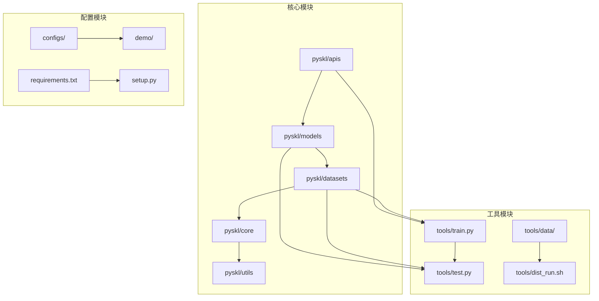
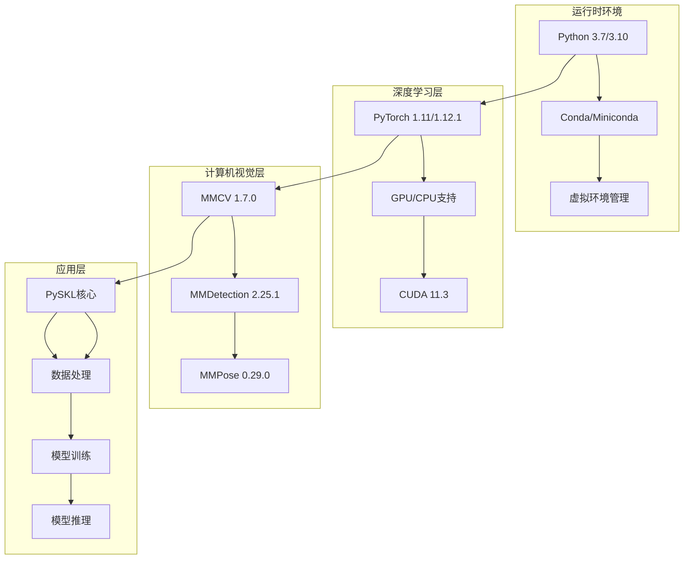
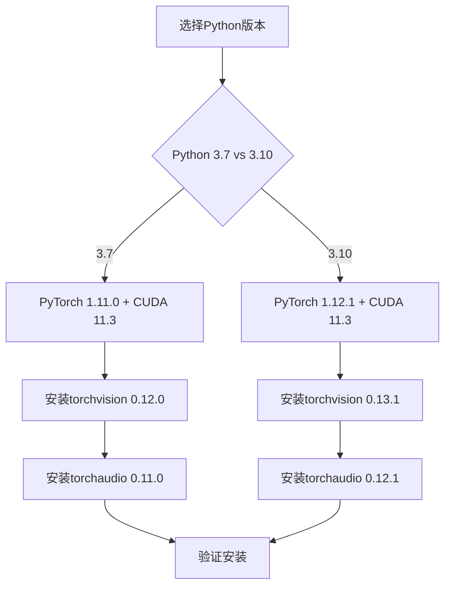
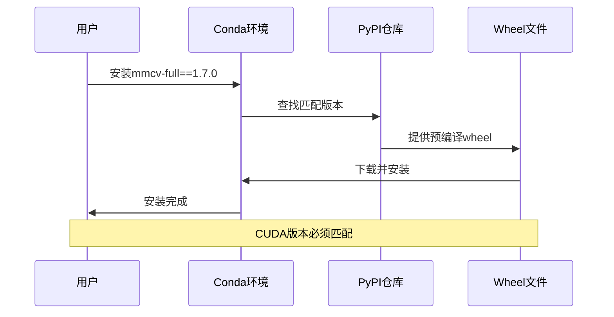
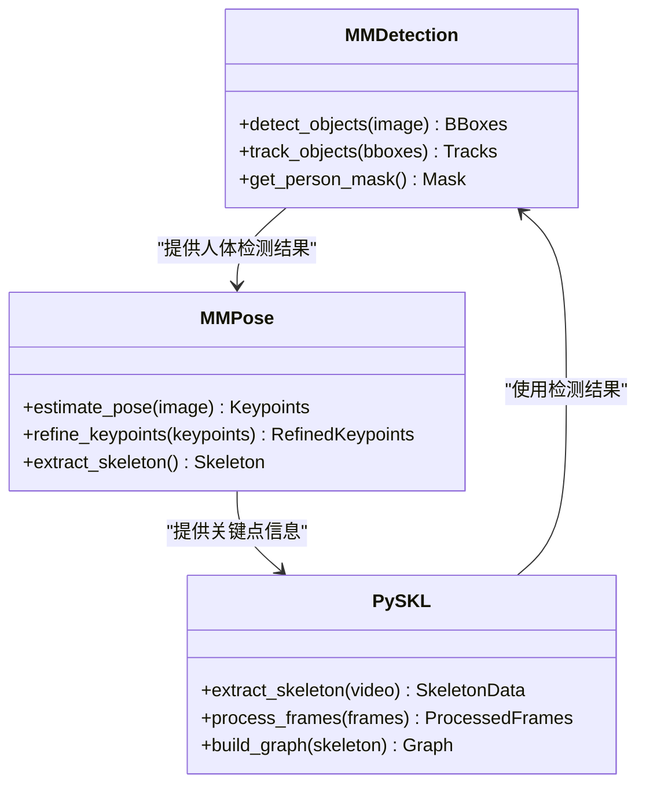
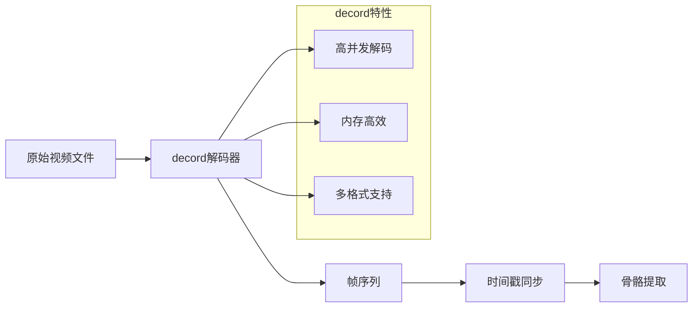
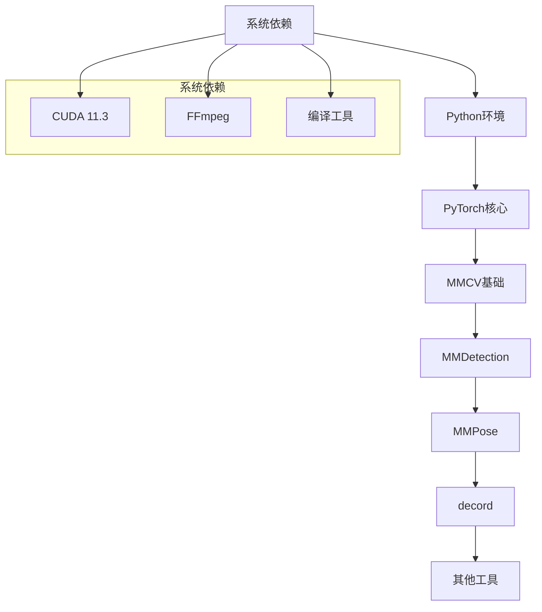
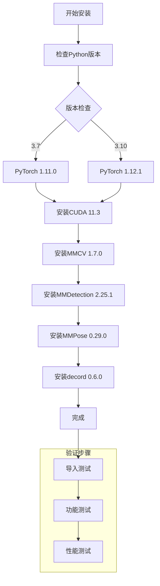
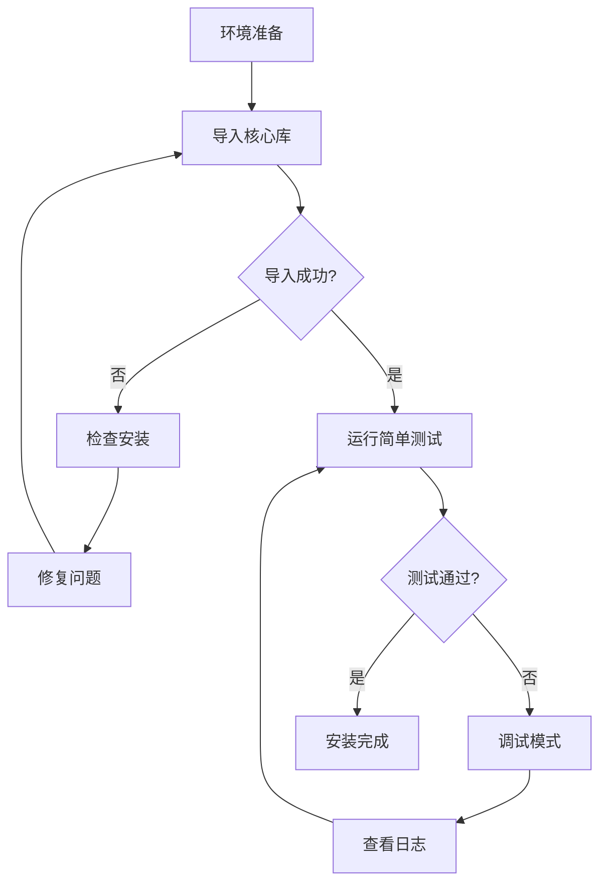

# 依赖安装

<cite>
**本文档引用的文件**
- [requirements.txt](file://requirements.txt)
- [setup.py](file://setup.py)
- [README.md](file://README.md)
- [pyskl/version.py](file://pyskl/version.py)
- [pyskl.yaml](file://pyskl.yaml)
- [pyskl_310.yaml](file://pyskl_310.yaml)
- [pyskl_win.yaml](file://pyskl_win.yaml)
- [tools/train.py](file://tools/train.py)
- [tools/test.py](file://tools/test.py)
- [pyskl/utils/collect_env.py](file://pyskl/utils/collect_env.py)
</cite>

## 更新摘要
**所做更改**
- 更新了MMCV版本从1.5.0到1.7.0
- 更新了MMDetection版本从2.23.0到2.25.1
- 更新了MMPose版本从0.24.0到0.29.0
- 更新了Python 3.10环境的依赖版本矩阵
- 更新了安装顺序和版本兼容性信息

## 目录
1. [简介](#简介)
2. [项目结构](#项目结构)
3. [核心依赖组件](#核心依赖组件)
4. [架构概览](#架构概览)
5. [详细组件分析](#详细组件分析)
6. [依赖关系分析](#依赖关系分析)
7. [性能考虑](#性能考虑)
8. [故障排除指南](#故障排除指南)
9. [结论](#结论)

## 简介

PySKL是一个基于PyTorch的骨架动作识别工具箱，构建于开源项目MMAction2之上。该项目提供了多种骨架动作识别算法的实现，包括STGCN、AAGCN、DG-STGCN等，并支持多种数据集如NTU RGB+D、Kinetics等。

本指南专注于PySKL项目的依赖安装，详细说明了各个依赖包的安装顺序、优先级、作用和版本要求，以及CUDA版本与PyTorch版本的匹配关系。

## 项目结构

PySKL项目采用模块化设计，主要包含以下核心组件：

**图表来源**
- [setup.py](file://setup.py#L102-L128)
- [tools/train.py](file://tools/train.py#L15-L19)
- [tools/test.py](file://tools/test.py#L19-L21)

**章节来源**
- [setup.py](file://setup.py#L1-L129)
- [README.md](file://README.md#L1-L116)

## 核心依赖组件

根据项目配置文件，PySKL的核心依赖组件如下：

### 核心深度学习框架
- **PyTorch >= 1.5**: 深度学习框架核心，提供张量计算和神经网络功能
- **torchvision**: PyTorch的计算机视觉扩展库
- **torchaudio**: PyTorch的音频处理库

### 计算机视觉基础
- **MMCV 1.7.0**: OpenMMLab的计算机视觉基础库，提供数据处理和模型构建功能
- **MMDetection 2.25.1**: 目标检测算法库，用于人体检测和姿态估计
- **MMPose 0.29.0**: 姿态估计算法库，提供人体关键点检测功能

### 视频处理
- **decord >= 0.6.0**: 高性能视频解码库，用于视频帧提取和处理

### 辅助工具
- **NumPy >= 1.19.5**: 数值计算基础库
- **OpenCV**: 图像处理和计算机视觉库
- **Matplotlib**: 数据可视化库
- **SciPy**: 科学计算库

**章节来源**
- [requirements.txt](file://requirements.txt#L1-L14)
- [pyskl.yaml](file://pyskl.yaml#L59-L67)
- [pyskl_310.yaml](file://pyskl_310.yaml#L59-L67)

## 架构概览

PySKL的依赖架构遵循分层设计原则，确保各组件之间的兼容性和可维护性：

**图表来源**
- [pyskl.yaml](file://pyskl.yaml#L16-L67)
- [pyskl_310.yaml](file://pyskl_310.yaml#L16-L67)
- [requirements.txt](file://requirements.txt#L1-L14)

## 详细组件分析

### PyTorch安装策略

PyTorch作为核心深度学习框架，需要与CUDA版本精确匹配：

**图表来源**
- [pyskl.yaml](file://pyskl.yaml#L59-L67)
- [pyskl_310.yaml](file://pyskl_310.yaml#L59-L67)

#### 版本兼容性矩阵

| 组件 | Python 3.7 | Python 3.10 |
|------|------------|-------------|
| PyTorch | 1.11.0 | 1.12.1 |
| torchvision | 0.12.0 | 0.13.1 |
| torchaudio | 0.11.0 | 0.12.1 |
| CUDA | 11.3 | 11.3 |
| MMCV | 1.7.0 | 1.7.0 |

**更新** 版本兼容性矩阵已更新，MMCV版本从1.5.0升级到1.7.0

**章节来源**
- [pyskl.yaml](file://pyskl.yaml#L59-L67)
- [pyskl_310.yaml](file://pyskl_310.yaml#L59-L67)

### MMCV安装策略

MMCV是OpenMMLab生态系统的基础设施，提供数据处理和模型构建功能：

**图表来源**
- [requirements.txt](file://requirements.txt#L4)
- [pyskl.yaml](file://pyskl.yaml#L96)

#### 安装注意事项

1. **wheel文件下载**: 使用OpenMMLab提供的官方wheel文件，确保CUDA版本匹配
2. **版本锁定**: 严格使用指定版本号，避免版本冲突
3. **依赖链**: MMCV会自动安装其依赖项，无需手动安装

**更新** MMCV版本已从1.5.0升级到1.7.0

**章节来源**
- [requirements.txt](file://requirements.txt#L4)
- [pyskl.yaml](file://pyskl.yaml#L96)

### MMDetection和MMPose集成

这两个库提供目标检测和姿态估计算法，是骨架提取的重要组件：

**图表来源**
- [requirements.txt](file://requirements.txt#L5-L6)
- [pyskl.yaml](file://pyskl.yaml#L97-L98)

**更新** MMDetection版本已从2.23.0升级到2.25.1，MMPose版本已从0.24.0升级到0.29.0

**章节来源**
- [requirements.txt](file://requirements.txt#L5-L6)
- [pyskl.yaml](file://pyskl.yaml#L97-L98)

### decord视频解码器

decord专门用于高性能视频解码，是处理视频输入的关键组件：

**图表来源**
- [requirements.txt](file://requirements.txt#L1)
- [pyskl.yaml](file://pyskl.yaml#L84)

**章节来源**
- [requirements.txt](file://requirements.txt#L1)
- [pyskl.yaml](file://pyskl.yaml#L84)

## 依赖关系分析

### 安装顺序和优先级

根据项目依赖关系，建议按照以下顺序安装：

**图表来源**
- [requirements.txt](file://requirements.txt#L1-L14)
- [pyskl.yaml](file://pyskl.yaml#L16-L17)

### 版本兼容性检查

**更新** 版本兼容性检查流程已更新，反映了最新的依赖版本

**图表来源**
- [pyskl_310.yaml](file://pyskl_310.yaml#L59-L67)
- [pyskl.yaml](file://pyskl.yaml#L59-L67)

**章节来源**
- [requirements.txt](file://requirements.txt#L1-L14)
- [pyskl_310.yaml](file://pyskl_310.yaml#L59-L67)

## 性能考虑

### CUDA版本匹配

正确的CUDA版本匹配对性能至关重要：

| PyTorch版本 | 推荐CUDA版本 | 性能影响 |
|-------------|--------------|----------|
| 1.11.0 | 11.3 | 最佳性能 |
| 1.12.1 | 11.3 | 最佳性能 |
| 1.13.x | 11.6-11.8 | 轻微性能下降 |
| 1.14.x | 11.8-12.1 | 显著性能下降 |

### 内存优化策略

1. **批处理大小调整**: 根据GPU内存调整batch size
2. **混合精度训练**: 启用AMP提高吞吐量
3. **梯度累积**: 在内存受限时使用

## 故障排除指南

### 常见安装问题

#### 1. CUDA版本不匹配
**症状**: PyTorch安装失败或运行时报CUDA错误
**解决方案**:
- 卸载当前PyTorch版本
- 安装与CUDA版本匹配的PyTorch
- 重新安装MMCV

#### 2. wheel文件下载失败
**症状**: pip安装MMCV时下载超时
**解决方案**:
- 使用OpenMMLab官方镜像源
- 手动下载wheel文件后本地安装
- 检查网络连接和防火墙设置

#### 3. 依赖冲突
**症状**: conda环境中包版本冲突
**解决方案**:
- 创建全新的conda环境
- 按照推荐版本顺序安装
- 使用pip安装特定版本的包

### 环境验证

**图表来源**
- [tools/train.py](file://tools/train.py#L101-L105)
- [pyskl/utils/collect_env.py](file://pyskl/utils/collect_env.py#L8-L12)

**章节来源**
- [tools/train.py](file://tools/train.py#L101-L105)
- [pyskl/utils/collect_env.py](file://pyskl/utils/collect_env.py#L8-L12)

## 结论

PySKL的依赖安装需要严格遵循版本匹配和安装顺序。关键要点包括：

1. **CUDA版本匹配**: PyTorch 1.11.0对应CUDA 11.3，PyTorch 1.12.1也对应CUDA 11.3
2. **MMCV特殊处理**: 使用OpenMMLab提供的wheel文件，确保CUDA版本正确
3. **安装顺序**: 先安装PyTorch核心，再安装MMCV 1.7.0，最后安装MMDetection 2.25.1和MMPose 0.29.0
4. **环境隔离**: 使用conda虚拟环境避免依赖冲突
5. **验证测试**: 安装完成后进行功能测试确保所有组件正常工作

**更新** 本次更新反映了依赖版本的重大升级，特别是MMCV从1.5.0升级到1.7.0，以及MMDetection和MMPose版本的相应更新。这些变化提高了系统的稳定性和功能完整性，同时保持了与现有安装流程的兼容性。

遵循这些指导原则可以确保PySKL在各种操作系统上稳定运行，为骨架动作识别任务提供可靠的基础环境。