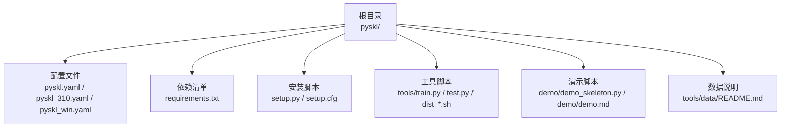
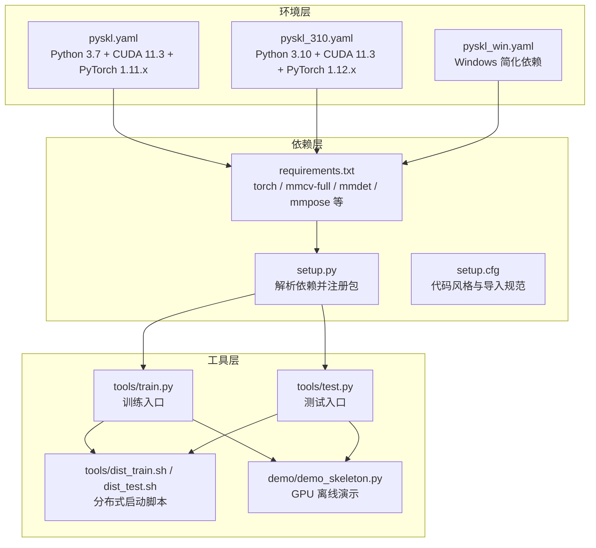
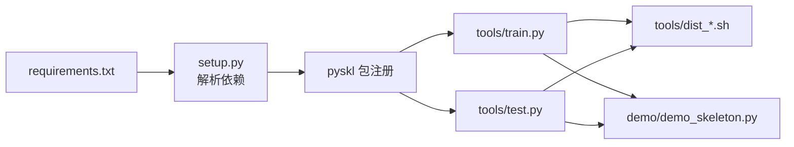

# 安装与配置

<cite>
**本文引用的文件**
- [README.md](file://README.md)
- [demo.md](file://demo/demo.md)
- [pyskl.yaml](file://pyskl.yaml)
- [pyskl_310.yaml](file://pyskl_310.yaml)
- [pyskl_win.yaml](file://pyskl_win.yaml)
- [requirements.txt](file://requirements.txt)
- [setup.py](file://setup.py)
- [setup.cfg](file://setup.cfg)
- [collect_env.py](file://pyskl/utils/collect_env.py)
- [train.py](file://tools/train.py)
- [test.py](file://tools/test.py)
- [dist_train.sh](file://tools/dist_train.sh)
- [dist_test.sh](file://tools/dist_test.sh)
- [demo_skeleton.py](file://demo/demo_skeleton.py)
- [README.md（数据说明）](file://tools/data/README.md)
</cite>

## 目录
1. [简介](#简介)
2. [项目结构](#项目结构)
3. [核心组件](#核心组件)
4. [架构总览](#架构总览)
5. [详细组件分析](#详细组件分析)
6. [依赖关系分析](#依赖关系分析)
7. [性能考虑](#性能考虑)
8. [故障排除指南](#故障排除指南)
9. [结论](#结论)
10. [附录](#附录)

## 简介
本指南面向首次安装与配置 PySKL 的用户，覆盖以下内容：
- 环境配置文件的作用与差异：pyskl.yaml、pyskl_310.yaml、pyskl_win.yaml 的适用场景与参数说明
- 依赖包安装顺序与版本要求，重点解释 PyTorch、MMCV、MMDetection、MMPose 的作用与兼容性
- 跨平台（Windows、Linux、macOS）差异化安装指导
- 虚拟环境管理最佳实践（conda 与 pip 的协同）
- 环境变量、路径与权限配置
- 安装验证步骤（CUDA、GPU 可用性、PyTorch 后端）
- 常见问题排查与性能优化建议

## 项目结构
PySKL 采用“根目录 + 配置文件 + 工具脚本 + 示例”的组织方式，便于通过 Conda 环境快速复现依赖，并使用 pip 进行本地开发安装。

图表来源
- [pyskl.yaml](file://pyskl.yaml#L1-L132)
- [pyskl_310.yaml](file://pyskl_310.yaml#L1-L131)
- [pyskl_win.yaml](file://pyskl_win.yaml#L1-L42)
- [requirements.txt](file://requirements.txt#L1-L14)
- [setup.py](file://setup.py#L1-L129)
- [setup.cfg](file://setup.cfg#L1-L25)
- [train.py](file://tools/train.py#L1-L165)
- [test.py](file://tools/test.py#L1-L185)
- [dist_train.sh](file://tools/dist_train.sh#L1-L12)
- [dist_test.sh](file://tools/dist_test.sh#L1-L13)
- [demo_skeleton.py](file://demo/demo_skeleton.py#L1-L200)
- [README.md（数据说明）](file://tools/data/README.md#L1-L119)

章节来源
- [README.md](file://README.md#L49-L66)
- [pyskl.yaml](file://pyskl.yaml#L1-L132)
- [pyskl_310.yaml](file://pyskl_310.yaml#L1-L131)
- [pyskl_win.yaml](file://pyskl_win.yaml#L1-L42)
- [requirements.txt](file://requirements.txt#L1-L14)
- [setup.py](file://setup.py#L101-L129)
- [setup.cfg](file://setup.cfg#L1-L25)
- [train.py](file://tools/train.py#L60-L165)
- [test.py](file://tools/test.py#L110-L185)
- [dist_train.sh](file://tools/dist_train.sh#L1-L12)
- [dist_test.sh](file://tools/dist_test.sh#L1-L13)
- [demo_skeleton.py](file://demo/demo_skeleton.py#L1-L200)
- [README.md（数据说明）](file://tools/data/README.md#L1-L119)

## 核心组件
- 环境配置文件
  - pyskl.yaml：适用于 Python 3.7 + CUDA 11.3 + PyTorch 1.11.x 的默认环境
  - pyskl_310.yaml：适用于 Python 3.10 + CUDA 11.3 + PyTorch 1.12.x 的升级版环境
  - pyskl_win.yaml：Windows 平台专用，简化依赖与索引源
- 依赖清单 requirements.txt：定义核心 Python 包及其版本范围
- 安装脚本 setup.py：解析 requirements.txt 并注册包元信息
- 工具脚本 tools/train.py、tools/test.py：训练与测试入口，支持分布式与 PyTorch 2.0 编译
- 演示脚本 demo/demo_skeleton.py：GPU 离线演示骨架动作识别
- 数据说明 tools/data/README.md：骨架数据格式与下载链接

章节来源
- [pyskl.yaml](file://pyskl.yaml#L1-L132)
- [pyskl_310.yaml](file://pyskl_310.yaml#L1-L131)
- [pyskl_win.yaml](file://pyskl_win.yaml#L1-L42)
- [requirements.txt](file://requirements.txt#L1-L14)
- [setup.py](file://setup.py#L25-L98)
- [train.py](file://tools/train.py#L60-L165)
- [test.py](file://tools/test.py#L110-L185)
- [demo_skeleton.py](file://demo/demo_skeleton.py#L1-L200)
- [README.md（数据说明）](file://tools/data/README.md#L1-L119)

## 架构总览
下图展示从环境准备到运行演示的整体流程，以及关键依赖之间的关系。

图表来源
- [pyskl.yaml](file://pyskl.yaml#L1-L132)
- [pyskl_310.yaml](file://pyskl_310.yaml#L1-L131)
- [pyskl_win.yaml](file://pyskl_win.yaml#L1-L42)
- [requirements.txt](file://requirements.txt#L1-L14)
- [setup.py](file://setup.py#L25-L98)
- [setup.cfg](file://setup.cfg#L1-L25)
- [train.py](file://tools/train.py#L60-L165)
- [test.py](file://tools/test.py#L110-L185)
- [dist_train.sh](file://tools/dist_train.sh#L1-L12)
- [dist_test.sh](file://tools/dist_test.sh#L1-L13)
- [demo_skeleton.py](file://demo/demo_skeleton.py#L1-L200)

## 详细组件分析

### 环境配置文件对比与适用场景
- pyskl.yaml（Python 3.7 + CUDA 11.3 + PyTorch 1.11.x）
  - 适合已有 Python 3.7 生态或需保持稳定性的用户
  - PyTorch 与 torchvision/torchaudio 版本与 cu11.3 对齐
  - 通过 pip 子项安装 mmcv-full、mmdet、mmpose 等
- pyskl_310.yaml（Python 3.10 + CUDA 11.3 + PyTorch 1.12.x）
  - 推荐新项目优先选择，提升稳定性与性能
  - 依赖版本更现代，如 numpy、matplotlib 等
  - 通过 pip 子项安装 mmcv-full==1.7.0、mmdet==2.25.1、mmpose==0.29.0
- pyskl_win.yaml（Windows）
  - 以 pip 子项为主，指定 mmcv-full 的离线索引地址
  - 依赖项更精简，便于 Windows 环境快速搭建

章节来源
- [pyskl.yaml](file://pyskl.yaml#L1-L132)
- [pyskl_310.yaml](file://pyskl_310.yaml#L1-L131)
- [pyskl_win.yaml](file://pyskl_win.yaml#L1-L42)

### 依赖包安装顺序与版本要求
- 安装顺序建议
  1) 使用对应环境文件创建 Conda 环境（推荐）
  2) 在激活环境中执行可编辑安装（pip install -e .）
- 关键依赖项与作用
  - PyTorch：深度学习框架，决定 CUDA 版本与编译选项
  - MMCV/MMCV-Full：计算机视觉基础库，提供数据流水线与算子
  - MMDetection：人体检测（Faster R-CNN）
  - MMPose：姿态估计（HRNet 等）
  - 其他：decord、moviepy、opencv、matplotlib、tqdm 等
- 版本兼容性要点
  - PyTorch 与 CUDA 版本需匹配（例如 1.11.x + cu11.3 或 1.12.x + cu11.3）
  - mmcv-full 与 PyTorch 版本需严格对应（可通过官方索引页选择匹配版本）

章节来源
- [requirements.txt](file://requirements.txt#L1-L14)
- [setup.py](file://setup.py#L25-L98)
- [pyskl.yaml](file://pyskl.yaml#L59-L67)
- [pyskl_310.yaml](file://pyskl_310.yaml#L59-L67)
- [pyskl_win.yaml](file://pyskl_win.yaml#L21-L28)

### 跨平台差异化安装指导
- Linux/macOS
  - 使用 pyskl.yaml 或 pyskl_310.yaml 创建环境
  - 激活后执行 pip install -e .
- Windows
  - 使用 pyskl_win.yaml 创建环境
  - 若网络受限，可按注释中提供的索引地址安装 mmcv-full
- 注意事项
  - 确保系统已正确安装与驱动匹配的 CUDA Toolkit
  - 若使用 conda-forge，默认通道可能与 PyTorch 匹配度更高

章节来源
- [README.md](file://README.md#L49-L66)
- [pyskl_win.yaml](file://pyskl_win.yaml#L1-L42)

### 虚拟环境管理最佳实践（conda 与 pip 协同）
- 建议流程
  - 优先使用环境文件创建隔离环境，确保 Python、PyTorch、CUDA 一致
  - 在激活环境中执行 pip install -e .，以便在开发模式下修改代码即时生效
- setup.py 解析策略
  - 自动读取 requirements.txt 并剥离版本运算符，生成安装列表
  - 支持平台特定依赖声明（通过分号语法）
- 代码风格与导入规范
  - setup.cfg 中配置了 yapf 与 isort，统一代码风格与第三方导入分组

章节来源
- [setup.py](file://setup.py#L25-L98)
- [setup.cfg](file://setup.cfg#L10-L25)

### 环境变量、路径与权限配置
- 分布式训练环境变量
  - dist_train.sh / dist_test.sh 设置 MASTER_PORT、MKL_SERVICE_FORCE_INTEL、PYTHONPATH
- 日志与工作目录
  - 训练脚本会根据配置自动创建 work_dirs 并写入日志
- 权限与路径
  - 确保当前用户对项目目录具有读写权限
  - 若使用自定义数据路径，请确保路径存在且可访问

章节来源
- [dist_train.sh](file://tools/dist_train.sh#L1-L12)
- [dist_test.sh](file://tools/dist_test.sh#L1-L13)
- [train.py](file://tools/train.py#L88-L110)

### 安装验证步骤
- 环境信息收集
  - 通过 pyskl/utils/collect_env.py 输出 PyTorch、MMCV、PySKL 等版本信息
- GPU 可用性与 CUDA
  - 在 Python 中执行 torch.cuda.is_available() 与 torch.version.cuda
- 分布式初始化
  - 运行 tools/train.py 或 tools/test.py 前，确认 NCCL 后端可用（Linux/macOS）
- 演示运行
  - 按 demo/demo.md 准备依赖后，运行 demo/demo_skeleton.py 进行 GPU 离线演示

章节来源
- [collect_env.py](file://pyskl/utils/collect_env.py#L8-L17)
- [demo_skeleton.py](file://demo/demo_skeleton.py#L152-L165)
- [demo.md](file://demo/demo.md#L7-L14)

### 依赖关系分析

图表来源
- [requirements.txt](file://requirements.txt#L1-L14)
- [setup.py](file://setup.py#L25-L98)
- [train.py](file://tools/train.py#L60-L165)
- [test.py](file://tools/test.py#L110-L185)
- [dist_train.sh](file://tools/dist_train.sh#L1-L12)
- [dist_test.sh](file://tools/dist_test.sh#L1-L13)
- [demo_skeleton.py](file://demo/demo_skeleton.py#L1-L200)

章节来源
- [requirements.txt](file://requirements.txt#L1-L14)
- [setup.py](file://setup.py#L25-L98)
- [train.py](file://tools/train.py#L60-L165)
- [test.py](file://tools/test.py#L110-L185)
- [dist_train.sh](file://tools/dist_train.sh#L1-L12)
- [dist_test.sh](file://tools/dist_test.sh#L1-L13)
- [demo_skeleton.py](file://demo/demo_skeleton.py#L1-L200)

## 性能考虑
- PyTorch 2.0 编译（实验特性）
  - 训练/测试脚本支持 --compile 参数，在满足条件时对模型进行编译
- CuDNN 加速
  - 训练脚本可读取配置中的 cudnn_benchmark 标志以启用加速
- 分布式训练
  - 使用 tools/dist_train.sh 与 tools/dist_test.sh 启动多卡训练/测试
- 内存缓存（可选）
  - 针对大体量数据集，可启用 memcached 提升 I/O 性能

章节来源
- [README.md](file://README.md#L22-L28)
- [train.py](file://tools/train.py#L65-L67)
- [train.py](file://tools/train.py#L121-L124)
- [dist_train.sh](file://tools/dist_train.sh#L1-L12)
- [dist_test.sh](file://tools/dist_test.sh#L1-L13)

## 故障排除指南
- Conda 环境创建失败
  - 更新 conda 至较新版本（参考 README 中的提示）
  - 确认 channels 顺序与网络可达性
- PyTorch 与 CUDA 不匹配
  - 检查 PyTorch 与 CUDA 版本映射（如 1.11.x + cu11.3）
  - 卸载不匹配版本后重装
- MMCV 安装异常
  - 使用官方索引页选择与 PyTorch/CUDA 匹配的 mmcv-full 版本
  - Windows 用户可参考 pyskl_win.yaml 中的索引地址
- 分布式训练报错
  - 检查 NCCL 环境变量与网络连通性
  - 确认 MASTER_PORT 未被占用
- GPU 不可用
  - 运行 torch.cuda.is_available() 与 nvidia-smi 检查驱动与显存
- 演示无法运行
  - 确认已安装 mmdet、mmpose、moviepy 等依赖
  - 按 demo/demo.md 的准备步骤逐项核对

章节来源
- [README.md](file://README.md#L53-L54)
- [pyskl.yaml](file://pyskl.yaml#L59-L67)
- [pyskl_310.yaml](file://pyskl_310.yaml#L59-L67)
- [pyskl_win.yaml](file://pyskl_win.yaml#L21-L28)
- [dist_train.sh](file://tools/dist_train.sh#L1-L12)
- [dist_test.sh](file://tools/dist_test.sh#L1-L13)
- [demo_skeleton.py](file://demo/demo_skeleton.py#L152-L165)
- [demo.md](file://demo/demo.md#L7-L14)

## 结论
通过环境文件与 requirements.txt 的配合，PySKL 能够在不同平台与 Python 版本下快速搭建一致的开发与运行环境。建议优先使用 pyskl_310.yaml（Python 3.10 + PyTorch 1.12.x），并在需要时切换至 Windows 专用环境文件。遵循本文的安装顺序、验证步骤与故障排除建议，可显著降低部署成本并提升稳定性。

## 附录
- 数据格式与下载
  - 参考 tools/data/README.md 获取预处理骨架数据的下载链接与格式说明
- 训练与测试命令
  - 使用 tools/dist_train.sh 与 tools/dist_test.sh 启动分布式任务
- 演示入口
  - 运行 demo/demo_skeleton.py 进行 GPU 离线演示

章节来源
- [README.md（数据说明）](file://tools/data/README.md#L1-L119)
- [dist_train.sh](file://tools/dist_train.sh#L1-L12)
- [dist_test.sh](file://tools/dist_test.sh#L1-L13)
- [demo_skeleton.py](file://demo/demo_skeleton.py#L23-L28)