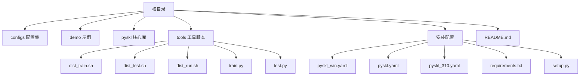
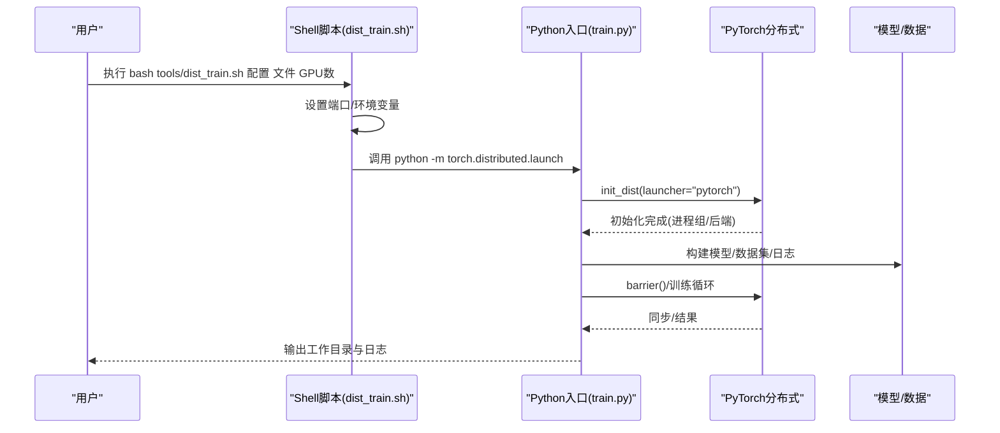
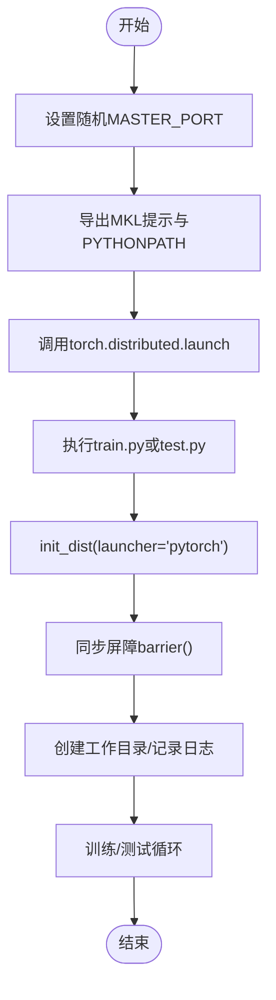
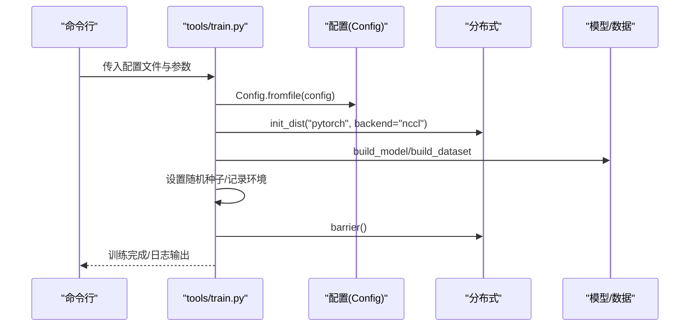
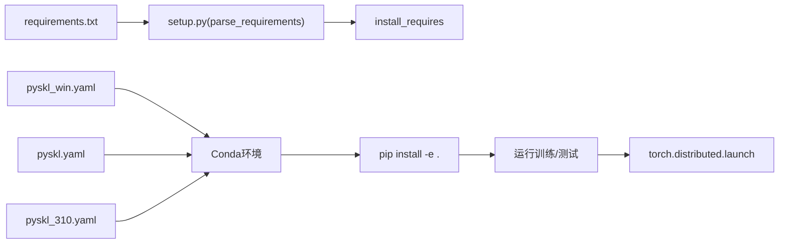

# 平台特定配置

<cite>
**本文引用的文件**
- [README.md](file://README.md)
- [pyskl_win.yaml](file://pyskl_win.yaml)
- [pyskl.yaml](file://pyskl.yaml)
- [pyskl_310.yaml](file://pyskl_310.yaml)
- [requirements.txt](file://requirements.txt)
- [setup.py](file://setup.py)
- [tools/dist_train.sh](file://tools/dist_train.sh)
- [tools/dist_test.sh](file://tools/dist_test.sh)
- [tools/dist_run.sh](file://tools/dist_run.sh)
- [tools/train.py](file://tools/train.py)
- [tools/test.py](file://tools/test.py)
</cite>

## 目录
1. [简介](#简介)
2. [项目结构](#项目结构)
3. [核心组件](#核心组件)
4. [架构总览](#架构总览)
5. [详细组件分析](#详细组件分析)
6. [依赖关系分析](#依赖关系分析)
7. [性能考虑与系统资源建议](#性能考虑与系统资源建议)
8. [故障排查指南](#故障排查指南)
9. [结论](#结论)
10. [附录：跨平台安装步骤与要点](#附录跨平台安装步骤与要点)

## 简介
本指南面向PySKL在Windows、Linux、macOS三大平台的跨平台安装与配置，重点覆盖以下内容：
- Windows平台：基于pyskl_win.yaml的环境构建、路径分隔符与权限注意事项、Visual Studio编译器要求与CUDA/PyTorch组合兼容性。
- Linux平台：Ubuntu/CentOS等主流发行版的安装命令与依赖管理；分布式训练脚本的使用。
- macOS平台：Homebrew安装方式与Intel vs Apple Silicon芯片的差异化配置。
- 分布式训练：Linux/macOS使用shell脚本，Windows使用批处理脚本的差异与统一流程。
- 性能优化与系统资源配置：CPU/GPU内存、I/O、网络与缓存服务（memcached）的建议。

## 项目结构
本仓库采用"根目录+tools/脚本+configs/配置+核心库"的组织方式，安装与分布式训练的关键入口如下：
- 安装与环境：pyskl_win.yaml、pyskl.yaml、pyskl_310.yaml、requirements.txt、setup.py
- 分布式训练：tools/dist_train.sh、tools/dist_test.sh、tools/dist_run.sh
- 训练/测试入口：tools/train.py、tools/test.py
- 顶层说明：README.md

**图表来源**
- [README.md](file://README.md#L49-L91)
- [pyskl_win.yaml](file://pyskl_win.yaml#L1-L42)
- [pyskl.yaml](file://pyskl.yaml#L1-L132)
- [pyskl_310.yaml](file://pyskl_310.yaml#L1-L131)
- [requirements.txt](file://requirements.txt#L1-L14)
- [setup.py](file://setup.py#L101-L129)
- [tools/dist_train.sh](file://tools/dist_train.sh#L1-L13)
- [tools/dist_test.sh](file://tools/dist_test.sh#L1-L14)
- [tools/dist_run.sh](file://tools/dist_run.sh#L1-L12)
- [tools/train.py](file://tools/train.py#L1-L165)
- [tools/test.py](file://tools/test.py#L1-L185)

**章节来源**
- [README.md](file://README.md#L49-L91)
- [pyskl_win.yaml](file://pyskl_win.yaml#L1-L42)
- [pyskl.yaml](file://pyskl.yaml#L1-L132)
- [pyskl_310.yaml](file://pyskl_310.yaml#L1-L131)
- [requirements.txt](file://requirements.txt#L1-L14)
- [setup.py](file://setup.py#L101-L129)
- [tools/dist_train.sh](file://tools/dist_train.sh#L1-L13)
- [tools/dist_test.sh](file://tools/dist_test.sh#L1-L14)
- [tools/dist_run.sh](file://tools/dist_run.sh#L1-L12)
- [tools/train.py](file://tools/train.py#L1-L165)
- [tools/test.py](file://tools/test.py#L1-L185)

## 核心组件
- Conda环境配置文件：pyskl_win.yaml、pyskl.yaml、pyskl_310.yaml，分别面向Windows、Linux/macOS Python 3.7与3.10场景。
- 依赖清单：requirements.txt与setup.py解析逻辑，用于pip安装与打包。
- 分布式训练脚本：dist_train.sh、dist_test.sh、dist_run.sh，封装torch.distributed.launch调用。
- 训练/测试入口：train.py、test.py，负责初始化分布式、构建模型与数据集、日志与评估。

**章节来源**
- [pyskl_win.yaml](file://pyskl_win.yaml#L1-L42)
- [pyskl.yaml](file://pyskl.yaml#L1-L132)
- [pyskl_310.yaml](file://pyskl_310.yaml#L1-L131)
- [requirements.txt](file://requirements.txt#L1-L14)
- [setup.py](file://setup.py#L25-L98)
- [tools/dist_train.sh](file://tools/dist_train.sh#L1-L13)
- [tools/dist_test.sh](file://tools/dist_test.sh#L1-L14)
- [tools/dist_run.sh](file://tools/dist_run.sh#L1-L12)
- [tools/train.py](file://tools/train.py#L60-L165)
- [tools/test.py](file://tools/test.py#L110-L185)

## 架构总览
下图展示从用户命令到分布式训练执行的关键流程，涵盖Shell脚本、Python入口与分布式初始化：

**图表来源**
- [tools/dist_train.sh](file://tools/dist_train.sh#L1-L13)
- [tools/train.py](file://tools/train.py#L78-L156)

**章节来源**
- [tools/dist_train.sh](file://tools/dist_train.sh#L1-L13)
- [tools/train.py](file://tools/train.py#L60-L165)

## 详细组件分析

### Windows平台安装与pyskl_win.yaml配置
**更新** 新增Windows专用环境配置文件，提供完整的Windows平台安装指导

- 环境构建
  - 使用Conda创建环境：conda env create -f pyskl_win.yaml
  - 激活环境后执行pip安装：pip install -e .
- CUDA与PyTorch版本绑定
  - 配置中包含cudatoolkit=11.3与对应版本的pytorch、torchvision、torchaudio，确保CUDA与PyTorch二进制兼容。
- 路径分隔符与权限
  - 在Windows上使用反斜杠作为路径分隔符；若涉及自定义数据路径或输出目录，请确保路径字符串使用双反斜杠或原始字符串，避免转义问题。
  - 若需要写入受保护目录（如Program Files），请以管理员身份运行终端或IDE。
- 编译器与C扩展
  - 若后续需要从源码编译Cython扩展，需安装与Python版本匹配的Microsoft Visual C++ Build Tools或Visual Studio，并确保Windows SDK与CMake可用。
- 常见依赖
  - FFmpeg、OpenCV、NumPy、SciPy、Matplotlib、Pillow、Jupyter、IPython等均在配置中声明，可直接通过Conda安装。

**章节来源**
- [pyskl_win.yaml](file://pyskl_win.yaml#L1-L42)
- [README.md](file://README.md#L49-L66)

### Linux平台安装与依赖管理
- Ubuntu/CentOS安装步骤
  - 创建并激活Conda环境：conda env create -f pyskl.yaml 或 pyskl_310.yaml
  - 激活后执行pip安装：pip install -e .
- 依赖包管理
  - requirements.txt列出核心依赖，setup.py的parse_requirements支持按平台条件解析；若使用pip直接安装，注意版本约束与冲突。
- 分布式训练
  - 使用dist_train.sh与dist_test.sh脚本启动多GPU训练/测试；脚本内部通过torch.distributed.launch初始化分布式后端。
- 注意事项
  - 确保系统已安装与配置好CUDA驱动与对应版本的cuDNN。
  - 若出现OpenSSL或网络相关错误，检查系统证书与代理设置。

**章节来源**
- [pyskl.yaml](file://pyskl.yaml#L1-L132)
- [pyskl_310.yaml](file://pyskl_310.yaml#L1-L131)
- [requirements.txt](file://requirements.txt#L1-L14)
- [setup.py](file://setup.py#L25-L98)
- [tools/dist_train.sh](file://tools/dist_train.sh#L1-L13)
- [tools/dist_test.sh](file://tools/dist_test.sh#L1-L14)

### macOS平台安装与芯片差异化
- Homebrew安装
  - 推荐先通过Homebrew安装Python与必要工具链，再使用conda创建虚拟环境并安装PySKL。
- Intel vs Apple Silicon芯片
  - Intel Mac：可直接使用pyskl.yaml或pyskl_310.yaml中的通用依赖。
  - Apple Silicon Mac：建议优先使用Apple Silicon原生Python（如通过Homebrew安装），并确认PyTorch与CUDA版本兼容；若无CUDA需求，可选择CPU版本的PyTorch。
- 分布式训练
  - 使用dist_train.sh与dist_test.sh脚本；若遇到端口占用或权限问题，可调整MASTER_PORT或以sudo运行（不推荐）。

**章节来源**
- [pyskl.yaml](file://pyskl.yaml#L1-L132)
- [pyskl_310.yaml](file://pyskl_310.yaml#L1-L131)
- [tools/dist_train.sh](file://tools/dist_train.sh#L1-L13)
- [tools/dist_test.sh](file://tools/dist_test.sh#L1-L14)

### 分布式训练脚本与流程
- dist_train.sh
  - 设置随机端口、导出MKL提示、调用torch.distributed.launch与tools/train.py。
- dist_test.sh
  - 设置随机端口、导出MKL提示、调用torch.distributed.launch与tools/test.py。
- dist_run.sh
  - 通用分布式运行脚本，可直接传入任意Python脚本进行分布式执行。
- Python入口
  - train.py/test.py负责初始化分布式、构建模型与数据集、日志记录、评估与结果输出。

**图表来源**
- [tools/dist_train.sh](file://tools/dist_train.sh#L3-L11)
- [tools/dist_test.sh](file://tools/dist_test.sh#L3-L13)
- [tools/dist_run.sh](file://tools/dist_run.sh#L3-L10)
- [tools/train.py](file://tools/train.py#L78-L156)
- [tools/test.py](file://tools/test.py#L137-L178)

**章节来源**
- [tools/dist_train.sh](file://tools/dist_train.sh#L1-L13)
- [tools/dist_test.sh](file://tools/dist_test.sh#L1-L14)
- [tools/dist_run.sh](file://tools/dist_run.sh#L1-L12)
- [tools/train.py](file://tools/train.py#L60-L165)
- [tools/test.py](file://tools/test.py#L110-L185)

### 训练/测试入口与分布式初始化
- train.py
  - 解析参数、加载配置、初始化分布式、构建模型与数据集、设置随机种子、记录环境信息、可选启用torch.compile（PyTorch 2.0）。
- test.py
  - 解析参数、加载配置、初始化分布式、构建数据加载器、可选融合卷积BN、多GPU推理与评估、输出结果文件。

**图表来源**
- [tools/train.py](file://tools/train.py#L60-L156)

**章节来源**
- [tools/train.py](file://tools/train.py#L60-L165)
- [tools/test.py](file://tools/test.py#L110-L185)

## 依赖关系分析
- 安装依赖
  - setup.py通过parse_requirements读取requirements.txt，支持版本约束与平台条件；同时在install_requires中声明核心依赖。
- 环境配置
  - pyskl_win.yaml/pyskl.yaml/pyskl_310.yaml分别定义了Python版本、CUDA/PyTorch版本、常用科学计算与计算机视觉库。
- 分布式依赖
  - dist_train.sh/dist_test.sh依赖torch.distributed.launch，Python入口依赖mmcv与PyTorch分布式API。

**图表来源**
- [requirements.txt](file://requirements.txt#L1-L14)
- [setup.py](file://setup.py#L25-L98)
- [pyskl_win.yaml](file://pyskl_win.yaml#L1-L42)
- [pyskl.yaml](file://pyskl.yaml#L1-L132)
- [pyskl_310.yaml](file://pyskl_310.yaml#L1-L131)
- [tools/dist_train.sh](file://tools/dist_train.sh#L10-L11)
- [tools/dist_test.sh](file://tools/dist_test.sh#L12-L13)

**章节来源**
- [requirements.txt](file://requirements.txt#L1-L14)
- [setup.py](file://setup.py#L25-L98)
- [pyskl_win.yaml](file://pyskl_win.yaml#L1-L42)
- [pyskl.yaml](file://pyskl.yaml#L1-L132)
- [pyskl_310.yaml](file://pyskl_310.yaml#L1-L131)
- [tools/dist_train.sh](file://tools/dist_train.sh#L1-L13)
- [tools/dist_test.sh](file://tools/dist_test.sh#L1-L14)

## 性能考虑与系统资源建议
- CPU/GPU资源
  - 多GPU训练时，合理分配每进程GPU数量，避免显存不足；根据数据加载与预处理瓶颈调整workers_per_gpu。
- I/O与缓存
  - 若数据集较大，建议使用SSD存储；可启用memcached（通过cfg.memcached与mc_cfg配置）提升数据读取速度。
- 网络与端口
  - 分布式训练依赖通信端口，确保MASTER_PORT未被占用；在防火墙策略允许的情况下进行跨节点训练。
- PyTorch 2.0编译
  - 当检测到PyTorch版本≥2.0且传入--compile参数时，入口会尝试torch.compile以获得潜在加速；该特性为实验性质，需结合具体模型验证收益。
- MKL提示
  - 脚本导出MKL_SERVICE_FORCE_INTEL=1以优化Intel CPU上的BLAS性能，适用于多核服务器场景。

**章节来源**
- [tools/dist_train.sh](file://tools/dist_train.sh#L9-L11)
- [tools/dist_test.sh](file://tools/dist_test.sh#L10-L12)
- [tools/train.py](file://tools/train.py#L121-L124)
- [tools/test.py](file://tools/test.py#L86-L89)

## 故障排查指南
- Conda环境创建失败
  - 更新conda至较新版本后再试；检查网络与镜像源；必要时清理conda缓存。
- CUDA/PyTorch版本不匹配
  - 确认cudatoolkit与pytorch版本组合一致；Windows平台建议严格遵循pyskl_win.yaml中的版本映射。
- 权限问题（Windows）
  - 写入受限目录时以管理员身份运行；检查路径中是否包含空格或特殊字符。
- 分布式端口冲突
  - 脚本已自动设置随机端口，若仍冲突，手动指定不同端口或关闭占用进程。
- 数据读取慢
  - 检查磁盘I/O与网络带宽；启用memcached或减少workers_per_gpu；确认数据路径正确。
- PyTorch 2.0编译报错
  - 降级或升级PyTorch版本以匹配模型；或移除--compile参数。

**章节来源**
- [pyskl_win.yaml](file://pyskl_win.yaml#L1-L42)
- [pyskl.yaml](file://pyskl.yaml#L1-L132)
- [pyskl_310.yaml](file://pyskl_310.yaml#L1-L131)
- [tools/dist_train.sh](file://tools/dist_train.sh#L3-L4)
- [tools/dist_test.sh](file://tools/dist_test.sh#L3-L4)
- [tools/train.py](file://tools/train.py#L121-L124)
- [tools/test.py](file://tools/test.py#L86-L89)

## 结论
- Windows建议使用pyskl_win.yaml构建环境，严格匹配CUDA与PyTorch版本，关注路径与权限问题。
- Linux/macOS建议使用pyskl.yaml或pyskl_310.yaml，配合dist_train.sh/dist_test.sh进行分布式训练。
- macOS Apple Silicon芯片可直接使用通用配置，但需验证PyTorch与CUDA兼容性。
- 性能优化建议围绕GPU显存、I/O吞吐、网络端口与可选的torch.compile展开。

## 附录：跨平台安装步骤与要点
- Windows
  - 步骤：conda env create -f pyskl_win.yaml → conda activate pyskl → pip install -e .
  - 要点：严格匹配CUDA/PyTorch版本；注意路径分隔符与权限；必要时安装Visual Studio编译器。
- Linux（Ubuntu/CentOS）
  - 步骤：conda env create -f pyskl.yaml 或 pyskl_310.yaml → pip install -e .
  - 要点：确保CUDA驱动与cuDNN已安装；使用dist_train.sh/dist_test.sh进行分布式训练。
- macOS（Intel/Apple Silicon）
  - 步骤：通过Homebrew安装Python → conda env create -f pyskl_310.yaml → pip install -e .
  - 要点：Apple Silicon优先使用原生Python；PyTorch与CUDA版本需兼容；使用dist_train.sh/dist_test.sh。

**章节来源**
- [README.md](file://README.md#L49-L91)
- [pyskl_win.yaml](file://pyskl_win.yaml#L1-L42)
- [pyskl.yaml](file://pyskl.yaml#L1-L132)
- [pyskl_310.yaml](file://pyskl_310.yaml#L1-L131)