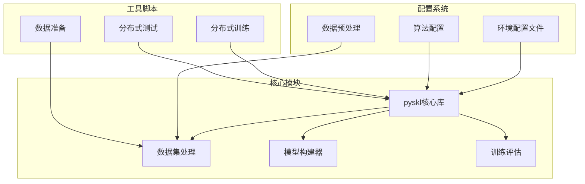
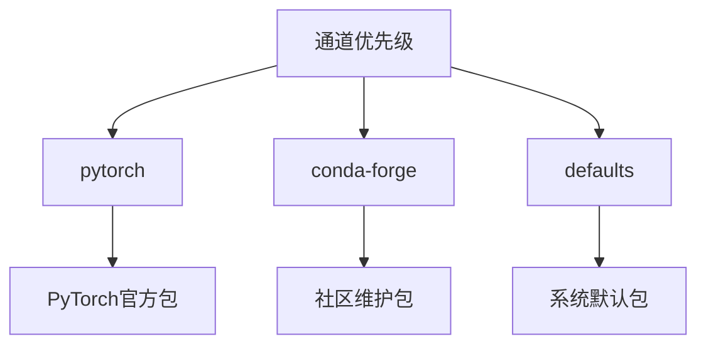
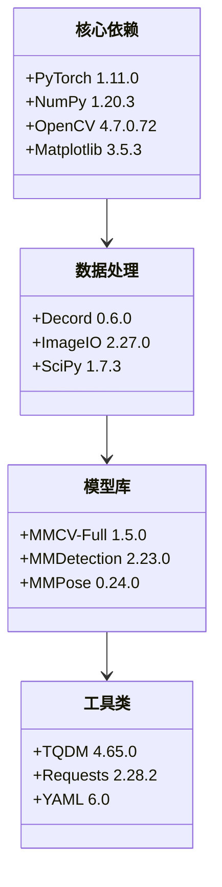
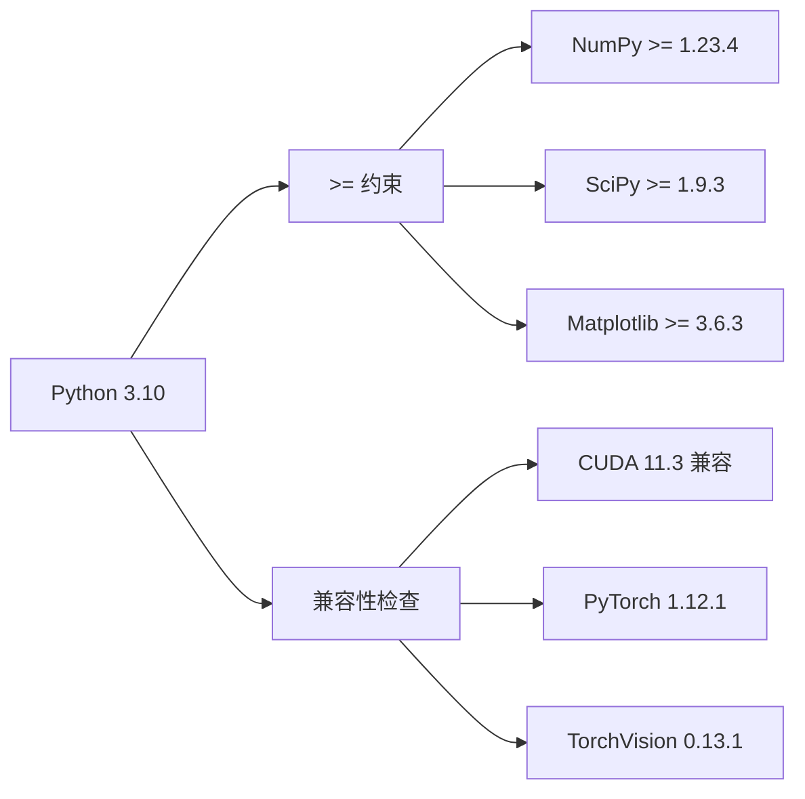
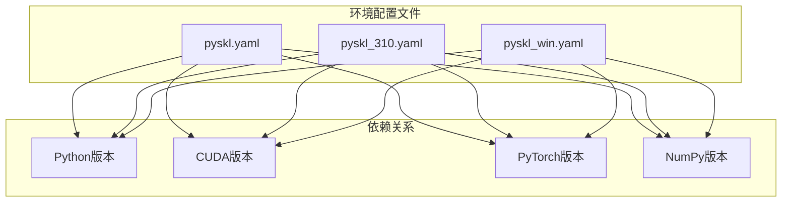
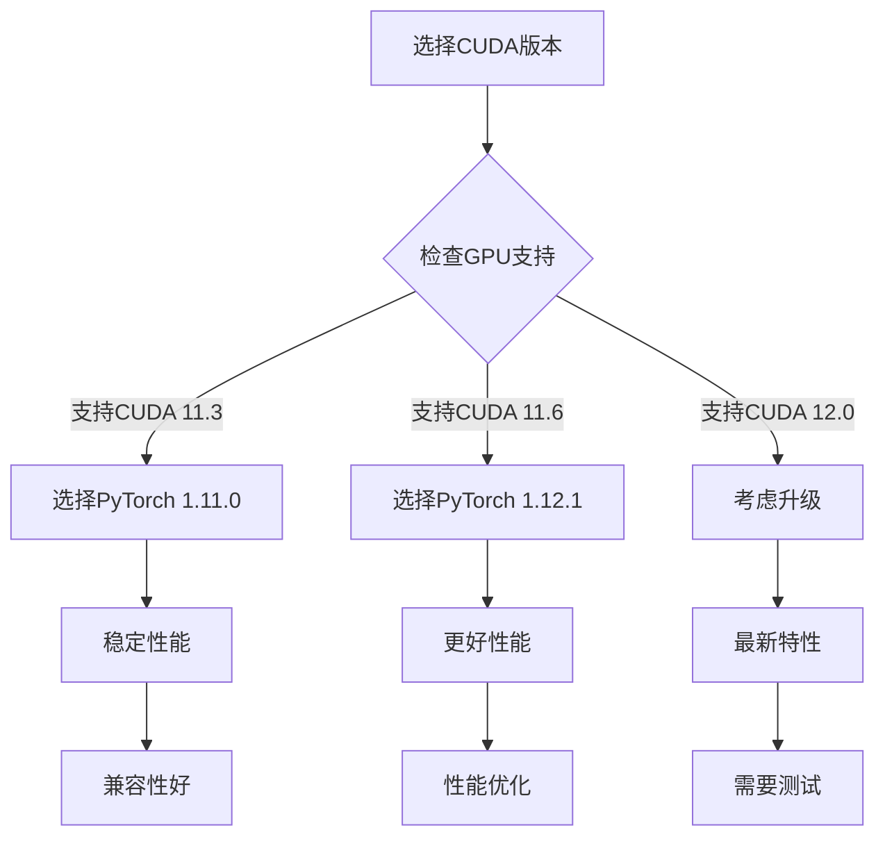
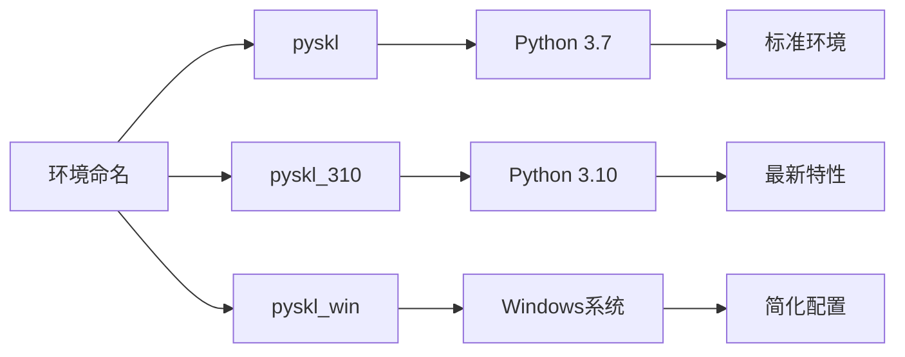

# 环境配置

<cite>
**本文档引用的文件**
- [pyskl.yaml](file://pyskl.yaml)
- [pyskl_310.yaml](file://pyskl_310.yaml)
- [pyskl_win.yaml](file://pyskl_win.yaml)
- [requirements.txt](file://requirements.txt)
- [setup.py](file://setup.py)
- [README.md](file://README.md)
- [dist_train.sh](file://tools/dist_train.sh)
- [dist_test.sh](file://tools/dist_test.sh)
</cite>

## 目录
1. [简介](#简介)
2. [项目结构概览](#项目结构概览)
3. [核心环境配置文件](#核心环境配置文件)
4. [环境配置架构](#环境配置架构)
5. [详细组件分析](#详细组件分析)
6. [依赖关系分析](#依赖关系分析)
7. [性能考虑](#性能考虑)
8. [故障排除指南](#故障排除指南)
9. [结论](#结论)

## 简介

PySKL是一个基于PyTorch的骨架动作识别工具箱，支持多种骨架动作识别算法。该项目提供了三种专门的环境配置文件，针对不同的Python版本和操作系统进行优化配置。本文档将深入解释这些环境配置文件的作用、差异和最佳实践。

## 项目结构概览

PySKL项目采用模块化架构，包含以下主要组件：



**图表来源**
- [pyskl.yaml](file://pyskl.yaml#L1-L132)
- [pyskl_310.yaml](file://pyskl_310.yaml#L1-L131)
- [pyskl_win.yaml](file://pyskl_win.yaml#L1-L42)

## 核心环境配置文件

PySKL项目提供了三种专门的环境配置文件，每种都有特定的用途和优化目标：

### pyskl.yaml - 标准环境配置

这是默认的环境配置文件，适用于大多数Linux和macOS用户。该配置文件针对Python 3.7版本进行了优化，包含了完整的深度学习开发环境。

### pyskl_310.yaml - Python 3.10专用配置

专门为Python 3.10用户设计的配置文件，包含了更新的依赖包版本和优化的兼容性设置。

### pyskl_win.yaml - Windows专用配置

专为Windows系统设计的简化配置文件，专注于基本的深度学习功能支持。

**章节来源**
- [pyskl.yaml](file://pyskl.yaml#L1-L132)
- [pyskl_310.yaml](file://pyskl_310.yaml#L1-L131)
- [pyskl_win.yaml](file://pyskl_win.yaml#L1-L42)

## 环境配置架构

### 通道配置（Channels）

所有配置文件都使用相同的优先级通道顺序：



**图表来源**
- [pyskl.yaml](file://pyskl.yaml#L2-L5)
- [pyskl_310.yaml](file://pyskl_310.yaml#L2-L5)
- [pyskl_win.yaml](file://pyskl_win.yaml#L2-L5)

### 依赖包版本锁定策略

每个配置文件都采用了不同的版本锁定策略：

| 配置文件 | Python版本 | CUDA版本 | PyTorch版本 | NumPy版本 |
|---------|-----------|----------|-------------|-----------|
| pyskl.yaml | 3.7.11 | 11.3.1 | 1.11.0 | 1.20.3 |
| pyskl_310.yaml | 3.10.9 | 11.3.1 | 1.12.1 | >=1.23.4 |
| pyskl_win.yaml | 3.10 | 11.3 | 1.12.1 | 自动匹配 |

**章节来源**
- [pyskl.yaml](file://pyskl.yaml#L57-L67)
- [pyskl_310.yaml](file://pyskl_310.yaml#L58-L67)
- [pyskl_win.yaml](file://pyskl_win.yaml#L7-L15)

## 详细组件分析

### 标准环境配置（pyskl.yaml）分析

#### 关键参数设置

1. **Python环境配置**
   - Python 3.7.11版本，确保与旧版依赖包的兼容性
   - 使用Intel MKL优化的数学库

2. **CUDA和GPU支持**
   - CUDA Toolkit 11.3.1版本
   - PyTorch 1.11.0，支持CUDA 11.3
   - TorchVision 0.12.0和TorchAudio 0.11.0

3. **核心依赖包**
   - NumPy 1.20.3，稳定的数值计算基础
   - OpenCV 4.7.0.72，图像处理支持
   - Matplotlib 3.5.3，可视化功能

#### 依赖包版本锁定



**图表来源**
- [pyskl.yaml](file://pyskl.yaml#L75-L131)

**章节来源**
- [pyskl.yaml](file://pyskl.yaml#L1-L132)

### Python 3.10专用配置（pyskl_310.yaml）分析

#### 升级特性

1. **Python版本升级**
   - 使用Python 3.10.9，获得更好的性能和新特性
   - 更新的Cryptography库到39.0.1版本

2. **增强的依赖包**
   - NumPy升级到>=1.23.4，提供更好的性能
   - Matplotlib升级到3.6.3，改进的可视化功能
   - 更新的OpenCV版本4.7.0.72

3. **优化的兼容性**
   - 所有包版本都支持Python 3.10
   - 更新的typing_extensions库
   - 改进的打包工具支持

#### 版本约束策略



**图表来源**
- [pyskl_310.yaml](file://pyskl_310.yaml#L50-L51)
- [pyskl_310.yaml](file://pyskl_310.yaml#L103-L104)

**章节来源**
- [pyskl_310.yaml](file://pyskl_310.yaml#L1-L131)

### Windows专用配置（pyskl_win.yaml）分析

#### 简化配置策略

Windows配置文件采用了简化的配置策略：

1. **精简依赖包**
   - 只包含必要的深度学习依赖
   - 移除了复杂的版本锁定
   - 使用更宽松的版本约束

2. **平台优化**
   - 针对Windows环境的优化设置
   - 简化的CUDA配置
   - 基础的开发工具支持

3. **兼容性保证**
   - 确保在Windows上能够正常运行
   - 提供基本的功能支持
   - 简化安装过程

**章节来源**
- [pyskl_win.yaml](file://pyskl_win.yaml#L1-L42)

## 依赖关系分析

### 环境配置文件之间的关系



**图表来源**
- [pyskl.yaml](file://pyskl.yaml#L57-L67)
- [pyskl_310.yaml](file://pyskl_310.yaml#L58-L67)
- [pyskl_win.yaml](file://pyskl_win.yaml#L7-L15)

### 与conda包管理的关系

PySKL的环境配置文件与conda包管理器紧密集成：

1. **通道管理**
   - 优先使用pytorch通道获取PyTorch相关包
   - 使用conda-forge获取社区维护的包
   - 最后使用defaults通道获取系统默认包

2. **版本控制**
   - 精确指定版本号确保可重现性
   - 使用通配符处理补丁版本变化
   - 通过pip安装额外的Python包

3. **依赖解析**
   - conda自动解决包依赖关系
   - 处理不同包之间的版本冲突
   - 确保CUDA和CPU版本的一致性

**章节来源**
- [pyskl.yaml](file://pyskl.yaml#L2-L5)
- [pyskl_310.yaml](file://pyskl_310.yaml#L2-L5)
- [pyskl_win.yaml](file://pyskl_win.yaml#L2-L5)

## 性能考虑

### CUDA版本匹配

正确的CUDA版本匹配对于深度学习性能至关重要：



### 内存优化建议

1. **批处理大小调整**
   - 根据GPU内存调整videos_per_gpu参数
   - 使用梯度累积处理大模型

2. **数据加载优化**
   - 调整workers_per_gpu参数
   - 使用混合精度训练

3. **缓存策略**
   - 合理使用数据预处理缓存
   - 避免重复的数据加载

## 故障排除指南

### 常见问题及解决方案

#### 环境创建失败

**问题症状**：
- conda创建环境时出现依赖冲突
- 安装过程中报错

**解决方案**：
1. 更新conda到最新版本
2. 清理conda缓存
3. 指定不同的通道优先级
4. 尝试使用pip安装替代方案

#### CUDA版本不匹配

**问题症状**：
- PyTorch无法检测到CUDA
- 训练时使用CPU而非GPU

**解决方案**：
1. 检查GPU驱动版本
2. 确认CUDA Toolkit版本
3. 验证PyTorch与CUDA的兼容性
4. 重新安装匹配的PyTorch版本

#### 依赖包版本冲突

**问题症状**：
- 安装特定包时出现版本冲突
- 运行时导入错误

**解决方案**：
1. 使用精确版本号锁定
2. 检查包之间的兼容性要求
3. 考虑降级或升级相关包
4. 创建独立的环境隔离

### 环境管理最佳实践

#### 环境命名规范



#### 版本兼容性检查方法

1. **Python版本检查**
   ```bash
   python --version
   ```

2. **CUDA版本检查**
   ```bash
   nvcc --version
   ```

3. **PyTorch GPU支持检查**
   ```python
   import torch
   print(torch.cuda.is_available())
   ```

4. **依赖包版本验证**
   ```bash
   conda list | grep -E "(pytorch|torchvision|cuda)"
   ```

**章节来源**
- [README.md](file://README.md#L49-L66)

## 结论

PySKL项目的环境配置系统展现了现代深度学习项目的最佳实践。通过提供三种专门的配置文件，项目能够满足不同用户群体的需求：

1. **标准化支持**：pyskl.yaml为大多数用户提供稳定的默认配置
2. **现代化支持**：pyskl_310.yaml为Python 3.10用户提供最新的功能支持
3. **跨平台支持**：pyskl_win.yaml确保Windows用户的顺利使用

这些配置文件不仅解决了技术兼容性问题，还体现了项目对用户体验的关注。通过清晰的版本管理、合理的依赖关系和完善的故障排除指南，PySKL为骨架动作识别研究提供了坚实的技术基础。

建议用户根据自己的具体需求选择合适的配置文件，并定期更新以获得最新的功能和安全补丁。同时，建立良好的环境管理习惯，包括定期备份环境配置和版本记录，将有助于长期的项目维护和发展。