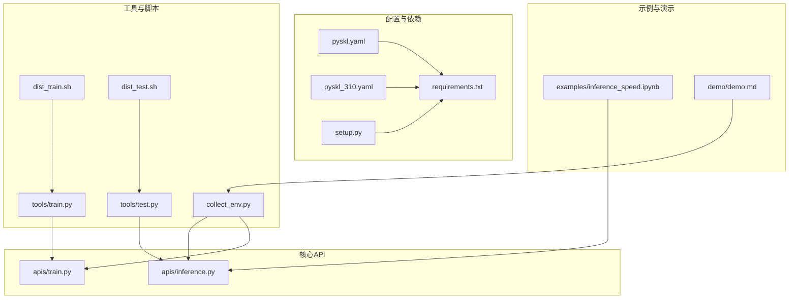
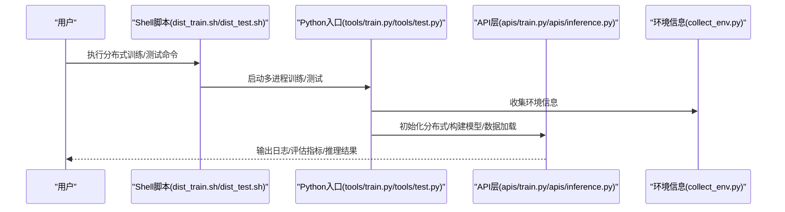
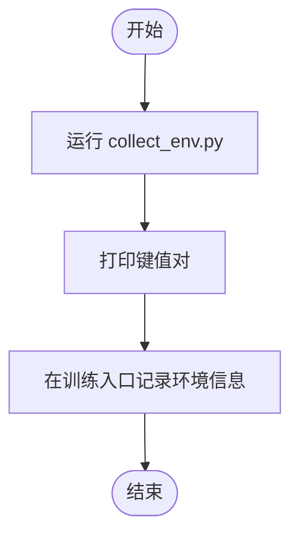
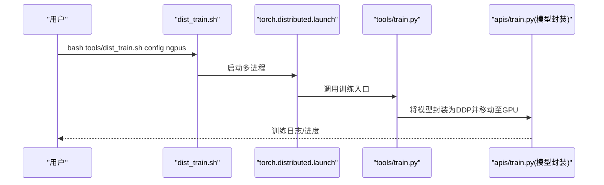
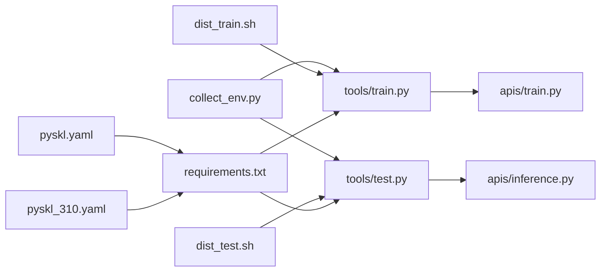

# 环境验证

<cite>
**本文引用的文件**
- [collect_env.py](file://pyskl/utils/collect_env.py)
- [requirements.txt](file://requirements.txt)
- [setup.py](file://setup.py)
- [README.md](file://README.md)
- [pyskl.yaml](file://pyskl.yaml)
- [pyskl_310.yaml](file://pyskl_310.yaml)
- [dist_train.sh](file://tools/dist_train.sh)
- [dist_test.sh](file://tools/dist_test.sh)
- [train.py](file://tools/train.py)
- [test.py](file://tools/test.py)
- [inference.py](file://pyskl/apis/inference.py)
- [train.py（训练入口）](file://pyskl/apis/train.py)
- [inference_speed.ipynb](file://examples/inference_speed.ipynb)
- [demo.md](file://demo/demo.md)
- [hooks.py](file://pyskl/core/hooks.py)
- [misc.py](file://pyskl/utils/misc.py)
</cite>

## 目录
1. [简介](#简介)
2. [项目结构](#项目结构)
3. [核心组件](#核心组件)
4. [架构总览](#架构总览)
5. [详细组件分析](#详细组件分析)
6. [依赖关系分析](#依赖关系分析)
7. [性能考量](#性能考量)
8. [故障排查指南](#故障排查指南)
9. [结论](#结论)
10. [附录](#附录)

## 简介
本文件面向PySKL项目使用者与维护者，提供一套系统化的环境健康检查与验证流程，覆盖以下方面：
- Python版本与依赖一致性验证
- PyTorch后端与CUDA/cuDNN版本匹配检查
- GPU可用性与分布式训练环境验证
- 使用collect_env工具收集系统信息并解读关键字段
- GPU训练环境专项验证：显存、并行计算能力、混合精度支持
- 常见问题诊断：CUDA安装失败、后端不匹配、依赖冲突
- 性能基准测试执行与结果分析指引

## 项目结构
围绕环境验证的关键文件与目录如下：
- 工具与脚本
  - pyskl/utils/collect_env.py：环境信息采集工具
  - tools/dist_train.sh、tools/dist_test.sh：分布式训练/测试启动脚本
  - tools/train.py、tools/test.py：训练/测试入口
- 配置与依赖
  - requirements.txt、setup.py：依赖声明与解析逻辑
  - pyskl.yaml、pyskl_310.yaml：Conda环境定义（含PyTorch/CUDA/cuDNN版本）
- 核心API
  - pyskl/apis/inference.py、pyskl/apis/train.py：推理与训练入口，体现设备选择与分布式初始化
- 示例与演示
  - examples/inference_speed.ipynb：推理速度基准示例
  - demo/demo.md：GPU演示与依赖准备说明

图表来源
- [collect_env.py](file://pyskl/utils/collect_env.py#L1-L18)
- [requirements.txt](file://requirements.txt#L1-L14)
- [setup.py](file://setup.py#L25-L98)
- [pyskl.yaml](file://pyskl.yaml#L16-L69)
- [pyskl_310.yaml](file://pyskl_310.yaml#L59-L67)
- [dist_train.sh](file://tools/dist_train.sh#L1-L12)
- [dist_test.sh](file://tools/dist_test.sh#L1-L13)
- [train.py](file://tools/train.py#L106-L143)
- [test.py](file://tools/test.py#L38-L68)
- [inference.py](file://pyskl/apis/inference.py#L19-L54)
- [train.py（训练入口）](file://pyskl/apis/train.py#L93-L97)
- [inference_speed.ipynb](file://examples/inference_speed.ipynb#L1-L206)
- [demo.md](file://demo/demo.md#L1-L42)

章节来源
- [README.md](file://README.md#L49-L91)
- [requirements.txt](file://requirements.txt#L1-L14)
- [setup.py](file://setup.py#L25-L98)
- [pyskl.yaml](file://pyskl.yaml#L16-L69)
- [pyskl_310.yaml](file://pyskl_310.yaml#L59-L67)

## 核心组件
- 环境信息采集器
  - 职责：基于基础库收集系统与依赖信息，并附加PySKL版本与Git哈希
  - 关键点：输出包含Python版本、PyTorch版本与编译选项、CUDA/cuDNN版本、mmcv版本、操作系统等
- 分布式训练/测试脚本
  - 职责：设置端口、环境变量、调用torch.distributed.launch启动多进程训练或测试
- 训练/测试入口
  - 职责：构建模型、数据加载器、分布式封装；支持torch.compile（PyTorch 2.0+）
- 推理入口
  - 职责：根据输入类型构建数据流水线，将数据散射到指定GPU，前向推理并返回结果
- 性能基准示例
  - 职责：在固定配置下测量不同模型的FPS，便于横向对比

章节来源
- [collect_env.py](file://pyskl/utils/collect_env.py#L8-L12)
- [dist_train.sh](file://tools/dist_train.sh#L3-L11)
- [dist_test.sh](file://tools/dist_test.sh#L3-L12)
- [train.py](file://tools/train.py#L121-L123)
- [inference.py](file://pyskl/apis/inference.py#L19-L54)
- [inference_speed.ipynb](file://examples/inference_speed.ipynb#L78-L111)

## 架构总览
下图展示从命令行到分布式训练/测试再到推理的整体路径，以及环境信息采集在其中的位置。

图表来源
- [dist_train.sh](file://tools/dist_train.sh#L3-L11)
- [dist_test.sh](file://tools/dist_test.sh#L3-L12)
- [train.py](file://tools/train.py#L106-L143)
- [test.py](file://tools/test.py#L38-L68)
- [train.py（训练入口）](file://pyskl/apis/train.py#L93-L97)
- [inference.py](file://pyskl/apis/inference.py#L19-L54)
- [collect_env.py](file://pyskl/utils/collect_env.py#L8-L12)

## 详细组件分析

### 环境信息采集与解读
- 如何使用
  - 直接运行工具脚本打印当前环境信息，或在训练/测试入口中调用以记录元数据
- 关键字段与意义
  - Python版本：确保与Conda环境一致（3.7或3.10）
  - PyTorch版本与CUDA/cuDNN：决定是否可使用GPU与混合精度
  - mmcv版本：影响编译与安装兼容性
  - 操作系统与硬件：辅助定位平台差异导致的问题
- 字段来源
  - 工具函数会合并基础环境信息并追加PySKL版本与Git哈希

图表来源
- [collect_env.py](file://pyskl/utils/collect_env.py#L15-L17)
- [train.py](file://tools/train.py#L106-L106)

章节来源
- [collect_env.py](file://pyskl/utils/collect_env.py#L8-L12)
- [train.py](file://tools/train.py#L106-L106)

### Python与依赖验证
- Python版本
  - 3.7环境：参考pyskl.yaml中的python=3.7.11
  - 3.10环境：参考pyskl_310.yaml中的python=3.10.9
- 依赖一致性
  - requirements.txt声明了torch、mmcv-full、mmdet、mmpose等关键依赖
  - setup.py解析requirements.txt生成安装列表，确保安装时版本约束生效
- 验证步骤
  - 创建并激活对应Conda环境
  - 安装项目为可编辑模式
  - 运行collect_env.py核对Python与依赖版本

章节来源
- [pyskl.yaml](file://pyskl.yaml#L57-L59)
- [pyskl_310.yaml](file://pyskl_310.yaml#L57-L59)
- [requirements.txt](file://requirements.txt#L1-L14)
- [setup.py](file://setup.py#L25-L98)
- [README.md](file://README.md#L49-L66)

### PyTorch后端与CUDA/cuDNN版本确认
- 版本映射
  - 3.7环境：pytorch=1.11.0，cudatoolkit=11.3.1，torchaudio=0.11.0，torchvision=0.12.0
  - 3.10环境：pytorch=1.12.1，cudatoolkit=11.3.1，torchaudio=0.12.1，torchvision=0.13.1
- 确认方法
  - 在环境中运行Python，检查torch.__version__与torch.version.cuda、torch.backends.cudnn.version()
  - 若无法导入torch或版本不匹配，优先检查Conda环境与pip安装的mmcv版本是否与PyTorch CUDA版本一致

章节来源
- [pyskl.yaml](file://pyskl.yaml#L16-L69)
- [pyskl_310.yaml](file://pyskl_310.yaml#L16-L69)

### GPU可用性与分布式训练验证
- 启动分布式训练/测试
  - dist_train.sh与dist_test.sh通过torch.distributed.launch启动多进程
  - 设置MKL_SERVICE_FORCE_INTEL=1以优化某些平台下的性能
- 设备与分布式封装
  - 训练入口将模型封装为分布式数据并行，并放置于当前设备
  - 推理入口将数据散射到指定GPU
- 验证要点
  - 确认GPU可见数与请求的进程数一致
  - 检查分布式端口未被占用
  - 观察日志中是否成功初始化分布式后端

图表来源
- [dist_train.sh](file://tools/dist_train.sh#L3-L11)
- [train.py](file://tools/train.py#L121-L123)
- [train.py（训练入口）](file://pyskl/apis/train.py#L93-L97)

章节来源
- [dist_train.sh](file://tools/dist_train.sh#L3-L11)
- [dist_test.sh](file://tools/dist_test.sh#L3-L12)
- [train.py（训练入口）](file://pyskl/apis/train.py#L93-L97)
- [inference.py](file://pyskl/apis/inference.py#L166-L168)

### GPU训练环境专项验证
- 显存检查
  - 在训练/测试入口中打印环境信息，观察GPU数量与驱动状态
  - 参考示例脚本中的环境信息输出位置
- 并行计算能力测试
  - 使用分布式脚本启动多GPU训练，观察日志中是否成功初始化多进程
- 混合精度训练支持验证
  - 在PyTorch 2.0+环境下，可通过命令行参数触发torch.compile进行编译加速
  - 检查是否启用AMP（自动混合精度）取决于具体配置与后端支持

章节来源
- [train.py](file://tools/train.py#L121-L123)
- [README.md](file://README.md#L25-L25)

### 性能基准测试
- 执行方法
  - 使用examples/inference_speed.ipynb中的脚本，在相同批次、序列长度、关节数等条件下测量不同模型FPS
- 结果分析
  - 对比不同模型在同一硬件上的相对吞吐，识别瓶颈模块
  - 注意warmup与迭代次数设置，避免首帧异常影响平均值

章节来源
- [inference_speed.ipynb](file://examples/inference_speed.ipynb#L78-L111)
- [inference_speed.ipynb](file://examples/inference_speed.ipynb#L164-L176)

## 依赖关系分析
- 组件耦合
  - 工具脚本依赖训练/测试入口；训练/测试入口依赖API层；API层依赖环境信息采集
- 外部依赖
  - PyTorch与CUDA版本需与mmcv安装包匹配
  - 分布式训练依赖torch.distributed与NCCL（若系统支持）

图表来源
- [collect_env.py](file://pyskl/utils/collect_env.py#L8-L12)
- [requirements.txt](file://requirements.txt#L1-L14)
- [pyskl.yaml](file://pyskl.yaml#L16-L69)
- [pyskl_310.yaml](file://pyskl_310.yaml#L59-L67)
- [dist_train.sh](file://tools/dist_train.sh#L3-L11)
- [dist_test.sh](file://tools/dist_test.sh#L3-L12)
- [train.py](file://tools/train.py#L106-L143)
- [test.py](file://tools/test.py#L38-L68)
- [inference.py](file://pyskl/apis/inference.py#L19-L54)
- [train.py（训练入口）](file://pyskl/apis/train.py#L93-L97)

章节来源
- [requirements.txt](file://requirements.txt#L1-L14)
- [setup.py](file://setup.py#L25-L98)

## 性能考量
- 硬件与驱动
  - 确保GPU驱动与CUDA版本匹配，避免运行时降级
- 内存与缓存
  - 使用memcached（由misc.py中的辅助函数控制）可提升大规模数据读取效率
- 并行策略
  - 合理设置每GPU样本数与工作进程数，避免显存溢出或CPU瓶颈
- 混合精度与编译
  - 在支持的硬件上启用AMP与torch.compile可显著提升吞吐

章节来源
- [misc.py](file://pyskl/utils/misc.py#L18-L21)
- [misc.py](file://pyskl/utils/misc.py#L86-L94)
- [train.py](file://tools/train.py#L121-L123)

## 故障排查指南
- CUDA安装失败或不可用
  - 症状：无法导入torch或CUDA相关功能不可用
  - 步骤：检查Conda环境中的cudatoolkit与PyTorch版本是否匹配；确认驱动版本满足CUDA要求；尝试重新安装对应版本的mmcv-full wheel
- PyTorch后端不匹配
  - 症状：运行时报错提示CUDA版本不匹配
  - 步骤：切换到与CUDA版本一致的PyTorch安装包；确保pip安装的mmcv与PyTorch CUDA版本一致
- 依赖包版本冲突
  - 症状：安装时报错或运行时报错找不到模块
  - 步骤：使用提供的Conda环境文件创建独立环境；先安装requirements.txt中的依赖，再安装项目；避免同时使用pip与conda安装同一包的不同版本
- 分布式训练端口冲突
  - 症状：启动脚本报错端口已被占用
  - 步骤：修改MASTER_PORT或重启系统释放端口；确保防火墙允许该端口通信
- 显存不足
  - 症状：OOM错误
  - 步骤：降低batch size或序列长度；关闭不必要的日志与调试项；检查数据管道是否重复加载

章节来源
- [pyskl.yaml](file://pyskl.yaml#L16-L69)
- [pyskl_310.yaml](file://pyskl_310.yaml#L59-L67)
- [requirements.txt](file://requirements.txt#L1-L14)
- [dist_train.sh](file://tools/dist_train.sh#L3-L3)
- [dist_test.sh](file://tools/dist_test.sh#L3-L3)
- [misc.py](file://pyskl/utils/misc.py#L18-L21)

## 结论
通过上述系统化验证流程，可以高效地完成PySKL项目的环境健康检查与问题定位。建议在每次升级系统或依赖时，重新运行环境信息采集与分布式训练/推理验证，以确保训练稳定性与性能表现。

## 附录
- 快速检查清单
  - Python版本：3.7或3.10
  - PyTorch与CUDA版本：与mmcv安装包匹配
  - GPU可用：nvidia-smi显示正常
  - 分布式端口：未被占用
  - 显存充足：单卡显存满足最小batch需求
  - 性能基准：在相同配置下测量FPS并记录