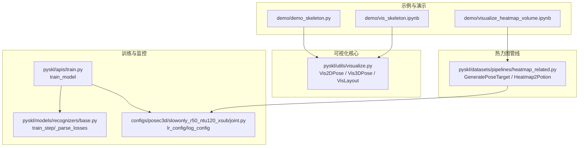
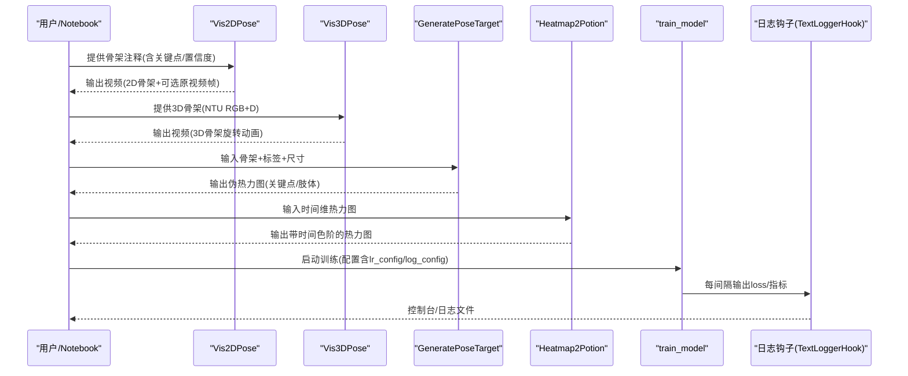
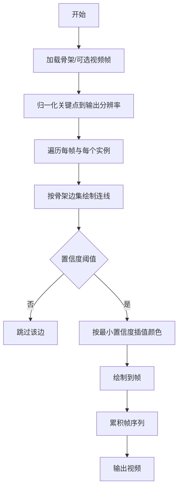
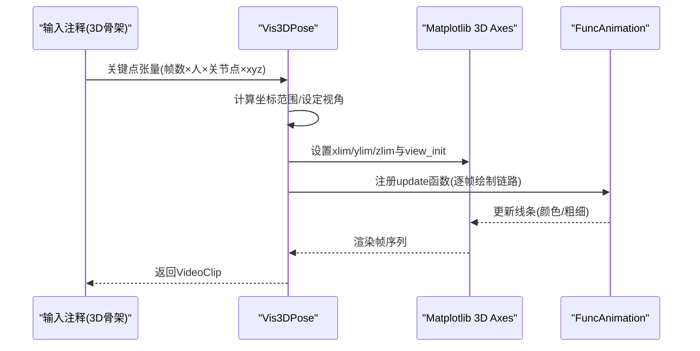
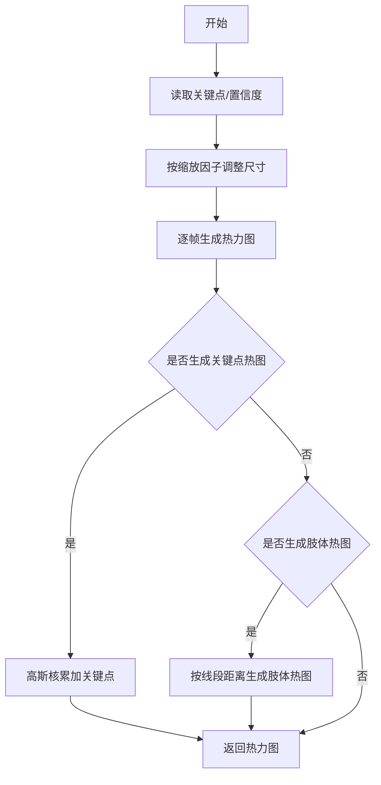
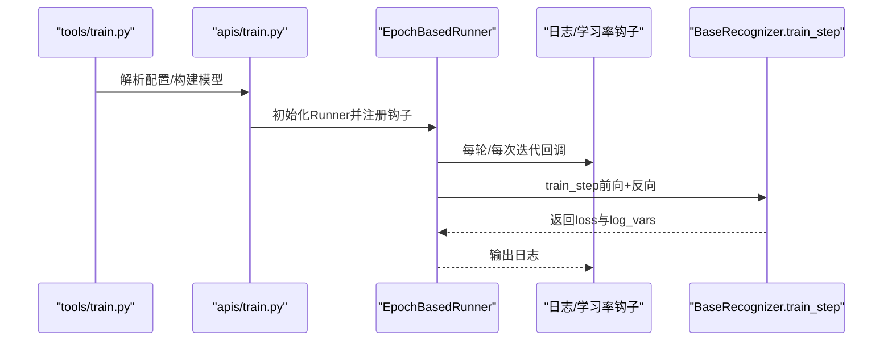
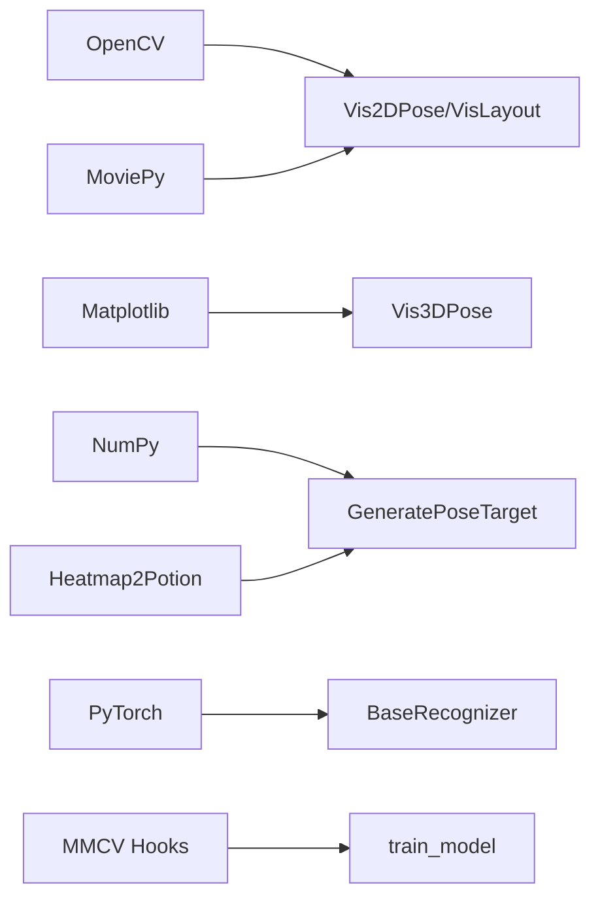

# 可视化工具

<cite>
**本文引用的文件**   
- [pyskl/utils/visualize.py](file://pyskl/utils/visualize.py)
- [demo/demo_skeleton.py](file://demo/demo_skeleton.py)
- [demo/vis_skeleton.ipynb](file://demo/vis_skeleton.ipynb)
- [demo/visualize_heatmap_volume.ipynb](file://demo/visualize_heatmap_volume.ipynb)
- [pyskl/datasets/pipelines/heatmap_related.py](file://pyskl/datasets/pipelines/heatmap_related.py)
- [pyskl/apis/train.py](file://pyskl/apis/train.py)
- [pyskl/models/recognizers/base.py](file://pyskl/models/recognizers/base.py)
- [configs/posec3d/slowonly_r50_ntu120_xsub/joint.py](file://configs/posec3d/slowonly_r50_ntu120_xsub/joint.py)
- [tools/train.py](file://tools/train.py)
</cite>

## 目录
1. [简介](#简介)
2. [项目结构](#项目结构)
3. [核心组件](#核心组件)
4. [架构总览](#架构总览)
5. [详细组件分析](#详细组件分析)
6. [依赖关系分析](#依赖关系分析)
7. [性能考虑](#性能考虑)
8. [故障排查指南](#故障排查指南)
9. [结论](#结论)
10. [附录](#附录)

## 简介
本文件系统性梳理 PySKL 的可视化能力与训练监控支持，覆盖以下方面：
- 骨架数据可视化：关键点绘制、骨骼连接线、置信度可视化
- 热力图绘制工具：伪热力图生成、颜色映射、透明度与合成策略
- 训练过程监控：日志钩子、学习率调度、评估指标输出
- 多库集成：Matplotlib、OpenCV、MoviePy、MMPose/MMDetection
- 可视化定制：主题与样式、交互式图表思路
- 实战应用与最佳实践：从示例到性能优化

## 项目结构
围绕可视化与训练监控的关键路径如下：
- 可视化核心：pyskl/utils/visualize.py（2D/3D骨架、布局框）
- 热力图生成：pyskl/datasets/pipelines/heatmap_related.py（伪热力图、时间通道着色）
- 训练入口与钩子：pyskl/apis/train.py、pyskl/models/recognizers/base.py
- 示例与演示：demo/*.py 与 demo/*.ipynb
- 配置模板：configs/posec3d/*（学习率、日志、评估）

**图表来源**
- [pyskl/utils/visualize.py](file://pyskl/utils/visualize.py#L1-L238)
- [pyskl/datasets/pipelines/heatmap_related.py](file://pyskl/datasets/pipelines/heatmap_related.py#L1-L349)
- [pyskl/apis/train.py](file://pyskl/apis/train.py#L50-L213)
- [pyskl/models/recognizers/base.py](file://pyskl/models/recognizers/base.py#L118-L195)
- [configs/posec3d/slowonly_r50_ntu120_xsub/joint.py](file://configs/posec3d/slowonly_r50_ntu120_xsub/joint.py#L76-L83)
- [demo/demo_skeleton.py](file://demo/demo_skeleton.py#L1-L314)
- [demo/vis_skeleton.ipynb](file://demo/vis_skeleton.ipynb#L1-L113)
- [demo/visualize_heatmap_volume.ipynb](file://demo/visualize_heatmap_volume.ipynb#L1-L378)

**章节来源**
- [pyskl/utils/visualize.py](file://pyskl/utils/visualize.py#L1-L238)
- [pyskl/datasets/pipelines/heatmap_related.py](file://pyskl/datasets/pipelines/heatmap_related.py#L1-L349)
- [pyskl/apis/train.py](file://pyskl/apis/train.py#L50-L213)
- [pyskl/models/recognizers/base.py](file://pyskl/models/recognizers/base.py#L118-L195)
- [configs/posec3d/slowonly_r50_ntu120_xsub/joint.py](file://configs/posec3d/slowonly_r50_ntu120_xsub/joint.py#L76-L83)
- [demo/demo_skeleton.py](file://demo/demo_skeleton.py#L1-L314)
- [demo/vis_skeleton.ipynb](file://demo/vis_skeleton.ipynb#L1-L113)
- [demo/visualize_heatmap_volume.ipynb](file://demo/visualize_heatmap_volume.ipynb#L1-L378)

## 核心组件
- 2D 骨架可视化（Vis2DPose）：基于 OpenCV 绘制关键点与骨骼连线，按置信度插值渐变颜色；可叠加原始视频帧或纯背景。
- 3D 骨架可视化（Vis3DPose）：基于 Matplotlib 3D Axes 绘制骨架序列，支持旋转视角、网格开关、统一坐标轴范围。
- 布局框可视化（VisLayout）：对检测框进行类别映射与颜色编码，便于多目标跟踪场景下的轨迹呈现。
- 伪热力图生成（GeneratePoseTarget）：将关键点/肢体坐标与置信度映射为高斯伪热力图，支持左右翻转增强。
- 时间通道着色（Heatmap2Potion）：将时间维映射为颜色，生成带时间信息的伪热力图，便于理解时序模式。

**章节来源**
- [pyskl/utils/visualize.py](file://pyskl/utils/visualize.py#L101-L172)
- [pyskl/utils/visualize.py](file://pyskl/utils/visualize.py#L41-L98)
- [pyskl/utils/visualize.py](file://pyskl/utils/visualize.py#L175-L237)
- [pyskl/datasets/pipelines/heatmap_related.py](file://pyskl/datasets/pipelines/heatmap_related.py#L9-L274)
- [pyskl/datasets/pipelines/heatmap_related.py](file://pyskl/datasets/pipelines/heatmap_related.py#L280-L348)

## 架构总览
下图展示从数据到可视化的端到端流程，以及训练监控如何通过日志钩子输出指标。

**图表来源**
- [pyskl/utils/visualize.py](file://pyskl/utils/visualize.py#L101-L172)
- [pyskl/utils/visualize.py](file://pyskl/utils/visualize.py#L41-L98)
- [pyskl/datasets/pipelines/heatmap_related.py](file://pyskl/datasets/pipelines/heatmap_related.py#L9-L274)
- [pyskl/datasets/pipelines/heatmap_related.py](file://pyskl/datasets/pipelines/heatmap_related.py#L280-L348)
- [pyskl/apis/train.py](file://pyskl/apis/train.py#L117-L121)
- [configs/posec3d/slowonly_r50_ntu120_xsub/joint.py](file://configs/posec3d/slowonly_r50_ntu120_xsub/joint.py#L76-L83)

## 详细组件分析

### 2D 骨架可视化（Vis2DPose）
- 输入：骨架注释字典（关键点、可选置信度、图像尺寸、帧数信息），可选原始视频路径
- 关键逻辑：
  - 将关键点按输出分辨率归一化
  - 按骨架拓扑绘制边，颜色根据两端关键点最小置信度插值
  - 支持叠加视频帧或纯背景帧
- 输出：MoviePy ImageSequenceClip，可直接在 Jupyter 中预览或写入视频

**图表来源**
- [pyskl/utils/visualize.py](file://pyskl/utils/visualize.py#L101-L172)

**章节来源**
- [pyskl/utils/visualize.py](file://pyskl/utils/visualize.py#L101-L172)

### 3D 骨架可视化（Vis3DPose）
- 输入：NTU RGB+D 骨架（25 关节点），要求预归一化
- 关键逻辑：
  - 自适应设定3D坐标轴范围，保证不同样本比例一致
  - 使用 Matplotlib 3D Axes 绘制骨架链，支持关闭网格
  - 使用 FuncAnimation 逐帧更新视角与线条
- 输出：MoviePy VideoClip，可保存为 MP4 并在 Jupyter 中播放

**图表来源**
- [pyskl/utils/visualize.py](file://pyskl/utils/visualize.py#L41-L98)

**章节来源**
- [pyskl/utils/visualize.py](file://pyskl/utils/visualize.py#L41-L98)

### 布局框可视化（VisLayout）
- 输入：检测框与帧索引、类别（可选）
- 关键逻辑：
  - 将框坐标按输出分辨率缩放
  - 类别到颜色映射，支持“手”等特殊类别
  - 在每帧上绘制矩形框
- 输出：MoviePy 视频片段

**章节来源**
- [pyskl/utils/visualize.py](file://pyskl/utils/visualize.py#L175-L237)

### 伪热力图生成（GeneratePoseTarget）
- 功能：将关键点/肢体坐标与置信度映射为高斯伪热力图
- 关键点/肢体热图生成：
  - 单关节点：以高斯核累加最大值
  - 肢体：计算点到线段距离，沿中心线采样并加权
- 可选翻转增强：左右关键点/肢体互换，生成双份热力图
- 输出：(帧, 通道, H, W) 的热力图张量

**图表来源**
- [pyskl/datasets/pipelines/heatmap_related.py](file://pyskl/datasets/pipelines/heatmap_related.py#L73-L206)

**章节来源**
- [pyskl/datasets/pipelines/heatmap_related.py](file://pyskl/datasets/pipelines/heatmap_related.py#L9-L274)

### 时间通道着色（Heatmap2Potion）
- 功能：将时间维映射为颜色，生成带时间信息的伪热力图
- 方法：对每个时间步分配颜色向量，按时间加权求和，再做归一化与组合
- 输出：(N, H, W, K, C) 或拼接后的 4D 形状

**章节来源**
- [pyskl/datasets/pipelines/heatmap_related.py](file://pyskl/datasets/pipelines/heatmap_related.py#L280-L348)

### 训练过程监控与可视化
- 训练入口：train_model 注册学习率、优化器、检查点、日志钩子
- 日志钩子：TextLoggerHook 按配置间隔输出 loss 与指标
- 指标解析：BaseRecognizer._parse_losses 将多头损失汇总并广播/规约
- 配置要点：lr_config（余弦退火）、log_config（日志间隔）、evaluation（指标）

**图表来源**
- [pyskl/apis/train.py](file://pyskl/apis/train.py#L50-L144)
- [pyskl/models/recognizers/base.py](file://pyskl/models/recognizers/base.py#L118-L195)
- [configs/posec3d/slowonly_r50_ntu120_xsub/joint.py](file://configs/posec3d/slowonly_r50_ntu120_xsub/joint.py#L76-L83)

**章节来源**
- [pyskl/apis/train.py](file://pyskl/apis/train.py#L50-L144)
- [pyskl/models/recognizers/base.py](file://pyskl/models/recognizers/base.py#L118-L195)
- [configs/posec3d/slowonly_r50_ntu120_xsub/joint.py](file://configs/posec3d/slowonly_r50_ntu120_xsub/joint.py#L76-L83)

## 依赖关系分析
- 可视化模块依赖 OpenCV（绘图）、Matplotlib（2D/3D）、MoviePy（视频合成）
- 热力图管线依赖 NumPy 进行高斯核与张量运算
- 训练监控依赖 MMCV 的 Runner/Hook 体系与 PyTorch 优化器

**图表来源**
- [pyskl/utils/visualize.py](file://pyskl/utils/visualize.py#L1-L12)
- [pyskl/datasets/pipelines/heatmap_related.py](file://pyskl/datasets/pipelines/heatmap_related.py#L1-L7)
- [pyskl/apis/train.py](file://pyskl/apis/train.py#L10-L14)
- [pyskl/models/recognizers/base.py](file://pyskl/models/recognizers/base.py#L1-L11)

**章节来源**
- [pyskl/utils/visualize.py](file://pyskl/utils/visualize.py#L1-L12)
- [pyskl/datasets/pipelines/heatmap_related.py](file://pyskl/datasets/pipelines/heatmap_related.py#L1-L7)
- [pyskl/apis/train.py](file://pyskl/apis/train.py#L10-L14)
- [pyskl/models/recognizers/base.py](file://pyskl/models/recognizers/base.py#L1-L11)

## 性能考虑
- 内存管理
  - 骨架可视化：优先使用纯背景帧而非加载整段视频，减少内存峰值
  - 热力图生成：控制帧长与分辨率，避免一次性构造超大张量
  - 训练日志：合理设置 log_config.interval，避免频繁 I/O
- 计算效率
  - 高斯热图：尽量批量化生成，减少 Python 循环开销
  - 3D 可视化：降低 fps 与帧数，或关闭网格以提升渲染速度
- 分布式训练
  - 日志聚合：确保分布式环境下指标规约正确，避免重复打印

[本节为通用指导，无需特定文件引用]

## 故障排查指南
- 无法导入 OpenCV/Matplotlib/MoviePy
  - 现象：运行可视化时报错
  - 排查：确认安装对应依赖，Jupyter 环境中可使用 ipython_display() 需要 notebook 支持
- 3D 骨架未归一化导致坐标异常
  - 现象：3D 视角比例失真或越界
  - 排查：确保输入前进行归一化（如 PreNormalize3D）
- 置信度过低导致边不显示
  - 现象：2D 骨架连线缺失
  - 排查：适当降低阈值 thre，并检查 keypoint_score 是否存在
- 学习率/日志未生效
  - 现象：训练无日志输出或学习率不变
  - 排查：确认 lr_config/log_config 是否在配置中启用，Runner 是否注册相应钩子

**章节来源**
- [demo/vis_skeleton.ipynb](file://demo/vis_skeleton.ipynb#L68-L70)
- [demo/visualize_heatmap_volume.ipynb](file://demo/visualize_heatmap_volume.ipynb#L227-L231)
- [configs/posec3d/slowonly_r50_ntu120_xsub/joint.py](file://configs/posec3d/slowonly_r50_ntu120_xsub/joint.py#L76-L83)
- [pyskl/apis/train.py](file://pyskl/apis/train.py#L117-L121)

## 结论
PySKL 的可视化工具以简洁 API 实现了从骨架到视频的快速呈现，并通过伪热力图与时间通道着色帮助理解时空模式。结合训练日志钩子与配置化学习率策略，能够有效支撑训练过程的监控与调优。建议在实际项目中：
- 先用纯背景帧验证可视化流程，再叠加真实视频
- 对热力图生成采用合理的 sigma 与缩放，平衡精度与性能
- 利用配置文件统一管理学习率与日志策略，便于复现实验

[本节为总结，无需特定文件引用]

## 附录

### 可视化定制指南
- 主题与样式
  - Matplotlib：通过 rcParams 或 plt.style 变更字体、线条宽度、色彩方案
  - OpenCV：自定义颜色表、线宽、透明度（需在绘制前计算 alpha）
- 交互式图表
  - 可在 Jupyter 中使用交互控件（如 ipywidgets）动态切换阈值、视角、颜色映射
- 动画与导出
  - MoviePy 支持多种格式导出，注意选择合适的编解码器与比特率

[本节为通用指导，无需特定文件引用]

### 实际应用场景与最佳实践
- 行为识别可视化
  - 使用 Vis2DPose/Vis3DPose 展示动作片段的骨架轨迹，结合类别标签
- 热力图分析
  - 使用 GeneratePoseTarget 生成关键点/肢体热图，配合 Heatmap2Potion 观察时间演化
- 训练监控
  - 通过 TextLoggerHook 输出 loss 与 top-k 准确率，结合 lr_config 的余弦退火策略

**章节来源**
- [demo/demo_skeleton.py](file://demo/demo_skeleton.py#L227-L314)
- [demo/vis_skeleton.ipynb](file://demo/vis_skeleton.ipynb#L32-L71)
- [demo/visualize_heatmap_volume.ipynb](file://demo/visualize_heatmap_volume.ipynb#L214-L344)
- [configs/posec3d/slowonly_r50_ntu120_xsub/joint.py](file://configs/posec3d/slowonly_r50_ntu120_xsub/joint.py#L76-L83)