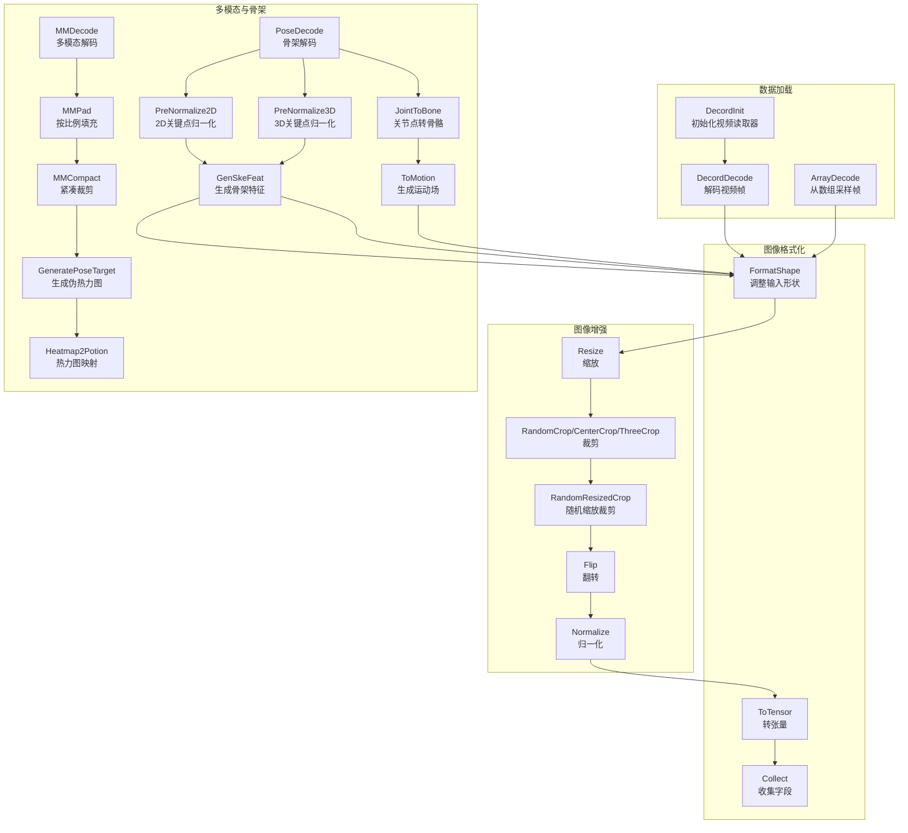
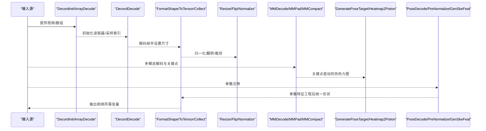
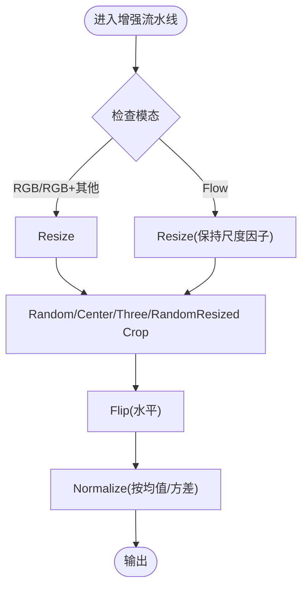
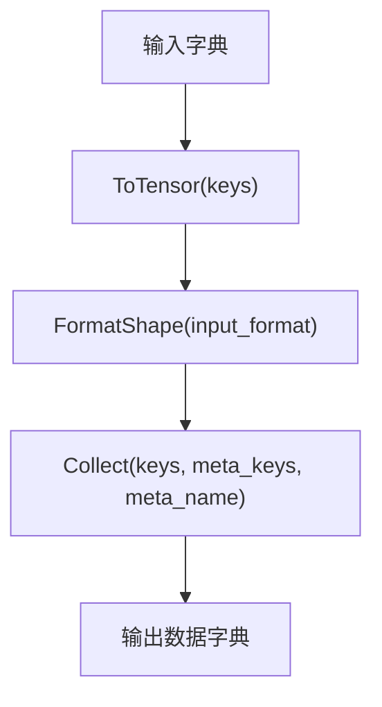
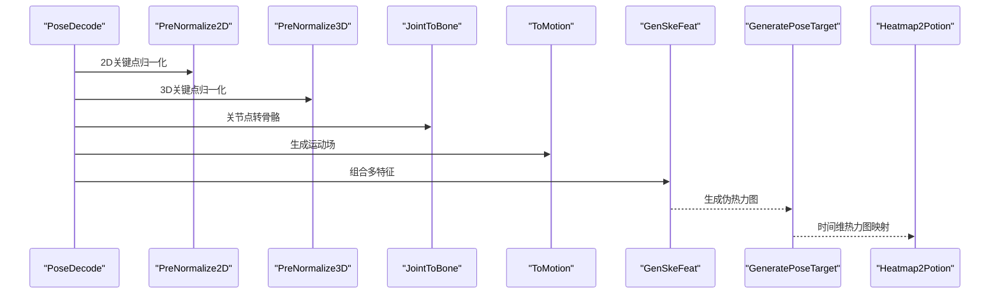
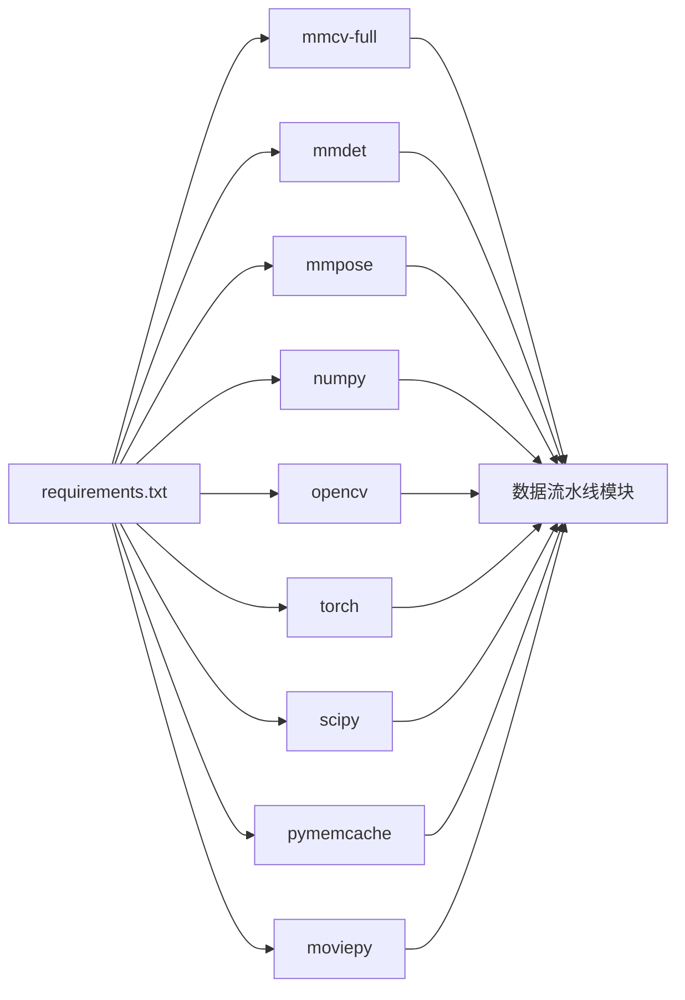

# 图像处理工具

<cite>
**本文引用的文件**
- [pyskl/datasets/pipelines/__init__.py](file://pyskl/datasets/pipelines/__init__.py)
- [pyskl/datasets/pipelines/compose.py](file://pyskl/datasets/pipelines/compose.py)
- [pyskl/datasets/pipelines/loading.py](file://pyskl/datasets/pipelines/loading.py)
- [pyskl/datasets/pipelines/formatting.py](file://pyskl/datasets/pipelines/formatting.py)
- [pyskl/datasets/pipelines/augmentations.py](file://pyskl/datasets/pipelines/augmentations.py)
- [pyskl/datasets/pipelines/heatmap_related.py](file://pyskl/datasets/pipelines/heatmap_related.py)
- [pyskl/datasets/pipelines/pose_related.py](file://pyskl/datasets/pipelines/pose_related.py)
- [pyskl/datasets/pipelines/multi_modality.py](file://pyskl/datasets/pipelines/multi_modality.py)
- [pyskl/utils/misc.py](file://pyskl/utils/misc.py)
- [pyskl/utils/graph.py](file://pyskl/utils/graph.py)
- [demo/demo_skeleton.py](file://demo/demo_skeleton.py)
- [configs/stgcn/stgcn_pyskl_ntu60_xsub_3dkp/b.py](file://configs/stgcn/stgcn_pyskl_ntu60_xsub_3dkp/b.py)
- [requirements.txt](file://requirements.txt)
</cite>

## 目录
1. [简介](#简介)
2. [项目结构](#项目结构)
3. [核心组件](#核心组件)
4. [架构总览](#架构总览)
5. [详细组件分析](#详细组件分析)
6. [依赖关系分析](#依赖关系分析)
7. [性能考虑](#性能考虑)
8. [故障排查指南](#故障排查指南)
9. [结论](#结论)
10. [附录](#附录)

## 简介
本文件系统性梳理 PySKL 的图像与骨架处理管线，覆盖以下方面：
- 图像预处理：尺寸调整、归一化、色彩空间转换、噪声去除等
- 数据格式转换：NumPy 与 Tensor 转换、图像格式互转、元数据提取
- 图像质量评估：PSNR、SSIM 等客观指标（结合外部库使用）
- 图像增强：直方图均衡化、滤波、几何变换等
- 算法实现细节：OpenCV/PIL 集成、批处理优化、内存管理
- 骨架动作识别场景：在 ST-GCN 等模型中的应用、性能优化与并行建议

## 项目结构
PySKL 的数据处理以“流水线”为核心，围绕数据加载、格式化、增强、热力图生成、骨架特征工程与多模态融合展开。下图给出与图像处理相关的关键模块与交互。

图表来源
- [pyskl/datasets/pipelines/loading.py](file://pyskl/datasets/pipelines/loading.py#L10-L185)
- [pyskl/datasets/pipelines/formatting.py](file://pyskl/datasets/pipelines/formatting.py#L11-L250)
- [pyskl/datasets/pipelines/augmentations.py](file://pyskl/datasets/pipelines/augmentations.py#L120-L762)
- [pyskl/datasets/pipelines/multi_modality.py](file://pyskl/datasets/pipelines/multi_modality.py#L12-L230)
- [pyskl/datasets/pipelines/heatmap_related.py](file://pyskl/datasets/pipelines/heatmap_related.py#L9-L349)
- [pyskl/datasets/pipelines/pose_related.py](file://pyskl/datasets/pipelines/pose_related.py#L12-L553)

章节来源
- [pyskl/datasets/pipelines/__init__.py](file://pyskl/datasets/pipelines/__init__.py#L1-L10)

## 核心组件
- 流水线编排：Compose 将一系列变换顺序执行，确保数据字典在各阶段间传递与更新。
- 数据加载：DecordInit/DecordDecode 支持视频解码；ArrayDecode 支持从高维数组直接采样帧。
- 图像格式化：ToTensor 将 NumPy/Tensor/序列统一转为张量；Collect 提取元信息；FormatShape 统一输入维度。
- 图像增强：Resize、RandomCrop/CenterCrop/ThreeCrop、RandomResizedCrop、Flip、Normalize 等。
- 多模态与骨架：MMDecode 统一解码 RGB 与 Pose；MMPad/MMCompact 做图像与关键点的同步处理；GeneratePoseTarget/Heatmap2Potion 生成伪热力图；PoseDecode/PreNormalize2D/PreNormalize3D/GenSkeFeat/JointToBone/ToMotion 完成骨架特征工程。

章节来源
- [pyskl/datasets/pipelines/compose.py](file://pyskl/datasets/pipelines/compose.py#L8-L53)
- [pyskl/datasets/pipelines/loading.py](file://pyskl/datasets/pipelines/loading.py#L10-L185)
- [pyskl/datasets/pipelines/formatting.py](file://pyskl/datasets/pipelines/formatting.py#L11-L250)
- [pyskl/datasets/pipelines/augmentations.py](file://pyskl/datasets/pipelines/augmentations.py#L16-L762)
- [pyskl/datasets/pipelines/multi_modality.py](file://pyskl/datasets/pipelines/multi_modality.py#L12-L230)
- [pyskl/datasets/pipelines/heatmap_related.py](file://pyskl/datasets/pipelines/heatmap_related.py#L9-L349)
- [pyskl/datasets/pipelines/pose_related.py](file://pyskl/datasets/pipelines/pose_related.py#L12-L553)

## 架构总览
下图展示从视频/数组到网络输入的整体流程，强调图像与骨架的协同处理路径。

图表来源
- [pyskl/datasets/pipelines/loading.py](file://pyskl/datasets/pipelines/loading.py#L10-L185)
- [pyskl/datasets/pipelines/formatting.py](file://pyskl/datasets/pipelines/formatting.py#L160-L250)
- [pyskl/datasets/pipelines/augmentations.py](file://pyskl/datasets/pipelines/augmentations.py#L367-L691)
- [pyskl/datasets/pipelines/multi_modality.py](file://pyskl/datasets/pipelines/multi_modality.py#L81-L130)
- [pyskl/datasets/pipelines/heatmap_related.py](file://pyskl/datasets/pipelines/heatmap_related.py#L9-L275)
- [pyskl/datasets/pipelines/pose_related.py](file://pyskl/datasets/pipelines/pose_related.py#L12-L135)

## 详细组件分析

### 图像预处理与增强
- 尺寸调整（Resize）：支持保持宽高比或强制目标尺寸，插值算法可选；同时调整关键点与边界框尺度因子。
- 归一化（Normalize）：支持 RGB/Flow 模态，可选择通道顺序转换；Flow 可按尺度因子调整幅值。
- 裁剪（RandomCrop/CenterCrop/ThreeCrop/RandomResizedCrop）：支持关键点与边界框同步裁剪，维护坐标系一致性。
- 翻转（Flip）：支持水平翻转，关键点左右映射与 Flow 幅值反转；仅支持水平翻转。
- 填充与紧凑（MMPad/MMCompact）：按比例填充图像并同步关键点；紧凑裁剪基于关键点包围盒，保证最小有效区域。

图表来源
- [pyskl/datasets/pipelines/augmentations.py](file://pyskl/datasets/pipelines/augmentations.py#L367-L691)
- [pyskl/datasets/pipelines/multi_modality.py](file://pyskl/datasets/pipelines/multi_modality.py#L13-L56)

章节来源
- [pyskl/datasets/pipelines/augmentations.py](file://pyskl/datasets/pipelines/augmentations.py#L120-L762)
- [pyskl/datasets/pipelines/multi_modality.py](file://pyskl/datasets/pipelines/multi_modality.py#L13-L56)

### 数据格式转换
- NumPy → Tensor：ToTensor 支持多种输入类型，自动转换为张量。
- 形状统一：FormatShape 支持 NCTHW/NCHW/NCTHW_Heatmap 等格式，便于后续网络输入。
- 元数据收集：Collect 将关键字段（如文件名、标签、原图尺寸、填充后尺寸、翻转方向、归一化参数等）打包为元信息容器。

图表来源
- [pyskl/datasets/pipelines/formatting.py](file://pyskl/datasets/pipelines/formatting.py#L11-L250)

章节来源
- [pyskl/datasets/pipelines/formatting.py](file://pyskl/datasets/pipelines/formatting.py#L11-L250)

### 图像质量评估
- PSNR/SSIM：可通过外部库（如 OpenCV/SciPy/ skimage）在 NumPy/Tensor 上计算。建议在归一化前保留原始像素范围，或在统一尺度后进行比较。
- 主观评价：可在可视化后进行人工标注，结合数据集划分进行交叉验证。

说明：本节为通用实践指导，不直接分析具体代码文件。

### 图像增强技术
- 直方图均衡化/滤波：可结合 OpenCV 实现，注意与 Normalize 的顺序与兼容性。
- 几何变换：Resize/Flip/Crop 已内置，可与随机策略组合提升鲁棒性。

说明：本节为通用实践指导，不直接分析具体代码文件。

### 算法实现细节
- OpenCV/PIL 集成：通过 mmcv 包装的图像函数（如缩放、翻转、重采样）统一接口，减少第三方库差异。
- 批处理优化：Compose 顺序执行，尽量将耗时操作（如解码、归一化）向量化；对关键点与图像同步处理，避免重复遍历。
- 内存管理：Decord 解码后及时释放读取器句柄；多进程缓存（memcached）可加速数据加载。

章节来源
- [pyskl/datasets/pipelines/loading.py](file://pyskl/datasets/pipelines/loading.py#L32-L137)
- [pyskl/utils/misc.py](file://pyskl/utils/misc.py#L18-L95)

### 骨架动作识别中的应用
- 骨骼特征工程：PreNormalize2D/PreNormalize3D 对关键点做归一化；JointToBone/ToMotion 生成骨骼与运动场；GenSkeFeat 统一封装多特征拼接。
- 伪热力图：GeneratePoseTarget 基于关键点生成高斯伪热力图；Heatmap2Potion 将时间维热力图映射为彩色体积。
- 多模态融合：MMDecode 同步解码 RGB 与 Pose；MMPad/MMCompact 保证图像与关键点的一致性。

图表来源
- [pyskl/datasets/pipelines/pose_related.py](file://pyskl/datasets/pipelines/pose_related.py#L12-L553)
- [pyskl/datasets/pipelines/heatmap_related.py](file://pyskl/datasets/pipelines/heatmap_related.py#L9-L275)

章节来源
- [pyskl/datasets/pipelines/pose_related.py](file://pyskl/datasets/pipelines/pose_related.py#L12-L553)
- [pyskl/datasets/pipelines/heatmap_related.py](file://pyskl/datasets/pipelines/heatmap_related.py#L9-L275)

## 依赖关系分析
- 外部依赖：mmcv、mmdet、mmpose、moviepy、numpy、opencv、torch、scipy、pymemcache 等。
- 模块耦合：流水线内部通过注册机制扩展变换；多模态模块继承自加载与解码类，实现统一接口。

图表来源
- [requirements.txt](file://requirements.txt#L1-L14)

章节来源
- [requirements.txt](file://requirements.txt#L1-L14)

## 性能考虑
- 批处理与向量化：优先使用 NumPy/张量的向量化操作，避免 Python 循环；在流水线中尽量减少重复转换。
- I/O 与缓存：利用 memcached 缓存注释与中间结果，降低磁盘访问；合理设置多进程数与内存上限。
- 解码与内存：Decord 解码后及时释放资源；对大视频采用高效模式（仅关键帧）或按需采样。
- 归一化与尺度：先统一尺寸再归一化，避免重复缩放；Flow 模态的幅度调整需与尺度因子一致。

章节来源
- [pyskl/datasets/pipelines/loading.py](file://pyskl/datasets/pipelines/loading.py#L32-L137)
- [pyskl/utils/misc.py](file://pyskl/utils/misc.py#L18-L95)

## 故障排查指南
- 导入异常：若缺少检测/姿态估计库，demo 中会降级提示；请按需安装 mmdet/mmpose。
- 视频解码失败：确认 decord 安装与版本；检查 io_backend 与文件路径。
- 归一化错误：确保 mean/std 与模态匹配；Flow 模态需提供双通道均值/方差。
- 多模态不一致：MMDecode 后需同步调整关键点到新图像尺寸；MMPad/MMCompact 保证填充与裁剪一致。
- 内存不足：调小缓存大小或进程数；及时释放中间变量与读取器。

章节来源
- [demo/demo_skeleton.py](file://demo/demo_skeleton.py#L15-L44)
- [pyskl/datasets/pipelines/loading.py](file://pyskl/datasets/pipelines/loading.py#L32-L137)
- [pyskl/datasets/pipelines/augmentations.py](file://pyskl/datasets/pipelines/augmentations.py#L608-L691)
- [pyskl/datasets/pipelines/multi_modality.py](file://pyskl/datasets/pipelines/multi_modality.py#L81-L130)
- [pyskl/utils/misc.py](file://pyskl/utils/misc.py#L18-L95)

## 结论
PySKL 的图像与骨架处理管线以 mmcv 为基础，围绕“流水线 + 多模态 + 骨骼特征工程”的思路构建，既满足通用图像预处理需求，又针对骨架动作识别场景提供了完善的伪热力图与特征工程能力。通过合理的批处理、缓存与内存管理策略，可在大规模数据上取得良好性能。

## 附录
- 示例配置：ST-GCN 在 NTU60 XSub 3D 关键点上的训练/验证/测试流水线配置展示了典型的数据流与网络输入要求。
- 示例脚本：demo_skeleton.py 展示了从视频到骨架再到动作识别的完整链路，适合对照理解各模块作用。

章节来源
- [configs/stgcn/stgcn_pyskl_ntu60_xsub_3dkp/b.py](file://configs/stgcn/stgcn_pyskl_ntu60_xsub_3dkp/b.py#L1-L61)
- [demo/demo_skeleton.py](file://demo/demo_skeleton.py#L227-L314)