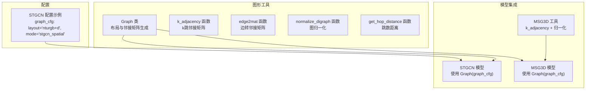
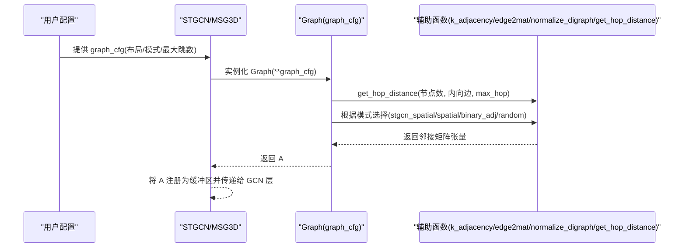
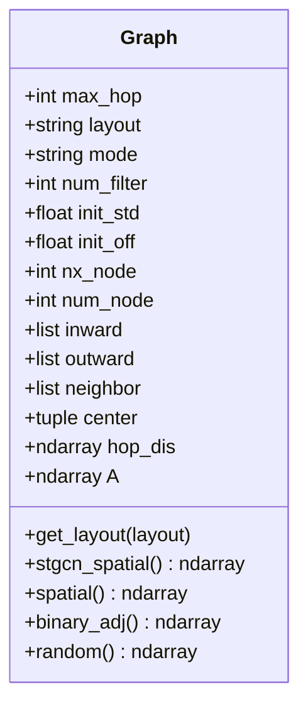
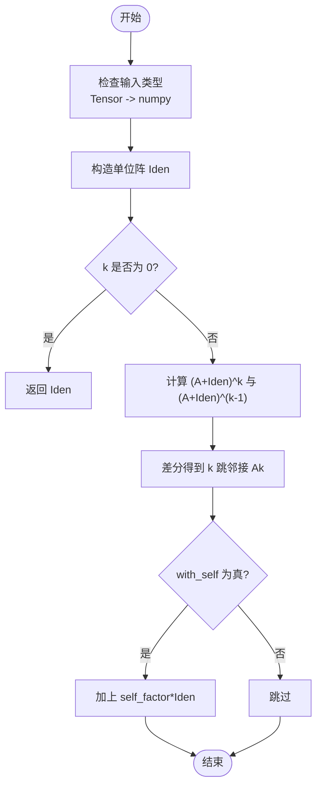
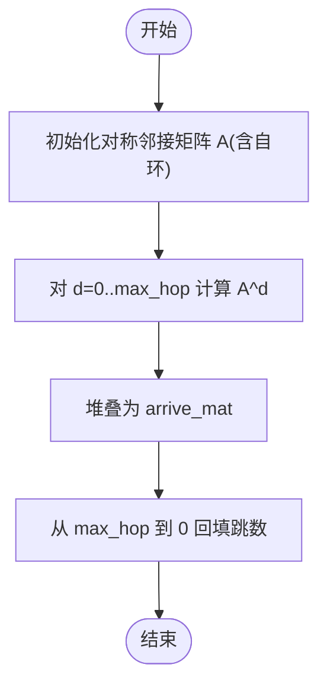
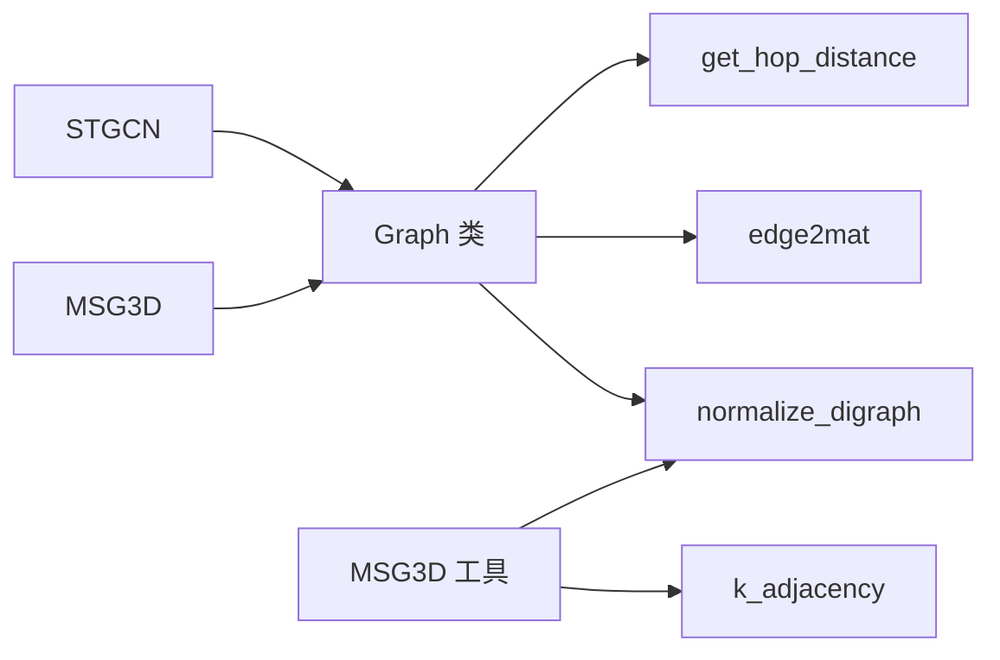

# 图形处理工具

<cite>
**本文引用的文件**
- [pyskl/utils/graph.py](file://pyskl/utils/graph.py)
- [pyskl/models/gcns/stgcn.py](file://pyskl/models/gcns/stgcn.py)
- [pyskl/models/gcns/msg3d.py](file://pyskl/models/gcns/msg3d.py)
- [pyskl/models/gcns/utils/msg3d_utils.py](file://pyskl/models/gcns/utils/msg3d_utils.py)
- [configs/stgcn/stgcn_pyskl_ntu60_xsub_3dkp/b.py](file://configs/stgcn/stgcn_pyskl_ntu60_xsub_3dkp/b.py)
</cite>

## 目录
1. [简介](#简介)
2. [项目结构](#项目结构)
3. [核心组件](#核心组件)
4. [架构总览](#架构总览)
5. [详细组件分析](#详细组件分析)
6. [依赖分析](#依赖分析)
7. [性能考虑](#性能考虑)
8. [故障排查指南](#故障排查指南)
9. [结论](#结论)
10. [附录](#附录)

## 简介
本文件系统性梳理 PySKL 的图形处理工具，重点围绕 Graph 类的设计与实现展开，涵盖骨架图构建原理、邻接矩阵计算、跳数距离计算、k 跳邻接矩阵生成、边到邻接矩阵转换、图归一化、以及不同布局模式（openpose、nturgb+d、coco、handmp）的节点与连接关系。同时阐明 Graph 类支持的空间模式（stgcn_spatial 与 spatial）及其应用场景，并给出大图处理与内存优化的最佳实践。

## 项目结构
与图形处理直接相关的核心文件如下：
- 图形工具与算法：pyskl/utils/graph.py
- 模型中对 Graph 的使用：pyskl/models/gcns/stgcn.py、pyskl/models/gcns/msg3d.py
- MSG3D 中对 k 邻接与归一化的使用：pyskl/models/gcns/utils/msg3d_utils.py
- 配置示例：configs/stgcn/stgcn_pyskl_ntu60_xsub_3dkp/b.py

图表来源
- [pyskl/utils/graph.py](file://pyskl/utils/graph.py#L58-L174)
- [pyskl/models/gcns/stgcn.py](file://pyskl/models/gcns/stgcn.py#L72-L74)
- [pyskl/models/gcns/msg3d.py](file://pyskl/models/gcns/msg3d.py#L21-L25)
- [pyskl/models/gcns/utils/msg3d_utils.py](file://pyskl/models/gcns/utils/msg3d_utils.py#L191-L192)
- [configs/stgcn/stgcn_pyskl_ntu60_xsub_3dkp/b.py](file://configs/stgcn/stgcn_pyskl_ntu60_xsub_3dkp/b.py#L1-L6)

章节来源
- [pyskl/utils/graph.py](file://pyskl/utils/graph.py#L58-L174)
- [pyskl/models/gcns/stgcn.py](file://pyskl/models/gcns/stgcn.py#L72-L74)
- [pyskl/models/gcns/msg3d.py](file://pyskl/models/gcns/msg3d.py#L21-L25)
- [pyskl/models/gcns/utils/msg3d_utils.py](file://pyskl/models/gcns/utils/msg3d_utils.py#L191-L192)
- [configs/stgcn/stgcn_pyskl_ntu60_xsub_3dkp/b.py](file://configs/stgcn/stgcn_pyskl_ntu60_xsub_3dkp/b.py#L1-L6)

## 核心组件
- Graph 类：根据布局（layout）与模式（mode）生成邻接矩阵张量，供 GCN 模型使用。
- 辅助函数：
  - k_adjacency：基于矩阵幂运算生成 k 跳邻接矩阵，支持自连接开关。
  - edge2mat：将边列表转换为邻接矩阵。
  - normalize_digraph：按行或列进行度归一化。
  - get_hop_distance：计算节点间的跳数距离矩阵。

章节来源
- [pyskl/utils/graph.py](file://pyskl/utils/graph.py#L5-L55)
- [pyskl/utils/graph.py](file://pyskl/utils/graph.py#L58-L174)

## 架构总览
Graph 在模型初始化时被实例化，生成的邻接矩阵 A 以张量形式注册为缓冲区，供各 GCN 层调用。ST-GCN 与 MSG3D 均通过 Graph(graph_cfg) 获取 A，再传入对应的 GCN 单元。

图表来源
- [pyskl/models/gcns/stgcn.py](file://pyskl/models/gcns/stgcn.py#L72-L74)
- [pyskl/models/gcns/msg3d.py](file://pyskl/models/gcns/msg3d.py#L21-L25)
- [pyskl/utils/graph.py](file://pyskl/utils/graph.py#L88-L92)
- [pyskl/utils/graph.py](file://pyskl/utils/graph.py#L138-L166)

## 详细组件分析

### Graph 类设计与实现
- 初始化流程
  - 校验布局与模式参数，加载布局定义与内向/外向边集合。
  - 计算跳数距离矩阵 hop_dis，用于后续模式生成。
  - 根据 mode 调用对应方法生成邻接矩阵张量 A。
- 支持的布局与中心点
  - openpose：18 节点，中心为第 1 号节点。
  - nturgb+d：25 节点，中心为第 20 号节点（索引从 0 开始）。
  - coco：17 节点，中心为第 0 号节点。
  - handmp：21 节点，中心为第 0 号节点。
- 模式差异
  - stgcn_spatial：基于跳数距离矩阵生成多尺度邻接块，区分“靠近中心”和“远离中心”的边。
  - spatial：分别构造自连接、内向、外向邻接矩阵的三通道堆叠。
  - binary_adj：二值邻接矩阵（无归一化）。
  - random：随机邻接矩阵（仅在 nx_node>1 且 mode='random' 时可用）。

图表来源
- [pyskl/utils/graph.py](file://pyskl/utils/graph.py#L58-L174)

章节来源
- [pyskl/utils/graph.py](file://pyskl/utils/graph.py#L58-L174)

### k_adjacency 函数：k 跳邻接矩阵生成
- 输入：邻接矩阵 A（可为 Tensor 或 ndarray）、k 值、是否包含自连接、自连接权重因子。
- 处理流程
  - 若输入为 Tensor，则转为 numpy。
  - 构造单位阵 Iden；当 k=0 时返回 Iden。
  - 使用矩阵幂运算 (A + Iden)^k 与前一阶差分，得到精确的 k 跳邻接矩阵。
  - 若 with_self 为真，则叠加 self_factor * Iden。
- with_self 参数作用
  - 控制是否在 k 跳邻接中加入自连接，有助于保留节点自身信息，常用于时间-空间图卷积。

图表来源
- [pyskl/utils/graph.py](file://pyskl/utils/graph.py#L5-L16)

章节来源
- [pyskl/utils/graph.py](file://pyskl/utils/graph.py#L5-L16)

### edge2mat 函数：边到邻接矩阵
- 输入：边列表 link、节点总数 num_node。
- 输出：邻接矩阵 A（num_node × num_node），其中 A[j, i] = 1 表示 i 连接到 j。
- 用途：将内向/外向/自连接边列表转换为矩阵，作为 normalize_digraph 的输入。

章节来源
- [pyskl/utils/graph.py](file://pyskl/utils/graph.py#L19-L23)

### normalize_digraph 函数：图归一化
- 输入：邻接矩阵 A、归一化维度 dim（默认 0）。
- 处理：计算行和（或列和）Dl，构造对角矩阵 Dn，输出 ADn（或 A·Dn）。
- 用途：确保每一行（或列）的和为 1，常用于 GCN 的稳定传播。

章节来源
- [pyskl/utils/graph.py](file://pyskl/utils/graph.py#L26-L37)

### get_hop_distance 函数：跳数距离计算
- 输入：节点数、边列表、最大跳数 max_hop。
- 处理：
  - 构造对称邻接矩阵 A（含自环）。
  - 对 d=0..max_hop 计算 A^d，得到可达矩阵。
  - 从最大跳数回推，为可达位置标注其最小跳数。
- 输出：hop_dis[i, j] 表示从 j 到 i 的最小跳数（无穷大表示不可达）。

图表来源
- [pyskl/utils/graph.py](file://pyskl/utils/graph.py#L40-L55)

章节来源
- [pyskl/utils/graph.py](file://pyskl/utils/graph.py#L40-L55)

### 不同布局模式与节点连接
- openpose（18 节点）
  - 中心：1
  - 典型连接：头-鼻子-颈部、肩-肘-腕、髋-膝-踝等链式连接。
- nturgb+d（25 节点）
  - 中心：20（索引从 0 开始）
  - 连接：躯干主干 + 四肢 + 两足/两臂分支。
- coco（17 节点）
  - 中心：0
  - 连接：头部关键点 + 躯干 + 四肢。
- handmp（21 节点）
  - 中心：0
  - 连接：手腕到指尖的链式结构。

章节来源
- [pyskl/utils/graph.py](file://pyskl/utils/graph.py#L97-L136)

### stgcn_spatial 与 spatial 两种空间模式
- stgcn_spatial
  - 基于 hop_dis 生成多尺度邻接块：每个 hop 距离生成两个子块（靠近中心、远离中心），并进行归一化。
  - 适合 ST-GCN 等需要按跳数与中心相对位置建模的场景。
- spatial
  - 生成三通道邻接张量：自连接、内向、外向。
  - 适合通用 GCN 结构，强调方向性与局部性。
- 应用场景
  - stgcn_spatial：动作识别、行为理解等需要显式跳数与中心感知的任务。
  - spatial：更通用的骨架图卷积任务。

章节来源
- [pyskl/utils/graph.py](file://pyskl/utils/graph.py#L138-L166)

### 模型中的使用示例
- STGCN
  - 通过 Graph(**graph_cfg) 生成 A，并注册为缓冲区供网络使用。
- MSG3D
  - 同样通过 Graph(graph_cfg) 获取 A，并在 MSG3D 工具中进一步使用 k_adjacency 与 normalize_digraph 生成多尺度邻接。

章节来源
- [pyskl/models/gcns/stgcn.py](file://pyskl/models/gcns/stgcn.py#L72-L74)
- [pyskl/models/gcns/msg3d.py](file://pyskl/models/gcns/msg3d.py#L21-L25)
- [pyskl/models/gcns/utils/msg3d_utils.py](file://pyskl/models/gcns/utils/msg3d_utils.py#L191-L192)

## 依赖分析
- Graph 依赖
  - get_hop_distance：用于生成跳数距离矩阵。
  - edge2mat/normalize_digraph：用于将边列表转换为邻接矩阵并进行归一化。
  - k_adjacency：在 MSG3D 工具中用于生成多尺度邻接。
- 模型依赖
  - STGCN/MSG3D 在初始化时依赖 Graph，随后将 A 注册为缓冲区并在前向传播中使用。

图表来源
- [pyskl/utils/graph.py](file://pyskl/utils/graph.py#L40-L55)
- [pyskl/utils/graph.py](file://pyskl/utils/graph.py#L19-L37)
- [pyskl/utils/graph.py](file://pyskl/utils/graph.py#L5-L16)
- [pyskl/models/gcns/msg3d.py](file://pyskl/models/gcns/msg3d.py#L21-L25)
- [pyskl/models/gcns/utils/msg3d_utils.py](file://pyskl/models/gcns/utils/msg3d_utils.py#L191-L192)

章节来源
- [pyskl/utils/graph.py](file://pyskl/utils/graph.py#L40-L55)
- [pyskl/utils/graph.py](file://pyskl/utils/graph.py#L19-L37)
- [pyskl/utils/graph.py](file://pyskl/utils/graph.py#L5-L16)
- [pyskl/models/gcns/msg3d.py](file://pyskl/models/gcns/msg3d.py#L21-L25)
- [pyskl/models/gcns/utils/msg3d_utils.py](file://pyskl/models/gcns/utils/msg3d_utils.py#L191-L192)

## 性能考虑
- 大图处理
  - 使用稀疏矩阵（如 scipy.sparse）替代稠密 numpy 数组，减少内存占用与矩阵运算开销。
  - 在 Graph.stgcn_spatial 中，尽量减小 max_hop，避免生成过多邻接块。
  - 将 A 注册为缓冲区（register_buffer）而非普通参数，避免反向传播时的梯度更新，节省显存。
- 内存优化
  - edge2mat 与 normalize_digraph 仅在初始化阶段调用，避免在前向中重复计算。
  - k_adjacency 的幂运算复杂度较高，建议缓存中间结果或限制 num_scales。
- 并行与批处理
  - 在 batch 维度上合并多个样本的图操作，利用向量化加速。
- 设备与数据类型
  - 尽量在 CPU 上完成图构建，在 GPU 上仅持有张量缓冲区，减少主机-设备同步成本。

## 故障排查指南
- 常见错误
  - 布局名称不正确：确认 layout 必须为 openpose、nturgb+d、coco、handmp 之一。
  - 模式不存在：确认 mode 必须为 stgcn_spatial、spatial、binary_adj、random 之一。
  - nx_node 与 mode 不匹配：仅当 mode='random' 时 nx_node 可大于 1。
- 定位方法
  - 打印 Graph.num_node、hop_dis、A 的形状，核对布局与模式是否符合预期。
  - 检查 edge2mat 生成的邻接矩阵是否对称（对于无向边）。
  - 核对 normalize_digraph 的维度与非零度约束。

章节来源
- [pyskl/utils/graph.py](file://pyskl/utils/graph.py#L85-L86)
- [pyskl/utils/graph.py](file://pyskl/utils/graph.py#L91-L92)
- [pyskl/utils/graph.py](file://pyskl/utils/graph.py#L172-L174)

## 结论
Graph 类提供了统一的骨架图建模接口，结合多种布局与空间模式，能够灵活适配不同的动作理解任务。通过跳数距离与 k 跳邻接矩阵，系统实现了从基础图结构到高级空间-时间建模的完整路径。配合合理的内存与性能优化策略，可在大规模骨架数据上取得高效稳定的运行效果。

## 附录
- 配置示例：STGCN 使用 nturgb+d 布局与 stgcn_spatial 模式，便于在 NTU RGB+D 数据集上训练与推理。

章节来源
- [configs/stgcn/stgcn_pyskl_ntu60_xsub_3dkp/b.py](file://configs/stgcn/stgcn_pyskl_ntu60_xsub_3dkp/b.py#L1-L6)