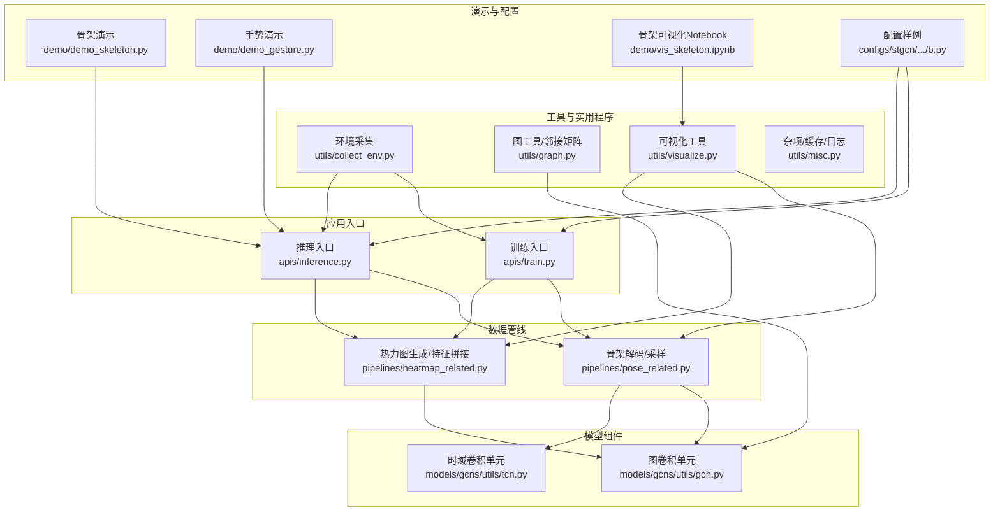
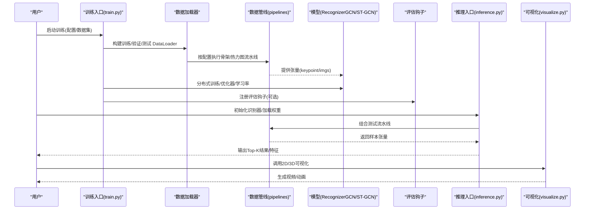
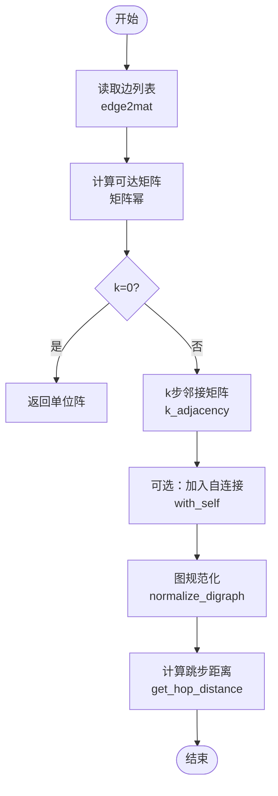
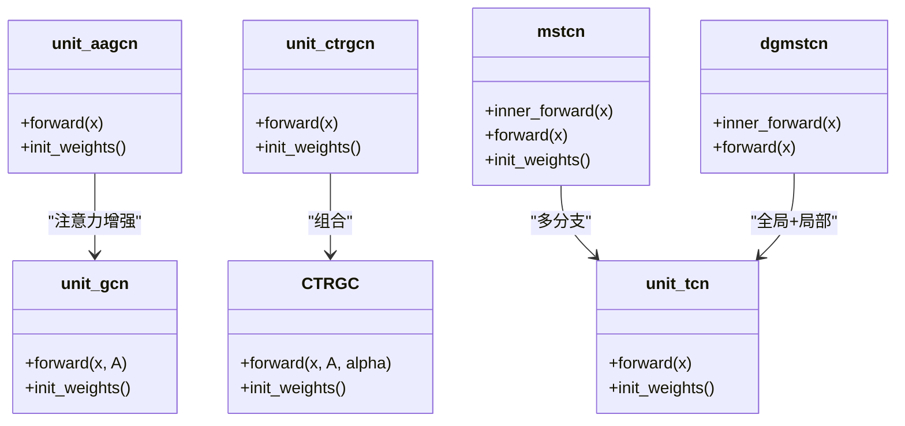
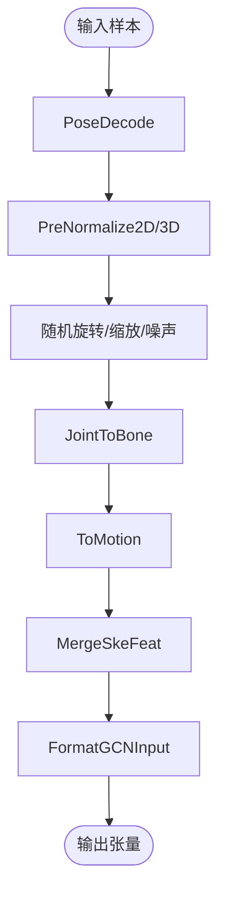
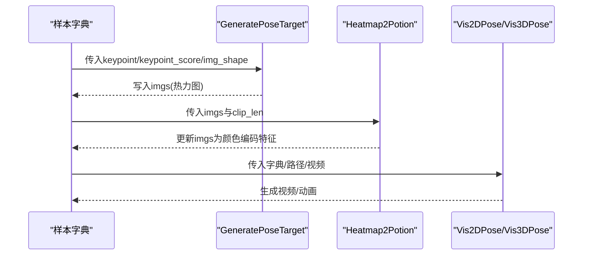
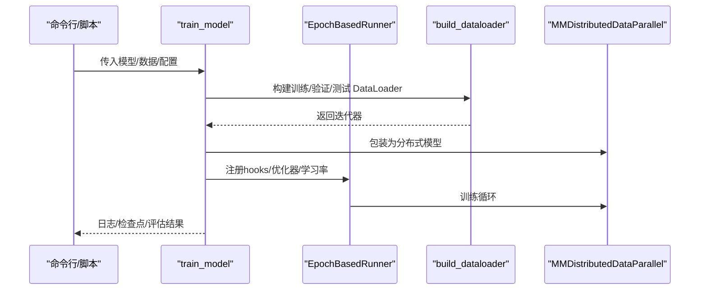
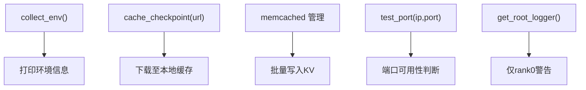
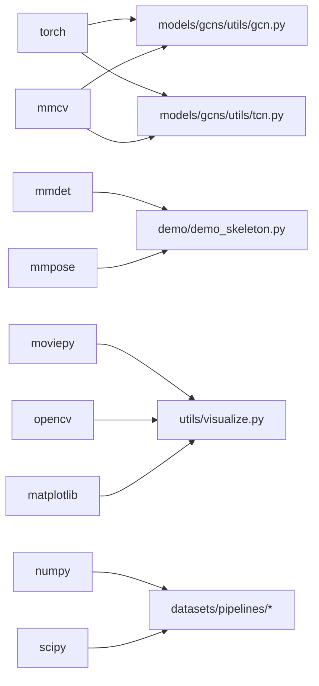

# 工具与实用程序

<cite>
**本文引用的文件**   
- [README.md](file://README.md)
- [pyskl/utils/__init__.py](file://pyskl/utils/__init__.py)
- [pyskl/utils/graph.py](file://pyskl/utils/graph.py)
- [pyskl/utils/visualize.py](file://pyskl/utils/visualize.py)
- [pyskl/utils/collect_env.py](file://pyskl/utils/collect_env.py)
- [pyskl/utils/misc.py](file://pyskl/utils/misc.py)
- [pyskl/models/gcns/utils/gcn.py](file://pyskl/models/gcns/utils/gcn.py)
- [pyskl/models/gcns/utils/tcn.py](file://pyskl/models/gcns/utils/tcn.py)
- [pyskl/datasets/pipelines/pose_related.py](file://pyskl/datasets/pipelines/pose_related.py)
- [pyskl/datasets/pipelines/heatmap_related.py](file://pyskl/datasets/pipelines/heatmap_related.py)
- [pyskl/apis/train.py](file://pyskl/apis/train.py)
- [pyskl/apis/inference.py](file://pyskl/apis/inference.py)
- [demo/demo_skeleton.py](file://demo/demo_skeleton.py)
- [demo/demo_gesture.py](file://demo/demo_gesture.py)
- [demo/vis_skeleton.ipynb](file://demo/vis_skeleton.ipynb)
- [configs/stgcn/stgcn_pyskl_ntu60_xsub_3dkp/b.py](file://configs/stgcn/stgcn_pyskl_ntu60_xsub_3dkp/b.py)
- [requirements.txt](file://requirements.txt)
</cite>

## 目录
1. [简介](#简介)
2. [项目结构](#项目结构)
3. [核心组件](#核心组件)
4. [架构总览](#架构总览)
5. [详细组件分析](#详细组件分析)
6. [依赖分析](#依赖分析)
7. [性能考虑](#性能考虑)
8. [故障排查指南](#故障排查指南)
9. [结论](#结论)
10. [附录](#附录)

## 简介
本文件系统性梳理 PySKL 的“工具与实用程序”模块，覆盖以下方面：
- 图形处理工具：图构建、邻接矩阵计算、图卷积（GCN）与时空卷积（TCN）等核心功能
- 可视化工具：骨架数据可视化（2D/3D）、热力图生成与视频合成、布局标注等
- 环境检测工具：依赖包版本检查、硬件配置验证、日志输出等
- 图像处理工具：骨架数据预处理、格式转换、特征生成、热力图目标生成等
- 实用工具函数：缓存、日志、端口探测、随机种子广播等
- 最佳实践与性能优化：分布式训练、数据管线、可视化与推理流程
- 扩展与集成：如何新增工具、与现有模块协作关系与依赖

## 项目结构
PySKL 采用分层组织方式：
- pyskl/apis：训练与推理入口
- pyskl/datasets/pipelines：骨架数据预处理流水线
- pyskl/models/gcns/utils：图卷积与时间卷积单元
- pyskl/utils：环境采集、图工具、可视化、杂项工具
- demo：演示脚本与可视化示例
- configs：模型配置样例

图表来源
- [pyskl/apis/train.py](file://pyskl/apis/train.py#L50-L144)
- [pyskl/apis/inference.py](file://pyskl/apis/inference.py#L19-L54)
- [pyskl/datasets/pipelines/pose_related.py](file://pyskl/datasets/pipelines/pose_related.py#L12-L467)
- [pyskl/datasets/pipelines/heatmap_related.py](file://pyskl/datasets/pipelines/heatmap_related.py#L9-L274)
- [pyskl/models/gcns/utils/gcn.py](file://pyskl/models/gcns/utils/gcn.py#L10-L441)
- [pyskl/models/gcns/utils/tcn.py](file://pyskl/models/gcns/utils/tcn.py#L8-L202)
- [pyskl/utils/graph.py](file://pyskl/utils/graph.py#L5-L175)
- [pyskl/utils/visualize.py](file://pyskl/utils/visualize.py#L41-L237)
- [pyskl/utils/collect_env.py](file://pyskl/utils/collect_env.py#L8-L12)
- [demo/demo_skeleton.py](file://demo/demo_skeleton.py#L227-L314)
- [demo/demo_gesture.py](file://demo/demo_gesture.py#L83-L174)
- [demo/vis_skeleton.ipynb](file://demo/vis_skeleton.ipynb#L32-L71)
- [configs/stgcn/stgcn_pyskl_ntu60_xsub_3dkp/b.py](file://configs/stgcn/stgcn_pyskl_ntu60_xsub_3dkp/b.py#L1-L61)

章节来源
- [README.md](file://README.md#L1-L116)
- [requirements.txt](file://requirements.txt#L1-L14)

## 核心组件
- 图工具与邻接矩阵
  - 提供 k 步邻接矩阵、边到邻接矩阵映射、图规范化、跳步距离计算、Graph 类与多种模式（stgcn_spatial/spatial/binary_adj/random）
- 图卷积与时空卷积
  - 单元：unit_gcn、unit_aagcn、CTRGC、unit_ctrgcn、unit_sgn、dggcn；时域：unit_tcn、mstcn、dgmstcn
- 数据管线（骨架与热力图）
  - 骨架解码、归一化（2D/3D）、随机旋转/缩放/噪声、关节转骨骼、运动特征、格式化输入、压缩解压、热力图生成、Potion 特征
- 可视化
  - 3D 骨架动画、2D 骨架叠加、布局标注（带框）
- 训练与推理
  - 分布式训练、随机种子广播、加载/缓存检查点、推理管线适配（视频/帧/数组）
- 环境与杂项
  - 环境信息采集、内存缓存（memcached）、端口探测、根日志器、URL 缓存本地化

章节来源
- [pyskl/utils/graph.py](file://pyskl/utils/graph.py#L5-L175)
- [pyskl/models/gcns/utils/gcn.py](file://pyskl/models/gcns/utils/gcn.py#L10-L441)
- [pyskl/models/gcns/utils/tcn.py](file://pyskl/models/gcns/utils/tcn.py#L8-L202)
- [pyskl/datasets/pipelines/pose_related.py](file://pyskl/datasets/pipelines/pose_related.py#L12-L553)
- [pyskl/datasets/pipelines/heatmap_related.py](file://pyskl/datasets/pipelines/heatmap_related.py#L9-L349)
- [pyskl/utils/visualize.py](file://pyskl/utils/visualize.py#L41-L237)
- [pyskl/apis/train.py](file://pyskl/apis/train.py#L17-L48)
- [pyskl/apis/inference.py](file://pyskl/apis/inference.py#L19-L54)
- [pyskl/utils/collect_env.py](file://pyskl/utils/collect_env.py#L8-L12)
- [pyskl/utils/misc.py](file://pyskl/utils/misc.py#L18-L131)

## 架构总览
下图展示从“输入数据/配置”到“模型训练/推理”的整体流程，以及可视化与工具模块的协作。

图表来源
- [pyskl/apis/train.py](file://pyskl/apis/train.py#L50-L144)
- [pyskl/apis/inference.py](file://pyskl/apis/inference.py#L57-L183)
- [pyskl/datasets/pipelines/pose_related.py](file://pyskl/datasets/pipelines/pose_related.py#L12-L467)
- [pyskl/datasets/pipelines/heatmap_related.py](file://pyskl/datasets/pipelines/heatmap_related.py#L9-L274)
- [pyskl/utils/visualize.py](file://pyskl/utils/visualize.py#L41-L237)

## 详细组件分析

### 图构建与邻接矩阵（Graph 与工具函数）
- 功能要点
  - k 步邻接矩阵：支持 with_self/self_factor 控制自连接
  - 边到邻接矩阵：将边列表转换为邻接矩阵
  - 图规范化：按行求和后取逆，实现对称归一化
  - 跳步距离：基于矩阵幂计算可达性与距离
  - Graph 类：支持 openpose/nturgb+d/coco/handmp 布局，提供 stgcn_spatial/spatial/binary_adj/random 等模式
- 复杂度与性能
  - 矩阵幂计算复杂度与最大跳数相关；大规模图建议控制 max_hop 并使用稀疏存储策略
- 使用建议
  - 在 GCN 模型中通过 graph_cfg 传入 layout 与 mode
  - 若需自连接或特定权重，结合 with_self 与 self_factor

图表来源
- [pyskl/utils/graph.py](file://pyskl/utils/graph.py#L5-L55)
- [pyskl/utils/graph.py](file://pyskl/utils/graph.py#L168-L175)

章节来源
- [pyskl/utils/graph.py](file://pyskl/utils/graph.py#L5-L175)

### 图卷积与时空卷积单元
- 单元类型
  - unit_gcn：支持 pre/post 卷积位置、自适应模式（init/offset/importance）、残差连接
  - unit_aagcn：注意力增强的自适应 GCN
  - CTRGC/unit_ctrgcn：相对关系建模的 GCN 单元
  - unit_sgn：基于邻接矩阵乘法的简单 GCN
  - dggcn：动态门控 GCN，支持多分支与非线性激活组合
  - unit_tcn/mstcn/dgmstcn：时域卷积，支持多尺度与时序特征融合
- 复杂度与性能
  - einsum/矩阵乘法为主，注意 batch、通道、时间维与节点维的形状匹配
  - 多分支 TCN 可提升表达能力但增加计算开销
- 使用建议
  - GCN 层前通常配合 FormatGCNInput 将 M/T/V/C 调整为适合模型的顺序
  - 注意不同模型对 num_person 的默认值差异

图表来源
- [pyskl/models/gcns/utils/gcn.py](file://pyskl/models/gcns/utils/gcn.py#L10-L441)
- [pyskl/models/gcns/utils/tcn.py](file://pyskl/models/gcns/utils/tcn.py#L8-L202)

章节来源
- [pyskl/models/gcns/utils/gcn.py](file://pyskl/models/gcns/utils/gcn.py#L10-L441)
- [pyskl/models/gcns/utils/tcn.py](file://pyskl/models/gcns/utils/tcn.py#L8-L202)

### 骨架数据处理与特征工程
- 关键流程
  - PoseDecode：按帧索引解码骨架
  - PreNormalize2D/PreNormalize3D：归一化与坐标修正
  - RandomRot/RandomScale/RandomGaussianNoise：数据增强
  - JointToBone/ToMotion/MergeSkeFeat：生成骨骼向量与运动特征
  - FormatGCNInput：调整为 GCN 输入格式
  - DecompressPose：压缩注释解压
- 性能与稳定性
  - 归一化与旋转/缩放会改变数值范围，需在流水线中保持一致性
  - 运动特征对时间维度敏感，注意 clip_len 与采样策略

图表来源
- [pyskl/datasets/pipelines/pose_related.py](file://pyskl/datasets/pipelines/pose_related.py#L12-L467)

章节来源
- [pyskl/datasets/pipelines/pose_related.py](file://pyskl/datasets/pipelines/pose_related.py#L12-L553)

### 热力图生成与视频合成
- GeneratePoseTarget：基于关节点与置信度生成伪热力图（关键点/肢体二选一），支持翻转增强
- Heatmap2Potion：将热力图映射为颜色编码的时间序列，输出 U/I/N 或全量组合
- 可视化工具
  - Vis2DPose：在图像或视频上叠加 2D 骨架轨迹
  - Vis3DPose：3D 骨架旋转动画并导出视频
  - VisLayout：按类别绘制边界框

图表来源
- [pyskl/datasets/pipelines/heatmap_related.py](file://pyskl/datasets/pipelines/heatmap_related.py#L9-L274)
- [pyskl/utils/visualize.py](file://pyskl/utils/visualize.py#L101-L173)
- [pyskl/utils/visualize.py](file://pyskl/utils/visualize.py#L41-L99)

章节来源
- [pyskl/datasets/pipelines/heatmap_related.py](file://pyskl/datasets/pipelines/heatmap_related.py#L9-L349)
- [pyskl/utils/visualize.py](file://pyskl/utils/visualize.py#L41-L237)

### 训练与推理入口
- 训练入口
  - 分布式训练、随机种子广播、优化器/学习率配置、检查点加载/缓存、评估钩子注册
- 推理入口
  - 支持字典/数组/视频/帧目录输入，自动替换解码器类型，封装 OutputHook 获取中间特征

图表来源
- [pyskl/apis/train.py](file://pyskl/apis/train.py#L50-L144)

章节来源
- [pyskl/apis/train.py](file://pyskl/apis/train.py#L17-L48)
- [pyskl/apis/train.py](file://pyskl/apis/train.py#L50-L144)
- [pyskl/apis/inference.py](file://pyskl/apis/inference.py#L57-L183)

### 环境检测与实用工具
- 环境采集：收集 PyTorch、MMCV、pyskl 版本信息
- 杂项工具：memcached 启停与缓存写入、端口探测、根日志器、URL 缓存本地化、仅主进程警告

图表来源
- [pyskl/utils/collect_env.py](file://pyskl/utils/collect_env.py#L8-L12)
- [pyskl/utils/misc.py](file://pyskl/utils/misc.py#L18-L131)

章节来源
- [pyskl/utils/collect_env.py](file://pyskl/utils/collect_env.py#L8-L18)
- [pyskl/utils/misc.py](file://pyskl/utils/misc.py#L18-L131)

### 演示与使用示例
- 骨架演示：从视频提取帧、人体检测、姿态估计、跟踪与动作识别，最后叠加可视化与保存视频
- 手势演示：使用 MediaPipe 手部检测，实时生成骨架片段并进行手势分类
- 可视化 Notebook：展示 2D/3D 骨架可视化与热力图生成

章节来源
- [demo/demo_skeleton.py](file://demo/demo_skeleton.py#L227-L314)
- [demo/demo_gesture.py](file://demo/demo_gesture.py#L83-L174)
- [demo/vis_skeleton.ipynb](file://demo/vis_skeleton.ipynb#L32-L71)

## 依赖分析
- 外部依赖
  - PyTorch、MMCV、MMDet、MMPose、MoviePy、NumPy、SciPy、OpenCV、Matplotlib、TQDM、Memcache 客户端
- 模块耦合
  - apis 依赖 datasets/pipelines 与 utils；models/gcns/utils 依赖 utils/graph 与 mmcv 的构建器
  - 可视化模块依赖 utils.visualize 与外部绘图/视频库
- 循环依赖
  - 未发现直接循环导入；数据管线与模型单元通过接口清晰分离

图表来源
- [requirements.txt](file://requirements.txt#L1-L14)
- [pyskl/models/gcns/utils/gcn.py](file://pyskl/models/gcns/utils/gcn.py#L1-L7)
- [pyskl/models/gcns/utils/tcn.py](file://pyskl/models/gcns/utils/tcn.py#L1-L6)
- [pyskl/utils/visualize.py](file://pyskl/utils/visualize.py#L1-L11)
- [demo/demo_skeleton.py](file://demo/demo_skeleton.py#L13-L43)

章节来源
- [requirements.txt](file://requirements.txt#L1-L14)

## 性能考虑
- 分布式训练
  - 使用 MMDistributedDataParallel 与 DistSamplerSeedHook，确保各进程随机种子一致
- 数据管线
  - 预归一化与运动特征生成避免重复计算；多尺度 TCN 在长序列上可能显著增加显存
- 可视化
  - 2D/3D 可视化生成视频前先降采样或降低帧率，减少 I/O 与编码压力
- 缓存
  - 对大型数据集使用 memcached 缓存注释，减少磁盘 IO；注意端口占用与内存分配
- 推理
  - 使用 OutputHook 按需获取中间特征，避免不必要的张量拷贝

[本节为通用指导，无需列出具体文件来源]

## 故障排查指南
- 端口占用
  - 使用端口探测函数确认 memcached 端口是否被占用，必要时更换端口或停止服务
- 分布式训练异常
  - 检查随机种子广播是否成功，确保 world_size 与 rank 配置正确
- 可视化失败
  - 确认 MoviePy/FFmpeg 可用；若无视频源，确保 out_shape 参数正确
- 环境信息缺失
  - 使用环境采集函数输出完整依赖版本，便于定位兼容性问题

章节来源
- [pyskl/utils/misc.py](file://pyskl/utils/misc.py#L86-L94)
- [pyskl/apis/train.py](file://pyskl/apis/train.py#L35-L47)
- [pyskl/utils/visualize.py](file://pyskl/utils/visualize.py#L31-L38)
- [pyskl/utils/collect_env.py](file://pyskl/utils/collect_env.py#L8-L12)

## 结论
PySKL 的工具与实用程序围绕“骨架数据 + 图卷积 + 可视化 + 训练/推理”形成闭环：图工具提供拓扑基础，数据管线完成预处理与特征工程，模型单元实现时空建模，可视化贯穿全流程，环境与杂项工具保障运行稳定性。遵循本文的最佳实践与扩展建议，可在保证性能的同时快速集成新算法与新任务。

[本节为总结性内容，无需列出具体文件来源]

## 附录
- 最佳实践清单
  - 训练阶段：统一归一化策略、合理设置 num_person 与 clip_len、启用评估钩子
  - 推理阶段：根据输入类型自动替换解码器、按需获取中间特征
  - 可视化阶段：优先使用 2D/3D 视觉化模板，注意帧率与分辨率平衡
  - 扩展阶段：新增工具遵循现有命名与导入约定，尽量复用 utils.graph 与 pipelines

- 典型配置参考
  - ST-GCN 配置示例展示了从 3D 骨架到 GCN 输入的完整流水线

章节来源
- [configs/stgcn/stgcn_pyskl_ntu60_xsub_3dkp/b.py](file://configs/stgcn/stgcn_pyskl_ntu60_xsub_3dkp/b.py#L1-L61)