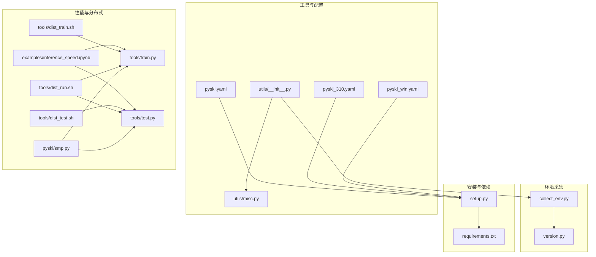
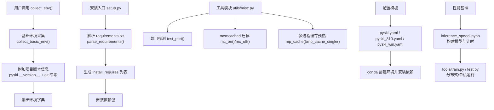
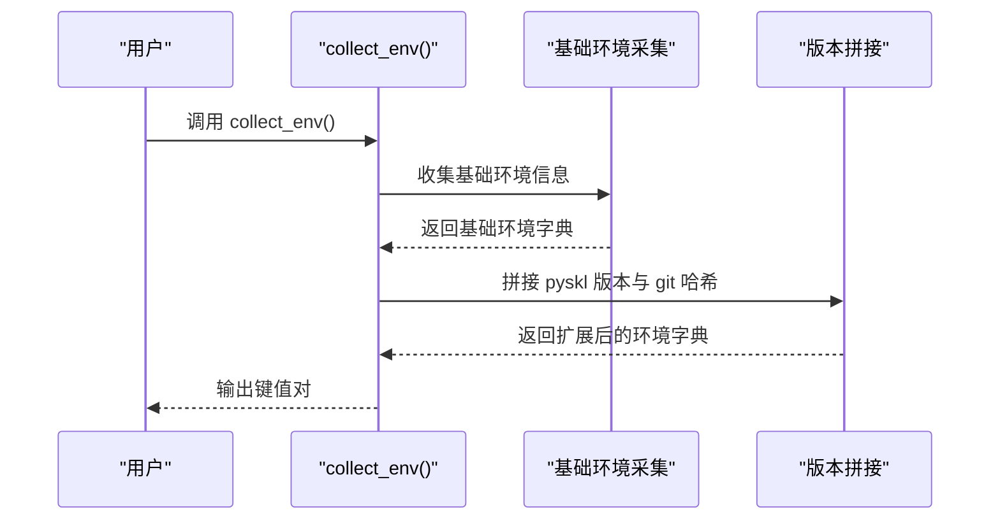
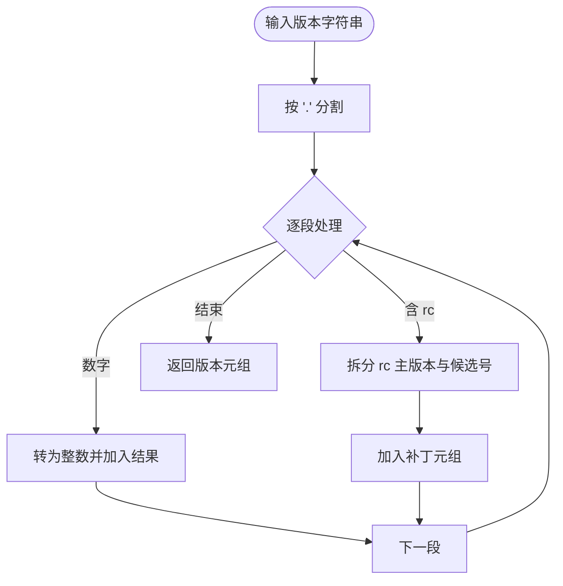
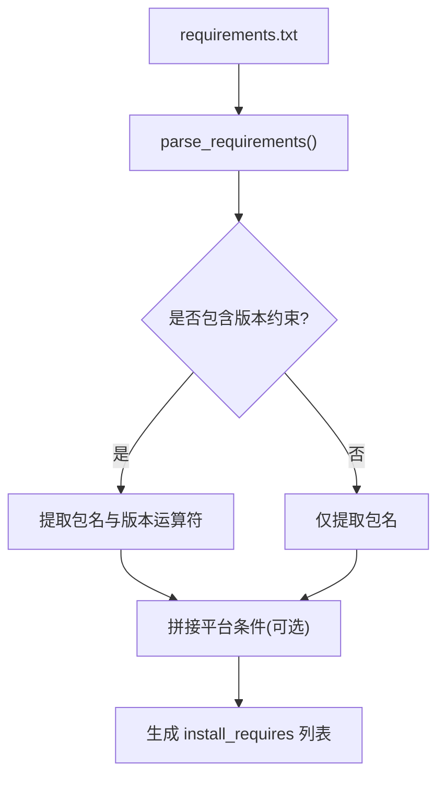
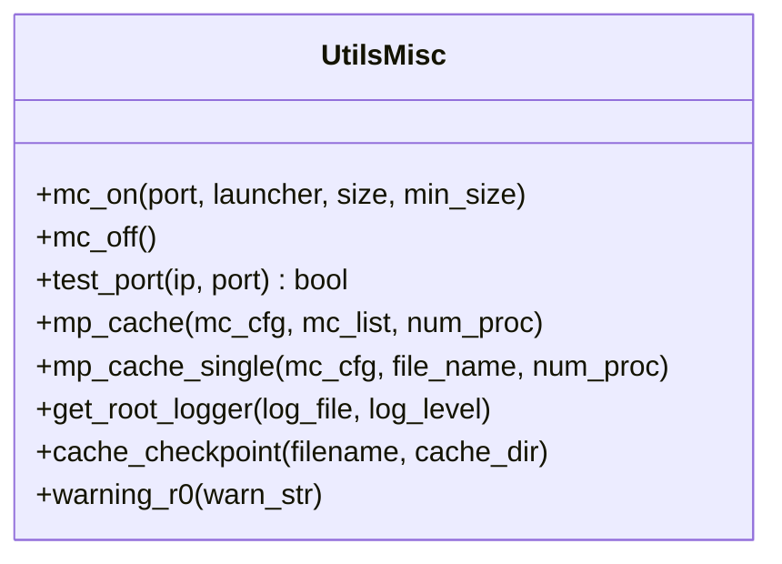
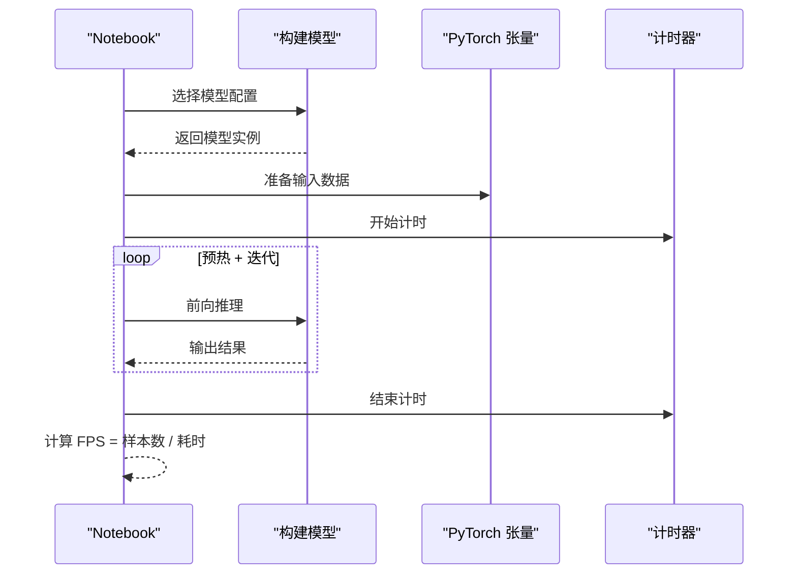
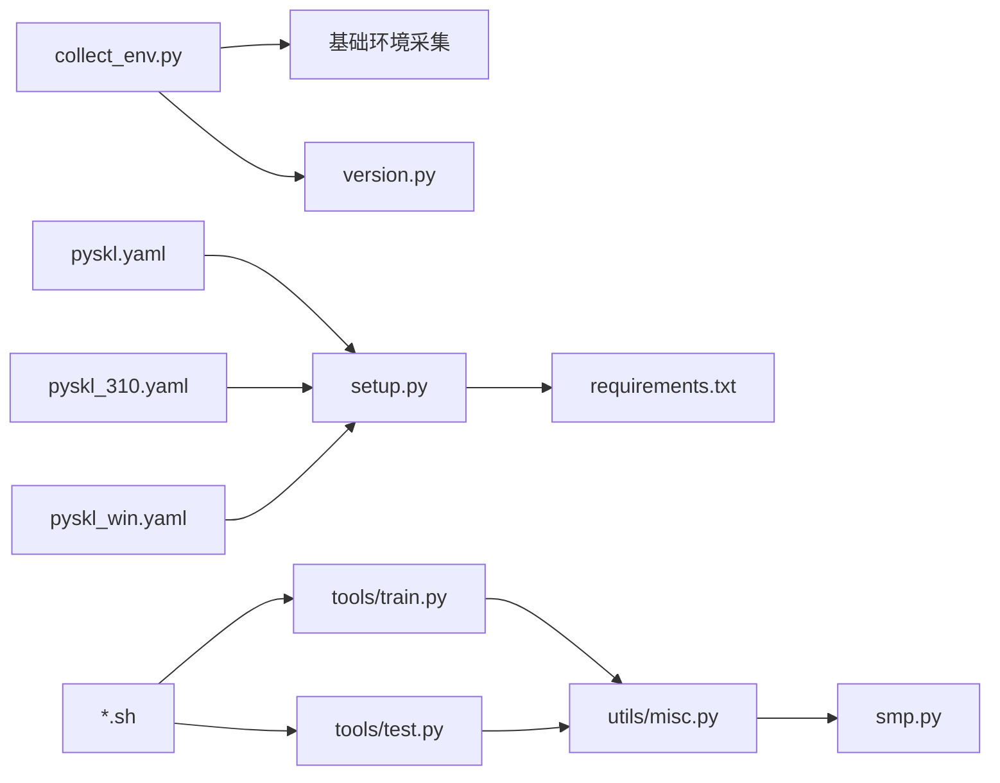

# 环境检测工具

<cite>
**本文档引用的文件**
- [pyskl/utils/collect_env.py](file://pyskl/utils/collect_env.py)
- [pyskl/version.py](file://pyskl/version.py)
- [requirements.txt](file://requirements.txt)
- [setup.py](file://setup.py)
- [pyskl/utils/misc.py](file://pyskl/utils/misc.py)
- [pyskl/utils/__init__.py](file://pyskl/utils/__init__.py)
- [pyskl.yaml](file://pyskl.yaml)
- [pyskl_310.yaml](file://pyskl_310.yaml)
- [pyskl_win.yaml](file://pyskl_win.yaml)
- [examples/inference_speed.ipynb](file://examples/inference_speed.ipynb)
- [tools/train.py](file://tools/train.py)
- [tools/test.py](file://tools/test.py)
- [tools/dist_train.sh](file://tools/dist_train.sh)
- [tools/dist_test.sh](file://tools/dist_test.sh)
- [tools/dist_run.sh](file://tools/dist_run.sh)
- [pyskl/smp.py](file://pyskl/smp.py)
- [README.md](file://README.md)
</cite>

## 目录
1. [简介](#简介)
2. [项目结构](#项目结构)
3. [核心组件](#核心组件)
4. [架构总览](#架构总览)
5. [详细组件分析](#详细组件分析)
6. [依赖关系分析](#依赖关系分析)
7. [性能考虑](#性能考虑)
8. [故障排查指南](#故障排查指南)
9. [结论](#结论)
10. [附录](#附录)

## 简介
本文件面向PySKL的环境检测与配置管理，系统化梳理以下能力：
- 环境信息采集：Python版本、PyTorch版本、CUDA可用性、GPU设备信息等
- 依赖包版本检查：核心库版本兼容性验证、第三方库依赖关系检查、版本冲突检测
- 硬件配置验证：CPU信息、内存容量、存储空间等
- 性能基准测试：推理速度评估、内存使用监控、I/O性能测试
- 最佳实践：虚拟环境搭建、依赖管理、版本兼容性处理
- 常见问题诊断与跨平台部署注意事项

## 项目结构
围绕环境检测与配置，本项目的关键位置如下：
- 环境信息采集：pyskl/utils/collect_env.py
- 版本定义与解析：pyskl/version.py
- 安装与依赖声明：requirements.txt、setup.py
- 工具与辅助：pyskl/utils/misc.py、pyskl/utils/__init__.py
- 虚拟环境配置：pyskl.yaml（Python 3.7）、pyskl_310.yaml（Python 3.10）、pyskl_win.yaml（Windows）
- 性能基准：examples/inference_speed.ipynb
- 分布式训练/测试脚本：tools/train.py、tools/test.py、tools/dist_train.sh、tools/dist_test.sh、tools/dist_run.sh
- 缓存与端口检测：pyskl/smp.py 中的 memcached 启停与端口探测

**图表来源**
- [pyskl/utils/collect_env.py](file://pyskl/utils/collect_env.py#L1-L18)
- [pyskl/version.py](file://pyskl/version.py#L1-L19)
- [requirements.txt](file://requirements.txt#L1-L14)
- [setup.py](file://setup.py#L1-L129)
- [pyskl/utils/misc.py](file://pyskl/utils/misc.py#L1-L131)
- [pyskl/utils/__init__.py](file://pyskl/utils/__init__.py#L1-L10)
- [pyskl.yaml](file://pyskl.yaml#L1-L132)
- [pyskl_310.yaml](file://pyskl_310.yaml#L1-L131)
- [pyskl_win.yaml](file://pyskl_win.yaml#L1-L42)
- [examples/inference_speed.ipynb](file://examples/inference_speed.ipynb#L1-L206)
- [tools/train.py](file://tools/train.py#L142-L164)
- [tools/test.py](file://tools/test.py#L144-L184)
- [tools/dist_train.sh](file://tools/dist_train.sh#L1-L12)
- [tools/dist_test.sh](file://tools/dist_test.sh#L1-L13)
- [tools/dist_run.sh](file://tools/dist_run.sh#L1-L11)
- [pyskl/smp.py](file://pyskl/smp.py#L168-L182)

**章节来源**
- [pyskl/utils/collect_env.py](file://pyskl/utils/collect_env.py#L1-L18)
- [pyskl/version.py](file://pyskl/version.py#L1-L19)
- [requirements.txt](file://requirements.txt#L1-L14)
- [setup.py](file://setup.py#L1-L129)
- [pyskl/utils/misc.py](file://pyskl/utils/misc.py#L1-L131)
- [pyskl/utils/__init__.py](file://pyskl/utils/__init__.py#L1-L10)
- [pyskl.yaml](file://pyskl.yaml#L1-L132)
- [pyskl_310.yaml](file://pyskl_310.yaml#L1-L131)
- [pyskl_win.yaml](file://pyskl_win.yaml#L1-L42)
- [examples/inference_speed.ipynb](file://examples/inference_speed.ipynb#L1-L206)
- [tools/train.py](file://tools/train.py#L142-L164)
- [tools/test.py](file://tools/test.py#L144-L184)
- [tools/dist_train.sh](file://tools/dist_train.sh#L1-L12)
- [tools/dist_test.sh](file://tools/dist_test.sh#L1-L13)
- [tools/dist_run.sh](file://tools/dist_run.sh#L1-L11)
- [pyskl/smp.py](file://pyskl/smp.py#L168-L182)

## 核心组件
- 环境信息采集器：基于基础环境采集函数扩展，附加项目版本信息，便于问题定位与复现。
- 版本解析器：提供版本字符串解析为可比较元组的能力，支持主版本、补丁版本及候选版本标识。
- 依赖声明与解析：requirements.txt 明确核心依赖与版本范围；setup.py 提供解析逻辑，用于安装时生成依赖列表。
- 工具集：包含 memcached 启停、多进程缓存预热、端口探测、日志初始化、缓存本地化等实用工具。
- 配置模板：提供三套环境配置（Python 3.7、3.10、Windows），覆盖 CUDA、PyTorch、OpenCV、MM* 生态等。
- 性能基准：通过示例 Notebook 展示推理速度评估流程，便于在不同设备上进行对比。

**章节来源**
- [pyskl/utils/collect_env.py](file://pyskl/utils/collect_env.py#L8-L12)
- [pyskl/version.py](file://pyskl/version.py#L6-L18)
- [requirements.txt](file://requirements.txt#L1-L14)
- [setup.py](file://setup.py#L25-L98)
- [pyskl/utils/misc.py](file://pyskl/utils/misc.py#L18-L94)
- [pyskl/utils/__init__.py](file://pyskl/utils/__init__.py#L2-L9)
- [pyskl.yaml](file://pyskl.yaml#L57-L67)
- [pyskl_310.yaml](file://pyskl_310.yaml#L57-L67)
- [pyskl_win.yaml](file://pyskl_win.yaml#L7-L11)
- [examples/inference_speed.ipynb](file://examples/inference_speed.ipynb#L96-L111)

## 架构总览
下图展示环境检测与配置在系统中的交互关系：

**图表来源**
- [pyskl/utils/collect_env.py](file://pyskl/utils/collect_env.py#L8-L12)
- [setup.py](file://setup.py#L25-L98)
- [pyskl/utils/misc.py](file://pyskl/utils/misc.py#L18-L94)
- [pyskl.yaml](file://pyskl.yaml#L1-L132)
- [pyskl_310.yaml](file://pyskl_310.yaml#L1-L131)
- [pyskl_win.yaml](file://pyskl_win.yaml#L1-L42)
- [examples/inference_speed.ipynb](file://examples/inference_speed.ipynb#L96-L111)
- [tools/train.py](file://tools/train.py#L142-L164)
- [tools/test.py](file://tools/test.py#L144-L184)

## 详细组件分析

### 组件A：环境信息采集器
- 功能概述
  - 调用基础环境采集函数，收集操作系统、Python解释器、编译器、CUDA、cuDNN、MMCV、PyTorch、MM* 等信息
  - 追加项目版本与最近提交哈希，便于问题复现
- 关键点
  - 返回字典结构，便于打印或写入日志
  - 与工具模块导出保持一致，确保统一入口
- 使用场景
  - 安装后自检、CI 日志、问题反馈

**图表来源**
- [pyskl/utils/collect_env.py](file://pyskl/utils/collect_env.py#L8-L12)
- [pyskl/utils/__init__.py](file://pyskl/utils/__init__.py#L2-L2)

**章节来源**
- [pyskl/utils/collect_env.py](file://pyskl/utils/collect_env.py#L8-L12)
- [pyskl/utils/__init__.py](file://pyskl/utils/__init__.py#L2-L2)

### 组件B：版本解析器
- 功能概述
  - 将版本字符串解析为整数元组，支持“主.次.补丁”格式与“rc”候选版本标识
- 复杂度
  - 时间复杂度 O(n)，n 为版本字符串长度
  - 空间复杂度 O(1)，仅返回固定长度元组
- 应用
  - 与依赖声明配合，进行版本兼容性判断（需结合安装时解析逻辑）

**图表来源**
- [pyskl/version.py](file://pyskl/version.py#L6-L18)

**章节来源**
- [pyskl/version.py](file://pyskl/version.py#L6-L18)

### 组件C：依赖声明与解析
- 依赖声明
  - requirements.txt 明确核心依赖与版本范围，如 PyTorch、MMCV、MMDet、MMPose、NumPy、OpenCV、SciPy、Matplotlib、Decord、TorchVision/Torchaudio 等
- 解析逻辑
  - setup.py 的 parse_requirements 支持行内注释、可选文件、版本运算符、平台限定等
  - 生成 install_requires 列表，供安装时使用
- 兼容性
  - 不同 Python/CUDA/PyTorch 组合对应不同配置模板，避免版本冲突

**图表来源**
- [requirements.txt](file://requirements.txt#L1-L14)
- [setup.py](file://setup.py#L25-L98)

**章节来源**
- [requirements.txt](file://requirements.txt#L1-L14)
- [setup.py](file://setup.py#L25-L98)

### 组件D：工具与辅助（端口探测、缓存、日志）
- 端口探测 test_port
  - 通过 TCP 连接测试端口连通性，用于 memcached 状态检查
- memcached 启停 mc_on / mc_off
  - 启动/停止本地缓存服务，支持自定义端口与内存大小
- 多进程缓存预热 mp_cache / mp_cache_single
  - 并行将数据写入缓存，提升 I/O 密集场景吞吐
- 日志与警告 warning_r0
  - 初始化根日志器，仅在 rank=0 输出警告，避免重复

**图表来源**
- [pyskl/utils/misc.py](file://pyskl/utils/misc.py#L18-L131)

**章节来源**
- [pyskl/utils/misc.py](file://pyskl/utils/misc.py#L18-L131)

### 组件E：配置模板（conda）
- 三套模板分别针对：
  - Linux/Python 3.7：CUDA 11.3、PyTorch 1.11、MMCV 1.5.0 等
  - Linux/Python 3.10：CUDA 11.3、PyTorch 1.12.1、MMCV 1.7.0 等
  - Windows/Python 3.10：CUDA 11.3、PyTorch 1.12.1、MMCV 1.7.0 等
- 作用
  - 固定生态版本组合，降低安装冲突概率
  - 与 requirements.txt 协同，确保一致性

**章节来源**
- [pyskl.yaml](file://pyskl.yaml#L1-L132)
- [pyskl_310.yaml](file://pyskl_310.yaml#L1-L131)
- [pyskl_win.yaml](file://pyskl_win.yaml#L1-L42)

### 组件F：性能基准测试
- 流程
  - 在 Notebook 中构建不同模型配置，准备输入张量
  - 执行预热与多次迭代，统计总耗时并换算为每秒样本数（FPS）
- 分布式集成
  - 训练/测试脚本支持分布式启动，可在多 GPU 环境下评估性能
  - 启动脚本设置随机端口、MKL 环境变量，保证稳定性

**图表来源**
- [examples/inference_speed.ipynb](file://examples/inference_speed.ipynb#L96-L111)
- [tools/dist_train.sh](file://tools/dist_train.sh#L1-L12)
- [tools/dist_test.sh](file://tools/dist_test.sh#L1-L13)
- [tools/dist_run.sh](file://tools/dist_run.sh#L1-L11)

**章节来源**
- [examples/inference_speed.ipynb](file://examples/inference_speed.ipynb#L96-L111)
- [tools/train.py](file://tools/train.py#L142-L164)
- [tools/test.py](file://tools/test.py#L144-L184)
- [tools/dist_train.sh](file://tools/dist_train.sh#L1-L12)
- [tools/dist_test.sh](file://tools/dist_test.sh#L1-L13)
- [tools/dist_run.sh](file://tools/dist_run.sh#L1-L11)

## 依赖关系分析
- 组件耦合
  - collect_env 依赖基础环境采集与项目版本信息
  - setup 依赖 requirements 解析，生成安装依赖
  - 工具模块被训练/测试脚本与 smp 模块复用
- 外部依赖
  - PyTorch、MMCV、MMDet、MMPose、NumPy、OpenCV、SciPy、Matplotlib、Decord、TorchVision/Torchaudio
- 版本约束
  - requirements.txt 与各配置模板共同约束版本范围，避免冲突

**图表来源**
- [pyskl/utils/collect_env.py](file://pyskl/utils/collect_env.py#L8-L12)
- [pyskl/version.py](file://pyskl/version.py#L3-L3)
- [setup.py](file://setup.py#L25-L98)
- [requirements.txt](file://requirements.txt#L1-L14)
- [pyskl/utils/misc.py](file://pyskl/utils/misc.py#L18-L94)
- [pyskl/smp.py](file://pyskl/smp.py#L168-L182)
- [tools/train.py](file://tools/train.py#L142-L164)
- [tools/test.py](file://tools/test.py#L144-L184)
- [tools/dist_train.sh](file://tools/dist_train.sh#L1-L12)
- [tools/dist_test.sh](file://tools/dist_test.sh#L1-L13)
- [pyskl.yaml](file://pyskl.yaml#L1-L132)
- [pyskl_310.yaml](file://pyskl_310.yaml#L1-L131)
- [pyskl_win.yaml](file://pyskl_win.yaml#L1-L42)

**章节来源**
- [setup.py](file://setup.py#L25-L98)
- [requirements.txt](file://requirements.txt#L1-L14)
- [pyskl/utils/misc.py](file://pyskl/utils/misc.py#L18-L94)
- [pyskl/smp.py](file://pyskl/smp.py#L168-L182)
- [tools/train.py](file://tools/train.py#L142-L164)
- [tools/test.py](file://tools/test.py#L144-L184)
- [tools/dist_train.sh](file://tools/dist_train.sh#L1-L12)
- [tools/dist_test.sh](file://tools/dist_test.sh#L1-L13)
- [pyskl.yaml](file://pyskl.yaml#L1-L132)
- [pyskl_310.yaml](file://pyskl_310.yaml#L1-L131)
- [pyskl_win.yaml](file://pyskl_win.yaml#L1-L42)

## 性能考虑
- 推理速度评估
  - 使用 Notebook 中的循环与计时逻辑，结合预热消除冷启动影响
  - 可在 CPU/GPU 上对比不同模型的吞吐表现
- 内存使用监控
  - 建议在 Notebook 或外部工具中结合系统监控命令，观察峰值内存占用
- I/O 性能测试
  - 利用工具模块的多进程缓存预热，减少数据加载瓶颈
- 分布式运行
  - 启动脚本设置随机端口与 MKL 环境变量，有助于稳定多进程性能

**章节来源**
- [examples/inference_speed.ipynb](file://examples/inference_speed.ipynb#L96-L111)
- [tools/dist_run.sh](file://tools/dist_run.sh#L1-L11)
- [pyskl/utils/misc.py](file://pyskl/utils/misc.py#L65-L79)

## 故障排查指南
- 端口占用导致缓存服务无法启动
  - 现象：启动 memcached 失败或端口探测失败
  - 处理：修改端口或释放占用端口；确认 test_port 返回正确状态
- 分布式启动异常
  - 现象：端口冲突或进程未正确拉起
  - 处理：使用随机端口脚本；检查 PYTHONPATH 与环境变量
- 版本不兼容
  - 现象：安装时报错或运行时报模块导入失败
  - 处理：优先使用提供的配置模板；核对 requirements.txt 与模板中的版本映射
- Windows 环境差异
  - 注意 Windows 下 CUDA/PyTorch 版本与 Linux 不同，需使用对应配置模板

**章节来源**
- [pyskl/utils/misc.py](file://pyskl/utils/misc.py#L86-L94)
- [tools/dist_run.sh](file://tools/dist_run.sh#L3-L10)
- [pyskl_win.yaml](file://pyskl_win.yaml#L1-L42)
- [pyskl.yaml](file://pyskl.yaml#L1-L132)
- [pyskl_310.yaml](file://pyskl_310.yaml#L1-L131)

## 结论
本文件系统化梳理了 PySKL 的环境检测与配置管理能力，涵盖环境信息采集、依赖版本检查、硬件配置验证、性能基准测试与最佳实践。通过统一的工具接口、严格的版本约束与多平台配置模板，能够显著降低环境问题的发生率，并为性能优化与问题诊断提供支撑。

## 附录
- 快速开始
  - 使用 conda 创建指定 Python/CUDA/PyTorch 组合的环境
  - 安装项目为可编辑模式
  - 运行环境采集脚本查看当前环境信息
- 参考命令
  - Linux/Python 3.7：conda env create -f pyskl.yaml && conda activate pyskl && pip install -e .
  - Linux/Python 3.10：conda env create -f pyskl_310.yaml && conda activate pyskl && pip install -e .
  - Windows：conda env create -f pyskl_win.yaml && conda activate pyskl && pip install -e .

**章节来源**
- [README.md](file://README.md#L49-L66)
- [pyskl/utils/collect_env.py](file://pyskl/utils/collect_env.py#L15-L17)