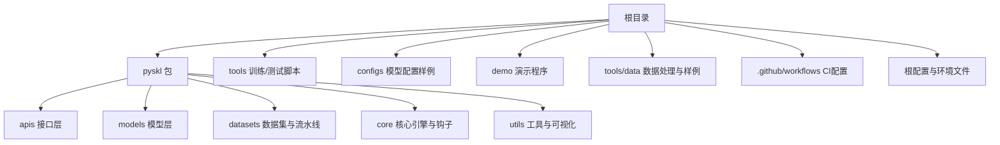
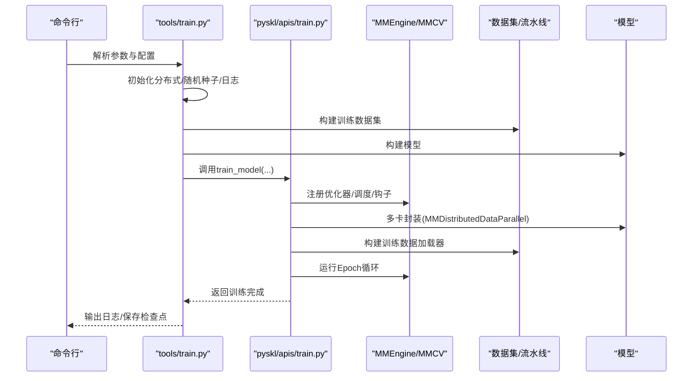
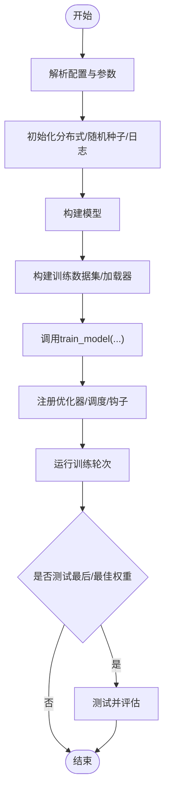
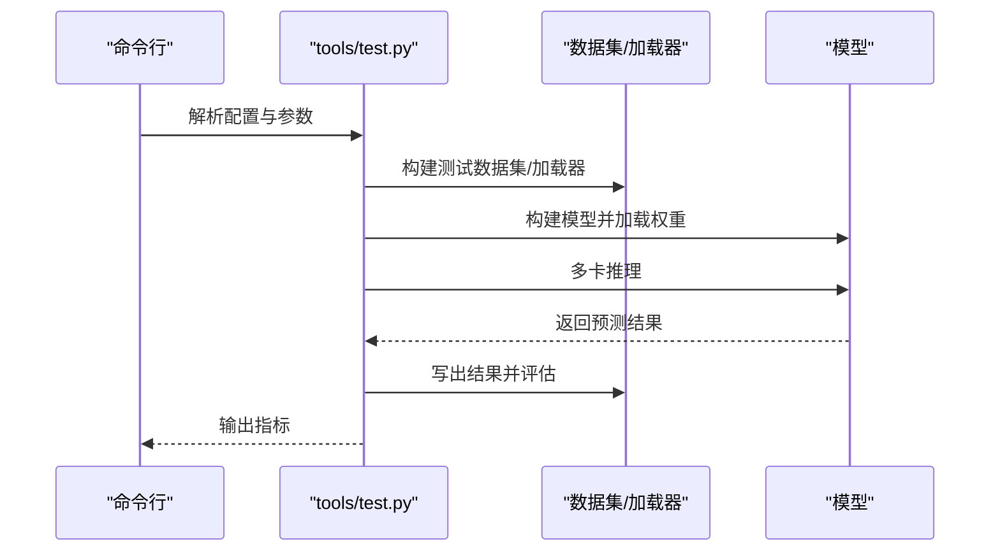
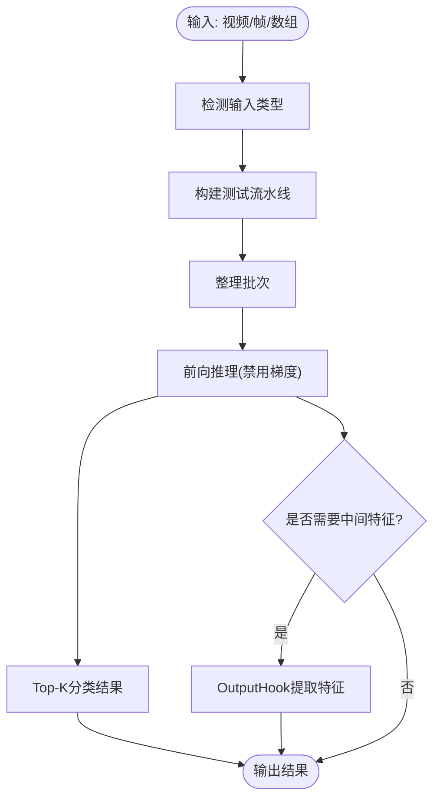
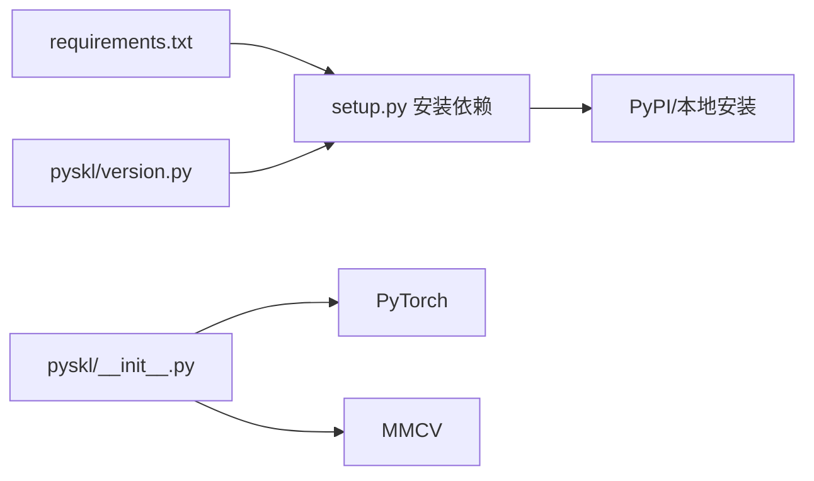

# 开发者指南

<cite>
**本文引用的文件**   
- [README.md](file://README.md)
- [setup.py](file://setup.py)
- [requirements.txt](file://requirements.txt)
- [.github/workflows/lint.yml](file://.github/workflows/lint.yml)
- [.pre-commit-config.yaml](file://.pre-commit-config.yaml)
- [pyskl/version.py](file://pyskl/version.py)
- [pyskl/__init__.py](file://pyskl/__init__.py)
- [tools/train.py](file://tools/train.py)
- [tools/test.py](file://tools/test.py)
- [pyskl/apis/train.py](file://pyskl/apis/train.py)
- [pyskl/apis/inference.py](file://pyskl/apis/inference.py)
- [configs/stgcn/README.md](file://configs/stgcn/README.md)
- [demo/demo.md](file://demo/demo.md)
- [tools/data/README.md](file://tools/data/README.md)
- [pyskl.yaml](file://pyskl.yaml)
</cite>

## 目录
1. [简介](#简介)
2. [项目结构](#项目结构)
3. [核心组件](#核心组件)
4. [架构总览](#架构总览)
5. [详细组件分析](#详细组件分析)
6. [依赖关系分析](#依赖关系分析)
7. [性能考量](#性能考量)
8. [故障排查指南](#故障排查指南)
9. [结论](#结论)
10. [附录](#附录)

## 简介
本指南面向PySKL的贡献者与使用者，系统化阐述代码贡献流程、测试策略、代码规范与风格、版本发布流程、CI/CD配置、开发环境搭建、项目架构扩展点以及社区参与规范。内容基于仓库现有实现与配置文件进行归纳总结，帮助新老贡献者快速上手并高质量协作。

## 项目结构
仓库采用“模块化+配置驱动”的组织方式：核心算法与模型位于pyskl包内，训练/测试入口脚本位于tools目录，配置样例位于configs目录，数据预处理与样例在tools/data与examples中，演示程序在demo目录，CI通过GitHub Actions与pre-commit钩子保障代码质量。

图表来源
- [README.md](file://README.md#L1-L116)
- [tools/train.py](file://tools/train.py#L1-L165)
- [tools/test.py](file://tools/test.py#L1-L185)
- [configs/stgcn/README.md](file://configs/stgcn/README.md#L1-L67)
- [.github/workflows/lint.yml](file://.github/workflows/lint.yml#L1-L24)

章节来源
- [README.md](file://README.md#L1-L116)

## 核心组件
- 训练入口与分布式执行：tools/train.py负责解析配置、初始化分布式环境、构建模型与数据集、调用训练接口并可选地在训练后评估与测试。
- 测试入口与评估：tools/test.py负责加载模型与权重、构建测试数据加载器、多卡推理、结果落盘与指标评估。
- 训练API封装：pyskl/apis/train.py提供统一的训练入口，注册优化器、学习率调度、分布式采样种子、验证钩子等，并在训练结束后按需测试最后/最佳权重。
- 推理API：pyskl/apis/inference.py提供识别器初始化与推理流程，兼容视频路径、原始帧目录、数组等多种输入形式。
- 版本与环境：pyskl/version.py定义版本号与解析逻辑；pyskl/__init__.py校验mmcv版本范围；setup.py读取版本并打包安装；requirements.txt声明运行依赖；pyskl.yaml提供Conda环境定义。

章节来源
- [tools/train.py](file://tools/train.py#L60-L165)
- [tools/test.py](file://tools/test.py#L110-L185)
- [pyskl/apis/train.py](file://pyskl/apis/train.py#L50-L213)
- [pyskl/apis/inference.py](file://pyskl/apis/inference.py#L19-L184)
- [pyskl/version.py](file://pyskl/version.py#L1-L19)
- [pyskl/__init__.py](file://pyskl/__init__.py#L1-L17)
- [setup.py](file://setup.py#L1-L129)
- [requirements.txt](file://requirements.txt#L1-L14)
- [pyskl.yaml](file://pyskl.yaml#L1-L132)

## 架构总览
下图展示从命令行到模型训练/测试的整体流程，以及关键组件间的交互关系。

图表来源
- [tools/train.py](file://tools/train.py#L60-L165)
- [pyskl/apis/train.py](file://pyskl/apis/train.py#L50-L144)

## 详细组件分析

### 训练流程（tools/train.py → pyskl/apis/train.py）
- 参数解析与分布式初始化：设置工作目录、日志、随机种子、分布式后端与GPU编号。
- 模型与数据：构建模型与训练数据集，支持torch.compile在PyTorch 2.0+启用。
- 训练执行：调用train_model，注册训练钩子、可选验证钩子，支持断点续训或加载预训练权重。
- 结果与测试：训练完成后可选择对最后/最佳权重进行测试并评估。

图表来源
- [tools/train.py](file://tools/train.py#L60-L165)
- [pyskl/apis/train.py](file://pyskl/apis/train.py#L50-L144)

章节来源
- [tools/train.py](file://tools/train.py#L60-L165)
- [pyskl/apis/train.py](file://pyskl/apis/train.py#L50-L213)

### 测试流程（tools/test.py → 推理与评估）
- 参数解析与分布式初始化：设置评估指标、平均片段策略、分布式后端。
- 模型与数据：构建模型、加载权重、构建测试数据加载器。
- 推理与评估：多卡推理，收集结果，写入输出文件并计算指标。

图表来源
- [tools/test.py](file://tools/test.py#L110-L185)

章节来源
- [tools/test.py](file://tools/test.py#L110-L185)

### 推理API（pyskl/apis/inference.py）
- 支持多种输入：视频文件/URL、原始帧目录、NumPy数组。
- 自动适配数据流水线：根据输入类型替换解码阶段，构造测试流水线。
- 前向推理与特征提取：通过OutputHook返回指定层特征，Top-K分类结果。

图表来源
- [pyskl/apis/inference.py](file://pyskl/apis/inference.py#L57-L184)

章节来源
- [pyskl/apis/inference.py](file://pyskl/apis/inference.py#L19-L184)

### 配置与模型样例（configs/stgcn/README.md）
- 提供ST-GCN在NTU RGB+D等数据集上的训练与测试命令示例，涵盖不同模态与实践方式。
- 展示了如何使用dist_train.sh与dist_test.sh进行分布式训练与测试。

章节来源
- [configs/stgcn/README.md](file://configs/stgcn/README.md#L50-L67)

### 数据格式与预处理（tools/data/README.md）
- 统一的pickle标注格式：split与annotations字段，支持2D/3D骨架、多目标人、关键点分数等。
- Kinetics-400特殊存储：kpfiles分片缓存，结合memcache加速读取。
- 提供预处理脚本与下载链接，便于快速开始训练/测试。

章节来源
- [tools/data/README.md](file://tools/data/README.md#L1-L119)

### 演示与使用（demo/demo.md）
- 提供离线GPU演示（Skeleton Action Recognition）与实时CPU演示（Gesture Recognition）。
- 依赖说明与环境准备：推荐使用提供的Conda环境，确保mmcv、mmdet、mmpose等依赖一致。

章节来源
- [demo/demo.md](file://demo/demo.md#L1-L42)

## 依赖关系分析
- 运行时依赖：PyTorch、MMCV、MMDetection、MMPose、NumPy、SciPy、Matplotlib、Decord、TQDM等。
- 版本约束：setup.py读取requirements.txt；pyskl/__init__.py限制mmcv版本范围；pyskl/version.py定义版本号与解析。
- 打包与元信息：setup.py生成long_description、license、install_requires等。

图表来源
- [requirements.txt](file://requirements.txt#L1-L14)
- [setup.py](file://setup.py#L1-L129)
- [pyskl/version.py](file://pyskl/version.py#L1-L19)
- [pyskl/__init__.py](file://pyskl/__init__.py#L1-L17)

章节来源
- [requirements.txt](file://requirements.txt#L1-L14)
- [setup.py](file://setup.py#L1-L129)
- [pyskl/version.py](file://pyskl/version.py#L1-L19)
- [pyskl/__init__.py](file://pyskl/__init__.py#L1-L17)

## 性能考量
- 分布式训练：默认NCCL后端，支持多GPU并行训练，提高吞吐。
- 编译加速：在PyTorch 2.0+可启用torch.compile以获得潜在加速（实验特性）。
- 推理融合：支持卷积BN融合以提升推理速度。
- 数据缓存：Kinetics-400场景下可使用memcache缓存kpfiles，降低I/O开销。
- 可复现性：通过固定随机种子与确定性选项，保证实验可复现。

章节来源
- [tools/train.py](file://tools/train.py#L121-L124)
- [tools/test.py](file://tools/test.py#L98-L99)
- [tools/data/README.md](file://tools/data/README.md#L20-L28)

## 故障排查指南
- 分布式初始化失败：检查dist_params与NCCL后端可用性；确认CUDA可见设备与GPU数量。
- 权重加载异常：确认checkpoint路径存在且与模型结构匹配；必要时使用cache_checkpoint进行缓存。
- 数据格式不匹配：核对pickle标注格式中的keypoint形状与维度，确保与配置一致。
- 环境依赖冲突：优先使用pyskl.yaml创建隔离环境，避免系统Python与项目依赖冲突。
- 日志定位：训练/测试日志会记录环境信息、配置文本与关键元数据，便于问题复现与对比。

章节来源
- [tools/train.py](file://tools/train.py#L138-L160)
- [tools/test.py](file://tools/test.py#L150-L180)
- [tools/data/README.md](file://tools/data/README.md#L5-L28)
- [pyskl.yaml](file://pyskl.yaml#L1-L132)

## 结论
本指南基于仓库现有实现，梳理了贡献流程、测试策略、代码规范、版本发布、CI/CD与开发环境搭建要点，并对核心组件与数据格式进行了深入分析。建议贡献者在提交PR前先阅读相关章节，确保代码风格、测试覆盖与配置一致性，共同维护高质量的开源生态。

## 附录

### 代码贡献流程
- Fork仓库并在本地创建功能分支，遵循“小步快跑、频繁提交”的原则。
- 提交前运行pre-commit钩子与lint任务，确保PEP8、导入顺序与格式化符合要求。
- 提交规范建议：简短标题描述问题/改动，正文说明动机、方案与影响，必要时附带截图/日志。
- Pull Request流程：在PR描述中说明改动范围、测试情况与兼容性影响，等待代码审查与合并。

章节来源
- [README.md](file://README.md#L107-L116)
- [.pre-commit-config.yaml](file://.pre-commit-config.yaml#L1-L35)
- [.github/workflows/lint.yml](file://.github/workflows/lint.yml#L1-L24)

### 测试策略
- 单元测试：建议针对数据流水线、损失函数、评估指标等关键模块编写单元测试，覆盖边界条件与异常路径。
- 集成测试：使用最小配置与少量样本进行端到端训练/测试，验证数据加载、模型前向与评估流程。
- 性能测试：在相同硬件与随机种子条件下，记录训练耗时、显存占用与推理速度，形成基准数据以便回归分析。

章节来源
- [tools/train.py](file://tools/train.py#L121-L124)
- [tools/test.py](file://tools/test.py#L98-L99)
- [examples/inference_speed.ipynb](file://examples/inference_speed.ipynb)

### 代码规范与风格
- 代码风格：使用flake8、isort、yapf，最大行长120字符；统一双引号、换行符与文件结尾。
- 注释与文档字符串：函数/类应有清晰的文档字符串，参数与返回值明确；内部复杂逻辑添加必要注释。
- 导入顺序：遵循isort规则，标准库、第三方、项目内模块分组排序。
- 提交前检查：确保无遗留调试语句、无多余空行、无未使用的导入。

章节来源
- [.pre-commit-config.yaml](file://.pre-commit-config.yaml#L1-L35)
- [.github/workflows/lint.yml](file://.github/workflows/lint.yml#L1-L24)

### 版本发布流程
- 版本号管理：遵循pyskl/version.py中的版本格式与解析逻辑，建议采用语义化版本。
- 变更日志：在README的Change Log中记录重大更新、新增能力与已知问题。
- 发布准备：更新版本号、同步依赖版本、补充或更新配置样例与文档。
- 部署流程：通过setup.py打包并上传至PyPI或内部镜像源，确保requirements.txt与环境文件同步更新。

章节来源
- [pyskl/version.py](file://pyskl/version.py#L1-L19)
- [README.md](file://README.md#L22-L29)
- [setup.py](file://setup.py#L1-L129)
- [requirements.txt](file://requirements.txt#L1-L14)

### CI/CD配置
- GitHub Actions：使用lint.yml在push与pull_request触发，安装pre-commit并执行全量检查。
- 代码质量：结合flake8、isort、yapf与基础钩子（去空白、YAML检查、合并冲突检查等），确保仓库整洁。
- 建议扩展：可在后续增加单元测试与集成测试矩阵，按Python/PyTorch版本分层运行。

章节来源
- [.github/workflows/lint.yml](file://.github/workflows/lint.yml#L1-L24)
- [.pre-commit-config.yaml](file://.pre-commit-config.yaml#L1-L35)

### 开发环境搭建
- Conda环境：使用pyskl.yaml创建隔离环境，激活后执行pip install -e .进行可编辑安装。
- 依赖一致性：确保mmcv、mmdet、mmpose版本与项目要求一致，避免运行时错误。
- IDE与调试：建议使用支持Python/PyTorch的IDE，配合断点调试与性能分析工具（如torch.utils.bottleneck）定位瓶颈。
- 性能分析：利用torch.cuda.amp、torch.utils.bottleneck与PyTorch Profiler进行显存与算子级分析。

章节来源
- [demo/demo.md](file://demo/demo.md#L7-L16)
- [pyskl.yaml](file://pyskl.yaml#L1-L132)
- [pyskl/__init__.py](file://pyskl/__init__.py#L1-L17)

### 项目架构扩展点
- 新算法集成：在pyskl/models下新增模块，遵循builder模式注册；在pyskl/datasets/pipelines中扩展对应数据增强与格式化。
- 新数据集支持：在pyskl/datasets中新增数据集类与数据包装器，完善数据加载器与采样器；在tools/data中提供预处理脚本与样例。
- 第三方库集成：通过requirements.txt与setup.py统一管理依赖；在pyskl/utils中封装通用工具函数，保持低耦合高内聚。

章节来源
- [pyskl/apis/train.py](file://pyskl/apis/train.py#L1-L213)
- [tools/data/README.md](file://tools/data/README.md#L1-L119)

### 社区参与指南
- 问题报告：提供操作系统、Python/PyTorch版本、依赖版本与最小可复现步骤。
- 功能请求：说明使用场景、预期行为与对齐的现有实现，必要时附带参考论文或实现链接。
- 社区讨论：在PR或Issue中保持礼貌与专业，及时响应审查意见并迭代改进。

章节来源
- [README.md](file://README.md#L107-L116)