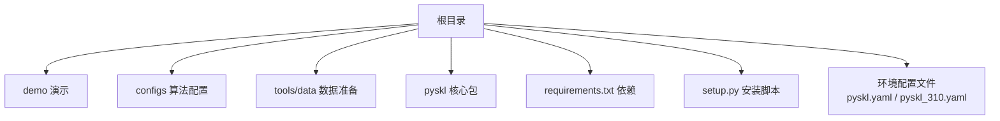
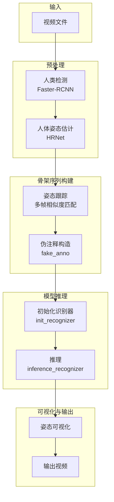
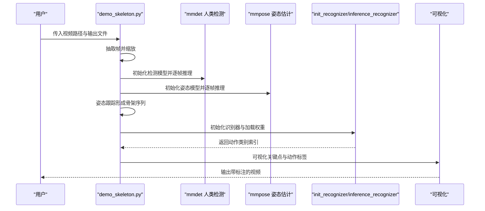
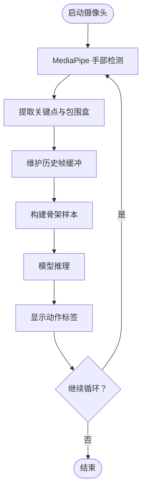
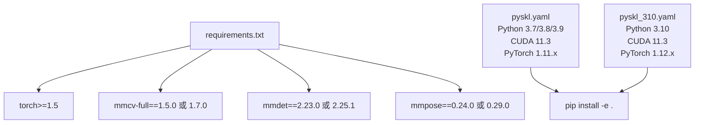

# 快速开始

<cite>
**本文引用的文件**
- [README.md](file://README.md)
- [demo/demo.md](file://demo/demo.md)
- [demo/demo_skeleton.py](file://demo/demo_skeleton.py)
- [demo/demo_gesture.py](file://demo/demo_gesture.py)
- [requirements.txt](file://requirements.txt)
- [setup.py](file://setup.py)
- [pyskl.yaml](file://pyskl.yaml)
- [pyskl_310.yaml](file://pyskl_310.yaml)
- [configs/posec3d/README.md](file://configs/posec3d/README.md)
- [configs/stgcn++/README.md](file://configs/stgcn++/README.md)
- [tools/data/README.md](file://tools/data/README.md)
- [pyskl/version.py](file://pyskl/version.py)
</cite>

## 目录
1. [简介](#简介)
2. [项目结构](#项目结构)
3. [核心组件](#核心组件)
4. [架构总览](#架构总览)
5. [详细组件分析](#详细组件分析)
6. [依赖关系分析](#依赖关系分析)
7. [性能与兼容性建议](#性能与兼容性建议)
8. [故障排查指南](#故障排查指南)
9. [结论](#结论)
10. [附录：安装步骤与示例](#附录安装步骤与示例)

## 简介
本指南面向首次接触 PySKL 的用户，提供从环境准备、安装到首次运行的完整流程。PySKL 是一个基于 PyTorch 的骨架动作识别工具箱，支持多种算法与数据集，并提供了离线骨架动作识别演示与实时手部手势识别演示。文档覆盖：
- 环境要求（Python 版本、PyTorch 版本、CUDA 兼容性）
- 多种安装方式（Conda 环境、pip 安装、源码安装）
- 从克隆仓库到验证安装成功的步骤
- 第一个示例：使用预训练模型进行骨架动作识别推理
- 常见安装问题排查（conda 版本、依赖冲突、GPU 支持检查）
- 不同 Python 版本（3.6–3.9 与 3.10）的安装差异说明

## 项目结构
PySKL 的核心目录与文件组织如下：
- 根目录包含安装说明、配置文件、训练/测试脚本入口与数据准备说明
- demo 提供两个演示脚本：骨架动作识别（GPU 离线）与手势识别（CPU 实时）
- configs 提供各算法的模型配置与权重信息
- tools/data 提供数据格式说明与预处理脚本
- pyskl 包含核心模块（apis、datasets、models、utils 等）

图表来源
- [README.md](file://README.md#L49-L91)
- [demo/demo.md](file://demo/demo.md#L1-L42)
- [requirements.txt](file://requirements.txt#L1-L14)
- [setup.py](file://setup.py#L101-L129)
- [pyskl.yaml](file://pyskl.yaml#L1-L132)
- [pyskl_310.yaml](file://pyskl_310.yaml#L1-L131)

章节来源
- [README.md](file://README.md#L49-L91)
- [demo/demo.md](file://demo/demo.md#L1-L42)

## 核心组件
- 安装与环境
  - 使用 Conda 环境文件一键创建开发环境（推荐）
  - 使用 pip 安装项目为可编辑模式
  - 提供 Python 3.7/3.8/3.9 与 3.10 的两套环境配置
- 演示与推理
  - 骨架动作识别（GPU 离线）：基于检测与姿态估计，生成骨架序列并推理
  - 手势识别（CPU 实时）：基于 MediaPipe 手部关键点，实时推理单手手势
- 训练与测试
  - 提供分布式训练与测试脚本入口
  - 各算法在 configs 中提供模型配置与权重链接

章节来源
- [README.md](file://README.md#L49-L91)
- [demo/demo.md](file://demo/demo.md#L17-L42)
- [demo/demo_skeleton.py](file://demo/demo_skeleton.py#L1-L314)
- [demo/demo_gesture.py](file://demo/demo_gesture.py#L1-L174)

## 架构总览
下图展示了从输入视频到骨架动作识别输出的整体流程，以及与外部依赖的关系。

图表来源
- [demo/demo_skeleton.py](file://demo/demo_skeleton.py#L107-L314)

章节来源
- [demo/demo_skeleton.py](file://demo/demo_skeleton.py#L1-L314)

## 详细组件分析

### 组件一：骨架动作识别演示（GPU 离线）
该演示以视频为输入，通过检测与姿态估计得到每帧的人体关键点，再进行姿态跟踪形成骨架序列，最后调用预训练模型进行动作分类并输出带标注的视频。

图表来源
- [demo/demo_skeleton.py](file://demo/demo_skeleton.py#L107-L314)

章节来源
- [demo/demo_skeleton.py](file://demo/demo_skeleton.py#L1-L314)
- [demo/demo.md](file://demo/demo.md#L17-L29)

### 组件二：手势识别演示（CPU 实时）
该演示使用摄像头输入，通过 MediaPipe 获取手部关键点，构造骨架序列后调用轻量级模型进行实时手势识别。

图表来源
- [demo/demo_gesture.py](file://demo/demo_gesture.py#L83-L174)

章节来源
- [demo/demo_gesture.py](file://demo/demo_gesture.py#L1-L174)
- [demo/demo.md](file://demo/demo.md#L32-L42)

### 组件三：训练与测试脚本入口
- 训练入口：tools/dist_train.sh
- 测试入口：tools/dist_test.sh
- 各算法在 configs 下提供具体配置文件与权重链接

章节来源
- [README.md](file://README.md#L82-L91)
- [configs/posec3d/README.md](file://configs/posec3d/README.md#L103-L120)
- [configs/stgcn++/README.md](file://configs/stgcn++/README.md#L40-L57)

## 依赖关系分析
- 安装依赖
  - 核心依赖：torch、mmcv-full、mmdet、mmpose、decord、opencv、scipy、matplotlib、moviepy、tqdm 等
  - 版本约束：torch>=1.5；numpy>=1.19.5；mmcv-full==1.5.0（或 1.7.0，取决于 Python 版本）
- 环境配置
  - pyskl.yaml：适用于 Python 3.7/3.8/3.9，CUDA 11.3，PyTorch 1.11.x
  - pyskl_310.yaml：适用于 Python 3.10，CUDA 11.3，PyTorch 1.12.x
- 安装方式
  - Conda 环境创建后，使用 pip 安装项目为可编辑模式

图表来源
- [requirements.txt](file://requirements.txt#L1-L14)
- [pyskl.yaml](file://pyskl.yaml#L59-L67)
- [pyskl_310.yaml](file://pyskl_310.yaml#L59-L67)

章节来源
- [requirements.txt](file://requirements.txt#L1-L14)
- [pyskl.yaml](file://pyskl.yaml#L1-L132)
- [pyskl_310.yaml](file://pyskl_310.yaml#L1-L131)
- [setup.py](file://setup.py#L101-L129)

## 性能与兼容性建议
- CUDA 与 PyTorch 版本
  - 推荐使用 CUDA 11.3，对应 PyTorch 1.11.x（3.7/3.8/3.9）或 1.12.x（3.10）
  - 若升级 PyTorch，请同步更新 mmcv-full 与 mmdet/mmpose 对应版本
- 分布式训练
  - 支持单机多卡分布式训练，需确保 NCCL 环境与 GPU 驱动兼容
- 推理加速
  - 可参考 configs 中的提示调整测试 pipeline 以减少多片段测试，提升速度
- 数据格式
  - 工具链已提供预处理后的 pickle 注释文件，便于直接训练/测试
  - Kinetics-400 数据采用分片缓存策略，注意内存与磁盘空间

章节来源
- [configs/posec3d/README.md](file://configs/posec3d/README.md#L52-L65)
- [tools/data/README.md](file://tools/data/README.md#L1-L119)

## 故障排查指南
- Conda 版本过旧
  - 现象：创建环境时报错或解析冲突
  - 处理：升级 Conda 至较新版本后再尝试创建环境
- 依赖冲突
  - 现象：pip 安装失败或导入模块报错
  - 处理：优先使用提供的环境配置文件创建隔离环境；若必须使用系统 Python，请先安装与环境文件一致的依赖版本
- GPU 支持检查
  - 现象：无法使用 GPU 或显存不足
  - 处理：确认 CUDA 与驱动版本匹配；在演示脚本中设置 device='cuda:0'
- Python 版本差异
  - 3.7/3.8/3.9：使用 pyskl.yaml
  - 3.10：使用 pyskl_310.yaml
  - 注意：3.10 环境中的 mmcv-full、mmdet、mmpose 版本与 3.7–3.9 不同
- 依赖缺失
  - 离线演示需要 mmcv-full、mmdet、mmpose；实时手势演示需要 mediapipe

章节来源
- [demo/demo.md](file://demo/demo.md#L7-L15)
- [pyskl.yaml](file://pyskl.yaml#L1-L132)
- [pyskl_310.yaml](file://pyskl_310.yaml#L1-L131)

## 结论
通过本指南，您可以在本地完成 PySKL 的环境搭建与首次运行。建议优先使用提供的 Conda 环境配置文件，确保 PyTorch、CUDA 与相关 OpenMMLab 组件版本匹配。随后运行演示脚本验证安装是否成功，并根据自身需求选择合适的算法与数据集进行训练与测试。

## 附录：安装步骤与示例

### 环境要求
- Python 版本
  - 3.7/3.8/3.9：使用 pyskl.yaml
  - 3.10：使用 pyskl_310.yaml
- PyTorch 与 CUDA
  - 推荐 CUDA 11.3，对应 PyTorch 1.11.x（3.7–3.9）或 1.12.x（3.10）
- 依赖组件
  - mmcv-full、mmdet、mmpose、decord、opencv、scipy、matplotlib、moviepy、tqdm 等

章节来源
- [requirements.txt](file://requirements.txt#L1-L14)
- [pyskl.yaml](file://pyskl.yaml#L16-L67)
- [pyskl_310.yaml](file://pyskl_310.yaml#L16-L67)

### 多种安装方式
- 方式一：Conda 环境 + pip 安装
  - 创建环境：使用对应的环境配置文件创建 Conda 环境
  - 激活环境：激活创建的环境
  - 安装项目：以可编辑模式安装当前项目
- 方式二：pip 安装（不推荐）
  - 直接安装依赖与项目，但易出现版本冲突
- 方式三：源码安装
  - 克隆仓库后执行安装命令，便于二次开发与调试

章节来源
- [README.md](file://README.md#L49-L66)
- [demo/demo.md](file://demo/demo.md#L7-L15)

### 从零开始的完整安装流程
- 步骤 1：克隆仓库
- 步骤 2：创建 Conda 环境（3.7–3.9 使用 pyskl.yaml；3.10 使用 pyskl_310.yaml）
- 步骤 3：激活环境
- 步骤 4：以可编辑模式安装项目
- 步骤 5：验证安装（运行演示脚本）

章节来源
- [README.md](file://README.md#L49-L66)
- [demo/demo.md](file://demo/demo.md#L7-L15)

### 第一个示例：骨架动作识别推理
- 运行离线演示（GPU）
  - 使用默认配置（PoseC3D 在 NTURGB+D 120 上的关节模态）
  - 输入示例视频，输出带动作标签的视频
- 运行实时演示（CPU）
  - 使用 MediaPipe 获取手部关键点，实时推理单手手势

章节来源
- [demo/demo.md](file://demo/demo.md#L17-L42)
- [demo/demo_skeleton.py](file://demo/demo_skeleton.py#L227-L314)
- [demo/demo_gesture.py](file://demo/demo_gesture.py#L83-L174)

### 常见安装问题与解决
- Conda 版本过旧导致环境创建失败
  - 升级 Conda 后重试
- 依赖冲突
  - 使用提供的环境配置文件创建隔离环境
- GPU 不可用
  - 检查 CUDA 与驱动版本，确保设备可被 PyTorch 发现
- Python 3.10 兼容性
  - 使用 pyskl_310.yaml 并注意 mmcv-full、mmdet、mmpose 的版本差异

章节来源
- [demo/demo.md](file://demo/demo.md#L7-L15)
- [pyskl_310.yaml](file://pyskl_310.yaml#L1-L131)