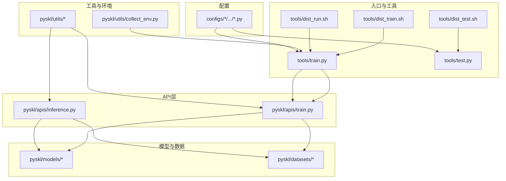
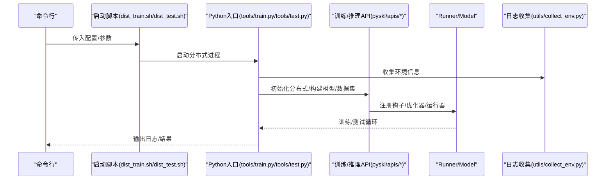
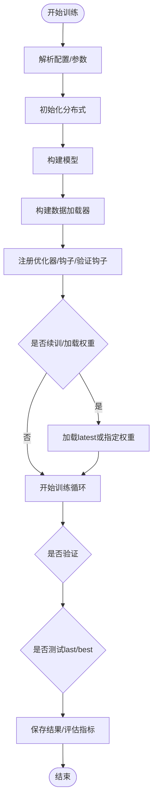
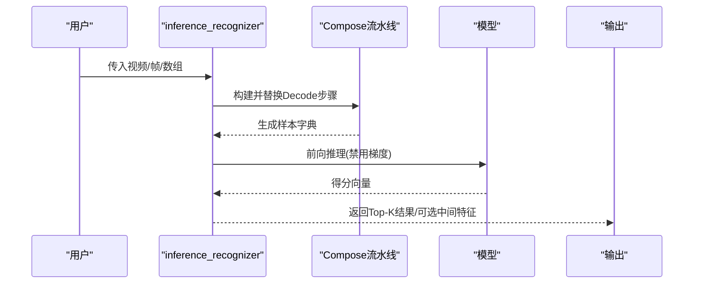
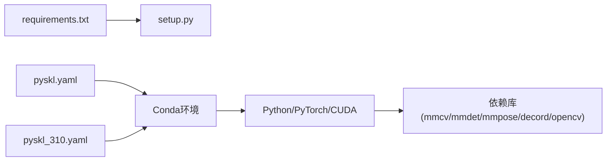

# 故障排除与常见问题

<cite>
**本文引用的文件**
- [README.md](file://README.md)
- [requirements.txt](file://requirements.txt)
- [setup.py](file://setup.py)
- [pyskl.yaml](file://pyskl.yaml)
- [pyskl_310.yaml](file://pyskl_310.yaml)
- [tools/train.py](file://tools/train.py)
- [tools/test.py](file://tools/test.py)
- [pyskl/apis/train.py](file://pyskl/apis/train.py)
- [pyskl/apis/inference.py](file://pyskl/apis/inference.py)
- [pyskl/utils/misc.py](file://pyskl/utils/misc.py)
- [pyskl/utils/collect_env.py](file://pyskl/utils/collect_env.py)
- [configs/stgcn/README.md](file://configs/stgcn/README.md)
- [configs/stgcn/stgcn_pyskl_ntu60_xsub_3dkp/j.py](file://configs/stgcn/stgcn_pyskl_ntu60_xsub_3dkp/j.py)
- [demo/demo.md](file://demo/demo.md)
- [tools/dist_train.sh](file://tools/dist_train.sh)
- [tools/dist_test.sh](file://tools/dist_test.sh)
- [tools/dist_run.sh](file://tools/dist_run.sh)
</cite>

## 目录
1. [简介](#简介)
2. [项目结构](#项目结构)
3. [核心组件](#核心组件)
4. [架构总览](#架构总览)
5. [详细组件分析](#详细组件分析)
6. [依赖关系分析](#依赖关系分析)
7. [性能考虑](#性能考虑)
8. [故障排除指南](#故障排除指南)
9. [结论](#结论)
10. [附录](#附录)

## 简介
本指南面向使用 PySKL 的研究者与工程师，聚焦于安装、训练、推理与性能优化过程中的常见问题与排错方法。内容涵盖：
- 安装阶段：conda 环境创建失败、依赖版本冲突、CUDA/显卡相关问题
- 训练阶段：显存不足、梯度异常、收敛困难、分布式训练问题
- 推理阶段：模型加载失败、输入格式错误、输出异常
- 性能问题：推理慢、内存占用高、训练效率低
- 配置问题：配置文件语法错误、参数不当、路径问题
- 日志与错误信息解读：如何从日志中定位问题
- 社区支持与求助渠道

## 项目结构
PySKL 基于 MMAction2 构建，采用模块化组织方式：工具脚本（tools）、API 层（pyskl/apis）、数据集与模型实现（pyskl/datasets、pyskl/models）、通用工具（pyskl/utils）以及大量算法配置（configs）。训练与测试通过 Bash 启动器调用 Python 脚本，最终由 API 层完成模型构建、数据加载与运行。

图表来源
- [tools/dist_train.sh](file://tools/dist_train.sh#L1-L12)
- [tools/dist_test.sh](file://tools/dist_test.sh#L1-L13)
- [tools/dist_run.sh](file://tools/dist_run.sh#L1-L11)
- [tools/train.py](file://tools/train.py#L60-L165)
- [tools/test.py](file://tools/test.py#L110-L185)
- [pyskl/apis/train.py](file://pyskl/apis/train.py#L50-L213)
- [pyskl/apis/inference.py](file://pyskl/apis/inference.py#L19-L184)
- [pyskl/utils/collect_env.py](file://pyskl/utils/collect_env.py#L8-L17)
- [configs/stgcn/stgcn_pyskl_ntu60_xsub_3dkp/j.py](file://configs/stgcn/stgcn_pyskl_ntu60_xsub_3dkp/j.py#L1-L61)

章节来源
- [README.md](file://README.md#L49-L91)
- [tools/dist_train.sh](file://tools/dist_train.sh#L1-L12)
- [tools/dist_test.sh](file://tools/dist_test.sh#L1-L13)
- [tools/dist_run.sh](file://tools/dist_run.sh#L1-L11)

## 核心组件
- 训练入口与流程控制：tools/train.py 负责解析配置、初始化分布式、记录环境信息、构建模型与数据集、调用训练 API 并可选进行验证与测试。
- 测试/评估入口：tools/test.py 负责构建测试数据加载器、加载检查点、多卡推理与评估。
- 训练 API：pyskl/apis/train.py 实现 EpochBasedRunner、优化器与钩子注册、可选验证钩子、断点续训与加载预训练权重。
- 推理 API：pyskl/apis/inference.py 提供模型初始化与推理函数，支持视频文件、原始帧目录、数组等多种输入，并返回前 K 结果与可选中间特征。
- 工具与环境：pyskl/utils/misc.py 提供 memcached 启停、端口检测、检查点缓存、根日志器等；collect_env.py 收集环境信息用于诊断。
- 配置系统：各算法配置文件（如 configs/stgcn/.../j.py）定义模型结构、数据流水线、优化策略与工作目录等。

章节来源
- [tools/train.py](file://tools/train.py#L60-L165)
- [tools/test.py](file://tools/test.py#L110-L185)
- [pyskl/apis/train.py](file://pyskl/apis/train.py#L50-L213)
- [pyskl/apis/inference.py](file://pyskl/apis/inference.py#L19-L184)
- [pyskl/utils/misc.py](file://pyskl/utils/misc.py#L18-L131)
- [pyskl/utils/collect_env.py](file://pyskl/utils/collect_env.py#L8-L17)
- [configs/stgcn/stgcn_pyskl_ntu60_xsub_3dkp/j.py](file://configs/stgcn/stgcn_pyskl_ntu60_xsub_3dkp/j.py#L1-L61)

## 架构总览
下图展示从命令行到训练/测试执行的关键调用链，以及与配置、日志、分布式初始化的关系。

图表来源
- [tools/dist_train.sh](file://tools/dist_train.sh#L1-L12)
- [tools/dist_test.sh](file://tools/dist_test.sh#L1-L13)
- [tools/train.py](file://tools/train.py#L60-L165)
- [tools/test.py](file://tools/test.py#L110-L185)
- [pyskl/apis/train.py](file://pyskl/apis/train.py#L50-L213)
- [pyskl/utils/collect_env.py](file://pyskl/utils/collect_env.py#L8-L17)

## 详细组件分析

### 训练流程与常见问题定位
- 分布式初始化与端口：启动脚本设置随机 MASTER_PORT 并通过 torch.distributed.launch 启动多进程。若出现端口冲突或网络问题，需检查防火墙与端口占用。
- 环境与日志：入口会记录环境信息与配置文本，便于后续问题复现与对比。
- 断点续训与加载：优先尝试 latest.pth 续训，否则按配置加载指定权重；若路径不存在或格式不匹配，将导致训练中断。
- 验证与测试：可选在训练期间进行验证并在结束后对 last/best 检查点进行测试；若未找到对应检查点，会发出警告并跳过相应测试。

图表来源
- [tools/train.py](file://tools/train.py#L60-L165)
- [pyskl/apis/train.py](file://pyskl/apis/train.py#L50-L213)

章节来源
- [tools/train.py](file://tools/train.py#L60-L165)
- [tools/dist_train.sh](file://tools/dist_train.sh#L1-L12)
- [pyskl/apis/train.py](file://pyskl/apis/train.py#L50-L213)

### 推理流程与输入/输出校验
- 输入类型：支持视频文件路径、HTTP 视频 URL、原始帧目录、4D 数组（T x H x W x C）。若输入类型不在支持集合内，将抛出运行时错误。
- 数据流水线：根据输入类型动态替换 Decode 步骤（OpenCVDecode、ArrayDecode、RawFrameDecode），确保后续张量形状与通道语义一致。
- 设备与前向：推理前将数据散射到目标 GPU，禁用梯度计算，输出为分类得分并提取前 K 结果；可选返回指定层的中间特征。
- 检查点缓存：远程权重将被缓存到本地以提升重复加载效率。

图表来源
- [pyskl/apis/inference.py](file://pyskl/apis/inference.py#L57-L184)

章节来源
- [pyskl/apis/inference.py](file://pyskl/apis/inference.py#L19-L184)

### 配置文件与参数要点
- 模型与数据：配置文件定义 backbone、head、数据流水线、采样长度、批次与工作进程数、优化器与学习率策略、工作目录等。
- 训练/测试命令：README 提供了基于 dist_train.sh/dist_test.sh 的标准用法，建议严格遵循示例命令与参数顺序。
- 评估指标：测试脚本支持多种指标（如 top_k_accuracy、mean_class_accuracy），需与数据集一致。

章节来源
- [configs/stgcn/README.md](file://configs/stgcn/README.md#L50-L67)
- [configs/stgcn/stgcn_pyskl_ntu60_xsub_3dkp/j.py](file://configs/stgcn/stgcn_pyskl_ntu60_xsub_3dkp/j.py#L1-L61)
- [README.md](file://README.md#L82-L91)

## 依赖关系分析
- 环境与依赖：requirements.txt 列出核心依赖（如 torch、mmcv-full、mmdet、mmpose、decord、opencv 等）。setup.py 在安装时读取该文件并作为 install_requires。
- Conda 环境：pyskl.yaml 与 pyskl_310.yaml 提供固定版本的 Python、PyTorch、CUDA、mmcv、mmdet、mmpose 等，推荐直接使用官方提供的 YAML 文件创建环境。
- 版本兼容性：不同 Python 版本（3.7 vs 3.10）对应不同的 CUDA 与 mmcv 版本组合，务必选择与硬件匹配的环境文件。

图表来源
- [requirements.txt](file://requirements.txt#L1-L14)
- [setup.py](file://setup.py#L25-L98)
- [pyskl.yaml](file://pyskl.yaml#L1-L132)
- [pyskl_310.yaml](file://pyskl_310.yaml#L1-L131)

章节来源
- [requirements.txt](file://requirements.txt#L1-L14)
- [setup.py](file://setup.py#L25-L98)
- [pyskl.yaml](file://pyskl.yaml#L1-L132)
- [pyskl_310.yaml](file://pyskl_310.yaml#L1-L131)

## 性能考虑
- 推理加速：可启用 torch.compile（仅 PyTorch ≥ 2.0 且传入 --compile 参数），显著降低前向开销。
- 内存缓存：当配置启用 memcached（memcached: true）时，训练/测试阶段会自动启动并缓存数据，减少磁盘 IO；可通过 mc_cfg 指定端口与主机。
- 多卡与批大小：增大 videos_per_gpu 与 workers_per_gpu 可提升吞吐，但需注意显存与 CPU 内存上限。
- 持久化工作进程：persistent_workers 可减少每轮迭代的数据加载开销，但会增加内存占用。
- 学习率缩放：配置中采用线性缩放学习率（初始 LR ∝ 批大小），调整批大小时需同步调整学习率。

章节来源
- [tools/train.py](file://tools/train.py#L121-L124)
- [tools/test.py](file://tools/test.py#L86-L89)
- [configs/stgcn/stgcn_pyskl_ntu60_xsub_3dkp/j.py](file://configs/stgcn/stgcn_pyskl_ntu60_xsub_3dkp/j.py#L52-L56)
- [configs/stgcn/README.md](file://configs/stgcn/README.md#L46-L47)

## 故障排除指南

### 一、安装与环境问题
- conda 环境创建失败
  - 症状：创建环境时报错、依赖冲突、下载超时
  - 排查要点：
    - 使用官方提供的 pyskl.yaml 或 pyskl_310.yaml 创建环境，避免手动拼装版本不匹配
    - 若使用较旧版本 conda，先升级 conda 再创建环境
    - 确认网络可访问默认 channels（pytorch、conda-forge、defaults）
  - 解决方案：
    - 清理缓存后重试：conda clean --all
    - 更换镜像源或代理后重试
    - 固定 CUDA 与 PyTorch 版本，参考对应 YAML 文件
  章节来源
  - [README.md](file://README.md#L49-L66)
  - [pyskl.yaml](file://pyskl.yaml#L1-L132)
  - [pyskl_310.yaml](file://pyskl_310.yaml#L1-L131)

- 依赖版本冲突
  - 症状：pip 安装时报 “已存在”“无法满足”“版本不兼容”
  - 排查要点：
    - 优先使用 conda 环境，再执行 pip install -e .
  - 解决方案：
    - 升级 pip、setuptools、wheel 后重试
    - 使用与环境文件一致的依赖版本，避免混用不同来源的包
  章节来源
  - [requirements.txt](file://requirements.txt#L1-L14)
  - [setup.py](file://setup.py#L25-L98)

- CUDA/显卡相关问题
  - 症状：导入 torch 报错、找不到 CUDA、GPU 不可用
  - 排查要点：
    - 确认 conda 环境中的 PyTorch 与 CUDA 版本匹配
    - 使用 collect_env.py 输出环境信息核对
  - 解决方案：
    - 重新创建与硬件匹配的 conda 环境
    - 确保驱动版本满足 CUDA 要求
  章节来源
  - [pyskl/utils/collect_env.py](file://pyskl/utils/collect_env.py#L8-L17)
  - [pyskl.yaml](file://pyskl.yaml#L16-L67)
  - [pyskl_310.yaml](file://pyskl_310.yaml#L16-L67)

### 二、训练阶段问题
- 显存不足（OOM）
  - 症状：运行时报 CUDA out of memory
  - 排查要点：
    - 检查 videos_per_gpu、clip_len、num_clips 是否过大
    - 确认是否启用了持久化工作进程与过多 worker
  - 解决方案：
    - 降低 videos_per_gpu 或 clip_len
    - 关闭 persistent_workers 或减少 workers_per_gpu
    - 使用 torch.cuda.empty_cache()（谨慎使用）
  章节来源
  - [configs/stgcn/stgcn_pyskl_ntu60_xsub_3dkp/j.py](file://configs/stgcn/stgcn_pyskl_ntu60_xsub_3dkp/j.py#L37-L46)
  - [pyskl/apis/train.py](file://pyskl/apis/train.py#L74-L87)

- 梯度异常（爆炸/消失）
  - 症状：loss NaN/inf，梯度范数异常大
  - 排查要点：
    - 检查学习率是否过高，是否启用 grad_clip
    - 确认数据归一化与标签是否正确
  - 解决方案：
    - 降低学习率或启用更激进的梯度裁剪
    - 检查数据流水线中的归一化与格式转换
  章节来源
  - [configs/stgcn/stgcn_pyskl_ntu60_xsub_3dkp/j.py](file://configs/stgcn/stgcn_pyskl_ntu60_xsub_3dkp/j.py#L48-L56)
  - [pyskl/apis/train.py](file://pyskl/apis/train.py#L100-L121)

- 收敛困难/精度停滞
  - 症状：准确率长时间不提升
  - 排查要点：
    - 学习率策略是否合适（CosineAnnealing 等）
    - 是否使用了合适的优化器与权重衰减
  - 解决方案：
    - 调整学习率策略或 warmup
    - 增加数据增强或调整采样长度
  章节来源
  - [configs/stgcn/stgcn_pyskl_ntu60_xsub_3dkp/j.py](file://configs/stgcn/stgcn_pyskl_ntu60_xsub_3dkp/j.py#L52-L56)

- 分布式训练问题
  - 症状：端口冲突、进程无法启动、rank 不一致
  - 排查要点：
    - 检查 MASTER_PORT 是否被占用
    - 确认网络连通性与 NCCL 后端
  - 解决方案：
    - 更换 MASTER_PORT 或重启网络服务
    - 使用启动脚本 tools/dist_train.sh，避免手工拼接参数
  章节来源
  - [tools/dist_train.sh](file://tools/dist_train.sh#L1-L12)
  - [tools/train.py](file://tools/train.py#L78-L80)

- 续训/加载权重失败
  - 症状：找不到 latest.pth 或加载失败
  - 排查要点：
    - 确认 work_dir 下是否存在对应文件
    - 检查配置中的 load_from/ resume_from 路径
  - 解决方案：
    - 指定正确的 -C/--checkpoint 或在配置中设置 load_from
  章节来源
  - [tools/train.py](file://tools/train.py#L82-L87)
  - [pyskl/apis/train.py](file://pyskl/apis/train.py#L138-L143)

### 三、推理阶段问题
- 模型加载失败
  - 症状：init_recognizer 抛出类型错误或加载失败
  - 排查要点：
    - config 必须为文件路径或 Config 对象
    - 检查 checkpoint 是否可访问或已缓存
  - 解决方案：
    - 使用 cache_checkpoint 将远程权重缓存到本地
  章节来源
  - [pyskl/apis/inference.py](file://pyskl/apis/inference.py#L38-L54)
  - [pyskl/utils/misc.py](file://pyskl/utils/misc.py#L115-L125)

- 输入格式错误
  - 症状：inference_recognizer 抛出不支持的输入类型
  - 排查要点：
    - 确认输入为字符串（文件/目录/URL）或 4D 数组
    - 检查数据流水线中 Decode 的替换逻辑
  - 解决方案：
    - 将数组转换为 T x H x W x C 的 4D 张量
    - 确保帧目录命名与 filename_tmpl 匹配
  章节来源
  - [pyskl/apis/inference.py](file://pyskl/apis/inference.py#L83-L98)
  - [pyskl/apis/inference.py](file://pyskl/apis/inference.py#L132-L161)

- 输出结果异常
  - 症状：输出为空、维度不匹配、类别数不符
  - 排查要点：
    - 检查模型 head 的 num_classes 与数据集一致
    - 确认 test_cfg 中 average_clips 设置
  - 解决方案：
    - 对齐配置中的类别数与实际数据集
    - 如需平均多个片段，设置 average_clips
  章节来源
  - [tools/test.py](file://tools/test.py#L73-L84)
  - [configs/stgcn/stgcn_pyskl_ntu60_xsub_3dkp/j.py](file://configs/stgcn/stgcn_pyskl_ntu60_xsub_3dkp/j.py#L6-L36)

### 四、性能问题
- 推理速度慢
  - 症状：单帧/单视频耗时过长
  - 排查要点：
    - 是否启用 torch.compile（PyTorch ≥ 2.0）
    - 是否使用了过多 worker 或持久化工作进程
  - 解决方案：
    - 传入 --compile 以启用编译
    - 适当减少 workers_per_gpu
  章节来源
  - [tools/test.py](file://tools/test.py#L58-L61)
  - [tools/train.py](file://tools/train.py#L121-L124)

- 内存占用高
  - 症状：CPU/显存持续上升
  - 排查要点：
    - 检查 persistent_workers 与 workers_per_gpu
    - 是否启用了 memcached 缓存
  - 解决方案：
    - 关闭 persistent_workers 或减少 worker 数
    - 控制 memcached 缓存大小与生命周期
  章节来源
  - [pyskl/apis/train.py](file://pyskl/apis/train.py#L79-L82)
  - [pyskl/utils/misc.py](file://pyskl/utils/misc.py#L18-L21)

- 训练效率低
  - 症状：吞吐低、进度缓慢
  - 排查要点：
    - 批大小是否过小
    - 数据加载是否成为瓶颈
  - 解决方案：
    - 适度增大 videos_per_gpu
    - 优化数据流水线与磁盘 IO
  章节来源
  - [configs/stgcn/stgcn_pyskl_ntu60_xsub_3dkp/j.py](file://configs/stgcn/stgcn_pyskl_ntu60_xsub_3dkp/j.py#L37-L46)

### 五、配置问题
- 配置文件语法错误
  - 症状：Config.fromfile 报错或字段缺失
  - 排查要点：
    - 确认 Python 字典语法正确，键名拼写无误
  - 解决方案：
    - 使用官方示例配置作为模板逐项对照
  章节来源
  - [configs/stgcn/stgcn_pyskl_ntu60_xsub_3dkp/j.py](file://configs/stgcn/stgcn_pyskl_ntu60_xsub_3dkp/j.py#L1-L61)

- 参数设置不当
  - 症状：训练/测试行为不符合预期
  - 排查要点：
    - 学习率、批大小、采样长度、评估指标是否合理
  - 解决方案：
    - 参考 README 与算法 README 的示例命令与参数
  章节来源
  - [README.md](file://README.md#L82-L91)
  - [configs/stgcn/README.md](file://configs/stgcn/README.md#L50-L67)

- 路径配置问题
  - 症状：数据文件找不到、工作目录不可写
  - 排查要点：
    - 检查 ann_file、frame_dir、work_dir 等路径是否存在
  - 解决方案：
    - 使用相对路径或绝对路径统一管理
  章节来源
  - [configs/stgcn/stgcn_pyskl_ntu60_xsub_3dkp/j.py](file://configs/stgcn/stgcn_pyskl_ntu60_xsub_3dkp/j.py#L8-L46)

### 六、日志分析与错误信息解读
- 环境信息：collect_env.py 输出版本与哈希，便于复现与对比
- 训练日志：入口会记录环境信息与配置文本；训练 API 注册日志钩子输出训练进度
- 常见错误提示：
  - “不支持的输入类型”：检查推理输入类型与数据流水线
  - “未找到检查点”：确认路径与文件存在
  - “端口占用/连接失败”：更换 MASTER_PORT 或修复网络
- 建议：
  - 将首次运行的日志完整保存，便于后续对比
  - 在分布式场景下仅查看 rank 0 的日志输出

章节来源
- [pyskl/utils/collect_env.py](file://pyskl/utils/collect_env.py#L8-L17)
- [tools/train.py](file://tools/train.py#L92-L110)
- [pyskl/apis/train.py](file://pyskl/apis/train.py#L117-L121)

### 七、社区支持与求助渠道
- 仓库地址与报告：参考 README 中的链接与联系方式
- 贡献与提问：欢迎提交 PR 与 Issue，联系邮箱见 README
- 相关算法与模型：参考各算法 README（如 STGCN）

章节来源
- [README.md](file://README.md#L113-L116)
- [configs/stgcn/README.md](file://configs/stgcn/README.md#L1-L23)

## 结论
通过规范的环境准备、严格的配置管理、合理的性能调优与系统化的日志分析，大多数安装、训练与推理问题均可快速定位与解决。建议在首次部署时严格按照官方示例执行，并在问题复现阶段保留完整的环境与日志信息以便追溯。

## 附录
- 示例命令参考
  - 训练：bash tools/dist_train.sh configs/.../j.py NUM_GPUS --validate --test-last --test-best
  - 测试：bash tools/dist_test.sh configs/.../j.py checkpoints/xxx.pth NUM_GPUS --eval top_k_accuracy --out result.pkl
- 环境采集：python -m pyskl.utils.collect_env
- 推理示例：参见 demo/demo.md 的命令与说明

章节来源
- [README.md](file://README.md#L82-L91)
- [demo/demo.md](file://demo/demo.md#L17-L41)