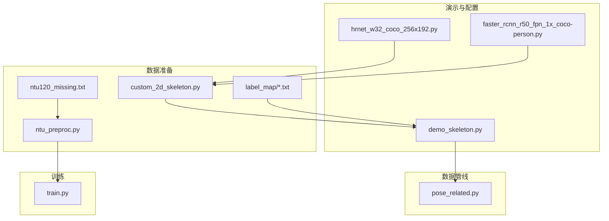
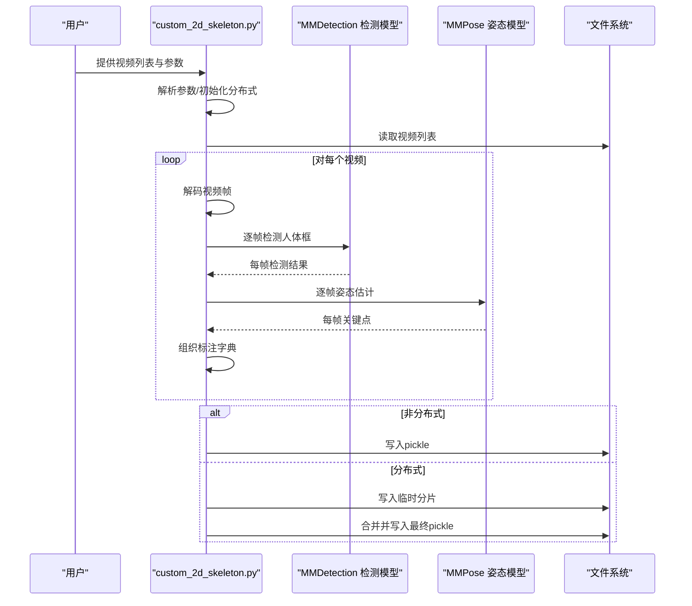
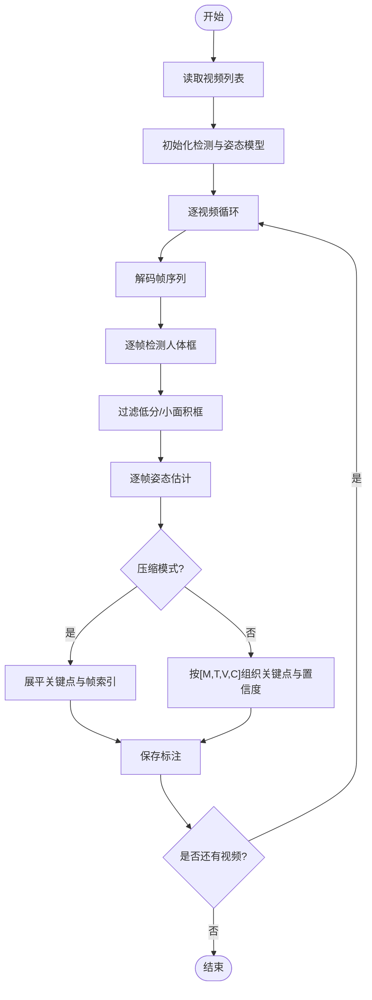
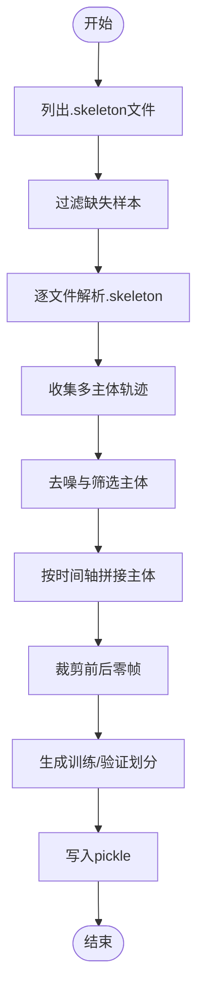
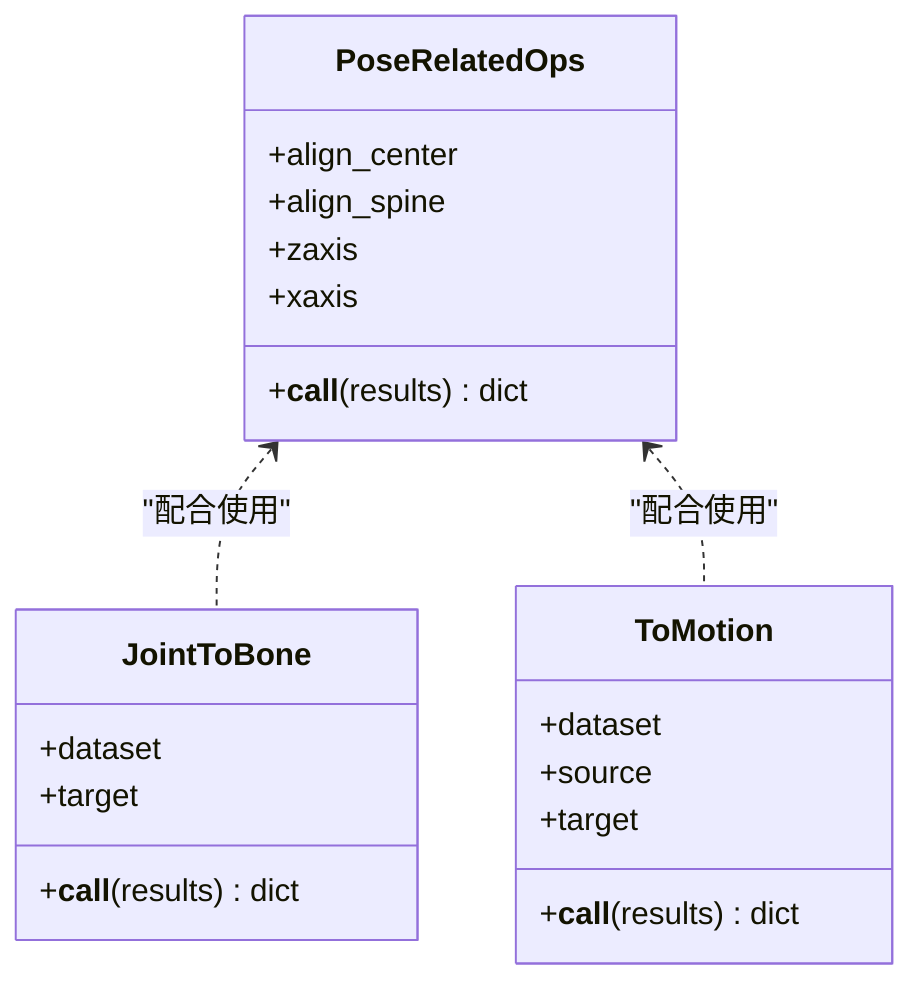
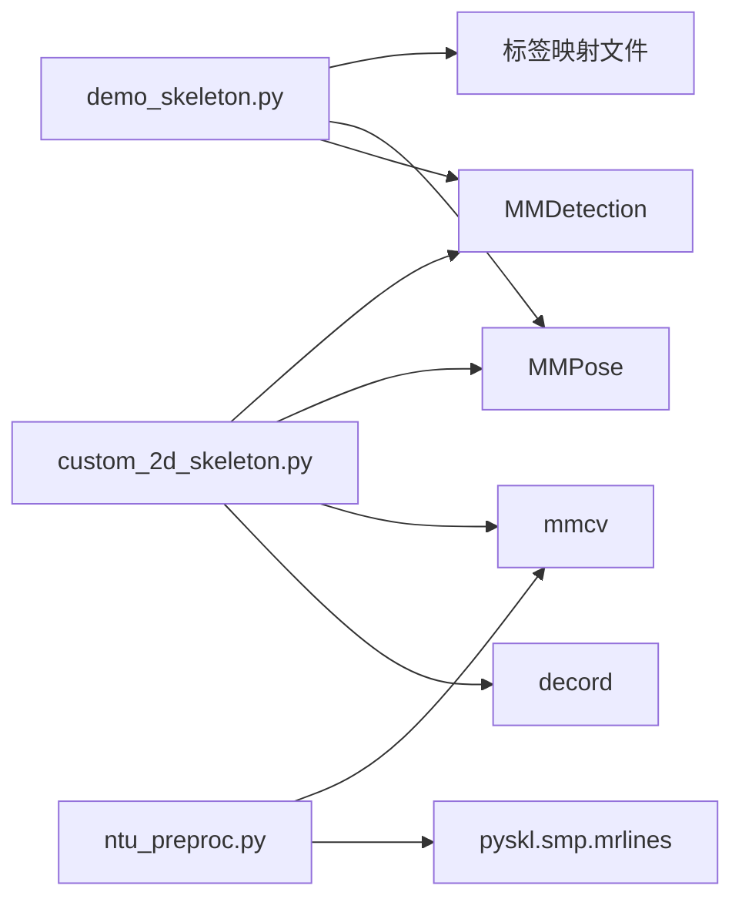

# 数据处理工具

<cite>
**本文引用的文件列表**
- [custom_2d_skeleton.py](file://tools/data/custom_2d_skeleton.py)
- [ntu_preproc.py](file://tools/data/ntu_preproc.py)
- [ntu120_missing.txt](file://tools/data/ntu120_missing.txt)
- [README.md（数据工具）](file://tools/data/README.md)
- [demo_skeleton.py](file://demo/demo_skeleton.py)
- [hrnet_w32_coco_256x192.py](file://demo/hrnet_w32_coco_256x192.py)
- [faster_rcnn_r50_fpn_1x_coco-person.py](file://demo/faster_rcnn_r50_fpn_1x_coco-person.py)
- [diving48.txt](file://tools/data/label_map/diving48.txt)
- [gym.txt](file://tools/data/label_map/gym.txt)
- [nturgbd_120.txt](file://tools/data/label_map/nturgbd_120.txt)
- [pose_related.py](file://pyskl/datasets/pipelines/pose_related.py)
- [train.py](file://tools/train.py)
</cite>

## 目录
1. [简介](#简介)
2. [项目结构](#项目结构)
3. [核心组件](#核心组件)
4. [架构总览](#架构总览)
5. [详细组件分析](#详细组件分析)
6. [依赖关系分析](#依赖关系分析)
7. [性能考量](#性能考量)
8. [故障排查指南](#故障排查指南)
9. [结论](#结论)
10. [附录](#附录)

## 简介
本文件面向PySKL数据处理工具，系统化阐述以下能力：
- 自定义视频2D骨架提取：基于HRNet的姿态估计与MMDetection的人体检测集成，支持分布式加速与压缩存储。
- NTU RGB+D 3D骨架预处理：从原始.skeleton文件解析、去噪与拼接，生成标准pickle标注文件。
- 标签映射：多数据集标签体系与类别编号/名称映射。
- 数据格式转换与完整性校验：骨架数组维度、坐标系对齐、运动特征生成等。
- 缺失数据处理：NTU120缺失样本清单与数据补全策略。
- 质量评估与验证：数据分布、异常值检测与统计分析建议。
- 最佳实践与性能优化：内存与IO优化、并行策略、缓存与分布式训练衔接。

## 项目结构
与数据处理直接相关的核心路径与文件：
- tools/data/custom_2d_skeleton.py：自定义视频2D骨架提取主脚本
- tools/data/ntu_preproc.py：NTU RGB+D 3D骨架预处理脚本
- tools/data/ntu120_missing.txt：NTU120缺失样本清单
- tools/data/README.md：数据格式与下载说明
- demo/demo_skeleton.py：骨架演示与可视化（含标签映射读取）
- demo/hrnet_w32_coco_256x192.py：HRNet姿态配置
- demo/faster_rcnn_r50_fpn_1x_coco-person.py：人体检测配置
- tools/data/label_map/*：各类数据集标签映射文件
- pyskl/datasets/pipelines/pose_related.py：骨架数据转换与增强管线
- tools/train.py：训练入口（分布式与缓存）

图表来源
- [custom_2d_skeleton.py](file://tools/data/custom_2d_skeleton.py#L1-L194)
- [ntu_preproc.py](file://tools/data/ntu_preproc.py#L1-L201)
- [ntu120_missing.txt](file://tools/data/ntu120_missing.txt#L1-L536)
- [demo_skeleton.py](file://demo/demo_skeleton.py#L1-L314)
- [hrnet_w32_coco_256x192.py](file://demo/hrnet_w32_coco_256x192.py#L1-L134)
- [faster_rcnn_r50_fpn_1x_coco-person.py](file://demo/faster_rcnn_r50_fpn_1x_coco-person.py#L1-L164)
- [pose_related.py](file://pyskl/datasets/pipelines/pose_related.py#L237-L361)
- [train.py](file://tools/train.py#L1-L165)

章节来源
- [README.md（数据工具）](file://tools/data/README.md#L1-L119)

## 核心组件
- 自定义视频2D骨架提取器：封装MMDetection与MMPose，支持分布式与压缩存储，输出标准pickle标注。
- NTU RGB+D 3D骨架预处理器：解析.skeleton文件、去噪、拼接多主体片段，生成标准标注与划分字典。
- 标签映射系统：提供多数据集类别名到编号的映射文件，便于训练与推理阶段的标签一致性。
- 骨架数据管线：提供对齐、骨骼向量转换、运动特征生成等数据转换操作。
- 训练入口：支持分布式训练、自动缓存、断点续训等。

章节来源
- [custom_2d_skeleton.py](file://tools/data/custom_2d_skeleton.py#L1-L194)
- [ntu_preproc.py](file://tools/data/ntu_preproc.py#L1-L201)
- [demo_skeleton.py](file://demo/demo_skeleton.py#L1-L314)
- [pose_related.py](file://pyskl/datasets/pipelines/pose_related.py#L237-L361)
- [train.py](file://tools/train.py#L1-L165)

## 架构总览
下图展示从视频到骨架标注的关键流程：视频帧解码 -> 人体检测 -> 姿态估计 -> 结果组织 -> 分布式合并/压缩存储。

图表来源
- [custom_2d_skeleton.py](file://tools/data/custom_2d_skeleton.py#L122-L190)

## 详细组件分析

### 自定义视频2D骨架提取（custom_2d_skeleton.py）
- 功能概述
  - 使用MMDetection进行人体检测，MMPose进行2D关键点估计。
  - 支持单GPU与分布式执行；可选择压缩存储以节省空间。
  - 输出标准pickle标注，包含帧数、图像尺寸、关键点与置信度等字段。
- 关键流程
  - 视频帧解码：使用decord读取视频帧。
  - 人体检测：对每帧调用inference_detector，过滤低分与小面积框。
  - 姿态估计：对每帧调用inference_top_down_pose_model，得到17关节点。
  - 标注组织：按compress选项生成压缩或完整格式，写入pickle。
- 参数与配置
  - 检测与姿态配置文件路径默认指向demo目录下的配置。
  - 可设置检测分数阈值与面积阈值，控制人体框质量。
  - 支持非分布式与分布式两种模式，分布式时会合并各进程分片。
- 性能要点
  - decord解码速度较快；检测与姿态估计为GPU密集型。
  - 压缩模式将关键点展平为一维数组，显著降低存储体积。
  - 分布式模式通过rank分片与barrier同步，避免重复工作。

图表来源
- [custom_2d_skeleton.py](file://tools/data/custom_2d_skeleton.py#L43-L85)

章节来源
- [custom_2d_skeleton.py](file://tools/data/custom_2d_skeleton.py#L1-L194)
- [faster_rcnn_r50_fpn_1x_coco-person.py](file://demo/faster_rcnn_r50_fpn_1x_coco-person.py#L1-L164)
- [hrnet_w32_coco_256x192.py](file://demo/hrnet_w32_coco_256x192.py#L1-L134)

### NTU RGB+D 3D骨架预处理（ntu_preproc.py）
- 功能概述
  - 解析官方.skeleton文件，提取25关节点序列。
  - 多主体去噪与拼接，生成统一时间轴的关键点张量。
  - 生成NTU60与NTU120两类标注文件，包含split与annotations。
- 关键流程
  - 解析.skeleton：逐帧读取主体数量与关节点坐标。
  - 去噪与筛选：基于方差与有效帧比例剔除噪声片段。
  - 拼接多主体：按起始帧与重叠区域合并，保留运动信息最大的主体。
  - 过滤零帧：去除全零帧段，确保有效长度。
  - 划分生成：根据subject或view划分训练/验证集合。
- 缺失数据处理
  - 读取ntu120_missing.txt，排除缺失样本，保证数据完整性。
- 输出格式
  - 每条标注包含frame_dir、label、keypoint、total_frames等字段。
  - 生成ntu60_3danno.pkl与ntu120_3danno.pkl。

图表来源
- [ntu_preproc.py](file://tools/data/ntu_preproc.py#L14-L161)
- [ntu120_missing.txt](file://tools/data/ntu120_missing.txt#L1-L536)

章节来源
- [ntu_preproc.py](file://tools/data/ntu_preproc.py#L1-L201)
- [README.md（数据工具）](file://tools/data/README.md#L48-L54)

### 标签映射文件（label_map）
- 文件位置与用途
  - tools/data/label_map/：包含多数据集的标签映射文件。
  - demo_skeleton.py中通过--label-map指定标签映射文件，用于将预测类别索引映射为人类可读类别名。
- 文件示例
  - diving48.txt：Diving48动作类别名列表。
  - gym.txt：GYM体操动作类别名列表。
  - nturgbd_120.txt：NTURGB+D 120动作类别名列表。
- 使用建议
  - 训练配置中应与数据集类别数一致，避免类别不匹配。
  - 推理阶段结合demo_skeleton.py的可视化与标签映射，快速定位错误类别。

章节来源
- [diving48.txt](file://tools/data/label_map/diving48.txt#L1-L49)
- [gym.txt](file://tools/data/label_map/gym.txt#L1-L100)
- [nturgbd_120.txt](file://tools/data/label_map/nturgbd_120.txt#L1-L121)
- [demo_skeleton.py](file://demo/demo_skeleton.py#L93-L95)

### 数据格式转换与完整性校验
- 关键点数据结构
  - 2D骨架：M×T×V×2（含keypoint与keypoint_score），V通常为17（COCO关键点）。
  - 3D骨架：M×T×25×3（V=25，NTU RGB+D）。
  - 元数据：frame_dir、total_frames、img_shape、label等。
- 常用转换操作
  - 对齐与中心化：将骨架对齐到主要人体中心，便于后续建模。
  - 骨骼向量转换：将关键点差值转换为骨骼向量，提升对位移不变性。
  - 运动特征：计算相邻帧差分作为运动表示，增强时序建模。
- 完整性检查
  - 检查keypoint与total_frames一致性。
  - 检查img_shape在2D场景下的存在性。
  - 检查label范围与类别数一致性。

图表来源
- [pose_related.py](file://pyskl/datasets/pipelines/pose_related.py#L237-L361)

章节来源
- [pose_related.py](file://pyskl/datasets/pipelines/pose_related.py#L237-L361)
- [README.md（数据工具）](file://tools/data/README.md#L5-L28)

### 缺失数据处理（ntu120_missing.txt）
- 作用
  - 列出NTU120中缺失的样本标识，预处理阶段将其从处理列表中剔除，避免空文件或错误标注。
- 使用方式
  - 在ntu_preproc.py中读取该文件，构建集合后过滤掉对应样本。
- 补全策略建议
  - 若需补全，可尝试从官方仓库重新下载对应.skeleton文件，或采用跨视图/跨视角的样本进行数据增强（谨慎使用）。

章节来源
- [ntu120_missing.txt](file://tools/data/ntu120_missing.txt#L1-L536)
- [ntu_preproc.py](file://tools/data/ntu_preproc.py#L138-L140)

### 数据质量评估与验证
- 数据分布检查
  - 统计每类样本数量，绘制类别分布直方图，识别长尾与不平衡问题。
  - 检查每条样本的total_frames分布，识别过短或过长序列。
- 异常值检测
  - 检查keypoint是否存在全零帧或异常大值，必要时进行裁剪或替换。
  - 检查img_shape与实际帧尺寸一致性。
- 统计分析
  - 计算每类关键点均值与方差，辅助归一化与正则化。
  - 计算帧间运动幅度统计量，识别异常抖动或静止片段。

章节来源
- [README.md（数据工具）](file://tools/data/README.md#L5-L28)

## 依赖关系分析
- 组件耦合
  - custom_2d_skeleton.py依赖MMDetection与MMPose，二者均为外部库，需正确安装与导入。
  - ntu_preproc.py依赖pyskl.smp.mrlines读取文本文件，依赖numpy与mmcv进行序列化。
  - demo_skeleton.py依赖标签映射文件与可视化工具，用于演示与调试。
- 外部依赖
  - decord：视频解码。
  - mmdet/mmpose：检测与姿态估计。
  - mmcv：序列化与进度条。
  - scipy：线性分配（跟踪）。
- 循环依赖
  - 当前脚本无明显循环依赖，但分布式写入与合并需注意文件锁与同步。

图表来源
- [custom_2d_skeleton.py](file://tools/data/custom_2d_skeleton.py#L16-L30)
- [ntu_preproc.py](file://tools/data/ntu_preproc.py#L9-L9)
- [demo_skeleton.py](file://demo/demo_skeleton.py#L28-L43)

章节来源
- [custom_2d_skeleton.py](file://tools/data/custom_2d_skeleton.py#L16-L30)
- [ntu_preproc.py](file://tools/data/ntu_preproc.py#L9-L9)
- [demo_skeleton.py](file://demo/demo_skeleton.py#L28-L43)

## 性能考量
- I/O与内存
  - 使用压缩模式（compress）可显著降低存储与网络传输开销。
  - decord解码速度快，建议优先使用GPU解码（若可用）。
- 并行与分布式
  - custom_2d_skeleton.py支持分布式执行，按rank切分任务，减少单机压力。
  - ntu_preproc.py可通过修改num_process提升CPU并行度。
- 缓存与预处理
  - 训练前可预先生成pickle标注，避免运行时重复解析。
  - 对于Kinetics-400等大规模数据，可采用memcached缓存kpfiles，加速训练。
- 网络与权重
  - 默认权重来自OpenMMLab官方下载链接，首次运行会自动下载，建议离线部署时提前缓存。

章节来源
- [custom_2d_skeleton.py](file://tools/data/custom_2d_skeleton.py#L113-L114)
- [ntu_preproc.py](file://tools/data/ntu_preproc.py#L164-L165)
- [README.md（数据工具）](file://tools/data/README.md#L46-L47)
- [train.py](file://tools/train.py#L138-L160)

## 故障排查指南
- 导入失败
  - 现象：无法导入inference_detector或init_detector/inference_top_down_pose_model。
  - 处理：确认已安装mmdet与mmpose，并满足版本要求；检查Python路径与虚拟环境。
- 检测模型类别不符
  - 现象：检测模型类别不是person。
  - 处理：确保使用COCO预训练模型；检查CLASSES[0]断言。
- 视频解码异常
  - 现象：decord解码报错或返回空帧。
  - 处理：检查视频路径与权限；确认视频编码格式受支持。
- 分布式写入冲突
  - 现象：多进程写入临时分片时出现覆盖或顺序错乱。
  - 处理：确保tmpdir存在且仅由rank=0创建；使用barrier同步后再合并。
- 标签映射不匹配
  - 现象：类别索引超出标签映射范围。
  - 处理：核对数据集类别数与标签映射长度；确保训练配置一致。

章节来源
- [custom_2d_skeleton.py](file://tools/data/custom_2d_skeleton.py#L16-L30)
- [custom_2d_skeleton.py](file://tools/data/custom_2d_skeleton.py#L147-L149)
- [demo_skeleton.py](file://demo/demo_skeleton.py#L152-L155)

## 结论
本文档系统梳理了PySKL数据处理工具链，涵盖2D骨架提取、3D骨架预处理、标签映射、数据格式转换与完整性校验、缺失数据处理、质量评估与性能优化等方面。通过合理使用这些工具与最佳实践，可以高效地完成从原始视频/标注到训练就绪的骨架数据准备。

## 附录
- 数据格式参考
  - 2D骨架：M×T×V×2，V=17（COCO）；含keypoint与keypoint_score。
  - 3D骨架：M×T×25×3（NTU RGB+D）。
  - 元数据：frame_dir、total_frames、img_shape、label等。
- 下载与预处理
  - 参考tools/data/README.md中的下载链接与预处理步骤。
- 示例与演示
  - demo_skeleton.py展示了标签映射与可视化流程，可作为使用范例。

章节来源
- [README.md（数据工具）](file://tools/data/README.md#L5-L47)