# 数据预处理工具

<cite>
**本文档引用的文件**
- [ntu_preproc.py](file://tools/data/ntu_preproc.py)
- [ntu120_missing.txt](file://tools/data/ntu120_missing.txt)
- [README.md](file://tools/data/README.md)
- [smp.py](file://pyskl/smp.py)
- [demo_skeleton.py](file://demo/demo_skeleton.py)
</cite>

## 目录
1. [简介](#简介)
2. [项目结构](#项目结构)
3. [核心组件](#核心组件)
4. [架构概览](#架构概览)
5. [详细组件分析](#详细组件分析)
6. [依赖关系分析](#依赖关系分析)
7. [性能考虑](#性能考虑)
8. [故障排除指南](#故障排除指南)
9. [结论](#结论)
10. [附录](#附录)

## 简介

PySKL数据预处理工具是一个专门用于处理NTU RGB+D原始骨架数据的系统化解决方案。该工具将NTU RGB+D数据集的原始.skeleton文件转换为深度学习模型可直接使用的pickle格式注释文件，支持NTU60和NTU120两个版本的数据集。

本工具的核心功能包括：
- 原始.skeleton文件解析和数据提取
- 多人体骨架数据的去噪和筛选
- 3D骨架数据的格式标准化
- 缺失数据的识别和处理
- 并行处理优化
- 数据质量检查和验证

## 项目结构

PySKL项目采用模块化设计，数据预处理工具位于tools/data目录下，主要包含以下关键文件：

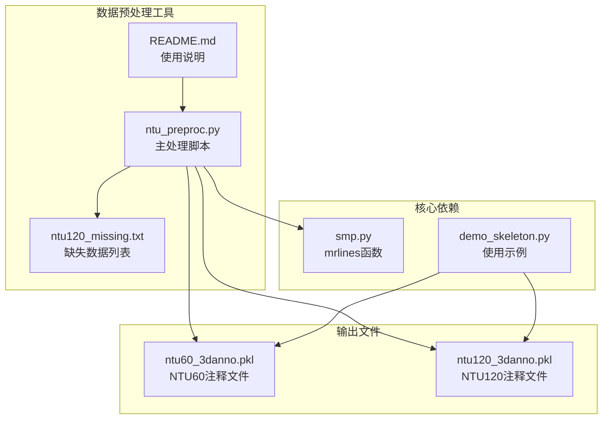

**图表来源**
- [ntu_preproc.py](file://tools/data/ntu_preproc.py#L1-L201)
- [ntu120_missing.txt](file://tools/data/ntu120_missing.txt#L1-L536)
- [README.md](file://tools/data/README.md#L1-L119)

**章节来源**
- [ntu_preproc.py](file://tools/data/ntu_preproc.py#L1-L201)
- [README.md](file://tools/data/README.md#L1-L119)

## 核心组件

### 主要处理流程

数据预处理工具采用流水线式处理架构，包含以下核心组件：

1. **文件解析器**：解析NTU RGB+D的.skeleton文件格式
2. **数据清洗器**：处理多人体数据和噪声数据
3. **格式转换器**：将数据转换为标准的pickle格式
4. **分割器**：根据NTU RGB+D的标准划分规则进行数据分割
5. **并行处理器**：支持多进程并行加速

### 关键数据结构

预处理后的数据采用统一的字典格式存储：

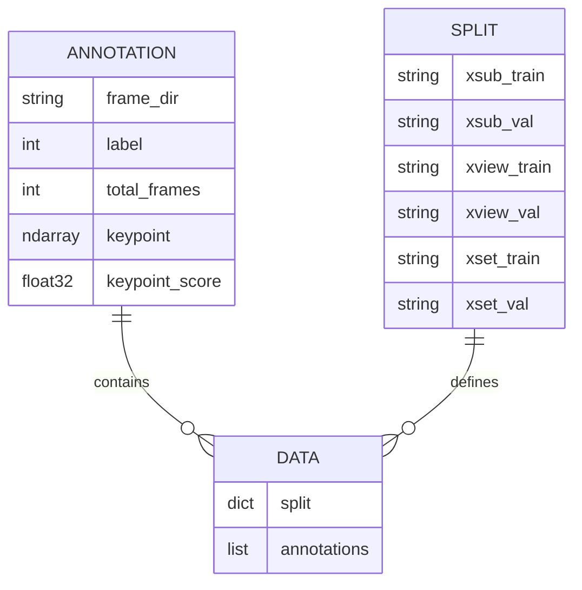

**图表来源**
- [ntu_preproc.py](file://tools/data/ntu_preproc.py#L153-L161)

**章节来源**
- [ntu_preproc.py](file://tools/data/ntu_preproc.py#L1-L201)

## 架构概览

数据预处理工具的整体架构采用分层设计，从底层的文件操作到高层的数据处理形成了清晰的抽象层次：

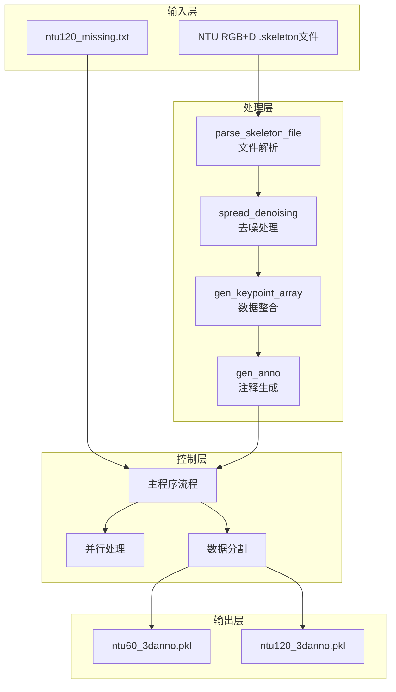

**图表来源**
- [ntu_preproc.py](file://tools/data/ntu_preproc.py#L14-L53)
- [ntu_preproc.py](file://tools/data/ntu_preproc.py#L153-L201)

## 详细组件分析

### 文件解析组件

文件解析组件负责将NTU RGB+D的原始.skeleton文件转换为内部数据结构：

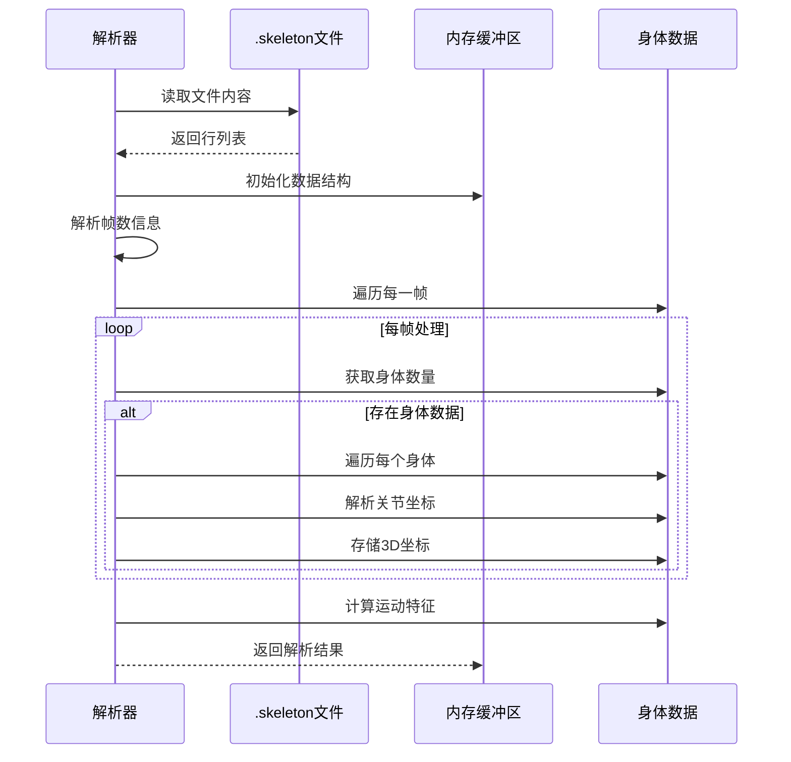

**图表来源**
- [ntu_preproc.py](file://tools/data/ntu_preproc.py#L14-L53)

#### 解析算法流程

文件解析过程遵循NTU RGB+D的.skeleton文件格式规范：

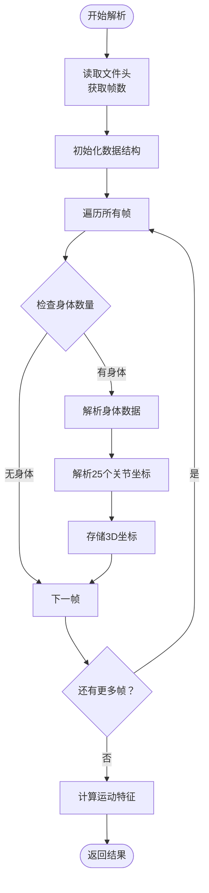

**图表来源**
- [ntu_preproc.py](file://tools/data/ntu_preproc.py#L14-L53)

**章节来源**
- [ntu_preproc.py](file://tools/data/ntu_preproc.py#L14-L53)

### 数据清洗组件

数据清洗组件采用多阶段的去噪和筛选策略：

#### 扩散去噪算法

扩散去噪算法通过分析骨架数据的空间分布来识别和过滤噪声：

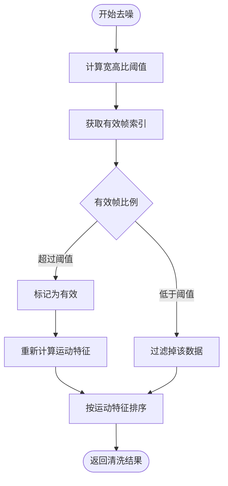

**图表来源**
- [ntu_preproc.py](file://tools/data/ntu_preproc.py#L56-L84)

#### 运动特征计算

运动特征用于区分不同身体数据的质量和有效性：

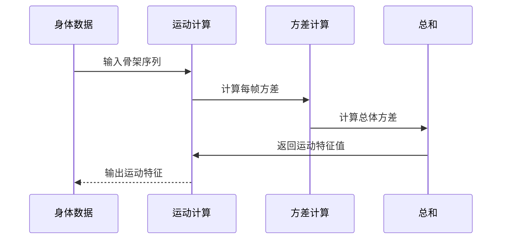

**图表来源**
- [ntu_preproc.py](file://tools/data/ntu_preproc.py#L48-L50)

**章节来源**
- [ntu_preproc.py](file://tools/data/ntu_preproc.py#L56-L84)
- [ntu_preproc.py](file://tools/data/ntu_preproc.py#L48-L50)

### 数据整合组件

数据整合组件负责将多个身体数据合并为最终的骨架数组：

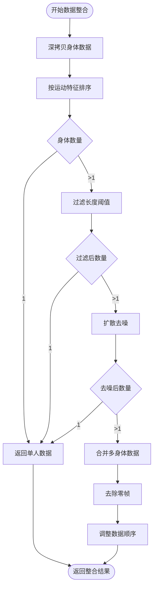

**图表来源**
- [ntu_preproc.py](file://tools/data/ntu_preproc.py#L97-L131)

**章节来源**
- [ntu_preproc.py](file://tools/data/ntu_preproc.py#L97-L131)

### 缺失数据处理

缺失数据处理是NTU RGB+D预处理的重要组成部分：

#### 缺失数据识别

NTU120_missing.txt文件包含了NTU RGB+D 120数据集中缺失的样本标识：

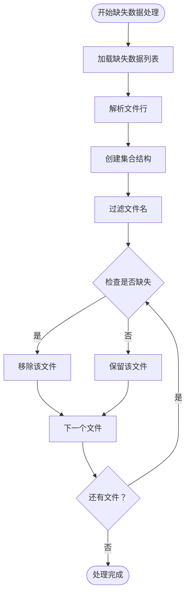

**图表来源**
- [ntu_preproc.py](file://tools/data/ntu_preproc.py#L138-L140)

**章节来源**
- [ntu120_missing.txt](file://tools/data/ntu120_missing.txt#L1-L536)
- [ntu_preproc.py](file://tools/data/ntu_preproc.py#L138-L140)

### 并行处理机制

工具支持多进程并行处理以提高效率：

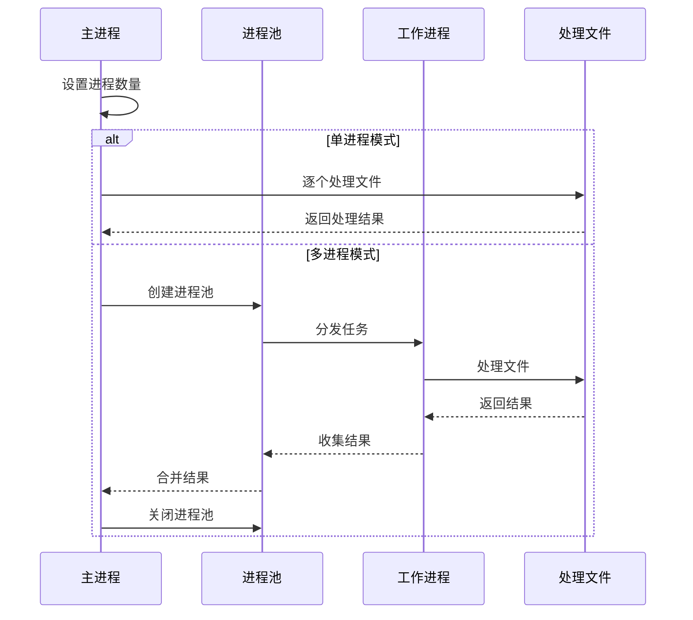

**图表来源**
- [ntu_preproc.py](file://tools/data/ntu_preproc.py#L164-L176)

**章节来源**
- [ntu_preproc.py](file://tools/data/ntu_preproc.py#L164-L176)

## 依赖关系分析

数据预处理工具的依赖关系相对简单但功能明确：

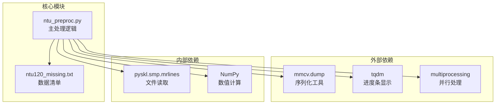

**图表来源**
- [ntu_preproc.py](file://tools/data/ntu_preproc.py#L1-L9)
- [smp.py](file://pyskl/smp.py#L32-L36)

### 关键依赖说明

1. **mrlines函数**：来自pyskl.smp模块，提供高效的文件行读取功能
2. **NumPy库**：用于高效的数据数组操作和数值计算
3. **mmcv.dump**：用于将Python对象序列化为pickle文件
4. **tqdm**：提供命令行进度条显示
5. **multiprocessing**：支持多进程并行处理

**章节来源**
- [ntu_preproc.py](file://tools/data/ntu_preproc.py#L1-L9)
- [smp.py](file://pyskl/smp.py#L32-L36)

## 性能考虑

### 内存优化策略

1. **数据类型优化**：使用float16存储关键点坐标，减少内存占用约50%
2. **延迟加载**：仅在需要时加载和处理数据
3. **内存回收**：及时释放不再使用的中间变量

### 并行处理优化

1. **进程数量调优**：根据CPU核心数调整num_process参数
2. **批处理策略**：合理设置文件处理批次大小
3. **I/O优化**：避免频繁的磁盘读写操作

### 处理速度优化

1. **向量化操作**：充分利用NumPy的向量化特性
2. **算法复杂度**：选择时间复杂度较低的去噪算法
3. **缓存机制**：对重复计算的结果进行缓存

## 故障排除指南

### 常见问题及解决方案

#### 文件读取错误

**问题描述**：无法读取.skeleton文件或ntu120_missing.txt文件

**可能原因**：
- 文件路径不正确
- 文件权限不足
- 文件损坏或格式不正确

**解决方法**：
1. 确认文件路径是否正确
2. 检查文件权限设置
3. 验证文件完整性

#### 内存不足错误

**问题描述**：处理大型数据集时出现内存不足错误

**解决方法**：
1. 减少并行进程数量
2. 使用更小的批处理大小
3. 增加系统内存或使用64位环境

#### 数据格式错误

**问题描述**：生成的pickle文件无法被后续程序正确读取

**解决方法**：
1. 检查数据格式是否符合预期
2. 验证关键字段是否存在
3. 确认数据类型是否正确

**章节来源**
- [README.md](file://tools/data/README.md#L48-L55)

## 结论

PySKL数据预处理工具为NTU RGB+D数据集提供了完整、高效的预处理解决方案。该工具的主要优势包括：

1. **完整的数据处理流程**：从原始.skeleton文件到最终的pickle注释文件
2. **智能的数据清洗**：通过扩散去噪算法有效识别和过滤噪声数据
3. **灵活的配置选项**：支持单进程和多进程处理模式
4. **标准化的数据格式**：提供与PySKL框架兼容的统一数据格式
5. **完善的缺失数据处理**：自动识别和处理NTU RGB+D 120中的缺失样本

该工具为动作识别研究提供了高质量的基础数据，支持多种深度学习模型的训练和测试需求。

## 附录

### 使用示例

工具的使用非常简单，只需按照以下步骤操作：

1. 下载NTU RGB+D原始骨架文件并解压
2. 将所有.skeleton文件放入名为`nturgb+d_skeletons`的文件夹中
3. 在`$PYSKL/tools/data`目录下运行`python ntu_preproc.py`
4. 等待处理完成，生成`ntu60_3danno.pkl`和`ntu120_3danno.pkl`文件

### 参数配置

- `num_process`：并行处理的进程数量，默认为1
- `length_threshold`：身体数据长度阈值，默认为11帧
- `wh_ratio`：宽高比阈值，默认为0.8
- `spnoise_ratio`：扩散噪声比例阈值，默认为0.69754

### 数据质量检查

处理完成后，可以通过以下方式验证数据质量：

1. 检查生成的pickle文件是否成功创建
2. 验证注释文件的结构是否符合预期
3. 确认数据分割是否正确
4. 检查关键点坐标的范围和有效性