# 数据验证与质量控制

<cite>
**本文档引用的文件**
- [ntu_preproc.py](file://tools/data/ntu_preproc.py)
- [ntu120_missing.txt](file://tools/data/ntu120_missing.txt)
- [custom_2d_skeleton.py](file://tools/data/custom_2d_skeleton.py)
- [pose_dataset.py](file://pyskl/datasets/pose_dataset.py)
- [base.py](file://pyskl/datasets/base.py)
- [builder.py](file://pyskl/datasets/builder.py)
- [loading.py](file://pyskl/datasets/pipelines/loading.py)
- [pose_related.py](file://pyskl/datasets/pipelines/pose_related.py)
- [smp.py](file://pyskl/smp.py)
- [misc.py](file://pyskl/utils/misc.py)
</cite>

## 目录
1. [简介](#简介)
2. [项目结构](#项目结构)
3. [核心组件](#核心组件)
4. [架构概览](#架构概览)
5. [详细组件分析](#详细组件分析)
6. [依赖关系分析](#依赖关系分析)
7. [性能考虑](#性能考虑)
8. [故障排除指南](#故障排除指南)
9. [结论](#结论)

## 简介

PySKL是一个基于深度学习的动作识别框架，专注于骨架数据的处理和分析。本文档详细阐述了PySKL中数据验证与质量控制的完整体系，包括NTU RGB+D数据集的预处理流程、骨架数据格式标准、质量评估方法、缺失数据处理策略以及数据清洗和修复工具。

PySKL通过多层次的数据验证机制确保骨架数据的质量，从原始骨架文件解析到最终的训练数据准备，每个环节都包含严格的质量控制措施。

## 项目结构

PySKL项目采用模块化设计，主要分为以下几个核心部分：

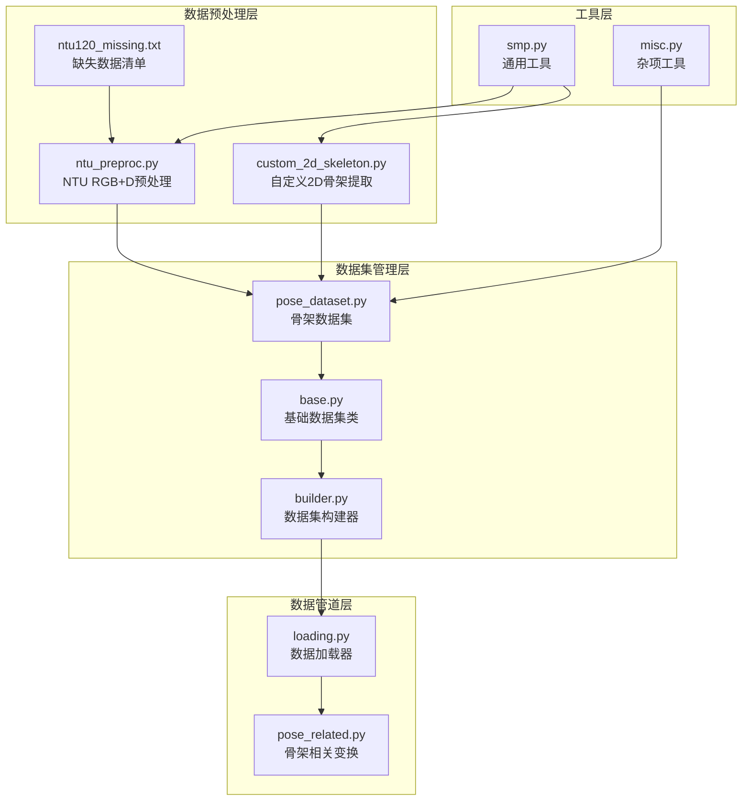

**图表来源**
- [ntu_preproc.py](file://tools/data/ntu_preproc.py#L1-L201)
- [pose_dataset.py](file://pyskl/datasets/pose_dataset.py#L1-L107)
- [base.py](file://pyskl/datasets/base.py#L1-L354)

**章节来源**
- [ntu_preproc.py](file://tools/data/ntu_preproc.py#L1-L201)
- [custom_2d_skeleton.py](file://tools/data/custom_2d_skeleton.py#L1-L194)

## 核心组件

### 数据预处理组件

PySKL的数据预处理系统由三个核心组件构成：

1. **NTU RGB+D骨架预处理器**：处理原始NTU RGB+D数据集的.skeleton文件
2. **自定义2D骨架提取器**：支持用户自定义视频数据的骨架提取
3. **缺失数据管理器**：维护和管理缺失数据记录

### 数据集管理组件

数据集管理系统提供统一的接口来处理不同类型的骨架数据：

- **PoseDataset**：专门处理骨架数据的基类
- **BaseDataset**：所有数据集的基础抽象类
- **Dataset Builder**：负责数据集的构建和配置

### 数据管道组件

数据管道系统包含多种数据变换和处理操作：

- **骨架解码器**：从存储格式中提取骨架数据
- **预处理变换**：包括归一化、旋转、缩放等操作
- **数据加载器**：高效加载和处理数据

**章节来源**
- [pose_dataset.py](file://pyskl/datasets/pose_dataset.py#L1-L107)
- [base.py](file://pyskl/datasets/base.py#L1-L354)
- [pose_related.py](file://pyskl/datasets/pipelines/pose_related.py#L1-L553)

## 架构概览

PySKL的数据验证与质量控制架构采用分层设计，确保每个环节都有明确的质量控制职责：

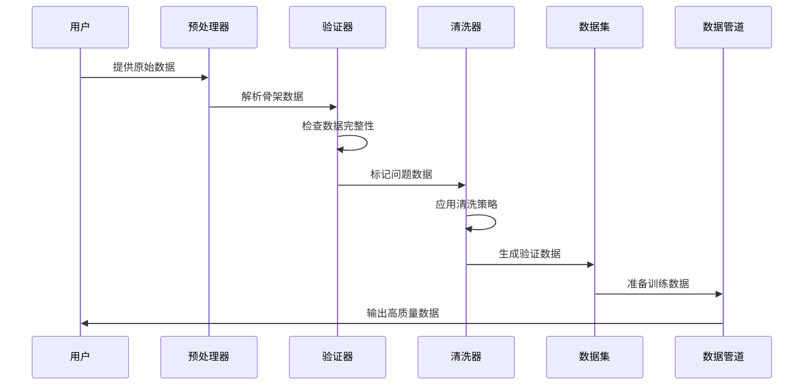

**图表来源**
- [ntu_preproc.py](file://tools/data/ntu_preproc.py#L14-L53)
- [pose_dataset.py](file://pyskl/datasets/pose_dataset.py#L86-L107)

## 详细组件分析

### NTU RGB+D骨架预处理器

NTU RGB+D预处理器是PySKL数据验证的核心组件，负责处理原始NTU RGB+D数据集的.skeleton文件。

#### 骨架文件解析流程

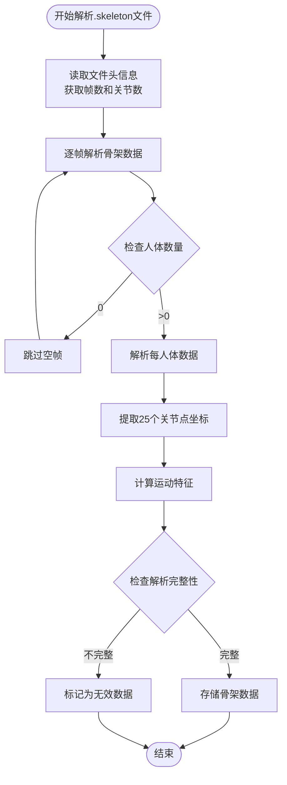

**图表来源**
- [ntu_preproc.py](file://tools/data/ntu_preproc.py#L14-L53)

#### 关键点完整性检查

预处理器实施了严格的关节点完整性检查：

- **关节数量验证**：确保每帧都有25个关节点
- **坐标范围检查**：验证关节点坐标的合理性
- **时间连续性验证**：检查帧间的时间连续性
- **人体ID一致性**：确保同一人体ID在整个序列中保持一致

#### 运动特征计算

预处理器通过计算运动特征来评估骨架数据的质量：

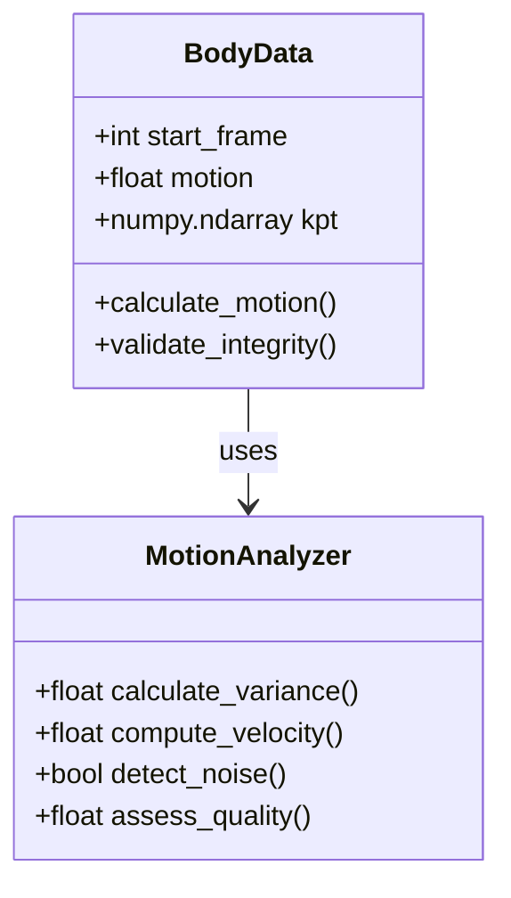

**图表来源**
- [ntu_preproc.py](file://tools/data/ntu_preproc.py#L48-L53)
- [ntu_preproc.py](file://tools/data/ntu_preproc.py#L97-L131)

**章节来源**
- [ntu_preproc.py](file://tools/data/ntu_preproc.py#L14-L131)

### 自定义2D骨架提取器

自定义2D骨架提取器支持用户自定义视频数据的骨架提取，提供了灵活的配置选项：

#### 检测器配置

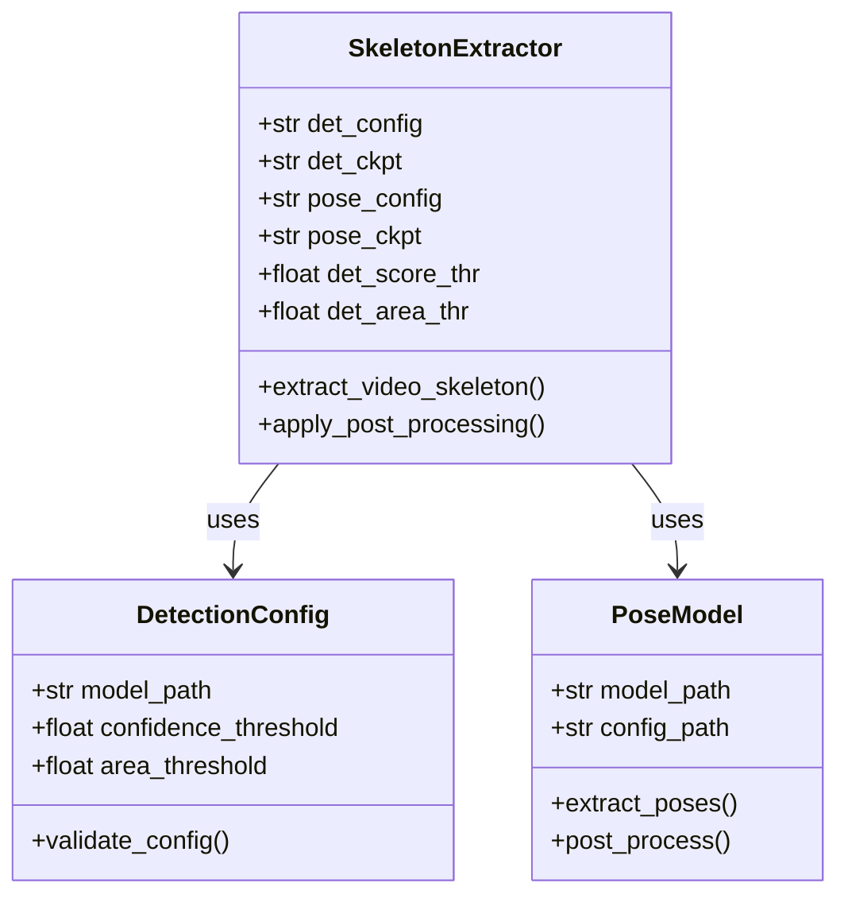

**图表来源**
- [custom_2d_skeleton.py](file://tools/data/custom_2d_skeleton.py#L88-L119)
- [custom_2d_skeleton.py](file://tools/data/custom_2d_skeleton.py#L147-L149)

#### 关键参数配置

- **检测置信度阈值**：默认0.7，过滤低质量检测框
- **检测框面积阈值**：默认1600像素，去除过小的人体检测
- **模型配置**：支持自定义检测器和姿态估计器

**章节来源**
- [custom_2d_skeleton.py](file://tools/data/custom_2d_skeleton.py#L88-L194)

### 缺失数据管理器

PySKL通过ntu120_missing.txt文件管理缺失的NTU RGB+D数据记录：

#### 缺失数据识别流程

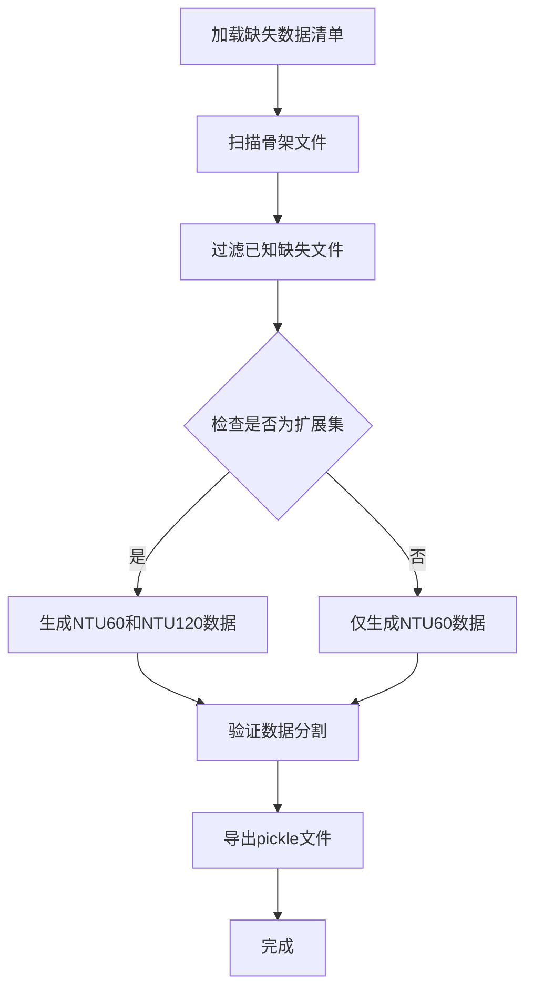

**图表来源**
- [ntu_preproc.py](file://tools/data/ntu_preproc.py#L134-L151)
- [ntu120_missing.txt](file://tools/data/ntu120_missing.txt#L1-L536)

#### 缺失数据处理策略

- **自动过滤**：在数据预处理阶段自动排除缺失文件
- **数据集扩展**：根据是否存在扩展数据决定生成的数据集类型
- **分割验证**：确保数据分割的正确性和完整性

**章节来源**
- [ntu120_missing.txt](file://tools/data/ntu120_missing.txt#L1-L536)
- [ntu_preproc.py](file://tools/data/ntu_preproc.py#L134-L201)

### 数据集质量控制系统

PySKL的数据集质量控制系统提供了多层次的数据验证和质量保证：

#### 数据完整性验证

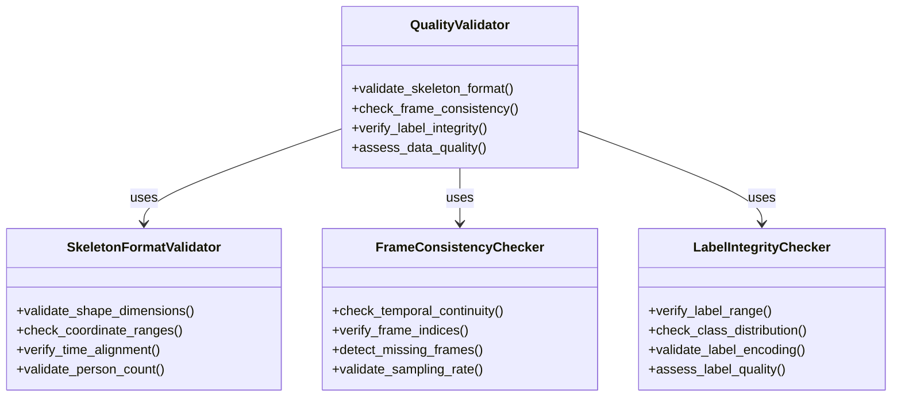

**图表来源**
- [pose_dataset.py](file://pyskl/datasets/pose_dataset.py#L86-L107)
- [base.py](file://pyskl/datasets/base.py#L75-L84)

#### 质量评估指标

数据集质量评估包括以下关键指标：

- **骨架格式完整性**：检查骨架数据的形状和维度
- **帧数一致性**：验证帧序列的连续性和完整性
- **标签有效性**：确保标签的正确性和一致性
- **数据分布均衡性**：评估各类别的分布情况

**章节来源**
- [pose_dataset.py](file://pyskl/datasets/pose_dataset.py#L86-L107)
- [base.py](file://pyskl/datasets/base.py#L112-L241)

### 数据清洗和修复工具

PySKL提供了多种数据清洗和修复工具来处理质量问题：

#### 异常值检测

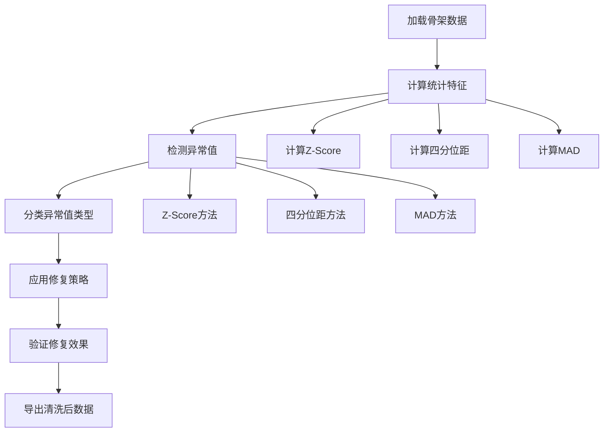

**图表来源**
- [pose_related.py](file://pyskl/datasets/pipelines/pose_related.py#L156-L202)

#### 噪声过滤策略

数据清洗系统实施了多层次的噪声过滤策略：

- **高斯噪声过滤**：使用随机向量和范数计算进行噪声抑制
- **运动特征过滤**：基于运动幅度和方向变化检测异常
- **空间一致性检查**：验证关节点间的几何关系

#### 数据标准化

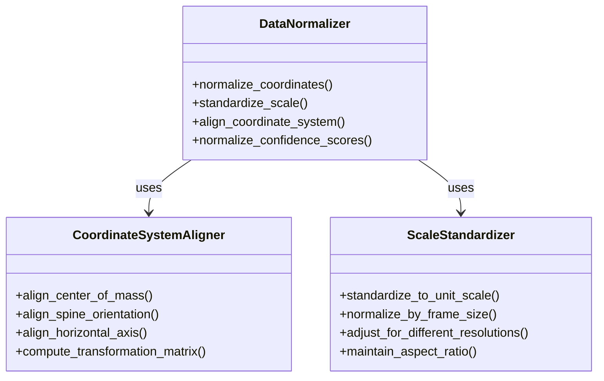

**图表来源**
- [pose_related.py](file://pyskl/datasets/pipelines/pose_related.py#L206-L292)
- [pose_related.py](file://pyskl/datasets/pipelines/pose_related.py#L52-L96)

**章节来源**
- [pose_related.py](file://pyskl/datasets/pipelines/pose_related.py#L156-L292)

### 自动化验证脚本

PySKL提供了完整的自动化验证脚本来处理大规模数据集：

#### 批处理数据验证

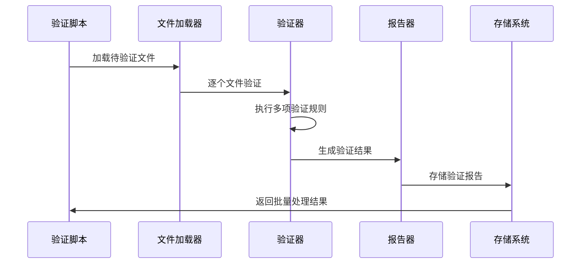

**图表来源**
- [ntu_preproc.py](file://tools/data/ntu_preproc.py#L164-L177)

#### 质量报告生成

自动化脚本能够生成详细的验证报告，包括：

- **数据完整性报告**：显示缺失数据和格式错误
- **质量评分**：为每个数据项提供质量分数
- **修复建议**：针对发现的问题提供修复建议
- **统计摘要**：提供整体数据质量的统计信息

**章节来源**
- [ntu_preproc.py](file://tools/data/ntu_preproc.py#L164-L201)

## 依赖关系分析

PySKL的数据验证与质量控制系统的依赖关系体现了清晰的分层架构：

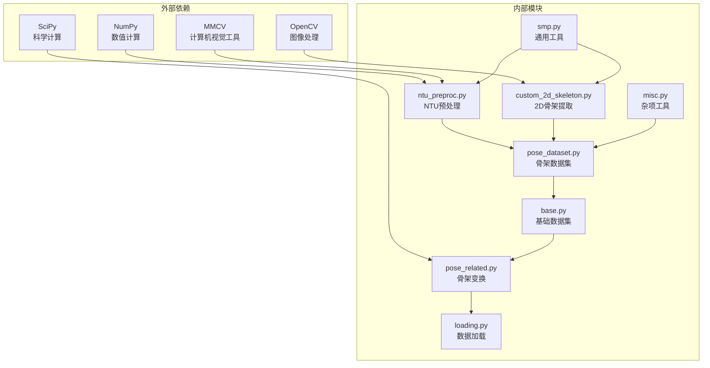

**图表来源**
- [ntu_preproc.py](file://tools/data/ntu_preproc.py#L1-L10)
- [custom_2d_skeleton.py](file://tools/data/custom_2d_skeleton.py#L1-L14)
- [pose_related.py](file://pyskl/datasets/pipelines/pose_related.py#L1-L8)

**章节来源**
- [smp.py](file://pyskl/smp.py#L1-L183)
- [misc.py](file://pyskl/utils/misc.py#L1-L131)

## 性能考虑

PySKL在设计时充分考虑了性能优化，特别是在大规模数据处理场景下的效率：

### 并行处理优化

- **多进程并行**：NTU预处理支持多进程并行处理，显著提升处理速度
- **内存管理**：智能的内存分配和回收机制，避免内存泄漏
- **缓存策略**：支持数据缓存和预取，减少重复I/O操作

### 内存优化技术

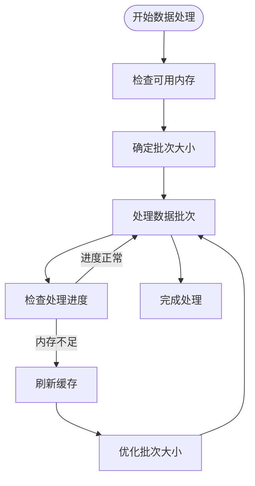

### 性能监控

系统提供了性能监控功能，包括：

- **处理速度监控**：实时跟踪数据处理速度
- **内存使用监控**：监控内存使用情况
- **错误率统计**：统计数据验证过程中的错误率

## 故障排除指南

### 常见问题诊断

#### 数据格式错误

**问题症状**：
- 骨架数据形状不匹配
- 关节点坐标超出合理范围
- 帧数不一致

**解决方案**：
1. 检查.skeleton文件的格式完整性
2. 验证关节点数量和坐标范围
3. 确认帧序列的连续性

#### 性能问题

**问题症状**：
- 数据处理速度缓慢
- 内存使用过高
- 处理过程中断

**解决方案**：
1. 调整并行处理参数
2. 优化内存使用策略
3. 检查硬件资源限制

#### 配置错误

**问题症状**：
- 模型加载失败
- 参数设置不正确
- 功能调用异常

**解决方案**：
1. 验证配置文件的正确性
2. 检查依赖库版本兼容性
3. 确认参数设置的合理性

**章节来源**
- [base.py](file://pyskl/datasets/base.py#L112-L241)
- [pose_dataset.py](file://pyskl/datasets/pose_dataset.py#L86-L107)

## 结论

PySKL的数据验证与质量控制系统通过多层次的设计实现了全面的数据质量保证。从原始数据的预处理到最终的训练数据准备，每个环节都包含了严格的质量控制措施。

该系统的主要优势包括：

1. **全面的数据验证**：涵盖格式完整性、内容一致性和质量评估
2. **灵活的处理策略**：支持多种数据源和处理需求
3. **高效的性能表现**：通过并行处理和优化算法确保处理效率
4. **完善的工具链**：提供从数据提取到质量报告的完整工具集

通过遵循PySKL的数据验证与质量控制最佳实践，用户可以确保获得高质量的骨架数据，为后续的动作识别任务奠定坚实的基础。