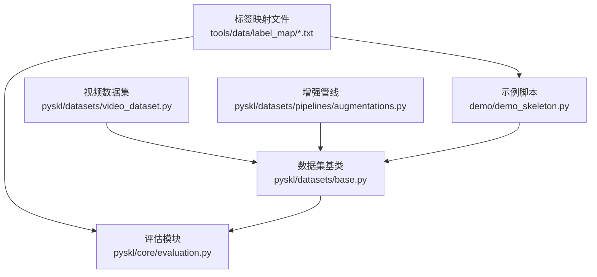
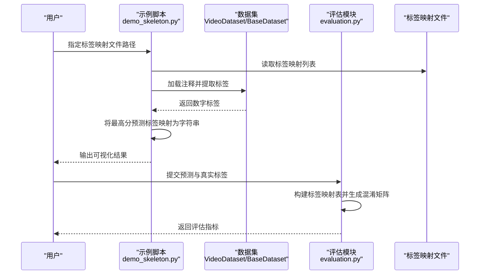
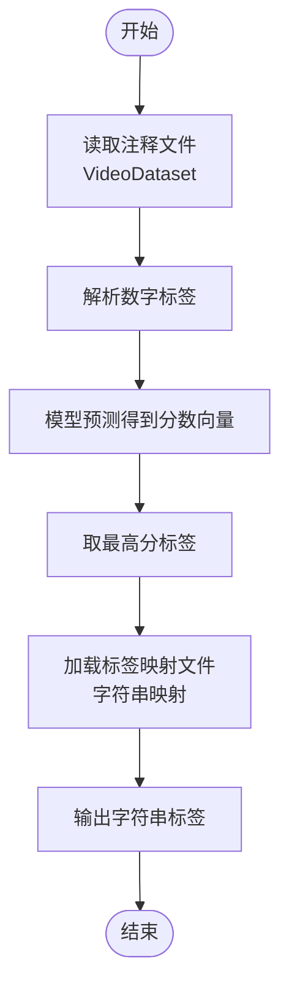
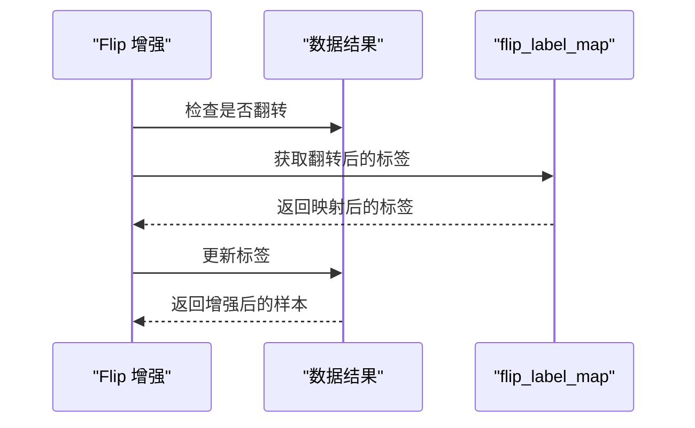
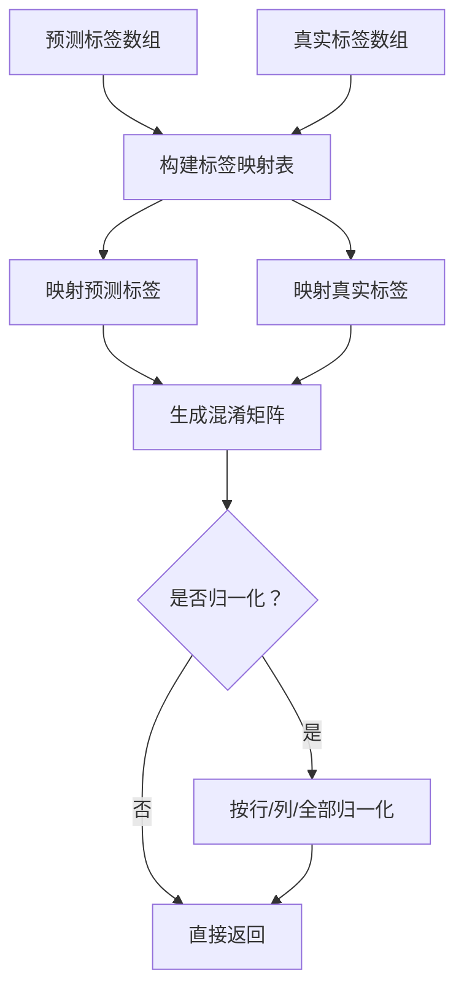
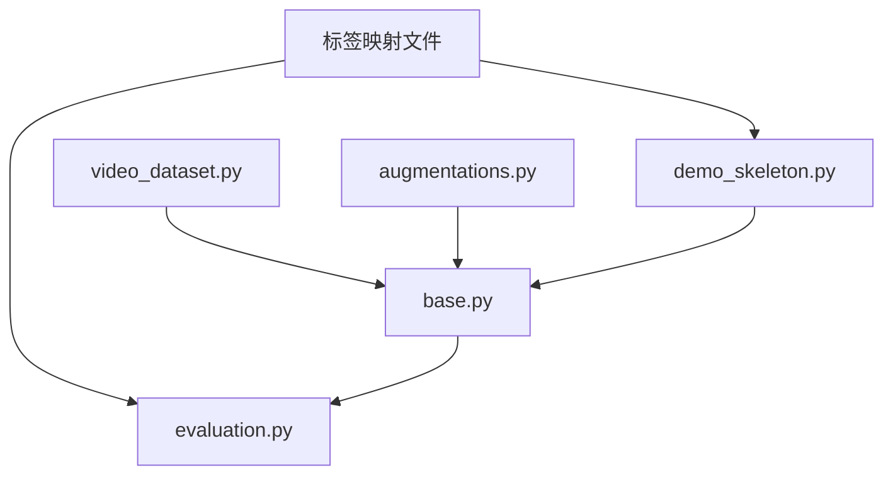

# 标签映射系统

<cite>
**本文档引用的文件**
- [diving48.txt](file://tools/data/label_map/diving48.txt)
- [gym.txt](file://tools/data/label_map/gym.txt)
- [hmdb51.txt](file://tools/data/label_map/hmdb51.txt)
- [k400.txt](file://tools/data/label_map/k400.txt)
- [nturgbd_120.txt](file://tools/data/label_map/nturgbd_120.txt)
- [ucf101.txt](file://tools/data/label_map/ucf101.txt)
- [demo_skeleton.py](file://demo/demo_skeleton.py)
- [video_dataset.py](file://pyskl/datasets/video_dataset.py)
- [base.py](file://pyskl/datasets/base.py)
- [evaluation.py](file://pyskl/core/evaluation.py)
- [augmentations.py](file://pyskl/datasets/pipelines/augmentations.py)
- [README.md](file://tools/data/README.md)
</cite>

## 目录
1. [简介](#简介)
2. [项目结构](#项目结构)
3. [核心组件](#核心组件)
4. [架构总览](#架构总览)
5. [详细组件分析](#详细组件分析)
6. [依赖关系分析](#依赖关系分析)
7. [性能考虑](#性能考虑)
8. [故障排除指南](#故障排除指南)
9. [结论](#结论)
10. [附录](#附录)

## 简介
本文件系统性阐述 PySKL 的标签映射体系，覆盖多数据集的标签体系、类别编号规则、命名规范与分类层级，以及标签编码/解码的实现方式。同时提供扩展方法、一致性检查与冲突解决策略，以及版本管理与更新建议。

## 项目结构
标签映射相关的核心位置如下：
- 标签映射文件：tools/data/label_map/*.txt
- 数据加载与处理：pyskl/datasets/*
- 评估与混淆矩阵：pyskl/core/evaluation.py
- 可视化与示例：demo/demo_skeleton.py
- 数据格式说明：tools/data/README.md

**图表来源**
- [diving48.txt](file://tools/data/label_map/diving48.txt#L1-L49)
- [base.py](file://pyskl/datasets/base.py#L83-L110)
- [video_dataset.py](file://pyskl/datasets/video_dataset.py#L1-L61)
- [evaluation.py](file://pyskl/core/evaluation.py#L39-L100)
- [augmentations.py](file://pyskl/datasets/pipelines/augmentations.py#L477-L604)
- [demo_skeleton.py](file://demo/demo_skeleton.py#L247-L293)

**章节来源**
- [README.md](file://tools/data/README.md#L1-L119)

## 核心组件
- 标签映射文件：每行以“编号→类别名”的形式存储，编号从 1 开始递增，用于将数字标签映射为人类可读的字符串标签。
- 数据加载：VideoDataset 从文本注释中解析文件路径与标签；BaseDataset 提供通用的视频信息加载与按类别分组等能力。
- 评估与映射：evaluation.py 中的混淆矩阵计算会自动构建从原始标签到连续编号的映射，确保不同数据集或划分下的标签一致性。
- 增强与翻转：augmentations.py 中的 Flip 增强支持通过 flip_label_map 对标签进行翻转变换，保证翻转后标签仍指向正确的类别。
- 示例与可视化：demo_skeleton.py 展示了如何加载标签映射文件，并将预测的数字标签转换为字符串标签进行可视化。

**章节来源**
- [video_dataset.py](file://pyskl/datasets/video_dataset.py#L42-L61)
- [base.py](file://pyskl/datasets/base.py#L83-L110)
- [evaluation.py](file://pyskl/core/evaluation.py#L39-L100)
- [augmentations.py](file://pyskl/datasets/pipelines/augmentations.py#L477-L604)
- [demo_skeleton.py](file://demo/demo_skeleton.py#L247-L293)

## 架构总览
标签映射系统贯穿数据加载、训练/推理、评估与可视化全流程：

**图表来源**
- [demo_skeleton.py](file://demo/demo_skeleton.py#L247-L293)
- [video_dataset.py](file://pyskl/datasets/video_dataset.py#L42-L61)
- [evaluation.py](file://pyskl/core/evaluation.py#L39-L100)

## 详细组件分析

### diving48.txt 标签体系
- 类别数量：48 类
- 标签命名规范：采用“方向+起跳距离+转体数+姿势”组合，如 Back+15som+05Twis+FREE，体现跳水动作的技术要素。
- 分类层级：方向（Back/Forward/Inward/Reverse）、起跳距离（som 数值）、转体（Twis 数值）、姿势（PIKE/TUCK/FREE/STR）。
- 编码/解码：数字标签 1..48 对应文件中的第 1..48 行字符串标签。

**章节来源**
- [diving48.txt](file://tools/data/label_map/diving48.txt#L1-L49)

### gym.txt 标韵体系
- 类别数量：100 类
- 标签命名规范：使用体操动作的专业术语，如 VT/FX/BB/UB 各自域内的动作名称，包含转体、跳跃、支撑等技术描述。
- 分类层级：按体操项目域（Vault/Floor/Beam/Pommel Horse）划分，域内再按动作类型细分。
- 编码/解码：数字标签 1..100 对应文件中的第 1..100 行字符串标签。

**章节来源**
- [gym.txt](file://tools/data/label_map/gym.txt#L1-L100)

### hmdb51.txt 标签体系
- 类别数量：51 类
- 标签命名规范：采用简洁英文动词短语，如 brush_hair、cartwheel、clap 等，偏向日常动作与体育动作。
- 分类层级：无明确域级结构，按动作语义归类。
- 编码/解码：数字标签 1..51 对应文件中的第 1..51 行字符串标签。

**章节来源**
- [hmdb51.txt](file://tools/data/label_map/hmdb51.txt#L1-L52)

### k400.txt 标签体系
- 类别数量：401 类
- 栅签命名规范：涵盖广泛的人类活动与运动，如 cooking、driving、playing 等，部分动作带具体技术细节描述。
- 分类层级：无明确域级结构，按动作语义归类。
- 编码/解码：数字标签 1..401 对应文件中的第 1..401 行字符串标签。

**章节来源**
- [k400.txt](file://tools/data/label_map/k400.txt#L1-L401)

### nturgbd_120.txt 标签体系
- 类别数量：120 类
- 标签命名规范：日常生活与交互动作，如 drink water、eat meal/snack、brushing teeth、throw、clapping 等。
- 分类层级：无明确域级结构，按动作语义归类。
- 编码/解码：数字标签 1..120 对应文件中的第 1..120 行字符串标签。

**章节来源**
- [nturgbd_120.txt](file://tools/data/label_map/nturgbd_120.txt#L1-L121)

### ucf101.txt 标签体系
- 类别数量：101 类
- 标签命名规范：采用帕斯卡命名法，首字母大写，如 ApplyEyeMakeup、BabyCrawling、Basketball 等。
- 分类层级：无明确域级结构，按动作语义归类。
- 编码/解码：数字标签 1..101 对应文件中的第 1..101 行字符串标签。

**章节来源**
- [ucf101.txt](file://tools/data/label_map/ucf101.txt#L1-L102)

### 标签编码与解码实现
- 文本注释中的标签：VideoDataset 在加载注释时将最后一列解析为整型标签，作为数字标签。
- 字符串映射：demo_skeleton.py 读取标签映射文件，将预测的最高分标签映射为对应字符串标签。
- 动态映射：evaluation.py 的混淆矩阵计算会根据出现的所有标签集合构建从原始标签到连续编号的映射，避免不同数据集或划分导致的标签不一致问题。

**图表来源**
- [video_dataset.py](file://pyskl/datasets/video_dataset.py#L42-L61)
- [demo_skeleton.py](file://demo/demo_skeleton.py#L247-L293)

**章节来源**
- [video_dataset.py](file://pyskl/datasets/video_dataset.py#L42-L61)
- [demo_skeleton.py](file://demo/demo_skeleton.py#L247-L293)
- [evaluation.py](file://pyskl/core/evaluation.py#L39-L100)

### 标签翻转与增强映射
- 翻转增强：augmentations.py 的 Flip 增强支持 flip_label_map 参数，对翻转后的标签进行映射，确保左右对称动作的标签正确性。
- 使用场景：在姿态数据上进行水平翻转时，通过 flip_label_map 将左/右关键点交换对应的标签也进行交换，保持语义一致。

**图表来源**
- [augmentations.py](file://pyskl/datasets/pipelines/augmentations.py#L477-L604)

**章节来源**
- [augmentations.py](file://pyskl/datasets/pipelines/augmentations.py#L477-L604)

### 评估与标签一致性
- 标签映射：evaluation.py 的混淆矩阵计算会扫描所有出现的标签，构建从原始标签到连续编号的映射，避免跨数据集或划分的标签不一致。
- 混淆矩阵：基于映射后的标签生成混淆矩阵，支持按行/列/整体归一化，便于评估与可视化。

**图表来源**
- [evaluation.py](file://pyskl/core/evaluation.py#L39-L100)

**章节来源**
- [evaluation.py](file://pyskl/core/evaluation.py#L39-L100)

## 依赖关系分析
- 标签映射文件被示例脚本与评估模块共同依赖，确保预测结果与评估指标的一致性。
- 数据集基类与视频数据集负责从注释中提取数字标签，为后续流程提供统一输入。
- 增强模块在数据预处理阶段对标签进行翻转映射，保证数据增强后的语义一致性。

**图表来源**
- [demo_skeleton.py](file://demo/demo_skeleton.py#L247-L293)
- [evaluation.py](file://pyskl/core/evaluation.py#L39-L100)
- [base.py](file://pyskl/datasets/base.py#L83-L110)
- [video_dataset.py](file://pyskl/datasets/video_dataset.py#L42-L61)
- [augmentations.py](file://pyskl/datasets/pipelines/augmentations.py#L477-L604)

**章节来源**
- [demo_skeleton.py](file://demo/demo_skeleton.py#L247-L293)
- [evaluation.py](file://pyskl/core/evaluation.py#L39-L100)
- [base.py](file://pyskl/datasets/base.py#L83-L110)
- [video_dataset.py](file://pyskl/datasets/video_dataset.py#L42-L61)
- [augmentations.py](file://pyskl/datasets/pipelines/augmentations.py#L477-L604)

## 性能考虑
- 标签映射文件读取：建议在首次加载时缓存标签列表，避免重复 IO。
- 评估阶段的标签映射：evaluation.py 的标签映射构建为 O(N) 操作，N 为唯一标签数，通常远小于类别总数。
- 大规模数据集：对于 k400 等大规模数据集，注意内存占用与磁盘 IO，必要时采用分批处理或外部缓存。

## 故障排除指南
- 标签越界：当注释中的标签不在标签映射文件范围内时，可能出现索引错误。请检查注释文件与标签映射文件是否匹配。
- 标签不一致：若不同数据集或划分的标签编号不一致，使用 evaluation.py 的标签映射功能自动对齐。
- 翻转后标签错误：在使用 Flip 增强时，确保配置了正确的 flip_label_map，避免左右动作标签互换错误。
- 数据格式不符：确认注释文件格式为“文件路径 标签”，且标签为整数；对于多标签场景，需在数据加载时进行相应处理。

**章节来源**
- [video_dataset.py](file://pyskl/datasets/video_dataset.py#L42-L61)
- [evaluation.py](file://pyskl/core/evaluation.py#L39-L100)
- [augmentations.py](file://pyskl/datasets/pipelines/augmentations.py#L477-L604)

## 结论
PySKL 的标签映射系统通过统一的标签映射文件、数据加载与增强机制，以及评估阶段的动态标签映射，实现了多数据集标签体系的一致性与可扩展性。遵循本文档的命名规范、编码/解码流程与扩展方法，可高效地维护与升级标签系统。

## 附录

### 扩展方法：自定义数据集标签映射
- 创建标签映射文件：按照现有 *.txt 的格式编写，编号从 1 递增，每行一个类别名。
- 配置数据注释：确保注释文件最后一列为整数标签，与标签映射文件一一对应。
- 验证与测试：使用 demo_skeleton.py 加载自定义标签映射文件，验证预测标签到字符串标签的转换。
- 评估一致性：在评估阶段无需额外修改，evaluation.py 会自动处理标签映射。

**章节来源**
- [demo_skeleton.py](file://demo/demo_skeleton.py#L247-L293)
- [README.md](file://tools/data/README.md#L1-L119)