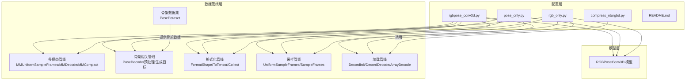
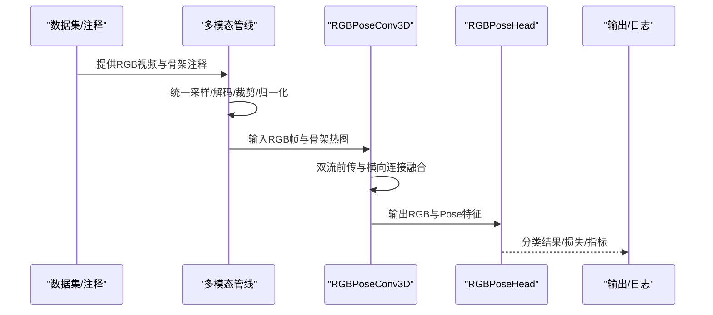
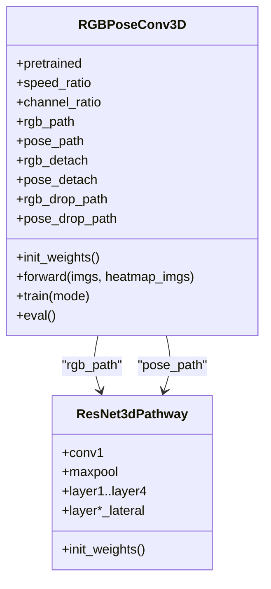
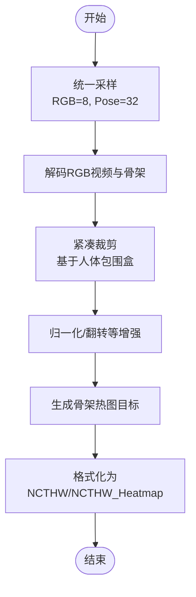
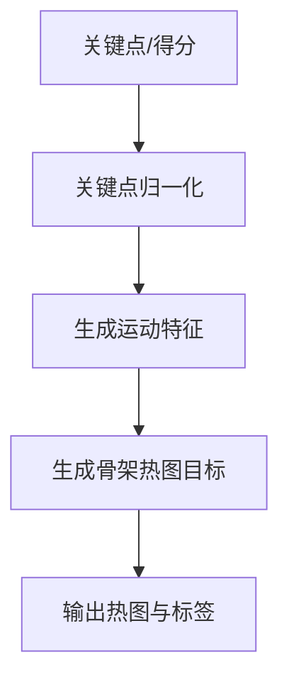
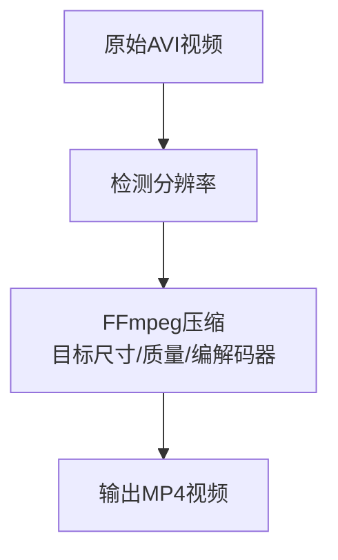
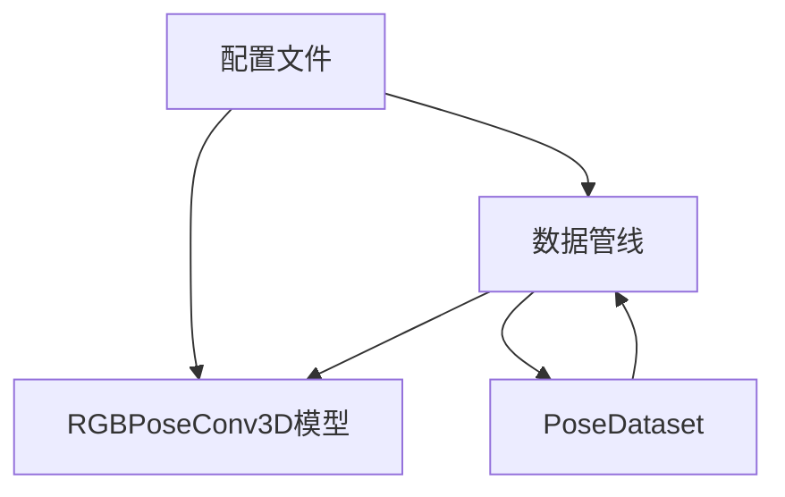

# 格式转换工具

<cite>
**本文档引用的文件**
- [rgbpose_conv3d.py](file://configs/rgbpose_conv3d/rgbpose_conv3d.py)
- [pose_only.py](file://configs/rgbpose_conv3d/pose_only.py)
- [rgb_only.py](file://configs/rgbpose_conv3d/rgb_only.py)
- [compress_nturgbd.py](file://configs/rgbpose_conv3d/compress_nturgbd.py)
- [README.md](file://configs/rgbpose_conv3d/README.md)
- [rgbposeconv3d.py](file://pyskl/models/cnns/rgbposeconv3d.py)
- [multi_modality.py](file://pyskl/datasets/pipelines/multi_modality.py)
- [pose_related.py](file://pyskl/datasets/pipelines/pose_related.py)
- [formatting.py](file://pyskl/datasets/pipelines/formatting.py)
- [sampling.py](file://pyskl/datasets/pipelines/sampling.py)
- [loading.py](file://pyskl/datasets/pipelines/loading.py)
- [pose_dataset.py](file://pyskl/datasets/pose_dataset.py)
</cite>

## 目录
1. [简介](#简介)
2. [项目结构](#项目结构)
3. [核心组件](#核心组件)
4. [架构总览](#架构总览)
5. [详细组件分析](#详细组件分析)
6. [依赖关系分析](#依赖关系分析)
7. [性能考量](#性能考量)
8. [故障排查指南](#故障排查指南)
9. [结论](#结论)
10. [附录](#附录)

## 简介
本文件面向PySKL框架中的RGBPoseConv3D格式转换与训练配置，系统性阐述以下内容：
- RGBPoseConv3D双流主干网络的实现原理与多模态融合策略
- 多模态数据（RGB视频与骨架热图）的格式标准化流程
- 不同模态的独立转换方案：纯骨架（pose_only.py）与纯RGB（rgb_only.py）
- 数据格式的内部表示与外部接口：张量形状、数据类型、存储格式
- 转换过程中的配置选项与参数设置：分辨率、帧率、压缩等
- 错误处理与数据完整性验证方法

## 项目结构
本工具位于configs/rgbpose_conv3d目录下，包含三类配置文件与一个数据压缩脚本：
- rgbpose_conv3d.py：双流RGB+Pose联合训练配置
- pose_only.py：仅骨架热图训练配置
- rgb_only.py：仅RGB视频训练配置
- compress_nturgbd.py：NTU RGB+D视频压缩脚本
- README.md：使用说明与训练流程

图表来源
- [rgbpose_conv3d.py](file://configs/rgbpose_conv3d/rgbpose_conv3d.py#L1-L107)
- [pose_only.py](file://configs/rgbpose_conv3d/pose_only.py#L1-L80)
- [rgb_only.py](file://configs/rgbpose_conv3d/rgb_only.py#L1-L75)
- [compress_nturgbd.py](file://configs/rgbpose_conv3d/compress_nturgbd.py#L1-L36)
- [rgbposeconv3d.py](file://pyskl/models/cnns/rgbposeconv3d.py#L1-L181)
- [multi_modality.py](file://pyskl/datasets/pipelines/multi_modality.py#L1-L230)
- [pose_related.py](file://pyskl/datasets/pipelines/pose_related.py#L1-L553)
- [formatting.py](file://pyskl/datasets/pipelines/formatting.py#L1-L250)
- [sampling.py](file://pyskl/datasets/pipelines/sampling.py#L1-L468)
- [loading.py](file://pyskl/datasets/pipelines/loading.py#L1-L185)
- [pose_dataset.py](file://pyskl/datasets/pose_dataset.py#L1-L107)

章节来源
- [rgbpose_conv3d.py](file://configs/rgbpose_conv3d/rgbpose_conv3d.py#L1-L107)
- [pose_only.py](file://configs/rgbpose_conv3d/pose_only.py#L1-L80)
- [rgb_only.py](file://configs/rgbpose_conv3d/rgb_only.py#L1-L75)
- [compress_nturgbd.py](file://configs/rgbpose_conv3d/compress_nturgbd.py#L1-L36)
- [README.md](file://configs/rgbpose_conv3d/README.md#L1-L109)

## 核心组件
- RGBPoseConv3D双流主干网络：采用SlowFast风格的双流结构，RGB为慢流（时间分辨率高），骨架为快流（时间分辨率低但通道轻量化），通过横向连接在早期进行跨模态特征融合。
- 多模态数据管线：统一采样（MMUniformSampleFrames）、解码（MMDecode）、紧凑裁剪（MMCompact）与格式化（FormatShape）。
- 骨架处理管线：骨架解码（PoseDecode）、关键点归一化（PreNormalize2D/PreNormalize3D）、运动特征（ToMotion）、生成目标（GeneratePoseTarget）等。
- 训练配置：分别提供RGB-only、Pose-only与RGB+Pose联合训练的完整流水线与优化器设置。

章节来源
- [rgbposeconv3d.py](file://pyskl/models/cnns/rgbposeconv3d.py#L1-L181)
- [multi_modality.py](file://pyskl/datasets/pipelines/multi_modality.py#L1-L230)
- [pose_related.py](file://pyskl/datasets/pipelines/pose_related.py#L1-L553)
- [formatting.py](file://pyskl/datasets/pipelines/formatting.py#L1-L250)
- [rgbpose_conv3d.py](file://configs/rgbpose_conv3d/rgbpose_conv3d.py#L1-L107)

## 架构总览
RGBPoseConv3D的训练流程由配置驱动，数据从视频与骨架注释加载，经多模态管线处理后进入模型前传，最终输出融合特征供分类头使用。

图表来源
- [rgbpose_conv3d.py](file://configs/rgbpose_conv3d/rgbpose_conv3d.py#L40-L107)
- [rgbposeconv3d.py](file://pyskl/models/cnns/rgbposeconv3d.py#L102-L171)
- [multi_modality.py](file://pyskl/datasets/pipelines/multi_modality.py#L58-L129)
- [formatting.py](file://pyskl/datasets/pipelines/formatting.py#L160-L244)

## 详细组件分析

### RGBPoseConv3D双流主干网络
- 结构要点
  - RGB路径（慢流）：标准ResNet3d阶段，时间维度分辨率更高，通道数较大
  - 姿态路径（快流）：轻量化阶段，时间分辨率较低，通道数较小
  - 横向连接：在特定阶段引入跨流特征融合，支持正向/反向融合与可选的特征分离
- 前向流程
  - 分别对RGB帧与骨架热图执行卷积与池化
  - 在指定阶段进行跨流特征拼接或融合
  - 最终输出两路特征，供头部使用

图表来源
- [rgbposeconv3d.py](file://pyskl/models/cnns/rgbposeconv3d.py#L12-L181)

章节来源
- [rgbposeconv3d.py](file://pyskl/models/cnns/rgbposeconv3d.py#L12-L181)

### 多模态数据管线（统一采样、解码与格式化）
- 统一采样（MMUniformSampleFrames）
  - 支持按模态分别指定clip长度，如RGB=8、Pose=32
  - 训练/测试模式下采用不同的采样策略
- 解码（MMDecode）
  - 分别处理RGB视频与骨架注释，确保关键点与图像尺寸一致
- 紧凑裁剪（MMCompact）
  - 基于人体包围盒进行裁剪与填充，保证输入尺寸一致性
- 格式化（FormatShape）
  - 将数据转换为NCTHW或NCTHW_Heatmap等格式，便于后续网络处理

图表来源
- [rgbpose_conv3d.py](file://configs/rgbpose_conv3d/rgbpose_conv3d.py#L50-L85)
- [multi_modality.py](file://pyskl/datasets/pipelines/multi_modality.py#L58-L129)
- [formatting.py](file://pyskl/datasets/pipelines/formatting.py#L160-L244)

章节来源
- [multi_modality.py](file://pyskl/datasets/pipelines/multi_modality.py#L58-L129)
- [formatting.py](file://pyskl/datasets/pipelines/formatting.py#L160-L244)
- [rgbpose_conv3d.py](file://configs/rgbpose_conv3d/rgbpose_conv3d.py#L50-L85)

### 骨架处理管线（关键点预处理与目标生成）
- 骨架解码（PoseDecode）
  - 按帧索引提取关键点与得分
- 预处理（PreNormalize2D/PreNormalize3D）
  - 归一化到[-1,1]或基于包围盒中心缩放
- 运动特征（ToMotion）
  - 计算相邻帧差分作为运动表征
- 目标生成（GeneratePoseTarget）
  - 基于关键点生成伪热图目标，支持sigma、scaling等参数

图表来源
- [pose_related.py](file://pyskl/datasets/pipelines/pose_related.py#L12-L49)
- [pose_related.py](file://pyskl/datasets/pipelines/pose_related.py#L52-L96)
- [pose_related.py](file://pyskl/datasets/pipelines/pose_related.py#L335-L356)
- [rgbpose_conv3d.py](file://configs/rgbpose_conv3d/rgbpose_conv3d.py#L58-L58)

章节来源
- [pose_related.py](file://pyskl/datasets/pipelines/pose_related.py#L12-L49)
- [pose_related.py](file://pyskl/datasets/pipelines/pose_related.py#L52-L96)
- [pose_related.py](file://pyskl/datasets/pipelines/pose_related.py#L335-L356)
- [rgbpose_conv3d.py](file://configs/rgbpose_conv3d/rgbpose_conv3d.py#L58-L58)

### 纯骨架（pose_only.py）与纯RGB（rgb_only.py）转换
- 纯骨架（pose_only.py）
  - 使用SlowOnly骨干网，输入为骨架热图（NCTHW_Heatmap）
  - 采样长度32帧，空间尺寸64x64，翻转增强，生成关键点热图目标
- 纯RGB（rgb_only.py）
  - 使用SlowOnly骨干网，输入为RGB视频（NCTHW）
  - 采样长度8帧，先resize至256x256再随机裁剪至224x224，归一化

章节来源
- [pose_only.py](file://configs/rgbpose_conv3d/pose_only.py#L1-L80)
- [rgb_only.py](file://configs/rgbpose_conv3d/rgb_only.py#L1-L75)

### 视频压缩与数据准备（compress_nturgbd.py）
- 功能概述
  - 批量将NTU RGB+D原始AVI视频压缩为MP4，目标尺寸960x540
  - 使用FFmpeg进行编码，支持线程控制与质量参数
- 使用流程
  - 下载NTU RGB+D视频至指定目录
  - 运行脚本进行批量压缩
  - 生成的MP4放置于目标目录，供训练配置读取

图表来源
- [compress_nturgbd.py](file://configs/rgbpose_conv3d/compress_nturgbd.py#L8-L36)

章节来源
- [compress_nturgbd.py](file://configs/rgbpose_conv3d/compress_nturgbd.py#L1-L36)
- [README.md](file://configs/rgbpose_conv3d/README.md#L26-L38)

## 依赖关系分析
- 配置文件依赖模型与数据管线模块
- 数据集PoseDataset负责加载骨架注释（pkl），提供给骨架管线处理
- 多模态管线与格式化管线贯穿训练全流程，确保张量形状与数据类型一致

图表来源
- [rgbpose_conv3d.py](file://configs/rgbpose_conv3d/rgbpose_conv3d.py#L1-L107)
- [pose_dataset.py](file://pyskl/datasets/pose_dataset.py#L10-L107)
- [rgbposeconv3d.py](file://pyskl/models/cnns/rgbposeconv3d.py#L1-L181)

章节来源
- [rgbpose_conv3d.py](file://configs/rgbpose_conv3d/rgbpose_conv3d.py#L1-L107)
- [pose_dataset.py](file://pyskl/datasets/pose_dataset.py#L10-L107)

## 性能考量
- 帧采样策略
  - RGB=8帧、Pose=32帧的设计使RGB慢流与骨架快流在时间分辨率上形成互补
- 空间分辨率
  - RGB训练阶段先resize至256x256再随机裁剪至224x224，骨架热图通常为64x64或更小
- 并行与批处理
  - 训练配置中设置每GPU视频数与工作进程数，以平衡吞吐与显存占用
- 测试加速
  - 可将测试阶段的num_clips从10降为1以减少推理时间，代价是精度略有下降

章节来源
- [rgbpose_conv3d.py](file://configs/rgbpose_conv3d/rgbpose_conv3d.py#L50-L85)
- [pose_only.py](file://configs/rgbpose_conv3d/pose_only.py#L26-L58)
- [rgb_only.py](file://configs/rgbpose_conv3d/rgb_only.py#L21-L53)
- [README.md](file://configs/rgbpose_conv3d/README.md#L81-L95)

## 故障排查指南
- 视频解码失败
  - 确认已安装Decord并正确配置io_backend；检查视频路径与扩展名
- 关键点与图像尺寸不匹配
  - 解码后会自动缩放关键点坐标以适配实际图像尺寸，若仍异常需检查裁剪与resize步骤
- 形状不一致导致报错
  - 确保FormatShape的input_format与模型期望一致（NCTHW或NCTHW_Heatmap）
- 数据完整性校验
  - PoseDataset支持按box_thr与valid_ratio过滤样本，确保有效帧比例满足要求
- 多GPU学习率缩放
  - 若更改batch size，请按线性缩放规则同步调整初始学习率

章节来源
- [loading.py](file://pyskl/datasets/pipelines/loading.py#L10-L73)
- [multi_modality.py](file://pyskl/datasets/pipelines/multi_modality.py#L90-L129)
- [formatting.py](file://pyskl/datasets/pipelines/formatting.py#L160-L244)
- [pose_dataset.py](file://pyskl/datasets/pose_dataset.py#L66-L84)
- [README.md](file://configs/rgbpose_conv3d/README.md#L77-L80)

## 结论
RGBPoseConv3D通过双流结构与早期跨模态融合，在NTU RGB+D等数据集上实现了优于晚融合基线的识别性能。配置文件提供了RGB-only、Pose-only与联合训练的完整流水线，配合多模态数据管线与骨架处理管线，能够稳定地完成从原始视频与骨架注释到网络输入的格式转换与标准化。实践中应关注帧采样、分辨率与批处理规模的平衡，并根据测试需求选择合适的多裁剪策略以权衡速度与精度。

## 附录

### 数据格式与张量形状
- RGB视频（NCTHW）
  - N：裁剪数量×裁剪次数，C：通道（RGB），T：时间步长（如8），H/W：空间尺寸（如224）
- 骨架热图（NCTHW_Heatmap）
  - N：裁剪数量×裁剪次数，C：关节数（如17），T：时间步长（如32），H/W：空间尺寸（如64）
- 关键点数组（MTCV）
  - M：人数，T：帧数，V：关节数，C：坐标维数（2或3）

章节来源
- [formatting.py](file://pyskl/datasets/pipelines/formatting.py#L160-L244)
- [pose_related.py](file://pyskl/datasets/pipelines/pose_related.py#L427-L467)

### 配置选项与参数设置
- 帧采样
  - RGB=8帧、Pose=32帧，支持多裁剪（测试时可设为10）
- 分辨率与裁剪
  - RGB：先resize至256x256，再随机裁剪至224x224
  - 骨架：resize至64x64或56x56
- 归一化
  - RGB：按均值与方差归一化，to_bgr=False
- 翻转与增强
  - RGB：随机水平翻转
  - 骨架：按左右关节点映射进行翻转
- 目标生成
  - 骨架热图：sigma、use_score、with_kp、with_limb、scaling等参数

章节来源
- [rgbpose_conv3d.py](file://configs/rgbpose_conv3d/rgbpose_conv3d.py#L48-L85)
- [pose_only.py](file://configs/rgbpose_conv3d/pose_only.py#L26-L58)
- [rgb_only.py](file://configs/rgbpose_conv3d/rgb_only.py#L19-L53)