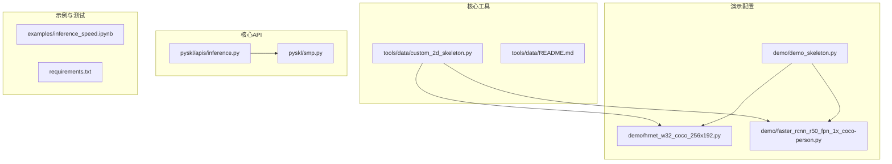
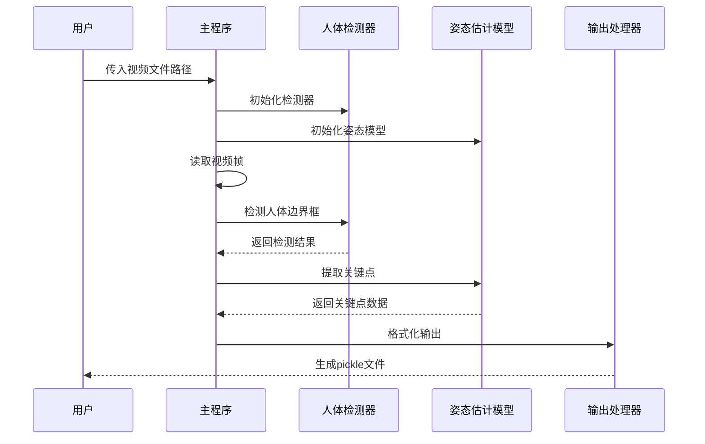
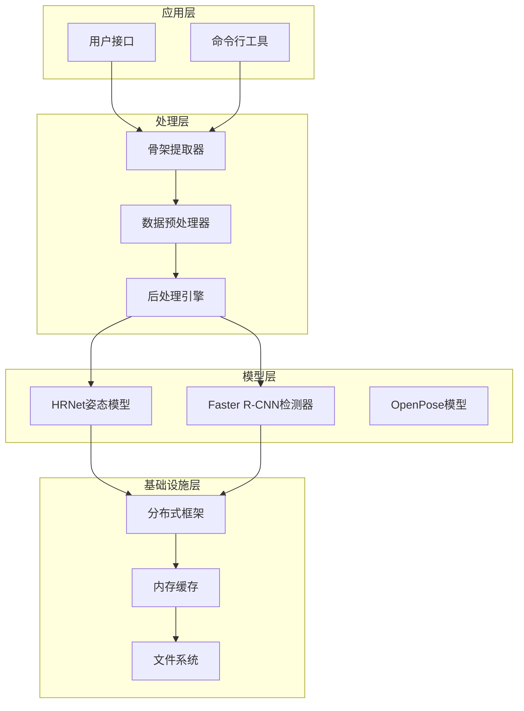
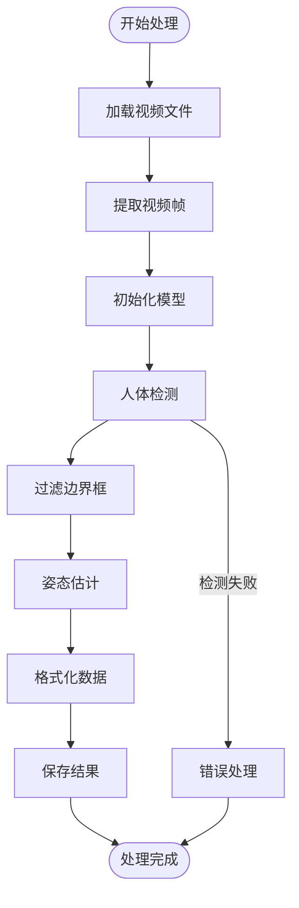
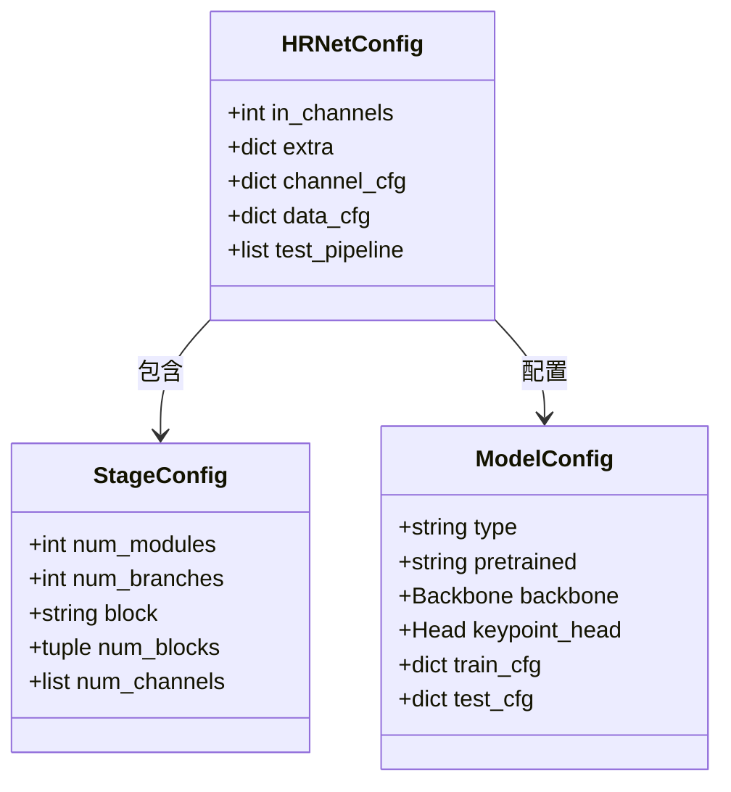
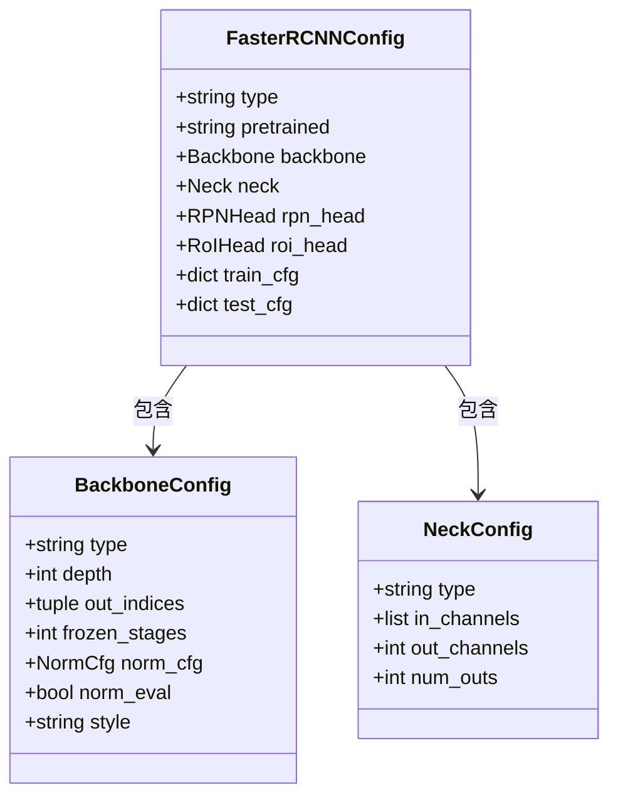
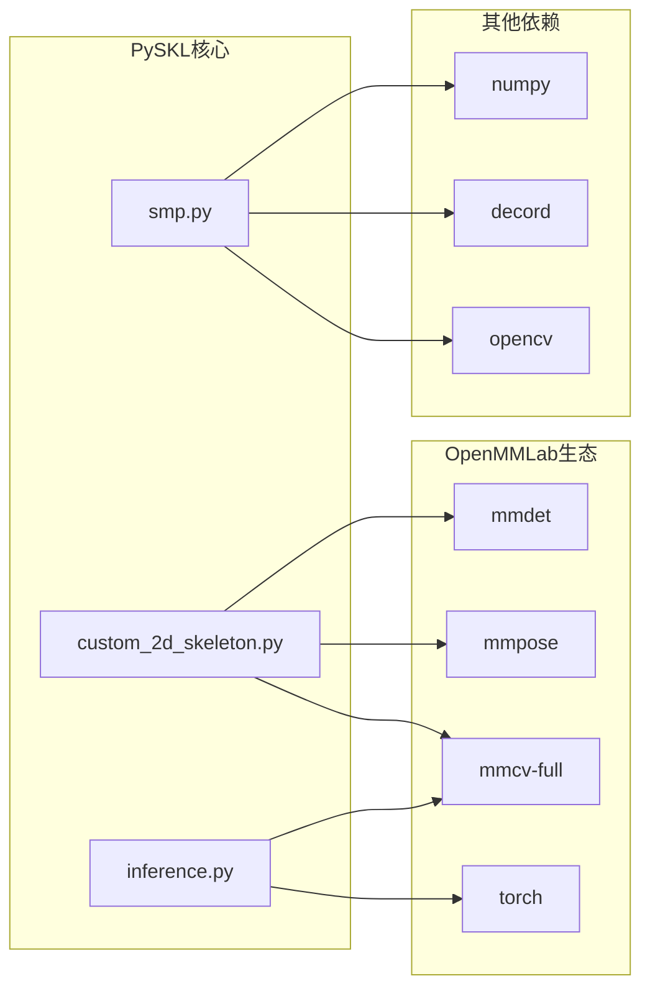
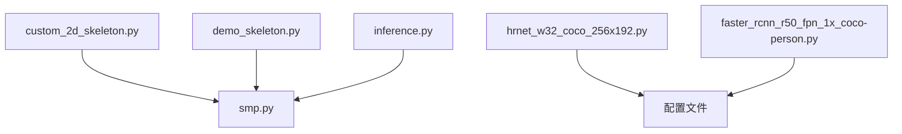
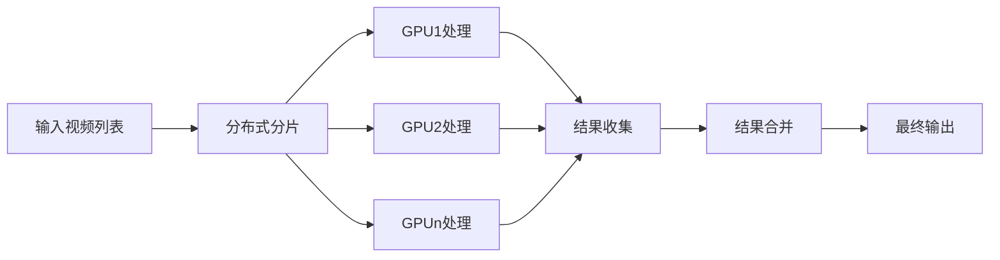

# 骨架提取工具

<cite>
**本文档引用的文件**
- [custom_2d_skeleton.py](file://tools/data/custom_2d_skeleton.py)
- [hrnet_w32_coco_256x192.py](file://demo/hrnet_w32_coco_256x192.py)
- [faster_rcnn_r50_fpn_1x_coco-person.py](file://demo/faster_rcnn_r50_fpn_1x_coco-person.py)
- [demo_skeleton.py](file://demo/demo_skeleton.py)
- [inference.py](file://pyskl/apis/inference.py)
- [smp.py](file://pyskl/smp.py)
- [README.md](file://tools/data/README.md)
- [requirements.txt](file://requirements.txt)
- [inference_speed.ipynb](file://examples/inference_speed.ipynb)
</cite>

## 目录
1. [简介](#简介)
2. [项目结构](#项目结构)
3. [核心组件](#核心组件)
4. [架构概览](#架构概览)
5. [详细组件分析](#详细组件分析)
6. [依赖关系分析](#依赖关系分析)
7. [性能考虑](#性能考虑)
8. [故障排除指南](#故障排除指南)
9. [结论](#结论)

## 简介

PySKL是一个基于OpenMMLab生态系统的骨架提取工具，专门用于从视频中提取2D人体骨架数据。该工具集成了HRNet姿态估计算法和Faster R-CNN人体检测器，提供了完整的骨架提取流水线，支持分布式处理和批量数据处理。

该工具的核心价值在于：
- 提供端到端的骨架提取解决方案
- 支持多种姿态估计模型和检测器
- 实现高效的分布式处理能力
- 标准化的骨架数据格式输出

## 项目结构

PySKL项目采用模块化设计，主要包含以下核心目录：



**图表来源**
- [custom_2d_skeleton.py](file://tools/data/custom_2d_skeleton.py#L1-L194)
- [hrnet_w32_coco_256x192.py](file://demo/hrnet_w32_coco_256x192.py#L1-L134)
- [faster_rcnn_r50_fpn_1x_coco-person.py](file://demo/faster_rcnn_r50_fpn_1x_coco-person.py#L1-L164)

**章节来源**
- [custom_2d_skeleton.py](file://tools/data/custom_2d_skeleton.py#L1-L50)
- [requirements.txt](file://requirements.txt#L1-L14)

## 核心组件

### 主要组件概述

PySKL骨架提取工具由以下几个核心组件构成：

1. **骨架提取主程序** - 处理视频输入并生成骨架数据
2. **姿态估计模型** - 基于HRNet的人体关键点检测
3. **人体检测器** - 基于Faster R-CNN的人体目标检测
4. **数据格式处理器** - 标准化骨架数据输出格式
5. **分布式处理引擎** - 支持多GPU并行处理

### 组件交互流程



**图表来源**
- [custom_2d_skeleton.py](file://tools/data/custom_2d_skeleton.py#L122-L194)
- [demo_skeleton.py](file://demo/demo_skeleton.py#L227-L314)

**章节来源**
- [custom_2d_skeleton.py](file://tools/data/custom_2d_skeleton.py#L88-L120)
- [demo_skeleton.py](file://demo/demo_skeleton.py#L58-L104)

## 架构概览

### 整体架构设计

PySKL采用分层架构设计，确保了良好的可扩展性和维护性：



**图表来源**
- [custom_2d_skeleton.py](file://tools/data/custom_2d_skeleton.py#L1-L194)
- [inference.py](file://pyskl/apis/inference.py#L1-L184)

### 数据流架构

骨架提取的数据流遵循严格的处理顺序：

1. **输入处理** - 视频解码和帧提取
2. **检测阶段** - 人体边界框检测
3. **姿态估计** - 关键点坐标预测
4. **数据标准化** - 格式转换和存储
5. **输出管理** - 分布式结果合并

**章节来源**
- [custom_2d_skeleton.py](file://tools/data/custom_2d_skeleton.py#L43-L85)
- [demo_skeleton.py](file://demo/demo_skeleton.py#L107-L180)

## 详细组件分析

### 2D骨架提取器

#### 核心算法实现

骨架提取器是整个系统的核心组件，负责协调各个子模块的工作：



**图表来源**
- [custom_2d_skeleton.py](file://tools/data/custom_2d_skeleton.py#L122-L194)

#### 关键点检测机制

骨架提取器实现了多层次的关键点检测机制：

1. **边界框过滤** - 基于置信度阈值和面积阈值过滤
2. **姿态估计** - 使用HRNet模型进行关键点预测
3. **数据压缩** - 支持K400风格的数据压缩模式
4. **结果验证** - 确保数据格式的一致性和完整性

**章节来源**
- [custom_2d_skeleton.py](file://tools/data/custom_2d_skeleton.py#L151-L170)

### HRNet姿态估计算法

#### 模型架构配置

HRNet作为当前最先进的姿态估计算法之一，在PySKL中得到了完整集成：



**图表来源**
- [hrnet_w32_coco_256x192.py](file://demo/hrnet_w32_coco_256x192.py#L41-L86)

#### 训练和推理配置

HRNet模型在训练和推理阶段具有不同的配置策略：

| 配置项 | 训练阶段 | 推理阶段 | 默认值 |
|--------|----------|----------|--------|
| 学习率 | 5e-4 | 自动推断 | 5e-4 |
| 总轮数 | 210 | 固定 | 210 |
| 图像尺寸 | [256, 192] | [256, 192] | [256, 192] |
| 关键点数量 | 17 | 17 | 17 |
| 网络深度 | 32 | 32 | 32 |

**章节来源**
- [hrnet_w32_coco_256x192.py](file://demo/hrnet_w32_coco_256x192.py#L88-L103)

### 人体检测器

#### Faster R-CNN架构

人体检测器基于Faster R-CNN算法，专门针对人体检测进行了优化：



**图表来源**
- [faster_rcnn_r50_fpn_1x_coco-person.py](file://demo/faster_rcnn_r50_fpn_1x_coco-person.py#L2-L55)

#### 检测参数配置

人体检测器的关键参数配置如下：

| 参数 | 值 | 说明 |
|------|-----|------|
| 预训练权重 | torchvision://resnet50 | ResNet50骨干网络 |
| 锚框比例 | [0.5, 1.0, 2.0] | 不同尺度的锚框 |
| 锚框尺度 | [8] | 基础锚框大小 |
| ROI池化 | RoIAlign | 精确的区域对齐 |
| 分类数量 | 1 | 仅检测人体类别 |

**章节来源**
- [faster_rcnn_r50_fpn_1x_coco-person.py](file://demo/faster_rcnn_r50_fpn_1x_coco-person.py#L19-L55)

### 数据格式标准化

#### 骨架数据结构

PySKL实现了标准化的骨架数据格式，确保不同来源的数据能够统一处理：

```mermaid
erDiagram
SKELETON_ANNOTATION {
string frame_dir
int total_frames
tuple img_shape
tuple original_shape
int label
array keypoint
array keypoint_score
string modality
int start_index
}
KEYPOINT_ARRAY {
int M [persons]
int T [frames]
int V [keypoints]
int C [dimensions]
}
SCORE_ARRAY {
int M [persons]
int T [frames]
int V [keypoints]
}
SKELETON_ANNOTATION ||--|| KEYPOINT_ARRAY : "包含"
SKELETON_ANNOTATION ||--|| SCORE_ARRAY : "包含"
```

**图表来源**
- [README.md](file://tools/data/README.md#L10-L17)

#### 数据类型定义

| 字段名 | 数据类型 | 描述 | 必需性 |
|--------|----------|------|--------|
| frame_dir | string | 视频标识符 | 是 |
| total_frames | int | 总帧数 | 是 |
| img_shape | tuple[int] | 图像尺寸 | 2D骨架必需 |
| original_shape | tuple[int] | 原始图像尺寸 | 2D骨架必需 |
| label | int | 动作标签 | 可选 |
| keypoint | ndarray[M,T,V,C] | 关键点坐标 | 是 |
| keypoint_score | ndarray[M,T,V] | 关键点置信度 | 2D骨架必需 |
| modality | string | 模态类型 | 是 |
| start_index | int | 起始索引 | 是 |

**章节来源**
- [README.md](file://tools/data/README.md#L10-L17)

## 依赖关系分析

### 外部依赖关系

PySKL项目依赖于多个OpenMMLab生态系统中的核心组件：



**图表来源**
- [requirements.txt](file://requirements.txt#L1-L14)
- [custom_2d_skeleton.py](file://tools/data/custom_2d_skeleton.py#L1-L30)

### 内部模块依赖

项目内部模块之间的依赖关系相对简单，主要通过公共工具函数进行交互：



**图表来源**
- [custom_2d_skeleton.py](file://tools/data/custom_2d_skeleton.py#L13-L32)
- [demo_skeleton.py](file://demo/demo_skeleton.py#L13-L43)

**章节来源**
- [requirements.txt](file://requirements.txt#L1-L14)
- [smp.py](file://pyskl/smp.py#L1-L30)

## 性能考虑

### 分布式处理优化

PySKL实现了高效的分布式处理机制，支持多GPU并行处理：



**图表来源**
- [custom_2d_skeleton.py](file://tools/data/custom_2d_skeleton.py#L136-L190)

### 批量处理策略

系统支持多种批量处理模式以适应不同的硬件配置：

| 处理模式 | GPU数量 | 内存占用 | 处理速度 | 适用场景 |
|----------|---------|----------|----------|----------|
| 单GPU模式 | 1 | 低 | 中等 | 个人开发环境 |
| 多GPU模式 | 2-4 | 中等 | 高 | 生产环境 |
| 分布式模式 | 8+ | 高 | 最高 | 大规模数据处理 |

### 性能基准测试

根据官方提供的性能测试结果：

| 设备/配置 | FPS | 处理速度 | 内存使用 |
|-----------|-----|----------|----------|
| 2080Ti (Linux) | 41 | 优秀 | 中等 |
| 3060 (Windows) | 38 | 良好 | 低 |
| CPU (11800H) | 2.9 | 一般 | 低 |

**章节来源**
- [inference_speed.ipynb](file://examples/inference_speed.ipynb#L70-L75)

## 故障排除指南

### 常见问题及解决方案

#### 模块导入错误

**问题描述**：无法导入mmdet或mmpose模块

**解决方案**：
1. 确认已正确安装OpenMMLab生态系统
2. 检查Python路径配置
3. 验证CUDA版本兼容性

#### 内存不足错误

**问题描述**：处理大型视频时出现内存溢出

**解决方案**：
1. 减少批处理大小
2. 启用数据压缩模式
3. 使用分布式处理模式
4. 增加系统内存

#### 模型加载失败

**问题描述**：姿态估计模型无法加载

**解决方案**：
1. 检查模型权重文件完整性
2. 验证PyTorch版本兼容性
3. 确认GPU驱动正常

**章节来源**
- [custom_2d_skeleton.py](file://tools/data/custom_2d_skeleton.py#L16-L30)
- [demo_skeleton.py](file://demo/demo_skeleton.py#L15-L43)

### 调试技巧

1. **日志记录**：启用详细的日志输出以跟踪处理进度
2. **中间结果检查**：定期保存中间处理结果进行验证
3. **性能监控**：使用系统监控工具跟踪资源使用情况
4. **错误重试**：实现自动重试机制处理临时性错误

## 结论

PySKL骨架提取工具是一个功能完整、架构清晰的计算机视觉处理系统。它成功地整合了HRNet姿态估计算法和Faster R-CNN人体检测器，提供了从视频到骨架数据的完整解决方案。

### 主要优势

1. **模块化设计** - 清晰的组件分离便于维护和扩展
2. **分布式支持** - 高效的多GPU并行处理能力
3. **标准化输出** - 统一的数据格式确保与其他系统的兼容性
4. **性能优化** - 针对大规模数据处理的优化策略

### 应用前景

该工具适用于以下应用场景：
- 行为识别和动作分析
- 体育运动技术分析
- 医疗康复评估
- 人机交互研究
- 娱乐内容制作

通过持续的优化和扩展，PySKL有望成为骨架提取领域的标准工具之一。