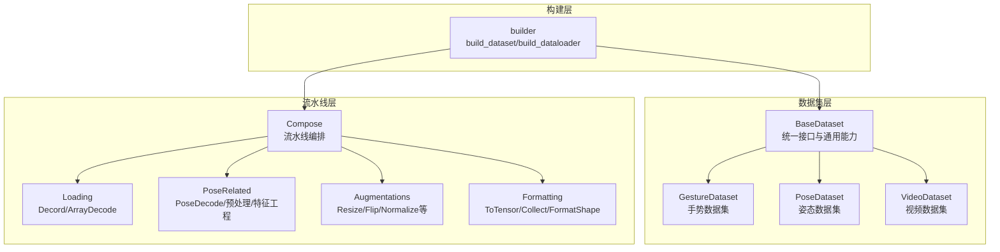
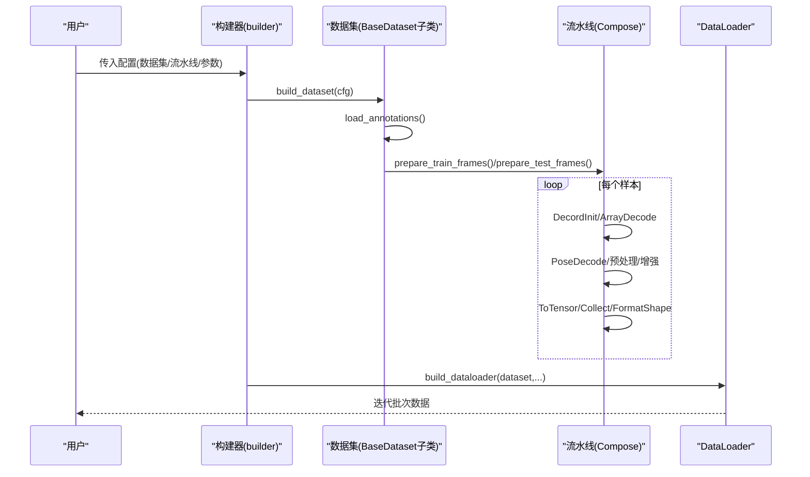
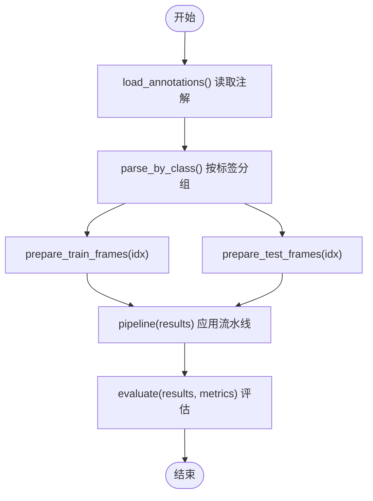
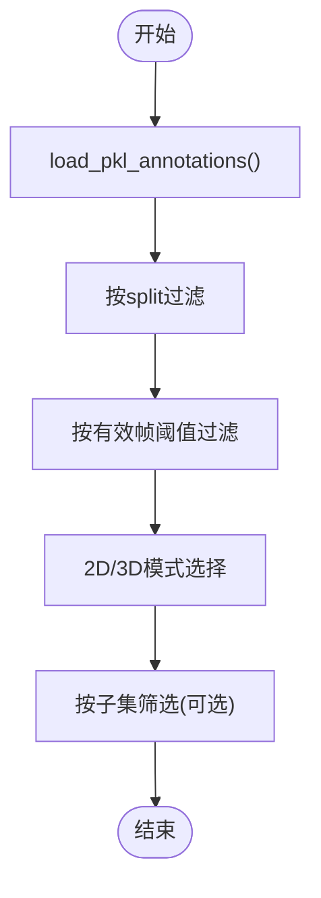
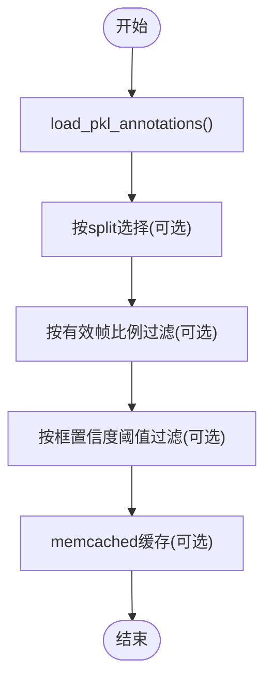
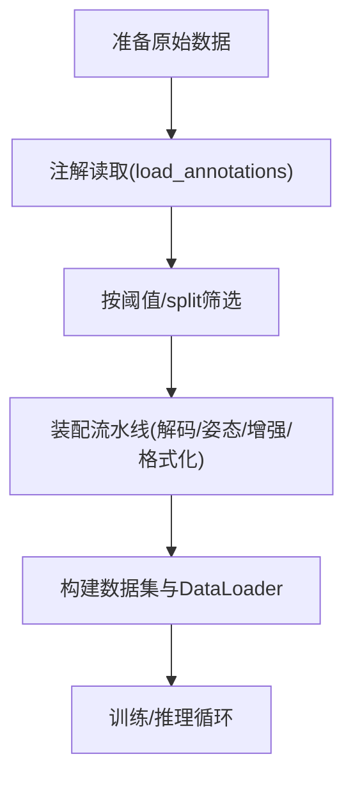
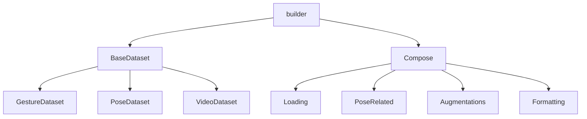

# 数据处理系统

<cite>
**本文引用的文件**
- [pyskl/datasets/base.py](file://pyskl/datasets/base.py)
- [pyskl/datasets/gesture_dataset.py](file://pyskl/datasets/gesture_dataset.py)
- [pyskl/datasets/pose_dataset.py](file://pyskl/datasets/pose_dataset.py)
- [pyskl/datasets/video_dataset.py](file://pyskl/datasets/video_dataset.py)
- [pyskl/datasets/builder.py](file://pyskl/datasets/builder.py)
- [pyskl/datasets/pipelines/compose.py](file://pyskl/datasets/pipelines/compose.py)
- [pyskl/datasets/pipelines/loading.py](file://pyskl/datasets/pipelines/loading.py)
- [pyskl/datasets/pipelines/formatting.py](file://pyskl/datasets/pipelines/formatting.py)
- [pyskl/datasets/pipelines/augmentations.py](file://pyskl/datasets/pipelines/augmentations.py)
- [pyskl/datasets/pipelines/pose_related.py](file://pyskl/datasets/pipelines/pose_related.py)
- [pyskl/utils/visualize.py](file://pyskl/utils/visualize.py)
- [pyskl/utils/misc.py](file://pyskl/utils/misc.py)
- [demo/demo_skeleton.py](file://demo/demo_skeleton.py)
- [demo/demo_gesture.py](file://demo/demo_gesture.py)
</cite>

## 目录
1. [简介](#简介)
2. [项目结构](#项目结构)
3. [核心组件](#核心组件)
4. [架构总览](#架构总览)
5. [详细组件分析](#详细组件分析)
6. [依赖关系分析](#依赖关系分析)
7. [性能考虑](#性能考虑)
8. [故障排查指南](#故障排查指南)
9. [结论](#结论)
10. [附录](#附录)

## 简介
本文件面向PySKL数据处理系统，系统性阐述数据集基类的设计理念与接口规范，覆盖数据加载、预处理、增强与格式化的统一流程；详解三类数据集（手势数据集、姿态数据集、视频数据集）的特性与适用场景；给出数据预处理流水线设计、数据构建全流程、数据格式规范、质量检查与异常处理策略，并提供可视化工具使用指南与性能优化建议。

## 项目结构
PySKL采用“数据集基类 + 多数据集子类 + 预处理流水线 + 构建器”的分层架构：
- 数据集层：统一抽象基类定义接口与通用能力，具体数据集子类实现注解读取与筛选逻辑。
- 流水线层：由可插拔的变换组成，涵盖加载、解码、归一化、格式化、增强等。
- 构建层：注册表与构建器负责实例化数据集与DataLoader，支持分布式采样与批处理。
- 工具层：可视化与缓存工具辅助调试与性能优化。

图示来源
- [pyskl/datasets/base.py](file://pyskl/datasets/base.py#L19-L354)
- [pyskl/datasets/gesture_dataset.py](file://pyskl/datasets/gesture_dataset.py#L14-L156)
- [pyskl/datasets/pose_dataset.py](file://pyskl/datasets/pose_dataset.py#L11-L107)
- [pyskl/datasets/video_dataset.py](file://pyskl/datasets/video_dataset.py#L9-L61)
- [pyskl/datasets/pipelines/compose.py](file://pyskl/datasets/pipelines/compose.py#L9-L53)
- [pyskl/datasets/pipelines/loading.py](file://pyskl/datasets/pipelines/loading.py#L11-L185)
- [pyskl/datasets/pipelines/pose_related.py](file://pyskl/datasets/pipelines/pose_related.py#L13-L553)
- [pyskl/datasets/pipelines/augmentations.py](file://pyskl/datasets/pipelines/augmentations.py#L12-L902)
- [pyskl/datasets/pipelines/formatting.py](file://pyskl/datasets/pipelines/formatting.py#L31-L250)
- [pyskl/datasets/builder.py](file://pyskl/datasets/builder.py#L31-L134)

章节来源
- [pyskl/datasets/base.py](file://pyskl/datasets/base.py#L19-L354)
- [pyskl/datasets/builder.py](file://pyskl/datasets/builder.py#L31-L134)

## 核心组件
- 数据集基类（BaseDataset）
  - 统一接口：注解读取、训练/测试样本准备、评估与结果导出。
  - 通用能力：JSON注解读取、按类别分组、多模态标签编码、memcached缓存支持。
  - 评估指标：Top-K准确率、平均类别准确率、mAP。
- 数据集子类
  - GestureDataset：手势数据集，支持阈值过滤、2D/3D模式切换、子集筛选。
  - PoseDataset：姿态数据集，支持有效帧比例与框置信度阈值过滤、memcached缓存。
  - VideoDataset：视频数据集，支持文本注解文件解析。
- 流水线（Compose）
  - 将一系列变换按序执行，支持字典配置与可调用对象混用。
- 构建器（builder）
  - 注册表管理数据集与流水线，构建DataLoader并支持分布式采样。

章节来源
- [pyskl/datasets/base.py](file://pyskl/datasets/base.py#L19-L354)
- [pyskl/datasets/gesture_dataset.py](file://pyskl/datasets/gesture_dataset.py#L14-L156)
- [pyskl/datasets/pose_dataset.py](file://pyskl/datasets/pose_dataset.py#L11-L107)
- [pyskl/datasets/video_dataset.py](file://pyskl/datasets/video_dataset.py#L9-L61)
- [pyskl/datasets/pipelines/compose.py](file://pyskl/datasets/pipelines/compose.py#L9-L53)
- [pyskl/datasets/builder.py](file://pyskl/datasets/builder.py#L31-L134)

## 架构总览
数据从注解文件进入，经由数据集子类加载与筛选，再通过流水线进行解码、增强与格式化，最终由构建器组装为DataLoader供训练/推理使用。

图示来源
- [pyskl/datasets/builder.py](file://pyskl/datasets/builder.py#L31-L134)
- [pyskl/datasets/base.py](file://pyskl/datasets/base.py#L262-L354)
- [pyskl/datasets/pipelines/compose.py](file://pyskl/datasets/pipelines/compose.py#L30-L44)
- [pyskl/datasets/pipelines/loading.py](file://pyskl/datasets/pipelines/loading.py#L47-L137)
- [pyskl/datasets/pipelines/pose_related.py](file://pyskl/datasets/pipelines/pose_related.py#L28-L49)
- [pyskl/datasets/pipelines/augmentations.py](file://pyskl/datasets/pipelines/augmentations.py#L12-L902)
- [pyskl/datasets/pipelines/formatting.py](file://pyskl/datasets/pipelines/formatting.py#L132-L244)

## 详细组件分析

### 数据集基类（BaseDataset）
- 设计要点
  - 抽象工厂：子类需实现注解读取与样本准备。
  - 评估统一：支持多种指标与多模态/多模型输出聚合。
  - 缓存适配：对特定数据集（如姿态）支持memcached缓存。
- 关键流程
  - 注解读取：支持JSON与自定义格式。
  - 样本准备：复制样本、标签编码、流水线执行。
  - 评估：支持单/多模型、多模态结果聚合与自动混合。

图示来源
- [pyskl/datasets/base.py](file://pyskl/datasets/base.py#L75-L354)

章节来源
- [pyskl/datasets/base.py](file://pyskl/datasets/base.py#L19-L354)

### 手势数据集（GestureDataset）
- 特点
  - 输入为压缩或非压缩姿态序列，支持2D/3D模式。
  - 支持按有效帧数阈值过滤与按子集筛选。
  - 自定义评估：Top-1/Top-5与分段统计。
- 关键流程
  - 注解读取：从pkl中提取annotations与split。
  - 数据清洗：按split过滤、按有效帧阈值过滤、2D/3D裁剪。
  - 评估：按类别与有效帧区间输出统计。

图示来源
- [pyskl/datasets/gesture_dataset.py](file://pyskl/datasets/gesture_dataset.py#L58-L103)

章节来源
- [pyskl/datasets/gesture_dataset.py](file://pyskl/datasets/gesture_dataset.py#L14-L156)

### 姿态数据集（PoseDataset）
- 特点
  - 面向多人/单人姿态序列，支持有效帧比例与框置信度阈值过滤。
  - 支持memcached缓存，提升大规模姿态数据读取效率。
- 关键流程
  - 注解读取：从pkl中读取annotations与split。
  - 过滤：按有效帧比例与框置信度阈值筛选。
  - 缓存：将关键帧或整段数据写入memcached。

图示来源
- [pyskl/datasets/pose_dataset.py](file://pyskl/datasets/pose_dataset.py#L86-L107)

章节来源
- [pyskl/datasets/pose_dataset.py](file://pyskl/datasets/pose_dataset.py#L11-L107)

### 视频数据集（VideoDataset）
- 特点
  - 支持文本注解文件（每行文件路径与标签），也支持JSON注解。
  - 适用于直接输入视频而非解码后的帧数组。
- 关键流程
  - 注解读取：文本或JSON格式解析。
  - 路径拼接：基于data_prefix拼接完整路径。

章节来源
- [pyskl/datasets/video_dataset.py](file://pyskl/datasets/video_dataset.py#L42-L61)

### 数据预处理流水线
- 组成
  - 加载与解码：DecordInit/DecordDecode、ArrayDecode。
  - 姿态相关：PoseDecode、预处理（2D/3D）、特征工程（关节转骨骼、运动场等）。
  - 增强：Resize、RandomCrop、RandomResizedCrop、CenterCrop、Flip、Normalize等。
  - 格式化：ToTensor、Rename、Collect、FormatShape。
- 执行顺序
  - 解码 → 姿态处理 → 增强 → 格式化 → 收集。

```mermaid
classDiagram
class Compose {
+__init__(transforms)
+__call__(data) dict
+__repr__() str
}
class DecordInit {
+__call__(results) dict
}
class DecordDecode {
+__call__(results) dict
}
class ArrayDecode {
+__call__(results) dict
}
class PoseDecode {
+__call__(results) dict
}
class PreNormalize2D {
+__call__(results) dict
}
class RandomRot {
+__call__(results) dict
}
class RandomScale {
+__call__(results) dict
}
class RandomGaussianNoise {
+__call__(results) dict
}
class PreNormalize3D {
+__call__(results) dict
}
class JointToBone {
+__call__(results) dict
}
class ToMotion {
+__call__(results) dict
}
class MergeSkeFeat {
+__call__(results) dict
}
class PadTo {
+__call__(results) dict
}
class FormatGCNInput {
+__call__(results) dict
}
class Resize {
+__call__(results) dict
}
class RandomCrop {
+__call__(results) dict
}
class RandomResizedCrop {
+__call__(results) dict
}
class CenterCrop {
+__call__(results) dict
}
class Flip {
+__call__(results) dict
}
class Normalize {
+__call__(results) dict
}
class ToTensor {
+__call__(results) dict
}
class Rename {
+__call__(results) dict
}
class Collect {
+__call__(results) dict
}
class FormatShape {
+__call__(results) dict
}
Compose --> DecordInit
Compose --> DecordDecode
Compose --> ArrayDecode
Compose --> PoseDecode
Compose --> PreNormalize2D
Compose --> RandomRot
Compose --> RandomScale
Compose --> RandomGaussianNoise
Compose --> PreNormalize3D
Compose --> JointToBone
Compose --> ToMotion
Compose --> MergeSkeFeat
Compose --> PadTo
Compose --> FormatGCNInput
Compose --> Resize
Compose --> RandomCrop
Compose --> RandomResizedCrop
Compose --> CenterCrop
Compose --> Flip
Compose --> Normalize
Compose --> ToTensor
Compose --> Rename
Compose --> Collect
Compose --> FormatShape
```

图示来源
- [pyskl/datasets/pipelines/compose.py](file://pyskl/datasets/pipelines/compose.py#L9-L53)
- [pyskl/datasets/pipelines/loading.py](file://pyskl/datasets/pipelines/loading.py#L11-L185)
- [pyskl/datasets/pipelines/pose_related.py](file://pyskl/datasets/pipelines/pose_related.py#L13-L553)
- [pyskl/datasets/pipelines/augmentations.py](file://pyskl/datasets/pipelines/augmentations.py#L12-L902)
- [pyskl/datasets/pipelines/formatting.py](file://pyskl/datasets/pipelines/formatting.py#L31-L250)

章节来源
- [pyskl/datasets/pipelines/compose.py](file://pyskl/datasets/pipelines/compose.py#L9-L53)
- [pyskl/datasets/pipelines/loading.py](file://pyskl/datasets/pipelines/loading.py#L11-L185)
- [pyskl/datasets/pipelines/pose_related.py](file://pyskl/datasets/pipelines/pose_related.py#L13-L553)
- [pyskl/datasets/pipelines/augmentations.py](file://pyskl/datasets/pipelines/augmentations.py#L12-L902)
- [pyskl/datasets/pipelines/formatting.py](file://pyskl/datasets/pipelines/formatting.py#L31-L250)

### 数据格式规范
- 通用字段
  - filename/frame_dir：样本路径。
  - label：标签（多分类时可能为列表或one-hot）。
  - total_frames：总帧数。
  - img_shape/original_shape：图像尺寸。
  - modality：模态（RGB/Flow/Pose等）。
- 姿态数据
  - keypoint：M×T×V×C（多人×时间×关节点×坐标/分数）。
  - keypoint_score：可选，与keypoint拼接后参与后续处理。
  - body_center/num_clips等：姿态处理过程中的中间状态。
- 视频数据
  - imgs：帧列表或数组。
  - img_shape/img_norm_cfg：形状与归一化参数。
- 评估输出
  - results：模型输出列表或字典，支持多模型/多模态聚合。

章节来源
- [pyskl/datasets/base.py](file://pyskl/datasets/base.py#L112-L241)
- [pyskl/datasets/pose_dataset.py](file://pyskl/datasets/pose_dataset.py#L86-L107)
- [pyskl/datasets/pipelines/formatting.py](file://pyskl/datasets/pipelines/formatting.py#L132-L244)

### 数据质量检查与异常处理
- 有效帧过滤
  - 姿态：按有效帧比例与框置信度阈值过滤。
  - 手势：按有效帧阈值过滤。
- 缺失数据处理
  - 姿态：DecompressPose将压缩注解映射为标准张量格式，支持按帧去重与填充。
  - 姿态：FormatGCNInput确保多人数量与时间分片对齐。
- 异常数据过滤
  - 姿态：PreNormalize2D/PreNormalize3D对异常坐标进行归一化与掩蔽。
  - 增强：RandomGaussianNoise按帧/视频粒度注入噪声，提高鲁棒性。

章节来源
- [pyskl/datasets/pose_dataset.py](file://pyskl/datasets/pose_dataset.py#L66-L82)
- [pyskl/datasets/gesture_dataset.py](file://pyskl/datasets/gesture_dataset.py#L75-L96)
- [pyskl/datasets/pipelines/pose_related.py](file://pyskl/datasets/pipelines/pose_related.py#L471-L553)
- [pyskl/datasets/pipelines/pose_related.py](file://pyskl/datasets/pipelines/pose_related.py#L52-L96)
- [pyskl/datasets/pipelines/augmentations.py](file://pyskl/datasets/pipelines/augmentations.py#L156-L203)

### 数据构建全流程
- 原始数据准备
  - 视频：准备视频文件与注解（文本或JSON）。
  - 姿态：准备pkl注解（包含annotations与split）。
  - 手势：准备pkl注解（包含annotations与split）。
- 注解读取与筛选
  - 依据数据集类型调用对应load_annotations与筛选逻辑。
- 流水线装配
  - 根据任务选择解码、姿态处理、增强与格式化变换。
- DataLoader构建
  - 使用builder构建数据集与DataLoader，支持分布式采样与批处理。
- 训练/推理
  - 迭代DataLoader获取批次数据，送入模型训练或推理。

图示来源
- [pyskl/datasets/builder.py](file://pyskl/datasets/builder.py#L31-L134)
- [pyskl/datasets/base.py](file://pyskl/datasets/base.py#L75-L354)
- [pyskl/datasets/gesture_dataset.py](file://pyskl/datasets/gesture_dataset.py#L58-L103)
- [pyskl/datasets/pose_dataset.py](file://pyskl/datasets/pose_dataset.py#L86-L107)
- [pyskl/datasets/video_dataset.py](file://pyskl/datasets/video_dataset.py#L42-L61)

## 依赖关系分析
- 组件耦合
  - BaseDataset与各数据集子类：继承关系，子类复用通用能力。
  - 流水线：Compose统一调度各类变换，降低耦合。
  - 构建器：通过注册表解耦具体实现。
- 外部依赖
  - Decord用于高效视频解码。
  - memcached用于姿态数据缓存。
  - MMCV用于文件读写、批处理与分布式工具。

图示来源
- [pyskl/datasets/base.py](file://pyskl/datasets/base.py#L19-L354)
- [pyskl/datasets/builder.py](file://pyskl/datasets/builder.py#L31-L134)
- [pyskl/datasets/pipelines/compose.py](file://pyskl/datasets/pipelines/compose.py#L9-L53)

章节来源
- [pyskl/datasets/builder.py](file://pyskl/datasets/builder.py#L31-L134)

## 性能考虑
- 缓存策略
  - 姿态数据可启用memcached缓存，减少重复IO。
  - 提供批量缓存脚本与端口检测工具。
- 并行与批处理
  - DataLoader支持多进程与持久化工作进程，降低启动开销。
  - 分布式采样保证训练稳定性。
- 解码与增强
  - Decord高效解码，支持精确/快速两种模式。
  - 增强变换按需配置，避免过度增强导致性能下降。
- 内存与显存
  - 归一化与格式化尽量在GPU侧进行，减少主机与设备间拷贝。
  - 合理设置批大小与帧长度，平衡吞吐与显存占用。

章节来源
- [pyskl/datasets/builder.py](file://pyskl/datasets/builder.py#L48-L124)
- [pyskl/datasets/pipelines/loading.py](file://pyskl/datasets/pipelines/loading.py#L32-L67)
- [pyskl/utils/misc.py](file://pyskl/utils/misc.py#L18-L94)

## 故障排查指南
- 视频解码失败
  - 检查Decord安装与视频路径，确认文件存在且可读。
- 姿态数据为空
  - 检查注解文件格式与字段完整性，确认total_frames与frame_inds一致。
- 评估结果异常
  - 确认标签编码方式（one-hot/多标签）与评估指标配置一致。
- 缓存问题
  - 检查memcached服务端口与可用内存，必要时重启服务。
- 分布式训练异常
  - 检查分布式环境变量与world_size，确认采样器配置正确。

章节来源
- [pyskl/datasets/pipelines/loading.py](file://pyskl/datasets/pipelines/loading.py#L32-L67)
- [pyskl/datasets/base.py](file://pyskl/datasets/base.py#L112-L241)
- [pyskl/utils/misc.py](file://pyskl/utils/misc.py#L18-L94)

## 结论
PySKL数据处理系统以BaseDataset为核心，结合可插拔流水线与构建器，实现了从原始数据到训练样本的标准化流程。系统针对手势、姿态与视频三类数据提供了专门的数据集子类与处理策略，并通过缓存、并行与批处理等手段保障性能。配合可视化与质量检查工具，能够高效支撑动作识别与姿态分析任务。

## 附录
- 可视化工具
  - 3D/2D姿态可视化：支持NTU RGB+D布局与COCO布局，可叠加视频帧或纯背景。
  - 布局可视化：支持边界框绘制与类别着色。
- 示例脚本
  - 姿态推理演示：从视频提取帧、检测人体、估计姿态、跟踪轨迹并推理动作。
  - 手势演示：使用MediaPipe采集手部关键点，实时推理手势类别。

章节来源
- [pyskl/utils/visualize.py](file://pyskl/utils/visualize.py#L41-L238)
- [demo/demo_skeleton.py](file://demo/demo_skeleton.py#L227-L314)
- [demo/demo_gesture.py](file://demo/demo_gesture.py#L83-L174)