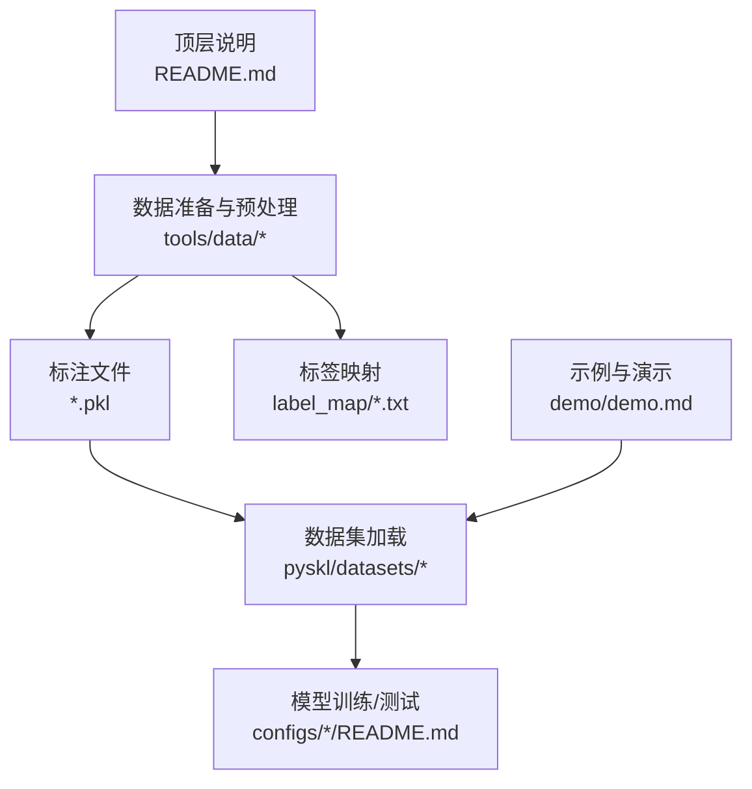
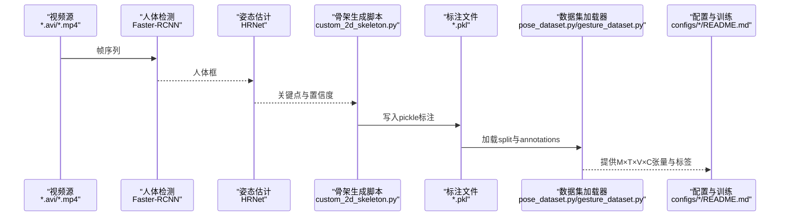
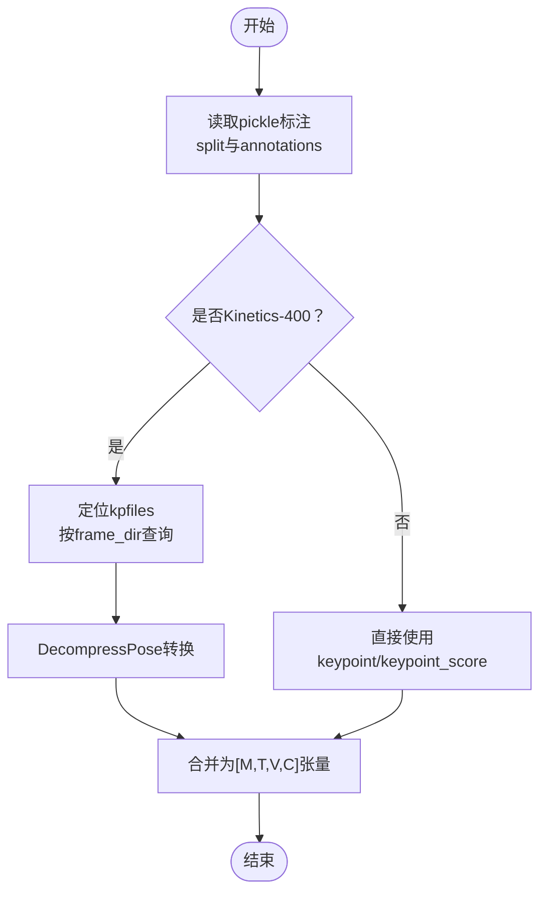
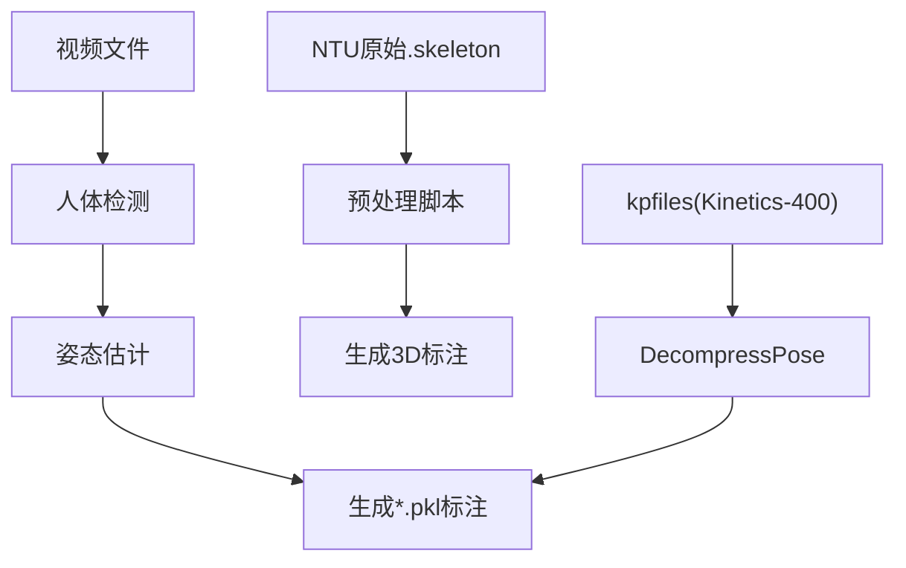
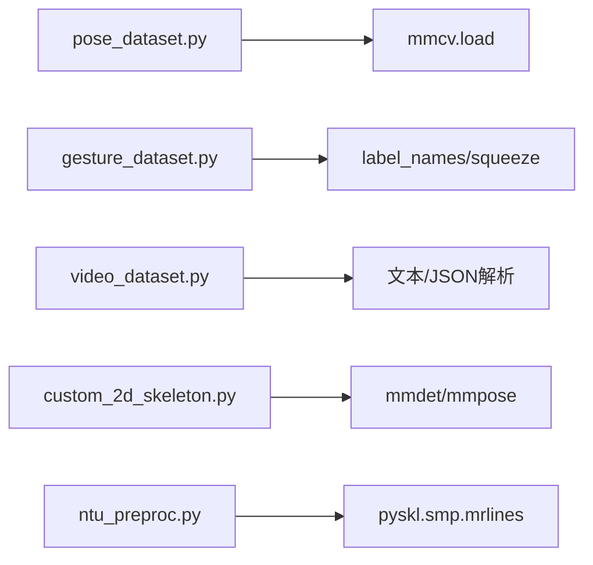

# 数据格式规范

<cite>
**本文引用的文件**
- [README.md](file://README.md)
- [demo.md](file://demo/demo.md)
- [tools/data/README.md](file://tools/data/README.md)
- [tools/data/custom_2d_skeleton.py](file://tools/data/custom_2d_skeleton.py)
- [tools/data/ntu_preproc.py](file://tools/data/ntu_preproc.py)
- [tools/data/label_map/diving48.txt](file://tools/data/label_map/diving48.txt)
- [tools/data/label_map/gym.txt](file://tools/data/label_map/gym.txt)
- [tools/data/label_map/hmdb51.txt](file://tools/data/label_map/hmdb51.txt)
- [pyskl/datasets/pose_dataset.py](file://pyskl/datasets/pose_dataset.py)
- [pyskl/datasets/video_dataset.py](file://pyskl/datasets/video_dataset.py)
- [pyskl/datasets/gesture_dataset.py](file://pyskl/datasets/gesture_dataset.py)
- [configs/stgcn/README.md](file://configs/stgcn/README.md)
- [configs/msg3d/README.md](file://configs/msg3d/README.md)
</cite>

## 目录
1. [简介](#简介)
2. [项目结构](#项目结构)
3. [核心组件](#核心组件)
4. [架构总览](#架构总览)
5. [详细组件分析](#详细组件分析)
6. [依赖分析](#依赖分析)
7. [性能考虑](#性能考虑)
8. [故障排查指南](#故障排查指南)
9. [结论](#结论)
10. [附录](#附录)

## 简介
本文件系统化梳理 PySKL 的数据格式规范，覆盖以下方面：
- 支持的数据格式类型：视频文件、图像格式、骨架数据格式（2D/3D）。
- 标注文件格式规范：pickle 结构、字段定义、标签映射。
- 骨架数据存储格式：关键点坐标、置信度、时间序列组织。
- 标签映射文件：类别编号与名称的对应关系及使用方法。
- 数据路径规范与目录结构要求。
- 数据验证规则与质量检查标准。
- 数据格式转换工具与方法。
- 多模态数据格式要求与同步机制。
- 最佳实践与常见问题解决方案。

## 项目结构
围绕数据格式相关的关键目录与文件如下：
- 数据准备与预处理：tools/data/README.md、tools/data/custom_2d_skeleton.py、tools/data/ntu_preproc.py、tools/data/label_map/*.txt
- 数据集加载与验证：pyskl/datasets/pose_dataset.py、pyskl/datasets/video_dataset.py、pyskl/datasets/gesture_dataset.py
- 模型配置与训练：configs/stgcn/README.md、configs/msg3d/README.md
- 示例与演示：demo/demo.md
- 顶层说明：README.md

**图表来源**
- [tools/data/README.md](file://tools/data/README.md#L1-L119)
- [tools/data/custom_2d_skeleton.py](file://tools/data/custom_2d_skeleton.py#L1-L194)
- [tools/data/ntu_preproc.py](file://tools/data/ntu_preproc.py#L1-L201)
- [pyskl/datasets/pose_dataset.py](file://pyskl/datasets/pose_dataset.py#L1-L107)
- [pyskl/datasets/video_dataset.py](file://pyskl/datasets/video_dataset.py#L1-L61)
- [pyskl/datasets/gesture_dataset.py](file://pyskl/datasets/gesture_dataset.py#L1-L156)
- [demo/demo.md](file://demo/demo.md#L1-L42)
- [README.md](file://README.md#L1-L116)

**章节来源**
- [README.md](file://README.md#L1-L116)
- [demo/demo.md](file://demo/demo.md#L1-L42)
- [tools/data/README.md](file://tools/data/README.md#L1-L119)

## 核心组件
- 骨骼数据标注文件（pickle）
  - 字段定义与含义详见“骨架数据存储格式”小节。
  - Kinetics-400 特殊处理：kpfiles 分片缓存与 DecompressPose 转换。
- 视频数据标注文件（文本）
  - 每行包含“视频路径 标签”，支持多标签场景。
- 手势数据标注文件（pickle）
  - 包含手部关键点、左右手标志、帧索引等字段。
- 标签映射文件（文本）
  - 每行一个类别名，按索引映射到类别编号。

**章节来源**
- [tools/data/README.md](file://tools/data/README.md#L5-L29)
- [pyskl/datasets/video_dataset.py](file://pyskl/datasets/video_dataset.py#L14-L27)
- [pyskl/datasets/gesture_dataset.py](file://pyskl/datasets/gesture_dataset.py#L14-L37)
- [tools/data/label_map/diving48.txt](file://tools/data/label_map/diving48.txt#L1-L49)
- [tools/data/label_map/gym.txt](file://tools/data/label_map/gym.txt#L1-L100)
- [tools/data/label_map/hmdb51.txt](file://tools/data/label_map/hmdb51.txt#L1-L52)

## 架构总览
下图展示从原始视频到模型输入的端到端数据流，重点体现骨架提取、标注生成、数据集加载与验证、以及多模态融合的流程。

**图表来源**
- [demo/demo.md](file://demo/demo.md#L17-L31)
- [tools/data/custom_2d_skeleton.py](file://tools/data/custom_2d_skeleton.py#L122-L194)
- [tools/data/README.md](file://tools/data/README.md#L5-L29)
- [pyskl/datasets/pose_dataset.py](file://pyskl/datasets/pose_dataset.py#L86-L107)
- [pyskl/datasets/gesture_dataset.py](file://pyskl/datasets/gesture_dataset.py#L58-L103)
- [configs/stgcn/README.md](file://configs/stgcn/README.md#L50-L67)
- [configs/msg3d/README.md](file://configs/msg3d/README.md#L40-L57)

## 详细组件分析

### 骨骼数据标注文件（pickle）
- 文件结构
  - 字典包含两个键：split、annotations
  - split：字典，键为划分名称（如 xsub_train/xview_val），值为样本标识列表
  - annotations：列表，每个元素为一个样本的标注字典
- 样本标注字段
  - frame_dir：视频标识符或文件夹名
  - total_frames：总帧数
  - img_shape/original_shape：仅2D骨架需要，(H, W)
  - label：动作类别编号
  - keypoint：numpy 数组，形状为 [M x T x V x C]
    - M：人数
    - T：帧数（与 total_frames 一致）
    - V：关键点数（NTURGB+D 3D 为25；COCO/OpenPose 通常为17/18等）
    - C：坐标维度（2D 为2，3D 为3）
  - keypoint_score：numpy 数组，形状为 [M x T x V]，仅2D骨架需要
- Kinetics-400 特例
  - keypoint/keypoint_score 不直接在主标注中，而是分散在多个 kpfiles 中
  - 新增字段：raw_file（kpfile 路径）、frame_inds（每条骨架对应的帧索引）、box_score（bbox 置信度）、valid（有效帧数）
  - 使用内存缓存（memcache）按 frame_dir 查询 kpfile，并通过 DecompressPose 转换为常规格式

**图表来源**
- [tools/data/README.md](file://tools/data/README.md#L19-L27)
- [tools/data/README.md](file://tools/data/README.md#L5-L29)

**章节来源**
- [tools/data/README.md](file://tools/data/README.md#L5-L29)

### 视频数据标注文件（文本）
- 文本格式
  - 每行一条样本，以空白分隔
  - 单标签：路径 标签
  - 多标签：路径 标签1 标签2 ...
- 数据集加载
  - 支持 JSON 注解（load_json_annotations）与文本注解（逐行解析）
  - 自动拼接 data_prefix 与相对路径

**章节来源**
- [pyskl/datasets/video_dataset.py](file://pyskl/datasets/video_dataset.py#L14-L27)
- [pyskl/datasets/video_dataset.py](file://pyskl/datasets/video_dataset.py#L42-L61)

### 手势数据标注文件（pickle）
- 字段要点
  - keypoint：通常为 [1 x F x J x 2] 或扩展为 [M x T x V x C] 的压缩形式
  - hand_score：手部置信度
  - hand_lr：左右手标记
  - valid_frames：有效帧数阈值过滤
- 数据加载与预处理
  - 自动将 2D/3D 切片至 2D
  - 支持按 subset 过滤类别
  - 可对单人单帧进行 squeeze 形状规整

**章节来源**
- [pyskl/datasets/gesture_dataset.py](file://pyskl/datasets/gesture_dataset.py#L14-L37)
- [pyskl/datasets/gesture_dataset.py](file://pyskl/datasets/gesture_dataset.py#L58-L103)

### 标签映射文件（文本）
- 结构
  - 每行一个类别名称，按行号（从0起）映射到类别编号
- 典型用途
  - 训练时将类别字符串映射为整数编号
  - 推理后将模型输出编号还原为类别名称
- 示例
  - Diving48：49个动作类别
  - Gym：100个体操动作类别
  - HMDB51：52个动作类别

**章节来源**
- [tools/data/label_map/diving48.txt](file://tools/data/label_map/diving48.txt#L1-L49)
- [tools/data/label_map/gym.txt](file://tools/data/label_map/gym.txt#L1-L100)
- [tools/data/label_map/hmdb51.txt](file://tools/data/label_map/hmdb51.txt#L1-L52)

### 骨架数据存储格式
- 维度约定
  - keypoint：[M x T x V x C]
  - keypoint_score：[M x T x V]（仅2D）
- 关键点坐标
  - 2D：(x, y)，C=2
  - 3D：(x, y, z)，C=3
- 时间序列组织
  - T 为连续帧数，与 total_frames 一致
  - 对于非连续骨架，可通过 frame_inds 与 valid 字段配合处理
- 置信度处理
  - 2D：keypoint_score 提供每个关键点的置信度
  - 3D：z 坐标可作为置信度的一种近似（具体取决于采集设备）

**章节来源**
- [tools/data/README.md](file://tools/data/README.md#L10-L18)
- [tools/data/README.md](file://tools/data/README.md#L19-L27)

### 数据路径规范与目录结构
- 数据根目录
  - 建议将所有标注与数据放置于统一根目录，并通过 data_prefix 指定
- 常见结构
  - data/
    - ntu60_hrnet.pkl、ntu60_3danno.pkl、ntu120_hrnet.pkl、ntu120_3danno.pkl
    - k400/
      - *.kp（kpfiles）
    - label_map/
      - diving48.txt、gym.txt、hmdb51.txt、ucf101.txt、nturgbd_120.txt
- 数据集加载器
  - 自动拼接 data_prefix 与相对路径
  - split 字典用于划分训练/验证集

**章节来源**
- [tools/data/README.md](file://tools/data/README.md#L31-L46)
- [pyskl/datasets/pose_dataset.py](file://pyskl/datasets/pose_dataset.py#L94-L106)
- [pyskl/datasets/video_dataset.py](file://pyskl/datasets/video_dataset.py#L47-L59)

### 数据验证规则与质量检查标准
- Kinetics-400 专用
  - valid_ratio：仅当有效帧比例达到阈值才视为有效样本
  - box_thr：仅保留 bbox 置信度大于阈值的骨架
  - 通过 valid、box_score 字段进行过滤
- 手势数据
  - valid_frames_thr：仅保留有效帧数大于阈值的样本
- 通用规则
  - total_frames 与 keypoint 的 T 维一致性
  - keypoint_score 与 keypoint 的维度匹配（仅2D）
  - split 划分与 frame_dir/filename 的一致性

**章节来源**
- [pyskl/datasets/pose_dataset.py](file://pyskl/datasets/pose_dataset.py#L28-L36)
- [pyskl/datasets/pose_dataset.py](file://pyskl/datasets/pose_dataset.py#L66-L84)
- [pyskl/datasets/gesture_dataset.py](file://pyskl/datasets/gesture_dataset.py#L20-L22)
- [pyskl/datasets/gesture_dataset.py](file://pyskl/datasets/gesture_dataset.py#L75-L77)

### 数据格式转换工具与方法
- 从视频生成2D骨架
  - 使用 custom_2d_skeleton.py：基于 Faster-RCNN + HRNet，支持分布式提取与压缩模式
  - 输出：*.pkl，包含 annotations 与 split
- 从官方NTU骨架文件生成3D骨架
  - 使用 ntu_preproc.py：解析.skeleton，去噪与拼接多人体轨迹，生成 ntu60_3danno.pkl / ntu120_3danno.pkl
- Kinetics-400 解压
  - 使用 DecompressPose 将 kpfiles 转换为常规骨架格式

**图表来源**
- [tools/data/custom_2d_skeleton.py](file://tools/data/custom_2d_skeleton.py#L122-L194)
- [tools/data/ntu_preproc.py](file://tools/data/ntu_preproc.py#L153-L201)
- [tools/data/README.md](file://tools/data/README.md#L19-L27)

**章节来源**
- [tools/data/custom_2d_skeleton.py](file://tools/data/custom_2d_skeleton.py#L88-L119)
- [tools/data/custom_2d_skeleton.py](file://tools/data/custom_2d_skeleton.py#L122-L194)
- [tools/data/ntu_preproc.py](file://tools/data/ntu_preproc.py#L14-L54)
- [tools/data/README.md](file://tools/data/README.md#L48-L54)

### 多模态数据格式要求与同步机制
- 模态组合
  - Joint、Bone、Joint Motion、Bone Motion 四种基础模态
  - Two-Stream（Joint:Bone 1:1）与 Four-Stream（Joint:Bone:Motion 2:2:1:1）融合策略
- 同步机制
  - 通过 keypoint 的 [M x T x V x C] 维度确保时间对齐
  - 对于 Kinetics-400，利用 frame_inds 与 kpfiles 的 frame_dir 键实现按帧检索
- 训练与测试命令
  - 提供统一的分布式训练与测试脚本入口

**章节来源**
- [configs/stgcn/README.md](file://configs/stgcn/README.md#L29-L47)
- [configs/stgcn/README.md](file://configs/stgcn/README.md#L50-L67)
- [configs/msg3d/README.md](file://configs/msg3d/README.md#L23-L37)
- [configs/msg3d/README.md](file://configs/msg3d/README.md#L40-L57)

## 依赖分析
- 数据加载依赖
  - pose_dataset.py 依赖 mmcv.load 读取 pickle，依据 split 过滤样本
  - gesture_dataset.py 依赖 label_names 与 squeeze 逻辑规整张量
  - video_dataset.py 支持文本与 JSON 注解
- 工具链依赖
  - custom_2d_skeleton.py 依赖 mmdet/mmpose 进行检测与姿态估计
  - ntu_preproc.py 依赖 pyskl.smp.mrlines 读取原始骨架文件

**图表来源**
- [pyskl/datasets/pose_dataset.py](file://pyskl/datasets/pose_dataset.py#L86-L107)
- [pyskl/datasets/gesture_dataset.py](file://pyskl/datasets/gesture_dataset.py#L58-L103)
- [pyskl/datasets/video_dataset.py](file://pyskl/datasets/video_dataset.py#L42-L61)
- [tools/data/custom_2d_skeleton.py](file://tools/data/custom_2d_skeleton.py#L16-L31)
- [tools/data/ntu_preproc.py](file://tools/data/ntu_preproc.py#L9)

**章节来源**
- [pyskl/datasets/pose_dataset.py](file://pyskl/datasets/pose_dataset.py#L86-L107)
- [pyskl/datasets/gesture_dataset.py](file://pyskl/datasets/gesture_dataset.py#L58-L103)
- [pyskl/datasets/video_dataset.py](file://pyskl/datasets/video_dataset.py#L42-L61)
- [tools/data/custom_2d_skeleton.py](file://tools/data/custom_2d_skeleton.py#L16-L31)
- [tools/data/ntu_preproc.py](file://tools/data/ntu_preproc.py#L9)

## 性能考虑
- Kinetics-400 的 kpfiles 分片与 memcache 缓存显著降低 I/O 开销
- custom_2d_skeleton.py 支持非分布式与分布式两种提取模式，可根据资源选择
- 压缩模式（compress）将 keypoint 存储为半精度浮点，节省内存与磁盘空间
- 通过 valid_ratio 与 box_thr 过滤低质量样本，提升训练稳定性

[本节为通用建议，不直接分析具体文件]

## 故障排查指南
- 无法导入 mmdet/mmpose
  - 确认已安装并从源码构建
- 2D骨架缺少 keypoint_score
  - 该字段仅在2D骨架中需要，3D骨架不包含
- Kinetics-400 未找到 kpfiles
  - 检查下载链接与 k400 目录结构，确保按 frame_dir 正确索引
- split 名称不匹配
  - 确认使用的 split 名称与 pickle 中的键一致（如 xsub_train/xview_val/xset_train 等）
- 姿态估计结果异常
  - 调整检测阈值（det-score-thr、det-area-thr）与姿态置信度阈值

**章节来源**
- [tools/data/custom_2d_skeleton.py](file://tools/data/custom_2d_skeleton.py#L16-L31)
- [tools/data/custom_2d_skeleton.py](file://tools/data/custom_2d_skeleton.py#L88-L119)
- [tools/data/README.md](file://tools/data/README.md#L19-L27)
- [pyskl/datasets/pose_dataset.py](file://pyskl/datasets/pose_dataset.py#L94-L98)

## 结论
本规范系统化定义了 PySKL 的数据格式与处理流程，涵盖骨架标注、视频标注、标签映射、验证与转换工具、以及多模态融合策略。遵循本文档可确保数据准备与模型训练的一致性与高效性。

[本节为总结，不直接分析具体文件]

## 附录
- 示例与演示
  - 骨骼动作识别演示：使用 GPU 在视频上进行离线推理
  - 手势识别演示：使用 CPU 实时推理单手手势
- 模型配置参考
  - ST-GCN 与 MSG3D 的模型清单、训练与测试命令

**章节来源**
- [demo/demo.md](file://demo/demo.md#L17-L41)
- [configs/stgcn/README.md](file://configs/stgcn/README.md#L50-L67)
- [configs/msg3d/README.md](file://configs/msg3d/README.md#L40-L57)