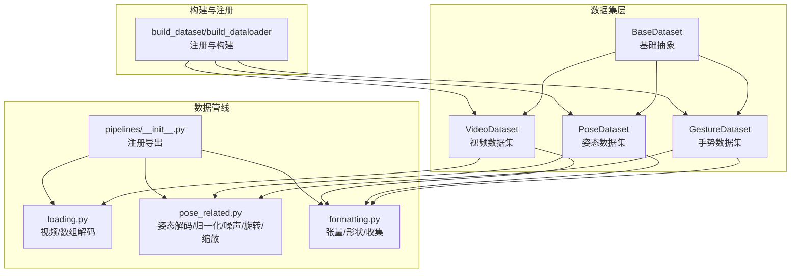
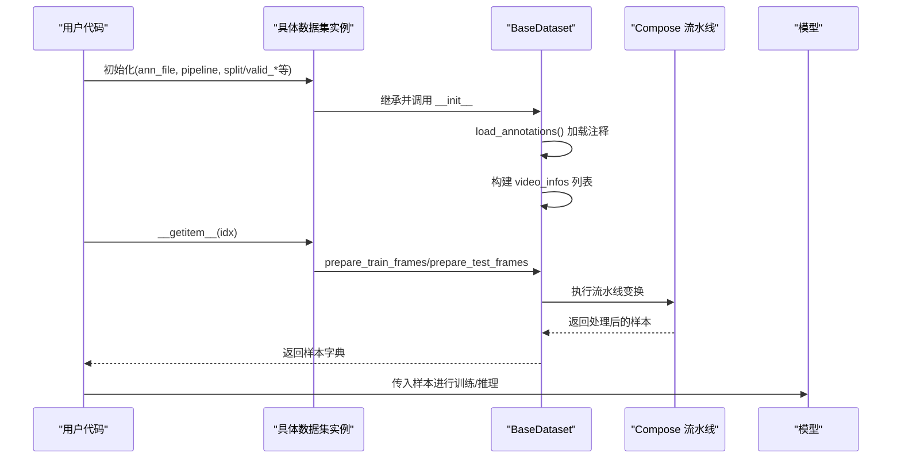
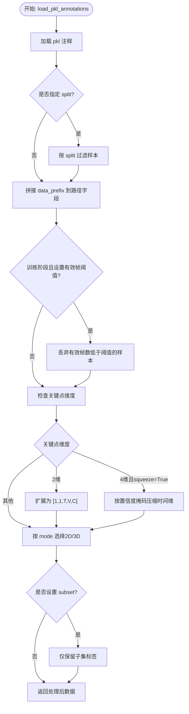
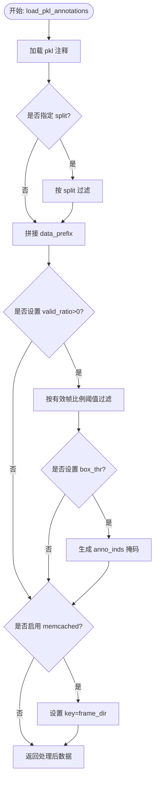
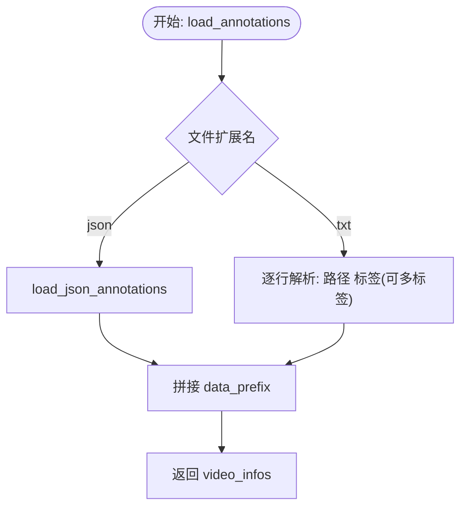
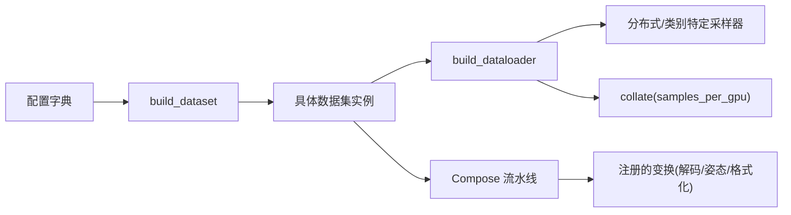

# 具体数据集类型

<cite>
**本文引用的文件**
- [pyskl/datasets/base.py](file://pyskl/datasets/base.py)
- [pyskl/datasets/gesture_dataset.py](file://pyskl/datasets/gesture_dataset.py)
- [pyskl/datasets/pose_dataset.py](file://pyskl/datasets/pose_dataset.py)
- [pyskl/datasets/video_dataset.py](file://pyskl/datasets/video_dataset.py)
- [pyskl/datasets/builder.py](file://pyskl/datasets/builder.py)
- [pyskl/datasets/pipelines/__init__.py](file://pyskl/datasets/pipelines/__init__.py)
- [pyskl/datasets/pipelines/loading.py](file://pyskl/datasets/pipelines/loading.py)
- [pyskl/datasets/pipelines/pose_related.py](file://pyskl/datasets/pipelines/pose_related.py)
- [pyskl/datasets/pipelines/formatting.py](file://pyskl/datasets/pipelines/formatting.py)
- [configs/aagcn/aagcn_pyskl_ntu60_xsub_3dkp/b.py](file://configs/aagcn/aagcn_pyskl_ntu60_xsub_3dkp/b.py)
- [demo/demo_gesture.py](file://demo/demo_gesture.py)
- [demo/demo_skeleton.py](file://demo/demo_skeleton.py)
</cite>

## 目录
1. [简介](#简介)
2. [项目结构](#项目结构)
3. [核心组件](#核心组件)
4. [架构总览](#架构总览)
5. [详细组件分析](#详细组件分析)
6. [依赖关系分析](#依赖关系分析)
7. [性能考量](#性能考量)
8. [故障排查指南](#故障排查指南)
9. [结论](#结论)
10. [附录](#附录)

## 简介
本文件聚焦于 PySKL 中三类具体数据集类型的实现与使用：手势数据集（GestureDataset）、姿态数据集（PoseDataset）与视频数据集（VideoDataset）。我们将从数据格式解析、元数据提取、标签映射、预处理差异、数据增强策略、数据质量检查、配置示例与最佳实践等方面进行系统化说明，并给出选择建议。

## 项目结构
围绕数据集与数据管线的关键文件组织如下：
- 数据集基类与三个具体数据集：base.py、gesture_dataset.py、pose_dataset.py、video_dataset.py
- 数据集注册与构建：builder.py
- 数据管线注册与关键变换：pipelines/__init__.py、loading.py、pose_related.py、formatting.py
- 配置示例与演示脚本：configs/aagcn/.../b.py、demo/demo_gesture.py、demo/demo_skeleton.py

**图示来源**
- [pyskl/datasets/base.py](file://pyskl/datasets/base.py#L19-L354)
- [pyskl/datasets/gesture_dataset.py](file://pyskl/datasets/gesture_dataset.py#L14-L156)
- [pyskl/datasets/pose_dataset.py](file://pyskl/datasets/pose_dataset.py#L11-L107)
- [pyskl/datasets/video_dataset.py](file://pyskl/datasets/video_dataset.py#L9-L61)
- [pyskl/datasets/builder.py](file://pyskl/datasets/builder.py#L31-L124)
- [pyskl/datasets/pipelines/__init__.py](file://pyskl/datasets/pipelines/__init__.py#L1-L10)

**章节来源**
- [pyskl/datasets/base.py](file://pyskl/datasets/base.py#L19-L354)
- [pyskl/datasets/builder.py](file://pyskl/datasets/builder.py#L31-L124)

## 核心组件
- BaseDataset：定义了统一的加载注释、采样、评估、数据增强流水线调用等接口与通用逻辑。
- GestureDataset：面向手势识别，注释为 pkl，包含关键点、手分数、左右手标记等；支持2D/3D模式、有效帧阈值、子集过滤等。
- PoseDataset：面向全身骨架动作识别，注释为 pkl，包含关键点、框分数、总帧数等；支持按人体框置信度阈值筛选、有效比例阈值、memcached缓存等。
- VideoDataset：面向传统视频动作识别，注释为文本行（路径+标签），支持多标签与单标签两类。

**章节来源**
- [pyskl/datasets/base.py](file://pyskl/datasets/base.py#L46-L74)
- [pyskl/datasets/gesture_dataset.py](file://pyskl/datasets/gesture_dataset.py#L39-L103)
- [pyskl/datasets/pose_dataset.py](file://pyskl/datasets/pose_dataset.py#L44-L106)
- [pyskl/datasets/video_dataset.py](file://pyskl/datasets/video_dataset.py#L39-L60)

## 架构总览
数据集从注释文件加载到样本字典，再经由 Compose 的流水线进行解码、归一化、采样、格式化与张量化，最终进入模型训练或推理。

**图示来源**
- [pyskl/datasets/base.py](file://pyskl/datasets/base.py#L262-L354)
- [pyskl/datasets/builder.py](file://pyskl/datasets/builder.py#L31-L45)

## 详细组件分析

### 手势数据集（GestureDataset）
- 注释格式与加载
  - 注释文件为 pkl，包含 split 与 annotations；支持通过 split 过滤训练/验证/测试集合。
  - 支持 filename 与 frame_dir 两种路径字段，统一拼接 data_prefix。
  - 有效帧阈值 valid_frames_thr 仅在训练/训练+验证阶段生效，过滤有效帧数不足的样本。
- 数据预处理差异
  - 支持 squeeze 模式：当关键点维度为4维时，基于置信度掩码压缩时间维，保留非零帧。
  - 支持 mode='2D'/'3D'：将关键点裁剪到前两维（x,y）。
  - 支持 subset 子集过滤，仅保留指定标签。
- 评估指标
  - 提供 top-1 与 top-5 准确率，并按类别打印准确率与人数统计；还可按有效帧数量分段统计准确率。

**图示来源**
- [pyskl/datasets/gesture_dataset.py](file://pyskl/datasets/gesture_dataset.py#L63-L103)

**章节来源**
- [pyskl/datasets/gesture_dataset.py](file://pyskl/datasets/gesture_dataset.py#L58-L103)
- [pyskl/datasets/base.py](file://pyskl/datasets/base.py#L112-L241)

### 姿态数据集（PoseDataset）
- 注释格式与加载
  - 注释文件为 pkl，包含 split 与 annotations；支持按 split 过滤。
  - 支持 filename/frame_dir，统一拼接 data_prefix。
- 额外过滤与缓存
  - 支持 box_thr（人体框置信度阈值）与 valid_ratio（有效帧比例阈值）联合筛选训练样本。
  - 支持 memcached 缓存关键点，使用 frame_dir 作为 key。
- 数据预处理差异
  - 与 GestureDataset 类似，但更强调人体检测框质量与有效帧比例控制，适合大规模骨架数据集（如KineticsPose）。

**图示来源**
- [pyskl/datasets/pose_dataset.py](file://pyskl/datasets/pose_dataset.py#L91-L106)

**章节来源**
- [pyskl/datasets/pose_dataset.py](file://pyskl/datasets/pose_dataset.py#L86-L106)
- [pyskl/datasets/base.py](file://pyskl/datasets/base.py#L66-L84)

### 视频数据集（VideoDataset）
- 注释格式与加载
  - 默认注释为文本文件，每行“路径 标签”，空格分隔；支持多标签（多类标签）与单标签两种。
  - 若 ann_file 为 json，则走通用 JSON 注释加载流程（见 BaseDataset.load_json_annotations）。
- 数据预处理差异
  - 不涉及骨架关键点，通常配合视频解码（DecordInit/DecordDecode）与图像流水线（Resize、FormatShape 等）进行处理。

**图示来源**
- [pyskl/datasets/video_dataset.py](file://pyskl/datasets/video_dataset.py#L42-L60)
- [pyskl/datasets/base.py](file://pyskl/datasets/base.py#L81-L97)

**章节来源**
- [pyskl/datasets/video_dataset.py](file://pyskl/datasets/video_dataset.py#L42-L60)
- [pyskl/datasets/base.py](file://pyskl/datasets/base.py#L81-L97)

### 数据增强与预处理流程对比
- 手势数据集（GestureDataset）
  - 关键点维度处理：2维扩展、4维按置信度压缩时间维；2D/3D模式切换。
  - 可选 squeeze 与 subset 过滤，适合小规模高噪声手势数据。
- 姿态数据集（PoseDataset）
  - 强化人体框质量控制（box_thr）与有效帧比例（valid_ratio），适合大规模骨架数据。
  - 可选 memcached 缓存，提升大规模数据读取效率。
- 视频数据集（VideoDataset）
  - 依赖视频解码与图像流水线（DecordInit/DecordDecode、Resize、FormatShape 等），不涉及骨架关键点处理。

**章节来源**
- [pyskl/datasets/gesture_dataset.py](file://pyskl/datasets/gesture_dataset.py#L86-L103)
- [pyskl/datasets/pose_dataset.py](file://pyskl/datasets/pose_dataset.py#L67-L82)
- [pyskl/datasets/pipelines/loading.py](file://pyskl/datasets/pipelines/loading.py#L11-L137)
- [pyskl/datasets/pipelines/formatting.py](file://pyskl/datasets/pipelines/formatting.py#L161-L200)

## 依赖关系分析
- 数据集注册与构建
  - DATASETS 注册表管理具体数据集类型，build_dataset 按配置动态构建。
  - build_dataloader 基于分布式采样器与 collate，支持类别特定重采样（class_prob）。
- 数据管线注册
  - PIPELINES 注册表管理各类变换（解码、姿态处理、格式化等），通过 Compose 组合。

**图示来源**
- [pyskl/datasets/builder.py](file://pyskl/datasets/builder.py#L31-L124)
- [pyskl/datasets/pipelines/__init__.py](file://pyskl/datasets/pipelines/__init__.py#L1-L10)

**章节来源**
- [pyskl/datasets/builder.py](file://pyskl/datasets/builder.py#L31-L124)
- [pyskl/datasets/pipelines/__init__.py](file://pyskl/datasets/pipelines/__init__.py#L1-L10)

## 性能考量
- 姿态数据集的 memcached 缓存可显著降低重复读取开销，适用于大规模骨架数据。
- 有效帧比例与人体框置信度阈值有助于剔除低质量样本，提升训练稳定性。
- squeeze 压缩时间维可减少无效帧带来的计算冗余，提高训练效率。
- 分布式采样器与类别特定采样器（class_prob）可改善类别不平衡问题。

[本节为通用指导，无需列出章节来源]

## 故障排查指南
- 注释文件格式错误
  - 手势/姿态数据集要求 ann_file 为 pkl，且包含 split 与 annotations 字段；若为 json，需确保结构与 BaseDataset.load_json_annotations 兼容。
- 路径拼接异常
  - 确认 data_prefix 正确，路径字段（filename/frame_dir）存在且可访问。
- 有效帧/框分数缺失
  - PoseDataset 在启用 valid_ratio 时要求存在 box_score 字段；否则会触发断言失败。
- 评估结果长度不匹配
  - BaseDataset.evaluate 要求 results 长度与数据集长度一致，否则抛出异常。

**章节来源**
- [pyskl/datasets/gesture_dataset.py](file://pyskl/datasets/gesture_dataset.py#L60-L61)
- [pyskl/datasets/pose_dataset.py](file://pyskl/datasets/pose_dataset.py#L68-L79)
- [pyskl/datasets/base.py](file://pyskl/datasets/base.py#L136-L142)

## 结论
- 手势数据集（GestureDataset）适合小规模、高噪声的手势动作识别，强调关键点维度处理与有效帧阈值过滤。
- 姿态数据集（PoseDataset）适合大规模骨架动作识别，强调人体框质量与有效帧比例控制，并支持缓存与类别重采样。
- 视频数据集（VideoDataset）适合传统视频动作识别，依赖视频解码与图像流水线。
- 选择建议：根据任务目标与数据形态选择对应数据集类型；结合配置示例与演示脚本快速落地。

[本节为总结性内容，无需列出章节来源]

## 附录

### 数据格式规范与质量检查
- 手势数据集（pkl）
  - 必备字段：annotations（列表），split（字典，包含 train/val/test 键）
  - 建议字段：filename 或 frame_dir，keypoint（2维或4维），hand_score，hand_lr，label
  - 质量检查：确认有效帧数满足阈值；关键点维度与 squeeze/2D/3D 设置一致
- 姿态数据集（pkl）
  - 必备字段：annotations（列表），split（字典），frame_dir/filename
  - 建议字段：keypoint，keypoint_score，total_frames，box_score（启用 valid_ratio 时）
  - 质量检查：box_score 存在且与 total_frames 成比例；有效帧比例满足 valid_ratio
- 视频数据集（txt/json）
  - 文本格式：每行“路径 标签（可多标签）”
  - JSON 格式：列表项包含路径字段（filename/frame_dir）与 label

**章节来源**
- [pyskl/datasets/gesture_dataset.py](file://pyskl/datasets/gesture_dataset.py#L63-L103)
- [pyskl/datasets/pose_dataset.py](file://pyskl/datasets/pose_dataset.py#L91-L106)
- [pyskl/datasets/video_dataset.py](file://pyskl/datasets/video_dataset.py#L44-L60)
- [pyskl/datasets/base.py](file://pyskl/datasets/base.py#L81-L97)

### 配置示例与最佳实践
- 姿态数据集（PoseDataset）配置示例
  - 参考 aagcn 配置，使用 UniformSample/PreNormalize3D/GenSkeFeat/FormatGCNInput 等流水线，按 NTU 主/跨视/跨子集划分 split。
  - 最佳实践：先做骨架特征生成（GenSkeFeat），再做时间采样（UniformSample），最后格式化为 GCN 输入。
- 手势数据集（GestureDataset）配置示例
  - 参考 demo 中的配置与演示脚本，使用 PoseDecode、GeneratePoseTarget、FormatShape 等流水线。
  - 最佳实践：合理设置 squeeze 与 mode，必要时使用 subset 过滤标签。
- 视频数据集（VideoDataset）配置示例
  - 参考 configs 中的视频动作识别配置，使用 DecordInit/DecordDecode、Resize、FormatShape 等流水线。
  - 最佳实践：注释文件采用“路径 标签”格式，多标签场景需设置 multi_class 与 num_classes。

**章节来源**
- [configs/aagcn/aagcn_pyskl_ntu60_xsub_3dkp/b.py](file://configs/aagcn/aagcn_pyskl_ntu60_xsub_3dkp/b.py#L8-L46)
- [demo/demo_gesture.py](file://demo/demo_gesture.py#L86-L94)
- [demo/demo_skeleton.py](file://demo/demo_skeleton.py#L235-L246)

### 数据质量检查清单
- 路径与文件存在性：确认 data_prefix 下路径可访问
- 注释完整性：pkl 中 split/annotations 字段齐全；txt/json 格式正确
- 关键点维度一致性：2D/3D 模式与实际数据匹配
- 有效帧与框分数：满足 valid_frames_thr 与 box_thr/valid_ratio
- 评估一致性：results 长度与数据集长度一致

**章节来源**
- [pyskl/datasets/gesture_dataset.py](file://pyskl/datasets/gesture_dataset.py#L76-L77)
- [pyskl/datasets/pose_dataset.py](file://pyskl/datasets/pose_dataset.py#L73-L74)
- [pyskl/datasets/base.py](file://pyskl/datasets/base.py#L136-L142)