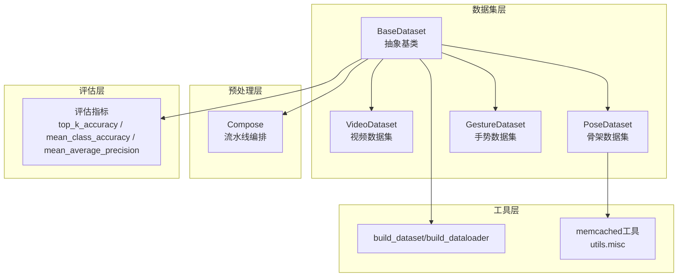
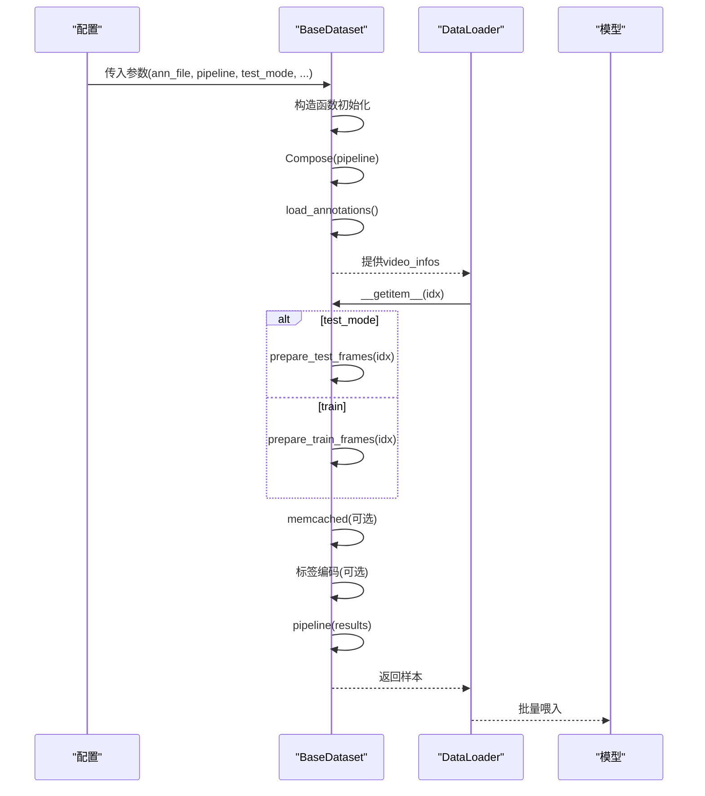
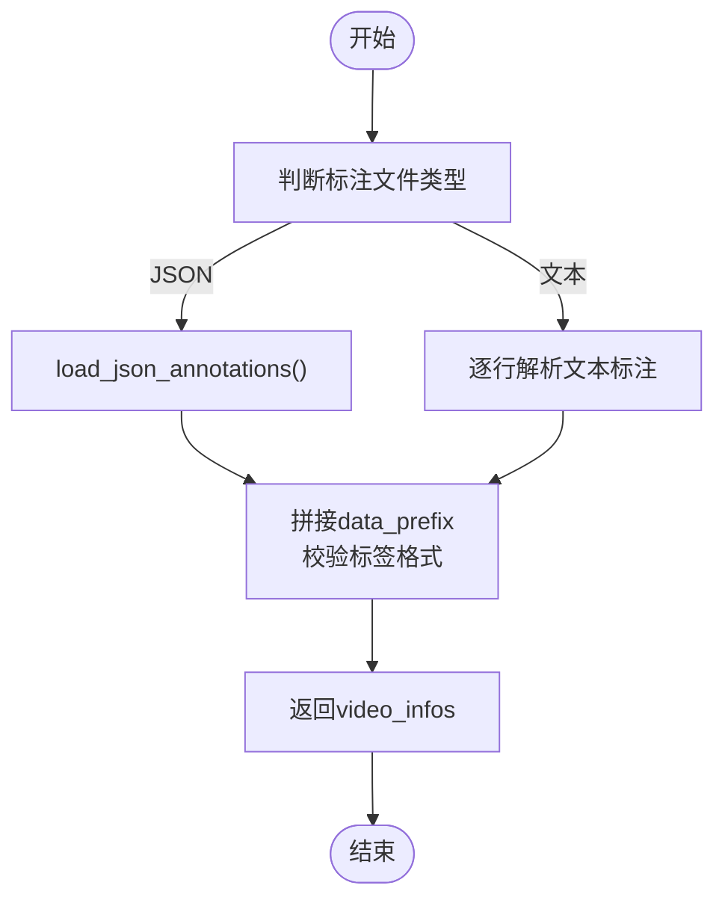
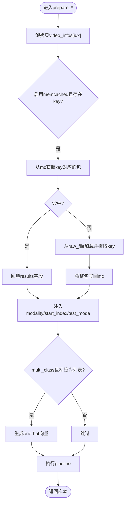
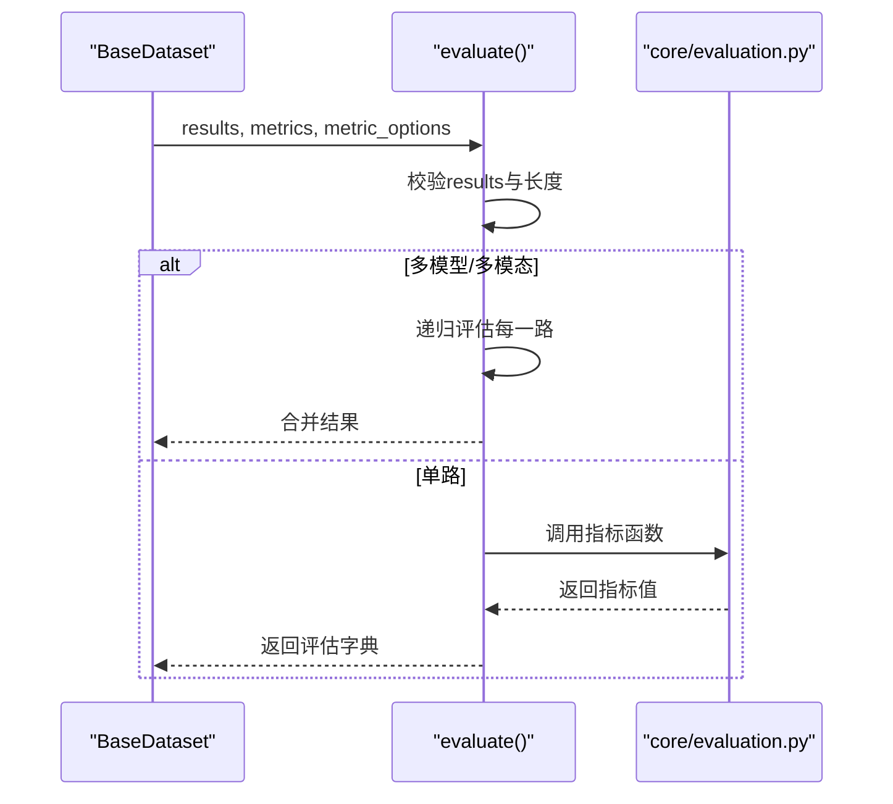
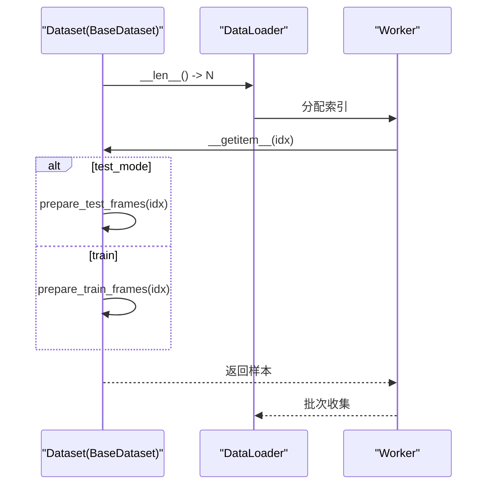
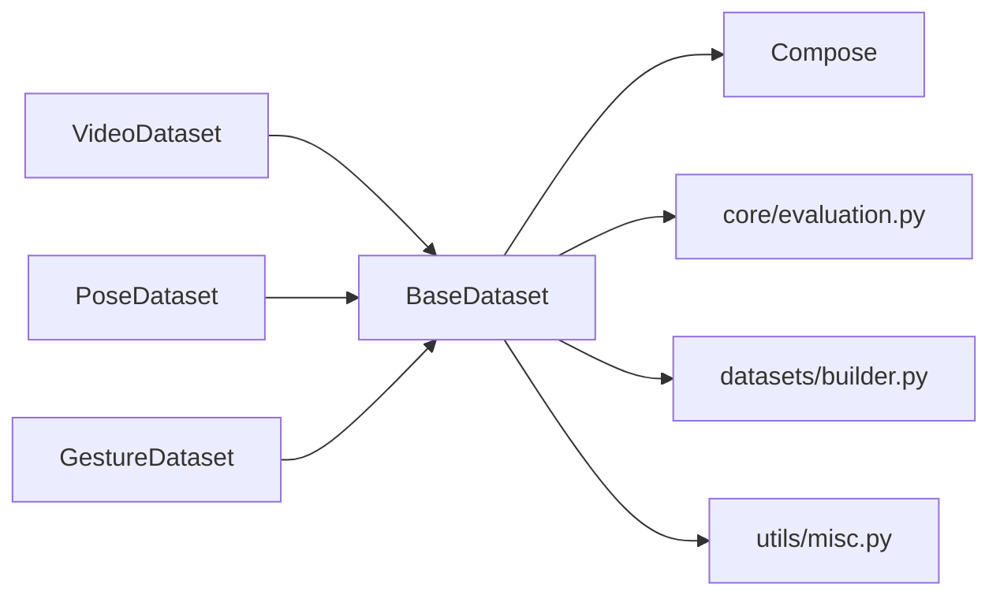

# 基础数据集类

<cite>
**本文引用的文件**
- [pyskl/datasets/base.py](file://pyskl/datasets/base.py)
- [pyskl/datasets/__init__.py](file://pyskl/datasets/__init__.py)
- [pyskl/datasets/video_dataset.py](file://pyskl/datasets/video_dataset.py)
- [pyskl/datasets/pose_dataset.py](file://pyskl/datasets/pose_dataset.py)
- [pyskl/datasets/gesture_dataset.py](file://pyskl/datasets/gesture_dataset.py)
- [pyskl/datasets/pipelines/compose.py](file://pyskl/datasets/pipelines/compose.py)
- [pyskl/core/evaluation.py](file://pyskl/core/evaluation.py)
- [pyskl/datasets/builder.py](file://pyskl/datasets/builder.py)
- [pyskl/utils/misc.py](file://pyskl/utils/misc.py)
- [configs/posec3d/slowonly_r50_ntu60_xsub/joint.py](file://configs/posec3d/slowonly_r50_ntu60_xsub/joint.py)
- [configs/stgcn/stgcn_pyskl_ntu60_xsub_3dkp/b.py](file://configs/stgcn/stgcn_pyskl_ntu60_xsub_3dkp/b.py)
</cite>

## 更新摘要
**变更内容**
- 增加了BaseDataset类的详细注释说明，包括工厂模式实现
- 补充了初始化参数的详细解释和配置要点
- 完善了评估系统的详细说明，涵盖支持的指标类型
- 增强了memcached缓存系统的使用说明
- 优化了数据加载流程的详细描述

## 目录
1. [简介](#简介)
2. [项目结构](#项目结构)
3. [核心组件](#核心组件)
4. [架构总览](#架构总览)
5. [详细组件分析](#详细组件分析)
6. [依赖关系分析](#依赖关系分析)
7. [性能考量](#性能考量)
8. [故障排查指南](#故障排查指南)
9. [结论](#结论)
10. [附录](#附录)

## 简介
本文件面向PySKL框架中的基础数据集类BaseDataset，系统性地阐述其设计理念、架构原理与实现细节。BaseDataset作为所有具体数据集类型的抽象父类，定义了统一的数据加载、预处理、评估与迭代接口，并通过可插拔的预处理流水线与可选的memcached缓存机制，支撑视频动作识别、骨架动作识别等多种任务形态。本文将围绕以下主题展开：
- 构造函数参数与配置要点
- 数据加载流程：从抽象的load_annotations到通用的load_json_annotations
- 训练/测试样本准备：prepare_train_frames与prepare_test_frames的工作机制
- 评估流程：evaluate方法支持的指标与配置
- 数据集迭代器与__getitem__工作流
- 错误处理、性能优化与调试技巧

## 项目结构
与BaseDataset直接相关的模块与文件如下：
- 抽象基类与具体子类：base.py、video_dataset.py、pose_dataset.py、gesture_dataset.py
- 预处理流水线：pipelines/compose.py
- 评估指标：core/evaluation.py
- 数据集构建与DataLoader封装：datasets/builder.py
- memcached工具与缓存脚手架：utils/misc.py
- 配置示例：configs/*/*/joint.py、configs/stgcn/*/b.py

**图表来源**
- [pyskl/datasets/base.py](file://pyskl/datasets/base.py#L18-L73)
- [pyskl/datasets/video_dataset.py](file://pyskl/datasets/video_dataset.py#L8-L39)
- [pyskl/datasets/pose_dataset.py](file://pyskl/datasets/pose_dataset.py#L10-L57)
- [pyskl/datasets/gesture_dataset.py](file://pyskl/datasets/gesture_dataset.py#L13-L53)
- [pyskl/datasets/pipelines/compose.py](file://pyskl/datasets/pipelines/compose.py#L8-L44)
- [pyskl/core/evaluation.py](file://pyskl/core/evaluation.py#L103-L170)
- [pyskl/datasets/builder.py](file://pyskl/datasets/builder.py#L31-L124)
- [pyskl/utils/misc.py](file://pyskl/utils/misc.py#L18-L83)

**章节来源**
- [pyskl/datasets/__init__.py](file://pyskl/datasets/__init__.py#L1-L13)

## 核心组件
- BaseDataset：定义数据集抽象接口、通用数据加载与评估逻辑、memcached缓存接入、数据预处理流水线编排、迭代器接口。
- 具体数据集：
  - VideoDataset：面向视频输入，支持文本标注文件或JSON标注文件。
  - PoseDataset/GestureDataset：面向骨架序列，支持pkl标注文件，具备split、阈值过滤、memcached缓存等能力。
- 预处理流水线Compose：将一系列变换按序执行，支持配置字典与可调用对象。
- 评估指标：提供top-k准确率、平均类别准确率、平均精度均值（mAP）等。
- 构建与DataLoader：基于MMCV注册表构建数据集与DataLoader，支持分布式采样与批处理。

**章节来源**
- [pyskl/datasets/base.py](file://pyskl/datasets/base.py#L18-L73)
- [pyskl/datasets/video_dataset.py](file://pyskl/datasets/video_dataset.py#L8-L59)
- [pyskl/datasets/pose_dataset.py](file://pyskl/datasets/pose_dataset.py#L10-L105)
- [pyskl/datasets/gesture_dataset.py](file://pyskl/datasets/gesture_dataset.py#L13-L102)
- [pyskl/datasets/pipelines/compose.py](file://pyskl/datasets/pipelines/compose.py#L8-L44)
- [pyskl/core/evaluation.py](file://pyskl/core/evaluation.py#L103-L170)
- [pyskl/datasets/builder.py](file://pyskl/datasets/builder.py#L31-L124)

## 架构总览
BaseDataset采用"抽象工厂模式 + 可插拔流水线 + 可选缓存"的架构模式，向上提供统一接口，向下通过子类实现差异化数据加载策略。其核心流程包括：
- 初始化阶段：解析参数、构建Compose流水线、加载标注文件到video_infos。
- 训练/测试样本准备：根据test_mode选择prepare_train_frames或prepare_test_frames；支持memcached缓存；进行标签编码；应用流水线。
- 评估阶段：evaluate支持多种指标，兼容多模型/多模态输出。
- 迭代阶段：__getitem__委托prepare_*，__len__返回样本总数。

**图表来源**
- [pyskl/datasets/base.py](file://pyskl/datasets/base.py#L45-L73)
- [pyskl/datasets/base.py](file://pyskl/datasets/base.py#L261-L354)
- [pyskl/datasets/builder.py](file://pyskl/datasets/builder.py#L48-L124)

## 详细组件分析

### BaseDataset类设计与职责
- **抽象工厂模式**：BaseDataset作为抽象基类，遵循抽象工厂模式，为所有具体的视频数据集提供了统一的接口和一些通用的功能实现。
- **抽象接口**：要求子类实现load_annotations、prepare_train_frames、prepare_test_frames。
- **统一参数**：ann_file、pipeline、data_prefix、test_mode、multi_class、num_classes、start_index、modality、memcached、mc_cfg。
- **通用实现**：
  - load_json_annotations：通用JSON标注加载与路径拼接。
  - parse_by_class：按标签分组，便于采样。
  - evaluate：支持top_k_accuracy、mean_class_accuracy、mean_average_precision，兼容多模型/多模态输出。
  - __getitem__/__len__：迭代器接口。
  - dump_results：结果导出。

**章节来源**
- [pyskl/datasets/base.py](file://pyskl/datasets/base.py#L18-L73)
- [pyskl/datasets/base.py](file://pyskl/datasets/base.py#L74-L96)
- [pyskl/datasets/base.py](file://pyskl/datasets/base.py#L98-L104)
- [pyskl/datasets/base.py](file://pyskl/datasets/base.py#L111-L241)
- [pyskl/datasets/base.py](file://pyskl/datasets/base.py#L347-L354)

### 构造函数参数详解
- **ann_file**：标注文件路径，支持JSON或文本格式（由子类决定）。
- **pipeline**：预处理流水线配置列表，元素为字典或可调用对象。
- **data_prefix**：数据根目录前缀，用于拼接完整路径。
- **test_mode**：是否为测试/验证模式，影响样本准备与迭代行为。
- **multi_class/num_classes**：多分类标志与类别数量，用于标签编码与评估。
- **start_index**：帧索引起始值，视频输入通常为0。
- **modality**：数据模态（如RGB、Flow、Audio、Pose），用于后续处理。
- **memcached/mc_cfg**：是否启用memcached缓存及客户端配置（主机与端口）。

**章节来源**
- [pyskl/datasets/base.py](file://pyskl/datasets/base.py#L30-L44)
- [pyskl/datasets/base.py](file://pyskl/datasets/base.py#L45-L73)

### 数据加载流程
- **抽象方法load_annotations**：由子类实现，返回video_infos（包含filename/frame_dir、label等字段）。
- **通用实现load_json_annotations**：读取JSON标注，拼接data_prefix，校验单/多标签一致性。
- **子类示例**：
  - VideoDataset：支持JSON与文本两种标注格式，文本格式逐行解析filename与label。
  - PoseDataset/GestureDataset：加载pkl标注，按split过滤，必要时进行阈值筛选与路径拼接。

**图表来源**
- [pyskl/datasets/video_dataset.py](file://pyskl/datasets/video_dataset.py#L41-L59)
- [pyskl/datasets/base.py](file://pyskl/datasets/base.py#L80-L96)

**章节来源**
- [pyskl/datasets/video_dataset.py](file://pyskl/datasets/video_dataset.py#L41-L59)
- [pyskl/datasets/pose_dataset.py](file://pyskl/datasets/pose_dataset.py#L85-L105)
- [pyskl/datasets/gesture_dataset.py](file://pyskl/datasets/gesture_dataset.py#L57-L102)
- [pyskl/datasets/base.py](file://pyskl/datasets/base.py#L80-L96)

### 样本准备与memcached缓存
- **prepare_train_frames/prepare_test_frames**：复制video_infos条目，按需从memcached读取键值包，回填results；注入modality、start_index、test_mode；对多分类标签进行one-hot编码；最终经pipeline处理。
- **memcached接入**：当memcached启用且存在key字段时，优先从缓存读取；若缓存未命中，则从raw_file加载并写回缓存；异常重试与客户端重建保证鲁棒性。
- **标签编码**：multi_class为True且标签为列表时，转换为长度为num_classes的one-hot向量。

**图表来源**
- [pyskl/datasets/base.py](file://pyskl/datasets/base.py#L261-L354)

**章节来源**
- [pyskl/datasets/base.py](file://pyskl/datasets/base.py#L261-L354)

### 评估流程与指标
- **支持指标**：
  - top_k_accuracy：支持topk元组，默认(1,5)，返回各k的准确率。
  - mean_class_accuracy：按类别平均的准确率。
  - mean_average_precision：多标签场景下的mAP。
- **结果格式兼容**：
  - 单模型输出：[pred1, pred2, ...]
  - 多模型输出：[[pred1a, pred1b], [pred2a, pred2b], ...]
  - 多模态输出：[{'rgb': pred1, 'pose': pred1}, ...]，并支持RGBPose混合评估。
- **配置项**：
  - metrics：字符串或序列，允许的值为['top_k_accuracy','mean_class_accuracy','mean_average_precision']。
  - metric_options：如top_k_accuracy的topk配置。

**图表来源**
- [pyskl/datasets/base.py](file://pyskl/datasets/base.py#L111-L241)
- [pyskl/core/evaluation.py](file://pyskl/core/evaluation.py#L103-L170)

**章节来源**
- [pyskl/datasets/base.py](file://pyskl/datasets/base.py#L111-L241)
- [pyskl/core/evaluation.py](file://pyskl/core/evaluation.py#L103-L170)

### 数据集迭代器与__getitem__工作流
- **__len__**：返回video_infos长度。
- **__getitem__**：根据test_mode选择prepare_test_frames或prepare_train_frames，实现训练/测试分流。
- **DataLoader构建**：通过build_dataloader创建分布式采样器、批处理、worker初始化等。

**图表来源**
- [pyskl/datasets/base.py](file://pyskl/datasets/base.py#L347-L354)
- [pyskl/datasets/builder.py](file://pyskl/datasets/builder.py#L48-L124)

**章节来源**
- [pyskl/datasets/base.py](file://pyskl/datasets/base.py#L347-L354)
- [pyskl/datasets/builder.py](file://pyskl/datasets/builder.py#L48-L124)

### 预处理流水线Compose
- 接受序列配置，逐个构建transform对象并顺序执行。
- 支持字典配置与可调用对象，返回处理后的数据字典。

**章节来源**
- [pyskl/datasets/pipelines/compose.py](file://pyskl/datasets/pipelines/compose.py#L8-L44)

### 具体数据集示例
- **VideoDataset**：面向视频输入，start_index默认0；支持JSON与文本标注。
- **PoseDataset/GestureDataset**：面向骨架序列，支持split过滤、阈值筛选、memcached缓存键映射（frame_dir作为key）。

**章节来源**
- [pyskl/datasets/video_dataset.py](file://pyskl/datasets/video_dataset.py#L8-L59)
- [pyskl/datasets/pose_dataset.py](file://pyskl/datasets/pose_dataset.py#L10-L105)
- [pyskl/datasets/gesture_dataset.py](file://pyskl/datasets/gesture_dataset.py#L13-L102)

## 依赖关系分析
- **BaseDataset依赖**：
  - 预处理流水线：pipelines/Compose
  - 评估指标：core/evaluation.py中的top_k_accuracy、mean_class_accuracy、mean_average_precision
  - 构建工具：datasets/builder.py中的build_dataset/build_dataloader
  - memcached工具：utils/misc.py中的mc_on、mp_cache、test_port等
- **具体数据集**：
  - VideoDataset继承BaseDataset，覆盖load_annotations以适配文本/JSON标注。
  - PoseDataset/GestureDataset继承BaseDataset，覆盖load_annotations以适配pkl标注，并扩展split、阈值、memcached键等。

**图表来源**
- [pyskl/datasets/base.py](file://pyskl/datasets/base.py#L14-L16)
- [pyskl/datasets/pipelines/compose.py](file://pyskl/datasets/pipelines/compose.py#L8-L44)
- [pyskl/core/evaluation.py](file://pyskl/core/evaluation.py#L103-L170)
- [pyskl/datasets/builder.py](file://pyskl/datasets/builder.py#L31-L124)
- [pyskl/utils/misc.py](file://pyskl/utils/misc.py#L18-L83)
- [pyskl/datasets/video_dataset.py](file://pyskl/datasets/video_dataset.py#L8-L39)
- [pyskl/datasets/pose_dataset.py](file://pyskl/datasets/pose_dataset.py#L10-L57)
- [pyskl/datasets/gesture_dataset.py](file://pyskl/datasets/gesture_dataset.py#L13-L53)

**章节来源**
- [pyskl/datasets/base.py](file://pyskl/datasets/base.py#L14-L16)
- [pyskl/datasets/__init__.py](file://pyskl/datasets/__init__.py#L1-L13)

## 性能考量
- **memcached缓存**
  - 适用场景：骨架数据集（PoseDataset/GestureDataset）在大规模序列读取时显著降低IO开销。
  - 启动与预热：通过utils/misc.py提供的mc_on/mp_cache等工具启动服务并批量写入缓存键。
  - 注意事项：mc_cfg需与实际运行环境一致；网络端口连通性检测；异常重试与客户端重建保障稳定性。
- **预处理流水线**
  - 将耗时操作（如解码、归一化、裁剪）集中在pipeline中，减少重复计算。
  - 合理设置pipeline顺序，避免不必要的重复变换。
- **DataLoader与分布式**
  - 使用DistributedSampler/ClassSpecificDistributedSampler提升分布式训练效率。
  - 合理设置workers_per_gpu、pin_memory、persistent_workers等参数以平衡吞吐与内存占用。
- **标签编码**
  - 多分类one-hot编码仅在需要时进行，避免无谓张量转换。

**章节来源**
- [pyskl/datasets/base.py](file://pyskl/datasets/base.py#L261-L354)
- [pyskl/utils/misc.py](file://pyskl/utils/misc.py#L18-L83)
- [pyskl/datasets/builder.py](file://pyskl/datasets/builder.py#L48-L124)

## 故障排查指南
- **评估指标报错**
  - 指标名称不在允许列表：确认metrics参数为['top_k_accuracy','mean_class_accuracy','mean_average_precision']之一。
  - topk类型错误：确保metric_options['top_k_accuracy']['topk']为int或tuple[int,...]。
  - 结果长度不匹配：results长度必须等于数据集长度。
- **memcached连接失败**
  - 端口不可达：使用test_port检测mc_cfg端口；必要时通过mc_on启动服务。
  - 缓存未命中：确认raw_file与key正确；检查写入缓存的键值完整性。
  - 异常重试：prepare_*内部已包含重试逻辑，若仍失败，检查网络与权限。
- **标注文件格式问题**
  - JSON标注：确保包含frame_dir或filename字段，且与data_prefix拼接后有效。
  - 文本标注：确保每行包含filename与label，多分类时label应为整数列表。
- **分布式训练**
  - 采样器选择：若数据集具有class_prob属性，使用ClassSpecificDistributedSampler。
  - DataLoader参数：确保videos_per_gpu、workers_per_gpu与硬件资源匹配。

**章节来源**
- [pyskl/datasets/base.py](file://pyskl/datasets/base.py#L111-L241)
- [pyskl/datasets/base.py](file://pyskl/datasets/base.py#L261-L354)
- [pyskl/utils/misc.py](file://pyskl/utils/misc.py#L86-L94)
- [pyskl/datasets/video_dataset.py](file://pyskl/datasets/video_dataset.py#L41-L59)
- [pyskl/datasets/builder.py](file://pyskl/datasets/builder.py#L88-L100)

## 结论
BaseDataset通过抽象工厂模式与通用实现，为视频与骨架两类数据集提供了统一的加载、预处理、评估与迭代能力。结合可插拔的预处理流水线与可选的memcached缓存，能够高效支撑多样化的动作识别任务。在工程实践中，建议：
- 明确标注文件格式与路径拼接规则；
- 合理配置pipeline与评估指标；
- 在大规模骨架数据上启用memcached并做好预热；
- 使用分布式采样器与合适的DataLoader参数以获得最佳性能。

## 附录
- **配置示例参考**：
  - 姿态+视频联合模型（PoseC3D）：配置中包含train/val/test三段数据集定义与evaluation指标设置。
  - GCN模型（ST-GCN）：配置中包含train/val/test三段数据集定义与evaluation指标设置。

**章节来源**
- [configs/posec3d/slowonly_r50_ntu60_xsub/joint.py](file://configs/posec3d/slowonly_r50_ntu60_xsub/joint.py#L59-L78)
- [configs/stgcn/stgcn_pyskl_ntu60_xsub_3dkp/b.py](file://configs/stgcn/stgcn_pyskl_ntu60_xsub_3dkp/b.py#L37-L56)