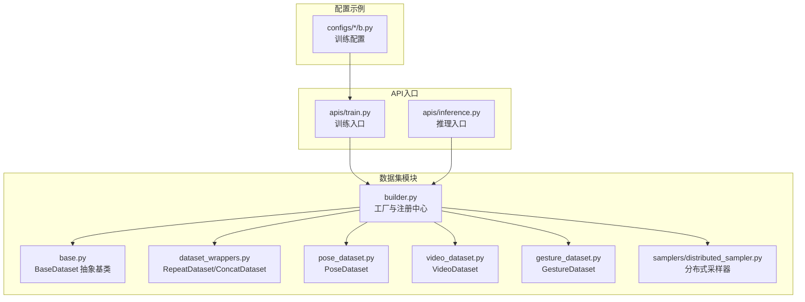
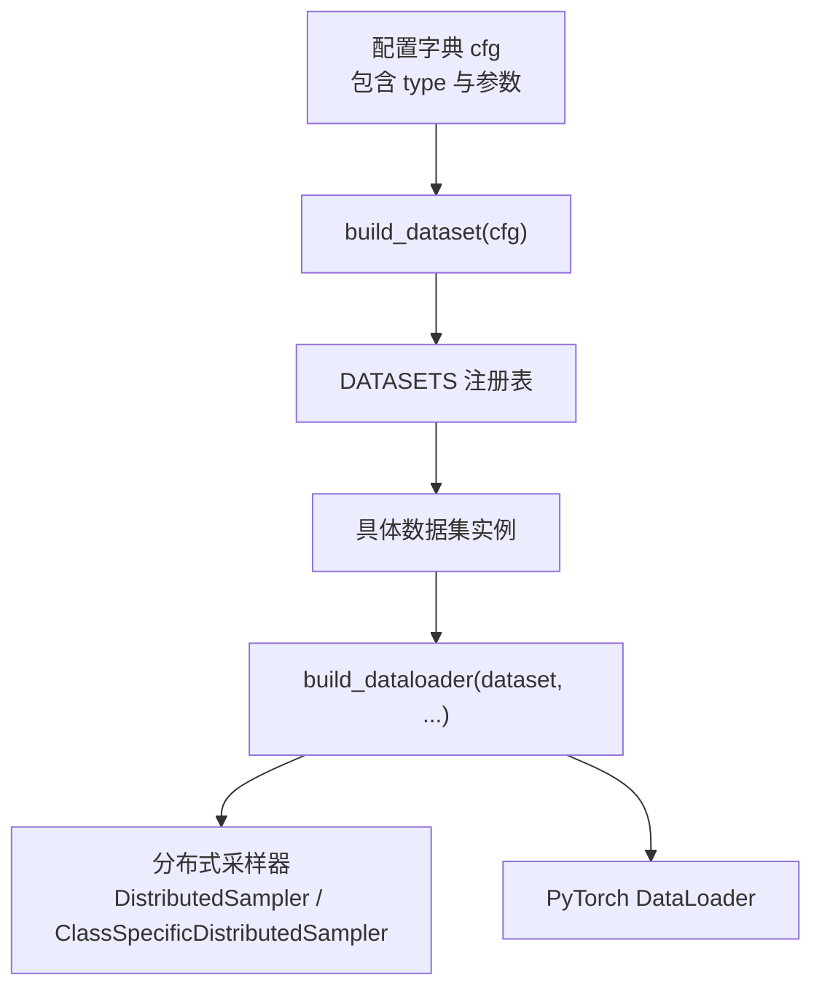
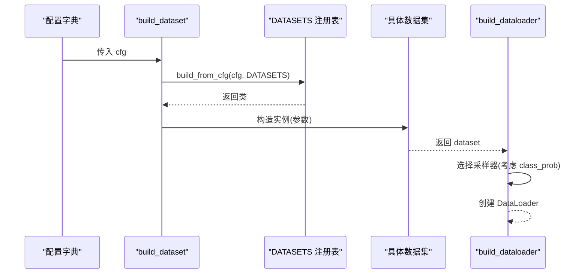
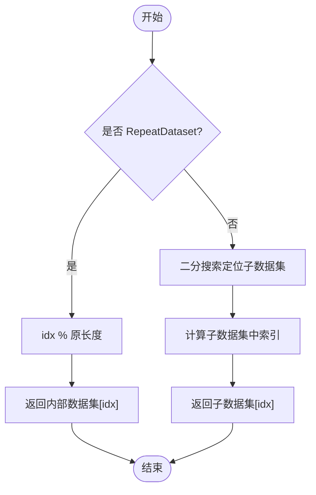
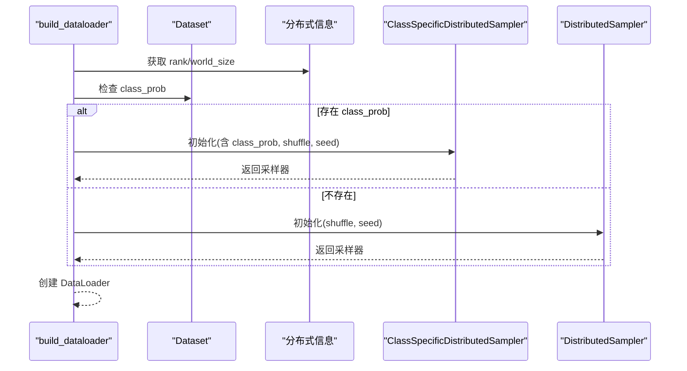
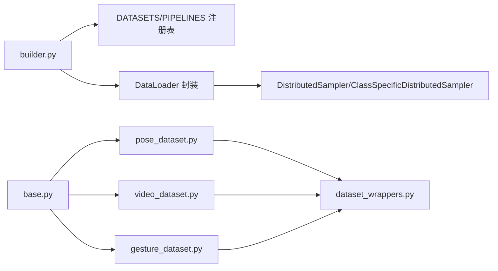

# 数据集工厂

<cite>
**本文引用的文件**
- [pyskl/datasets/__init__.py](file://pyskl/datasets/__init__.py)
- [pyskl/datasets/base.py](file://pyskl/datasets/base.py)
- [pyskl/datasets/builder.py](file://pyskl/datasets/builder.py)
- [pyskl/datasets/dataset_wrappers.py](file://pyskl/datasets/dataset_wrappers.py)
- [pyskl/datasets/pose_dataset.py](file://pyskl/datasets/pose_dataset.py)
- [pyskl/datasets/video_dataset.py](file://pyskl/datasets/video_dataset.py)
- [pyskl/datasets/gesture_dataset.py](file://pyskl/datasets/gesture_dataset.py)
- [pyskl/datasets/samplers/distributed_sampler.py](file://pyskl/datasets/samplers/distributed_sampler.py)
- [pyskl/apis/train.py](file://pyskl/apis/train.py)
- [pyskl/apis/inference.py](file://pyskl/apis/inference.py)
- [configs/aagcn/aagcn_pyskl_ntu60_xsub_3dkp/b.py](file://configs/aagcn/aagcn_pyskl_ntu60_xsub_3dkp/b.py)
- [configs/stgcn/stgcn_pyskl_ntu60_xsub_3dkp/b.py](file://configs/stgcn/stgcn_pyskl_ntu60_xsub_3dkp/b.py)
</cite>

## 目录
1. [简介](#简介)
2. [项目结构](#项目结构)
3. [核心组件](#核心组件)
4. [架构总览](#架构总览)
5. [详细组件分析](#详细组件分析)
6. [依赖关系分析](#依赖关系分析)
7. [性能考量](#性能考量)
8. [故障排除指南](#故障排除指南)
9. [结论](#结论)
10. [附录](#附录)

## 简介
本文件系统性阐述 PySKL 的“数据集工厂”设计与实现，重点覆盖以下主题：
- 数据集构建器（DatasetBuilder）的设计模式与工厂模式应用
- 如何通过配置文件动态创建不同类型的数据库实例
- build_dataset 函数的实现原理：类型识别、参数解析、实例化过程
- 数据集包装器（DatasetWrappers）的设计目的与使用场景：ConcatDataset、RepeatDataset、ClassBalancedDataset（通过 class_prob 体现）
- 数据集注册机制与扩展方法：如何添加自定义数据集类型
- 数据集工厂的配置格式与参数说明
- 数据集构建的完整流程图与代码示例路径
- 在分布式训练与多数据集场景中的应用
- 故障排除与性能优化建议

## 项目结构
围绕“数据集工厂”，核心代码位于 pyskl/datasets 目录，配合 pyskl/apis 提供训练与推理入口；配置示例位于 configs 下各算法目录。

图表来源
- [pyskl/datasets/builder.py](file://pyskl/datasets/builder.py#L22-L45)
- [pyskl/datasets/base.py](file://pyskl/datasets/base.py#L19-L74)
- [pyskl/datasets/dataset_wrappers.py](file://pyskl/datasets/dataset_wrappers.py#L7-L73)
- [pyskl/datasets/pose_dataset.py](file://pyskl/datasets/pose_dataset.py#L10-L58)
- [pyskl/datasets/video_dataset.py](file://pyskl/datasets/video_dataset.py#L8-L40)
- [pyskl/datasets/gesture_dataset.py](file://pyskl/datasets/gesture_dataset.py#L13-L54)
- [pyskl/datasets/samplers/distributed_sampler.py](file://pyskl/datasets/samplers/distributed_sampler.py#L8-L111)
- [pyskl/apis/train.py](file://pyskl/apis/train.py#L13-L87)
- [pyskl/apis/inference.py](file://pyskl/apis/inference.py#L104-L164)
- [configs/aagcn/aagcn_pyskl_ntu60_xsub_3dkp/b.py](file://configs/aagcn/aagcn_pyskl_ntu60_xsub_3dkp/b.py#L37-L46)

章节来源
- [pyskl/datasets/__init__.py](file://pyskl/datasets/__init__.py#L2-L12)
- [pyskl/datasets/builder.py](file://pyskl/datasets/builder.py#L22-L45)

## 核心组件
- 工厂与注册中心（builder.py）
  - DATASETS 注册表：集中管理所有数据集类，支持动态注册与查找
  - PIPELINES 注册表：集中管理数据预处理流水线
  - build_dataset(cfg, default_args=None)：根据配置字典构造具体数据集实例
  - build_dataloader(dataset, ...)：封装 DataLoader，自动选择分布式采样器，并支持类别特定采样
- 抽象基类（base.py）
  - BaseDataset：统一接口与通用能力（加载标注、流水线、评估、缓存等）
- 具体数据集（pose_dataset.py、video_dataset.py、gesture_dataset.py）
  - PoseDataset：骨架数据集，支持 split、valid_ratio、box_thr、class_prob 等
  - VideoDataset：视频帧数据集，支持文本标注文件
  - GestureDataset：手势数据集，支持 split、mode、subset 等
- 数据集包装器（dataset_wrappers.py）
  - RepeatDataset：重复采样，扩大数据集规模
  - ConcatDataset：拼接多个数据集
- 分布式采样器（samplers/distributed_sampler.py）
  - DistributedSampler：标准分布式采样
  - ClassSpecificDistributedSampler：基于类别概率的类别平衡采样，兼容 RepeatDataset

章节来源
- [pyskl/datasets/builder.py](file://pyskl/datasets/builder.py#L22-L45)
- [pyskl/datasets/base.py](file://pyskl/datasets/base.py#L19-L74)
- [pyskl/datasets/pose_dataset.py](file://pyskl/datasets/pose_dataset.py#L10-L58)
- [pyskl/datasets/video_dataset.py](file://pyskl/datasets/video_dataset.py#L8-L40)
- [pyskl/datasets/gesture_dataset.py](file://pyskl/datasets/gesture_dataset.py#L13-L54)
- [pyskl/datasets/dataset_wrappers.py](file://pyskl/datasets/dataset_wrappers.py#L7-L73)
- [pyskl/datasets/samplers/distributed_sampler.py](file://pyskl/datasets/samplers/distributed_sampler.py#L8-L111)

## 架构总览
数据集工厂采用“工厂模式 + 注册机制”的架构，结合 MMEngine 的 Registry 体系，实现配置驱动的数据集构建与数据加载。

图表来源
- [pyskl/datasets/builder.py](file://pyskl/datasets/builder.py#L31-L45)
- [pyskl/datasets/builder.py](file://pyskl/datasets/builder.py#L48-L124)
- [pyskl/datasets/samplers/distributed_sampler.py](file://pyskl/datasets/samplers/distributed_sampler.py#L8-L111)

## 详细组件分析

### 组件A：数据集构建器（DatasetBuilder）与工厂模式
- 设计要点
  - 通过 DATASETS 注册表集中管理数据集类，实现“配置即实例化”
  - build_dataset 接收 cfg（至少包含 type），调用 build_from_cfg 完成实例化
  - build_dataloader 自动选择采样器：若数据集具备 class_prob，则使用类别特定采样器
- 关键流程
  - 配置解析：从 cfg 中提取 type 与参数
  - 类型识别：通过 DATASETS 查找对应类
  - 实例化：调用类构造函数，传入解析后的参数
  - DataLoader 封装：设置分布式采样器、批处理、内存锁页等

图表来源
- [pyskl/datasets/builder.py](file://pyskl/datasets/builder.py#L31-L45)
- [pyskl/datasets/builder.py](file://pyskl/datasets/builder.py#L48-L124)

章节来源
- [pyskl/datasets/builder.py](file://pyskl/datasets/builder.py#L31-L45)
- [pyskl/datasets/builder.py](file://pyskl/datasets/builder.py#L48-L124)

### 组件B：数据集包装器（DatasetWrappers）
- RepeatDataset
  - 目的：当数据加载耗时长而数据集小，通过重复扩大数据集规模，减少跨轮次加载开销
  - 行为：__getitem__ 按原长度取模访问内部数据集；__len__ 返回 times × 原长度
  - 适用：训练阶段提升样本多样性与稳定性
- ConcatDataset
  - 目的：拼接多个数据源，实现多数据集联合训练
  - 行为：__getitem__ 通过前缀和定位目标子数据集；__len__ 返回各子数据集长度之和
  - 适用：跨数据集训练、迁移学习、领域适配

图表来源
- [pyskl/datasets/dataset_wrappers.py](file://pyskl/datasets/dataset_wrappers.py#L32-L38)
- [pyskl/datasets/dataset_wrappers.py](file://pyskl/datasets/dataset_wrappers.py#L65-L69)

章节来源
- [pyskl/datasets/dataset_wrappers.py](file://pyskl/datasets/dataset_wrappers.py#L7-L73)

### 组件C：具体数据集类型与参数
- PoseDataset
  - 关键参数：ann_file、pipeline、split、valid_ratio、box_thr、class_prob、memcached、mc_cfg
  - 特性：支持按 split 过滤、按 box 置信度阈值过滤、类别平衡采样（class_prob）
- VideoDataset
  - 关键参数：ann_file（文本行格式）、pipeline、start_index
  - 特性：支持多标签（multi_class）与单标签标注
- GestureDataset
  - 关键参数：ann_file（pkl）、pipeline、split、valid_frames_thr、squeeze、mode、subset
  - 特性：支持 2D/3D 模式、有效帧阈值过滤、子集筛选

章节来源
- [pyskl/datasets/pose_dataset.py](file://pyskl/datasets/pose_dataset.py#L44-L84)
- [pyskl/datasets/video_dataset.py](file://pyskl/datasets/video_dataset.py#L39-L60)
- [pyskl/datasets/gesture_dataset.py](file://pyskl/datasets/gesture_dataset.py#L39-L103)

### 组件D：分布式训练与类别平衡采样
- build_dataloader
  - 自动检测分布式环境，选择采样器
  - 若数据集具备 class_prob，则使用 ClassSpecificDistributedSampler
- ClassSpecificDistributedSampler
  - 基于类别概率重采样，支持 RepeatDataset 的 times 扩展
  - 保证分布式场景下每卡样本分布与全局一致

图表来源
- [pyskl/datasets/builder.py](file://pyskl/datasets/builder.py#L85-L101)
- [pyskl/datasets/samplers/distributed_sampler.py](file://pyskl/datasets/samplers/distributed_sampler.py#L45-L111)

章节来源
- [pyskl/datasets/builder.py](file://pyskl/datasets/builder.py#L85-L101)
- [pyskl/datasets/samplers/distributed_sampler.py](file://pyskl/datasets/samplers/distributed_sampler.py#L45-L111)

### 组件E：注册机制与扩展方法
- 注册方式
  - 在数据集类上使用 @DATASETS.register_module() 装饰器进行注册
  - 通过 DATASETS 构造函数时自动完成注册
- 扩展步骤
  - 新建数据集类，继承 BaseDataset
  - 在类上添加 @DATASETS.register_module()
  - 在配置中通过 type 指向新类，传入所需参数
- 示例参考
  - PoseDataset、VideoDataset、GestureDataset 的注册与使用

章节来源
- [pyskl/datasets/pose_dataset.py](file://pyskl/datasets/pose_dataset.py#L10-L11)
- [pyskl/datasets/video_dataset.py](file://pyskl/datasets/video_dataset.py#L8-L9)
- [pyskl/datasets/gesture_dataset.py](file://pyskl/datasets/gesture_dataset.py#L13-L14)
- [pyskl/datasets/__init__.py](file://pyskl/datasets/__init__.py#L9-L12)

### 组件F：配置格式与参数说明
- 通用字段
  - type：数据集类型（如 PoseDataset、VideoDataset、RepeatDataset、ConcatDataset）
  - pipeline：数据流水线配置
  - 其他字段由具体数据集类定义
- 典型配置示例（来自 aagcn/stgcn 配置）
  - 训练数据：使用 RepeatDataset 包裹 PoseDataset，times 控制重复倍数
  - 验证/测试数据：直接使用 PoseDataset
  - 评估指标：top_k_accuracy 等
- 参数要点
  - PoseDataset：split、valid_ratio、box_thr、class_prob
  - RepeatDataset：dataset（内部数据集配置）、times、test_mode
  - ConcatDataset：datasets（多个数据集配置列表）、test_mode

章节来源
- [configs/aagcn/aagcn_pyskl_ntu60_xsub_3dkp/b.py](file://configs/aagcn/aagcn_pyskl_ntu60_xsub_3dkp/b.py#L37-L46)
- [configs/stgcn/stgcn_pyskl_ntu60_xsub_3dkp/b.py](file://configs/stgcn/stgcn_pyskl_ntu60_xsub_3dkp/b.py#L37-L46)
- [pyskl/datasets/pose_dataset.py](file://pyskl/datasets/pose_dataset.py#L44-L58)
- [pyskl/datasets/dataset_wrappers.py](file://pyskl/datasets/dataset_wrappers.py#L23-L28)
- [pyskl/datasets/dataset_wrappers.py](file://pyskl/datasets/dataset_wrappers.py#L55-L63)

### 组件G：在分布式训练与多数据集场景中的应用
- 分布式训练
  - 每个 GPU 拥有独立 DataLoader
  - 自动选择 DistributedSampler 或 ClassSpecificDistributedSampler
  - 通过 seed 与 epoch 固定随机性，保证可复现性
- 多数据集场景
  - 使用 ConcatDataset 拼接多个数据集
  - 使用 RepeatDataset 提升小数据集训练效率
  - 通过 class_prob 实现类别平衡采样

章节来源
- [pyskl/datasets/builder.py](file://pyskl/datasets/builder.py#L85-L101)
- [pyskl/datasets/dataset_wrappers.py](file://pyskl/datasets/dataset_wrappers.py#L41-L73)
- [pyskl/apis/train.py](file://pyskl/apis/train.py#L74-L87)

## 依赖关系分析
- 组件耦合
  - builder.py 作为入口，依赖 DATASETS/PIPELINES 注册表与 MMEngine 工具
  - 具体数据集类依赖 base.py 的抽象接口与流水线 Compose
  - 采样器依赖 torch.utils.data.DistributedSampler 并扩展功能
- 外部依赖
  - MMEngine（Registry、build_from_cfg、collate、get_dist_info）
  - PyTorch（DataLoader、DistributedSampler）

图表来源
- [pyskl/datasets/builder.py](file://pyskl/datasets/builder.py#L22-L25)
- [pyskl/datasets/base.py](file://pyskl/datasets/base.py#L16-L17)
- [pyskl/datasets/dataset_wrappers.py](file://pyskl/datasets/dataset_wrappers.py#L4-L4)
- [pyskl/datasets/samplers/distributed_sampler.py](file://pyskl/datasets/samplers/distributed_sampler.py#L5-L5)

章节来源
- [pyskl/datasets/builder.py](file://pyskl/datasets/builder.py#L22-L25)
- [pyskl/datasets/base.py](file://pyskl/datasets/base.py#L16-L17)
- [pyskl/datasets/dataset_wrappers.py](file://pyskl/datasets/dataset_wrappers.py#L4-L4)

## 性能考量
- DataLoader 参数优化
  - persistent_workers：PyTorch>=1.8.0 时启用可减少 worker 重启开销
  - pin_memory：启用锁页内存可加速 GPU 数据传输
  - workers_per_gpu：合理设置以平衡吞吐与内存占用
- 采样策略
  - 使用 RepeatDataset 缓解小数据集加载瓶颈
  - 使用 ClassSpecificDistributedSampler 提升稀有类样本可见性
- I/O 与缓存
  - PoseDataset 支持 memcached 缓存，减少重复读取
- 配置层面
  - 在配置中设置 videos_per_gpu、workers_per_gpu、persistent_workers 等参数

章节来源
- [pyskl/datasets/builder.py](file://pyskl/datasets/builder.py#L56-L124)
- [pyskl/datasets/pose_dataset.py](file://pyskl/datasets/pose_dataset.py#L51-L84)

## 故障排除指南
- 构建失败：缺少 type 或参数不匹配
  - 症状：build_dataset 报错或找不到类
  - 处理：确认配置中包含 type，并确保参数与数据集类签名一致
- 分布式采样异常：类别概率未生效
  - 症状：训练中类别分布不均衡
  - 处理：确保数据集具备 class_prob 属性，且传入 build_dataloader 的 dataset 包含该属性
- 采样器选择错误：未使用类别特定采样器
  - 症状：日志提示使用标准 DistributedSampler
  - 处理：确认数据集类在 __init__ 中设置了 class_prob
- RepeatDataset 与类别平衡冲突
  - 症状：类别权重被 times 放大
  - 处理：ClassSpecificDistributedSampler 已在内部将 class_prob 乘以 times，无需额外处理
- DataLoader 内存不足或句柄过多
  - 症状：资源限制错误
  - 处理：降低 workers_per_gpu，或在非 Windows 系统适当提高 NOFILE 限制（已在 builder.py 中设置）

章节来源
- [pyskl/datasets/builder.py](file://pyskl/datasets/builder.py#L85-L101)
- [pyskl/datasets/samplers/distributed_sampler.py](file://pyskl/datasets/samplers/distributed_sampler.py#L70-L111)
- [pyskl/datasets/builder.py](file://pyskl/datasets/builder.py#L14-L20)

## 结论
PySKL 的数据集工厂以“工厂模式 + 注册机制”为核心，结合 MMEngine 的 Registry 与 DataLoader 封装，实现了高度可配置、可扩展的数据集构建与加载体系。通过 RepeatDataset、ConcatDataset 等包装器与类别特定采样器，能够灵活应对分布式训练与多数据集场景。开发者只需在配置中声明数据集类型与参数，即可快速构建并训练模型；同时，通过 class_prob、RepeatDataset、ConcatDataset 等手段，可有效解决类别不平衡与数据加载瓶颈问题。

## 附录
- API 使用示例（路径）
  - 训练入口：[apis/train.py](file://pyskl/apis/train.py#L74-L87)
  - 推理入口：[apis/inference.py](file://pyskl/apis/inference.py#L104-L164)
  - 配置示例（aagcn）：[configs/aagcn/aagcn_pyskl_ntu60_xsub_3dkp/b.py](file://configs/aagcn/aagcn_pyskl_ntu60_xsub_3dkp/b.py#L37-L46)
  - 配置示例（stgcn）：[configs/stgcn/stgcn_pyskl_ntu60_xsub_3dkp/b.py](file://configs/stgcn/stgcn_pyskl_ntu60_xsub_3dkp/b.py#L37-L46)