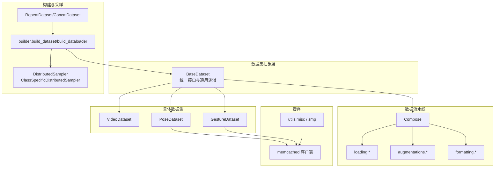
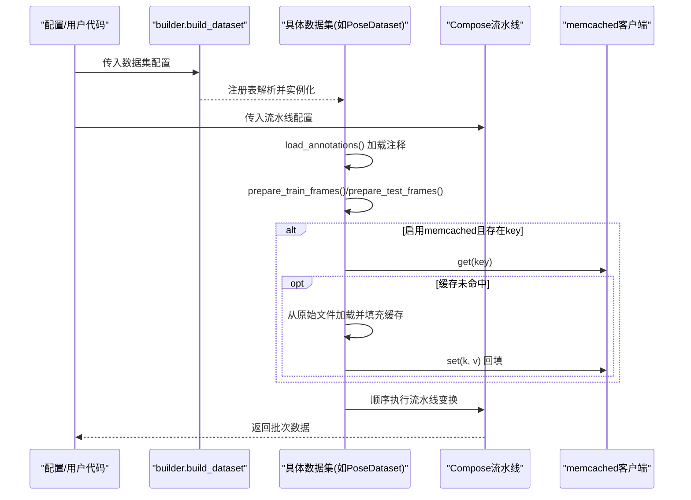
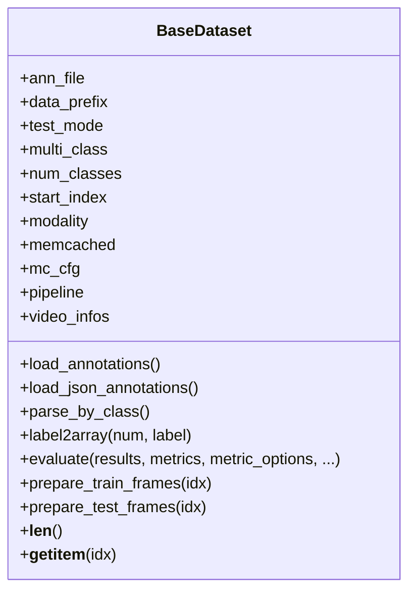
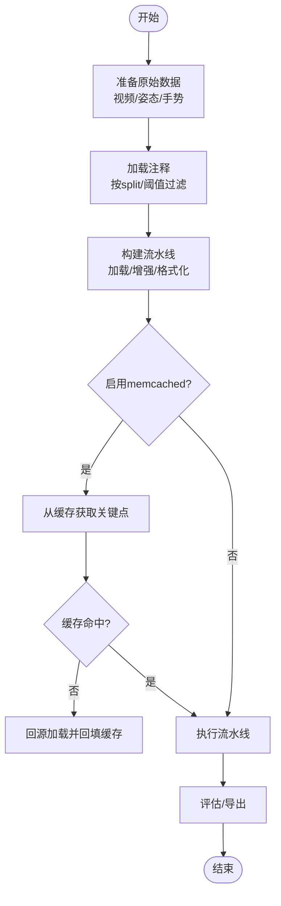
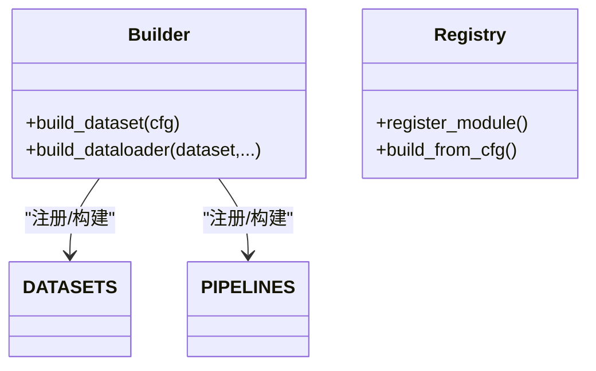
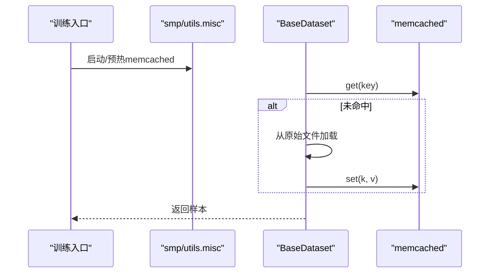
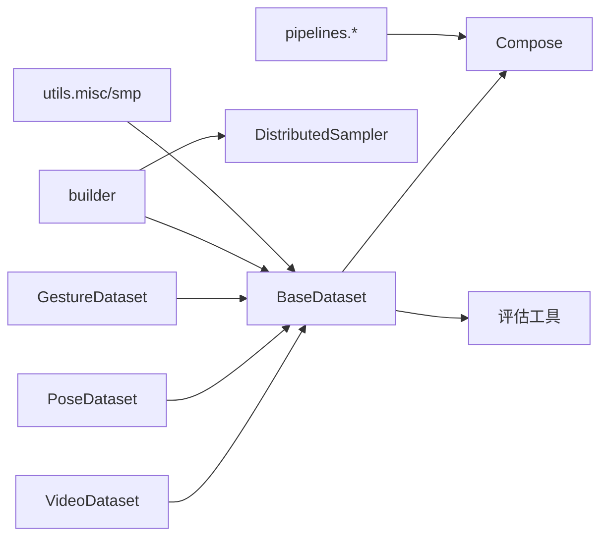

# 数据集模块

<cite>
**本文引用的文件**   
- [pyskl/datasets/base.py](file://pyskl/datasets/base.py)
- [pyskl/datasets/builder.py](file://pyskl/datasets/builder.py)
- [pyskl/datasets/gesture_dataset.py](file://pyskl/datasets/gesture_dataset.py)
- [pyskl/datasets/pose_dataset.py](file://pyskl/datasets/pose_dataset.py)
- [pyskl/datasets/video_dataset.py](file://pyskl/datasets/video_dataset.py)
- [pyskl/datasets/dataset_wrappers.py](file://pyskl/datasets/dataset_wrappers.py)
- [pyskl/datasets/samplers/distributed_sampler.py](file://pyskl/datasets/samplers/distributed_sampler.py)
- [pyskl/datasets/pipelines/__init__.py](file://pyskl/datasets/pipelines/__init__.py)
- [pyskl/datasets/pipelines/compose.py](file://pyskl/datasets/pipelines/compose.py)
- [pyskl/datasets/pipelines/loading.py](file://pyskl/datasets/pipelines/loading.py)
- [pyskl/datasets/pipelines/augmentations.py](file://pyskl/datasets/pipelines/augmentations.py)
- [pyskl/datasets/pipelines/formatting.py](file://pyskl/datasets/pipelines/formatting.py)
- [pyskl/utils/misc.py](file://pyskl/utils/misc.py)
- [pyskl/smp.py](file://pyskl/smp.py)
- [tools/train.py](file://tools/train.py)
- [configs/stgcn/stgcn_pyskl_ntu60_xsub_3dkp/b.py](file://configs/stgcn/stgcn_pyskl_ntu60_xsub_3dkp/b.py)
</cite>

## 目录
1. [简介](#简介)
2. [项目结构](#项目结构)
3. [核心组件](#核心组件)
4. [架构总览](#架构总览)
5. [详细组件分析](#详细组件分析)
6. [依赖关系分析](#依赖关系分析)
7. [性能考量](#性能考量)
8. [故障排查指南](#故障排查指南)
9. [结论](#结论)
10. [附录](#附录)

## 简介
本文件系统化梳理 PySKL 的数据集模块，围绕 BaseDataset 抽象基类的设计理念与接口规范展开，覆盖数据加载、预处理、增强与格式化的一致流程；详解手势数据集、姿态数据集与视频数据集三类数据集的特性与适用场景；给出从原始数据准备到训练数据生成的完整流程；明确骨架数据结构、标签格式与元数据组织规范；提供数据质量检查、缺失与异常数据处理策略；阐述数据集工厂模式与扩展机制；解释 memcached 在大规模数据处理中的缓存应用；最后给出调试与性能优化的实用建议。

## 项目结构
数据集模块采用“抽象基类 + 具体子类 + 流水线 + 构建器 + 采样器”的分层设计：
- 抽象基类：BaseDataset 统一视频/图像数据集的接口与通用能力（加载注释、采样、评估、memcached 缓存）。
- 具体数据集：VideoDataset（视频）、PoseDataset（姿态）、GestureDataset（手势），各自实现注释加载与适配。
- 数据流水线：pipelines 提供加载、增强、格式化等变换，Compose 将其顺序执行。
- 构建器：builder 实现工厂模式，基于注册表动态构建数据集与流水线。
- 采样器：分布式采样与类别特定采样，支持重复/拼接数据集包装器。
- 缓存：memcached 预热与访问，配合 utils 中的工具函数与 smp 集成。

图表来源
- [pyskl/datasets/base.py](file://pyskl/datasets/base.py#L19-L354)
- [pyskl/datasets/video_dataset.py](file://pyskl/datasets/video_dataset.py#L1-L61)
- [pyskl/datasets/pose_dataset.py](file://pyskl/datasets/pose_dataset.py#L1-L107)
- [pyskl/datasets/gesture_dataset.py](file://pyskl/datasets/gesture_dataset.py#L1-L156)
- [pyskl/datasets/pipelines/compose.py](file://pyskl/datasets/pipelines/compose.py#L1-L53)
- [pyskl/datasets/pipelines/loading.py](file://pyskl/datasets/pipelines/loading.py#L1-L185)
- [pyskl/datasets/pipelines/augmentations.py](file://pyskl/datasets/pipelines/augmentations.py#L1-L902)
- [pyskl/datasets/pipelines/formatting.py](file://pyskl/datasets/pipelines/formatting.py#L1-L250)
- [pyskl/datasets/builder.py](file://pyskl/datasets/builder.py#L1-L134)
- [pyskl/datasets/samplers/distributed_sampler.py](file://pyskl/datasets/samplers/distributed_sampler.py#L1-L112)
- [pyskl/datasets/dataset_wrappers.py](file://pyskl/datasets/dataset_wrappers.py#L1-L74)
- [pyskl/utils/misc.py](file://pyskl/utils/misc.py#L1-L82)
- [pyskl/smp.py](file://pyskl/smp.py#L168-L182)

章节来源
- [pyskl/datasets/base.py](file://pyskl/datasets/base.py#L19-L354)
- [pyskl/datasets/builder.py](file://pyskl/datasets/builder.py#L29-L134)

## 核心组件
- BaseDataset：定义数据集统一接口，包括注释加载、训练/测试样本准备、评估与缓存访问；提供按类别分组、标签 one-hot 编码、流水线执行等通用能力。
- 具体数据集：
  - VideoDataset：面向视频文件，注释文件为文本行（路径+标签），支持多标签（多类）。
  - PoseDataset：面向姿态数据，注释为 pickle，包含关键点、置信度、框分数等字段，支持阈值筛选与 memcached 缓存键映射。
  - GestureDataset：面向手势数据，注释为 pickle，支持按 split 过滤、有效帧阈值、2D/3D 模式、子集筛选等。
- 数据流水线：Compose 将一系列变换按序执行；loading 提供视频解码、数组解码；augmentations 提供姿态/图像增强；formatting 负责张量化、重命名、收集与形状格式化。
- 构建器：通过 Registry 动态注册与构建数据集与流水线；build_dataloader 自动选择分布式采样器并构造 DataLoader。
- 采样器：DistributedSampler 与 ClassSpecificDistributedSampler 支持类别特定采样与 RepeatDataset/ConcatDataset 包装。
- 缓存：Pose/Gesture 数据集可启用 memcached，通过 key 从缓存读取关键点，或从原始文件回源填充缓存。

章节来源
- [pyskl/datasets/base.py](file://pyskl/datasets/base.py#L19-L354)
- [pyskl/datasets/video_dataset.py](file://pyskl/datasets/video_dataset.py#L1-L61)
- [pyskl/datasets/pose_dataset.py](file://pyskl/datasets/pose_dataset.py#L1-L107)
- [pyskl/datasets/gesture_dataset.py](file://pyskl/datasets/gesture_dataset.py#L1-L156)
- [pyskl/datasets/pipelines/compose.py](file://pyskl/datasets/pipelines/compose.py#L1-L53)
- [pyskl/datasets/pipelines/loading.py](file://pyskl/datasets/pipelines/loading.py#L1-L185)
- [pyskl/datasets/pipelines/augmentations.py](file://pyskl/datasets/pipelines/augmentations.py#L1-L902)
- [pyskl/datasets/pipelines/formatting.py](file://pyskl/datasets/pipelines/formatting.py#L1-L250)
- [pyskl/datasets/builder.py](file://pyskl/datasets/builder.py#L29-L134)
- [pyskl/datasets/samplers/distributed_sampler.py](file://pyskl/datasets/samplers/distributed_sampler.py#L1-L112)
- [pyskl/datasets/dataset_wrappers.py](file://pyskl/datasets/dataset_wrappers.py#L1-L74)
- [pyskl/utils/misc.py](file://pyskl/utils/misc.py#L1-L82)
- [pyskl/smp.py](file://pyskl/smp.py#L168-L182)

## 架构总览
下面的序列图展示从配置到数据加载与缓存的关键调用链路，体现工厂模式、流水线执行与缓存访问：

图表来源
- [pyskl/datasets/builder.py](file://pyskl/datasets/builder.py#L31-L45)
- [pyskl/datasets/base.py](file://pyskl/datasets/base.py#L262-L354)
- [pyskl/datasets/pipelines/compose.py](file://pyskl/datasets/pipelines/compose.py#L30-L44)
- [pyskl/utils/misc.py](file://pyskl/utils/misc.py#L24-L82)

章节来源
- [pyskl/datasets/builder.py](file://pyskl/datasets/builder.py#L29-L134)
- [pyskl/datasets/base.py](file://pyskl/datasets/base.py#L262-L354)

## 详细组件分析

### BaseDataset 抽象基类
- 设计理念
  - 统一接口：要求子类实现注释加载，并提供训练/测试样本准备方法。
  - 通用能力：支持多标签、标签 one-hot 编码、按类别分组、评估指标（Top-k、平均类准确率、mAP）。
  - 流水线：通过 Compose 将加载、增强、格式化串联，保证数据一致性。
  - 缓存：对姿态数据支持 memcached，通过 key 从缓存读取关键点，失败时回源并回填缓存。
- 关键接口
  - 注释加载：load_annotations（子类必须实现）
  - 通用 JSON 注释加载：load_json_annotations（用于 JSON 格式）
  - 训练/测试样本准备：prepare_train_frames/prepare_test_frames
  - 评估：evaluate（支持多种指标与多模态/多模型输出）
  - 辅助：label2array、parse_by_class
- 流程要点
  - 样本准备阶段：复制样本信息、处理 memcached、注入 modality/start_index、多标签 one-hot、执行流水线。
  - 评估阶段：校验结果格式、支持多模型/多模态输出、自动混合 RGB+Pose 结果（RGBPoseConv3D）。

图表来源
- [pyskl/datasets/base.py](file://pyskl/datasets/base.py#L19-L354)

章节来源
- [pyskl/datasets/base.py](file://pyskl/datasets/base.py#L19-L354)

### 具体数据集类型与适用场景

#### 视频数据集 VideoDataset
- 特点
  - 注释文件为文本行，每行包含视频路径与标签；支持多标签（多类）。
  - 适合直接以视频为输入的任务，如视频分类。
- 关键点
  - 注释加载：根据后缀选择 JSON 或文本行解析。
  - start_index 默认为 0，确保帧索引从 0 开始。

章节来源
- [pyskl/datasets/video_dataset.py](file://pyskl/datasets/video_dataset.py#L1-L61)

#### 姿态数据集 PoseDataset
- 特点
  - 注释为 pickle，包含关键点、置信度、总帧数、分割集合等字段。
  - 支持按 split 过滤、有效帧比例与框置信度阈值筛选。
  - 支持 memcached 缓存，key 为 frame_dir。
- 关键点
  - 注释加载：按 split 过滤；路径拼接 data_prefix。
  - 阈值处理：valid_ratio 与 box_thr 控制有效样本；筛选后保留 anno_inds。
  - 缓存：memcached 启用时，将 frame_dir 作为 key 存入 item。

章节来源
- [pyskl/datasets/pose_dataset.py](file://pyskl/datasets/pose_dataset.py#L1-L107)

#### 手势数据集 GestureDataset
- 特点
  - 注释为 pickle，包含关键点、手部左右/得分、标签等。
  - 支持按 split 过滤、有效帧阈值、2D/3D 模式、子集筛选。
  - 提供专用评估：Top-1/Top-5 与按类别统计。
- 关键点
  - 注释加载：按 split 过滤；路径拼接 data_prefix；支持 squeeze 去除冗余维度。
  - 模式切换：mode='2D' 仅保留 x,y；支持 subset 过滤。
  - 评估：支持按有效帧数量分段统计。

章节来源
- [pyskl/datasets/gesture_dataset.py](file://pyskl/datasets/gesture_dataset.py#L1-L156)

### 数据集构建流程（从原始数据到训练数据）
- 原始数据准备
  - 视频：准备视频文件与文本注释（路径+标签）。
  - 姿态/手势：准备 pickle 注释文件，包含关键点、标签、总帧数、分割集合等。
- 注释加载与过滤
  - VideoDataset：按文本行解析，支持多标签。
  - PoseDataset/GestureDataset：按 split 过滤，必要时按有效帧/置信度阈值筛选。
- 流水线执行
  - DecordInit/ArrayDecode：加载视频/数组帧。
  - 增强：随机裁剪、缩放、翻转、归一化等。
  - 格式化：张量化、重命名、收集、形状格式化（NCTHW/NCHW）。
- 缓存（可选）
  - 启用 memcached 时，先从缓存读取关键点；未命中则回源并回填缓存。
- 评估与导出
  - 评估：支持 Top-k、平均类准确率、mAP。
  - 导出：支持 JSON/YAML/Pickle 输出。

图表来源
- [pyskl/datasets/base.py](file://pyskl/datasets/base.py#L262-L354)
- [pyskl/datasets/pipelines/loading.py](file://pyskl/datasets/pipelines/loading.py#L1-L185)
- [pyskl/datasets/pipelines/augmentations.py](file://pyskl/datasets/pipelines/augmentations.py#L1-L902)
- [pyskl/datasets/pipelines/formatting.py](file://pyskl/datasets/pipelines/formatting.py#L1-L250)
- [pyskl/utils/misc.py](file://pyskl/utils/misc.py#L24-L82)

章节来源
- [pyskl/datasets/base.py](file://pyskl/datasets/base.py#L262-L354)
- [pyskl/datasets/pipelines/loading.py](file://pyskl/datasets/pipelines/loading.py#L1-L185)
- [pyskl/datasets/pipelines/augmentations.py](file://pyskl/datasets/pipelines/augmentations.py#L1-L902)
- [pyskl/datasets/pipelines/formatting.py](file://pyskl/datasets/pipelines/formatting.py#L1-L250)

### 数据格式规范
- 姿态数据结构（pickle 注释）
  - 关键字段：frame_dir/filename、total_frames、label、keypoint、keypoint_score、box_score、valid 等。
  - keypoint 形状通常为 [T, J, C] 或更高维，依据具体数据集布局。
- 标签格式
  - 单标签：label 为整数。
  - 多标签：label 为列表，BaseDataset 支持 one-hot 编码。
- 元数据组织
  - 分割集合：split 字典包含 train/val/test 等集合标识。
  - 有效帧/置信度：valid_ratio、box_thr 用于筛选有效样本。
- 视频数据结构（文本注释）
  - 每行：路径 + 标签；多标签时标签为多个整数。

章节来源
- [pyskl/datasets/pose_dataset.py](file://pyskl/datasets/pose_dataset.py#L17-L39)
- [pyskl/datasets/gesture_dataset.py](file://pyskl/datasets/gesture_dataset.py#L58-L103)
- [pyskl/datasets/video_dataset.py](file://pyskl/datasets/video_dataset.py#L15-L27)

### 数据质量检查、缺失与异常处理
- 有效帧阈值
  - GestureDataset：valid_frames_thr 过滤短片段；squeeze 去除无效帧维度。
  - PoseDataset：valid_ratio 与 box_thr 控制有效帧比例与框置信度。
- 异常数据过滤
  - 通过注释字段断言与筛选（如 total_frames 一致性、keypoint 维度）。
- 缺失数据处理
  - memcached 未命中时回源加载并回填缓存，确保后续快速访问。
- 评估阶段保护
  - BaseDataset.evaluate 对结果格式进行严格校验，支持多模型/多模态输出。

章节来源
- [pyskl/datasets/gesture_dataset.py](file://pyskl/datasets/gesture_dataset.py#L75-L103)
- [pyskl/datasets/pose_dataset.py](file://pyskl/datasets/pose_dataset.py#L66-L84)
- [pyskl/datasets/base.py](file://pyskl/datasets/base.py#L112-L241)

### 数据集工厂模式与扩展机制
- 工厂模式
  - DATASETS 与 PIPELINES Registry：通过 register_module 注册，build_from_cfg 解析配置并实例化。
  - build_dataset：从配置字典构建数据集实例。
  - build_dataloader：自动选择分布式采样器并构造 DataLoader。
- 扩展机制
  - 新增数据集：继承 BaseDataset 并实现 load_annotations；通过 @DATASETS.register_module() 注册。
  - 新增流水线：在 pipelines 下新增变换并通过 @PIPELINES.register_module() 注册，配置中直接引用。
  - 包装器：RepeatDataset/ConcatDataset 支持重复与拼接，便于扩增与多源训练。

图表来源
- [pyskl/datasets/builder.py](file://pyskl/datasets/builder.py#L29-L134)

章节来源
- [pyskl/datasets/builder.py](file://pyskl/datasets/builder.py#L29-L134)
- [pyskl/datasets/dataset_wrappers.py](file://pyskl/datasets/dataset_wrappers.py#L1-L74)

### memcached 缓存机制
- 应用场景
  - 姿态数据集（Pose/Gesture）在大规模数据加载时显著提升性能。
- 预热与启动
  - smp 与 utils.misc 提供 mc_on、mp_cache、mp_cache_single 等工具，支持批量预热。
  - 训练入口 tools/train.py 在需要时启动本地 memcached 并进行预热。
- 访问流程
  - BaseDataset.prepare_*_frames 在启用 memcached 时，先尝试 get(key)，未命中则回源加载并 set(k,v)。
- 注意事项
  - mc_cfg 默认为 ('localhost', 22077)，需确保端口可用与内存充足。

图表来源
- [pyskl/utils/misc.py](file://pyskl/utils/misc.py#L18-L82)
- [pyskl/smp.py](file://pyskl/smp.py#L168-L182)
- [tools/train.py](file://tools/train.py#L142-L164)
- [pyskl/datasets/base.py](file://pyskl/datasets/base.py#L262-L354)

章节来源
- [pyskl/utils/misc.py](file://pyskl/utils/misc.py#L18-L82)
- [pyskl/smp.py](file://pyskl/smp.py#L168-L182)
- [tools/train.py](file://tools/train.py#L142-L164)
- [pyskl/datasets/base.py](file://pyskl/datasets/base.py#L262-L354)

### 数据集调试与性能优化实用技巧
- 调试
  - 逐步验证流水线：先不启用增强，确认加载与格式化无误后再加入增强。
  - 检查注释字段：确保 total_frames、keypoint 维度、label 类型一致。
  - 评估输出：使用 BaseDataset.evaluate 的日志输出定位问题。
- 性能
  - 启用 memcached：对姿态数据集收益显著；使用 mp_cache 批量预热。
  - 选择高效解码：DecordDecode 的 accurate/efficient 模式按需求选择。
  - 合理批大小与工作进程：build_dataloader 的 videos_per_gpu 与 workers_per_gpu 根据显存与 CPU 资源调整。
  - 分布式采样：ClassSpecificDistributedSampler 用于类别不平衡场景。

章节来源
- [pyskl/datasets/base.py](file://pyskl/datasets/base.py#L112-L241)
- [pyskl/datasets/pipelines/loading.py](file://pyskl/datasets/pipelines/loading.py#L77-L137)
- [pyskl/datasets/builder.py](file://pyskl/datasets/builder.py#L48-L124)
- [pyskl/datasets/samplers/distributed_sampler.py](file://pyskl/datasets/samplers/distributed_sampler.py#L45-L112)

## 依赖关系分析
- 组件耦合
  - BaseDataset 依赖 Compose 与评估工具；具体数据集依赖注释加载与路径拼接。
  - builder 依赖 Registry 与分布式工具；samplers 依赖 torch.utils.data。
  - pipelines 通过 @PIPELINES.register_module() 与 builder 的 PIPELINES Registry 解耦。
- 外部依赖
  - Decord 用于视频解码；pymemcache 用于 memcached 客户端；MMCV 提供文件/并行工具。

图表来源
- [pyskl/datasets/base.py](file://pyskl/datasets/base.py#L19-L354)
- [pyskl/datasets/builder.py](file://pyskl/datasets/builder.py#L29-L134)
- [pyskl/datasets/pipelines/compose.py](file://pyskl/datasets/pipelines/compose.py#L1-L53)
- [pyskl/datasets/samplers/distributed_sampler.py](file://pyskl/datasets/samplers/distributed_sampler.py#L1-L112)
- [pyskl/utils/misc.py](file://pyskl/utils/misc.py#L1-L82)

章节来源
- [pyskl/datasets/base.py](file://pyskl/datasets/base.py#L19-L354)
- [pyskl/datasets/builder.py](file://pyskl/datasets/builder.py#L29-L134)

## 性能考量
- I/O 与解码
  - Decord 解码模式：accurate 更精确但较慢，efficient 更快但可能非关键帧。
  - ArrayDecode 适用于已加载到内存的数组，减少磁盘 I/O。
- 内存与缓存
  - memcached 预热可显著降低重复读取开销；注意内存容量与端口占用。
- 并行与采样
  - 多进程 workers_per_gpu 与 pin_memory 提升数据传输效率。
  - 分布式采样器在多卡场景下均衡数据分布，ClassSpecificDistributedSampler 适配类别不平衡。

[本节为通用指导，无需列出章节来源]

## 故障排查指南
- 注释格式错误
  - 确认注释后缀与解析逻辑匹配（JSON vs 文本行）。
  - 检查路径拼接是否正确（data_prefix）。
- 姿态数据异常
  - keypoint 维度不一致、total_frames 与实际不符、box_score 缺失。
- memcached 未命中/连接失败
  - 检查 mc_cfg 端口、服务状态；必要时重新预热。
- 评估报错
  - 结果长度与数据集长度不一致、指标名称非法、多模型/多模态键不匹配。

章节来源
- [pyskl/datasets/video_dataset.py](file://pyskl/datasets/video_dataset.py#L42-L60)
- [pyskl/datasets/pose_dataset.py](file://pyskl/datasets/pose_dataset.py#L86-L107)
- [pyskl/datasets/gesture_dataset.py](file://pyskl/datasets/gesture_dataset.py#L105-L156)
- [pyskl/datasets/base.py](file://pyskl/datasets/base.py#L112-L241)
- [pyskl/utils/misc.py](file://pyskl/utils/misc.py#L24-L82)

## 结论
PySKL 数据集模块以 BaseDataset 为核心，结合流水线化处理、工厂模式与分布式采样，形成一套可扩展、高性能的数据处理体系。通过 memcached 缓存与合理的数据格式规范，能够有效支撑大规模姿态/手势/视频数据的训练与评估。建议在实际工程中优先启用缓存、合理配置流水线与采样策略，并在调试阶段逐步验证各环节。

[本节为总结性内容，无需列出章节来源]

## 附录
- 示例配置参考（姿态数据集）
  - 配置文件展示了姿态数据集的流水线组成（预归一化、生成骨架特征、均匀采样、解码、格式化、收集与张量化）与数据划分（xsub_train/xsub_val）。

章节来源
- [configs/stgcn/stgcn_pyskl_ntu60_xsub_3dkp/b.py](file://configs/stgcn/stgcn_pyskl_ntu60_xsub_3dkp/b.py#L1-L61)