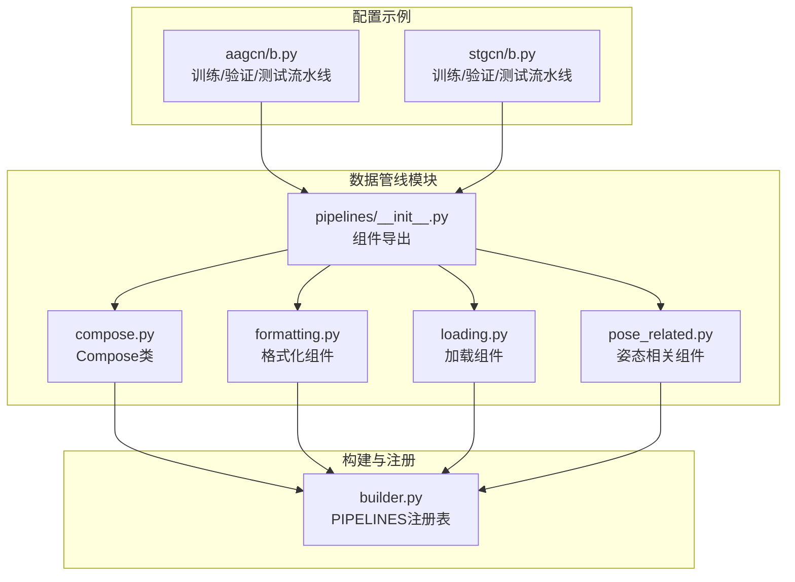
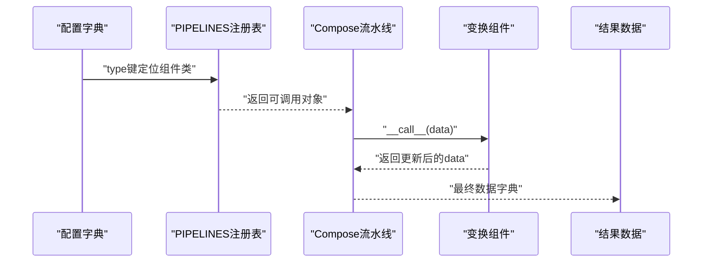
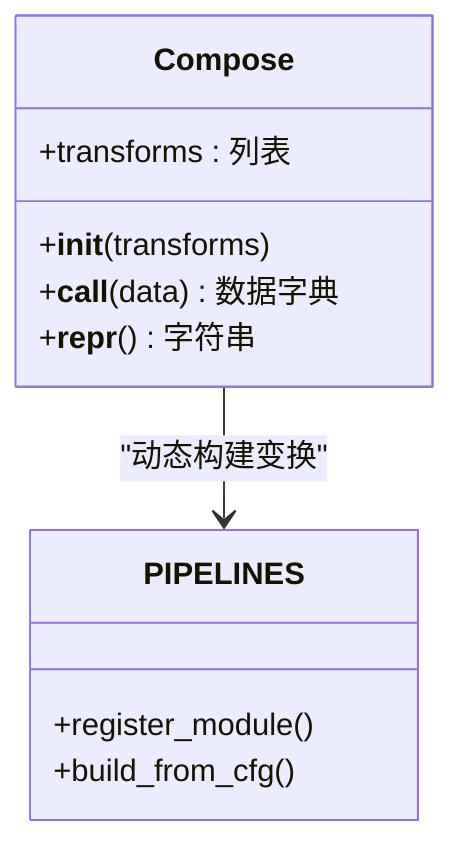
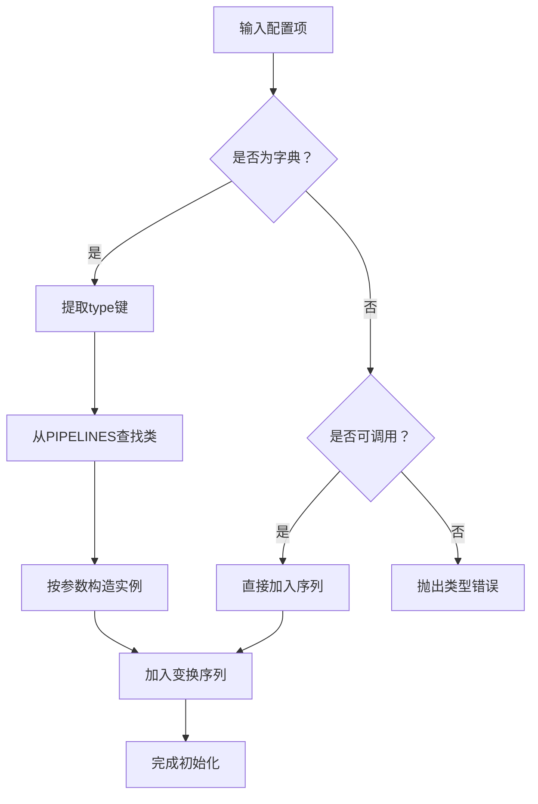
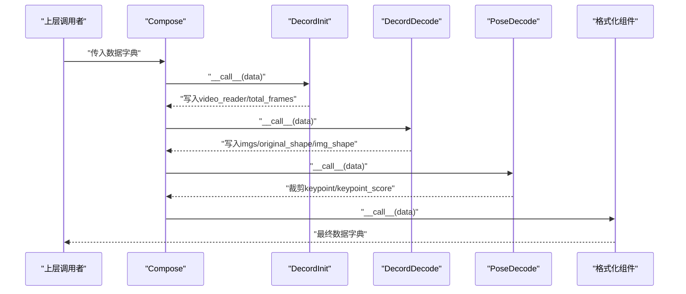
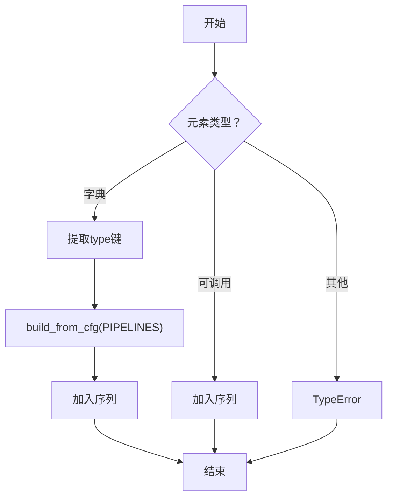
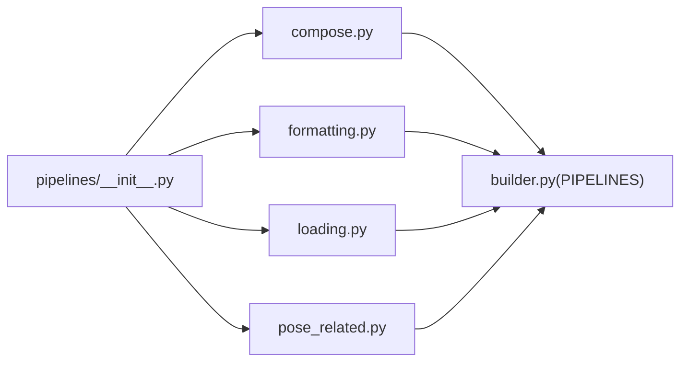

# 基础流水线组件

<cite>
**本文引用的文件**
- [pyskl/datasets/pipelines/compose.py](file://pyskl/datasets/pipelines/compose.py)
- [pyskl/datasets/builder.py](file://pyskl/datasets/builder.py)
- [pyskl/datasets/pipelines/__init__.py](file://pyskl/datasets/pipelines/__init__.py)
- [pyskl/datasets/pipelines/formatting.py](file://pyskl/datasets/pipelines/formatting.py)
- [pyskl/datasets/pipelines/loading.py](file://pyskl/datasets/pipelines/loading.py)
- [pyskl/datasets/pipelines/pose_related.py](file://pyskl/datasets/pipelines/pose_related.py)
- [configs/aagcn/aagcn_pyskl_ntu120_xset_3dkp/b.py](file://configs/aagcn/aagcn_pyskl_ntu120_xset_3dkp/b.py)
- [configs/stgcn/stgcn_pyskl_ntu60_xsub_3dkp/b.py](file://configs/stgcn/stgcn_pyskl_ntu60_xsub_3dkp/b.py)
</cite>

## 目录
1. [简介](#简介)
2. [项目结构](#项目结构)
3. [核心组件](#核心组件)
4. [架构总览](#架构总览)
5. [详细组件分析](#详细组件分析)
6. [依赖关系分析](#依赖关系分析)
7. [性能考量](#性能考量)
8. [故障排查指南](#故障排查指南)
9. [结论](#结论)
10. [附录](#附录)

## 简介
本文件聚焦于PySKL的数据预处理流水线基础组件，系统性解析Compose类的设计与实现、PIPELINES注册表的工作机制、流水线的构建与调用流程、数据字典的状态管理与参数传递方式，并给出调试与错误处理的最佳实践。读者无需深入源码即可理解如何通过配置字典动态构建变换对象，以及如何在流水线中正确传递与维护数据状态。

## 项目结构
围绕“流水线”主题，核心代码分布在以下位置：
- 流水线编排：pyskl/datasets/pipelines/compose.py
- 注册表与构建：pyskl/datasets/builder.py
- 流水线组件导出：pyskl/datasets/pipelines/__init__.py
- 典型变换组件（格式化、加载、姿态相关等）：pyskl/datasets/pipelines/formatting.py、loading.py、pose_related.py
- 配置示例：configs/aagcn/.../b.py、configs/stgcn/.../b.py

图表来源
- [pyskl/datasets/pipelines/compose.py](file://pyskl/datasets/pipelines/compose.py#L1-L53)
- [pyskl/datasets/builder.py](file://pyskl/datasets/builder.py#L25-L25)
- [pyskl/datasets/pipelines/__init__.py](file://pyskl/datasets/pipelines/__init__.py#L1-L10)
- [pyskl/datasets/pipelines/formatting.py](file://pyskl/datasets/pipelines/formatting.py#L1-L200)
- [pyskl/datasets/pipelines/loading.py](file://pyskl/datasets/pipelines/loading.py#L1-L185)
- [pyskl/datasets/pipelines/pose_related.py](file://pyskl/datasets/pipelines/pose_related.py#L1-L200)
- [configs/aagcn/aagcn_pyskl_ntu120_xset_3dkp/b.py](file://configs/aagcn/aagcn_pyskl_ntu120_xset_3dkp/b.py#L10-L36)
- [configs/stgcn/stgcn_pyskl_ntu60_xsub_3dkp/b.py](file://configs/stgcn/stgcn_pyskl_ntu60_xsub_3dkp/b.py#L10-L36)

章节来源
- [pyskl/datasets/pipelines/compose.py](file://pyskl/datasets/pipelines/compose.py#L1-L53)
- [pyskl/datasets/builder.py](file://pyskl/datasets/builder.py#L1-L134)
- [pyskl/datasets/pipelines/__init__.py](file://pyskl/datasets/pipelines/__init__.py#L1-L10)

## 核心组件
- Compose：将一系列变换按序组合为流水线，支持“配置字典”和“可调用对象”两种输入形式；流水线以数据字典为载体，逐个执行变换并维护状态。
- PIPELINES注册表：基于MMCV的Registry，统一管理数据预处理组件，支持通过配置字典动态实例化组件。
- 典型变换组件：如格式化（ToTensor、Collect等）、视频/数组帧加载（DecordInit、DecordDecode、ArrayDecode）、姿态解码与预处理（PoseDecode、PreNormalize2D等）。

章节来源
- [pyskl/datasets/pipelines/compose.py](file://pyskl/datasets/pipelines/compose.py#L8-L53)
- [pyskl/datasets/builder.py](file://pyskl/datasets/builder.py#L25-L25)
- [pyskl/datasets/pipelines/formatting.py](file://pyskl/datasets/pipelines/formatting.py#L30-L158)
- [pyskl/datasets/pipelines/loading.py](file://pyskl/datasets/pipelines/loading.py#L10-L185)
- [pyskl/datasets/pipelines/pose_related.py](file://pyskl/datasets/pipelines/pose_related.py#L12-L49)

## 架构总览
下图展示了从配置到运行时流水线的全链路：配置字典经由PIPELINES注册表动态构建为可调用对象序列，再由Compose串行执行，最终输出标准化的数据字典。

图表来源
- [pyskl/datasets/builder.py](file://pyskl/datasets/builder.py#L25-L25)
- [pyskl/datasets/pipelines/compose.py](file://pyskl/datasets/pipelines/compose.py#L17-L44)

## 详细组件分析

### Compose类设计与实现
- 组合方式
  - 接收一个有序列表作为变换序列，元素可以是“配置字典”或“可调用对象”。
  - 对于配置字典，使用build_from_cfg结合PIPELINES注册表进行实例化；对于可调用对象，直接加入序列。
- 执行顺序
  - 严格按顺序迭代执行每个变换，前一个变换的输出作为下一个变换的输入。
  - 若任一变换返回None，则立即短路返回None，避免后续无效处理。
- 可视化类图

图表来源
- [pyskl/datasets/pipelines/compose.py](file://pyskl/datasets/pipelines/compose.py#L8-L53)
- [pyskl/datasets/builder.py](file://pyskl/datasets/builder.py#L25-L25)

章节来源
- [pyskl/datasets/pipelines/compose.py](file://pyskl/datasets/pipelines/compose.py#L17-L44)

### PIPELINES注册表工作机制
- 注册与查找
  - PIPELINES是一个Registry实例，用于注册所有数据预处理组件。
  - 通过装饰器@PIPELINES.register_module()完成注册；通过build_from_cfg根据type键从注册表中查找并构造实例。
- 动态构建流程
  - 在Compose的构造阶段，对每个配置项调用build_from_cfg，将type对应的组件类实例化，从而实现“配置即代码”的灵活装配。
- 可视化流程图

图表来源
- [pyskl/datasets/pipelines/compose.py](file://pyskl/datasets/pipelines/compose.py#L17-L28)
- [pyskl/datasets/builder.py](file://pyskl/datasets/builder.py#L25-L25)

章节来源
- [pyskl/datasets/builder.py](file://pyskl/datasets/builder.py#L25-L25)
- [pyskl/datasets/pipelines/compose.py](file://pyskl/datasets/pipelines/compose.py#L17-L28)

### 流水线调用机制与数据字典状态管理
- 调用机制
  - Compose.__call__接收一个数据字典，依次传入每个变换；每个变换负责读取所需字段并对结果进行增删改。
- 参数传递
  - 通过数据字典共享状态，例如DecordInit设置video_reader与total_frames，DecordDecode读取frame_inds并写入imgs与形状信息；PoseDecode根据frame_inds裁剪关键点。
- 状态管理
  - 变换之间通过约定的键名协同工作；若某变换返回None，流水线会提前终止，避免后续步骤对空数据进行处理。
- 可视化序列图

图表来源
- [pyskl/datasets/pipelines/loading.py](file://pyskl/datasets/pipelines/loading.py#L47-L133)
- [pyskl/datasets/pipelines/pose_related.py](file://pyskl/datasets/pipelines/pose_related.py#L28-L45)
- [pyskl/datasets/pipelines/formatting.py](file://pyskl/datasets/pipelines/formatting.py#L132-L152)
- [pyskl/datasets/pipelines/compose.py](file://pyskl/datasets/pipelines/compose.py#L30-L44)

章节来源
- [pyskl/datasets/pipelines/loading.py](file://pyskl/datasets/pipelines/loading.py#L47-L133)
- [pyskl/datasets/pipelines/pose_related.py](file://pyskl/datasets/pipelines/pose_related.py#L28-L45)
- [pyskl/datasets/pipelines/formatting.py](file://pyskl/datasets/pipelines/formatting.py#L132-L152)
- [pyskl/datasets/pipelines/compose.py](file://pyskl/datasets/pipelines/compose.py#L30-L44)

### 可调用对象与配置字典的处理逻辑
- 可调用对象
  - 直接加入变换序列，无需额外解析，适合内联定义或外部注入的轻量逻辑。
- 配置字典
  - 必须包含type键，指向已注册的组件类；其余键值作为构造参数传入组件。
- 类型校验
  - 若既非字典也非可调用对象，抛出类型错误，提示必须为可调用或字典。
- 可视化流程图

图表来源
- [pyskl/datasets/pipelines/compose.py](file://pyskl/datasets/pipelines/compose.py#L17-L28)

章节来源
- [pyskl/datasets/pipelines/compose.py](file://pyskl/datasets/pipelines/compose.py#L17-L28)

### 典型流水线组件与职责
- DecordInit/DecordDecode/ArrayDecode：负责视频/数组帧的初始化与解码，生成imgs及原始/输入形状等元信息。
- PoseDecode：根据frame_inds裁剪关键点与得分，支撑后续骨架网络输入。
- ToTensor/Collect/FormatShape：将数据转换为张量、收集必要键、调整输入形状，适配模型输入格式。
- PreNormalize2D等：对关键点进行归一化、旋转、尺度扰动等增强与预处理。

章节来源
- [pyskl/datasets/pipelines/loading.py](file://pyskl/datasets/pipelines/loading.py#L10-L185)
- [pyskl/datasets/pipelines/pose_related.py](file://pyskl/datasets/pipelines/pose_related.py#L12-L49)
- [pyskl/datasets/pipelines/formatting.py](file://pyskl/datasets/pipelines/formatting.py#L30-L158)

### 配置驱动的流水线构建示例
- 训练/验证/测试流水线均以列表形式定义，每项为配置字典，包含type与组件所需的参数。
- 示例路径
  - [configs/aagcn/aagcn_pyskl_ntu120_xset_3dkp/b.py](file://configs/aagcn/aagcn_pyskl_ntu120_xset_3dkp/b.py#L10-L36)
  - [configs/stgcn/stgcn_pyskl_ntu60_xsub_3dkp/b.py](file://configs/stgcn/stgcn_pyskl_ntu60_xsub_3dkp/b.py#L10-L36)

章节来源
- [configs/aagcn/aagcn_pyskl_ntu120_xset_3dkp/b.py](file://configs/aagcn/aagcn_pyskl_ntu120_xset_3dkp/b.py#L10-L36)
- [configs/stgcn/stgcn_pyskl_ntu60_xsub_3dkp/b.py](file://configs/stgcn/stgcn_pyskl_ntu60_xsub_3dkp/b.py#L10-L36)

## 依赖关系分析
- 组件导出
  - pipelines/__init__.py集中导出各模块中的组件，便于上层按需引入。
- 组件间耦合
  - 变换组件之间通过数据字典的键名约定弱耦合；Compose仅负责编排与顺序控制。
- 外部依赖
  - 依赖MMCV的Registry与build_from_cfg实现动态构建；依赖NumPy/SciPy等进行数值计算。

图表来源
- [pyskl/datasets/pipelines/__init__.py](file://pyskl/datasets/pipelines/__init__.py#L1-L10)
- [pyskl/datasets/builder.py](file://pyskl/datasets/builder.py#L25-L25)
- [pyskl/datasets/pipelines/compose.py](file://pyskl/datasets/pipelines/compose.py#L5-L5)

章节来源
- [pyskl/datasets/pipelines/__init__.py](file://pyskl/datasets/pipelines/__init__.py#L1-L10)
- [pyskl/datasets/builder.py](file://pyskl/datasets/builder.py#L25-L25)

## 性能考量
- 顺序执行与短路：Compose在遇到None时立即返回，避免无效计算。
- I/O与解码：DecordInit/DecordDecode涉及外部I/O与解码，建议合理设置frame_inds与解码模式，减少不必要的帧读取。
- 形状与类型转换：ToTensor与FormatShape等操作尽量在流水线末尾集中进行，减少中间重复转换。
- 批处理与采样：结合数据加载器的collate策略，确保批次维度与模型输入格式一致。

## 故障排查指南
- 常见类型错误
  - 变换元素既不是字典也不是可调用对象：检查配置项的type键是否存在且拼写正确；确认自定义组件是否实现__call__。
  - 解码失败或键缺失：确认DecordInit/DecordDecode所需的键（如filename、frame_inds、video_reader）是否在上游阶段正确写入。
- 状态异常
  - 形状不匹配：检查FormatShape的input_format与后续组件期望一致；确认FormatGCNInput等是否正确设置num_person等参数。
  - 关键点为空：当PoseDecode返回空骨架时，检查frame_inds范围与offset是否合理，以及PreNormalize等前置步骤是否正确。
- 调试建议
  - 在流水线关键节点打印数据字典的键集合，核对字段是否按预期增删改。
  - 将复杂流水线拆分为小段，逐步验证每个变换的输入输出。
  - 使用最小配置复现问题，排除无关因素。

章节来源
- [pyskl/datasets/pipelines/compose.py](file://pyskl/datasets/pipelines/compose.py#L26-L28)
- [pyskl/datasets/pipelines/loading.py](file://pyskl/datasets/pipelines/loading.py#L54-L67)
- [pyskl/datasets/pipelines/pose_related.py](file://pyskl/datasets/pipelines/pose_related.py#L30-L45)

## 结论
Compose与PIPELINES共同构成了PySKL数据预处理的基础设施：前者负责顺序编排与状态传递，后者负责组件的动态注册与实例化。通过配置字典，用户可以灵活组合多种变换，形成可复用、可扩展的流水线。遵循键名约定与顺序规范，配合合理的调试策略，能够高效地构建高质量的数据预处理流程。

## 附录
- 组件导出清单参考：pipelines/__init__.py集中导出了Augmentations、Compose、Formatting、Loading、PoseRelated、Sampling等模块中的组件，便于统一导入与使用。
- 配置示例参考：aagcn与stgcn配置文件展示了训练/验证/测试三套流水线的典型组合，可作为模板快速搭建新任务。

章节来源
- [pyskl/datasets/pipelines/__init__.py](file://pyskl/datasets/pipelines/__init__.py#L1-L10)
- [configs/aagcn/aagcn_pyskl_ntu120_xset_3dkp/b.py](file://configs/aagcn/aagcn_pyskl_ntu120_xset_3dkp/b.py#L10-L36)
- [configs/stgcn/stgcn_pyskl_ntu60_xsub_3dkp/b.py](file://configs/stgcn/stgcn_pyskl_ntu60_xsub_3dkp/b.py#L10-L36)