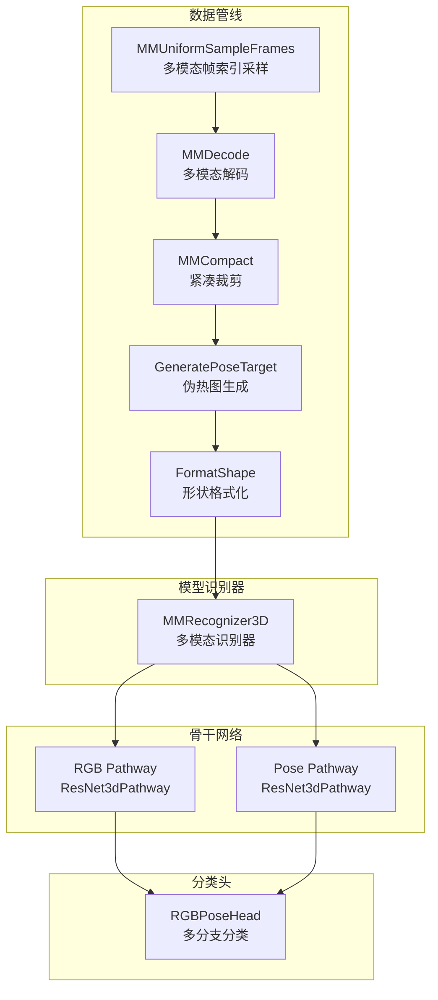
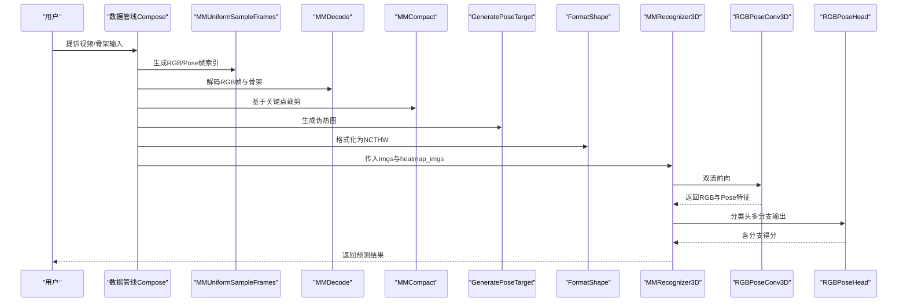
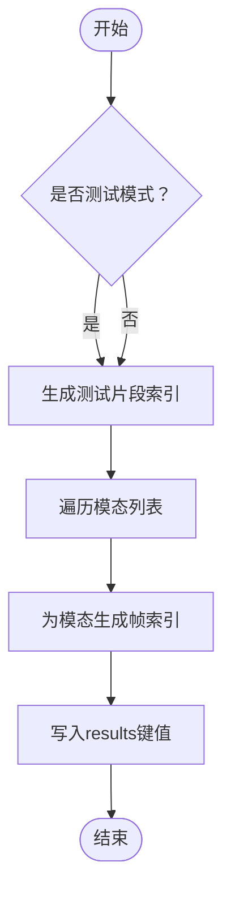
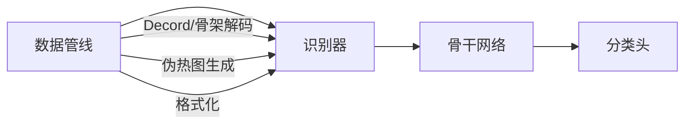

# 多模态处理组件

<cite>
**本文引用的文件**
- [multi_modality.py](file://pyskl/datasets/pipelines/multi_modality.py)
- [mm_recognizer3d.py](file://pyskl/models/recognizers/mm_recognizer3d.py)
- [builder.py](file://pyskl/datasets/builder.py)
- [builder.py](file://pyskl/models/builder.py)
- [inference.py](file://pyskl/apis/inference.py)
- [loading.py](file://pyskl/datasets/pipelines/loading.py)
- [pose_related.py](file://pyskl/datasets/pipelines/pose_related.py)
- [rgbpose_head.py](file://pyskl/models/heads/rgbpose_head.py)
- [rgbpose_conv3d.py](file://pyskl/models/cnns/rgbposeconv3d.py)
- [formatting.py](file://pyskl/datasets/pipelines/formatting.py)
- [heatmap_related.py](file://pyskl/datasets/pipelines/heatmap_related.py)
- [rgbpose_conv3d.py](file://configs/rgbpose_conv3d/rgbpose_conv3d.py)
- [demo_skeleton.py](file://demo/demo_skeleton.py)
</cite>

## 目录
1. [简介](#简介)
2. [项目结构](#项目结构)
3. [核心组件](#核心组件)
4. [架构总览](#架构总览)
5. [详细组件分析](#详细组件分析)
6. [依赖关系分析](#依赖关系分析)
7. [性能考虑](#性能考虑)
8. [故障排查指南](#故障排查指南)
9. [结论](#结论)
10. [附录](#附录)

## 简介
本文件面向PySKL的多模态处理组件，系统性阐述如何在RGB视频、骨架数据与伪热图（伪光流）等多模态之间进行融合。内容涵盖：
- 多模态数据的时间对齐与空间对齐机制
- 预处理与特征提取流程
- 融合策略（早期融合、晚期融合）与参数配置
- 使用示例与性能优化建议（内存管理、并行处理）

## 项目结构
PySKL采用模块化设计，多模态处理主要分布在数据管线、模型识别器、骨干网络与头部分类器四个层面：
- 数据管线：负责多模态采样、解码、对齐、格式化与热图生成
- 模型识别器：统一训练/推理接口，协调多模态前向
- 骨干网络：双流（RGB与姿态）主干，支持横向连接与跨模态交互
- 分类头：多分支输出，支持多任务损失与权重控制

图表来源
- [multi_modality.py](file://pyskl/datasets/pipelines/multi_modality.py#L58-L129)
- [mm_recognizer3d.py](file://pyskl/models/recognizers/mm_recognizer3d.py#L5-L62)
- [rgbposeconv3d.py](file://pyskl/models/cnns/rgbposeconv3d.py#L12-L183)
- [rgbpose_head.py](file://pyskl/models/heads/rgbpose_head.py#L8-L80)
- [formatting.py](file://pyskl/datasets/pipelines/formatting.py#L161-L249)
- [heatmap_related.py](file://pyskl/datasets/pipelines/heatmap_related.py#L10-L274)

章节来源
- [multi_modality.py](file://pyskl/datasets/pipelines/multi_modality.py#L1-L230)
- [mm_recognizer3d.py](file://pyskl/models/recognizers/mm_recognizer3d.py#L1-L62)
- [rgbposeconv3d.py](file://pyskl/models/cnns/rgbposeconv3d.py#L1-L183)
- [rgbpose_head.py](file://pyskl/models/heads/rgbpose_head.py#L1-L80)
- [formatting.py](file://pyskl/datasets/pipelines/formatting.py#L1-L250)
- [heatmap_related.py](file://pyskl/datasets/pipelines/heatmap_related.py#L1-L349)

## 核心组件
- 多模态采样与解码
  - 多模态均匀采样：为RGB与Pose分别生成帧索引，支持测试/训练模式
  - 多模态解码：按模态读取视频或骨架，自动缩放关键点到图像尺寸
- 对齐与格式化
  - 紧凑裁剪：基于人体包围盒裁剪，避免无效区域
  - 形状格式化：统一NCTHW输入格式，区分RGB与伪热图通道
- 特征生成
  - 伪热图生成：将关键点坐标与置信度映射为高斯热图
- 融合识别器
  - 双流骨干：RGB与姿态分别通过ResNet3dPathway提取特征
  - 分类头：RGB与Pose特征独立全连接，支持多任务损失与加权

章节来源
- [multi_modality.py](file://pyskl/datasets/pipelines/multi_modality.py#L58-L129)
- [formatting.py](file://pyskl/datasets/pipelines/formatting.py#L161-L249)
- [heatmap_related.py](file://pyskl/datasets/pipelines/heatmap_related.py#L10-L274)
- [mm_recognizer3d.py](file://pyskl/models/recognizers/mm_recognizer3d.py#L5-L62)
- [rgbposeconv3d.py](file://pyskl/models/cnns/rgbposeconv3d.py#L12-L183)
- [rgbpose_head.py](file://pyskl/models/heads/rgbpose_head.py#L8-L80)

## 架构总览
多模态处理的端到端流程如下：
- 输入：视频文件或骨架数组
- 数据管线：采样→解码→紧凑裁剪→热图生成→格式化→收集
- 模型：识别器接收RGB与伪热图，骨干双流提取，分类头多分支输出
- 输出：各分支得分与最终聚合结果

图表来源
- [inference.py](file://pyskl/apis/inference.py#L57-L184)
- [multi_modality.py](file://pyskl/datasets/pipelines/multi_modality.py#L58-L129)
- [formatting.py](file://pyskl/datasets/pipelines/formatting.py#L161-L249)
- [heatmap_related.py](file://pyskl/datasets/pipelines/heatmap_related.py#L10-L274)
- [mm_recognizer3d.py](file://pyskl/models/recognizers/mm_recognizer3d.py#L5-L62)
- [rgbposeconv3d.py](file://pyskl/models/cnns/rgbposeconv3d.py#L104-L173)
- [rgbpose_head.py](file://pyskl/models/heads/rgbpose_head.py#L59-L79)

## 详细组件分析

### 多模态采样与解码（MMUniformSampleFrames、MMDecode）
- 多模态均匀采样：根据配置为每个模态生成固定长度片段的帧索引，支持测试/训练两种策略；同时记录num_clips与clip_len，便于后续格式化
- 多模态解码：支持RGB视频与Pose骨架两类输入；解码后自动将关键点坐标按新图像尺寸进行缩放，确保空间一致性

图表来源
- [multi_modality.py](file://pyskl/datasets/pipelines/multi_modality.py#L58-L78)

章节来源
- [multi_modality.py](file://pyskl/datasets/pipelines/multi_modality.py#L58-L129)

### 紧凑裁剪与空间对齐（MMCompact）
- 基于关键点的包围盒计算，自适应调整图像尺寸，去除无效区域
- 对关键点坐标进行相对位移修正，保证与裁剪后的图像一致

章节来源
- [multi_modality.py](file://pyskl/datasets/pipelines/multi_modality.py#L132-L222)

### 骨骼预处理与特征工程（PreNormalize2D、PreNormalize3D、JointToBone、ToMotion、GenSkeFeat）
- PreNormalize2D/3D：归一化关键点至[-1,1]或基于人体中心/骨骼方向对齐
- JointToBone：将关节坐标转换为骨骼向量
- ToMotion：计算相邻帧差分作为运动特征
- GenSkeFeat：组合多种骨架特征（关节、骨骼、运动），并合并到目标字段

章节来源
- [pose_related.py](file://pyskl/datasets/pipelines/pose_related.py#L12-L553)

### 伪热图生成（GeneratePoseTarget）
- 将关键点坐标与置信度映射为高斯热图，支持关键点或肢体两种模式
- 可选翻转增强与尺度缩放，输出为伪光流风格的时空热图

章节来源
- [heatmap_related.py](file://pyskl/datasets/pipelines/heatmap_related.py#L10-L274)

### 形状格式化（FormatShape）
- 统一NCTHW输入格式，分别处理RGB与伪热图通道
- 支持NCTHW、NCHW、NCTHW_Heatmap三种格式

章节来源
- [formatting.py](file://pyskl/datasets/pipelines/formatting.py#L161-L249)

### 多模态识别器（MMRecognizer3D）
- 训练：将RGB与伪热图分别送入骨干网络，得到两路特征，经分类头产出多分支损失并加权
- 推理：对多片段平均化，返回各分支概率

章节来源
- [mm_recognizer3d.py](file://pyskl/models/recognizers/mm_recognizer3d.py#L5-L62)

### 双流骨干网络（RGBPoseConv3D）
- RGB与姿态分别通过ResNet3dPathway提取特征
- 支持横向连接与跨模态特征融合（layerX_lateral），可配置通道/时间比例与丢弃率

章节来源
- [rgbposeconv3d.py](file://pyskl/models/cnns/rgbposeconv3d.py#L12-L183)

### 分类头（RGBPoseHead）
- 独立的RGB与Pose全连接层，分别输出分类得分
- 支持dropout与多任务损失权重配置

章节来源
- [rgbpose_head.py](file://pyskl/models/heads/rgbpose_head.py#L8-L80)

### 数据加载与构建（数据集构建器、模型构建器）
- 数据集构建器：注册机制、分布式采样、DataLoader配置
- 模型构建器：注册骨干、头、识别器、损失，统一构建入口

章节来源
- [builder.py](file://pyskl/datasets/builder.py#L31-L134)
- [builder.py](file://pyskl/models/builder.py#L12-L39)

### 推理API（inference_recognizer）
- 自动识别输入类型（视频/原始帧/数组），构建测试管线，执行推理并返回Top-K结果

章节来源
- [inference.py](file://pyskl/apis/inference.py#L57-L184)

## 依赖关系分析
- 数据管线依赖
  - 多模态采样与解码依赖Decord视频读取与骨架解码
  - 紧凑裁剪依赖关键点坐标
  - 伪热图生成依赖关键点与图像尺寸
  - 形状格式化依赖采样长度与裁剪后尺寸
- 模型依赖
  - 识别器依赖骨干网络与分类头
  - 骨干网络依赖ResNet3dPathway
  - 分类头依赖平均池化与全连接层

图表来源
- [multi_modality.py](file://pyskl/datasets/pipelines/multi_modality.py#L58-L129)
- [mm_recognizer3d.py](file://pyskl/models/recognizers/mm_recognizer3d.py#L5-L62)
- [rgbposeconv3d.py](file://pyskl/models/cnns/rgbposeconv3d.py#L12-L183)
- [rgbpose_head.py](file://pyskl/models/heads/rgbpose_head.py#L8-L80)

章节来源
- [multi_modality.py](file://pyskl/datasets/pipelines/multi_modality.py#L1-L230)
- [mm_recognizer3d.py](file://pyskl/models/recognizers/mm_recognizer3d.py#L1-L62)
- [rgbposeconv3d.py](file://pyskl/models/cnns/rgbposeconv3d.py#L1-L183)
- [rgbpose_head.py](file://pyskl/models/heads/rgbpose_head.py#L1-L80)

## 性能考虑
- 内存管理
  - Decord解码模式：准确模式适合高精度，高效模式更快但可能重复关键帧，需权衡
  - 紧凑裁剪减少无效区域，降低显存占用
  - 形状格式化时注意NCTHW布局，避免不必要的拷贝
- 并行处理
  - DataLoader使用分布式采样与多工作进程，合理设置workers_per_gpu与persistent_workers
  - 采样长度与num_clips影响批内样本数量，应结合显存调优
- 训练稳定性
  - RGBPoseHead支持多任务损失权重，可平衡RGB与Pose分支贡献
  - 双流骨干的横向连接与丢弃率有助于正则化与跨模态交互

章节来源
- [loading.py](file://pyskl/datasets/pipelines/loading.py#L76-L137)
- [builder.py](file://pyskl/datasets/builder.py#L48-L124)
- [rgbpose_head.py](file://pyskl/models/heads/rgbpose_head.py#L21-L45)
- [rgbposeconv3d.py](file://pyskl/models/cnns/rgbposeconv3d.py#L175-L183)

## 故障排查指南
- 视频解码失败
  - 确认Decord安装与文件路径正确
  - 检查total_frames与视频帧数一致性
- 关键点为空或异常
  - 紧凑裁剪阈值过小可能导致裁剪范围过大，适当提高threshold
  - 预处理阶段确保关键点score存在且非负
- 形状不匹配
  - 确认FormatShape输入格式与配置一致（NCTHW/NCTHW_Heatmap）
  - 检查clip_len与num_clips是否与采样一致
- 推理报错
  - 检查输入类型与测试管线配置，确保ArrayDecode/OpenCVDecode/RawFrameDecode正确替换
  - 确保设备与模型权重加载无误

章节来源
- [loading.py](file://pyskl/datasets/pipelines/loading.py#L10-L73)
- [multi_modality.py](file://pyskl/datasets/pipelines/multi_modality.py#L132-L222)
- [formatting.py](file://pyskl/datasets/pipelines/formatting.py#L161-L249)
- [inference.py](file://pyskl/apis/inference.py#L107-L162)

## 结论
PySKL的多模态处理组件以“多模态采样→解码→对齐→特征生成→识别”的流水线为核心，通过双流骨干与多分支分类头实现RGB与姿态信息的有效融合。其配置灵活、扩展性强，适用于动作识别、手势识别等多种任务。实践中应重点关注时间对齐（采样长度）、空间对齐（紧凑裁剪与热图生成）与损失权重的平衡，以获得稳定且高效的性能。

## 附录

### 使用示例（推理）
- 初始化识别器与模型
- 准备输入（视频/原始帧/数组）
- 执行推理并获取Top-K结果

章节来源
- [inference.py](file://pyskl/apis/inference.py#L19-L54)
- [inference.py](file://pyskl/apis/inference.py#L57-L184)

### 配置参考（RGB+姿态3D）
- 模型：MMRecognizer3D + RGBPoseConv3D + RGBPoseHead
- 数据：MMUniformSampleFrames（RGB=8，Pose=32）+ MMDecode + MMCompact + GeneratePoseTarget + FormatShape
- 训练：优化器、学习率策略、评估指标

章节来源
- [rgbpose_conv3d.py](file://configs/rgbpose_conv3d/rgbpose_conv3d.py#L1-L107)

### 示例脚本（骨架动作识别演示）
- 从视频抽取帧、检测人体、估计姿态、跟踪轨迹、生成伪热图并推理

章节来源
- [demo_skeleton.py](file://demo/demo_skeleton.py#L227-L314)