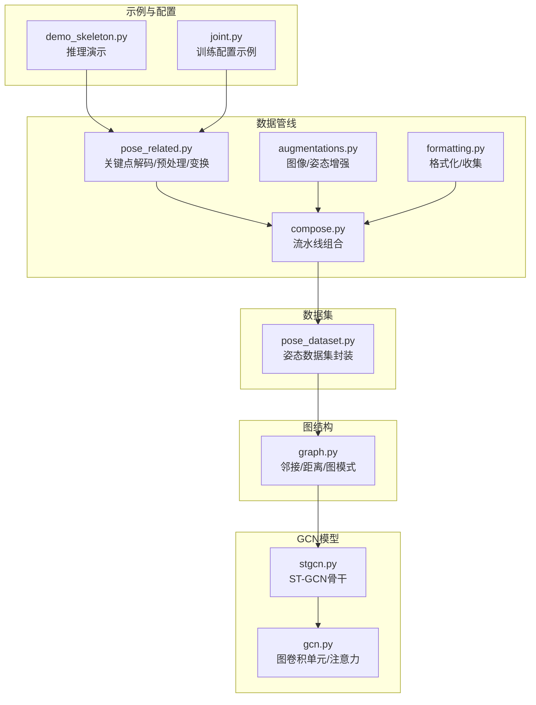
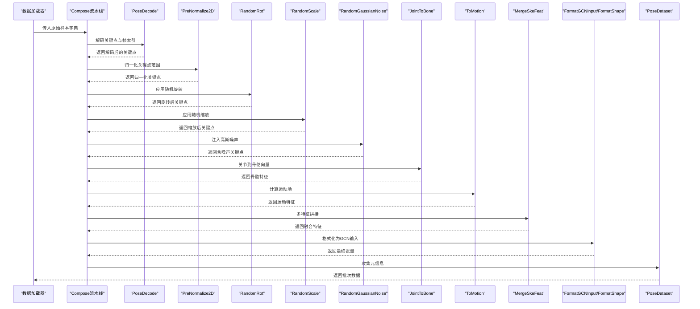
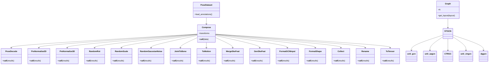

# 姿态处理组件

<cite>
**本文引用的文件**
- [pose_related.py](file://pyskl/datasets/pipelines/pose_related.py)
- [augmentations.py](file://pyskl/datasets/pipelines/augmentations.py)
- [formatting.py](file://pyskl/datasets/pipelines/formatting.py)
- [compose.py](file://pyskl/datasets/pipelines/compose.py)
- [pose_dataset.py](file://pyskl/datasets/pose_dataset.py)
- [graph.py](file://pyskl/utils/graph.py)
- [gcn.py](file://pyskl/models/gcns/utils/gcn.py)
- [stgcn.py](file://pyskl/models/gcns/stgcn.py)
- [demo_skeleton.py](file://demo/demo_skeleton.py)
- [joint.py](file://configs/posec3d/slowonly_r50_ntu120_xsub/joint.py)
</cite>

## 目录
1. [简介](#简介)
2. [项目结构](#项目结构)
3. [核心组件](#核心组件)
4. [架构总览](#架构总览)
5. [详细组件分析](#详细组件分析)
6. [依赖关系分析](#依赖关系分析)
7. [性能考虑](#性能考虑)
8. [故障排查指南](#故障排查指南)
9. [结论](#结论)
10. [附录](#附录)

## 简介
本文件系统性梳理 PySKL 的姿态处理组件，聚焦于姿态相关变换与几何运算，包括关键点坐标变换、连接关系处理、姿态归一化、骨架数据预处理流程（坐标系变换、关键点过滤、连接边构建）、姿态处理中的几何变换（旋转、平移、缩放）以及标准化/规范化方法。同时提供配置选项与使用示例，帮助读者快速上手并扩展自定义姿态处理规则。

## 项目结构
姿态处理相关代码主要分布在以下模块：
- 数据管线：关键点解码、预处理、增强、格式化、组合执行
- 数据集封装：姿态数据加载与切分
- 图结构工具：邻接矩阵、空间距离、图模式
- GCN 模型工具：图卷积单元、注意力机制、时空图卷积
- 示例与配置：推理演示、训练配置

图表来源
- [pose_related.py](file://pyskl/datasets/pipelines/pose_related.py#L1-L553)
- [augmentations.py](file://pyskl/datasets/pipelines/augmentations.py#L1-L902)
- [formatting.py](file://pyskl/datasets/pipelines/formatting.py#L1-L250)
- [compose.py](file://pyskl/datasets/pipelines/compose.py#L1-L53)
- [pose_dataset.py](file://pyskl/datasets/pose_dataset.py#L1-L107)
- [graph.py](file://pyskl/utils/graph.py#L1-L175)
- [gcn.py](file://pyskl/models/gcns/utils/gcn.py#L1-L441)
- [stgcn.py](file://pyskl/models/gcns/stgcn.py#L1-L138)
- [demo_skeleton.py](file://demo/demo_skeleton.py#L1-L314)
- [joint.py](file://configs/posec3d/slowonly_r50_ntu120_xsub/joint.py#L1-L86)

章节来源
- [pose_related.py](file://pyskl/datasets/pipelines/pose_related.py#L1-L553)
- [augmentations.py](file://pyskl/datasets/pipelines/augmentations.py#L1-L902)
- [formatting.py](file://pyskl/datasets/pipelines/formatting.py#L1-L250)
- [compose.py](file://pyskl/datasets/pipelines/compose.py#L1-L53)
- [pose_dataset.py](file://pyskl/datasets/pose_dataset.py#L1-L107)
- [graph.py](file://pyskl/utils/graph.py#L1-L175)
- [gcn.py](file://pyskl/models/gcns/utils/gcn.py#L1-L441)
- [stgcn.py](file://pyskl/models/gcns/stgcn.py#L1-L138)
- [demo_skeleton.py](file://demo/demo_skeleton.py#L1-L314)
- [joint.py](file://configs/posec3d/slowonly_r50_ntu120_xsub/joint.py#L1-L86)

## 核心组件
- 关键点解码与筛选：从压缩标注中提取帧索引与关键点，支持偏移与帧选择
- 预处理与归一化：二维/三维关键点范围归一化、坐标系对齐、中心对齐
- 几何变换：随机旋转（2D/3D）、随机缩放、高斯噪声注入
- 连接关系与运动特征：关节到骨骼向量转换、运动场生成
- 特征融合：多特征拼接（关键点、骨骼、运动）
- 图结构与GCN：邻接矩阵构建、空间距离计算、ST-GCN骨干
- 数据格式化：最终张量形状与元信息收集

章节来源
- [pose_related.py](file://pyskl/datasets/pipelines/pose_related.py#L12-L553)
- [graph.py](file://pyskl/utils/graph.py#L58-L175)
- [gcn.py](file://pyskl/models/gcns/utils/gcn.py#L10-L441)
- [stgcn.py](file://pyskl/models/gcns/stgcn.py#L56-L138)

## 架构总览
姿态处理以“数据管线”为核心，贯穿解码、预处理、增强、特征工程与格式化；GCN 骨干通过图结构进行时空建模。

图表来源
- [compose.py](file://pyskl/datasets/pipelines/compose.py#L8-L53)
- [pose_related.py](file://pyskl/datasets/pipelines/pose_related.py#L12-L553)
- [formatting.py](file://pyskl/datasets/pipelines/formatting.py#L160-L250)
- [pose_dataset.py](file://pyskl/datasets/pose_dataset.py#L10-L107)

## 详细组件分析

### 关键点解码与筛选（PoseDecode）
- 功能：按帧索引抽取关键点序列，支持偏移与可选关键点分数拼接
- 输入输出：读取 keypoint、frame_inds（可选 offset），输出 keypoint（与 keypoint_score 可选）

章节来源
- [pose_related.py](file://pyskl/datasets/pipelines/pose_related.py#L12-L49)

### 二维关键点归一化（PreNormalize2D）
- 功能：将关键点坐标映射到[-1,1]或基于目标尺寸的归一化区间；可按阈值过滤低置信度点
- 模式：
  - fix：固定以图像中心为原点，按图像宽高归一化
  - auto：自动计算有效包围盒，再归一化
- 关键点过滤：当存在 keypoint_score 时，低于阈值的点坐标置零

章节来源
- [pose_related.py](file://pyskl/datasets/pipelines/pose_related.py#L52-L96)

### 三维关键点对齐与归一化（PreNormalize3D）
- 功能：针对NTU RGB+D 3D关键点，进行脊柱对齐与身体中心对齐
- 步骤：
  - 选择非全零帧，剔除无效帧
  - 对齐身体中心（主人体中心）
  - 绕轴旋转使脊柱与z轴对齐，再绕轴旋转使肩部与x轴对齐
- 输出：更新 keypoint、total_frames、body_center

章节来源
- [pose_related.py](file://pyskl/datasets/pipelines/pose_related.py#L205-L292)

### 几何变换：旋转、缩放、噪声
- 随机旋转（RandomRot）
  - 2D：平面旋转矩阵
  - 3D：沿xyz轴顺序旋转的复合旋转矩阵
- 随机缩放（RandomScale）
  - 按通道独立缩放，缩放幅度由配置控制
- 高斯噪声（RandomGaussianNoise）
  - 支持按帧或视频级范数缩放，支持共享/非共享噪声
  - 可按关键点置信度掩码跳过无效点

章节来源
- [pose_related.py](file://pyskl/datasets/pipelines/pose_related.py#L99-L203)

### 连接关系与运动特征（JointToBone、ToMotion、GenSkeFeat）
- 关节到骨骼（JointToBone）
  - 基于不同骨架布局（nturgb+d/openpose/coco/handmp）定义连接对
  - 计算每关节相对于其父关节的向量作为骨骼特征
  - 3D场景下可合并父/子节点得分作为骨骼置信度
- 运动场（ToMotion）
  - 计算相邻帧间差分作为运动特征
  - 在特定数据集（openpose/coco）下合并时间步得分
- 特征融合（GenSkeFeat）
  - 组合关键点、骨骼、运动等特征并通过 MergeSkeFeat 拼接

章节来源
- [pose_related.py](file://pyskl/datasets/pipelines/pose_related.py#L295-L402)

### 数据格式化与收集（FormatGCNInput、FormatShape、Collect、Rename、ToTensor）
- FormatGCNInput
  - 规范化多人姿态形状，填充/截断至指定人数
  - 重排为（num_clips, num_person, T, V, C）并转为连续内存
- FormatShape
  - 将图像/热图格式转换为网络期望的输入格式（如 NCTHW/NCTHW_Heatmap）
- Collect/Rename/ToTensor
  - 收集所需键，重命名键，转换为张量，便于后续模型处理

章节来源
- [pose_related.py](file://pyskl/datasets/pipelines/pose_related.py#L427-L467)
- [formatting.py](file://pyskl/datasets/pipelines/formatting.py#L160-L250)

### 图结构与邻接矩阵（Graph、k_adjacency、edge2mat、normalize_digraph、get_hop_distance）
- Graph
  - 支持布局：openpose、nturgb+d、coco、handmp
  - 模式：spatial、stgcn_spatial、binary、random
  - 计算节点间跳数距离，生成邻接矩阵族
- 工具函数
  - k_adjacency：k步邻接矩阵
  - edge2mat：边列表转邻接矩阵
  - normalize_digraph：按行归一化
  - get_hop_distance：计算节点间最短跳数

章节来源
- [graph.py](file://pyskl/utils/graph.py#L5-L175)

### GCN 单元与ST-GCN骨干
- unit_gcn：图卷积单元，支持多种自适应模式与残差
- unit_aagcn：自适应注意力图卷积
- CTRGC/unit_ctrgcn：上下文感知图卷积
- dggcn：动态图卷积，支持可控的中心/自适应图构建
- STGCN：时空图卷积骨干，结合GCN与TCN模块

章节来源
- [gcn.py](file://pyskl/models/gcns/utils/gcn.py#L10-L441)
- [stgcn.py](file://pyskl/models/gcns/stgcn.py#L13-L138)

### 数据集封装（PoseDataset）
- 加载pickle标注，支持按split切分
- 可选阈值过滤（valid_ratio、box_thr）
- 提供视频信息列表，便于采样与缓存

章节来源
- [pose_dataset.py](file://pyskl/datasets/pose_dataset.py#L10-L107)

### 示例与配置（demo_skeleton.py、joint.py）
- demo_skeleton.py
  - 从视频提取帧，检测人像，估计姿态，跟踪轨迹，推理动作识别
  - 支持GCN与非GCN两种推理路径
- joint.py
  - PoseC3D 训练配置示例，包含采样、解码、裁剪、翻转、目标生成、格式化等流水线

章节来源
- [demo_skeleton.py](file://demo/demo_skeleton.py#L227-L314)
- [joint.py](file://configs/posec3d/slowonly_r50_ntu120_xsub/joint.py#L27-L74)

## 依赖关系分析

图表来源
- [compose.py](file://pyskl/datasets/pipelines/compose.py#L8-L53)
- [pose_related.py](file://pyskl/datasets/pipelines/pose_related.py#L12-L553)
- [formatting.py](file://pyskl/datasets/pipelines/formatting.py#L160-L250)
- [pose_dataset.py](file://pyskl/datasets/pose_dataset.py#L10-L107)
- [graph.py](file://pyskl/utils/graph.py#L58-L175)
- [gcn.py](file://pyskl/models/gcns/utils/gcn.py#L10-L441)
- [stgcn.py](file://pyskl/models/gcns/stgcn.py#L56-L138)

## 性能考虑
- 向量化与广播：关键点变换广泛使用 numpy 广播与 einsum，避免显式循环
- 内存连续性：FormatGCNInput 将结果转为连续内存，提升后续卷积效率
- 图构建优化：k_adjacency 与 normalize_digraph 使用矩阵幂与稀疏化策略减少计算
- 噪声注入：支持按帧/视频级范数缩放，避免无效区域噪声放大
- 数据集过滤：valid_ratio 与 box_thr 可在加载阶段筛除低质量样本，降低训练开销

## 故障排查指南
- 关键点为空或全零
  - 现象：RandomRot/RandomScale/RandomGaussianNoise 对全零骨架直接返回
  - 排查：确认解码与筛选步骤是否正确
- 归一化异常
  - 现象：auto 模式下无有效关键点导致边界计算失败
  - 排查：检查阈值设置与关键点分数
- 3D对齐失败
  - 现象：主人体中心或轴向计算异常
  - 排查：确认帧索引与非零帧选择逻辑
- GCN 输入形状不匹配
  - 现象：FormatGCNInput 人数/帧数/通道不一致
  - 排查：核对 num_person、total_frames 与数据预处理流水线
- 图结构异常
  - 现象：邻接矩阵维度不匹配
  - 排查：确认 Graph 初始化参数与布局一致

章节来源
- [pose_related.py](file://pyskl/datasets/pipelines/pose_related.py#L122-L124)
- [pose_related.py](file://pyskl/datasets/pipelines/pose_related.py#L73-L86)
- [pose_related.py](file://pyskl/datasets/pipelines/pose_related.py#L251-L262)
- [pose_related.py](file://pyskl/datasets/pipelines/pose_related.py#L447-L456)
- [graph.py](file://pyskl/utils/graph.py#L58-L95)

## 结论
PySKL 的姿态处理组件以模块化数据管线为核心，覆盖从关键点解码、归一化、几何变换到连接关系与运动特征提取的完整链路，并通过图结构与GCN骨干实现高效的时空建模。通过灵活的配置与扩展接口，用户可以快速定制姿态处理规则并适配不同数据集与任务需求。

## 附录

### 配置选项与使用示例

- 训练配置示例（PoseC3D）
  - 关键流水线组件：UniformSampleFrames、PoseDecode、PoseCompact、Resize、RandomResizedCrop、Resize、Flip、GeneratePoseTarget、FormatShape、Collect、ToTensor
  - 参考路径：[joint.py](file://configs/posec3d/slowonly_r50_ntu120_xsub/joint.py#L27-L74)

- 推理演示（demo_skeleton.py）
  - 流程：提取帧→检测人像→估计姿态→轨迹跟踪→动作识别→可视化
  - 参考路径：[demo_skeleton.py](file://demo/demo_skeleton.py#L227-L314)

- 自定义姿态处理规则
  - 扩展思路：
    - 新增变换类并注册到 PIPELINES
    - 在 Compose 中按需组合
    - 若涉及图结构，可参考 Graph 与 k_adjacency 的实现
  - 参考路径：
    - [compose.py](file://pyskl/datasets/pipelines/compose.py#L8-L53)
    - [graph.py](file://pyskl/utils/graph.py#L58-L175)