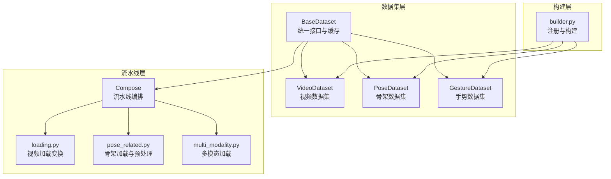
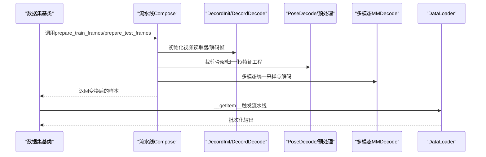
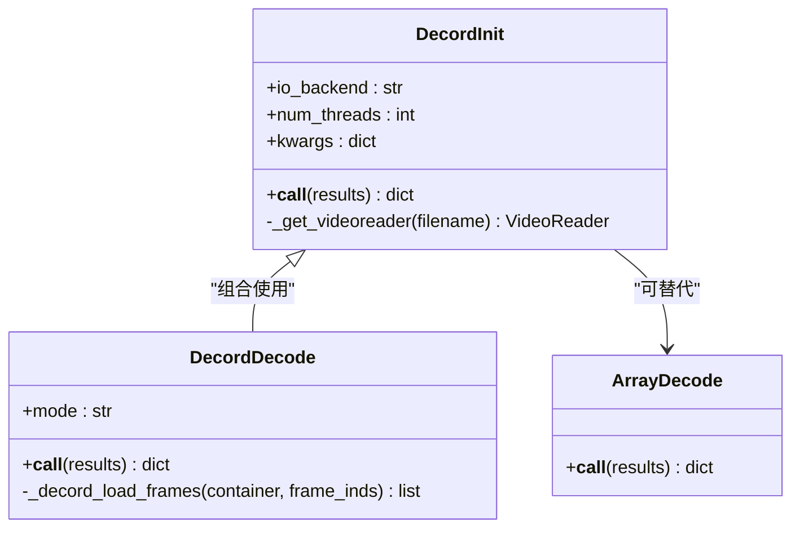
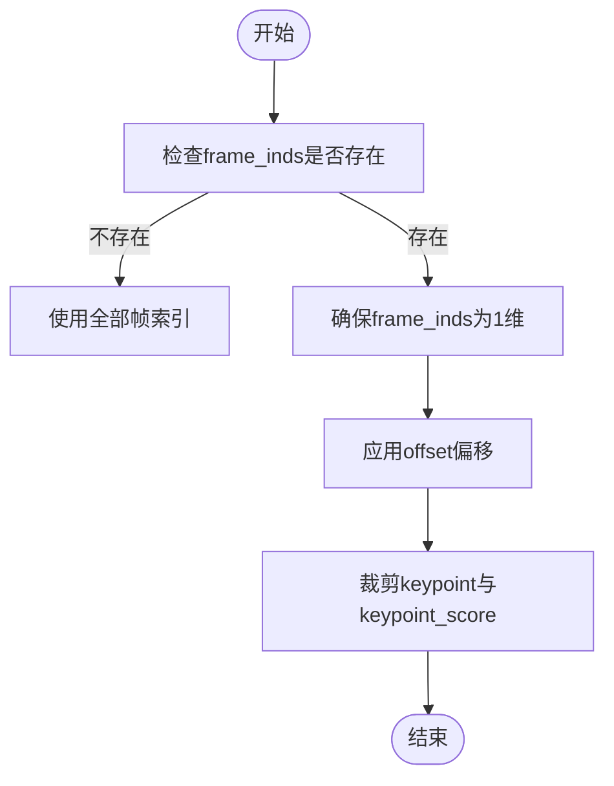
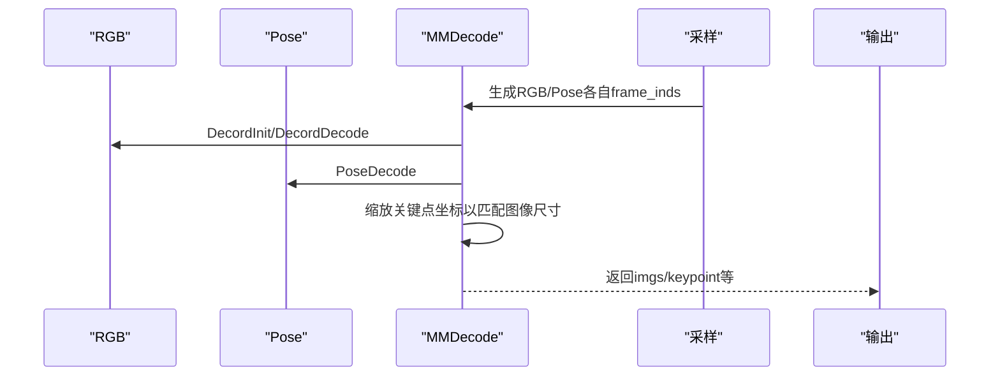
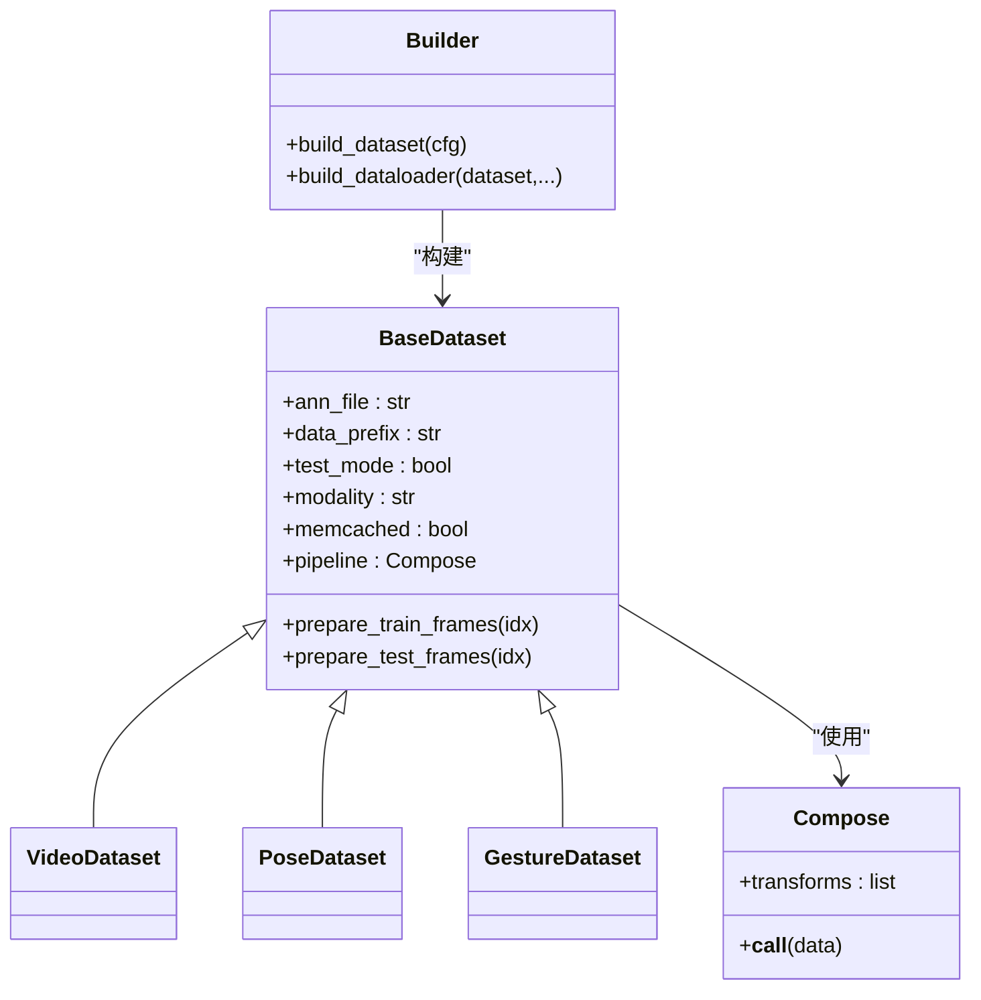
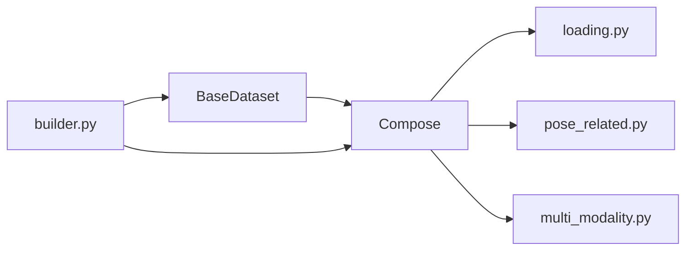

# 数据加载组件

<cite>
**本文档引用的文件**
- [loading.py](file://pyskl/datasets/pipelines/loading.py)
- [pose_related.py](file://pyskl/datasets/pipelines/pose_related.py)
- [multi_modality.py](file://pyskl/datasets/pipelines/multi_modality.py)
- [compose.py](file://pyskl/datasets/pipelines/compose.py)
- [base.py](file://pyskl/datasets/base.py)
- [video_dataset.py](file://pyskl/datasets/video_dataset.py)
- [pose_dataset.py](file://pyskl/datasets/pose_dataset.py)
- [gesture_dataset.py](file://pyskl/datasets/gesture_dataset.py)
- [builder.py](file://pyskl/datasets/builder.py)
- [joint.py](file://configs/posec3d/slowonly_r50_ntu60_xsub/joint.py)
- [demo_skeleton.py](file://demo/demo_skeleton.py)
</cite>

## 目录
1. [简介](#简介)
2. [项目结构](#项目结构)
3. [核心组件](#核心组件)
4. [架构总览](#架构总览)
5. [详细组件分析](#详细组件分析)
6. [依赖关系分析](#依赖关系分析)
7. [性能考虑](#性能考虑)
8. [故障排查指南](#故障排查指南)
9. [结论](#结论)
10. [附录](#附录)

## 简介
本文件面向PySKL框架中的数据加载组件，系统性梳理视频帧加载、骨架数据读取、图像文件加载等数据加载变换的实现与使用方法。内容涵盖：
- 加载组件的参数配置与数据格式转换
- 不同类型数据的加载策略与性能优化
- 加载过程中的错误处理与异常情况处理
- 使用示例与最佳实践（单样本与批量加载）

## 项目结构
数据加载体系由“数据集基类 + 预处理流水线 + 构建器”三层组成：
- 数据集基类：统一接口、缓存、评估与采样
- 预处理流水线：以注册表驱动的可组合变换
- 构建器：数据集与DataLoader的工厂与注册中心

图表来源
- [base.py](file://pyskl/datasets/base.py#L19-L354)
- [video_dataset.py](file://pyskl/datasets/video_dataset.py#L9-L61)
- [pose_dataset.py](file://pyskl/datasets/pose_dataset.py#L11-L107)
- [gesture_dataset.py](file://pyskl/datasets/gesture_dataset.py#L14-L156)
- [compose.py](file://pyskl/datasets/pipelines/compose.py#L9-L53)
- [loading.py](file://pyskl/datasets/pipelines/loading.py#L11-L185)
- [pose_related.py](file://pyskl/datasets/pipelines/pose_related.py#L13-L553)
- [multi_modality.py](file://pyskl/datasets/pipelines/multi_modality.py#L12-L230)
- [builder.py](file://pyskl/datasets/builder.py#L31-L134)

章节来源
- [base.py](file://pyskl/datasets/base.py#L19-L354)
- [builder.py](file://pyskl/datasets/builder.py#L31-L134)

## 核心组件
- 视频加载变换
  - DecordInit：初始化视频读取器，支持IO后端与线程数配置
  - DecordDecode：基于Decord解码视频帧，支持精确/高效两种模式
  - ArrayDecode：从4D数组按索引选取帧（RGB/Flow）
- 骨架加载与预处理
  - PoseDecode：按帧索引裁剪骨架与关键点分数
  - PreNormalize2D/PreNormalize3D：骨架归一化
  - JointToBone/ToMotion/MergeSkeFeat：骨架特征工程
  - PadTo/FormatGCNInput：骨架形状对齐与填充
  - DecompressPose：压缩骨架注释解压
- 多模态加载
  - MMDecode：统一处理RGB与Pose两种模态
  - MMUniformSampleFrames/MMPad/MMCompact：多模态采样与对齐

章节来源
- [loading.py](file://pyskl/datasets/pipelines/loading.py#L11-L185)
- [pose_related.py](file://pyskl/datasets/pipelines/pose_related.py#L13-L553)
- [multi_modality.py](file://pyskl/datasets/pipelines/multi_modality.py#L12-L230)

## 架构总览
数据从数据集基类出发，经由注册表驱动的流水线进行变换，最终产出模型所需的张量或热图。构建器负责注册与实例化，DataLoader负责批处理与分布式采样。

图表来源
- [base.py](file://pyskl/datasets/base.py#L262-L354)
- [compose.py](file://pyskl/datasets/pipelines/compose.py#L30-L44)
- [loading.py](file://pyskl/datasets/pipelines/loading.py#L47-L137)
- [pose_related.py](file://pyskl/datasets/pipelines/pose_related.py#L28-L49)
- [multi_modality.py](file://pyskl/datasets/pipelines/multi_modality.py#L90-L129)
- [builder.py](file://pyskl/datasets/builder.py#L48-L124)

## 详细组件分析

### 视频帧加载组件
- DecordInit
  - 功能：根据文件路径或frame_dir构造视频读取器，注入total_frames
  - 参数：io_backend（IO后端）、num_threads（解码线程数）、kwargs（FileClient参数）
  - 注意：若缺少filename，会自动拼接.frame_dir+'.mp4'
- DecordDecode
  - 功能：按frame_inds解码帧，支持accurate与efficient两种模式
  - 参数：mode（'accurate'或'efficient'）
  - 性能：efficient模式更快但仅返回关键帧，可能重复
- ArrayDecode
  - 功能：从4D数组按索引选取帧，支持RGB与Flow
  - 参数：modality、offset（偏移）、frame_inds
  - 输出：imgs、img_shape、original_shape

图表来源
- [loading.py](file://pyskl/datasets/pipelines/loading.py#L11-L185)

章节来源
- [loading.py](file://pyskl/datasets/pipelines/loading.py#L11-L185)

### 骨架数据加载与预处理
- PoseDecode
  - 功能：按frame_inds裁剪keypoint与keypoint_score
  - 行为：若无frame_inds，默认使用全部帧；支持offset偏移
- PreNormalize2D/PreNormalize3D
  - 功能：将骨架坐标归一化到[-1,1]或以人体为中心
  - 参数：img_shape、threshold、mode（'fix'或'auto'）
- JointToBone/ToMotion/MergeSkeFeat
  - 功能：将关节坐标转为骨骼向量，计算运动场，合并特征
- PadTo/FormatGCNInput
  - 功能：填充到固定长度、对齐多人骨架形状
- DecompressPose
  - 功能：解压压缩注释，映射到M×T×V×C格式，限制最大人数

图表来源
- [pose_related.py](file://pyskl/datasets/pipelines/pose_related.py#L28-L49)

章节来源
- [pose_related.py](file://pyskl/datasets/pipelines/pose_related.py#L13-L553)

### 多模态加载组件
- MMDecode
  - 功能：统一处理RGB与Pose两种模态
  - 行为：对RGB调用DecordInit/DecordDecode，对Pose调用PoseDecode；必要时缩放关键点坐标以适配图像尺寸
- MMUniformSampleFrames
  - 功能：为不同模态分别均匀采样，生成各自的frame_inds
- MMPad/MMCompact
  - 功能：对图像与关键点进行padding与紧凑裁剪，保持坐标一致

图表来源
- [multi_modality.py](file://pyskl/datasets/pipelines/multi_modality.py#L82-L129)

章节来源
- [multi_modality.py](file://pyskl/datasets/pipelines/multi_modality.py#L12-L230)

### 数据集与流水线编排
- BaseDataset
  - 统一接口：load_annotations、prepare_train_frames、prepare_test_frames
  - 缓存：memcached支持（仅PoseDataset）
  - 评估：支持多种指标（top_k_accuracy、mean_class_accuracy、mean_average_precision）
- VideoDataset/PoseDataset/GestureDataset
  - VideoDataset：从文本注释加载视频路径
  - PoseDataset/GestureDataset：从pkl/json加载骨架注释，支持split、valid_ratio、box_thr等过滤
- Compose
  - 将注册表中的变换按序执行，支持callable与dict两种形式
- Builder
  - 注册表：DATASETS/PIPELINES
  - 构建：build_dataset/build_dataloader，支持分布式采样与批处理

图表来源
- [base.py](file://pyskl/datasets/base.py#L19-L354)
- [video_dataset.py](file://pyskl/datasets/video_dataset.py#L9-L61)
- [pose_dataset.py](file://pyskl/datasets/pose_dataset.py#L11-L107)
- [gesture_dataset.py](file://pyskl/datasets/gesture_dataset.py#L14-L156)
- [compose.py](file://pyskl/datasets/pipelines/compose.py#L9-L53)
- [builder.py](file://pyskl/datasets/builder.py#L31-L134)

章节来源
- [base.py](file://pyskl/datasets/base.py#L19-L354)
- [compose.py](file://pyskl/datasets/pipelines/compose.py#L9-L53)
- [builder.py](file://pyskl/datasets/builder.py#L31-L134)

## 依赖关系分析
- 组件耦合
  - BaseDataset与Pipeline通过Compose耦合，解耦具体变换
  - 多模态组件继承自视频与骨架变换，复用解码逻辑
- 外部依赖
  - Decord用于视频解码
  - mmcv用于文件读写、图像处理、注册表
  - 可选：pymemcache用于骨架缓存

图表来源
- [base.py](file://pyskl/datasets/base.py#L19-L354)
- [compose.py](file://pyskl/datasets/pipelines/compose.py#L9-L53)
- [loading.py](file://pyskl/datasets/pipelines/loading.py#L11-L185)
- [pose_related.py](file://pyskl/datasets/pipelines/pose_related.py#L13-L553)
- [multi_modality.py](file://pyskl/datasets/pipelines/multi_modality.py#L12-L230)
- [builder.py](file://pyskl/datasets/builder.py#L31-L134)

章节来源
- [builder.py](file://pyskl/datasets/builder.py#L31-L134)

## 性能考虑
- 视频解码
  - DecordDecode.mode='efficient'可显著提升速度，但仅返回关键帧，需结合采样策略
  - DecordInit.num_threads建议与CPU核数匹配，避免过多线程竞争
- 骨架处理
  - PreNormalize2D/PreNormalize3D采用向量化运算，注意阈值与模式选择
  - DecompressPose在解压时进行映射与排序，注意max_person限制
- 多模态
  - MMDecode统一采样可减少不一致，但需保证RGB与Pose的帧索引对齐
  - MMPad/MMCompact在图像与关键点间保持坐标一致性，避免额外重算
- 批处理与分布式
  - build_dataloader支持分布式采样、持久化工作进程、pin_memory等，合理设置可提升吞吐

[本节为通用性能建议，无需特定文件来源]

## 故障排查指南
- Decord导入失败
  - 现象：抛出ImportError提示安装Decord
  - 处理：按提示安装Decord
- 文件路径问题
  - 现象：DecordInit找不到文件或拼接错误
  - 处理：确认ann_file中路径与data_prefix拼接正确；若无filename，确保frame_dir存在
- 帧索引不一致
  - 现象：total_frames与视频实际帧数不一致
  - 处理：检查frame_inds生成逻辑与offset；确保采样与解码顺序一致
- 骨架为空或维度异常
  - 现象：keypoint全零或形状不匹配
  - 处理：检查DecompressPose与PadTo的输入；确认dataset类型与特征工程链路
- 分布式训练报错
  - 现象：DataLoader采样或collate异常
  - 处理：确认分布式环境变量与采样器配置；检查collate_fn与samples_per_gpu

章节来源
- [loading.py](file://pyskl/datasets/pipelines/loading.py#L35-L45)
- [base.py](file://pyskl/datasets/base.py#L262-L354)
- [pose_related.py](file://pyskl/datasets/pipelines/pose_related.py#L471-L553)
- [builder.py](file://pyskl/datasets/builder.py#L48-L124)

## 结论
PySKL的数据加载组件通过注册表与流水线编排，实现了视频与骨架两类数据的统一处理。其核心优势在于：
- 可组合的变换链路，便于扩展与维护
- 多模态统一采样与解码，降低数据不一致风险
- 缓存与分布式支持，兼顾易用性与性能

建议在实际使用中：
- 明确数据类型与模态，选择合适的流水线
- 合理配置采样与解码策略，平衡精度与速度
- 关注路径与索引一致性，避免运行时错误

[本节为总结性内容，无需特定文件来源]

## 附录

### 使用示例与最佳实践
- 单样本加载
  - 通过数据集基类的__getitem__触发prepare_train_frames/prepare_test_frames，内部调用流水线完成单个样本的完整处理
- 批量加载
  - 使用build_dataloader创建DataLoader，支持分布式采样、批处理与持久化工作进程
- 配置参考
  - 骨架动作识别配置示例展示了典型的流水线：UniformSampleFrames → PoseDecode → Compact → Resize → GeneratePoseTarget → FormatShape → Collect/ToTensor

章节来源
- [base.py](file://pyskl/datasets/base.py#L351-L354)
- [builder.py](file://pyskl/datasets/builder.py#L48-L124)
- [joint.py](file://configs/posec3d/slowonly_r50_ntu60_xsub/joint.py#L26-L58)

### 数据加载流程图（概念）

[本图为概念流程，无需图表来源]