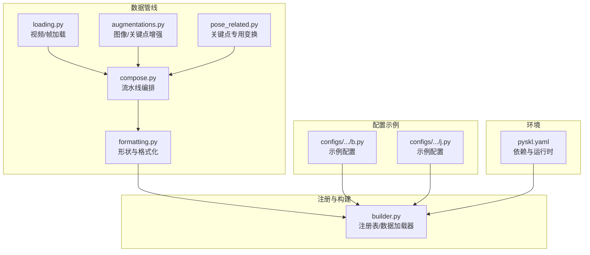
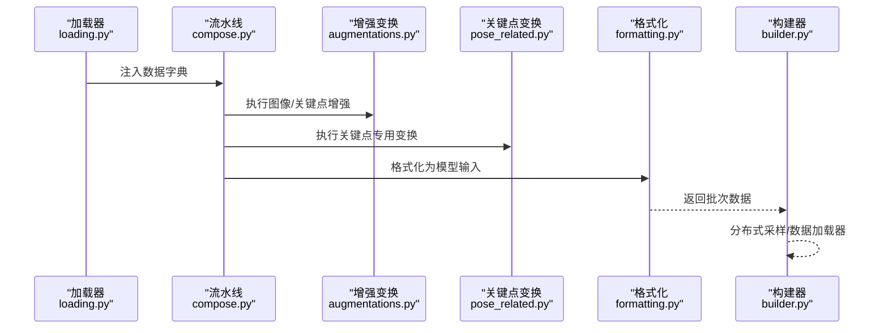
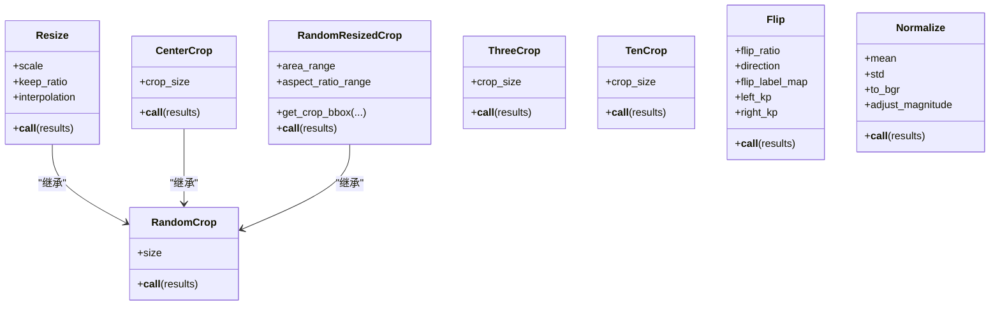
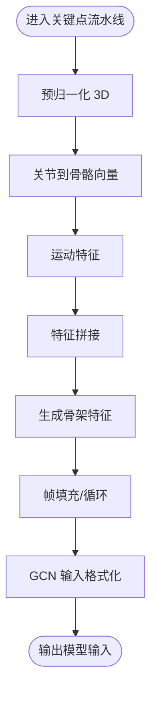
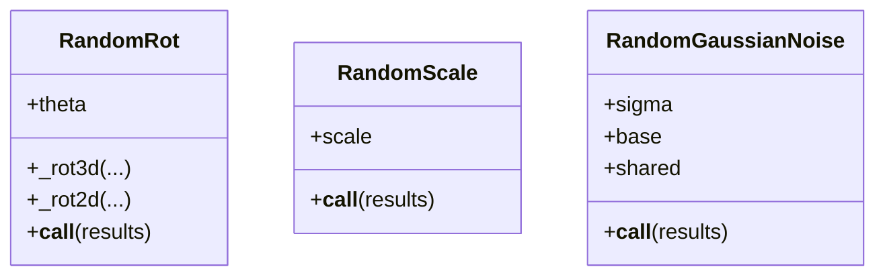
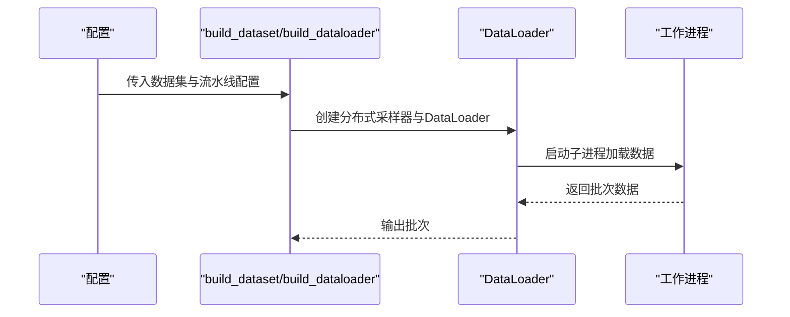
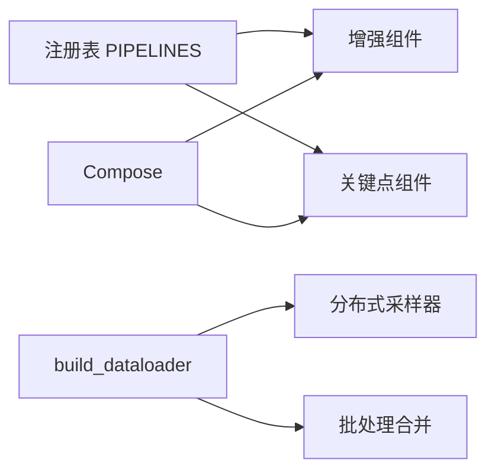

# 数据增强组件

<cite>
**本文引用的文件**
- [pyskl/datasets/pipelines/augmentations.py](file://pyskl/datasets/pipelines/augmentations.py)
- [pyskl/datasets/pipelines/pose_related.py](file://pyskl/datasets/pipelines/pose_related.py)
- [pyskl/datasets/pipelines/compose.py](file://pyskl/datasets/pipelines/compose.py)
- [pyskl/datasets/builder.py](file://pyskl/datasets/builder.py)
- [pyskl/datasets/pipelines/formatting.py](file://pyskl/datasets/pipelines/formatting.py)
- [pyskl/datasets/pipelines/loading.py](file://pyskl/datasets/pipelines/loading.py)
- [configs/stgcn/stgcn_pyskl_ntu60_xsub_3dkp/b.py](file://configs/stgcn/stgcn_pyskl_ntu60_xsub_3dkp/b.py)
- [configs/stgcn/stgcn_pyskl_ntu60_xsub_3dkp/j.py](file://configs/stgcn/stgcn_pyskl_ntu60_xsub_3dkp/j.py)
- [pyskl.yaml](file://pyskl.yaml)
</cite>

## 目录
1. [简介](#简介)
2. [项目结构](#项目结构)
3. [核心组件](#核心组件)
4. [架构总览](#架构总览)
5. [详细组件分析](#详细组件分析)
6. [依赖关系分析](#依赖关系分析)
7. [性能考量与优化建议](#性能考量与优化建议)
8. [故障排查指南](#故障排查指南)
9. [结论](#结论)
10. [附录：配置与使用示例](#附录配置与使用示例)

## 简介
本文件系统化梳理 PySKL 的数据增强组件，覆盖空间变换（关键点旋转、缩放、噪声）、时间变换（骨架运动特征生成、帧采样）、颜色与图像变换（归一化、翻转、裁剪、缩放）等模块。文档重点阐述：
- 各增强变换的实现原理与适用场景
- 增强策略设计（强度控制、随机性管理、评估方法）
- 不同算法对增强策略的特殊要求与适配
- 配置参数与使用方法（概率、参数范围等）
- 性能优化建议（GPU 加速、内存优化）

## 项目结构
数据增强相关代码主要位于数据管线模块，通过注册表统一管理，配合 Compose 顺序执行，最终在格式化阶段输出模型输入。

图表来源
- [pyskl/datasets/pipelines/augmentations.py](file://pyskl/datasets/pipelines/augmentations.py#L1-L902)
- [pyskl/datasets/pipelines/pose_related.py](file://pyskl/datasets/pipelines/pose_related.py#L1-L553)
- [pyskl/datasets/pipelines/compose.py](file://pyskl/datasets/pipelines/compose.py#L1-L53)
- [pyskl/datasets/pipelines/formatting.py](file://pyskl/datasets/pipelines/formatting.py#L160-L210)
- [pyskl/datasets/pipelines/loading.py](file://pyskl/datasets/pipelines/loading.py#L150-L184)
- [pyskl/datasets/builder.py](file://pyskl/datasets/builder.py#L1-L134)
- [configs/stgcn/stgcn_pyskl_ntu60_xsub_3dkp/b.py](file://configs/stgcn/stgcn_pyskl_ntu60_xsub_3dkp/b.py#L1-L61)
- [configs/stgcn/stgcn_pyskl_ntu60_xsub_3dkp/j.py](file://configs/stgcn/stgcn_pyskl_ntu60_xsub_3dkp/j.py#L1-L61)
- [pyskl.yaml](file://pyskl.yaml#L1-L132)

章节来源
- [pyskl/datasets/pipelines/__init__.py](file://pyskl/datasets/pipelines/__init__.py#L1-L10)
- [pyskl/datasets/builder.py](file://pyskl/datasets/builder.py#L22-L26)

## 核心组件
- 图像/视频增强（空间与颜色）
  - 缩放、随机裁剪、中心裁剪、三裁、十裁
  - 翻转（水平/垂直，关键点左右映射）
  - 归一化（RGB/Flow 分支处理）
- 关键点专用增强（空间与时域）
  - 预归一化（2D/3D）
  - 随机旋转（2D/3D）
  - 随机缩放
  - 高斯噪声（按帧/整段共享）
  - 骨骼到骨骼向量（JointToBone）
  - 运动特征（ToMotion）
  - 特征拼接（MergeSkeFeat）
  - 生成骨架特征（GenSkeFeat）
  - 帧填充/循环（PadTo）
  - GCN 输入格式化（FormatGCNInput）
  - 解压骨架（DecompressPose）
- 流水线编排与数据加载
  - Compose 顺序执行
  - 构建数据加载器（含分布式采样器）

章节来源
- [pyskl/datasets/pipelines/augmentations.py](file://pyskl/datasets/pipelines/augmentations.py#L16-L902)
- [pyskl/datasets/pipelines/pose_related.py](file://pyskl/datasets/pipelines/pose_related.py#L1-L553)
- [pyskl/datasets/pipelines/compose.py](file://pyskl/datasets/pipelines/compose.py#L1-L53)
- [pyskl/datasets/builder.py](file://pyskl/datasets/builder.py#L31-L124)

## 架构总览
数据从加载开始，经由增强流水线，最终格式化为模型输入张量。注册表统一管理组件，Compose 负责顺序执行，builder 提供数据加载器与分布式采样。

图表来源
- [pyskl/datasets/pipelines/loading.py](file://pyskl/datasets/pipelines/loading.py#L150-L184)
- [pyskl/datasets/pipelines/compose.py](file://pyskl/datasets/pipelines/compose.py#L30-L44)
- [pyskl/datasets/pipelines/augmentations.py](file://pyskl/datasets/pipelines/augmentations.py#L16-L902)
- [pyskl/datasets/pipelines/pose_related.py](file://pyskl/datasets/pipelines/pose_related.py#L1-L553)
- [pyskl/datasets/pipelines/formatting.py](file://pyskl/datasets/pipelines/formatting.py#L160-L210)
- [pyskl/datasets/builder.py](file://pyskl/datasets/builder.py#L48-L124)

## 详细组件分析

### 空间变换（图像/关键点）
- 缩放（Resize）
  - 功能：按比例或目标尺寸重采样，保持/不保持纵横比；更新尺度因子与边界框
  - 关键点处理：按 scale_factor 缩放坐标
  - 参数：scale、keep_ratio、interpolation
- 随机裁剪（RandomCrop）
  - 功能：在给定尺寸内随机裁剪，维护 crop_quadruple 与 crop_bbox
  - 关键点/边界框：相应裁剪
- 中心裁剪（CenterCrop）
  - 功能：固定在中心区域裁剪
- 随机调整大小裁剪（RandomResizedCrop）
  - 功能：在面积与宽高比范围内随机生成候选框
- 三裁（ThreeCrop）
  - 功能：沿短边等间距切三块
- 十裁（TenCrop）
  - 功能：四角+中心+水平翻转各一份
- 翻转（Flip）
  - 功能：按概率水平/垂直翻转；关键点需满足左右映射
  - 参数：flip_ratio、direction、flip_label_map、左右关键点索引
- 归一化（Normalize）
  - 功能：对 RGB/Flow 分别进行均值方差归一化；Flow 可调整幅值
  - 参数：mean、std、to_bgr、adjust_magnitude

图表来源
- [pyskl/datasets/pipelines/augmentations.py](file://pyskl/datasets/pipelines/augmentations.py#L368-L474)
- [pyskl/datasets/pipelines/augmentations.py](file://pyskl/datasets/pipelines/augmentations.py#L120-L234)
- [pyskl/datasets/pipelines/augmentations.py](file://pyskl/datasets/pipelines/augmentations.py#L694-L761)
- [pyskl/datasets/pipelines/augmentations.py](file://pyskl/datasets/pipelines/augmentations.py#L237-L364)
- [pyskl/datasets/pipelines/augmentations.py](file://pyskl/datasets/pipelines/augmentations.py#L765-L832)
- [pyskl/datasets/pipelines/augmentations.py](file://pyskl/datasets/pipelines/augmentations.py#L835-L902)
- [pyskl/datasets/pipelines/augmentations.py](file://pyskl/datasets/pipelines/augmentations.py#L477-L604)
- [pyskl/datasets/pipelines/augmentations.py](file://pyskl/datasets/pipelines/augmentations.py#L608-L690)

章节来源
- [pyskl/datasets/pipelines/augmentations.py](file://pyskl/datasets/pipelines/augmentations.py#L120-L902)

### 时间变换（关键点时序）
- 预归一化 3D（PreNormalize3D）
  - 对齐脊柱与中心，将骨架对齐到标准坐标系
- 骨骼到骨骼向量（JointToBone）
  - 将关键点差值转换为骨骼向量表示
- 运动特征（ToMotion）
  - 计算相邻帧差分作为运动特征
- 特征拼接（MergeSkeFeat）
  - 将多个特征沿最后一维拼接
- 生成骨架特征（GenSkeFeat）
  - 组合上述操作，按数据集布局生成多模态骨架特征
- 帧填充/循环（PadTo）
  - 将序列填充至指定长度，支持循环或零填充
- GCN 输入格式化（FormatGCNInput）
  - 规范化人数与时间步，转置为 NCTHV 连续内存布局

图表来源
- [pyskl/datasets/pipelines/pose_related.py](file://pyskl/datasets/pipelines/pose_related.py#L206-L292)
- [pyskl/datasets/pipelines/pose_related.py](file://pyskl/datasets/pipelines/pose_related.py#L295-L332)
- [pyskl/datasets/pipelines/pose_related.py](file://pyskl/datasets/pipelines/pose_related.py#L336-L356)
- [pyskl/datasets/pipelines/pose_related.py](file://pyskl/datasets/pipelines/pose_related.py#L360-L374)
- [pyskl/datasets/pipelines/pose_related.py](file://pyskl/datasets/pipelines/pose_related.py#L378-L402)
- [pyskl/datasets/pipelines/pose_related.py](file://pyskl/datasets/pipelines/pose_related.py#L405-L423)
- [pyskl/datasets/pipelines/pose_related.py](file://pyskl/datasets/pipelines/pose_related.py#L427-L467)

章节来源
- [pyskl/datasets/pipelines/pose_related.py](file://pyskl/datasets/pipelines/pose_related.py#L1-L553)

### 关键点空间变换（随机旋转/缩放/噪声）
- 随机旋转（RandomRot）
  - 2D/3D 随机旋转矩阵，对关键点进行线性变换
- 随机缩放（RandomScale）
  - 按通道独立缩放，控制强度范围
- 随机高斯噪声（RandomGaussianNoise）
  - 支持按帧或整段共享噪声，基于骨架范围自适应缩放噪声幅度

图表来源
- [pyskl/datasets/pipelines/pose_related.py](file://pyskl/datasets/pipelines/pose_related.py#L100-L134)
- [pyskl/datasets/pipelines/pose_related.py](file://pyskl/datasets/pipelines/pose_related.py#L138-L152)
- [pyskl/datasets/pipelines/pose_related.py](file://pyskl/datasets/pipelines/pose_related.py#L156-L202)

章节来源
- [pyskl/datasets/pipelines/pose_related.py](file://pyskl/datasets/pipelines/pose_related.py#L100-L202)

### 流水线编排与数据加载
- Compose
  - 接受配置字典或可调用对象，顺序执行变换
- 构建数据加载器（build_dataloader）
  - 支持分布式采样、批处理合并、内存锁页、持久化工作进程等

图表来源
- [pyskl/datasets/builder.py](file://pyskl/datasets/builder.py#L31-L124)
- [pyskl/datasets/pipelines/compose.py](file://pyskl/datasets/pipelines/compose.py#L17-L44)

章节来源
- [pyskl/datasets/pipelines/compose.py](file://pyskl/datasets/pipelines/compose.py#L1-L53)
- [pyskl/datasets/builder.py](file://pyskl/datasets/builder.py#L48-L124)

## 依赖关系分析
- 注册表（PIPELINES）集中注册增强组件，便于动态构建
- Compose 依赖 PIPELINES 进行组件实例化
- 数据加载器依赖分布式采样器与批处理合并
- 关键点变换依赖 NumPy/SciPy 等科学计算库

图表来源
- [pyskl/datasets/builder.py](file://pyskl/datasets/builder.py#L22-L26)
- [pyskl/datasets/pipelines/compose.py](file://pyskl/datasets/pipelines/compose.py#L17-L29)
- [pyskl/datasets/builder.py](file://pyskl/datasets/builder.py#L89-L122)

章节来源
- [pyskl/datasets/builder.py](file://pyskl/datasets/builder.py#L22-L26)

## 性能考量与优化建议
- GPU 加速
  - 使用 PyTorch 张量与 GPU 内存布局（如 NCTHW），减少主机-设备拷贝
  - 在流水线末尾进行格式化（FormatShape），避免中间频繁切换设备
- 内存优化
  - 使用就地操作（如 iminvert/imflip_）降低临时数组开销
  - 合理设置 workers_per_gpu 与 persistent_workers，平衡吞吐与内存占用
  - 对大序列采用 PadTo 循环填充，避免零填充导致的稀疏存储浪费
- 随机性与可复现
  - 通过 worker_init_fn 固定工作进程随机种子，保证可复现性
- I/O 与解压
  - 使用 DecompressPose 将压缩标注解压为稠密张量，减少运行时解码成本
- 算法适配
  - GCN 类模型优先使用 FormatGCNInput 生成连续内存布局，提升卷积/注意力效率

章节来源
- [pyskl/datasets/builder.py](file://pyskl/datasets/builder.py#L127-L134)
- [pyskl/datasets/pipelines/formatting.py](file://pyskl/datasets/pipelines/formatting.py#L160-L210)
- [pyskl/datasets/pipelines/pose_related.py](file://pyskl/datasets/pipelines/pose_related.py#L471-L549)

## 故障排查指南
- 翻转方向与关键点映射
  - 当存在关键点时，仅支持水平翻转；否则会触发断言错误
- 边界框与裁剪
  - 裁剪后需同步更新 crop_bbox 与 crop_quadruple，确保后续变换一致
- 归一化异常
  - RGB/Flow 分支参数需匹配通道数；Flow 可选择调整幅值
- 关键点为空
  - 多个变换对全零骨架有保护逻辑，直接返回原结果
- 分布式训练
  - 确保采样器与批处理配置与世界规模一致，避免数据重复或缺失

章节来源
- [pyskl/datasets/pipelines/augmentations.py](file://pyskl/datasets/pipelines/augmentations.py#L558-L597)
- [pyskl/datasets/pipelines/augmentations.py](file://pyskl/datasets/pipelines/augmentations.py#L639-L682)
- [pyskl/datasets/pipelines/pose_related.py](file://pyskl/datasets/pipelines/pose_related.py#L121-L124)

## 结论
PySKL 的数据增强组件以注册表与流水线为核心，覆盖图像与关键点两大维度的常用变换，并针对骨架数据提供了专门的空间与时序增强。通过合理的参数设计、随机性管理与性能优化策略，可在保证模型泛化能力的同时提升训练效率与稳定性。

## 附录：配置与使用示例
- 示例配置（ST-GCN）
  - 训练/验证/测试流水线包含骨架解码、特征生成、格式化与张量化等步骤
  - 可根据任务选择不同的骨架特征组合（如 j、b、jm、bm）

章节来源
- [configs/stgcn/stgcn_pyskl_ntu60_xsub_3dkp/b.py](file://configs/stgcn/stgcn_pyskl_ntu60_xsub_3dkp/b.py#L10-L46)
- [configs/stgcn/stgcn_pyskl_ntu60_xsub_3dkp/j.py](file://configs/stgcn/stgcn_pyskl_ntu60_xsub_3dkp/j.py#L10-L46)