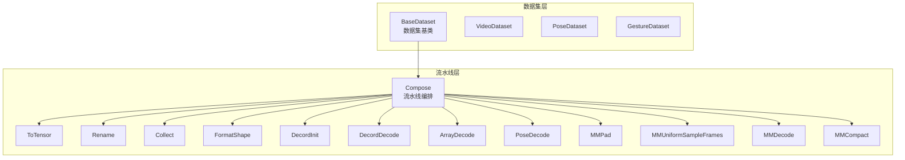
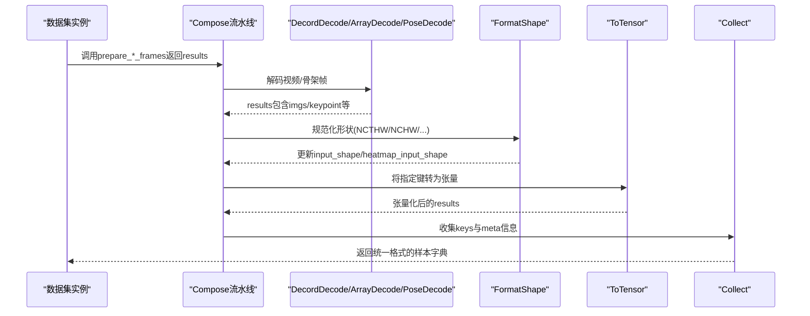
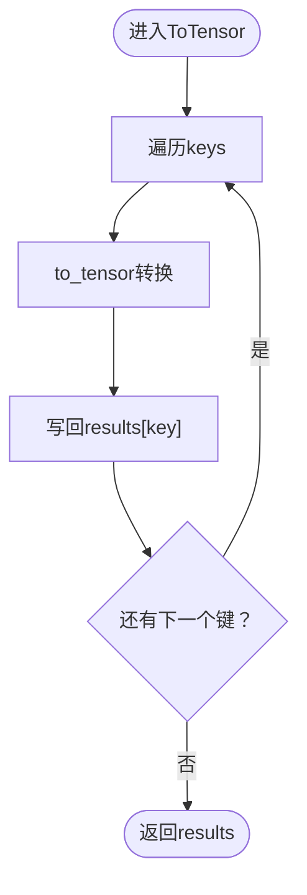
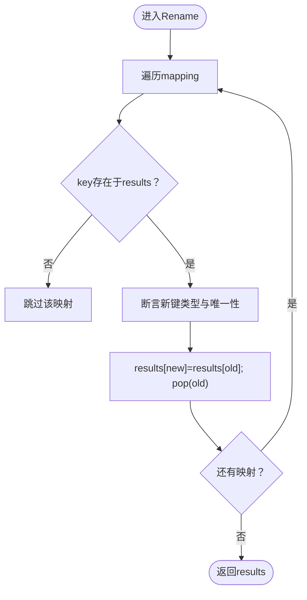
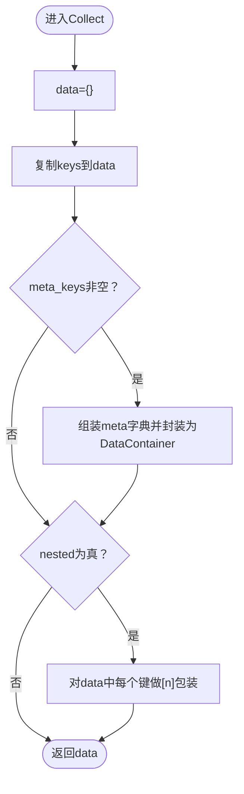
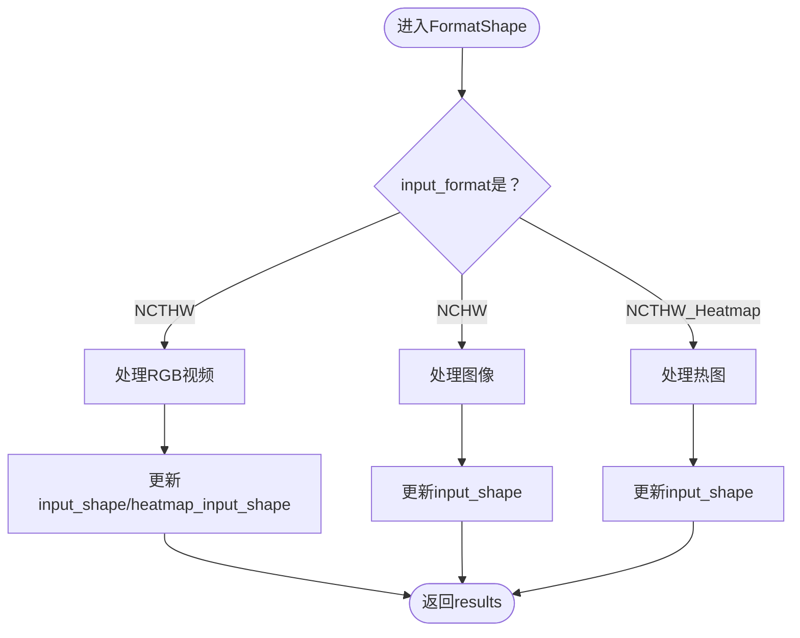
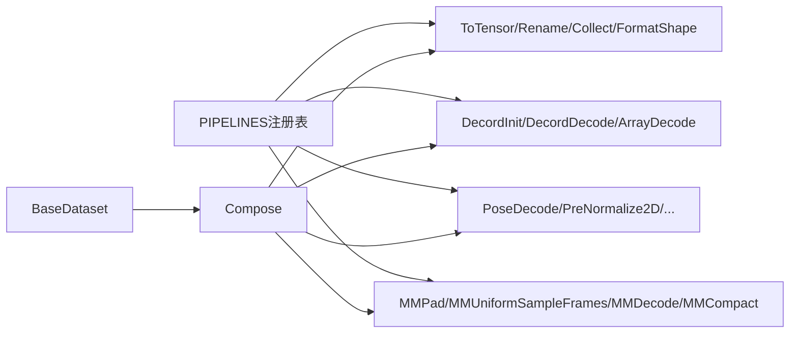

# 数据格式化组件

<cite>
**本文档引用的文件**
- [formatting.py](file://pyskl/datasets/pipelines/formatting.py)
- [compose.py](file://pyskl/datasets/pipelines/compose.py)
- [base.py](file://pyskl/datasets/base.py)
- [builder.py](file://pyskl/datasets/builder.py)
- [video_dataset.py](file://pyskl/datasets/video_dataset.py)
- [pose_dataset.py](file://pyskl/datasets/pose_dataset.py)
- [gesture_dataset.py](file://pyskl/datasets/gesture_dataset.py)
- [loading.py](file://pyskl/datasets/pipelines/loading.py)
- [multi_modality.py](file://pyskl/datasets/pipelines/multi_modality.py)
- [pose_related.py](file://pyskl/datasets/pipelines/pose_related.py)
- [stgcn_pyskl_ntu60_xsub_3dkp/b.py](file://configs/stgcn/stgcn_pyskl_ntu60_xsub_3dkp/b.py)
- [aagcn_pyskl_ntu60_xsub_3dkp/b.py](file://configs/aagcn/aagcn_pyskl_ntu60_xsub_3dkp/b.py)
</cite>

## 目录
1. [简介](#简介)
2. [项目结构](#项目结构)
3. [核心组件](#核心组件)
4. [架构总览](#架构总览)
5. [详细组件分析](#详细组件分析)
6. [依赖关系分析](#依赖关系分析)
7. [性能考虑](#性能考虑)
8. [故障排查指南](#故障排查指南)
9. [结论](#结论)
10. [附录](#附录)

## 简介
本文件聚焦PySKL的数据格式化组件，系统性阐述数据格式化变换的核心能力：张量转换、维度调整、数据类型标准化；并针对不同模态（骨架、视频、图像）给出格式化策略与实践建议。文档还解释了数据验证与类型检查机制，说明格式化组件与流水线其他组件的协作关系，并提供配置选项与使用示例，帮助读者实现自定义格式化规则。

## 项目结构
数据格式化相关代码主要位于以下模块：
- pipelines/formatting.py：提供ToTensor、Rename、Collect、FormatShape等格式化变换
- pipelines/compose.py：流水线编排工具，顺序执行多个变换
- datasets/base.py：数据集基类，负责调用流水线并对结果进行收集与评估
- datasets/builder.py：注册表与数据加载器构建器
- datasets/{video_dataset, pose_dataset, gesture_dataset}.py：具体数据集实现
- datasets/pipelines/loading.py：视频解码与数组解码
- datasets/pipelines/multi_modality.py：多模态采样、解码与对齐
- datasets/pipelines/pose_related.py：骨架相关处理（如预归一化、旋转、缩放等）

图表来源
- [base.py](file://pyskl/datasets/base.py#L19-L354)
- [compose.py](file://pyskl/datasets/pipelines/compose.py#L8-L53)
- [formatting.py](file://pyskl/datasets/pipelines/formatting.py#L30-L250)
- [loading.py](file://pyskl/datasets/pipelines/loading.py#L10-L185)
- [multi_modality.py](file://pyskl/datasets/pipelines/multi_modality.py#L12-L230)
- [pose_related.py](file://pyskl/datasets/pipelines/pose_related.py#L12-L200)

章节来源
- [base.py](file://pyskl/datasets/base.py#L19-L354)
- [compose.py](file://pyskl/datasets/pipelines/compose.py#L8-L53)

## 核心组件
本节聚焦格式化组件的关键类与函数，说明其职责、输入输出与典型用法。

- ToTensor
  - 功能：将结果字典中的指定键转换为张量类型（支持NumPy数组、序列、整型、浮点型等）
  - 关键点：类型检查严格，不支持的类型会抛出异常
  - 典型用途：在流水线末尾将关键张量转为torch.Tensor
- Rename
  - 功能：重命名结果字典中的键，确保新键不存在
  - 关键点：断言校验原键存在且新键唯一
- Collect
  - 功能：收集指定键作为数据，将meta_keys中的键打包为元信息容器
  - 关键点：支持嵌套包装，便于后续collate
- FormatShape
  - 功能：根据输入格式规范调整最终张量形状
  - 支持格式：NCTHW、NCHW、NCTHW_Heatmap
  - 关键点：对视频与热图分别处理，涉及reshape与transpose

章节来源
- [formatting.py](file://pyskl/datasets/pipelines/formatting.py#L11-L27)
- [formatting.py](file://pyskl/datasets/pipelines/formatting.py#L30-L55)
- [formatting.py](file://pyskl/datasets/pipelines/formatting.py#L57-L80)
- [formatting.py](file://pyskl/datasets/pipelines/formatting.py#L82-L158)
- [formatting.py](file://pyskl/datasets/pipelines/formatting.py#L160-L250)

## 架构总览
数据从数据集加载开始，经由Compose顺序执行一系列变换，最终由Collect统一收集并返回给训练/推理流程。格式化组件贯穿其中，承担类型转换、键名管理、形状规整等职责。

图表来源
- [base.py](file://pyskl/datasets/base.py#L262-L304)
- [compose.py](file://pyskl/datasets/pipelines/compose.py#L30-L44)
- [loading.py](file://pyskl/datasets/pipelines/loading.py#L76-L137)
- [pose_related.py](file://pyskl/datasets/pipelines/pose_related.py#L12-L49)
- [formatting.py](file://pyskl/datasets/pipelines/formatting.py#L160-L250)
- [formatting.py](file://pyskl/datasets/pipelines/formatting.py#L30-L158)

## 详细组件分析

### 组件A：ToTensor（张量转换）
- 职责：将results中的指定键转换为torch.Tensor
- 类型支持：NumPy数组、序列、整型、浮点型；已存在的Tensor保持不变
- 错误处理：不支持的类型抛出TypeError
- 使用建议：在流水线末尾集中调用，减少多次类型转换

图表来源
- [formatting.py](file://pyskl/datasets/pipelines/formatting.py#L11-L27)
- [formatting.py](file://pyskl/datasets/pipelines/formatting.py#L39-L51)

章节来源
- [formatting.py](file://pyskl/datasets/pipelines/formatting.py#L11-L27)
- [formatting.py](file://pyskl/datasets/pipelines/formatting.py#L30-L55)

### 组件B：Rename（键名重命名）
- 职责：将results中原键重命名为新键
- 断言校验：原键必须存在；新键不能已存在
- 使用建议：在Collect之前进行，保证下游组件访问一致的键名

图表来源
- [formatting.py](file://pyskl/datasets/pipelines/formatting.py#L57-L80)

章节来源
- [formatting.py](file://pyskl/datasets/pipelines/formatting.py#L57-L80)

### 组件C：Collect（数据收集与元信息打包）
- 职责：提取keys中的数据，将meta_keys中的键打包为元信息容器
- 元信息字段：文件名、标签、原始尺寸、网络输入尺寸、填充尺寸、翻转方向、归一化参数等
- 嵌套包装：可将每个键再包一层列表，便于批处理
- 使用建议：作为流水线最后一步，确保下游collate与模型输入一致

图表来源
- [formatting.py](file://pyskl/datasets/pipelines/formatting.py#L82-L158)

章节来源
- [formatting.py](file://pyskl/datasets/pipelines/formatting.py#L82-L158)

### 组件D：FormatShape（维度调整与形状规整）
- 职责：将最终张量调整为指定输入格式
- 支持格式：
  - NCTHW：视频帧按裁剪×时长重组，通道维在中间
  - NCHW：图像通道维在中间
  - NCTHW_Heatmap：热图通道维在中间
- 关键逻辑：对视频与热图分别处理，涉及reshape与transpose
- 注意事项：输入需包含必要的元信息（如num_clips、clip_len），且clip_len可能为字典（区分RGB与Pose）

图表来源
- [formatting.py](file://pyskl/datasets/pipelines/formatting.py#L160-L250)

章节来源
- [formatting.py](file://pyskl/datasets/pipelines/formatting.py#L160-L250)

### 多模态数据格式化策略
- 视频模态（RGB/Flow）
  - 解码：DecordDecode或ArrayDecode按帧索引读取
  - 形状：通常为NCHW或NCTHW，依据模型需求选择FormatShape
  - 元信息：原始尺寸、输入尺寸、翻转方向、归一化参数等
- 骨架模态（Pose）
  - 解码：PoseDecode按帧索引抽取关键点
  - 预处理：PreNormalize2D、RandomRot、RandomScale、RandomGaussianNoise等
  - 输入：常为MTV或MTVC（含置信度），后续可能经FormatGCNInput等转换
- 图像模态（RGB）
  - 解码：ArrayDecode从数组中按索引取帧
  - 形状：一般为NCHW

章节来源
- [loading.py](file://pyskl/datasets/pipelines/loading.py#L76-L185)
- [pose_related.py](file://pyskl/datasets/pipelines/pose_related.py#L12-L200)
- [multi_modality.py](file://pyskl/datasets/pipelines/multi_modality.py#L81-L130)

### 数据验证与类型检查机制
- 类型转换：to_tensor对输入类型进行严格判断，不支持的类型抛错
- 键名校验：Rename在重命名前断言原键存在且新键唯一
- 形状一致性：FormatShape要求存在num_clips、clip_len等元信息；当clip_len为字典时区分RGB与Pose
- 多模态一致性：MMDecode在解码后对关键点坐标按实际图像尺寸进行比例缩放

章节来源
- [formatting.py](file://pyskl/datasets/pipelines/formatting.py#L11-L27)
- [formatting.py](file://pyskl/datasets/pipelines/formatting.py#L57-L80)
- [formatting.py](file://pyskl/datasets/pipelines/formatting.py#L160-L250)
- [multi_modality.py](file://pyskl/datasets/pipelines/multi_modality.py#L90-L130)

### 与其他流水线组件的协作关系
- BaseDataset在prepare_*_frames中调用Compose执行流水线
- Compose顺序执行各变换，确保数据在每一步都满足后续组件的期望
- Collect作为收尾，统一输出格式，供DataLoader与模型消费

章节来源
- [base.py](file://pyskl/datasets/base.py#L262-L304)
- [compose.py](file://pyskl/datasets/pipelines/compose.py#L30-L44)

### 配置选项与使用示例
- 配置要点
  - keys：ToTensor的目标键集合
  - mapping：Rename的键映射
  - keys/meta_keys/meta_name/nested：Collect的收集范围与元信息组织
  - input_format：FormatShape的输入格式（NCTHW/NCHW/NCTHW_Heatmap）
- 示例参考
  - ST-GCN骨架配置：展示从骨架特征生成到格式化输入再到张量化的完整流水线
  - AAGCN骨架配置：同上，强调不同骨干网络下的统一格式化流程

章节来源
- [stgcn_pyskl_ntu60_xsub_3dkp/b.py](file://configs/stgcn/stgcn_pyskl_ntu60_xsub_3dkp/b.py#L10-L36)
- [aagcn_pyskl_ntu60_xsub_3dkp/b.py](file://configs/aagcn/aagcn_pyskl_ntu60_xsub_3dkp/b.py#L10-L36)

## 依赖关系分析
- 注册机制：PIPELINES注册表用于动态构建变换对象
- 数据集与流水线：BaseDataset持有Compose实例并在getitem中顺序执行
- 多模态协同：MMDecode、MMUniformSampleFrames、MMPad、MMCompact等共同完成多模态采样与对齐

图表来源
- [builder.py](file://pyskl/datasets/builder.py#L22-L26)
- [base.py](file://pyskl/datasets/base.py#L70-L71)
- [compose.py](file://pyskl/datasets/pipelines/compose.py#L17-L44)
- [multi_modality.py](file://pyskl/datasets/pipelines/multi_modality.py#L12-L130)

章节来源
- [builder.py](file://pyskl/datasets/builder.py#L22-L26)
- [base.py](file://pyskl/datasets/base.py#L70-L71)

## 性能考虑
- 类型转换成本：ToTensor在流水线末尾集中执行，避免重复转换
- 形状变换：FormatShape的reshape与transpose为纯NumPy操作，注意内存占用
- 多模态对齐：MMDecode后对关键点坐标按实际图像尺寸缩放，避免额外开销
- 批处理：Collect与DataLoader的collate配合，确保批次内元素形状一致

## 故障排查指南
- 类型错误：to_tensor报TypeError，检查输入类型是否在支持范围内
- 键名冲突：Rename断言失败，确认新键未被占用且原键存在
- 形状异常：FormatShape报错，检查num_clips、clip_len是否正确传入
- 多模态不匹配：MMDecode解码后关键点与图像尺寸不一致，确认img_shape与实际尺寸一致

章节来源
- [formatting.py](file://pyskl/datasets/pipelines/formatting.py#L11-L27)
- [formatting.py](file://pyskl/datasets/pipelines/formatting.py#L57-L80)
- [formatting.py](file://pyskl/datasets/pipelines/formatting.py#L160-L250)
- [multi_modality.py](file://pyskl/datasets/pipelines/multi_modality.py#L90-L130)

## 结论
数据格式化组件通过ToTensor、Rename、Collect与FormatShape等核心变换，实现了对多模态数据的统一类型与形状规整。结合BaseDataset与Compose的流水线设计，能够稳定地将原始视频/骨架数据转换为模型可接受的张量格式。合理配置与严格的类型/键名校验，有助于提升系统的可靠性与可维护性。

## 附录
- 自定义格式化规则建议
  - 在PIPELINES注册表中注册新变换类，遵循__call__签名接收results并返回
  - 保持幂等性与无副作用，必要时在__init__中完成参数校验
  - 与Collect配合，确保输出键名与下游组件一致