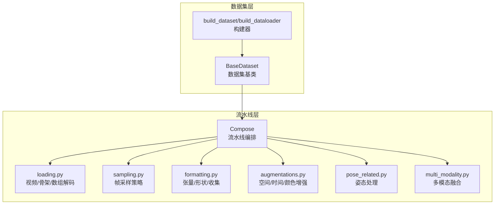
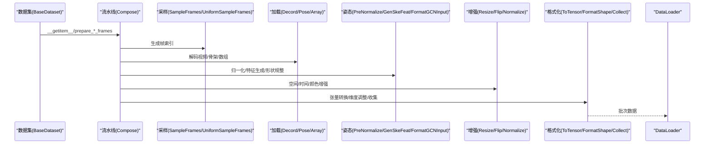
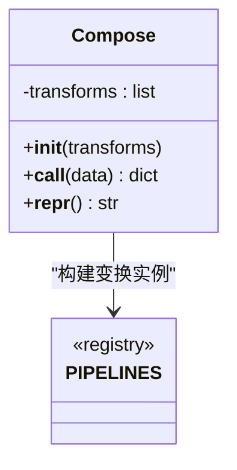
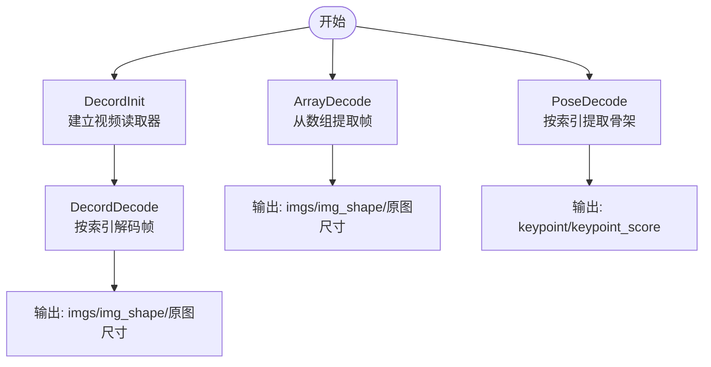
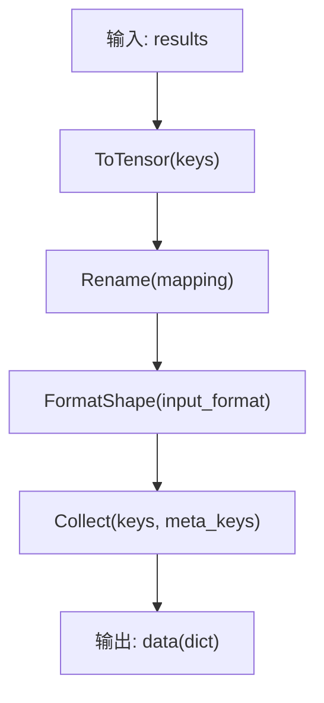
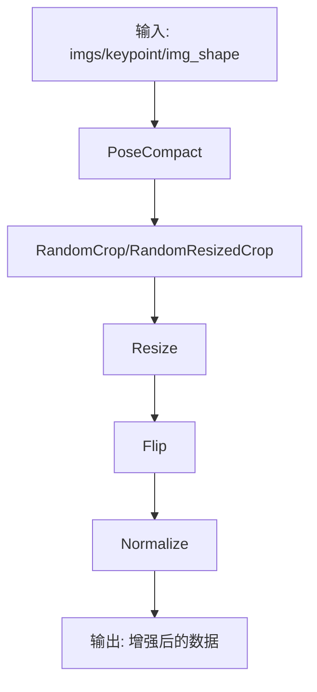
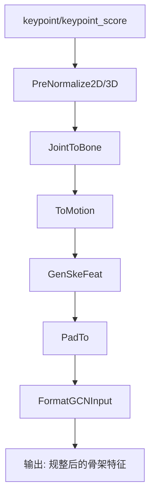
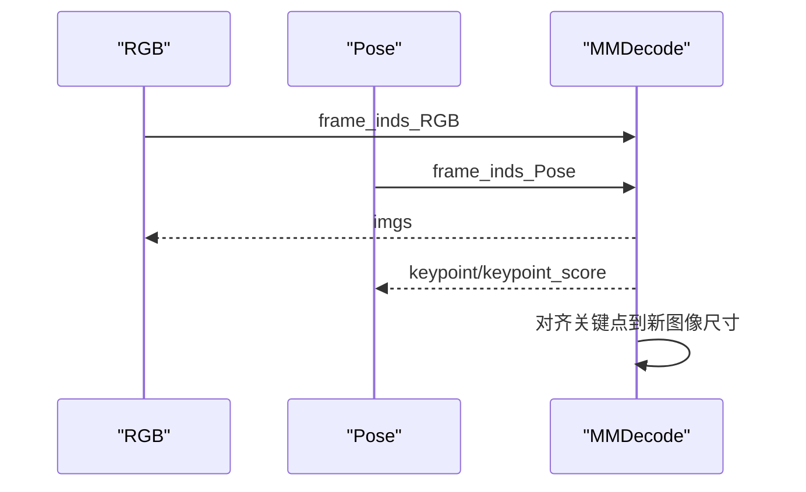
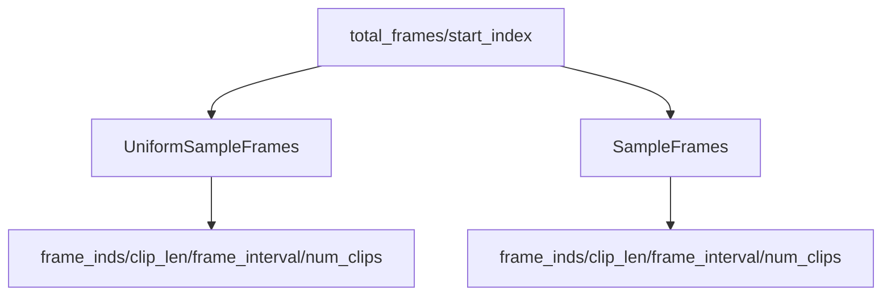
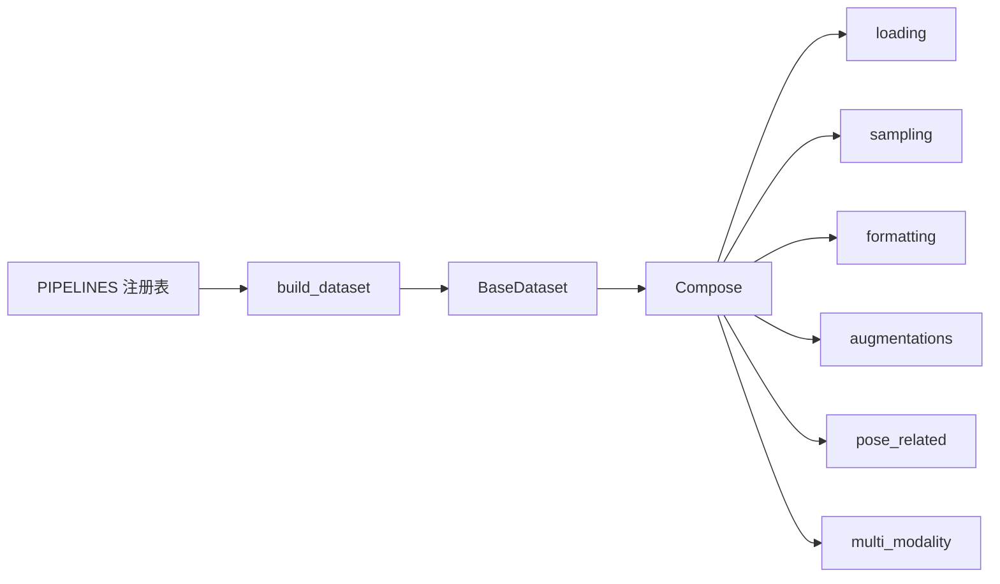

# 数据预处理流水线

<cite>
**本文档引用的文件**
- [compose.py](file://pyskl/datasets/pipelines/compose.py)
- [loading.py](file://pyskl/datasets/pipelines/loading.py)
- [formatting.py](file://pyskl/datasets/pipelines/formatting.py)
- [augmentations.py](file://pyskl/datasets/pipelines/augmentations.py)
- [pose_related.py](file://pyskl/datasets/pipelines/pose_related.py)
- [multi_modality.py](file://pyskl/datasets/pipelines/multi_modality.py)
- [sampling.py](file://pyskl/datasets/pipelines/sampling.py)
- [builder.py](file://pyskl/datasets/builder.py)
- [base.py](file://pyskl/datasets/base.py)
- [__init__.py](file://pyskl/datasets/pipelines/__init__.py)
- [b.py](file://configs/stgcn/stgcn_pyskl_ntu60_xsub_3dkp/b.py)
- [demo_skeleton.py](file://demo/demo_skeleton.py)
</cite>

## 目录
1. [简介](#简介)
2. [项目结构](#项目结构)
3. [核心组件](#核心组件)
4. [架构总览](#架构总览)
5. [详细组件分析](#详细组件分析)
6. [依赖关系分析](#依赖关系分析)
7. [性能考虑](#性能考虑)
8. [故障排查指南](#故障排查指南)
9. [结论](#结论)
10. [附录](#附录)

## 简介
本文件系统性梳理 PySKL 的数据预处理流水线，围绕 Compose 流水线的设计与执行机制展开，覆盖数据加载、格式化、增强、姿态处理、多模态融合、采样策略等关键环节，并结合配置与示例给出最佳实践与调试建议。目标读者既包括需要快速上手的工程师，也包括希望深入理解实现细节的研究者。

## 项目结构
数据预处理相关代码集中在 `pyskl/datasets/pipelines` 目录，采用“功能域+职责”的组织方式：
- pipelines 子模块：按功能划分为加载、格式化、增强、姿态相关、多模态、采样等
- builder：注册表与数据加载器构建
- base：数据集基类，封装流水线调用与评估逻辑
- configs：各模型的流水线配置示例

图表来源
- [base.py](file://pyskl/datasets/base.py#L19-L354)
- [builder.py](file://pyskl/datasets/builder.py#L31-L134)
- [compose.py](file://pyskl/datasets/pipelines/compose.py#L8-L53)
- [loading.py](file://pyskl/datasets/pipelines/loading.py#L10-L185)
- [formatting.py](file://pyskl/datasets/pipelines/formatting.py#L30-L250)
- [augmentations.py](file://pyskl/datasets/pipelines/augmentations.py#L16-L800)
- [pose_related.py](file://pyskl/datasets/pipelines/pose_related.py#L12-L553)
- [multi_modality.py](file://pyskl/datasets/pipelines/multi_modality.py#L12-L230)
- [sampling.py](file://pyskl/datasets/pipelines/sampling.py#L9-L468)

章节来源
- [base.py](file://pyskl/datasets/base.py#L19-L354)
- [builder.py](file://pyskl/datasets/builder.py#L31-L134)

## 核心组件
- Compose：流水线编排器，负责顺序执行一组变换，支持字典配置与可调用对象混用
- 加载组件：DecordInit/DecordDecode（视频）、ArrayDecode（数组）、PoseDecode（骨架）
- 格式化组件：ToTensor、Rename、Collect、FormatShape
- 增强组件：PoseCompact、RandomCrop/RandomResizedCrop、Resize、Flip、Normalize、CenterCrop、ThreeCrop、TenCrop 等
- 姿态组件：PreNormalize2D/3D、RandomRot、RandomScale、RandomGaussianNoise、JointToBone、ToMotion、GenSkeFeat、PadTo、FormatGCNInput、DecompressPose
- 多模态组件：MMPad、MMUniformSampleFrames、MMDecode、MMCompact
- 采样组件：UniformSampleFrames、SampleFrames、UniformSampleDecode
- 构建器：注册表 PIPELINES、build_dataset、build_dataloader

章节来源
- [compose.py](file://pyskl/datasets/pipelines/compose.py#L8-L53)
- [loading.py](file://pyskl/datasets/pipelines/loading.py#L10-L185)
- [formatting.py](file://pyskl/datasets/pipelines/formatting.py#L30-L250)
- [augmentations.py](file://pyskl/datasets/pipelines/augmentations.py#L16-L800)
- [pose_related.py](file://pyskl/datasets/pipelines/pose_related.py#L12-L553)
- [multi_modality.py](file://pyskl/datasets/pipelines/multi_modality.py#L12-L230)
- [sampling.py](file://pyskl/datasets/pipelines/sampling.py#L9-L468)
- [builder.py](file://pyskl/datasets/builder.py#L22-L134)

## 架构总览
数据从数据集基类进入流水线，依次经过采样、加载、姿态处理、增强、格式化与收集，最终由 DataLoader 输出批次数据。多模态场景下，MMDecode 统一处理 RGB 与 Pose 两类模态的采样与解码，并对关键点进行尺度对齐。

图表来源
- [base.py](file://pyskl/datasets/base.py#L262-L345)
- [compose.py](file://pyskl/datasets/pipelines/compose.py#L30-L44)
- [sampling.py](file://pyskl/datasets/pipelines/sampling.py#L128-L164)
- [loading.py](file://pyskl/datasets/pipelines/loading.py#L47-L133)
- [pose_related.py](file://pyskl/datasets/pipelines/pose_related.py#L12-L49)
- [formatting.py](file://pyskl/datasets/pipelines/formatting.py#L30-L157)
- [augmentations.py](file://pyskl/datasets/pipelines/augmentations.py#L16-L800)
- [multi_modality.py](file://pyskl/datasets/pipelines/multi_modality.py#L82-L129)

## 详细组件分析

### Compose 流水线设计与执行机制
- 设计原则
  - 通过注册表 PIPELINES 动态构建变换实例，支持字典配置与直接传入可调用对象
  - 严格顺序执行，前一变换的输出作为后一变换的输入，返回 None 则提前终止
- 执行流程
  - 初始化阶段：遍历 transforms，将 dict 转为实例，或直接保留可调用对象
  - 调用阶段：逐个调用 transform(data)，若返回 None 则返回 None；否则继续
- 参数传递
  - 所有变换共享同一份 results 字典，键名约定决定数据流转
  - 建议遵循“必要键/新增键/修改键”的命名规范，便于调试与复用

图表来源
- [compose.py](file://pyskl/datasets/pipelines/compose.py#L8-L53)
- [builder.py](file://pyskl/datasets/builder.py#L22-L26)

章节来源
- [compose.py](file://pyskl/datasets/pipelines/compose.py#L8-L53)

### 数据加载组件
- DecordInit/DecordDecode
  - 初始化：建立视频读取器，记录 total_frames
  - 解码：根据 frame_inds 选择帧，支持准确/高效两种模式
  - 输出：imgs、img_shape/original_shape、清理 video_reader
- ArrayDecode
  - 面向已加载的四维数组，按 frame_inds 提取 RGB 或 Flow（通道拼接）
- PoseDecode
  - 面向骨架数据，按 frame_inds 提取关键点与分数

图表来源
- [loading.py](file://pyskl/datasets/pipelines/loading.py#L10-L185)

章节来源
- [loading.py](file://pyskl/datasets/pipelines/loading.py#L10-L185)

### 数据格式化组件
- ToTensor：将数值/序列转为 Tensor，支持 int/float/Sequence/ndarray/tensor
- Rename：重命名 results 中的键
- Collect：收集 keys 与 meta_keys，封装为 DataContainer
- FormatShape：按 input_format 调整 imgs/heatmap_imgs 的维度顺序与形状

图表来源
- [formatting.py](file://pyskl/datasets/pipelines/formatting.py#L30-L250)

章节来源
- [formatting.py](file://pyskl/datasets/pipelines/formatting.py#L30-L250)

### 数据增强策略
- 空间增强
  - PoseCompact：基于关键点紧致化裁剪，支持 hw_ratio 与 padding
  - RandomCrop/RandomResizedCrop：随机方/非方框裁剪，维护 crop_quadruple
  - Resize：保持/不保持长宽比缩放，同步缩放关键点与边界框
  - Flip：水平/垂直翻转，Flow 特殊处理与左右关键点映射
  - CenterCrop/ThreeCrop/TenCrop：中心/三裁/十裁策略
- 时间增强
  - Normalize：对 RGB/Flow 分别归一化，Flow 可按尺度因子调整幅值
- 颜色变换
  - 通过 Normalize 实现均值/方差标准化，支持 BGR 转换

图表来源
- [augmentations.py](file://pyskl/datasets/pipelines/augmentations.py#L16-L800)

章节来源
- [augmentations.py](file://pyskl/datasets/pipelines/augmentations.py#L16-L800)

### 姿态相关处理组件
- PreNormalize2D/3D：关键点归一化，支持 auto/fix 模式与 NTURGB+D 对齐
- RandomRot/RandomScale/RandomGaussianNoise：随机旋转、缩放、噪声注入
- JointToBone/ToMotion：将关键点转换为骨骼向量与运动场
- GenSkeFeat：组合生成多通道骨架特征（如关节、骨骼、运动）
- PadTo/FormatGCNInput：补齐帧数与规整 GCN 输入形状
- DecompressPose：压缩标注解压为标准 M×T×V×C 结构

图表来源
- [pose_related.py](file://pyskl/datasets/pipelines/pose_related.py#L12-L553)

章节来源
- [pose_related.py](file://pyskl/datasets/pipelines/pose_related.py#L12-L553)

### 多模态数据处理
- MMPad：按比例 padding 并同步关键点与图像
- MMUniformSampleFrames：为多模态分别生成帧索引
- MMDecode：统一解码 RGB 与 Pose，对齐关键点到新图像尺寸
- MMCompact：多模态紧致化裁剪

图表来源
- [multi_modality.py](file://pyskl/datasets/pipelines/multi_modality.py#L82-L129)

章节来源
- [multi_modality.py](file://pyskl/datasets/pipelines/multi_modality.py#L12-L230)

### 采样策略
- UniformSampleFrames：均匀采样，训练/测试分别实现，支持区间比例与过渡帧处理
- SampleFrames：固定间隔采样，支持抖动、重复尾帧、越界策略
- UniformSampleDecode：直接返回裁剪片段，用于骨架数据的端到端采样

图表来源
- [sampling.py](file://pyskl/datasets/pipelines/sampling.py#L9-L468)

章节来源
- [sampling.py](file://pyskl/datasets/pipelines/sampling.py#L9-L468)

## 依赖关系分析
- 注册与构建
  - PIPELINES 注册表统一管理流水线组件，build_dataset 通过注册表构建数据集
  - BaseDataset 将 pipeline 配置转为 Compose 实例，贯穿 prepare_*_frames
- 组件耦合
  - 加载与增强依赖 img_shape、keypoint 等键；格式化依赖 ToTensor/Collect
  - 多模态组件依赖加载组件与采样组件
- 外部依赖
  - decord 用于视频解码
  - mmcv 用于图像/视频处理与数据容器

图表来源
- [builder.py](file://pyskl/datasets/builder.py#L22-L46)
- [base.py](file://pyskl/datasets/base.py#L70-L71)
- [compose.py](file://pyskl/datasets/pipelines/compose.py#L17-L28)

章节来源
- [builder.py](file://pyskl/datasets/builder.py#L22-L46)
- [base.py](file://pyskl/datasets/base.py#L70-L71)

## 性能考虑
- I/O 与解码
  - DecordInit/DecordDecode 的 num_threads 与 io_backend 会影响解码速度
  - ArrayDecode 避免重复解码，适合已加载数组场景
- 内存与显存
  - FormatShape 在高分辨率/长时序下会放大内存占用，合理选择 input_format
  - Normalize 对大数组进行就地归一化，注意内存布局
- 并行与批处理
  - build_dataloader 支持分布式采样与持久化工作进程，提升吞吐
- 采样策略
  - UniformSampleFrames 在长视频上更均衡，SampleFrames 在固定间隔下更稳定
- 增强开销
  - Resize/Flip/Normalize 等增强操作在 GPU 上可并行，但需注意批内一致性

[本节为通用指导，无需具体文件来源]

## 故障排查指南
- 常见问题
  - 键缺失：确保采样/加载/姿态处理步骤按顺序执行，键名一致
  - 形状不匹配：检查 FormatShape 的 input_format 与后续网络期望一致
  - 多模态对齐：MMDecode 后需对关键点按新图像尺寸缩放
  - Decord 安装：缺少 decord 时会抛出 ImportError，需安装 decord
- 调试建议
  - 在流水线中间插入 Collect/ToTensor 观察中间张量形状
  - 使用较小 batch 与少量样本验证流水线正确性
  - 对比不同 input_format 下的 input_shape 与显存占用
  - 在多模态场景下打印 frame_inds 与 img_shape，确认采样与解码一致

章节来源
- [loading.py](file://pyskl/datasets/pipelines/loading.py#L36-L45)
- [multi_modality.py](file://pyskl/datasets/pipelines/multi_modality.py#L90-L129)

## 结论
PySKL 的数据预处理流水线以 Compose 为核心，围绕视频/骨架/数组的加载、采样、姿态处理、增强与格式化形成完整链路。通过注册表与配置驱动，流水线具备高度可扩展性；多模态组件进一步增强了跨模态融合能力。实践中应关注键名约定、形状规整与性能瓶颈，结合配置示例与调试技巧，可快速搭建稳定高效的预处理流水线。

[本节为总结，无需具体文件来源]

## 附录

### 配置示例与使用要点
- ST-GCN 骨骼流水线示例
  - PreNormalize3D → GenSkeFeat → UniformSample → PoseDecode → FormatGCNInput → Collect → ToTensor
  - 训练/验证/测试的 num_clips 与 clip_len 差异体现了不同的采样策略
- 示例脚本
  - demo_skeleton.py 展示了从视频到骨架再到推理的端到端流程，可用于验证流水线与模型集成

章节来源
- [b.py](file://configs/stgcn/stgcn_pyskl_ntu60_xsub_3dkp/b.py#L10-L36)
- [demo_skeleton.py](file://demo/demo_skeleton.py#L227-L314)