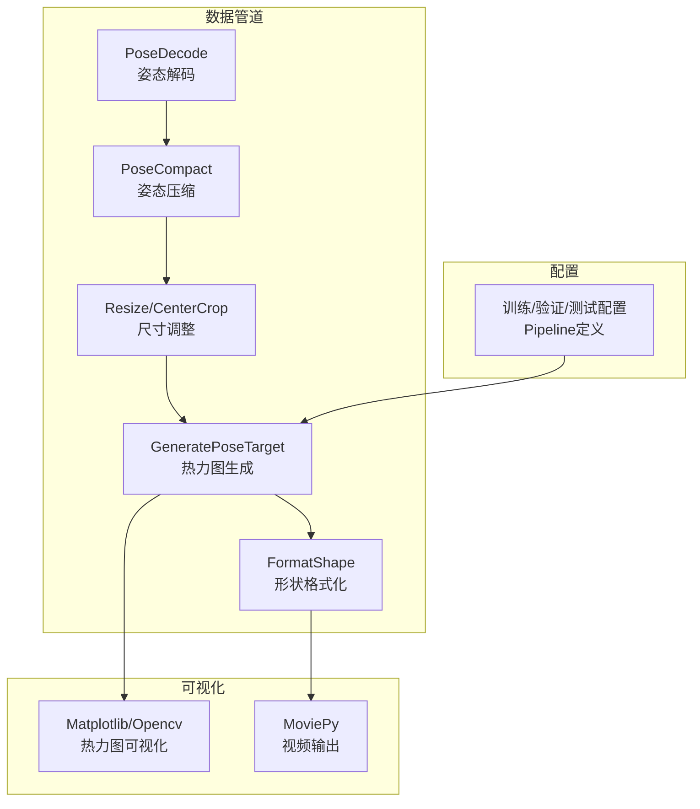
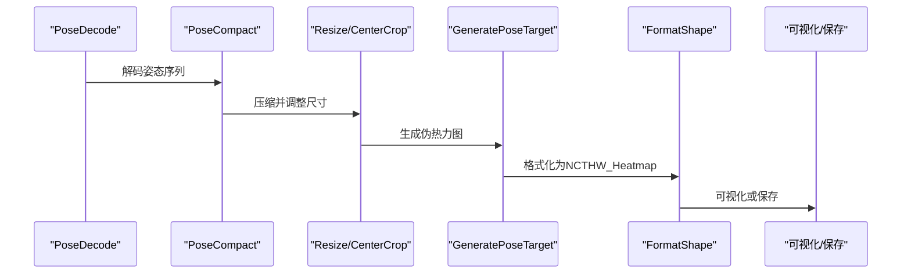
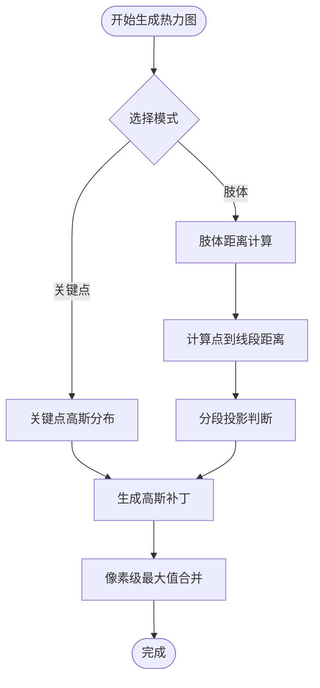
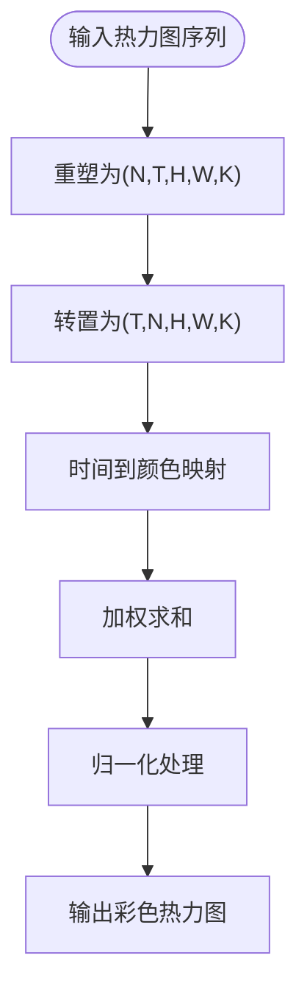
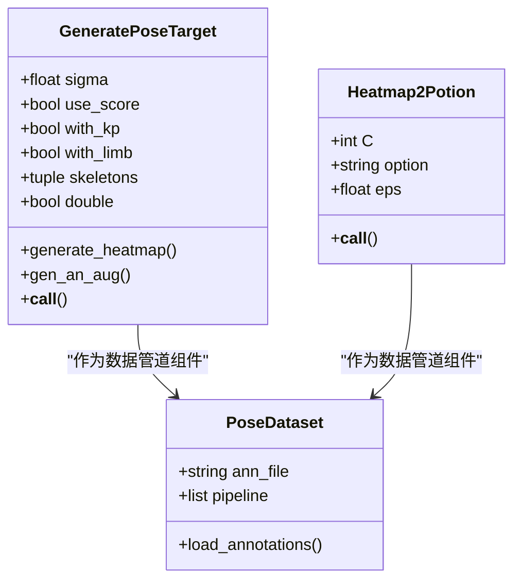
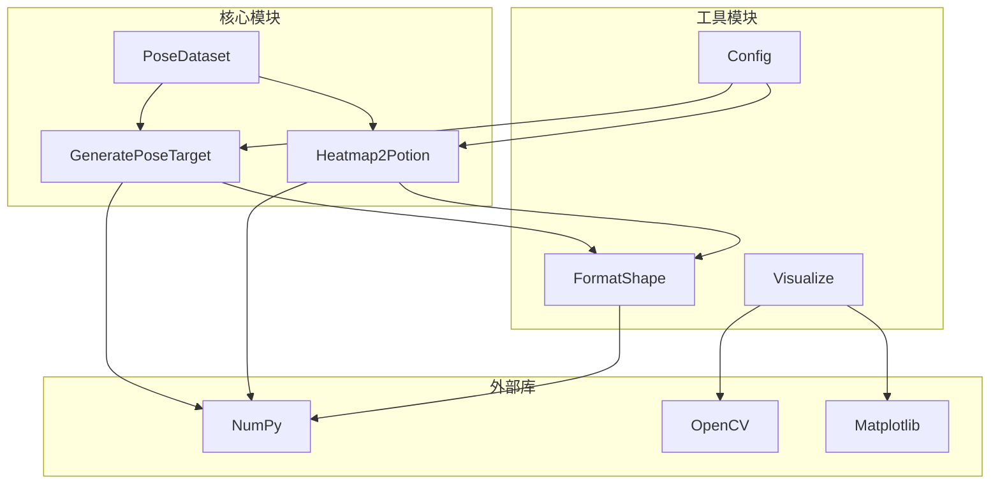

# 热力图处理组件

<cite>
**本文档引用的文件**
- [heatmap_related.py](file://pyskl/datasets/pipelines/heatmap_related.py)
- [visualize_heatmap_volume.ipynb](file://demo/visualize_heatmap_volume.ipynb)
- [demo_skeleton.py](file://demo/demo_skeleton.py)
- [pose_dataset.py](file://pyskl/datasets/pose_dataset.py)
- [formatting.py](file://pyskl/datasets/pipelines/formatting.py)
- [visualize.py](file://pyskl/utils/visualize.py)
- [slowonly_r50_ntu120_xsub/joint.py](file://configs/posec3d/slowonly_r50_ntu120_xsub/joint.py)
</cite>

## 目录
1. [简介](#简介)
2. [项目结构](#项目结构)
3. [核心组件](#核心组件)
4. [架构概览](#架构概览)
5. [详细组件分析](#详细组件分析)
6. [依赖关系分析](#依赖关系分析)
7. [性能考虑](#性能考虑)
8. [故障排除指南](#故障排除指南)
9. [结论](#结论)
10. [附录](#附录)

## 简介
本文件详细介绍了PySKL项目中的热力图处理组件，重点涵盖以下方面：
- 热力图生成：基于高斯分布的伪热力图生成，支持关键点和肢体两种模式
- 热力图变换：时间维度到颜色空间的映射，生成彩色热力图体积
- 热力图合并：多通道热力图的归一化和融合策略
- 数学原理与算法：高斯分布、距离计算、归一化处理
- 应用场景：骨架动作识别中的特征表示与模型输入
- 参数配置与质量控制：关键参数调优与质量保证
- 使用示例与性能优化：实际应用指导与效率提升技巧

## 项目结构
热力图处理组件主要位于数据管道中，与姿态数据集、格式化模块和可视化工具协同工作。

**图表来源**
- [heatmap_related.py](file://pyskl/datasets/pipelines/heatmap_related.py#L1-L349)
- [formatting.py](file://pyskl/datasets/pipelines/formatting.py#L176-L210)
- [visualize_heatmap_volume.ipynb](file://demo/visualize_heatmap_volume.ipynb#L126-L161)

**章节来源**
- [heatmap_related.py](file://pyskl/datasets/pipelines/heatmap_related.py#L1-L349)
- [formatting.py](file://pyskl/datasets/pipelines/formatting.py#L176-L210)

## 核心组件
热力图处理组件由两个核心类组成：
- GeneratePoseTarget：生成伪热力图（关键点或肢体）
- Heatmap2Potion：将热力图转换为彩色热力图体积

这两个组件通过数据管道串联，实现从姿态序列到热力图特征的完整转换。

**章节来源**
- [heatmap_related.py](file://pyskl/datasets/pipelines/heatmap_related.py#L9-L274)
- [heatmap_related.py](file://pyskl/datasets/pipelines/heatmap_related.py#L280-L348)

## 架构概览
热力图处理的端到端流程如下：

**图表来源**
- [heatmap_related.py](file://pyskl/datasets/pipelines/heatmap_related.py#L207-L262)
- [formatting.py](file://pyskl/datasets/pipelines/formatting.py#L176-L210)

## 详细组件分析

### GeneratePoseTarget 组件
GeneratePoseTarget负责生成伪热力图，支持关键点和肢体两种模式，采用高斯分布进行空间扩散。

#### 数学原理与算法
- 高斯分布核：以关键点为中心，使用高斯函数进行权重分配
- 距离计算：关键点模式使用二维欧氏距离；肢体模式使用点到线段的距离
- 归一化策略：对每个像素位置取最大值，避免多目标重叠时的数值叠加

**图表来源**
- [heatmap_related.py](file://pyskl/datasets/pipelines/heatmap_related.py#L73-L107)
- [heatmap_related.py](file://pyskl/datasets/pipelines/heatmap_related.py#L109-L177)

#### 关键算法实现要点
- 高斯核裁剪：仅计算包含有效区域的子矩阵，提高效率
- 多目标处理：对同一像素位置取所有目标的最大值
- 边界处理：确保索引不越界，合理截断热力图范围

**章节来源**
- [heatmap_related.py](file://pyskl/datasets/pipelines/heatmap_related.py#L73-L107)
- [heatmap_related.py](file://pyskl/datasets/pipelines/heatmap_related.py#L109-L177)

### Heatmap2Potion 组件
Heatmap2Potion将时间维度映射到颜色空间，生成彩色热力图体积。

#### 数学原理与算法
- 时间到颜色映射：线性插值将时间步映射到颜色向量
- 热力图体积构建：按时间步加权求和得到彩色热力图
- 归一化策略：三种归一化方案（U、I、N）用于不同下游任务

**图表来源**
- [heatmap_related.py](file://pyskl/datasets/pipelines/heatmap_related.py#L280-L348)

#### 归一化策略详解
- U_norm：全局最大值归一化
- I_sum：沿颜色维度求和
- N_norm：I_sum后的归一化

**章节来源**
- [heatmap_related.py](file://pyskl/datasets/pipelines/heatmap_related.py#L280-L348)

### 数据流与格式化
热力图生成后需要进行格式化，以便后续模型处理。

**图表来源**
- [heatmap_related.py](file://pyskl/datasets/pipelines/heatmap_related.py#L9-L274)
- [heatmap_related.py](file://pyskl/datasets/pipelines/heatmap_related.py#L280-L348)
- [pose_dataset.py](file://pyskl/datasets/pose_dataset.py#L10-L107)

**章节来源**
- [formatting.py](file://pyskl/datasets/pipelines/formatting.py#L176-L210)
- [pose_dataset.py](file://pyskl/datasets/pose_dataset.py#L10-L107)

## 依赖关系分析

**图表来源**
- [heatmap_related.py](file://pyskl/datasets/pipelines/heatmap_related.py#L1-L349)
- [formatting.py](file://pyskl/datasets/pipelines/formatting.py#L176-L210)
- [pose_dataset.py](file://pyskl/datasets/pose_dataset.py#L10-L107)

**章节来源**
- [visualize.py](file://pyskl/utils/visualize.py#L1-L200)

## 性能考虑

### 计算效率优化
1. **高斯核裁剪**：仅计算有效区域，减少不必要的计算
2. **向量化操作**：使用NumPy的向量化运算替代循环
3. **内存复用**：在单帧内复用数组，避免重复分配

### 内存管理
1. **数据类型选择**：使用float32存储热力图，平衡精度与内存
2. **批量处理**：合理设置批大小，避免内存溢出
3. **及时释放**：处理完成后及时释放中间变量

### 参数调优建议
- **sigma参数**：根据输入分辨率调整，一般在0.3-1.0之间
- **尺度缩放**：预处理时适当缩小输入尺寸可显著提升速度
- **双翻转增强**：在训练时启用可提升泛化能力但会增加计算

## 故障排除指南

### 常见问题与解决方案
1. **热力图过亮或过暗**
   - 检查sigma参数是否过大或过小
   - 确认use_score参数设置是否正确
   
2. **内存不足错误**
   - 减少batch size或clip_len
   - 降低输入分辨率
   
3. **热力图边界异常**
   - 检查img_shape与keypoint坐标的一致性
   - 确认scaling参数设置

**章节来源**
- [heatmap_related.py](file://pyskl/datasets/pipelines/heatmap_related.py#L5-L71)

## 结论
PySKL的热力图处理组件提供了完整的骨架动作识别特征生成流程。通过高斯分布的空间扩散、时间到颜色的映射以及多种归一化策略，实现了从原始姿态序列到高质量热力图特征的有效转换。该组件具有良好的扩展性和实用性，能够满足不同规模和复杂度的动作识别任务需求。

## 附录

### 使用示例
参考演示脚本了解完整的使用流程：
- [可视化热力图体积](file://demo/visualize_heatmap_volume.ipynb#L126-L161)
- [骨架动作识别演示](file://demo/demo_skeleton.py#L227-L314)

### 配置参考
- [PoseC3D配置示例](file://configs/posec3d/slowonly_r50_ntu120_xsub/joint.py#L27-L59)

### 数学公式摘要
- 高斯分布：$G(x,y) = \exp(-\frac{(x-\mu_x)^2+(y-\mu_y)^2}{2\sigma^2})$
- 点到线段距离：$d^2 = \min(d_{start}^2, d_{end}^2, d_{line}^2)$
- 归一化：$x_{norm} = \frac{x}{\max(x)+\epsilon}$