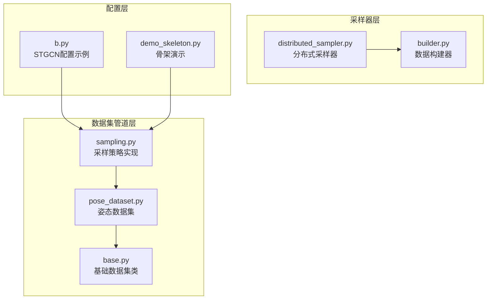
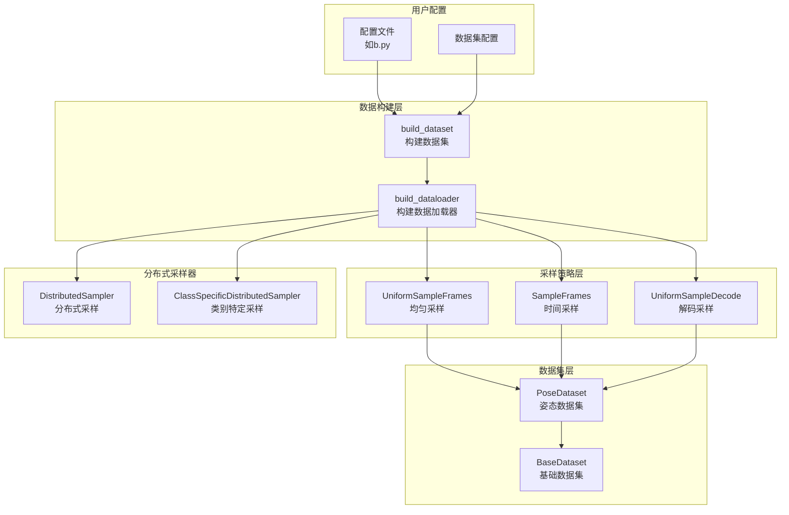
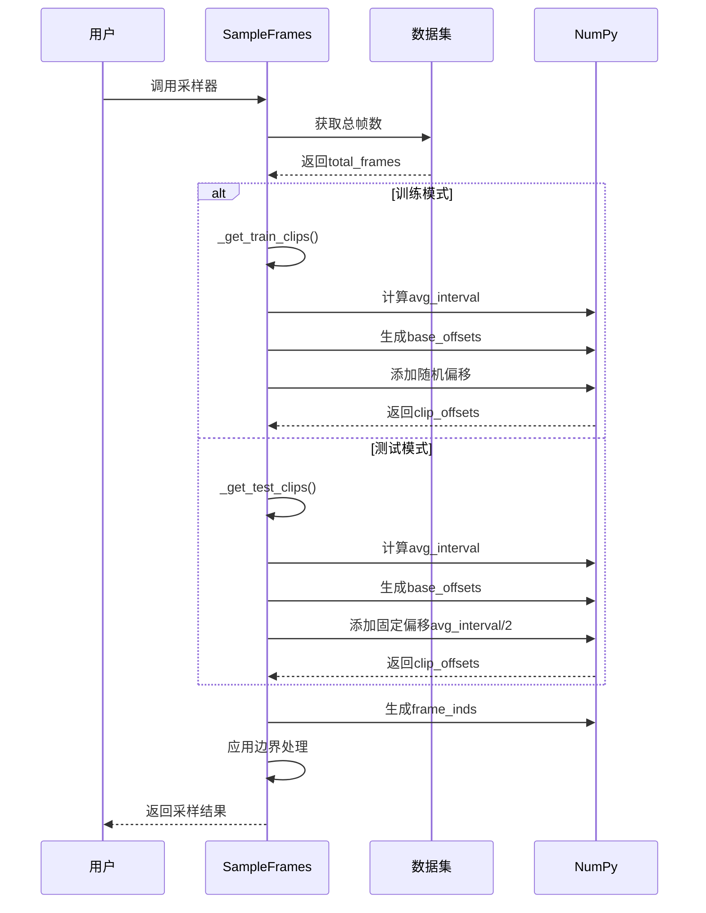
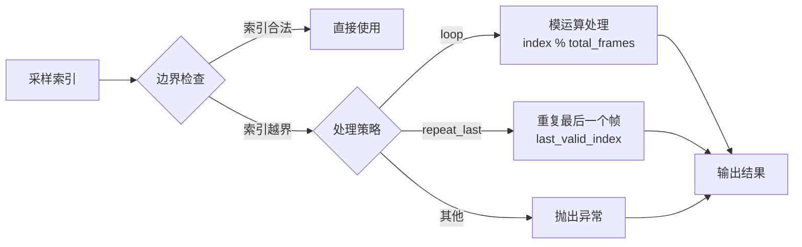
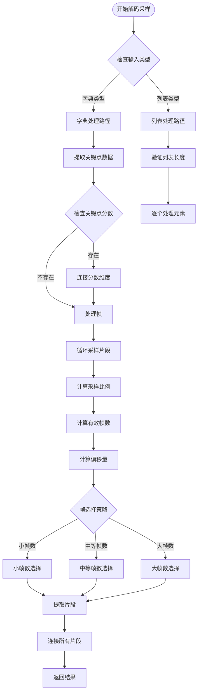
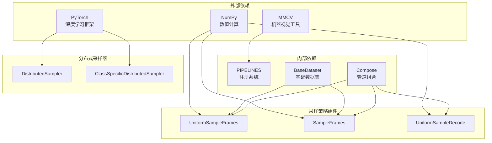

# 采样策略组件

<cite>
**本文档引用的文件**
- [sampling.py](file://pyskl/datasets/pipelines/sampling.py)
- [distributed_sampler.py](file://pyskl/datasets/samplers/distributed_sampler.py)
- [builder.py](file://pyskl/datasets/builder.py)
- [base.py](file://pyskl/datasets/base.py)
- [pose_dataset.py](file://pyskl/datasets/pose_dataset.py)
- [b.py](file://configs/stgcn/stgcn_pyskl_ntu60_xsub_3dkp/b.py)
- [demo_skeleton.py](file://demo/demo_skeleton.py)
</cite>

## 目录
1. [简介](#简介)
2. [项目结构](#项目结构)
3. [核心组件](#核心组件)
4. [架构概览](#架构概览)
5. [详细组件分析](#详细组件分析)
6. [依赖关系分析](#依赖关系分析)
7. [性能考虑](#性能考虑)
8. [故障排除指南](#故障排除指南)
9. [结论](#结论)
10. [附录](#附录)

## 简介

PySKL的采样策略组件是骨架动作识别系统中的关键数据预处理模块，负责从视频序列中智能地抽取时间片段。该组件提供了多种采样策略，包括随机采样、均匀采样和时间采样，每种策略都有其独特的应用场景和优势。

采样策略在视频数据处理中扮演着至关重要的角色，特别是在骨架动作识别领域。由于视频通常包含大量的连续帧，而深度学习模型无法直接处理如此长的时间序列，因此需要通过采样策略来：
- 控制输入序列的长度
- 保持时间信息的连续性
- 提高计算效率
- 增强模型的泛化能力

## 项目结构

采样策略组件主要分布在以下目录结构中：



**图表来源**
- [sampling.py](file://pyskl/datasets/pipelines/sampling.py#L1-L468)
- [distributed_sampler.py](file://pyskl/datasets/samplers/distributed_sampler.py#L1-L112)
- [builder.py](file://pyskl/datasets/builder.py#L1-L134)

**章节来源**
- [sampling.py](file://pyskl/datasets/pipelines/sampling.py#L1-L468)
- [distributed_sampler.py](file://pyskl/datasets/samplers/distributed_sampler.py#L1-L112)
- [builder.py](file://pyskl/datasets/builder.py#L1-L134)

## 核心组件

PySKL采样策略组件包含三个核心类，每个类都针对不同的采样需求：

### UniformSampleFrames - 均匀采样器
均匀采样器采用分段采样的策略，将视频序列分成n个相等长度的段，并从每段中随机选择一个帧。这种策略确保了时间分布的均匀性，特别适用于需要保持时间连续性的场景。

### SampleFrames - 时间采样器  
时间采样器提供了更灵活的时间采样方式，支持固定间隔采样、时间抖动和边界处理等多种选项。它能够根据视频长度自适应地调整采样策略。

### UniformSampleDecode - 姿态解码采样器
专门用于姿态数据的采样器，直接返回解码后的片段，适用于骨架动作识别的特殊需求。

**章节来源**
- [sampling.py](file://pyskl/datasets/pipelines/sampling.py#L9-L171)
- [sampling.py](file://pyskl/datasets/pipelines/sampling.py#L179-L276)
- [sampling.py](file://pyskl/datasets/pipelines/sampling.py#L279-L467)

## 架构概览

采样策略组件在整个PySKL框架中的位置如下：



**图表来源**
- [builder.py](file://pyskl/datasets/builder.py#L31-L124)
- [sampling.py](file://pyskl/datasets/pipelines/sampling.py#L9-L467)
- [distributed_sampler.py](file://pyskl/datasets/samplers/distributed_sampler.py#L8-L111)

## 详细组件分析

### UniformSampleFrames 组件分析

UniformSampleFrames是采样策略的核心实现，采用了分段均匀采样的算法：

#### 算法实现原理

```mermaid
flowchart TD
Start([开始采样]) --> CheckMode{检查模式<br/>训练/测试}
CheckMode --> |训练模式| TrainPath[训练路径]
CheckMode --> |测试模式| TestPath[测试路径]
TrainPath --> CalcRatio[计算比例<br/>p_interval]
CalcRatio --> CalcFrames[计算有效帧数<br/>num_frames = ratio * total_frames]
CalcFrames --> CalcOffset[计算偏移量<br/>off = rand(0, old_num_frames - num_frames)]
CalcFrames --> FrameCheck{帧数检查}
FrameCheck --> |num_frames < clip_len| SmallFrames[小帧数处理]
FrameCheck --> |clip_len ≤ num_frames < 2*clip_len| MediumFrames[中等帧数处理]
FrameCheck --> |num_frames ≥ 2*clip_len| LargeFrames[大帧数处理]
SmallFrames --> GenSmall[生成小帧数索引]
MediumFrames --> GenMedium[生成中等帧数索引]
LargeFrames --> GenLarge[生成大帧数索引]
GenSmall --> ApplyOffset[应用偏移量]
GenMedium --> ApplyOffset
GenLarge --> ApplyOffset
ApplyOffset --> TestPath
TestPath --> TestRatio[测试模式比例]
TestRatio --> TestOffset[测试模式偏移]
TestOffset --> TestFrameCheck{帧数检查}
TestFrameCheck --> |num_frames < clip_len| TestSmall[测试小帧数]
TestFrameCheck --> |clip_len ≤ num_frames < 2*clip_len| TestMedium[测试中等帧数]
TestFrameCheck --> |num_frames ≥ 2*clip_len| TestLarge[测试大帧数]
TestSmall --> Finalize[最终化处理]
TestMedium --> Finalize
TestLarge --> Finalize
Finalize --> End([结束])
```

**图表来源**
- [sampling.py](file://pyskl/datasets/pipelines/sampling.py#L46-L126)

#### 参数配置详解

| 参数名 | 类型 | 默认值 | 描述 |
|--------|------|--------|------|
| clip_len | int | 必需 | 每个采样输出片段的帧数 |
| num_clips | int | 1 | 采样的片段数量 |
| p_interval | float/tuple | 1 | 采样帧数的比例区间 |
| seed | int | 255 | 测试模式下的随机种子 |

#### 优缺点分析

**优点：**
- 时间分布均匀，避免局部过采样
- 测试模式可重现，便于结果对比
- 支持多片段采样，提高模型鲁棒性

**缺点：**
- 对极短视频可能无法保证足够的帧数
- 计算复杂度相对较高

**章节来源**
- [sampling.py](file://pyskl/datasets/pipelines/sampling.py#L10-L171)

### SampleFrames 组件分析

SampleFrames提供了更灵活的时间采样策略：

#### 时间采样算法



**图表来源**
- [sampling.py](file://pyskl/datasets/pipelines/sampling.py#L335-L457)

#### 高级参数配置

| 参数名 | 类型 | 默认值 | 描述 |
|--------|------|--------|------|
| frame_interval | int | 1 | 相邻采样帧的时间间隔 |
| temporal_jitter | bool | False | 是否应用时间抖动 |
| twice_sample | bool | False | 测试时是否进行两次采样 |
| out_of_bound_opt | str | 'loop' | 边界处理选项 |
| keep_tail_frames | bool | False | 是否保留尾部帧 |

#### 边界处理策略



**图表来源**
- [sampling.py](file://pyskl/datasets/pipelines/sampling.py#L440-L449)

**章节来源**
- [sampling.py](file://pyskl/datasets/pipelines/sampling.py#L280-L467)

### UniformSampleDecode 组件分析

UniformSampleDecode专为姿态数据设计的采样器：

#### 解码采样流程



**图表来源**
- [sampling.py](file://pyskl/datasets/pipelines/sampling.py#L180-L276)

**章节来源**
- [sampling.py](file://pyskl/datasets/pipelines/sampling.py#L180-L276)

## 依赖关系分析

采样策略组件与其他模块的依赖关系如下：



**图表来源**
- [sampling.py](file://pyskl/datasets/pipelines/sampling.py#L1-L6)
- [builder.py](file://pyskl/datasets/builder.py#L1-L10)
- [distributed_sampler.py](file://pyskl/datasets/samplers/distributed_sampler.py#L1-L5)

**章节来源**
- [sampling.py](file://pyskl/datasets/pipelines/sampling.py#L1-L6)
- [builder.py](file://pyskl/datasets/builder.py#L1-L10)
- [distributed_sampler.py](file://pyskl/datasets/samplers/distributed_sampler.py#L1-L5)

## 性能考虑

### 计算复杂度分析

| 采样策略 | 时间复杂度 | 空间复杂度 | 适用场景 |
|----------|------------|------------|----------|
| UniformSampleFrames | O(n × clip_len) | O(n × clip_len) | 均匀分布采样，多片段 |
| SampleFrames | O(n × clip_len) | O(n × clip_len) | 固定间隔采样，灵活配置 |
| UniformSampleDecode | O(M × T × clip_len) | O(M × T × clip_len) | 姿态数据解码，批量处理 |

### 内存优化策略

1. **分段处理**：对于长视频，采用分段采样减少内存占用
2. **延迟加载**：结合数据集的延迟加载机制
3. **批处理优化**：合理设置batch size避免内存溢出

### 并行处理

分布式采样器支持多GPU并行训练：
- `DistributedSampler`：标准分布式采样
- `ClassSpecificDistributedSampler`：类别特定采样

**章节来源**
- [distributed_sampler.py](file://pyskl/datasets/samplers/distributed_sampler.py#L8-L111)
- [builder.py](file://pyskl/datasets/builder.py#L88-L124)

## 故障排除指南

### 常见问题及解决方案

#### 问题1：采样结果不一致
**症状**：测试模式下采样结果不稳定
**解决方案**：设置固定的随机种子
```python
# 在配置中设置seed参数
UniformSampleFrames(clip_len=100, seed=255)
```

#### 问题2：内存不足
**症状**：处理长视频时内存溢出
**解决方案**：使用更小的clip_len或num_clips
```python
# 减少片段长度
UniformSampleFrames(clip_len=50, num_clips=1)
```

#### 问题3：边界处理错误
**症状**：采样索引超出范围
**解决方案**：检查out_of_bound_opt参数设置
```python
# 使用循环处理
SampleFrames(clip_len=100, out_of_bound_opt='loop')
```

#### 问题4：姿态数据采样异常
**症状**：UniformSampleDecode返回空片段
**解决方案**：检查输入数据格式和关键点维度
```python
# 确保关键点形状正确
# (num_person, total_frames, num_keypoints, 2/3)
```

**章节来源**
- [sampling.py](file://pyskl/datasets/pipelines/sampling.py#L94-L126)
- [sampling.py](file://pyskl/datasets/pipelines/sampling.py#L440-L449)

## 结论

PySKL的采样策略组件提供了完整而灵活的视频数据采样解决方案。通过三种不同的采样策略，系统能够适应各种骨架动作识别任务的需求：

1. **UniformSampleFrames**：适用于需要均匀时间分布的场景
2. **SampleFrames**：适用于需要精确时间控制的任务
3. **UniformSampleDecode**：专为姿态数据优化的高效采样器

这些组件的设计充分考虑了实际应用中的性能和稳定性要求，为骨架动作识别提供了坚实的数据预处理基础。

## 附录

### 使用示例

#### 配置文件示例
在配置文件中使用采样策略：

```python
# STGCN配置示例
train_pipeline = [
    dict(type='PreNormalize3D'),
    dict(type='GenSkeFeat', dataset='nturgb+d', feats=['b']),
    dict(type='UniformSample', clip_len=100),  # 使用均匀采样
    dict(type='PoseDecode'),
    dict(type='FormatGCNInput', num_person=2),
    dict(type='Collect', keys=['keypoint', 'label'], meta_keys=[]),
    dict(type='ToTensor', keys=['keypoint'])
]
```

#### 最佳实践建议

1. **长视频处理**：
   - 使用较大的clip_len但较少的num_clips
   - 设置适当的p_interval范围

2. **短片段提取**：
   - 使用较小的clip_len
   - 增加num_clips数量

3. **实时应用**：
   - 优先使用SampleFrames
   - 关闭temporal_jitter以提高速度

4. **多GPU训练**：
   - 使用DistributedSampler
   - 确保数据集大小能被GPU数量整除

**章节来源**
- [b.py](file://configs/stgcn/stgcn_pyskl_ntu60_xsub_3dkp/b.py#L10-L36)
- [demo_skeleton.py](file://demo/demo_skeleton.py#L227-L314)