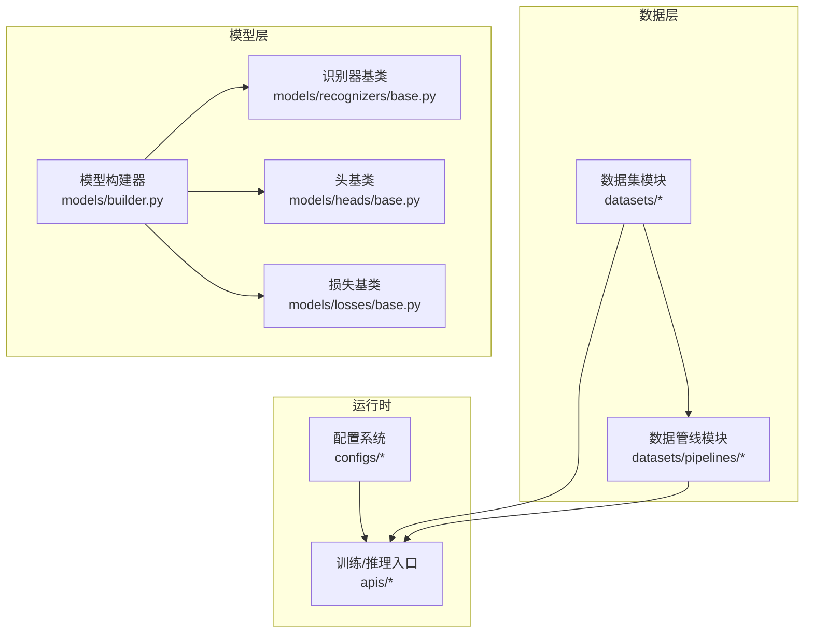
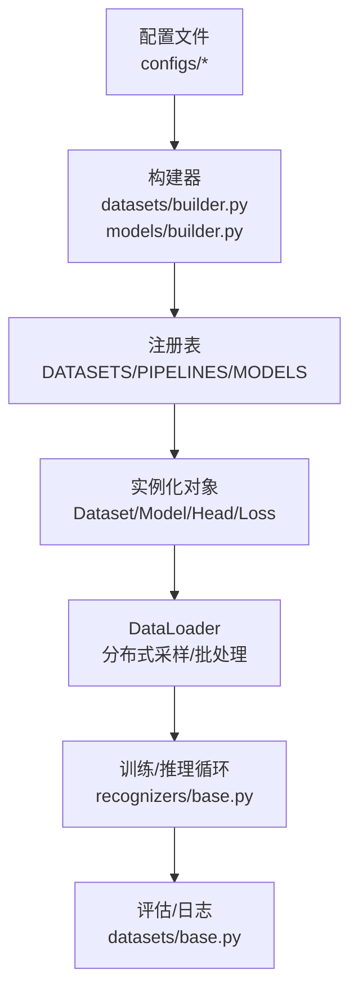
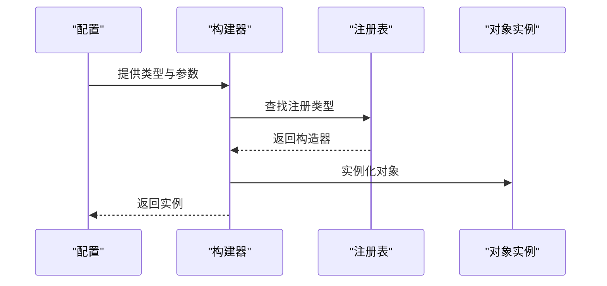
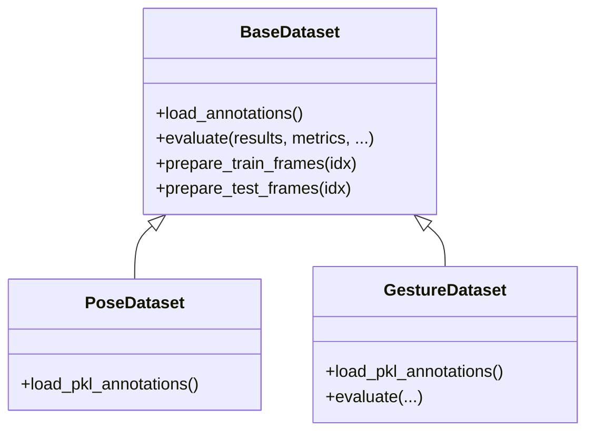
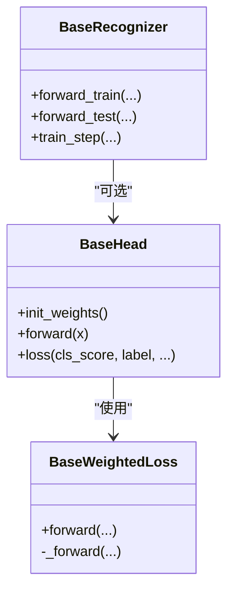
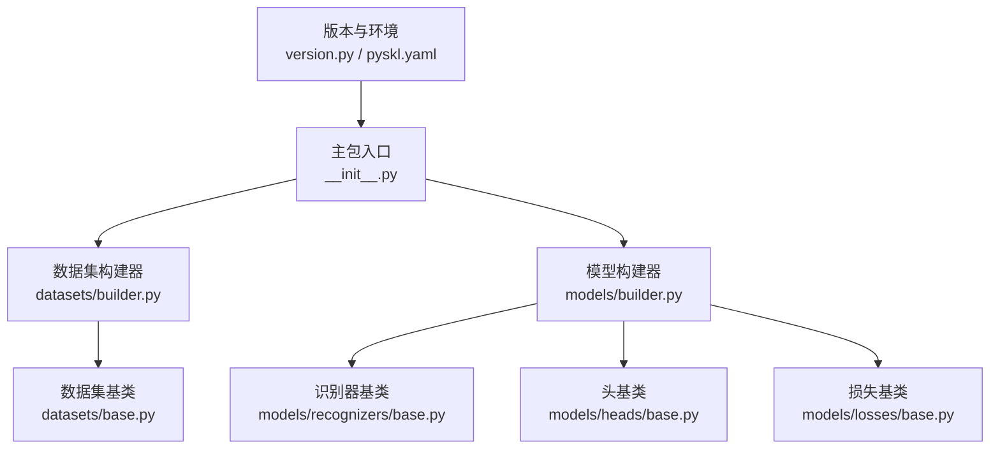

# 扩展机制

<cite>
**本文引用的文件**
- [pyskl/__init__.py](file://pyskl/__init__.py)
- [pyskl/version.py](file://pyskl/version.py)
- [pyskl/datasets/builder.py](file://pyskl/datasets/builder.py)
- [pyskl/datasets/base.py](file://pyskl/datasets/base.py)
- [pyskl/datasets/pose_dataset.py](file://pyskl/datasets/pose_dataset.py)
- [pyskl/datasets/gesture_dataset.py](file://pyskl/datasets/gesture_dataset.py)
- [pyskl/models/builder.py](file://pyskl/models/builder.py)
- [pyskl/models/recognizers/base.py](file://pyskl/models/recognizers/base.py)
- [pyskl/models/heads/base.py](file://pyskl/models/heads/base.py)
- [pyskl/models/losses/base.py](file://pyskl/models/losses/base.py)
- [pyskl/smp.py](file://pyskl/smp.py)
- [pyskl.yaml](file://pyskl.yaml)
- [configs/stgcn/stgcn_pyskl_ntu60_xsub_3dkp/b.py](file://configs/stgcn/stgcn_pyskl_ntu60_xsub_3dkp/b.py)
- [configs/stgcn/stgcn_pyskl_ntu60_xsub_3dkp/j.py](file://configs/stgcn/stgcn_pyskl_ntu60_xsub_3dkp/j.py)
</cite>

## 目录
1. [简介](#简介)
2. [项目结构](#项目结构)
3. [核心组件](#核心组件)
4. [架构总览](#架构总览)
5. [组件详解](#组件详解)
6. [依赖关系分析](#依赖关系分析)
7. [性能考量](#性能考量)
8. [故障排查指南](#故障排查指南)
9. [结论](#结论)
10. [附录：扩展示例与最佳实践](#附录扩展示例与最佳实践)

## 简介
本文件系统性阐述 PySKL 的扩展机制，重点围绕以下主题：
- 注册表机制：如何注册新的模型类型、数据集类型与组件类型
- 自定义组件开发：接口规范、实现要求与注册方法
- 插件系统：基于注册表的“发现—加载—使用”流程
- 配置系统扩展：如何新增配置项与参数
- 扩展示例：自定义模型、数据集、损失函数的实现步骤
- 第三方集成：最佳实践与注意事项
- 调试与测试：常见问题定位与验证方法

## 项目结构
PySKL 采用“模块化 + 注册表”的组织方式，核心目录与职责如下：
- pyskl/datasets：数据集与数据加载管线
- pyskl/models：模型、头、损失与构建器
- pyskl/apis：训练与推理入口
- configs：各算法与数据集的配置样例
- pyskl：工具与版本信息

图表来源
- [pyskl/datasets/builder.py](file://pyskl/datasets/builder.py#L22-L45)
- [pyskl/models/builder.py](file://pyskl/models/builder.py#L5-L39)
- [configs/stgcn/stgcn_pyskl_ntu60_xsub_3dkp/b.py](file://configs/stgcn/stgcn_pyskl_ntu60_xsub_3dkp/b.py#L1-L61)

章节来源
- [pyskl/datasets/builder.py](file://pyskl/datasets/builder.py#L1-L134)
- [pyskl/models/builder.py](file://pyskl/models/builder.py#L1-L39)
- [configs/stgcn/stgcn_pyskl_ntu60_xsub_3dkp/b.py](file://configs/stgcn/stgcn_pyskl_ntu60_xsub_3dkp/b.py#L1-L61)

## 核心组件
- 注册表与构建器
  - 数据集注册表与构建器：通过注册表管理数据集类型，构建器负责实例化与 DataLoader 创建
  - 模型注册表与构建器：统一管理模型、骨干网络、头与损失，支持按类型动态构建
- 抽象基类
  - 数据集基类：定义统一的数据加载、评估与预处理流程
  - 识别器基类：定义训练/测试前向、损失解析与训练步流程
  - 头基类：定义分类头的前向与损失计算
  - 损失基类：定义加权损失的统一接口
- 配置系统
  - 以 Python 文件作为配置，集中定义模型、数据、优化器、学习率策略、日志与运行目录等

章节来源
- [pyskl/datasets/builder.py](file://pyskl/datasets/builder.py#L22-L45)
- [pyskl/models/builder.py](file://pyskl/models/builder.py#L5-L39)
- [pyskl/datasets/base.py](file://pyskl/datasets/base.py#L19-L354)
- [pyskl/models/recognizers/base.py](file://pyskl/models/recognizers/base.py#L20-L196)
- [pyskl/models/heads/base.py](file://pyskl/models/heads/base.py#L10-L88)
- [pyskl/models/losses/base.py](file://pyskl/models/losses/base.py#L6-L45)

## 架构总览
下图展示了“配置驱动 + 注册表 + 抽象基类”的扩展架构：

图表来源
- [pyskl/datasets/builder.py](file://pyskl/datasets/builder.py#L22-L124)
- [pyskl/models/builder.py](file://pyskl/models/builder.py#L5-L39)
- [pyskl/datasets/base.py](file://pyskl/datasets/base.py#L112-L241)
- [pyskl/models/recognizers/base.py](file://pyskl/models/recognizers/base.py#L151-L196)

## 组件详解

### 注册表与构建器
- 数据集注册与构建
  - 注册表：通过注册表管理数据集类型，支持动态注册与查找
  - 构建流程：根据配置中的类型字段，调用构建器创建具体数据集实例
  - DataLoader：封装分布式采样、批处理与工作进程初始化
- 模型注册与构建
  - 注册表：统一注册模型、骨干网络、头与损失
  - 构建流程：按类型分别构建骨干网络、头与损失；识别器按类型选择构建

图表来源
- [pyskl/datasets/builder.py](file://pyskl/datasets/builder.py#L31-L45)
- [pyskl/models/builder.py](file://pyskl/models/builder.py#L12-L39)

章节来源
- [pyskl/datasets/builder.py](file://pyskl/datasets/builder.py#L22-L124)
- [pyskl/models/builder.py](file://pyskl/models/builder.py#L5-L39)

### 数据集扩展（自定义数据集）
- 接口与规范
  - 继承数据集基类，实现加载注释、训练/测试样本准备与可选的评估逻辑
  - 在构造函数中完成注释加载、流水线装配与可选的缓存配置
- 注册与使用
  - 通过装饰器注册到数据集注册表，即可在配置中以类型名引用
- 示例要点
  - 配置中指定数据集类型、注释文件、流水线与分隔集合
  - 训练/验证/测试流水线可独立配置

图表来源
- [pyskl/datasets/base.py](file://pyskl/datasets/base.py#L19-L354)
- [pyskl/datasets/pose_dataset.py](file://pyskl/datasets/pose_dataset.py#L10-L107)
- [pyskl/datasets/gesture_dataset.py](file://pyskl/datasets/gesture_dataset.py#L13-L156)

章节来源
- [pyskl/datasets/base.py](file://pyskl/datasets/base.py#L19-L354)
- [pyskl/datasets/pose_dataset.py](file://pyskl/datasets/pose_dataset.py#L10-L107)
- [pyskl/datasets/gesture_dataset.py](file://pyskl/datasets/gesture_dataset.py#L13-L156)
- [configs/stgcn/stgcn_pyskl_ntu60_xsub_3dkp/b.py](file://configs/stgcn/stgcn_pyskl_ntu60_xsub_3dkp/b.py#L8-L46)

### 模型扩展（自定义模型/头/损失）
- 识别器扩展
  - 继承识别器基类，实现训练/测试前向；可选择性接入头与损失
- 头扩展
  - 继承头基类，实现前向与权重初始化；损失通过构建器注入
- 损失扩展
  - 继承加权损失基类，实现内部前向；支持字典或张量输出
- 注册与使用
  - 将新类型注册到模型注册表，即可在配置中以类型名引用

图表来源
- [pyskl/models/recognizers/base.py](file://pyskl/models/recognizers/base.py#L20-L196)
- [pyskl/models/heads/base.py](file://pyskl/models/heads/base.py#L10-L88)
- [pyskl/models/losses/base.py](file://pyskl/models/losses/base.py#L6-L45)

章节来源
- [pyskl/models/recognizers/base.py](file://pyskl/models/recognizers/base.py#L20-L196)
- [pyskl/models/heads/base.py](file://pyskl/models/heads/base.py#L10-L88)
- [pyskl/models/losses/base.py](file://pyskl/models/losses/base.py#L6-L45)

### 配置系统扩展
- 配置文件即 Python：通过字典定义模型、数据、优化器、学习率策略、日志与工作目录
- 扩展方式
  - 新增配置项：在相应字典中添加键值对
  - 新增参数：在对应模块的配置项中传入新参数（如数据集的 split、valid_frames_thr 等）
- 示例参考
  - 模型、数据、流水线、优化器、学习率策略、评估与日志等

章节来源
- [configs/stgcn/stgcn_pyskl_ntu60_xsub_3dkp/b.py](file://configs/stgcn/stgcn_pyskl_ntu60_xsub_3dkp/b.py#L1-L61)
- [configs/stgcn/stgcn_pyskl_ntu60_xsub_3dkp/j.py](file://configs/stgcn/stgcn_pyskl_ntu60_xsub_3dkp/j.py#L1-L61)

## 依赖关系分析
- 版本与环境
  - 项目对 MMCV 版本范围有限制，确保兼容性
- 外部依赖
  - 通过环境文件声明 PyTorch、MMCV、MMDet、MMPose 等依赖
- 模块耦合
  - 构建器与注册表解耦具体实现，通过类型字符串驱动
  - 抽象基类约束接口，便于替换与扩展

图表来源
- [pyskl/version.py](file://pyskl/version.py#L1-L19)
- [pyskl.yaml](file://pyskl.yaml#L1-L132)
- [pyskl/__init__.py](file://pyskl/__init__.py#L1-L17)
- [pyskl/datasets/builder.py](file://pyskl/datasets/builder.py#L1-L134)
- [pyskl/models/builder.py](file://pyskl/models/builder.py#L1-L39)
- [pyskl/datasets/base.py](file://pyskl/datasets/base.py#L1-L354)
- [pyskl/models/recognizers/base.py](file://pyskl/models/recognizers/base.py#L1-L196)
- [pyskl/models/heads/base.py](file://pyskl/models/heads/base.py#L1-L88)
- [pyskl/models/losses/base.py](file://pyskl/models/losses/base.py#L1-L45)

章节来源
- [pyskl/version.py](file://pyskl/version.py#L1-L19)
- [pyskl.yaml](file://pyskl.yaml#L1-L132)
- [pyskl/__init__.py](file://pyskl/__init__.py#L1-L17)

## 性能考量
- 分布式训练
  - 构建器自动选择分布式采样器，支持类别特定采样与随机种子初始化
- 批处理与内存
  - DataLoader 使用批处理与可选的内存锁页，降低 GPU 数据传输开销
- 评估效率
  - 评估指标支持多种组合，建议按需选择，避免冗余计算

章节来源
- [pyskl/datasets/builder.py](file://pyskl/datasets/builder.py#L88-L124)
- [pyskl/datasets/base.py](file://pyskl/datasets/base.py#L112-L241)

## 故障排查指南
- 类型未注册
  - 现象：构建时报错提示类型未注册
  - 排查：确认已通过装饰器注册到对应注册表，且类型字符串一致
- 参数不匹配
  - 现象：实例化失败或运行时报错
  - 排查：核对配置中的参数名称与默认值，确保与注册实现一致
- 评估指标异常
  - 现象：评估结果为空或维度不匹配
  - 排查：确认结果格式与数据集长度一致，必要时检查多模型/多模态输出的合并逻辑
- 分布式采样问题
  - 现象：训练不同步或显存占用异常
  - 排查：确认分布式环境变量与 DataLoader 初始化参数

章节来源
- [pyskl/datasets/builder.py](file://pyskl/datasets/builder.py#L31-L45)
- [pyskl/datasets/base.py](file://pyskl/datasets/base.py#L136-L241)
- [pyskl/models/builder.py](file://pyskl/models/builder.py#L32-L39)

## 结论
PySKL 的扩展机制以“注册表 + 抽象基类 + 配置驱动”为核心，既保证了灵活性，又维持了强约束的接口一致性。通过统一的构建器与注册表，开发者可以快速扩展数据集、模型、头与损失等组件，并在配置中无缝使用。

## 附录：扩展示例与最佳实践

### 自定义数据集
- 步骤
  - 继承数据集基类，实现注释加载与样本准备
  - 在文件末尾通过装饰器注册到数据集注册表
  - 在配置中以类型名引用，并提供必要的参数（如注释文件、流水线、分隔集合等）
- 参考
  - 数据集基类接口与评估流程
  - 已有数据集的注册与实现

章节来源
- [pyskl/datasets/base.py](file://pyskl/datasets/base.py#L19-L354)
- [pyskl/datasets/pose_dataset.py](file://pyskl/datasets/pose_dataset.py#L10-L107)
- [pyskl/datasets/gesture_dataset.py](file://pyskl/datasets/gesture_dataset.py#L13-L156)
- [configs/stgcn/stgcn_pyskl_ntu60_xsub_3dkp/b.py](file://configs/stgcn/stgcn_pyskl_ntu60_xsub_3dkp/b.py#L8-L46)

### 自定义模型（识别器）
- 步骤
  - 继承识别器基类，实现训练/测试前向
  - 通过构建器注册到模型注册表
  - 在配置中以类型名引用，并提供骨干网络与头的配置
- 参考
  - 识别器基类的训练步与损失解析流程

章节来源
- [pyskl/models/recognizers/base.py](file://pyskl/models/recognizers/base.py#L20-L196)
- [pyskl/models/builder.py](file://pyskl/models/builder.py#L12-L39)
- [configs/stgcn/stgcn_pyskl_ntu60_xsub_3dkp/b.py](file://configs/stgcn/stgcn_pyskl_ntu60_xsub_3dkp/b.py#L1-L6)

### 自定义损失函数
- 步骤
  - 继承加权损失基类，实现内部前向
  - 在头配置中引用该损失类型
- 参考
  - 损失基类的加权与统一接口

章节来源
- [pyskl/models/losses/base.py](file://pyskl/models/losses/base.py#L6-L45)
- [pyskl/models/heads/base.py](file://pyskl/models/heads/base.py#L51-L87)

### 配置系统扩展
- 步骤
  - 在配置文件中新增键值对或参数
  - 确保与注册实现的参数签名一致
- 参考
  - 配置样例中的模型、数据、流水线、优化器与日志等

章节来源
- [configs/stgcn/stgcn_pyskl_ntu60_xsub_3dkp/b.py](file://configs/stgcn/stgcn_pyskl_ntu60_xsub_3dkp/b.py#L1-L61)
- [configs/stgcn/stgcn_pyskl_ntu60_xsub_3dkp/j.py](file://configs/stgcn/stgcn_pyskl_ntu60_xsub_3dkp/j.py#L1-L61)

### 第三方集成最佳实践
- 依赖管理
  - 通过环境文件统一声明依赖，确保版本兼容
- 扩展隔离
  - 将第三方组件封装为独立模块，并通过注册表暴露接口
- 配置解耦
  - 通过配置文件传递第三方参数，避免硬编码

章节来源
- [pyskl.yaml](file://pyskl.yaml#L1-L132)
- [pyskl/__init__.py](file://pyskl/__init__.py#L1-L17)

### 调试与测试方法
- 快速验证
  - 使用最小配置启动单卡训练/推理，逐步增加复杂度
- 日志与指标
  - 利用内置日志钩子与评估指标，定位性能瓶颈
- 并发与缓存
  - 使用工具模块中的缓存与并发能力，加速数据加载与评估

章节来源
- [pyskl/datasets/builder.py](file://pyskl/datasets/builder.py#L48-L124)
- [pyskl/datasets/base.py](file://pyskl/datasets/base.py#L112-L241)
- [pyskl/smp.py](file://pyskl/smp.py#L167-L183)