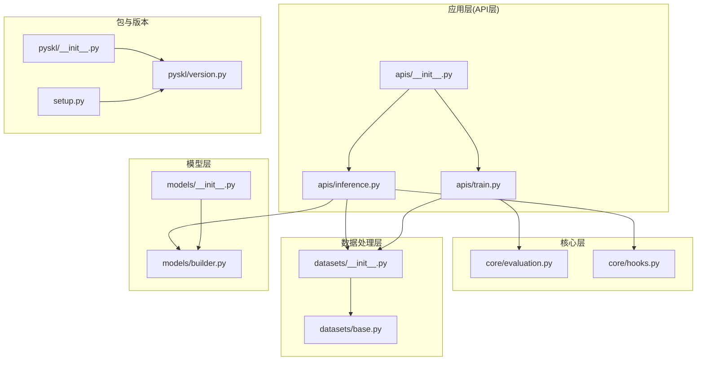
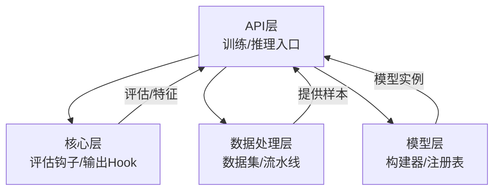
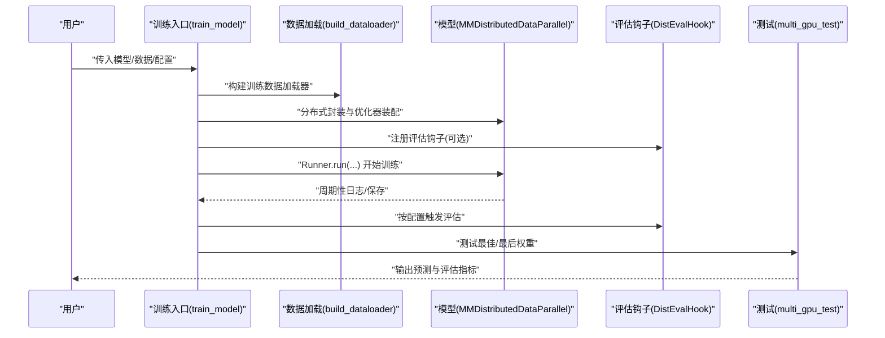
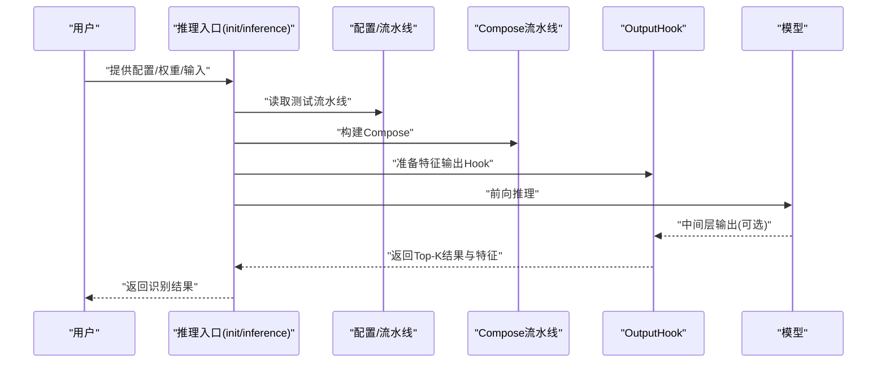
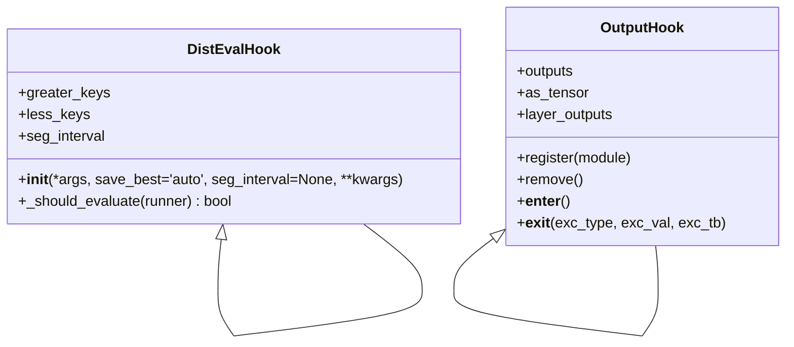
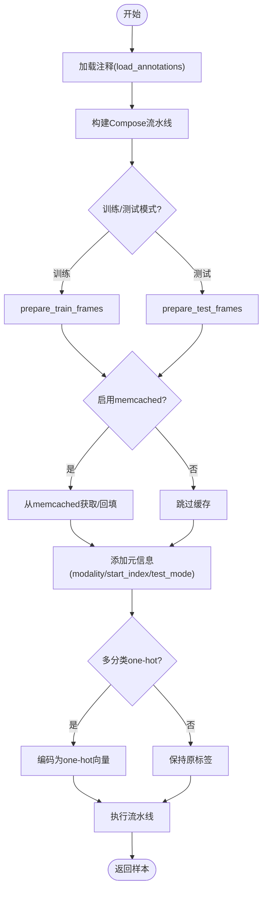
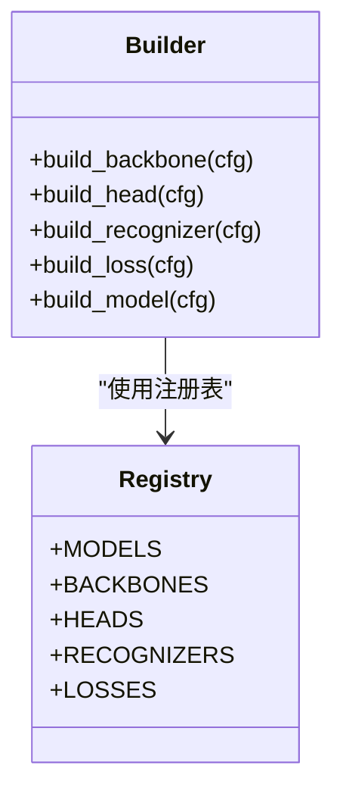
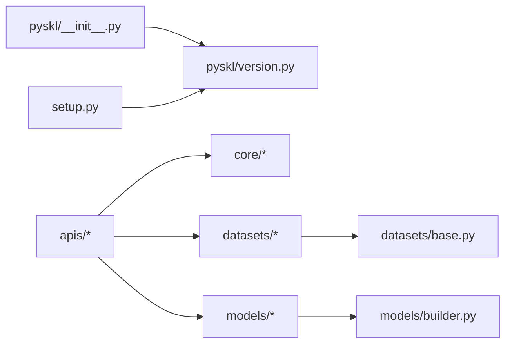

# 架构概览

<cite>
**本文引用的文件**
- [README.md](file://README.md)
- [pyskl/__init__.py](file://pyskl/__init__.py)
- [pyskl/version.py](file://pyskl/version.py)
- [setup.py](file://setup.py)
- [pyskl/smp.py](file://pyskl/smp.py)
- [pyskl/apis/__init__.py](file://pyskl/apis/__init__.py)
- [pyskl/apis/inference.py](file://pyskl/apis/inference.py)
- [pyskl/apis/train.py](file://pyskl/apis/train.py)
- [pyskl/core/__init__.py](file://pyskl/core/__init__.py)
- [pyskl/core/evaluation.py](file://pyskl/core/evaluation.py)
- [pyskl/core/hooks.py](file://pyskl/core/hooks.py)
- [pyskl/datasets/__init__.py](file://pyskl/datasets/__init__.py)
- [pyskl/datasets/base.py](file://pyskl/datasets/base.py)
- [pyskl/models/__init__.py](file://pyskl/models/__init__.py)
- [pyskl/models/builder.py](file://pyskl/models/builder.py)
</cite>

## 目录
1. [简介](#简介)
2. [项目结构](#项目结构)
3. [核心组件](#核心组件)
4. [架构总览](#架构总览)
5. [详细组件分析](#详细组件分析)
6. [依赖分析](#依赖分析)
7. [性能考虑](#性能考虑)
8. [故障排查指南](#故障排查指南)
9. [结论](#结论)
10. [附录](#附录)

## 简介
本文件面向PySKL项目的架构概览与设计说明，目标是帮助开发者快速理解系统的分层结构、组件职责、数据与控制流、层间交互方式，以及设计原则与演进方向。PySKL是一个基于PyTorch的人体骨架动作识别工具箱，构建于开源项目MMAction2之上，支持多种骨架动作识别算法与数据集，并提供训练、推理、评估与可视化能力。

## 项目结构
仓库采用“功能域+层次化”的组织方式：
- 核心层：apis、core、models、datasets
- 配置与示例：configs 下按算法与数据集划分
- 工具与脚本：tools、demo、examples
- 包装与入口：setup.py、pyskl/__init__.py、pyskl/version.py

图表来源
- [pyskl/apis/__init__.py](file://pyskl/apis/__init__.py#L1-L11)
- [pyskl/apis/inference.py](file://pyskl/apis/inference.py#L1-L184)
- [pyskl/apis/train.py](file://pyskl/apis/train.py#L1-L213)
- [pyskl/core/evaluation.py](file://pyskl/core/evaluation.py#L1-L215)
- [pyskl/core/hooks.py](file://pyskl/core/hooks.py#L1-L68)
- [pyskl/datasets/__init__.py](file://pyskl/datasets/__init__.py#L1-L13)
- [pyskl/datasets/base.py](file://pyskl/datasets/base.py#L1-L354)
- [pyskl/models/__init__.py](file://pyskl/models/__init__.py#L1-L8)
- [pyskl/models/builder.py](file://pyskl/models/builder.py#L1-L39)
- [pyskl/__init__.py](file://pyskl/__init__.py#L1-L17)
- [pyskl/version.py](file://pyskl/version.py#L1-L19)
- [setup.py](file://setup.py#L1-L129)

章节来源
- [README.md](file://README.md#L1-L116)
- [pyskl/apis/__init__.py](file://pyskl/apis/__init__.py#L1-L11)
- [pyskl/datasets/__init__.py](file://pyskl/datasets/__init__.py#L1-L13)
- [pyskl/models/__init__.py](file://pyskl/models/__init__.py#L1-L8)

## 核心组件
- API层
  - 训练入口：apis/train.py 提供分布式训练、优化器与Runner装配、评估钩子注册、断点续训与测试输出。
  - 推理入口：apis/inference.py 提供模型初始化、输入适配（视频/帧/数组）、数据流水线Compose、特征输出Hook与Top-K结果解析。
- 核心层
  - 评估钩子：core/evaluation.py 扩展分布式评估，支持按区间调整评估频率、多指标计算。
  - 输出Hook：core/hooks.py 提供可选层特征抽取，支持Tensor/Numpy两种输出形式。
- 数据处理层
  - 抽象数据集：datasets/base.py 定义BaseDataset，统一加载注释、按类别分组、评估与数据增强流水线；支持memcached缓存与多模态输出评估。
  - 数据集注册：datasets/__init__.py 暴露构建器与具体数据集类型。
- 模型层
  - 模型注册与构建：models/builder.py 基于Registry注册Backbone/Head/Recognizer/Loss，统一build接口。
  - 模型导出：models/__init__.py 导出各类模块，便于上层按需导入。

章节来源
- [pyskl/apis/inference.py](file://pyskl/apis/inference.py#L1-L184)
- [pyskl/apis/train.py](file://pyskl/apis/train.py#L1-L213)
- [pyskl/core/evaluation.py](file://pyskl/core/evaluation.py#L1-L215)
- [pyskl/core/hooks.py](file://pyskl/core/hooks.py#L1-L68)
- [pyskl/datasets/base.py](file://pyskl/datasets/base.py#L1-L354)
- [pyskl/datasets/__init__.py](file://pyskl/datasets/__init__.py#L1-L13)
- [pyskl/models/builder.py](file://pyskl/models/builder.py#L1-L39)
- [pyskl/models/__init__.py](file://pyskl/models/__init__.py#L1-L8)

## 架构总览
PySKL采用清晰的分层架构：
- API层：对外提供训练与推理的高层接口，负责控制流编排与资源管理。
- 核心层：封装评估策略与中间特征提取能力，作为横切关注点服务于API层。
- 数据处理层：抽象数据集与流水线，屏蔽不同数据源与模态差异，统一训练/测试数据供给。
- 模型层：通过注册表解耦模型组件，支持灵活组合与扩展。

图表来源
- [pyskl/apis/inference.py](file://pyskl/apis/inference.py#L1-L184)
- [pyskl/apis/train.py](file://pyskl/apis/train.py#L1-L213)
- [pyskl/core/evaluation.py](file://pyskl/core/evaluation.py#L1-L215)
- [pyskl/core/hooks.py](file://pyskl/core/hooks.py#L1-L68)
- [pyskl/datasets/base.py](file://pyskl/datasets/base.py#L1-L354)
- [pyskl/models/builder.py](file://pyskl/models/builder.py#L1-L39)

## 详细组件分析

### API层：训练与推理
- 训练流程要点
  - 随机种子广播、分布式封装、Runner与Hook注册、验证钩子、断点/权重加载、运行周期与最终测试。
  - 支持对最佳/最后权重进行测试并输出结果与评估指标。
- 推理流程要点
  - 输入适配：支持视频路径、原始帧目录、数组等多种输入；自动替换流水线中的Decode节点。
  - 数据流水线：Compose后按batch整理与设备散播。
  - 特征输出：通过OutputHook按名称抽取中间层特征，支持Tensor或Numpy。
  - 结果解析：Top-5类别与分数排序。

图表来源
- [pyskl/apis/train.py](file://pyskl/apis/train.py#L50-L213)
- [pyskl/core/evaluation.py](file://pyskl/core/evaluation.py#L6-L37)

图表来源
- [pyskl/apis/inference.py](file://pyskl/apis/inference.py#L19-L184)
- [pyskl/core/hooks.py](file://pyskl/core/hooks.py#L7-L68)

章节来源
- [pyskl/apis/train.py](file://pyskl/apis/train.py#L1-L213)
- [pyskl/apis/inference.py](file://pyskl/apis/inference.py#L1-L184)
- [pyskl/core/hooks.py](file://pyskl/core/hooks.py#L1-L68)

### 核心层：评估与特征输出
- 评估钩子
  - 继承自分布式评估基类，支持按区间动态调整评估频率，自动判定更优指标（如准确率更高更好）。
- 输出Hook
  - 通过名称链式查找层，注册forward hook收集中间特征；支持Tensor直出或转Numpy；退出上下文自动清理。

图表来源
- [pyskl/core/evaluation.py](file://pyskl/core/evaluation.py#L6-L37)
- [pyskl/core/hooks.py](file://pyskl/core/hooks.py#L7-L68)

章节来源
- [pyskl/core/evaluation.py](file://pyskl/core/evaluation.py#L1-L215)
- [pyskl/core/hooks.py](file://pyskl/core/hooks.py#L1-L68)

### 数据处理层：数据集与流水线
- BaseDataset
  - 统一注释加载、按类别分组、评估指标计算、memcached缓存、数据增强流水线Compose。
  - 支持多模型/多模态结果评估与自动融合（如RGBPoseConv3D）。
- 数据集注册与构建
  - 通过注册表与构建器暴露统一接口，便于在配置中声明式装配。

图表来源
- [pyskl/datasets/base.py](file://pyskl/datasets/base.py#L75-L354)

章节来源
- [pyskl/datasets/base.py](file://pyskl/datasets/base.py#L1-L354)
- [pyskl/datasets/__init__.py](file://pyskl/datasets/__init__.py#L1-L13)

### 模型层：构建与注册
- 注册表与构建器
  - 通过Registry集中管理Backbone/Head/Recognizer/Loss，统一build接口，降低耦合度。
- 上层使用
  - 在配置中声明模型结构，由构建器按类型创建实例，便于快速切换与组合。

图表来源
- [pyskl/models/builder.py](file://pyskl/models/builder.py#L1-L39)
- [pyskl/models/__init__.py](file://pyskl/models/__init__.py#L1-L8)

章节来源
- [pyskl/models/builder.py](file://pyskl/models/builder.py#L1-L39)
- [pyskl/models/__init__.py](file://pyskl/models/__init__.py#L1-L8)

## 依赖分析
- 外部依赖
  - 项目基于MMCV与MMAction2生态，版本范围在pyskl/__init__.py中受控。
  - setup.py声明安装依赖与打包信息。
- 内部依赖
  - API层依赖核心层（评估/Hook）、数据处理层（数据集/流水线）、模型层（构建器）。
  - 数据处理层与模型层相互独立，通过配置与构建器耦合。

图表来源
- [pyskl/__init__.py](file://pyskl/__init__.py#L1-L17)
- [pyskl/version.py](file://pyskl/version.py#L1-L19)
- [setup.py](file://setup.py#L1-L129)
- [pyskl/apis/__init__.py](file://pyskl/apis/__init__.py#L1-L11)
- [pyskl/datasets/base.py](file://pyskl/datasets/base.py#L1-L354)
- [pyskl/models/builder.py](file://pyskl/models/builder.py#L1-L39)

章节来源
- [pyskl/__init__.py](file://pyskl/__init__.py#L1-L17)
- [setup.py](file://setup.py#L1-L129)

## 性能考虑
- 分布式训练与评估
  - 训练侧使用分布式封装与评估钩子，支持按区间评估与多指标记录，有助于平衡性能与稳定性。
- 缓存与I/O
  - 数据集层支持memcached缓存，减少重复读取开销；建议在大规模数据集上启用以提升吞吐。
- 推理特征输出
  - OutputHook按需抽取中间层特征，注意仅在调试/可视化阶段开启，避免影响实时性能。
- 版本与兼容
  - 明确限制MMCV版本范围，确保训练/推理行为一致，避免因版本漂移导致的性能波动。

## 故障排查指南
- 版本不兼容
  - 若出现MMCV版本不满足要求，将触发断言错误。请根据提示安装指定范围内的MMCV版本。
- 推理输入类型
  - 不支持的输入类型会抛出异常。请确认输入为视频路径、帧目录或数组，并符合预期维度。
- 评估指标与配置
  - 评估指标不在允许列表内会报错。请检查配置中的metrics字段与metric_options。
- 分布式训练问题
  - 若评估或测试阶段找不到最佳权重，日志会给出警告并跳过对应测试。请检查工作目录与保存策略。

章节来源
- [pyskl/__init__.py](file://pyskl/__init__.py#L11-L14)
- [pyskl/apis/inference.py](file://pyskl/apis/inference.py#L96-L98)
- [pyskl/core/evaluation.py](file://pyskl/core/evaluation.py#L191-L193)
- [pyskl/apis/train.py](file://pyskl/apis/train.py#L156-L160)

## 结论
PySKL通过清晰的分层架构实现了模块化、可扩展与可维护的设计目标：API层聚焦控制流与资源管理，核心层提供评估与特征抽取能力，数据处理层屏蔽数据差异，模型层通过注册表实现灵活组合。该架构既满足了多样算法与数据集的支持需求，也为后续演进提供了稳定基础。

## 附录
- 设计原则
  - 模块化：各层职责明确，接口稳定。
  - 可扩展：注册表与配置驱动，易于新增算法与数据集。
  - 可维护：统一评估与Hook机制，便于调试与监控。
- 层间边界与通信
  - API层通过配置与构建器与模型层通信；通过数据集构建器与数据处理层通信；通过评估钩子与核心层通信。
- 架构演进与未来方向
  - 当前版本强调算法复现与工程化落地；未来可在以下方向演进：
    - 更细粒度的插件化流水线与数据增强；
    - 多模态融合的统一评估框架；
    - 推理加速与量化部署支持；
    - 自动超参搜索与训练调度。