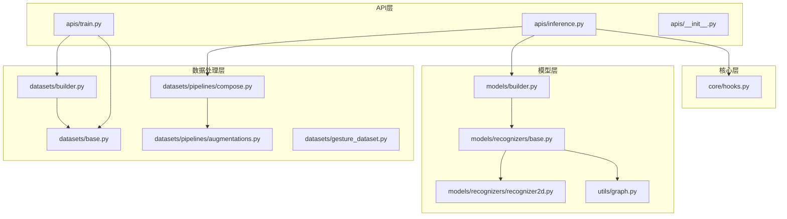
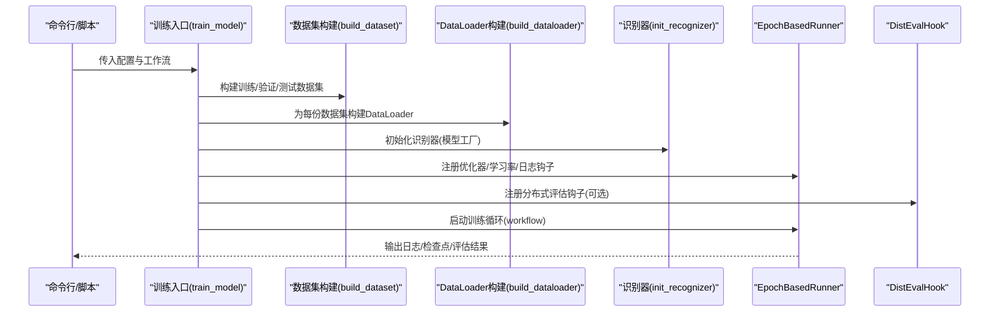
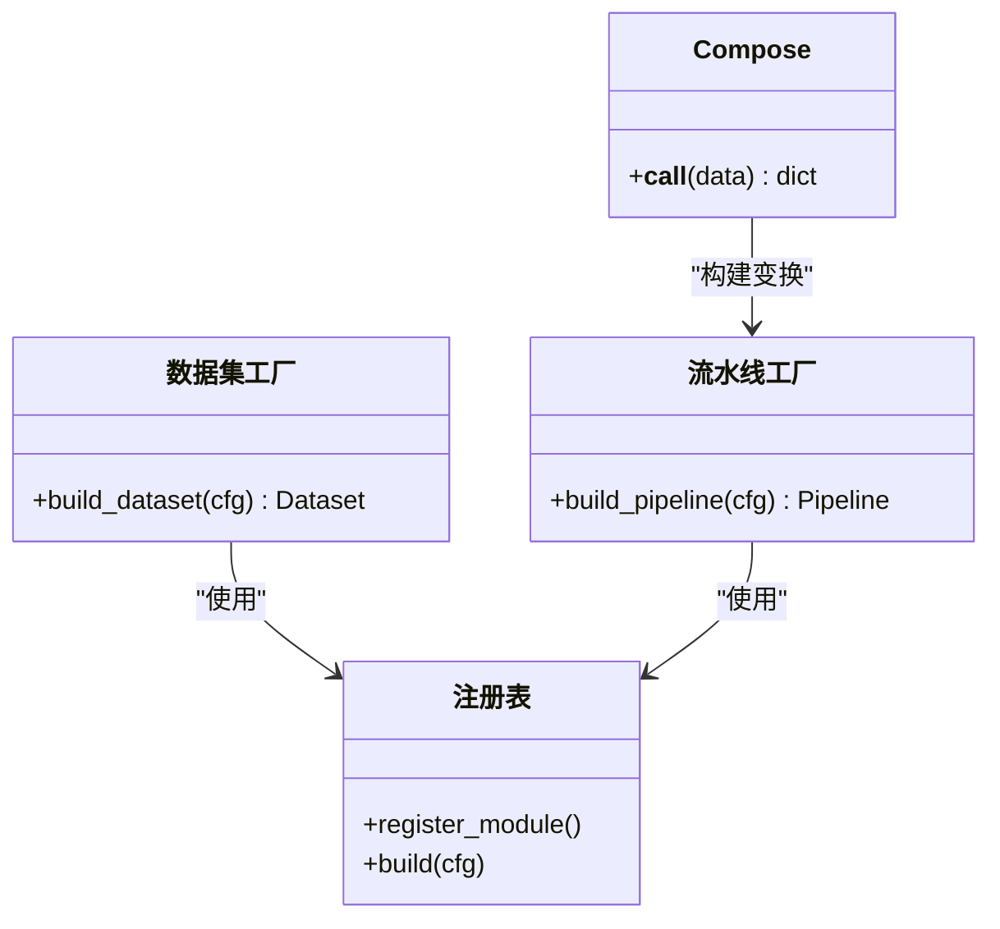
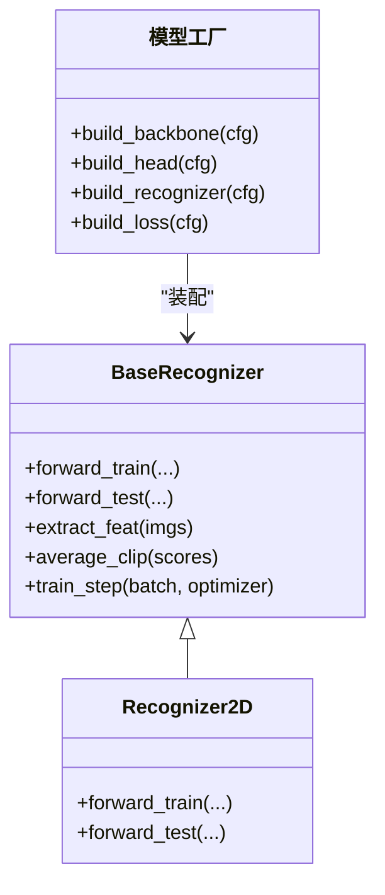
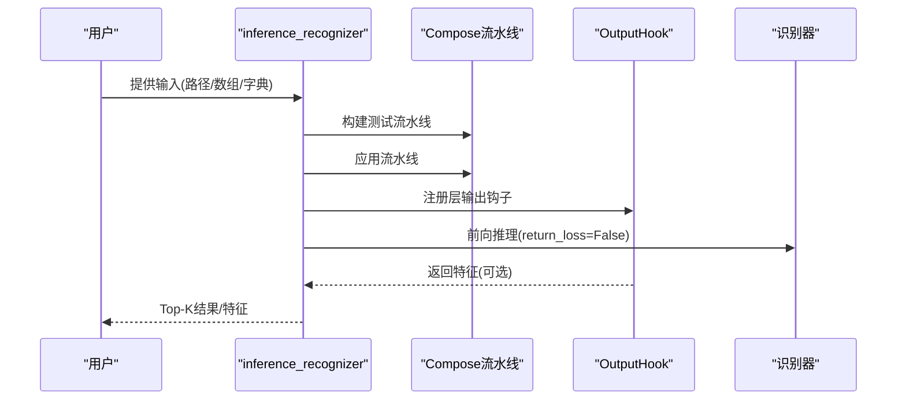
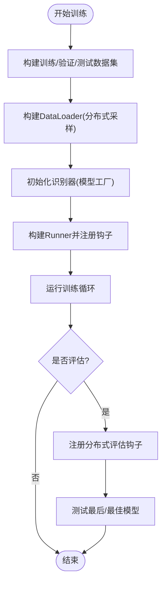
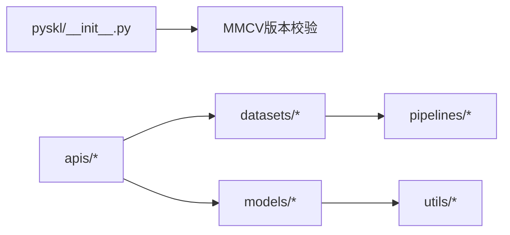

# 核心架构

<cite>
**本文引用的文件**
- [pyskl/__init__.py](file://pyskl/__init__.py)
- [pyskl/apis/__init__.py](file://pyskl/apis/__init__.py)
- [pyskl/apis/train.py](file://pyskl/apis/train.py)
- [pyskl/apis/inference.py](file://pyskl/apis/inference.py)
- [pyskl/datasets/builder.py](file://pyskl/datasets/builder.py)
- [pyskl/datasets/base.py](file://pyskl/datasets/base.py)
- [pyskl/datasets/gesture_dataset.py](file://pyskl/datasets/gesture_dataset.py)
- [pyskl/datasets/pipelines/compose.py](file://pyskl/datasets/pipelines/compose.py)
- [pyskl/datasets/pipelines/augmentations.py](file://pyskl/datasets/pipelines/augmentations.py)
- [pyskl/models/builder.py](file://pyskl/models/builder.py)
- [pyskl/models/recognizers/base.py](file://pyskl/models/recognizers/base.py)
- [pyskl/models/recognizers/recognizer2d.py](file://pyskl/models/recognizers/recognizer2d.py)
- [pyskl/core/hooks.py](file://pyskl/core/hooks.py)
- [pyskl/utils/graph.py](file://pyskl/utils/graph.py)
- [README.md](file://README.md)
</cite>

## 目录
1. [简介](#简介)
2. [项目结构](#项目结构)
3. [核心组件](#核心组件)
4. [架构总览](#架构总览)
5. [详细组件分析](#详细组件分析)
6. [依赖分析](#依赖分析)
7. [性能考量](#性能考量)
8. [故障排查指南](#故障排查指南)
9. [结论](#结论)
10. [附录](#附录)

## 简介
本文件面向PySKL核心架构，系统化阐述其分层架构设计（API层、核心层、数据处理层、模型层）、工厂模式与注册表机制、模块间依赖与交互（数据流、控制流、错误处理）、设计模式应用（策略模式、观察者模式等），并给出架构图与组件关系图，帮助读者快速理解与扩展系统。

## 项目结构
PySKL采用典型的分层架构：
- API层：对外提供训练与推理入口，封装配置解析、分布式训练、评估钩子与日志。
- 核心层：包含训练/推理钩子、输出特征捕获等通用能力。
- 数据处理层：数据集抽象、流水线编排、数据增强、采样器与DataLoader构建。
- 模型层：识别器框架、骨干网络、头、损失与模型工厂。

**图示来源**
- [pyskl/apis/train.py](file://pyskl/apis/train.py#L50-L213)
- [pyskl/apis/inference.py](file://pyskl/apis/inference.py#L19-L184)
- [pyskl/datasets/builder.py](file://pyskl/datasets/builder.py#L31-L134)
- [pyskl/datasets/base.py](file://pyskl/datasets/base.py#L19-L354)
- [pyskl/datasets/pipelines/compose.py](file://pyskl/datasets/pipelines/compose.py#L8-L53)
- [pyskl/datasets/pipelines/augmentations.py](file://pyskl/datasets/pipelines/augmentations.py#L16-L902)
- [pyskl/models/builder.py](file://pyskl/models/builder.py#L12-L39)
- [pyskl/models/recognizers/base.py](file://pyskl/models/recognizers/base.py#L20-L196)
- [pyskl/models/recognizers/recognizer2d.py](file://pyskl/models/recognizers/recognizer2d.py#L8-L59)
- [pyskl/utils/graph.py](file://pyskl/utils/graph.py#L58-L175)

**章节来源**
- [README.md](file://README.md#L1-L116)
- [pyskl/apis/__init__.py](file://pyskl/apis/__init__.py#L1-L11)

## 核心组件
- API层入口
  - 训练入口：负责分布式训练、优化器、Runner、评估钩子、断点恢复与最终测试。
  - 推理入口：根据配置初始化识别器，构建测试流水线，执行前向与特征输出。
- 数据处理层
  - 数据集抽象：统一加载注释、按类别分组、评估指标、缓存与流水线调用。
  - 构建器：注册表驱动的数据集与流水线工厂；DataLoader构建与分布式采样器选择。
  - 流水线编排：Compose顺序执行变换；内置多种数据增强。
- 模型层
  - 识别器基类：统一前向、损失解析、权重初始化、多裁剪平均等。
  - 模型工厂：基于注册表的识别器/骨干/头/损失构建。
- 核心层
  - 输出钩子：在指定层注册forward_hook，捕获中间特征或张量。

**章节来源**
- [pyskl/apis/train.py](file://pyskl/apis/train.py#L50-L213)
- [pyskl/apis/inference.py](file://pyskl/apis/inference.py#L19-L184)
- [pyskl/datasets/base.py](file://pyskl/datasets/base.py#L19-L354)
- [pyskl/datasets/builder.py](file://pyskl/datasets/builder.py#L31-L134)
- [pyskl/datasets/pipelines/compose.py](file://pyskl/datasets/pipelines/compose.py#L8-L53)
- [pyskl/models/recognizers/base.py](file://pyskl/models/recognizers/base.py#L20-L196)
- [pyskl/models/builder.py](file://pyskl/models/builder.py#L12-L39)
- [pyskl/core/hooks.py](file://pyskl/core/hooks.py#L7-L68)

## 架构总览
PySKL通过“配置即代码”的方式，将训练/推理流程、数据加载与模型构建解耦。API层负责控制流与资源管理，数据处理层负责数据流与预处理策略，模型层负责计算流与损失聚合，核心层提供观测与调试能力。

**图示来源**
- [pyskl/apis/train.py](file://pyskl/apis/train.py#L50-L144)
- [pyskl/datasets/builder.py](file://pyskl/datasets/builder.py#L31-L124)
- [pyskl/models/builder.py](file://pyskl/models/builder.py#L32-L39)

## 详细组件分析

### 数据集与流水线：工厂模式与注册表
- 注册表机制
  - 数据集注册表与流水线注册表由外部框架提供，PySKL在此基础上进行工厂方法封装。
  - 数据集工厂：依据配置字典中的类型字段，动态构建具体数据集实例。
  - 流水线工厂：Compose将配置序列转换为可执行的变换链，并逐个构建具体变换。
- 工厂模式体现
  - 构建器作为“工厂”，屏蔽具体类名差异，统一接口。
  - 配置驱动的组件装配，便于扩展新数据集与新变换。
- 分布式与采样
  - 根据数据集属性选择类别特定采样器或标准分布式采样器。
  - DataLoader参数支持持久化工作进程、内存锁页、随机种子等。

**图示来源**
- [pyskl/datasets/builder.py](file://pyskl/datasets/builder.py#L23-L45)
- [pyskl/datasets/pipelines/compose.py](file://pyskl/datasets/pipelines/compose.py#L8-L44)
- [pyskl/datasets/builder.py](file://pyskl/datasets/builder.py#L24-L25)

**章节来源**
- [pyskl/datasets/builder.py](file://pyskl/datasets/builder.py#L31-L134)
- [pyskl/datasets/pipelines/compose.py](file://pyskl/datasets/pipelines/compose.py#L8-L53)
- [pyskl/datasets/pipelines/augmentations.py](file://pyskl/datasets/pipelines/augmentations.py#L16-L902)

### 识别器框架：策略与模板
- 识别器基类
  - 统一前向、损失解析、权重初始化、多裁剪平均策略。
  - 通过配置驱动的骨干与头装配，支持不同算法组合。
- 2D识别器示例
  - 将批次重排为帧级输入，经骨干提取特征后送入分类头，训练与测试分支清晰分离。
- 模型工厂
  - 基于注册表的识别器/骨干/头/损失构建，支持扩展自定义模型组件。

**图示来源**
- [pyskl/models/recognizers/base.py](file://pyskl/models/recognizers/base.py#L20-L196)
- [pyskl/models/recognizers/recognizer2d.py](file://pyskl/models/recognizers/recognizer2d.py#L8-L59)
- [pyskl/models/builder.py](file://pyskl/models/builder.py#L12-L39)

**章节来源**
- [pyskl/models/recognizers/base.py](file://pyskl/models/recognizers/base.py#L20-L196)
- [pyskl/models/recognizers/recognizer2d.py](file://pyskl/models/recognizers/recognizer2d.py#L8-L59)
- [pyskl/models/builder.py](file://pyskl/models/builder.py#L12-L39)

### 推理流程：数据准备与特征捕获
- 输入适配
  - 支持视频文件、原始帧目录、数组等多种输入，自动推断模态与流水线。
- 前向与特征
  - 通过输出钩子在指定层捕获中间特征，支持张量或NumPy数组。
- 结果组织
  - 生成Top-K结果与可选特征字典，便于可视化与二次分析。

**图示来源**
- [pyskl/apis/inference.py](file://pyskl/apis/inference.py#L57-L184)
- [pyskl/datasets/pipelines/compose.py](file://pyskl/datasets/pipelines/compose.py#L8-L44)
- [pyskl/core/hooks.py](file://pyskl/core/hooks.py#L7-L68)

**章节来源**
- [pyskl/apis/inference.py](file://pyskl/apis/inference.py#L19-L184)
- [pyskl/core/hooks.py](file://pyskl/core/hooks.py#L7-L68)

### 训练流程：分布式、钩子与评估
- 分布式训练
  - 自动广播随机种子、设置分布式DataParallel、注册DistSamplerSeedHook。
- 钩子体系
  - 训练钩子：优化器、学习率调度、日志与检查点。
  - 评估钩子：分布式评估、最佳模型选择与测试。
- 断点与最终测试
  - 支持从断点或指定检查点恢复，训练结束后可自动测试最后与最佳模型。

**图示来源**
- [pyskl/apis/train.py](file://pyskl/apis/train.py#L50-L144)

**章节来源**
- [pyskl/apis/train.py](file://pyskl/apis/train.py#L50-L213)

### 设计模式应用
- 工厂模式
  - 数据集与模型组件通过注册表与工厂方法动态创建，降低耦合，提升可扩展性。
- 策略模式
  - 数据预处理以流水线形式组织，不同策略（如Resize、Flip、Normalize）可按需组合。
- 观察者模式
  - OutputHook在指定层注册forward_hook，观察模型内部特征输出，不侵入主干逻辑。
- 模板方法
  - BaseRecognizer定义训练/测试模板方法，子类仅实现必要步骤。

**章节来源**
- [pyskl/datasets/builder.py](file://pyskl/datasets/builder.py#L31-L45)
- [pyskl/models/builder.py](file://pyskl/models/builder.py#L12-L39)
- [pyskl/datasets/pipelines/compose.py](file://pyskl/datasets/pipelines/compose.py#L8-L44)
- [pyskl/core/hooks.py](file://pyskl/core/hooks.py#L7-L68)
- [pyskl/models/recognizers/base.py](file://pyskl/models/recognizers/base.py#L20-L196)

## 依赖分析
- 外部依赖
  - 严格约束MMCV版本范围，确保兼容性与功能可用性。
- 内部依赖
  - API层依赖数据处理层与模型层；数据处理层依赖注册表与流水线；模型层依赖工厂与工具模块。
- 循环依赖
  - 未见直接循环导入；各层通过工厂与配置解耦。

**图示来源**
- [pyskl/__init__.py](file://pyskl/__init__.py#L1-L17)
- [pyskl/apis/train.py](file://pyskl/apis/train.py#L10-L14)
- [pyskl/datasets/builder.py](file://pyskl/datasets/builder.py#L9-L12)
- [pyskl/models/builder.py](file://pyskl/models/builder.py#L2-L3)

**章节来源**
- [pyskl/__init__.py](file://pyskl/__init__.py#L1-L17)
- [pyskl/apis/train.py](file://pyskl/apis/train.py#L10-L14)
- [pyskl/datasets/builder.py](file://pyskl/datasets/builder.py#L9-L12)
- [pyskl/models/builder.py](file://pyskl/models/builder.py#L2-L3)

## 性能考量
- DataLoader优化
  - 内存锁页、可选持久化工作进程、分布式采样器与类别特定采样器减少不平衡。
- 训练钩子
  - 优化器钩子、学习率调度、日志与检查点钩子减少冗余开销。
- 推理与特征捕获
  - OutputHook按需注册，避免无谓的中间变量；支持张量直出减少CPU拷贝。
- 图结构工具
  - GCN相关邻接矩阵与归一化工具在空间图构建上提供高效实现。

**章节来源**
- [pyskl/datasets/builder.py](file://pyskl/datasets/builder.py#L48-L124)
- [pyskl/apis/train.py](file://pyskl/apis/train.py#L100-L121)
- [pyskl/core/hooks.py](file://pyskl/core/hooks.py#L7-L68)
- [pyskl/utils/graph.py](file://pyskl/utils/graph.py#L5-L175)

## 故障排查指南
- 版本不兼容
  - 若MMCV版本不在允许范围内，初始化阶段会抛出断言错误，需调整环境版本。
- 数据集/流水线配置错误
  - 构建失败通常源于配置缺少type字段或类型未注册；检查注册表与配置字典。
- 分布式训练异常
  - 检查分布式初始化、采样器与DataLoader参数一致性；确认随机种子广播。
- 评估指标异常
  - 确认结果列表长度与数据集长度一致；指标名称必须在允许集合内。
- 推理输入类型不支持
  - 输入类型需为路径、URL或数组；数组需满足形状约定；否则抛出运行时错误。

**章节来源**
- [pyskl/__init__.py](file://pyskl/__init__.py#L11-L14)
- [pyskl/datasets/builder.py](file://pyskl/datasets/builder.py#L31-L45)
- [pyskl/apis/train.py](file://pyskl/apis/train.py#L123-L144)
- [pyskl/datasets/base.py](file://pyskl/datasets/base.py#L112-L241)
- [pyskl/apis/inference.py](file://pyskl/apis/inference.py#L83-L98)

## 结论
PySKL通过分层架构与注册表工厂模式，实现了数据、模型与训练/推理流程的高内聚低耦合。流水线策略与输出钩子增强了可扩展性与可观测性；分布式训练与评估钩子保障了大规模实验的稳定性与效率。建议在新增算法或数据集时，遵循现有注册与配置规范，确保平滑集成。

## 附录
- 可扩展性设计要点
  - 新增数据集：在数据集注册表注册类，实现抽象方法，复用BaseDataset与Compose流水线。
  - 新增模型组件：在模型注册表注册类，通过模型工厂装配到识别器。
  - 第三方集成：通过配置字典与注册表机制，无需修改核心代码即可接入新组件。
- 架构权衡
  - 配置驱动带来灵活性，但需保证配置一致性与文档化。
  - 分布式训练提升吞吐，但对资源与网络拓扑有要求。
  - 插件化与钩子体系提升可观测性，但需注意性能开销。