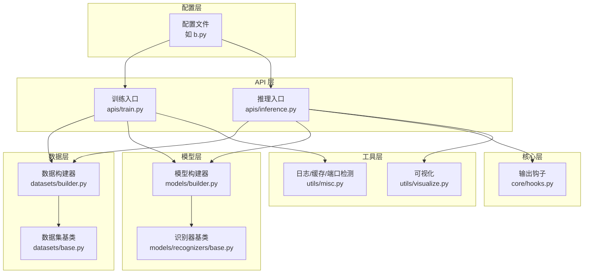
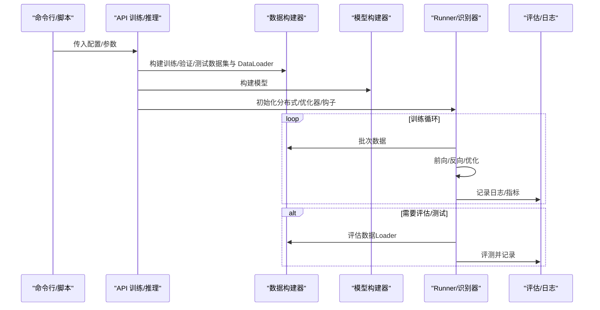
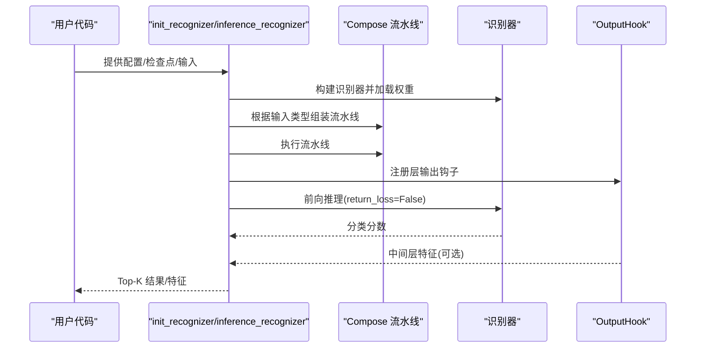
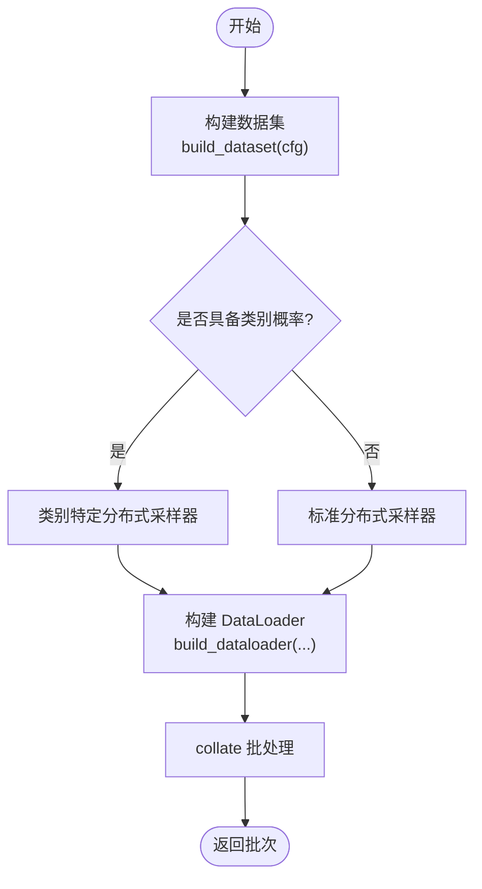
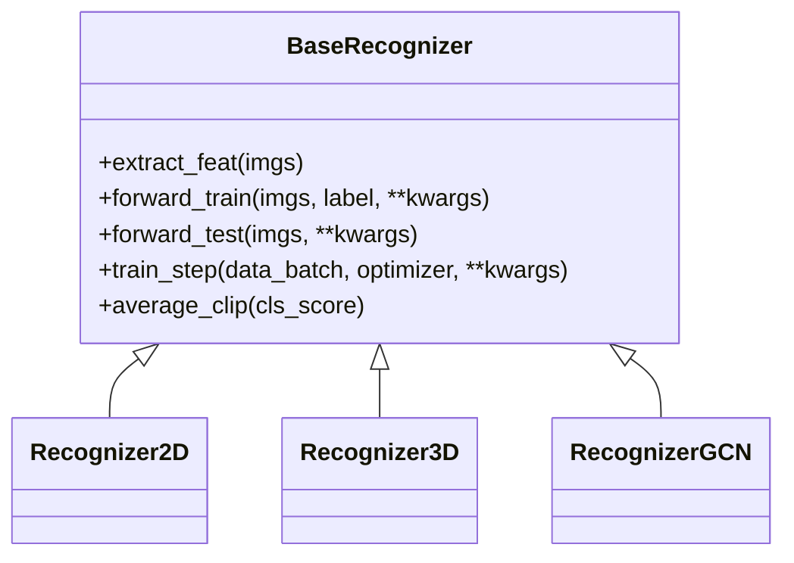
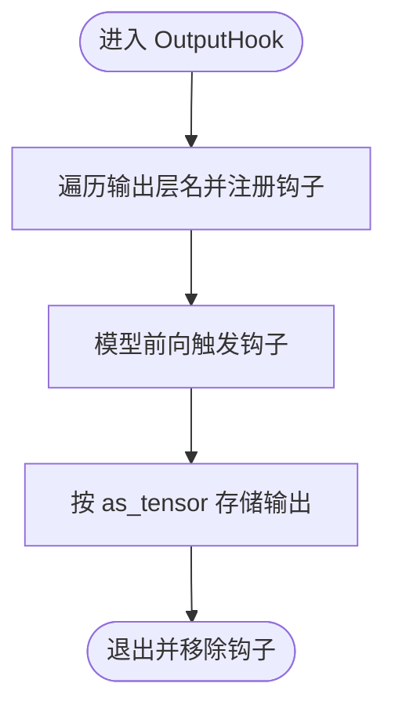
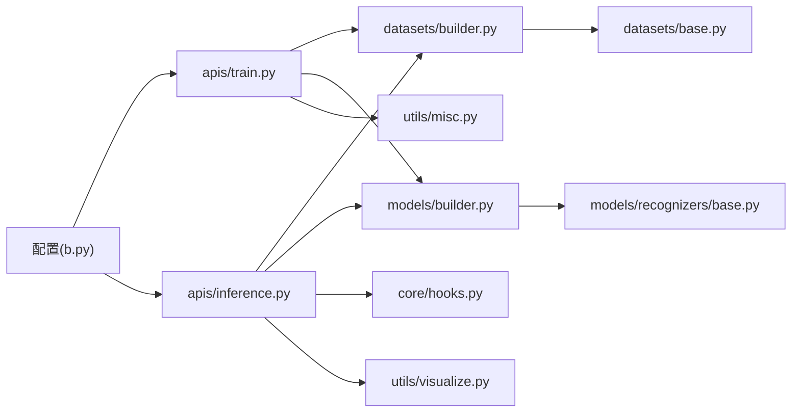

# 组件交互

<cite>
**本文引用的文件**
- [pyskl/apis/__init__.py](file://pyskl/apis/__init__.py)
- [pyskl/apis/train.py](file://pyskl/apis/train.py)
- [pyskl/apis/inference.py](file://pyskl/apis/inference.py)
- [pyskl/core/hooks.py](file://pyskl/core/hooks.py)
- [pyskl/datasets/builder.py](file://pyskl/datasets/builder.py)
- [pyskl/datasets/base.py](file://pyskl/datasets/base.py)
- [pyskl/models/builder.py](file://pyskl/models/builder.py)
- [pyskl/models/recognizers/base.py](file://pyskl/models/recognizers/base.py)
- [pyskl/utils/misc.py](file://pyskl/utils/misc.py)
- [pyskl/utils/visualize.py](file://pyskl/utils/visualize.py)
- [configs/stgcn/stgcn_pyskl_ntu60_xsub_3dkp/b.py](file://configs/stgcn/stgcn_pyskl_ntu60_xsub_3dkp/b.py)
- [demo/demo_skeleton.py](file://demo/demo_skeleton.py)
- [tools/train.py](file://tools/train.py)
</cite>

## 目录
1. [简介](#简介)
2. [项目结构](#项目结构)
3. [核心组件](#核心组件)
4. [架构总览](#架构总览)
5. [组件详细分析](#组件详细分析)
6. [依赖关系分析](#依赖关系分析)
7. [性能考量](#性能考量)
8. [故障排查指南](#故障排查指南)
9. [结论](#结论)
10. [附录](#附录)

## 简介
本文件系统化阐述 PySKL 的组件交互机制，重点覆盖以下方面：
- API 层与核心训练/推理流程的交互模式
- 训练阶段的数据加载、模型训练、评估验证的协作关系
- 推理阶段的调用顺序与参数传递机制
- 错误处理与异常传播策略
- 性能监控与调试信息传递
- 配置驱动的组件装配与流水线编排

## 项目结构
PySKL 采用“配置驱动 + 注册机制”的模块化设计，主要层次如下：
- 配置层：通过 Python 配置文件定义模型、数据集、流水线、优化器、日志等
- API 层：对外暴露训练与推理入口，封装分布式、日志、缓存等基础设施
- 数据层：注册式数据集与流水线构建，支持分布式采样与缓存
- 模型层：基于 MMCV Registry 的模型/骨干/头/损失构建
- 核心层：钩子与评估工具，支撑训练与推理过程中的可观测性
- 工具层：日志、可视化、缓存、环境采集等辅助能力

图表来源
- [configs/stgcn/stgcn_pyskl_ntu60_xsub_3dkp/b.py](file://configs/stgcn/stgcn_pyskl_ntu60_xsub_3dkp/b.py#L1-L61)
- [pyskl/apis/train.py](file://pyskl/apis/train.py#L50-L144)
- [pyskl/apis/inference.py](file://pyskl/apis/inference.py#L19-L183)
- [pyskl/datasets/builder.py](file://pyskl/datasets/builder.py#L31-L124)
- [pyskl/datasets/base.py](file://pyskl/datasets/base.py#L19-L354)
- [pyskl/models/builder.py](file://pyskl/models/builder.py#L12-L39)
- [pyskl/models/recognizers/base.py](file://pyskl/models/recognizers/base.py#L20-L196)
- [pyskl/core/hooks.py](file://pyskl/core/hooks.py#L7-L58)
- [pyskl/utils/misc.py](file://pyskl/utils/misc.py#L97-L131)

章节来源
- [pyskl/apis/__init__.py](file://pyskl/apis/__init__.py#L1-L11)
- [pyskl/apis/train.py](file://pyskl/apis/train.py#L50-L144)
- [pyskl/apis/inference.py](file://pyskl/apis/inference.py#L19-L183)
- [pyskl/datasets/builder.py](file://pyskl/datasets/builder.py#L31-L124)
- [pyskl/datasets/base.py](file://pyskl/datasets/base.py#L19-L354)
- [pyskl/models/builder.py](file://pyskl/models/builder.py#L12-L39)
- [pyskl/models/recognizers/base.py](file://pyskl/models/recognizers/base.py#L20-L196)
- [pyskl/core/hooks.py](file://pyskl/core/hooks.py#L7-L58)
- [pyskl/utils/misc.py](file://pyskl/utils/misc.py#L97-L131)

## 核心组件
- API 训练入口：封装分布式训练、优化器/学习率配置、训练钩子、评估钩子、断点续训、测试最佳/最后权重
- API 推理入口：构建识别器、准备输入、流水线编排、特征抽取钩子、Top-K 结果排序
- 数据构建器：注册式数据集与流水线、分布式采样、批处理 collate、工作进程随机种子
- 数据集基类：统一的 evaluate/dump_results 接口、memcached 缓存、训练/测试样本准备
- 模型构建器：基于 Registry 的识别器/骨干/头/损失构建
- 识别器基类：统一的 forward、train_step、损失解析、分布式归约、测试平均裁剪
- 输出钩子：在推理阶段按需抓取中间层特征，支持张量或 numpy
- 工具：根日志器、检查点缓存、端口检测、可视化

章节来源
- [pyskl/apis/train.py](file://pyskl/apis/train.py#L50-L144)
- [pyskl/apis/inference.py](file://pyskl/apis/inference.py#L19-L183)
- [pyskl/datasets/builder.py](file://pyskl/datasets/builder.py#L31-L124)
- [pyskl/datasets/base.py](file://pyskl/datasets/base.py#L112-L241)
- [pyskl/models/builder.py](file://pyskl/models/builder.py#L12-L39)
- [pyskl/models/recognizers/base.py](file://pyskl/models/recognizers/base.py#L20-L196)
- [pyskl/core/hooks.py](file://pyskl/core/hooks.py#L7-L58)
- [pyskl/utils/misc.py](file://pyskl/utils/misc.py#L97-L131)

## 架构总览
训练与推理均通过配置驱动的构建器装配组件，形成清晰的控制流。

图表来源
- [tools/train.py](file://tools/train.py#L60-L161)
- [pyskl/apis/train.py](file://pyskl/apis/train.py#L50-L144)
- [pyskl/datasets/builder.py](file://pyskl/datasets/builder.py#L31-L124)
- [pyskl/models/builder.py](file://pyskl/models/builder.py#L12-L39)
- [pyskl/models/recognizers/base.py](file://pyskl/models/recognizers/base.py#L151-L196)

## 组件详细分析

### API 层：训练与推理交互模式
- 训练入口
  - 初始化随机种子、分布式、日志
  - 构建数据加载器、模型、Runner、优化器/学习率钩子
  - 注册 DistSamplerSeedHook、DistEvalHook（可选）
  - 支持 resume/load/checkpoint/test 最佳/最后权重
- 推理入口
  - 从配置构建识别器，加载检查点
  - 根据输入类型（视频/数组/字典/原始帧目录）调整流水线
  - 使用 OutputHook 抓取指定层特征，返回 Top-K 分类结果

图表来源
- [pyskl/apis/inference.py](file://pyskl/apis/inference.py#L19-L183)
- [pyskl/core/hooks.py](file://pyskl/core/hooks.py#L7-L58)

章节来源
- [pyskl/apis/train.py](file://pyskl/apis/train.py#L50-L144)
- [pyskl/apis/inference.py](file://pyskl/apis/inference.py#L19-L183)
- [pyskl/core/hooks.py](file://pyskl/core/hooks.py#L7-L58)

### 数据层：数据加载与流水线编排
- 数据集构建
  - 通过 Registry 动态构建具体数据集
  - 支持类别特定采样器或标准分布式采样器
  - 支持 memcached 缓存与多进程缓存
- 数据加载器
  - 支持分布式采样、worker 初始化、持久化工作进程
  - 使用 MM 的 collate 支持批处理
- 数据集基类
  - 统一 evaluate/dump_results 接口
  - 支持多模态/多模型输出的自动混合评估
  - 支持 memcached 读写与回退

图表来源
- [pyskl/datasets/builder.py](file://pyskl/datasets/builder.py#L31-L124)
- [pyskl/datasets/base.py](file://pyskl/datasets/base.py#L112-L241)

章节来源
- [pyskl/datasets/builder.py](file://pyskl/datasets/builder.py#L31-L124)
- [pyskl/datasets/base.py](file://pyskl/datasets/base.py#L112-L241)

### 模型层：识别器与损失处理
- 模型构建
  - 通过 Registry 构建识别器、骨干、头、损失
- 识别器基类
  - forward_train/forward_test 抽象接口
  - train_step 统一训练迭代步，解析损失并进行分布式归约
  - 测试时对裁剪分数进行平均（支持 score/prob/None）

图表来源
- [pyskl/models/recognizers/base.py](file://pyskl/models/recognizers/base.py#L20-L196)
- [pyskl/models/builder.py](file://pyskl/models/builder.py#L12-L39)

章节来源
- [pyskl/models/recognizers/base.py](file://pyskl/models/recognizers/base.py#L20-L196)
- [pyskl/models/builder.py](file://pyskl/models/builder.py#L12-L39)

### 核心层：输出钩子与评估
- 输出钩子
  - 在指定层注册 forward 钩子，支持返回张量或 numpy
  - 自动清理钩子，避免泄漏
- 评估
  - 支持 top_k_accuracy、mean_class_accuracy、mean_average_precision
  - 支持多模型/多模态结果的自动混合评估

图表来源
- [pyskl/core/hooks.py](file://pyskl/core/hooks.py#L7-L58)
- [pyskl/datasets/base.py](file://pyskl/datasets/base.py#L112-L241)

章节来源
- [pyskl/core/hooks.py](file://pyskl/core/hooks.py#L7-L58)
- [pyskl/datasets/base.py](file://pyskl/datasets/base.py#L112-L241)

### 工具层：日志、缓存与可视化
- 日志与缓存
  - 根日志器、检查点缓存（远程 URL 自动下载并本地缓存）
  - 端口检测与 memcached 生命周期管理
- 可视化
  - 2D/3D 骨骼可视化、布局绘制、视频合成

章节来源
- [pyskl/utils/misc.py](file://pyskl/utils/misc.py#L97-L131)
- [pyskl/utils/visualize.py](file://pyskl/utils/visualize.py#L41-L238)

## 依赖关系分析
- 配置驱动：配置文件决定模型结构、数据流水线、训练超参
- 注册机制：数据集、流水线、模型均通过 Registry 动态装配
- 分布式与钩子：训练侧通过 Runner 与钩子体系实现日志、评估、优化流程
- 推理侧通过 OutputHook 实现中间特征抽取

图表来源
- [configs/stgcn/stgcn_pyskl_ntu60_xsub_3dkp/b.py](file://configs/stgcn/stgcn_pyskl_ntu60_xsub_3dkp/b.py#L1-L61)
- [pyskl/apis/train.py](file://pyskl/apis/train.py#L50-L144)
- [pyskl/apis/inference.py](file://pyskl/apis/inference.py#L19-L183)
- [pyskl/datasets/builder.py](file://pyskl/datasets/builder.py#L31-L124)
- [pyskl/datasets/base.py](file://pyskl/datasets/base.py#L112-L241)
- [pyskl/models/builder.py](file://pyskl/models/builder.py#L12-L39)
- [pyskl/models/recognizers/base.py](file://pyskl/models/recognizers/base.py#L20-L196)
- [pyskl/core/hooks.py](file://pyskl/core/hooks.py#L7-L58)
- [pyskl/utils/misc.py](file://pyskl/utils/misc.py#L97-L131)
- [pyskl/utils/visualize.py](file://pyskl/utils/visualize.py#L41-L238)

章节来源
- [tools/train.py](file://tools/train.py#L60-L161)
- [pyskl/apis/__init__.py](file://pyskl/apis/__init__.py#L1-L11)

## 性能考量
- 数据加载
  - 使用分布式采样器与 collate 批处理，减少主进程压力
  - 持久化工作进程降低每轮 epoch 的初始化开销
- 训练
  - 分布式归约损失，保证日志一致性
  - 可选 torch.compile（PyTorch ≥ 2.0）提升前向性能
- 推理
  - OutputHook 按需抓取中间层特征，避免不必要的计算
  - 支持 as_tensor/numpy 切换，平衡内存与后处理效率
- 缓存
  - memcached 缓存注释与中间结果，显著降低重复 IO

章节来源
- [pyskl/datasets/builder.py](file://pyskl/datasets/builder.py#L88-L124)
- [pyskl/models/recognizers/base.py](file://pyskl/models/recognizers/base.py#L143-L148)
- [pyskl/utils/misc.py](file://pyskl/utils/misc.py#L18-L84)

## 故障排查指南
- 输入类型不支持
  - 推理入口对输入类型进行严格校验，不支持的类型会抛出运行时错误
- 层名不存在
  - OutputHook 在注册时若找不到指定层名会抛出 AttributeError
- 评估指标非法
  - 数据集 evaluate 仅支持 top_k_accuracy、mean_class_accuracy、mean_average_precision
- 分布式环境
  - 训练入口会初始化分布式后端，确保 rank/world_size 正常
- 缓存问题
  - memcached 启动失败或端口占用会导致缓存初始化失败，需检查端口与权限

章节来源
- [pyskl/apis/inference.py](file://pyskl/apis/inference.py#L83-L98)
- [pyskl/core/hooks.py](file://pyskl/core/hooks.py#L40-L47)
- [pyskl/datasets/base.py](file://pyskl/datasets/base.py#L189-L194)
- [tools/train.py](file://tools/train.py#L78-L81)
- [pyskl/utils/misc.py](file://pyskl/utils/misc.py#L18-L94)

## 结论
PySKL 通过配置驱动与注册机制，将 API、数据、模型、核心与工具层解耦，形成清晰的训练与推理流水线。API 层负责编排与钩子管理，数据层负责高效加载与缓存，模型层提供统一的识别器接口，核心层提供可观测性与评估能力。该设计便于扩展新模型、新数据集与新评估指标，同时在分布式与性能优化方面具备良好工程实践。

## 附录
- 典型使用场景
  - 训练：命令行加载配置 → 构建数据与模型 → Runner 训练循环 → 评估/测试 → 保存检查点
  - 推理：初始化识别器 → 根据输入类型调整流水线 → 前向推理 → 可选特征抽取 → Top-K 结果
- 参考配置
  - 示例配置展示了模型、数据流水线、优化器、学习率策略与日志设置

章节来源
- [tools/train.py](file://tools/train.py#L60-L161)
- [demo/demo_skeleton.py](file://demo/demo_skeleton.py#L227-L314)
- [configs/stgcn/stgcn_pyskl_ntu60_xsub_3dkp/b.py](file://configs/stgcn/stgcn_pyskl_ntu60_xsub_3dkp/b.py#L1-L61)