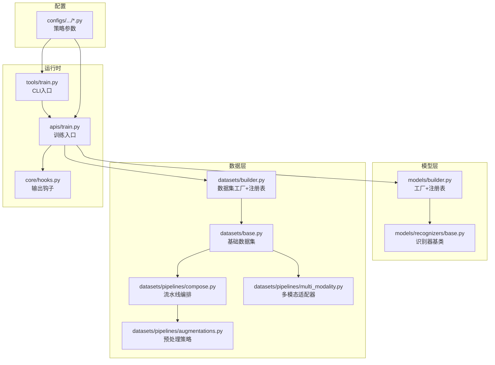
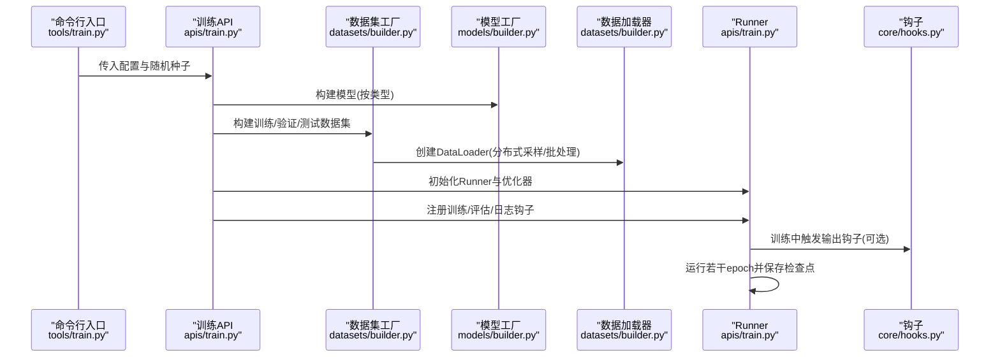
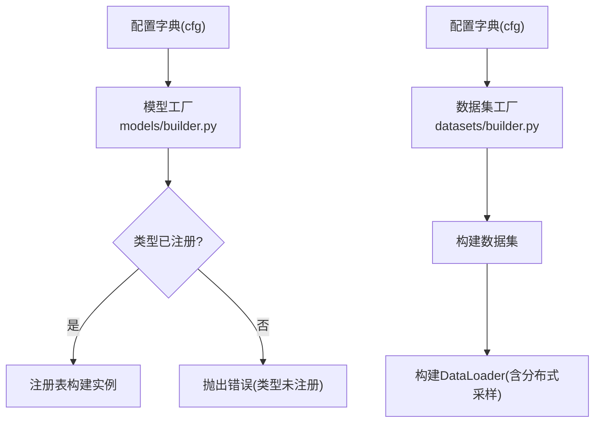
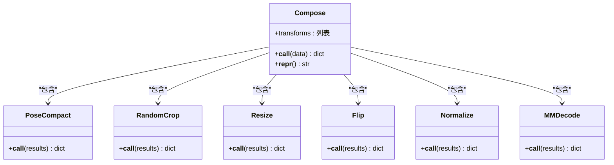
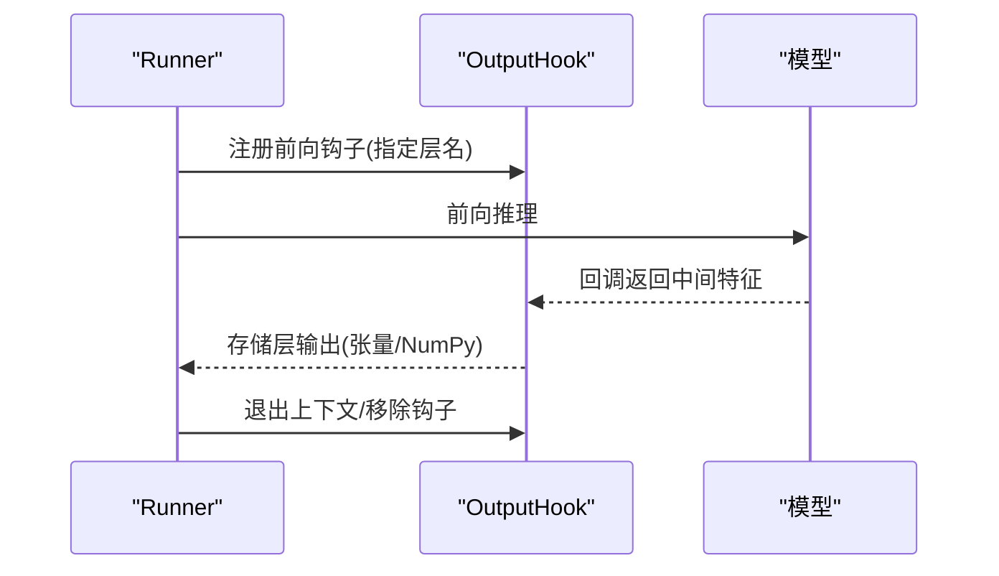
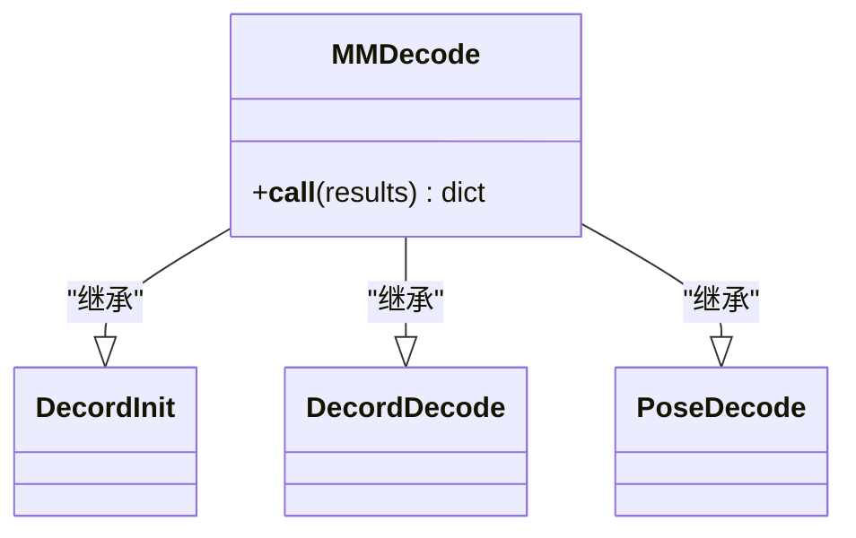
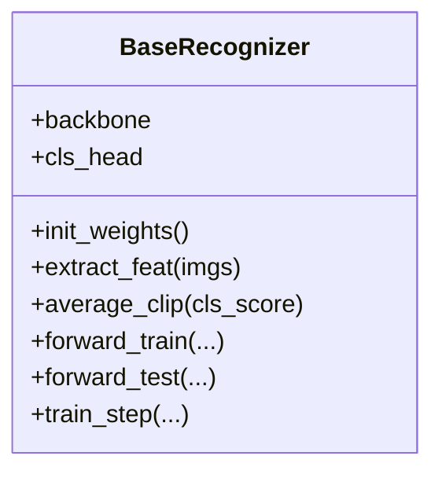
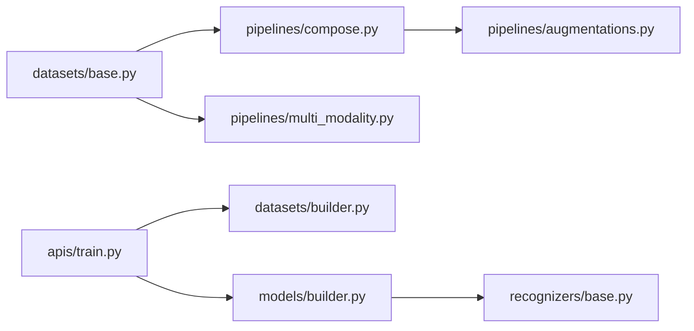

# 设计模式

<cite>
**本文引用的文件**
- [pyskl/models/builder.py](file://pyskl/models/builder.py)
- [pyskl/datasets/builder.py](file://pyskl/datasets/builder.py)
- [pyskl/datasets/base.py](file://pyskl/datasets/base.py)
- [pyskl/datasets/pipelines/compose.py](file://pyskl/datasets/pipelines/compose.py)
- [pyskl/datasets/pipelines/augmentations.py](file://pyskl/datasets/pipelines/augmentations.py)
- [pyskl/datasets/pipelines/multi_modality.py](file://pyskl/datasets/pipelines/multi_modality.py)
- [pyskl/core/hooks.py](file://pyskl/core/hooks.py)
- [pyskl/models/recognizers/base.py](file://pyskl/models/recognizers/base.py)
- [pyskl/apis/train.py](file://pyskl/apis/train.py)
- [tools/train.py](file://tools/train.py)
- [configs/stgcn/stgcn_pyskl_ntu60_xsub_3dkp/b.py](file://configs/stgcn/stgcn_pyskl_ntu60_xsub_3dkp/b.py)
- [configs/stgcn/stgcn_pyskl_ntu60_xsub_3dkp/j.py](file://configs/stgcn/stgcn_pyskl_ntu60_xsub_3dkp/j.py)
</cite>

## 目录
1. [简介](#简介)
2. [项目结构](#项目结构)
3. [核心组件](#核心组件)
4. [架构总览](#架构总览)
5. [详细组件分析](#详细组件分析)
6. [依赖关系分析](#依赖关系分析)
7. [性能考量](#性能考量)
8. [故障排查指南](#故障排查指南)
9. [结论](#结论)
10. [附录](#附录)

## 简介
本文件系统性梳理 PySKL 在“模型与数据集构建”“数据预处理流水线”“训练监控与钩子”“配置与资源管理”等方面对多种设计模式的应用，重点覆盖：
- 工厂模式：模型与数据集构建、注册表机制
- 策略模式：数据预处理流水线的可插拔策略
- 观察者模式：训练过程中的钩子系统
- 单例思想：日志与缓存配置的全局化管理
- 适配器模式：多模态数据（RGB/骨架）的统一处理

目标是帮助读者快速理解 PySKL 的工程化设计，并在实际开发中高效扩展与维护。

## 项目结构
围绕设计模式的落地，PySKL 的关键目录与职责如下：
- pyskl/models：模型定义与工厂构建入口
- pyskl/datasets：数据集工厂、基础数据集、流水线与多模态适配
- pyskl/core：训练钩子（观察者模式）
- pyskl/apis：训练入口与运行时集成
- configs：配置驱动的策略化参数

图表来源
- [pyskl/models/builder.py](file://pyskl/models/builder.py#L1-L39)
- [pyskl/datasets/builder.py](file://pyskl/datasets/builder.py#L1-L134)
- [pyskl/datasets/base.py](file://pyskl/datasets/base.py#L1-L354)
- [pyskl/datasets/pipelines/compose.py](file://pyskl/datasets/pipelines/compose.py#L1-L53)
- [pyskl/datasets/pipelines/augmentations.py](file://pyskl/datasets/pipelines/augmentations.py#L1-L902)
- [pyskl/datasets/pipelines/multi_modality.py](file://pyskl/datasets/pipelines/multi_modality.py#L1-L230)
- [pyskl/core/hooks.py](file://pyskl/core/hooks.py#L1-L68)
- [pyskl/apis/train.py](file://pyskl/apis/train.py#L1-L213)
- [tools/train.py](file://tools/train.py#L106-L143)
- [configs/stgcn/stgcn_pyskl_ntu60_xsub_3dkp/b.py](file://configs/stgcn/stgcn_pyskl_ntu60_xsub_3dkp/b.py#L1-L61)

章节来源
- [pyskl/models/builder.py](file://pyskl/models/builder.py#L1-L39)
- [pyskl/datasets/builder.py](file://pyskl/datasets/builder.py#L1-L134)
- [pyskl/datasets/base.py](file://pyskl/datasets/base.py#L1-L354)
- [pyskl/datasets/pipelines/compose.py](file://pyskl/datasets/pipelines/compose.py#L1-L53)
- [pyskl/datasets/pipelines/augmentations.py](file://pyskl/datasets/pipelines/augmentations.py#L1-L902)
- [pyskl/datasets/pipelines/multi_modality.py](file://pyskl/datasets/pipelines/multi_modality.py#L1-L230)
- [pyskl/core/hooks.py](file://pyskl/core/hooks.py#L1-L68)
- [pyskl/apis/train.py](file://pyskl/apis/train.py#L1-L213)
- [tools/train.py](file://tools/train.py#L106-L143)
- [configs/stgcn/stgcn_pyskl_ntu60_xsub_3dkp/b.py](file://configs/stgcn/stgcn_pyskl_ntu60_xsub_3dkp/b.py#L1-L61)

## 核心组件
- 工厂与注册表
  - 模型工厂：通过注册表按类型动态构建模型组件（backbone/head/recognizer/loss），并支持显式类型校验与错误提示。
  - 数据集工厂：基于注册表构建数据集与流水线，统一数据加载器创建逻辑，支持分布式采样与批处理。
- 预处理流水线
  - 组合器按顺序执行一系列可注册的变换策略；具体策略以装饰器注册，便于扩展与替换。
- 训练钩子
  - 输出钩子在前向过程中按需捕获中间层特征，实现非侵入式监控。
- 识别器基类
  - 抽象出训练/测试前向与损失解析流程，统一权重初始化与分布式训练日志聚合。
- 配置驱动
  - 通过配置文件声明式定义模型结构、数据流水线、优化器与训练策略，实现“策略即代码”。

章节来源
- [pyskl/models/builder.py](file://pyskl/models/builder.py#L1-L39)
- [pyskl/datasets/builder.py](file://pyskl/datasets/builder.py#L1-L134)
- [pyskl/datasets/pipelines/compose.py](file://pyskl/datasets/pipelines/compose.py#L1-L53)
- [pyskl/datasets/pipelines/augmentations.py](file://pyskl/datasets/pipelines/augmentations.py#L1-L902)
- [pyskl/core/hooks.py](file://pyskl/core/hooks.py#L1-L68)
- [pyskl/models/recognizers/base.py](file://pyskl/models/recognizers/base.py#L1-L196)

## 架构总览
下面的序列图展示了训练主流程中“配置→构建模型与数据集→注册钩子→运行”的关键交互，体现工厂与策略的协同。

图表来源
- [tools/train.py](file://tools/train.py#L106-L143)
- [pyskl/apis/train.py](file://pyskl/apis/train.py#L1-L213)
- [pyskl/datasets/builder.py](file://pyskl/datasets/builder.py#L1-L134)
- [pyskl/models/builder.py](file://pyskl/models/builder.py#L1-L39)
- [pyskl/core/hooks.py](file://pyskl/core/hooks.py#L1-L68)

## 详细组件分析

### 工厂模式：模型与数据集构建
- 模型工厂
  - 通过注册表统一管理模型组件类型，按配置字典动态构建；若类型未注册则抛出明确错误，保证类型安全。
  - 典型调用链：配置字典 → 工厂函数 → 注册表 → 实例化。
- 数据集工厂
  - 提供数据集与流水线注册表，统一构建数据集与DataLoader；支持分布式采样器、批处理与随机种子初始化。
  - 典型调用链：配置字典 → 构建数据集 → 构建DataLoader → 分布式采样器。

图表来源
- [pyskl/models/builder.py](file://pyskl/models/builder.py#L1-L39)
- [pyskl/datasets/builder.py](file://pyskl/datasets/builder.py#L1-L134)

章节来源
- [pyskl/models/builder.py](file://pyskl/models/builder.py#L1-L39)
- [pyskl/datasets/builder.py](file://pyskl/datasets/builder.py#L1-L134)

### 策略模式：数据预处理流水线
- 组合器（Compose）
  - 将一系列变换策略按序执行，支持字典配置与可调用对象混用；任一策略返回空则短路。
- 典型策略（节选）
  - 归一化、翻转、裁剪、缩放、紧凑化、多模态解码等，均以装饰器注册，便于替换与扩展。
- 多模态适配器
  - 针对RGB与骨架的统一采样、解码与坐标缩放，屏蔽模态差异。

图表来源
- [pyskl/datasets/pipelines/compose.py](file://pyskl/datasets/pipelines/compose.py#L1-L53)
- [pyskl/datasets/pipelines/augmentations.py](file://pyskl/datasets/pipelines/augmentations.py#L1-L902)
- [pyskl/datasets/pipelines/multi_modality.py](file://pyskl/datasets/pipelines/multi_modality.py#L1-L230)

章节来源
- [pyskl/datasets/pipelines/compose.py](file://pyskl/datasets/pipelines/compose.py#L1-L53)
- [pyskl/datasets/pipelines/augmentations.py](file://pyskl/datasets/pipelines/augmentations.py#L1-L902)
- [pyskl/datasets/pipelines/multi_modality.py](file://pyskl/datasets/pipelines/multi_modality.py#L1-L230)

### 观察者模式：训练监控与钩子
- 输出钩子（OutputHook）
  - 通过注册前向钩子捕获指定层输出，支持张量或NumPy数组；支持上下文管理自动清理。
- 训练入口
  - 训练API在Runner中注册各类训练钩子（学习率、优化器、日志、分布式采样种子等），并在必要时触发评估钩子。

图表来源
- [pyskl/core/hooks.py](file://pyskl/core/hooks.py#L1-L68)
- [pyskl/apis/train.py](file://pyskl/apis/train.py#L1-L213)

章节来源
- [pyskl/core/hooks.py](file://pyskl/core/hooks.py#L1-L68)
- [pyskl/apis/train.py](file://pyskl/apis/train.py#L1-L213)

### 单例思想：配置与资源管理
- 日志记录器
  - 通过工具模块统一获取根日志器，确保分布式环境下仅主进程输出关键信息，其他进程静默。
- 缓存与检查点
  - 提供缓存启动/关闭、端口检测、检查点本地缓存等能力，作为全局资源管理的辅助。
- 配置驱动
  - 通过配置文件声明式定义模型结构、流水线、优化器与训练策略，实现“策略即代码”，减少硬编码。

章节来源
- [pyskl/utils/misc.py](file://pyskl/utils/misc.py#L1-L131)
- [configs/stgcn/stgcn_pyskl_ntu60_xsub_3dkp/b.py](file://configs/stgcn/stgcn_pyskl_ntu60_xsub_3dkp/b.py#L1-L61)
- [configs/stgcn/stgcn_pyskl_ntu60_xsub_3dkp/j.py](file://configs/stgcn/stgcn_pyskl_ntu60_xsub_3dkp/j.py#L1-L61)

### 适配器模式：多模态数据处理
- 多模态解码器（MMDecode）
  - 统一处理RGB视频与骨架序列，分别调用对应解码器；在图像尺寸变化后对骨架坐标进行比例缩放，保持空间一致性。
- 采样与紧凑化适配器
  - 提供多模态统一采样与紧凑化策略，屏蔽不同模态的输入差异。

图表来源
- [pyskl/datasets/pipelines/multi_modality.py](file://pyskl/datasets/pipelines/multi_modality.py#L82-L129)

章节来源
- [pyskl/datasets/pipelines/multi_modality.py](file://pyskl/datasets/pipelines/multi_modality.py#L1-L230)

### 识别器基类：统一训练/测试与损失解析
- 基类职责
  - 组装backbone与head，初始化权重；提供平均片段、损失解析与分布式日志聚合。
- 训练步骤
  - 通过Runner封装训练迭代，统一损失解析与日志变量收集。

图表来源
- [pyskl/models/recognizers/base.py](file://pyskl/models/recognizers/base.py#L1-L196)

章节来源
- [pyskl/models/recognizers/base.py](file://pyskl/models/recognizers/base.py#L1-L196)

## 依赖关系分析
- 组件耦合
  - 数据集工厂依赖注册表与分布式采样器；基础数据集依赖流水线组合器；流水线依赖各策略模块；训练API依赖数据集工厂与模型工厂。
- 扩展点
  - 新增模型/数据集类型只需注册到对应注册表；新增预处理策略只需在流水线注册；新增训练钩子可在Runner中注册。

图表来源
- [pyskl/datasets/base.py](file://pyskl/datasets/base.py#L1-L354)
- [pyskl/datasets/pipelines/compose.py](file://pyskl/datasets/pipelines/compose.py#L1-L53)
- [pyskl/datasets/pipelines/augmentations.py](file://pyskl/datasets/pipelines/augmentations.py#L1-L902)
- [pyskl/datasets/pipelines/multi_modality.py](file://pyskl/datasets/pipelines/multi_modality.py#L1-L230)
- [pyskl/apis/train.py](file://pyskl/apis/train.py#L1-L213)
- [pyskl/datasets/builder.py](file://pyskl/datasets/builder.py#L1-L134)
- [pyskl/models/builder.py](file://pyskl/models/builder.py#L1-L39)
- [pyskl/models/recognizers/base.py](file://pyskl/models/recognizers/base.py#L1-L196)

章节来源
- [pyskl/datasets/base.py](file://pyskl/datasets/base.py#L1-L354)
- [pyskl/datasets/pipelines/compose.py](file://pyskl/datasets/pipelines/compose.py#L1-L53)
- [pyskl/datasets/pipelines/augmentations.py](file://pyskl/datasets/pipelines/augmentations.py#L1-L902)
- [pyskl/datasets/pipelines/multi_modality.py](file://pyskl/datasets/pipelines/multi_modality.py#L1-L230)
- [pyskl/apis/train.py](file://pyskl/apis/train.py#L1-L213)
- [pyskl/datasets/builder.py](file://pyskl/datasets/builder.py#L1-L134)
- [pyskl/models/builder.py](file://pyskl/models/builder.py#L1-L39)
- [pyskl/models/recognizers/base.py](file://pyskl/models/recognizers/base.py#L1-L196)

## 性能考量
- 注册表与反射
  - 动态构建依赖注册表与反射，建议在启动阶段集中注册，避免运行期频繁查找。
- 分布式数据加载
  - 使用分布式采样器与批处理，合理设置每GPU样本数与工作进程数，平衡吞吐与内存占用。
- 预处理流水线
  - 将耗时操作（如解码、归一化）置于流水线前端，尽量减少重复计算；必要时结合多进程缓存。
- 钩子开销
  - 输出钩子仅在需要时启用，避免对训练速度造成显著影响。

## 故障排查指南
- 类型未注册
  - 现象：构建模型时报错“类型未注册”。  
    排查：确认配置中的type已在对应注册表注册，或检查导入路径。
- 分布式采样异常
  - 现象：分布式训练报错或数据不均衡。  
    排查：确认数据集是否提供类别概率；核对分布式采样器参数与rank/world_size。
- 预处理维度不一致
  - 现象：流水线中图像与骨架尺寸不匹配。  
    排查：检查多模态解码后的尺寸同步逻辑，确保骨架坐标随图像缩放而调整。
- 日志与缓存
  - 现象：日志输出异常或缓存不可用。  
    排查：确认日志器初始化与分布式rank；检查缓存端口与可用性。

章节来源
- [pyskl/models/builder.py](file://pyskl/models/builder.py#L36-L39)
- [pyskl/datasets/builder.py](file://pyskl/datasets/builder.py#L88-L124)
- [pyskl/datasets/pipelines/multi_modality.py](file://pyskl/datasets/pipelines/multi_modality.py#L115-L128)
- [pyskl/utils/misc.py](file://pyskl/utils/misc.py#L86-L131)

## 结论
PySKL 通过注册表+工厂的组合，将“类型声明”与“实例化”解耦；以流水线策略化组织数据预处理；以钩子实现非侵入式训练监控；以配置驱动实现策略即代码。这些设计共同提升了系统的可扩展性、可维护性与工程化水平。

## 附录
- 使用场景示例（基于配置）
  - 模型与流水线：在配置文件中声明模型类型、backbone与head，以及训练/验证/测试流水线；训练入口读取配置并构建。
  - 多模态融合：通过多模态解码器统一采样与解码，再在流水线中进行格式化与张量化。
  - 训练监控：在Runner中注册输出钩子，按需捕获中间层特征用于可视化或调试。

章节来源
- [configs/stgcn/stgcn_pyskl_ntu60_xsub_3dkp/b.py](file://configs/stgcn/stgcn_pyskl_ntu60_xsub_3dkp/b.py#L1-L61)
- [configs/stgcn/stgcn_pyskl_ntu60_xsub_3dkp/j.py](file://configs/stgcn/stgcn_pyskl_ntu60_xsub_3dkp/j.py#L1-L61)
- [tools/train.py](file://tools/train.py#L106-L143)
- [pyskl/apis/train.py](file://pyskl/apis/train.py#L1-L213)