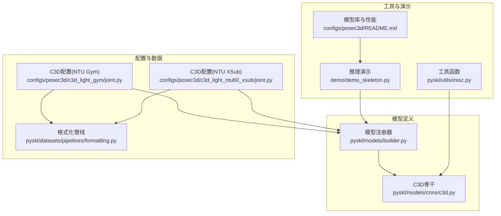
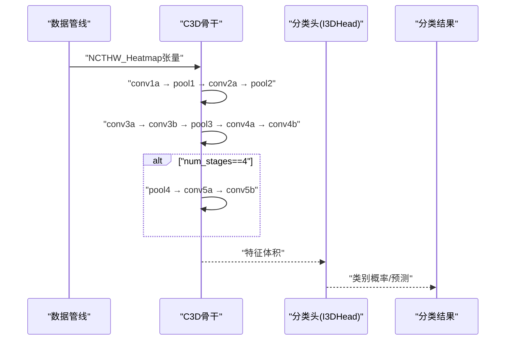
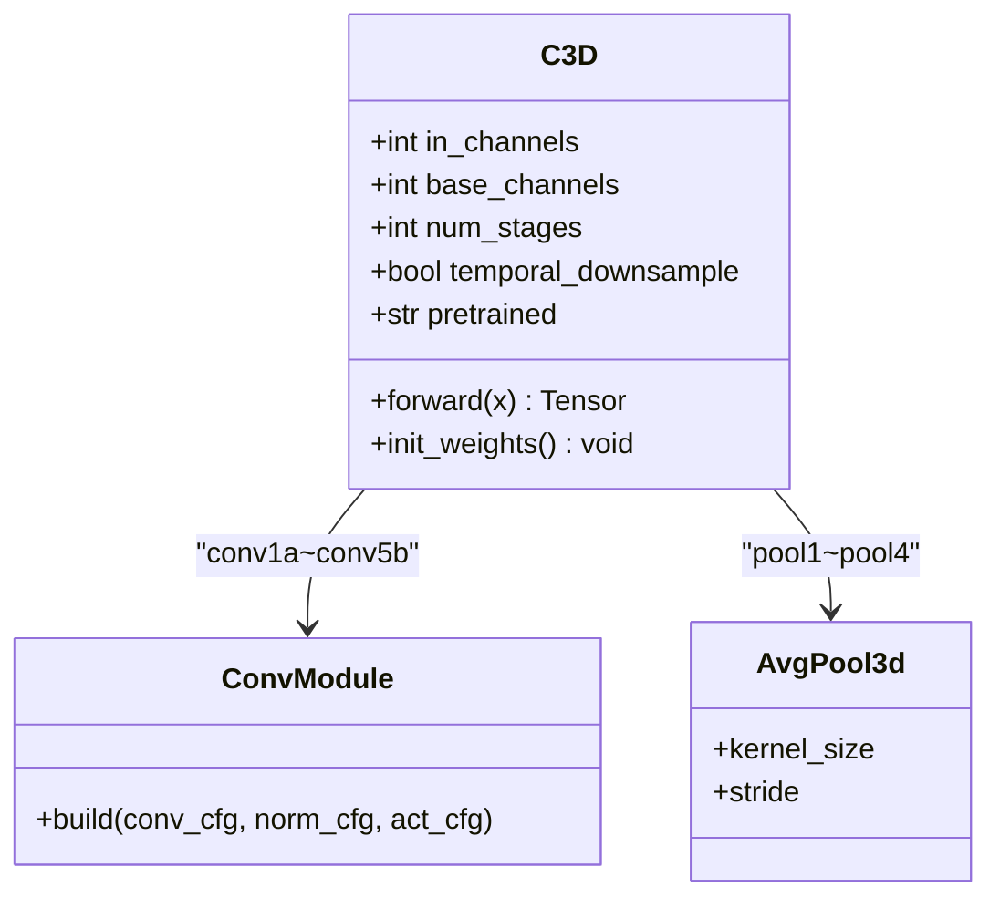
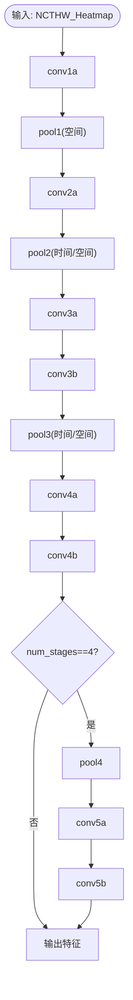
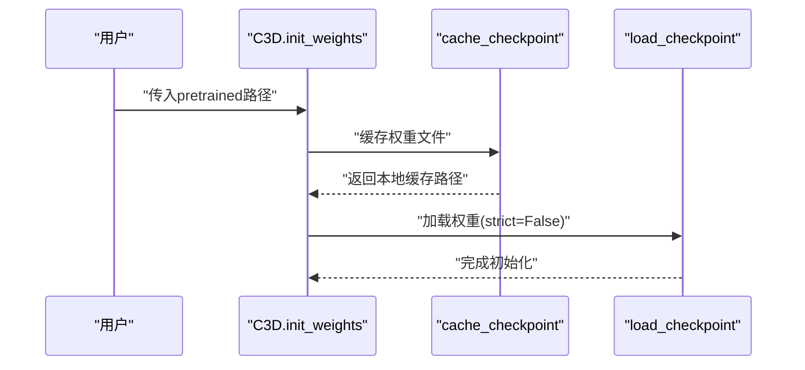
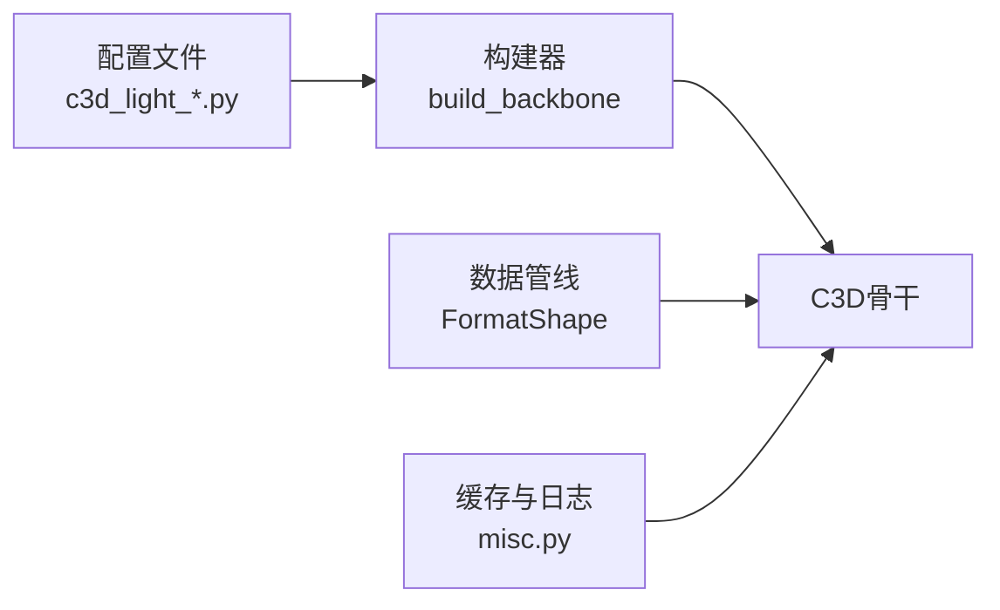

# C3D网络

<cite>
**本文引用的文件**
- [pyskl/models/cnns/c3d.py](file://pyskl/models/cnns/c3d.py)
- [configs/posec3d/c3d_light_gym/joint.py](file://configs/posec3d/c3d_light_gym/joint.py)
- [configs/posec3d/c3d_light_ntu60_xsub/joint.py](file://configs/posec3d/c3d_light_ntu60_xsub/joint.py)
- [pyskl/datasets/pipelines/formatting.py](file://pyskl/datasets/pipelines/formatting.py)
- [pyskl/utils/misc.py](file://pyskl/utils/misc.py)
- [pyskl/models/builder.py](file://pyskl/models/builder.py)
- [configs/posec3d/README.md](file://configs/posec3d/README.md)
- [demo/demo_skeleton.py](file://demo/demo_skeleton.py)
</cite>

## 目录
1. [简介](#简介)
2. [项目结构](#项目结构)
3. [核心组件](#核心组件)
4. [架构总览](#架构总览)
5. [详细组件分析](#详细组件分析)
6. [依赖关系分析](#依赖关系分析)
7. [性能考量](#性能考量)
8. [故障排查指南](#故障排查指南)
9. [结论](#结论)
10. [附录](#附录)

## 简介
本文件系统性地解析PySKL中的C3D骨干网络，聚焦其在骨架动作识别（PoseC3D）中的时空特征提取机制。内容涵盖：
- 3D卷积层设计与时间-空间联合建模
- 从conv1a到conv5b的逐级特征提取流程
- 池化在时间与空间维度的作用及temporal_downsample参数影响
- 参数配置、预训练模型加载与特征输出格式
- 在骨架动作识别场景的应用与性能表现

## 项目结构
围绕C3D网络的关键文件与配置如下：
- C3D骨干实现：pyskl/models/cnns/c3d.py
- 配置示例（PoseC3D + C3D）：configs/posec3d/c3d_light_gym/joint.py、configs/posec3d/c3d_light_ntu60_xsub/joint.py
- 数据格式转换：pyskl/datasets/pipelines/formatting.py
- 工具函数（缓存与日志）：pyskl/utils/misc.py
- 模型构建注册：pyskl/models/builder.py
- 模型库与性能基准：configs/posec3d/README.md
- 推理演示脚本：demo/demo_skeleton.py

图表来源
- [pyskl/models/cnns/c3d.py](file://pyskl/models/cnns/c3d.py#L10-L100)
- [pyskl/models/builder.py](file://pyskl/models/builder.py#L1-L39)
- [configs/posec3d/c3d_light_gym/joint.py](file://configs/posec3d/c3d_light_gym/joint.py#L1-L15)
- [configs/posec3d/c3d_light_ntu60_xsub/joint.py](file://configs/posec3d/c3d_light_ntu60_xsub/joint.py#L1-L15)
- [pyskl/datasets/pipelines/formatting.py](file://pyskl/datasets/pipelines/formatting.py#L160-L250)
- [pyskl/utils/misc.py](file://pyskl/utils/misc.py#L115-L125)
- [demo/demo_skeleton.py](file://demo/demo_skeleton.py#L227-L314)
- [configs/posec3d/README.md](file://configs/posec3d/README.md#L23-L42)

章节来源
- [pyskl/models/cnns/c3d.py](file://pyskl/models/cnns/c3d.py#L10-L100)
- [configs/posec3d/c3d_light_gym/joint.py](file://configs/posec3d/c3d_light_gym/joint.py#L1-L15)
- [configs/posec3d/c3d_light_ntu60_xsub/joint.py](file://configs/posec3d/c3d_light_ntu60_xsub/joint.py#L1-L15)
- [pyskl/datasets/pipelines/formatting.py](file://pyskl/datasets/pipelines/formatting.py#L160-L250)
- [pyskl/utils/misc.py](file://pyskl/utils/misc.py#L115-L125)
- [pyskl/models/builder.py](file://pyskl/models/builder.py#L1-L39)
- [configs/posec3d/README.md](file://configs/posec3d/README.md#L23-L42)
- [demo/demo_skeleton.py](file://demo/demo_skeleton.py#L227-L314)

## 核心组件
- C3D骨干网络：基于3D卷积的轻量级3D CNN，支持3或4阶段结构，可选择是否对时间维进行下采样。
- 预训练加载：支持从URL或本地路径加载权重，并通过缓存机制加速。
- 数据格式：默认采用NCTHW_Heatmap格式，通道维为关键点热图，时维为帧序列长度。
- 集成于PoseC3D：作为骨架动作识别的3D骨干，常与I3DHead等分类头配合使用。

章节来源
- [pyskl/models/cnns/c3d.py](file://pyskl/models/cnns/c3d.py#L10-L100)
- [configs/posec3d/c3d_light_gym/joint.py](file://configs/posec3d/c3d_light_gym/joint.py#L1-L15)
- [configs/posec3d/c3d_light_ntu60_xsub/joint.py](file://configs/posec3d/c3d_light_ntu60_xsub/joint.py#L1-L15)
- [pyskl/datasets/pipelines/formatting.py](file://pyskl/datasets/pipelines/formatting.py#L160-L250)
- [pyskl/utils/misc.py](file://pyskl/utils/misc.py#L115-L125)

## 架构总览
C3D骨干的典型调用流程如下：
- 输入：NCTHW_Heatmap张量，其中N为批大小，C为关键点数（如17），T为帧长（如48），H/W为热图尺寸（如56×56）
- 经过conv1a → pool1 → conv2a → pool2 → conv3a → conv3b → pool3 → conv4a → conv4b → [pool4 → conv5a → conv5b]
- 输出：特征体积（特征图堆叠），用于后续分类头（如I3DHead）

图表来源
- [pyskl/models/cnns/c3d.py](file://pyskl/models/cnns/c3d.py#L70-L99)
- [configs/posec3d/c3d_light_gym/joint.py](file://configs/posec3d/c3d_light_gym/joint.py#L1-L15)
- [configs/posec3d/c3d_light_ntu60_xsub/joint.py](file://configs/posec3d/c3d_light_ntu60_xsub/joint.py#L1-L15)

## 详细组件分析

### C3D类结构与初始化
- 关键参数
  - in_channels：输入通道数（通常为关键点数量）
  - base_channels：第一层基础通道数（默认64）
  - num_stages：网络阶段数（3或4）
  - temporal_downsample：是否对时间维进行下采样
  - pretrained：预训练权重路径或URL
- 卷积与归一化
  - 使用3D卷积（Conv3d）、3D批归一化（BN3d）与ReLU激活
  - 3×3×3卷积核，padding=1，保证空间/时间维度稳定
- 池化策略
  - pool1：仅对空间维度做平均池化（1×2×2）
  - pool2/3/4：根据temporal_downsample决定池化核大小与步幅
    - 默认：对时间与空间均做2×2×2池化
    - 关闭时间下采样：池化核为(1,2,2)，步幅为(1,2,2)，仅空间下采样

图表来源
- [pyskl/models/cnns/c3d.py](file://pyskl/models/cnns/c3d.py#L18-L68)

章节来源
- [pyskl/models/cnns/c3d.py](file://pyskl/models/cnns/c3d.py#L18-L68)

### 逐级特征提取流程（从conv1a到conv5b）
- conv1a：将输入通道映射到base_channels，保留时空分辨率
- pool1：对空间维度做平均池化，保持时间分辨率不变
- conv2a：通道翻倍，继续保留时间分辨率
- pool2：按temporal_downsample设置对时间/空间进行池化
- conv3a/conv3b：进一步加深特征，通道数保持不变
- pool3：同上
- conv4a/conv4b：通道数再次翻倍
- 可选pool4与conv5a/conv5b：当num_stages==4时启用，进一步加深表征

图表来源
- [pyskl/models/cnns/c3d.py](file://pyskl/models/cnns/c3d.py#L70-L99)

章节来源
- [pyskl/models/cnns/c3d.py](file://pyskl/models/cnns/c3d.py#L70-L99)

### 池化在时间与空间维度的作用
- 空间池化（pool1/2/3/4）：降低特征图的空间分辨率，减少计算量，增强感受野
- 时间池化（pool2/3/4）：在temporal_downsample开启时，压缩时间维度，提升时序建模效率；关闭时仅空间下采样，保留更精细的时间粒度
- 影响
  - 开启时间下采样：更快的推理速度，但可能损失细粒度时序信息
  - 关闭时间下采样：保留更多时间分辨率，适合需要精细时序建模的任务

章节来源
- [pyskl/models/cnns/c3d.py](file://pyskl/models/cnns/c3d.py#L34-L36)
- [pyskl/models/cnns/c3d.py](file://pyskl/models/cnns/c3d.py#L44-L56)

### temporal_downsample参数对网络性能的影响
- 训练/推理速度：关闭时间下采样会增加时间维度的计算量，导致速度下降
- 表征能力：关闭时间下采样可保留更多时间细节，有利于复杂动作的时序建模
- 内存占用：时间维度越长，内存占用越高
- 实践建议：在资源充足且对时序细节敏感的任务中可关闭；在实时性要求高时可开启

章节来源
- [pyskl/models/cnns/c3d.py](file://pyskl/models/cnns/c3d.py#L22-L36)

### 参数配置选项
- in_channels：关键点数量（如17）
- base_channels：基础通道数（如32）
- num_stages：3或4（对应不同深度）
- temporal_downsample：布尔值，控制时间维度下采样
- pretrained：预训练权重路径或URL

章节来源
- [pyskl/models/cnns/c3d.py](file://pyskl/models/cnns/c3d.py#L18-L23)
- [configs/posec3d/c3d_light_gym/joint.py](file://configs/posec3d/c3d_light_gym/joint.py#L3-L8)
- [configs/posec3d/c3d_light_ntu60_xsub/joint.py](file://configs/posec3d/c3d_light_ntu60_xsub/joint.py#L3-L8)

### 预训练模型的使用方法
- 支持从HTTP/HTTPS URL或本地路径加载权重
- 自动缓存远程权重至本地缓存目录，避免重复下载
- 初始化时若提供pretrained字符串，则调用权重加载逻辑

图表来源
- [pyskl/models/cnns/c3d.py](file://pyskl/models/cnns/c3d.py#L58-L68)
- [pyskl/utils/misc.py](file://pyskl/utils/misc.py#L115-L125)

章节来源
- [pyskl/models/cnns/c3d.py](file://pyskl/models/cnns/c3d.py#L58-L68)
- [pyskl/utils/misc.py](file://pyskl/utils/misc.py#L115-L125)

### 特征提取的输出格式
- 输入格式：NCTHW_Heatmap（N为批大小，C为关键点数，T为帧长，H/W为热图高度宽度）
- 输出格式：与输入一致的NCTHW特征体积，供下游分类头使用
- 数据管线负责将骨架热图重塑与转置为NCTHW_Heatmap

章节来源
- [pyskl/datasets/pipelines/formatting.py](file://pyskl/datasets/pipelines/formatting.py#L228-L244)
- [configs/posec3d/c3d_light_gym/joint.py](file://configs/posec3d/c3d_light_gym/joint.py#L28-L29)
- [configs/posec3d/c3d_light_ntu60_xsub/joint.py](file://configs/posec3d/c3d_light_ntu60_xsub/joint.py#L28-L29)

### 在骨架动作识别中的应用场景与性能
- 应用场景
  - 姿态估计后处理：将2D关键点序列转化为3D体素热图，使用3D卷积进行时空建模
  - 多数据集训练：NTURGB+D、Kinetics-400、FineGYM等
- 性能表现（部分）
  - NTURGB+D XSub（HRNet 2D姿态）：C3D-light关节Top-1约92.7%
  - FineGYM：C3D-light关节Top-1约91.8%
- 与其他骨干对比：在PoseC3D框架中，C3D-light相较SlowOnly-R50在速度上有优势，同时保持较高精度

章节来源
- [configs/posec3d/README.md](file://configs/posec3d/README.md#L27-L42)
- [configs/posec3d/c3d_light_gym/joint.py](file://configs/posec3d/c3d_light_gym/joint.py#L1-L15)
- [configs/posec3d/c3d_light_ntu60_xsub/joint.py](file://configs/posec3d/c3d_light_ntu60_xsub/joint.py#L1-L15)

## 依赖关系分析
- C3D注册与构建
  - 通过BACKBONES注册模块，由构建器统一实例化
- 数据流
  - 配置文件定义backbone类型与参数
  - 数据管线将骨架热图转换为NCTHW_Heatmap
  - C3D前向传播得到特征体积
- 工具链
  - 权重缓存与日志记录辅助预训练加载

图表来源
- [pyskl/models/builder.py](file://pyskl/models/builder.py#L12-L14)
- [configs/posec3d/c3d_light_gym/joint.py](file://configs/posec3d/c3d_light_gym/joint.py#L3-L8)
- [pyskl/datasets/pipelines/formatting.py](file://pyskl/datasets/pipelines/formatting.py#L160-L250)
- [pyskl/utils/misc.py](file://pyskl/utils/misc.py#L115-L125)

章节来源
- [pyskl/models/builder.py](file://pyskl/models/builder.py#L12-L14)
- [configs/posec3d/c3d_light_gym/joint.py](file://configs/posec3d/c3d_light_gym/joint.py#L3-L8)
- [pyskl/datasets/pipelines/formatting.py](file://pyskl/datasets/pipelines/formatting.py#L160-L250)
- [pyskl/utils/misc.py](file://pyskl/utils/misc.py#L115-L125)

## 性能考量
- 计算复杂度
  - 3D卷积在时间维与空间维同时展开，计算量随T、H、W线性增长
  - 通过池化与通道扩展平衡精度与效率
- 时间下采样的权衡
  - 关闭时间下采样可提升时序细节，但增加计算与显存压力
- 批大小与硬件
  - 配置文件中通常设置较大的批大小以提升吞吐，需结合GPU显存调整
- 推理速度
  - 可参考PoseC3D的FPS评估方式，结合实际硬件进行基准测试

[本节为通用指导，不直接分析具体文件]

## 故障排查指南
- 预训练权重加载失败
  - 检查pretrained路径是否正确（本地或URL）
  - 确认网络已正确注册为BACKBONES
  - 查看日志输出，确认缓存与加载流程
- 输入形状不匹配
  - 确保数据管线将骨架热图转换为NCTHW_Heatmap
  - 校验关键点数量与配置中的in_channels一致
- 训练/推理异常
  - 检查num_stages与backbone结构是否匹配
  - 若使用预训练权重，注意strict=False以跳过不匹配层

章节来源
- [pyskl/models/cnns/c3d.py](file://pyskl/models/cnns/c3d.py#L58-L68)
- [pyskl/datasets/pipelines/formatting.py](file://pyskl/datasets/pipelines/formatting.py#L160-L250)
- [pyskl/models/builder.py](file://pyskl/models/builder.py#L12-L14)

## 结论
C3D作为PySKL中PoseC3D的轻量级3D骨干，在骨架动作识别任务中提供了高效的时空建模能力。通过合理的参数配置（如in_channels、base_channels、num_stages、temporal_downsample）与预训练权重加载，可在精度与效率之间取得良好平衡。结合NCTHW_Heatmap输入格式与I3DHead等分类头，C3D在多个数据集上展现出稳定的性能表现。

[本节为总结性内容，不直接分析具体文件]

## 附录
- 推理演示脚本展示了如何从视频到骨架、再到动作识别的完整流程，便于理解C3D在端到端系统中的位置与作用。

章节来源
- [demo/demo_skeleton.py](file://demo/demo_skeleton.py#L227-L314)