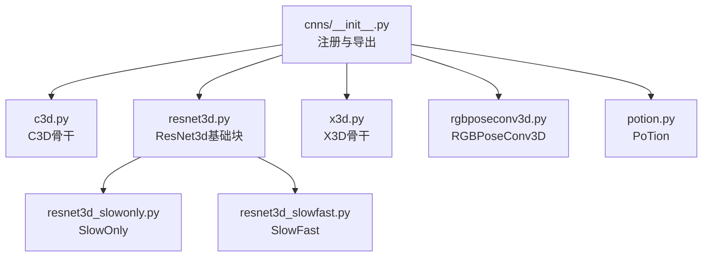
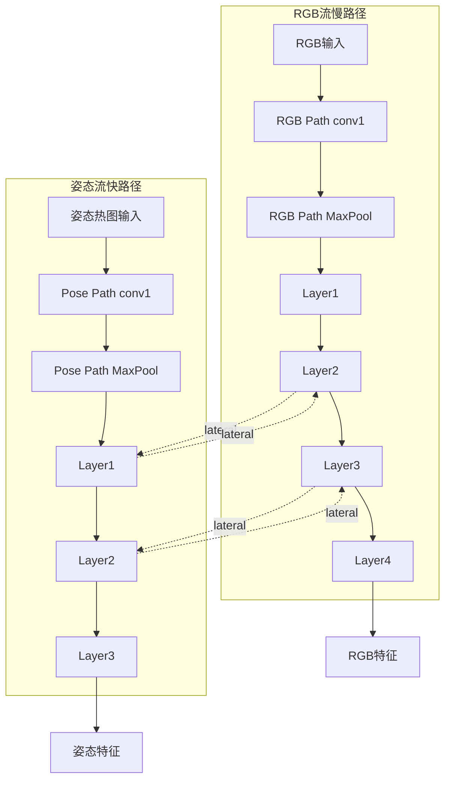
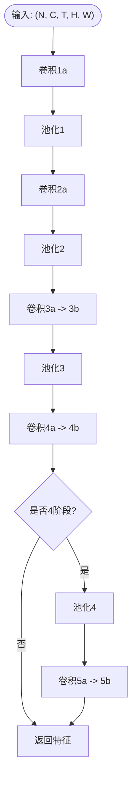
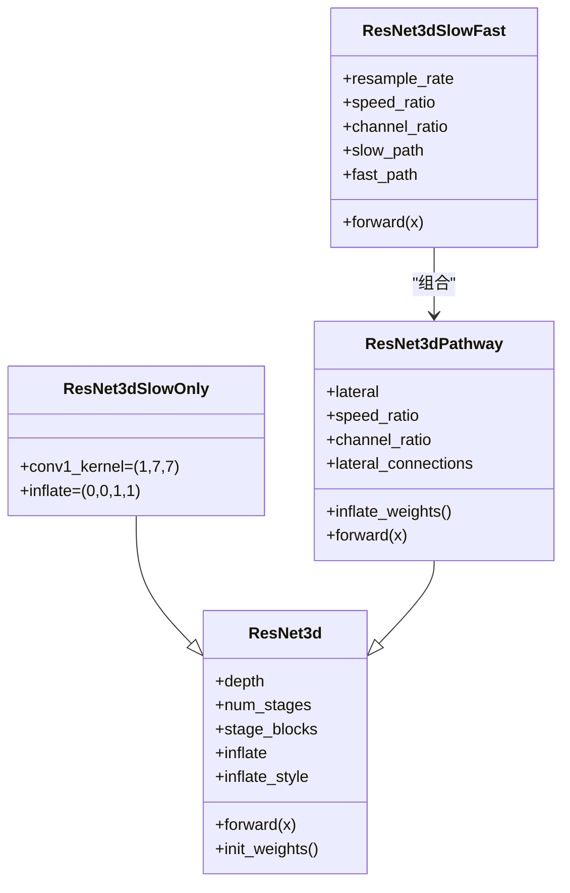
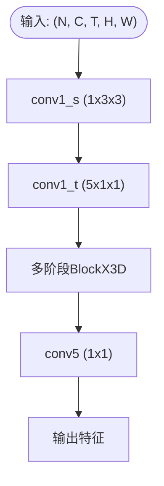
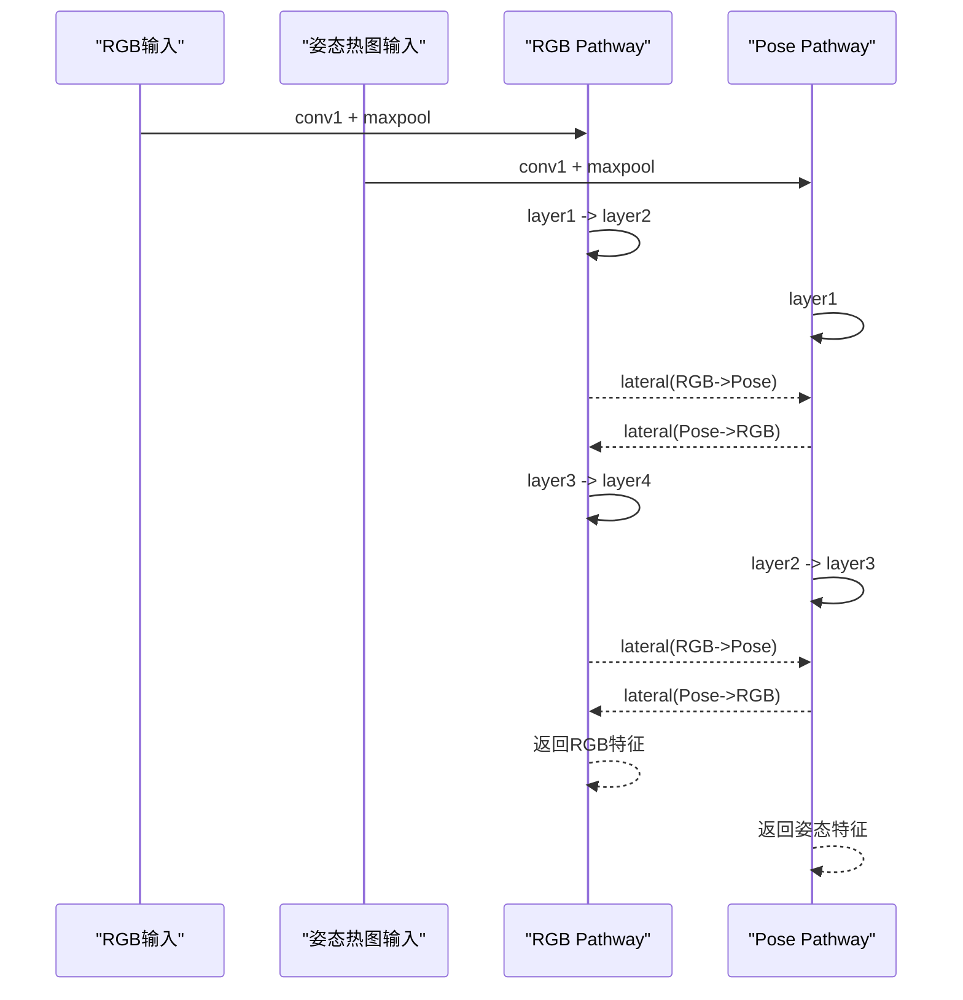
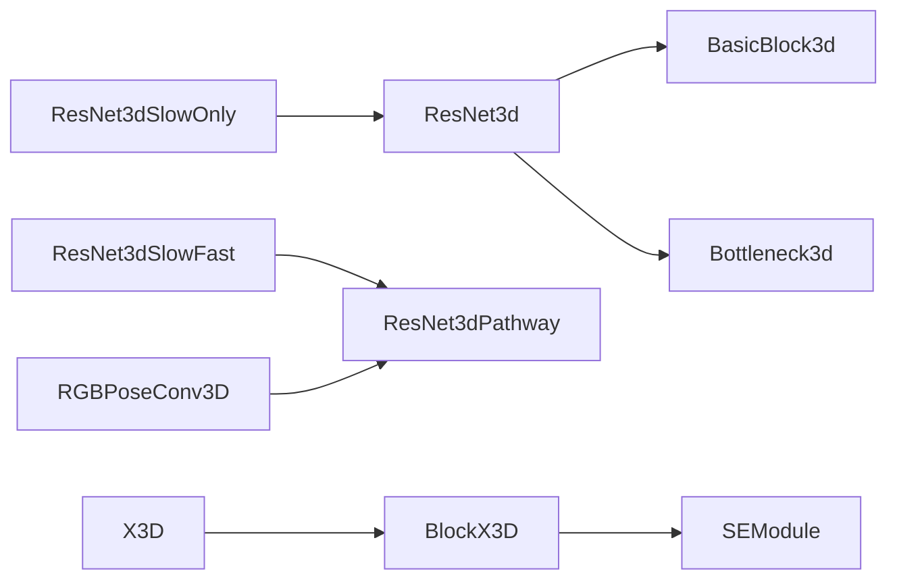

# CNN网络模块

<cite>
**本文引用的文件**
- [pyskl/models/cnns/__init__.py](file://pyskl/models/cnns/__init__.py)
- [pyskl/models/cnns/c3d.py](file://pyskl/models/cnns/c3d.py)
- [pyskl/models/cnns/resnet3d.py](file://pyskl/models/cnns/resnet3d.py)
- [pyskl/models/cnns/resnet3d_slowonly.py](file://pyskl/models/cnns/resnet3d_slowonly.py)
- [pyskl/models/cnns/resnet3d_slowfast.py](file://pyskl/models/cnns/resnet3d_slowfast.py)
- [pyskl/models/cnns/x3d.py](file://pyskl/models/cnns/x3d.py)
- [pyskl/models/cnns/rgbposeconv3d.py](file://pyskl/models/cnns/rgbposeconv3d.py)
- [pyskl/models/cnns/potion.py](file://pyskl/models/cnns/potion.py)
- [configs/rgbpose_conv3d/rgbpose_conv3d.py](file://configs/rgbpose_conv3d/rgbpose_conv3d.py)
- [configs/posec3d/c3d_light_gym/joint.py](file://configs/posec3d/c3d_light_gym/joint.py)
</cite>

## 目录
1. [引言](#引言)
2. [项目结构](#项目结构)
3. [核心组件](#核心组件)
4. [架构总览](#架构总览)
5. [详细组件分析](#详细组件分析)
6. [依赖关系分析](#依赖关系分析)
7. [性能与复杂度](#性能与复杂度)
8. [故障排查指南](#故障排查指南)
9. [结论](#结论)
10. [附录](#附录)

## 引言
本文件面向PySKL的CNN网络模块，系统性梳理3D卷积骨干网络的实现与应用，覆盖以下主题：
- C3D：3D卷积的时空特征提取基础能力
- ResNet3D系列：SlowOnly与SlowFast的时间建模与空间-时间融合策略
- X3D：高效轻量化设计与SE模块
- 混合模态：RGBPoseConv3D与PoTion（POTION）如何融合RGB视频与骨架热图进行动作识别
- 参数统计、计算复杂度分析与适用场景对比
- 网络配置示例与性能基准参考

## 项目结构
CNN骨干网络集中在pyskl/models/cnns目录下，通过统一注册器在__init__.py中导出，并在配置文件中按需装配到识别器。

**图表来源**
- [pyskl/models/cnns/__init__.py](file://pyskl/models/cnns/__init__.py#L1-L14)
- [pyskl/models/cnns/c3d.py](file://pyskl/models/cnns/c3d.py#L1-L100)
- [pyskl/models/cnns/resnet3d.py](file://pyskl/models/cnns/resnet3d.py#L1-L628)
- [pyskl/models/cnns/resnet3d_slowonly.py](file://pyskl/models/cnns/resnet3d_slowonly.py#L1-L18)
- [pyskl/models/cnns/resnet3d_slowfast.py](file://pyskl/models/cnns/resnet3d_slowfast.py#L1-L401)
- [pyskl/models/cnns/x3d.py](file://pyskl/models/cnns/x3d.py#L1-L503)
- [pyskl/models/cnns/rgbposeconv3d.py](file://pyskl/models/cnns/rgbposeconv3d.py#L1-L181)
- [pyskl/models/cnns/potion.py](file://pyskl/models/cnns/potion.py#L1-L81)

**章节来源**
- [pyskl/models/cnns/__init__.py](file://pyskl/models/cnns/__init__.py#L1-L14)

## 核心组件
- C3D：3D卷积堆叠，支持3或4阶段，可选择是否对时间维做下采样；适合骨架热图或短时序片段的3D特征提取。
- ResNet3D：通用3D残差块（BasicBlock3d/Bottleneck3d），支持膨胀策略与2D预训练权重“膨胀”到3D。
- SlowOnly：仅慢路径，时间核膨胀，强调空间分辨率与深层表征。
- SlowFast：双路径（慢/快），通过横向连接融合时间与空间信息，显著提升时序建模能力。
- X3D：以1x3x3卷积为主、通道/深度可缩放的高效设计，引入SE模块与Swish激活，适合长序列视频。
- RGBPoseConv3D：双流（RGB+姿态热图）骨干，分别采用SlowFast风格的两路分支，支持跨流横向连接与可选的特征解耦(drop-path)。
- PoTion：2D轻量级卷积金字塔，作为骨架特征的轻量化主干（用于某些混合模态方案）。

**章节来源**
- [pyskl/models/cnns/c3d.py](file://pyskl/models/cnns/c3d.py#L10-L100)
- [pyskl/models/cnns/resnet3d.py](file://pyskl/models/cnns/resnet3d.py#L13-L196)
- [pyskl/models/cnns/resnet3d_slowonly.py](file://pyskl/models/cnns/resnet3d_slowonly.py#L6-L18)
- [pyskl/models/cnns/resnet3d_slowfast.py](file://pyskl/models/cnns/resnet3d_slowfast.py#L59-L401)
- [pyskl/models/cnns/x3d.py](file://pyskl/models/cnns/x3d.py#L45-L493)
- [pyskl/models/cnns/rgbposeconv3d.py](file://pyskl/models/cnns/rgbposeconv3d.py#L12-L181)
- [pyskl/models/cnns/potion.py](file://pyskl/models/cnns/potion.py#L7-L81)

## 架构总览
下图展示SlowFast与RGBPoseConv3D的双流融合思路：慢路径（RGB）捕获精细空间细节，快路径（姿态热图）聚焦时间变化；通过横向连接在多阶段融合特征。

**图表来源**
- [pyskl/models/cnns/rgbposeconv3d.py](file://pyskl/models/cnns/rgbposeconv3d.py#L102-L171)
- [pyskl/models/cnns/resnet3d_slowfast.py](file://pyskl/models/cnns/resnet3d_slowfast.py#L363-L400)

## 详细组件分析

### C3D骨干
- 结构要点
  - 多阶段3D卷积（3或4阶段），每阶段包含若干卷积与池化层
  - 可配置是否对时间维进行下采样（通过池化核大小与步幅）
  - 支持从外部权重初始化
- 典型用途
  - 骨架热图（17关节点）作为C3D输入，in_channels=17
  - 适配短时序片段（如clip_len=48），在姿态数据上表现稳定
- 训练/推理流程

**图表来源**
- [pyskl/models/cnns/c3d.py](file://pyskl/models/cnns/c3d.py#L70-L99)

**章节来源**
- [pyskl/models/cnns/c3d.py](file://pyskl/models/cnns/c3d.py#L10-L100)
- [configs/posec3d/c3d_light_gym/joint.py](file://configs/posec3d/c3d_light_gym/joint.py#L1-L74)

### ResNet3D基础与SlowOnly/SLOWFAST
- ResNet3D基础
  - BasicBlock3d/Bottleneck3d均支持“膨胀”（inflate）策略，控制时间/空间维度卷积核形状
  - 支持将2D ImageNet权重膨胀到3D（Conv2d→Conv3d），加速收敛
  - 提供高级下采样策略（AvgPool替代Conv3d下采样），减少参数
- SlowOnly
  - 时间核膨胀，空间stride较大，强调空间分辨率
  - 适合RGB视频的高分辨率特征提取
- SlowFast
  - 双路径：慢路径（RGB）+快路径（姿态热图/低采样RGB）
  - 横向连接（lateral connections）在中间阶段融合，显著提升时序建模
  - 支持反向横向连接（lateral_inv）与通道缩放（channel_ratio）

**图表来源**
- [pyskl/models/cnns/resnet3d.py](file://pyskl/models/cnns/resnet3d.py#L13-L196)
- [pyskl/models/cnns/resnet3d_slowonly.py](file://pyskl/models/cnns/resnet3d_slowonly.py#L6-L18)
- [pyskl/models/cnns/resnet3d_slowfast.py](file://pyskl/models/cnns/resnet3d_slowfast.py#L59-L401)

**章节来源**
- [pyskl/models/cnns/resnet3d.py](file://pyskl/models/cnns/resnet3d.py#L13-L628)
- [pyskl/models/cnns/resnet3d_slowonly.py](file://pyskl/models/cnns/resnet3d_slowonly.py#L6-L18)
- [pyskl/models/cnns/resnet3d_slowfast.py](file://pyskl/models/cnns/resnet3d_slowfast.py#L292-L401)

### X3D骨干
- 设计特色
  - 以1x3x3卷积为主，通道与深度按系数gamma_w/gamma_b/gamma_d扩展
  - 引入SE模块与Swish激活，兼顾效率与表达力
  - 无2D预训练权重膨胀，直接从头训练
- 网络流程

**图表来源**
- [pyskl/models/cnns/x3d.py](file://pyskl/models/cnns/x3d.py#L477-L493)

**章节来源**
- [pyskl/models/cnns/x3d.py](file://pyskl/models/cnns/x3d.py#L161-L503)

### RGBPoseConv3D（双流融合）
- 架构概览
  - RGB流：慢路径（Slow），高分辨率空间特征
  - 姿态流：快路径（Fast），关注时间变化
  - 跨流横向连接：在多个阶段将对方特征上采样后拼接
  - 支持特征解耦（detach）与随机丢弃（drop-path）以增强鲁棒性
- 前向流程

**图表来源**
- [pyskl/models/cnns/rgbposeconv3d.py](file://pyskl/models/cnns/rgbposeconv3d.py#L102-L171)

**章节来源**
- [pyskl/models/cnns/rgbposeconv3d.py](file://pyskl/models/cnns/rgbposeconv3d.py#L12-L181)

### PoTion（骨架轻量主干）
- 特点
  - 2D卷积金字塔，逐层通道翻倍，步幅在首层为2
  - 可选Dropout，适合作为骨架特征的轻量化主干
- 适用场景
  - 小数据集或资源受限环境下的骨架动作识别

**章节来源**
- [pyskl/models/cnns/potion.py](file://pyskl/models/cnns/potion.py#L7-L81)

## 依赖关系分析
- 组件内聚与耦合
  - ResNet3D系列通过继承与组合实现复用（SlowOnly继承ResNet3d；SlowFast由两个ResNet3dPathway组成）
  - RGBPoseConv3D同样基于ResNet3dPathway构建双流
- 外部依赖
  - mmcv的ConvModule、激活函数、初始化工具与权重加载接口
  - PyTorch的卷积、批归一化与张量操作

**图表来源**
- [pyskl/models/cnns/resnet3d.py](file://pyskl/models/cnns/resnet3d.py#L13-L196)
- [pyskl/models/cnns/resnet3d_slowfast.py](file://pyskl/models/cnns/resnet3d_slowfast.py#L59-L401)
- [pyskl/models/cnns/rgbposeconv3d.py](file://pyskl/models/cnns/rgbposeconv3d.py#L72-L73)
- [pyskl/models/cnns/x3d.py](file://pyskl/models/cnns/x3d.py#L45-L156)

## 性能与复杂度
说明：以下为概念性分析，不直接对应具体代码行。

- C3D
  - 参数规模：随阶段与通道数线性增长；时间维度卷积核大小影响计算量
  - 适合短时序与骨架热图输入；对长序列可能显存压力大
- ResNet3D系列
  - 参数与FLOPs随depth与stage_blocks指数增长；SlowOnly在相同分辨率下更深
  - SlowFast通过双路径与横向连接显著提升时序建模，但计算开销更大
- X3D
  - 通过gamma_w/b/d缩放灵活控制参数与计算；1x3x3卷积降低时间维度计算
  - SE与Swish带来额外开销，但通常收益大于成本
- RGBPoseConv3D
  - 双流并行，参数与计算约为单一流两倍；横向连接增加拼接与卷积开销
  - 解耦与drop-path策略有助于泛化，训练稳定性提升
- PoTion
  - 2D轻量主干，参数与计算远小于3D骨干，适合小样本或边缘部署

[本节为通用性能讨论，无需列出章节来源]

## 故障排查指南
- 权重加载失败
  - 检查pretrained路径与缓存；确认网络类型与checkpoint键名匹配
  - 对于ResNet3D/SlowFast，若使用2D预训练膨胀，注意参数形状兼容性
- 形状不匹配
  - 横向连接或拼接前需确保通道数一致；必要时使用1x1卷积调整
- 冻结参数与BN模式
  - 使用frozen_stages与norm_eval时，注意train/eval切换与BN统计更新
- 训练不稳定
  - 适当降低学习率、启用梯度裁剪；对RGBPoseConv3D可启用drop-path与detach策略

**章节来源**
- [pyskl/models/cnns/resnet3d.py](file://pyskl/models/cnns/resnet3d.py#L524-L595)
- [pyskl/models/cnns/resnet3d_slowfast.py](file://pyskl/models/cnns/resnet3d_slowfast.py#L343-L361)
- [pyskl/models/cnns/x3d.py](file://pyskl/models/cnns/x3d.py#L457-L475)
- [pyskl/models/cnns/rgbposeconv3d.py](file://pyskl/models/cnns/rgbposeconv3d.py#L81-L100)

## 结论
- C3D为骨架热图与短时序提供了稳健的3D特征提取基线
- ResNet3D系列通过膨胀与双路径设计实现从空间到时空的渐进式建模，SlowFast在时序任务上优势明显
- X3D以高效设计与SE/Swish提升性价比，适合长序列视频
- RGBPoseConv3D通过双流与横向连接深度融合RGB与骨架信息，适合多模态动作识别
- PoTion提供轻量骨架主干，适用于资源受限场景

[本节为总结性内容，无需列出章节来源]

## 附录

### 网络配置示例与关键参数
- RGBPoseConv3D（双流融合）
  - 关键参数：speed_ratio、channel_ratio、两侧pathway的stage_blocks/conv1_kernel/inflate等
  - 训练设置：优化器、学习率调度、评估指标与工作目录
  - 参考配置路径：[configs/rgbpose_conv3d/rgbpose_conv3d.py](file://configs/rgbpose_conv3d/rgbpose_conv3d.py#L1-L107)
- C3D（骨架热图）
  - 输入通道：in_channels=17（关节点数）
  - 时间下采样：temporal_downsample可设为False以保留时间分辨率
  - 参考配置路径：[configs/posec3d/c3d_light_gym/joint.py](file://configs/posec3d/c3d_light_gym/joint.py#L1-L74)

**章节来源**
- [configs/rgbpose_conv3d/rgbpose_conv3d.py](file://configs/rgbpose_conv3d/rgbpose_conv3d.py#L1-L107)
- [configs/posec3d/c3d_light_gym/joint.py](file://configs/posec3d/c3d_light_gym/joint.py#L1-L74)