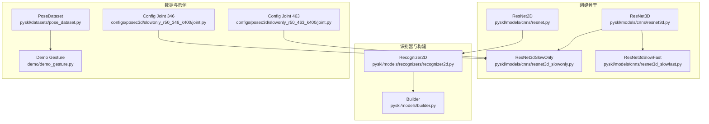
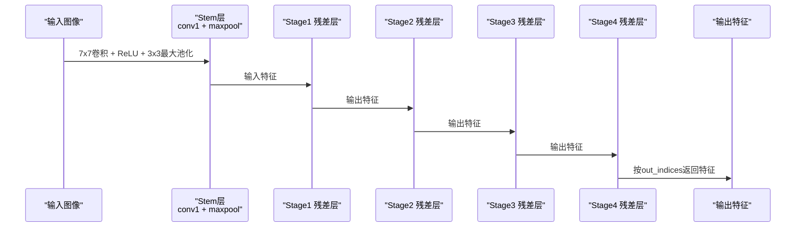
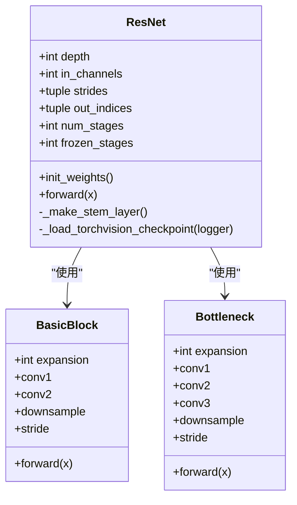
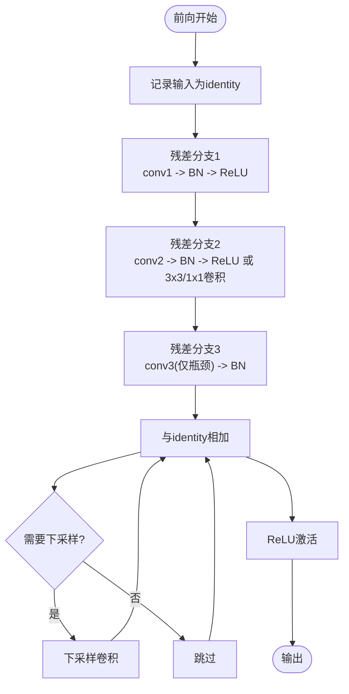
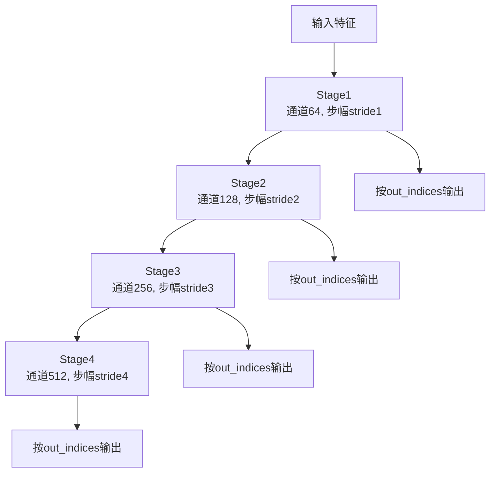
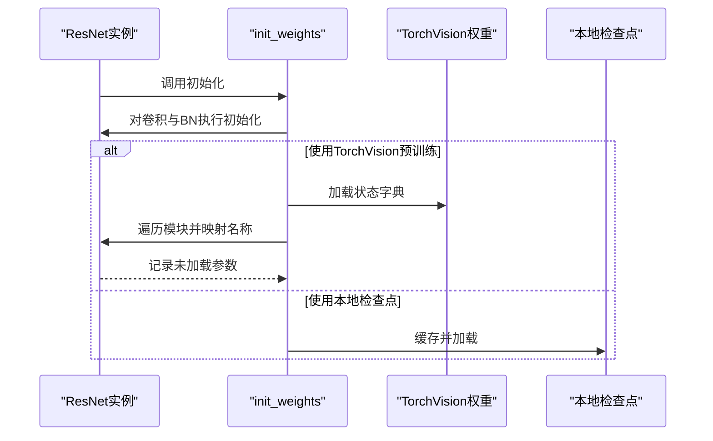
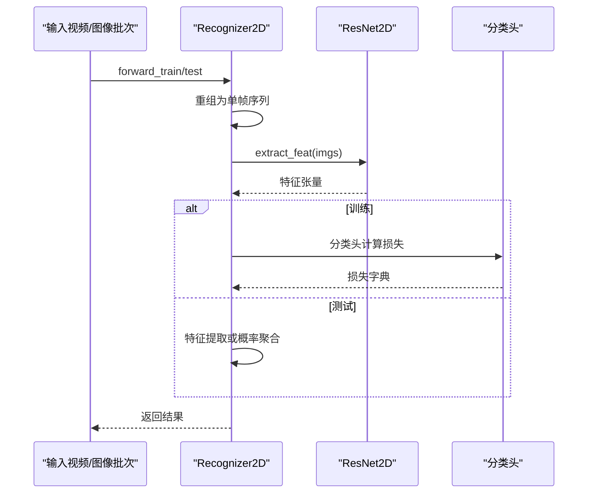
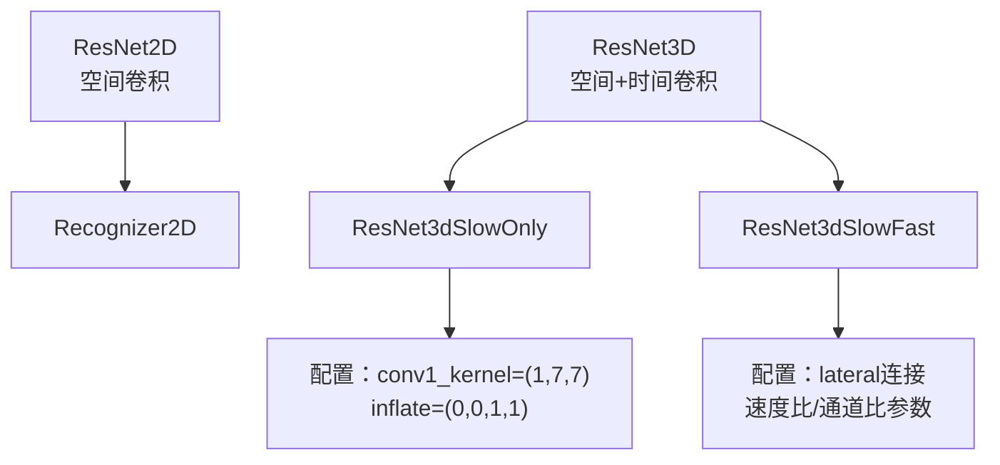
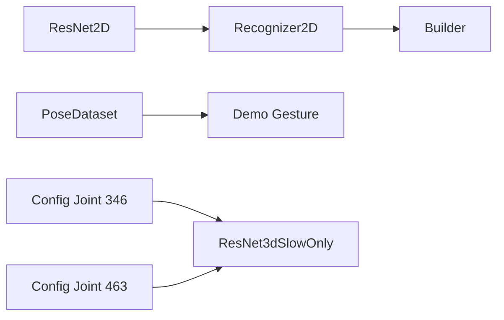

# ResNet2D网络

<cite>
**本文引用的文件**
- [pyskl/models/cnns/resnet.py](file://pyskl/models/cnns/resnet.py)
- [pyskl/models/recognizers/recognizer2d.py](file://pyskl/models/recognizers/recognizer2d.py)
- [pyskl/models/builder.py](file://pyskl/models/builder.py)
- [pyskl/datasets/pose_dataset.py](file://pyskl/datasets/pose_dataset.py)
- [demo/demo_gesture.py](file://demo/demo_gesture.py)
- [configs/posec3d/slowonly_r50_346_k400/joint.py](file://configs/posec3d/slowonly_r50_346_k400/joint.py)
- [configs/posec3d/slowonly_r50_463_k400/joint.py](file://configs/posec3d/slowonly_r50_463_k400/joint.py)
- [pyskl/models/cnns/resnet3d.py](file://pyskl/models/cnns/resnet3d.py)
- [pyskl/models/cnns/resnet3d_slowonly.py](file://pyskl/models/cnns/resnet3d_slowonly.py)
- [pyskl/models/cnns/resnet3d_slowfast.py](file://pyskl/models/cnns/resnet3d_slowfast.py)
</cite>

## 目录
1. [简介](#简介)
2. [项目结构](#项目结构)
3. [核心组件](#核心组件)
4. [架构总览](#架构总览)
5. [详细组件分析](#详细组件分析)
6. [依赖关系分析](#依赖关系分析)
7. [性能考量](#性能考量)
8. [故障排查指南](#故障排查指南)
9. [结论](#结论)
10. [附录](#附录)

## 简介
本技术文档围绕PySKL中的ResNet2D网络展开，系统阐述其在空间特征提取方面的设计原理与实现细节。ResNet2D通过标准2D卷积层、残差块结构与多阶段特征金字塔构建机制，实现了对静态图像与2D视频帧的高效表征学习。文档将详细说明：
- 从初始卷积层到多个残差阶段的层次化特征提取流程
- 残差跳跃连接如何缓解深层网络的梯度消失问题
- 网络配置参数、预训练模型加载策略与特征输出规格
- 在静态图像与2D视频帧任务中的应用优势
- 与3D网络架构（如ResNet3D、SlowOnly、SlowFast）的对比与性能差异

## 项目结构
与ResNet2D相关的核心代码主要分布在以下模块：
- 网络骨干：pyskl/models/cnns/resnet.py
- 2D识别器框架：pyskl/models/recognizers/recognizer2d.py
- 模型注册与构建：pyskl/models/builder.py
- 数据集与示例：pyskl/datasets/pose_dataset.py、demo/demo_gesture.py
- 配置样例：configs/posec3d/slowonly_r50_346_k400/joint.py、configs/posec3d/slowonly_r50_463_k400/joint.py
- 3D对比架构：pyskl/models/cnns/resnet3d.py、pyskl/models/cnns/resnet3d_slowonly.py、pyskl/models/cnns/resnet3d_slowfast.py

图表来源
- [pyskl/models/cnns/resnet.py](file://pyskl/models/cnns/resnet.py#L238-L479)
- [pyskl/models/recognizers/recognizer2d.py](file://pyskl/models/recognizers/recognizer2d.py#L8-L59)
- [pyskl/models/builder.py](file://pyskl/models/builder.py#L1-L39)
- [pyskl/datasets/pose_dataset.py](file://pyskl/datasets/pose_dataset.py#L10-L107)
- [demo/demo_gesture.py](file://demo/demo_gesture.py#L1-L174)
- [configs/posec3d/slowonly_r50_346_k400/joint.py](file://configs/posec3d/slowonly_r50_346_k400/joint.py#L1-L110)
- [configs/posec3d/slowonly_r50_463_k400/joint.py](file://configs/posec3d/slowonly_r50_463_k400/joint.py#L1-L110)
- [pyskl/models/cnns/resnet3d.py](file://pyskl/models/cnns/resnet3d.py#L199-L627)
- [pyskl/models/cnns/resnet3d_slowonly.py](file://pyskl/models/cnns/resnet3d_slowonly.py#L6-L18)
- [pyskl/models/cnns/resnet3d_slowfast.py](file://pyskl/models/cnns/resnet3d_slowfast.py#L59-L349)

章节来源
- [pyskl/models/cnns/resnet.py](file://pyskl/models/cnns/resnet.py#L238-L479)
- [pyskl/models/recognizers/recognizer2d.py](file://pyskl/models/recognizers/recognizer2d.py#L8-L59)
- [pyskl/models/builder.py](file://pyskl/models/builder.py#L1-L39)

## 核心组件
- ResNet2D骨干网络：支持多种深度配置（18/34/50/101/152），采用BasicBlock与Bottleneck两种残差单元，提供stem层、多阶段残差层与可选的多输出索引。
- 2D识别器框架：面向静态图像与2D视频帧的识别流程，支持训练与测试阶段的特征提取与分类头计算。
- 模型构建器：基于注册表统一构建backbone、head、recognizer等组件。
- 数据与示例：PoseDataset用于动作识别的数据加载；demo演示了从关键点到推理的完整流程。

章节来源
- [pyskl/models/cnns/resnet.py](file://pyskl/models/cnns/resnet.py#L238-L479)
- [pyskl/models/recognizers/recognizer2d.py](file://pyskl/models/recognizers/recognizer2d.py#L8-L59)
- [pyskl/models/builder.py](file://pyskl/models/builder.py#L1-L39)
- [pyskl/datasets/pose_dataset.py](file://pyskl/datasets/pose_dataset.py#L10-L107)
- [demo/demo_gesture.py](file://demo/demo_gesture.py#L1-L174)

## 架构总览
ResNet2D的典型数据流从输入图像开始，经过stem层下采样，进入多个残差阶段逐步提取高层语义特征，最终按配置返回指定层级的特征图。

图表来源
- [pyskl/models/cnns/resnet.py](file://pyskl/models/cnns/resnet.py#L325-L339)
- [pyskl/models/cnns/resnet.py](file://pyskl/models/cnns/resnet.py#L304-L321)
- [pyskl/models/cnns/resnet.py](file://pyskl/models/cnns/resnet.py#L434-L455)

## 详细组件分析

### ResNet2D骨干网络
- 设计要点
  - 基础模块：BasicBlock（扩张系数1）、Bottleneck（扩张系数4）
  - 残差路径：两路或三路卷积后与输入相加，缓解梯度消失
  - 结构层次：stem层（7x7卷积+池化）+ 多个残差阶段（默认4个阶段）
  - 可配置项：深度、阶段数量、每阶段步幅、输出索引、冻结层数、归一化与激活配置
- 关键实现位置
  - 基本块与瓶颈块定义、make_res_layer构建残差层、ResNet主类与初始化、stem层构造、权重初始化与预训练加载、前向传播与冻结策略

图表来源
- [pyskl/models/cnns/resnet.py](file://pyskl/models/cnns/resnet.py#L11-L82)
- [pyskl/models/cnns/resnet.py](file://pyskl/models/cnns/resnet.py#L85-L176)
- [pyskl/models/cnns/resnet.py](file://pyskl/models/cnns/resnet.py#L238-L479)

章节来源
- [pyskl/models/cnns/resnet.py](file://pyskl/models/cnns/resnet.py#L11-L82)
- [pyskl/models/cnns/resnet.py](file://pyskl/models/cnns/resnet.py#L85-L176)
- [pyskl/models/cnns/resnet.py](file://pyskl/models/cnns/resnet.py#L238-L479)

### 残差跳跃连接与梯度传播
- 跳跃连接设计
  - 将输入直接与残差分支输出相加，保证信息直通，缓解深层网络的梯度消失
  - 下采样时通过下采样卷积保持维度一致
- 实现位置
  - BasicBlock与Bottleneck的forward中均包含identity与add操作

图表来源
- [pyskl/models/cnns/resnet.py](file://pyskl/models/cnns/resnet.py#L62-L82)
- [pyskl/models/cnns/resnet.py](file://pyskl/models/cnns/resnet.py#L148-L176)

章节来源
- [pyskl/models/cnns/resnet.py](file://pyskl/models/cnns/resnet.py#L62-L82)
- [pyskl/models/cnns/resnet.py](file://pyskl/models/cnns/resnet.py#L148-L176)

### 特征金字塔与多阶段提取
- 阶段化设计
  - 默认4个阶段，每阶段通道数按2倍递增，空间分辨率按步幅递减
  - 支持自定义每个阶段的步幅与输出索引，便于灵活选择高层特征
- 实现位置
  - 阶段循环构建、通道数计算、层名管理与前向遍历输出

图表来源
- [pyskl/models/cnns/resnet.py](file://pyskl/models/cnns/resnet.py#L304-L321)
- [pyskl/models/cnns/resnet.py](file://pyskl/models/cnns/resnet.py#L434-L455)

章节来源
- [pyskl/models/cnns/resnet.py](file://pyskl/models/cnns/resnet.py#L304-L321)
- [pyskl/models/cnns/resnet.py](file://pyskl/models/cnns/resnet.py#L434-L455)

### 预训练模型加载与权重初始化
- 权重初始化
  - 卷积层使用Kaiming初始化，BN层使用常数初始化
- 预训练加载
  - 支持从TorchVision预训练权重加载，或从本地检查点加载
  - 加载时进行名称映射与形状一致性校验，未加载参数会记录日志提示
- 实现位置
  - init_weights、_load_torchvision_checkpoint、_load_conv_params、_load_bn_params

图表来源
- [pyskl/models/cnns/resnet.py](file://pyskl/models/cnns/resnet.py#L417-L433)
- [pyskl/models/cnns/resnet.py](file://pyskl/models/cnns/resnet.py#L389-L416)
- [pyskl/models/cnns/resnet.py](file://pyskl/models/cnns/resnet.py#L340-L388)

章节来源
- [pyskl/models/cnns/resnet.py](file://pyskl/models/cnns/resnet.py#L417-L433)
- [pyskl/models/cnns/resnet.py](file://pyskl/models/cnns/resnet.py#L389-L416)
- [pyskl/models/cnns/resnet.py](file://pyskl/models/cnns/resnet.py#L340-L388)

### 2D识别器框架与特征提取
- 功能概述
  - 训练阶段：将批次与片段重组为单帧序列，经backbone提取特征后送入分类头
  - 测试阶段：支持特征提取模式（空间平均池化+时间平均池化）与概率聚合
- 实现位置
  - forward_train与forward_test逻辑

图表来源
- [pyskl/models/recognizers/recognizer2d.py](file://pyskl/models/recognizers/recognizer2d.py#L12-L58)

章节来源
- [pyskl/models/recognizers/recognizer2d.py](file://pyskl/models/recognizers/recognizer2d.py#L12-L58)

### 与3D网络架构的对比与应用
- ResNet2D vs ResNet3D
  - ResNet2D：仅空间维度卷积，适合静态图像与2D视频帧
  - ResNet3D：引入时间维卷积与膨胀策略，适合视频动作识别
- ResNet3D SlowOnly
  - 仅保留慢路径，时间核尺寸较小，强调空间特征
- ResNet3D SlowFast
  - 双路径（快/慢）并行，慢路径捕获长期运动，快路径捕获快速细节
- 实现位置
  - ResNet3D、ResNet3dSlowOnly、ResNet3dSlowFast的骨架与权重膨胀逻辑

图表来源
- [pyskl/models/cnns/resnet3d.py](file://pyskl/models/cnns/resnet3d.py#L199-L627)
- [pyskl/models/cnns/resnet3d_slowonly.py](file://pyskl/models/cnns/resnet3d_slowonly.py#L6-L18)
- [pyskl/models/cnns/resnet3d_slowfast.py](file://pyskl/models/cnns/resnet3d_slowfast.py#L59-L349)

章节来源
- [pyskl/models/cnns/resnet3d.py](file://pyskl/models/cnns/resnet3d.py#L199-L627)
- [pyskl/models/cnns/resnet3d_slowonly.py](file://pyskl/models/cnns/resnet3d_slowonly.py#L6-L18)
- [pyskl/models/cnns/resnet3d_slowfast.py](file://pyskl/models/cnns/resnet3d_slowfast.py#L59-L349)

## 依赖关系分析
- 组件耦合
  - ResNet2D作为backbone被Recognizer2D调用
  - Builder通过注册表统一构建模型组件
  - 数据集与示例脚本验证端到端流程
- 外部依赖
  - TorchVision预训练权重用于ResNet2D初始化
  - MMEngine/Registry用于模块注册与构建

图表来源
- [pyskl/models/builder.py](file://pyskl/models/builder.py#L1-L39)
- [pyskl/models/recognizers/recognizer2d.py](file://pyskl/models/recognizers/recognizer2d.py#L8-L59)
- [demo/demo_gesture.py](file://demo/demo_gesture.py#L1-L174)
- [configs/posec3d/slowonly_r50_346_k400/joint.py](file://configs/posec3d/slowonly_r50_346_k400/joint.py#L1-L110)
- [configs/posec3d/slowonly_r50_463_k400/joint.py](file://configs/posec3d/slowonly_r50_463_k400/joint.py#L1-L110)

章节来源
- [pyskl/models/builder.py](file://pyskl/models/builder.py#L1-L39)
- [pyskl/models/recognizers/recognizer2d.py](file://pyskl/models/recognizers/recognizer2d.py#L8-L59)
- [demo/demo_gesture.py](file://demo/demo_gesture.py#L1-L174)

## 性能考量
- 计算复杂度
  - ResNet2D的空间卷积在静态图像与2D视频帧上具有较低的时间开销，适合实时推理
- 内存占用
  - 通过冻结部分阶段与BN评估模式可减少训练内存
- 预训练迁移
  - 使用TorchVision预训练权重可显著提升收敛速度与精度
- 与3D网络对比
  - ResNet2D在纯空间任务上更轻量；ResNet3D（尤其是SlowOnly/SF）在视频动作识别上具备更强的时空建模能力

## 故障排查指南
- 预训练权重未完全加载
  - 现象：日志提示存在未加载参数
  - 排查：确认模块名称映射与权重形状匹配
- 形状不匹配
  - 现象：初始化时报错或特征维度异常
  - 排查：检查输入通道数、步幅与下采样卷积设置
- 训练不稳定
  - 现象：梯度爆炸或收敛缓慢
  - 排查：启用BN评估模式、冻结部分阶段、调整学习率与优化器配置

章节来源
- [pyskl/models/cnns/resnet.py](file://pyskl/models/cnns/resnet.py#L389-L416)
- [pyskl/models/cnns/resnet.py](file://pyskl/models/cnns/resnet.py#L417-L433)

## 结论
ResNet2D在PySKL中以简洁而强大的空间特征提取能力，成为静态图像与2D视频帧任务的理想骨干。其残差跳跃连接有效缓解梯度消失，多阶段特征金字塔支持灵活的高层语义提取。结合TorchVision预训练权重与Recognizer2D框架，ResNet2D在准确率与效率之间取得良好平衡。对于需要时空建模的任务，可参考ResNet3D系列架构（SlowOnly/SlowFast）进行扩展。

## 附录

### ResNet2D配置参数速览
- 关键参数
  - depth：网络深度（18/34/50/101/152）
  - in_channels：输入通道数（默认3）
  - num_stages：阶段数量（默认4）
  - strides：各阶段首个块的步幅（默认(1,2,2,2)）
  - out_indices：输出索引集合（默认(3,)）
  - frozen_stages：冻结阶段数（默认-1表示不冻结）
  - conv_cfg/norm_cfg/act_cfg：卷积/归一化/激活配置
  - norm_eval：BN评估模式开关
  - pretrained/torchvision_pretrain：预训练来源与加载方式
- 实现位置
  - ResNet.__init__与相关配置字段

章节来源
- [pyskl/models/cnns/resnet.py](file://pyskl/models/cnns/resnet.py#L266-L296)

### 预训练模型使用方法
- TorchVision预训练
  - 启用torchvision_pretrain后自动加载对应权重，并进行名称映射与形状校验
- 本地检查点
  - 提供pretrained字符串路径，缓存后加载，strict=False避免严格匹配
- 实现位置
  - init_weights、_load_torchvision_checkpoint

章节来源
- [pyskl/models/cnns/resnet.py](file://pyskl/models/cnns/resnet.py#L417-L433)
- [pyskl/models/cnns/resnet.py](file://pyskl/models/cnns/resnet.py#L389-L416)

### 特征提取输出规格
- 输出类型
  - 单个特征张量（当out_indices长度为1）或元组（多输出）
- 典型形状
  - (B, C, H, W)，其中C随阶段递增，H/W随步幅递减
- 实现位置
  - ResNet.forward与out_indices控制

章节来源
- [pyskl/models/cnns/resnet.py](file://pyskl/models/cnns/resnet.py#L434-L455)

### 应用场景与优势
- 静态图像分类与检测
  - ResNet2D在图像分类任务中表现稳定，推理速度快
- 2D视频帧处理
  - 适用于帧级动作识别、行为理解等任务
- 与3D网络对比
  - ResNet2D更轻量，适合资源受限环境；3D网络（SlowOnly/SF）在视频理解上更具优势

章节来源
- [pyskl/models/recognizers/recognizer2d.py](file://pyskl/models/recognizers/recognizer2d.py#L12-L58)
- [pyskl/models/cnns/resnet3d.py](file://pyskl/models/cnns/resnet3d.py#L199-L627)
- [pyskl/models/cnns/resnet3d_slowonly.py](file://pyskl/models/cnns/resnet3d_slowonly.py#L6-L18)
- [pyskl/models/cnns/resnet3d_slowfast.py](file://pyskl/models/cnns/resnet3d_slowfast.py#L59-L349)