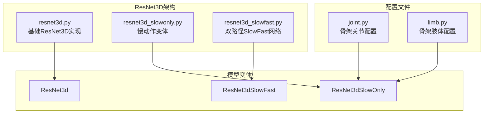
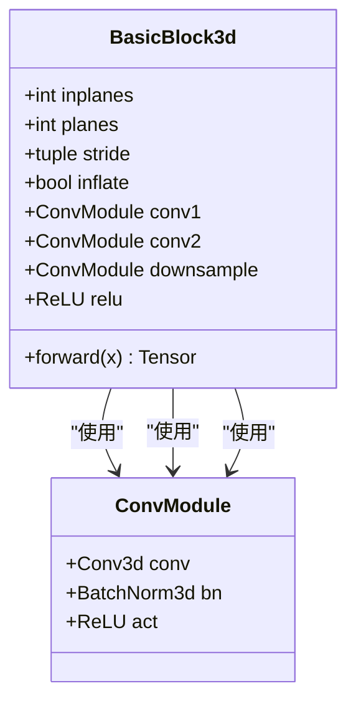
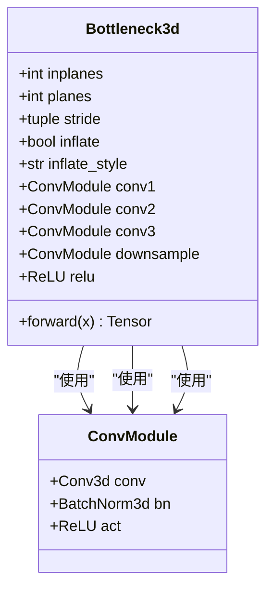
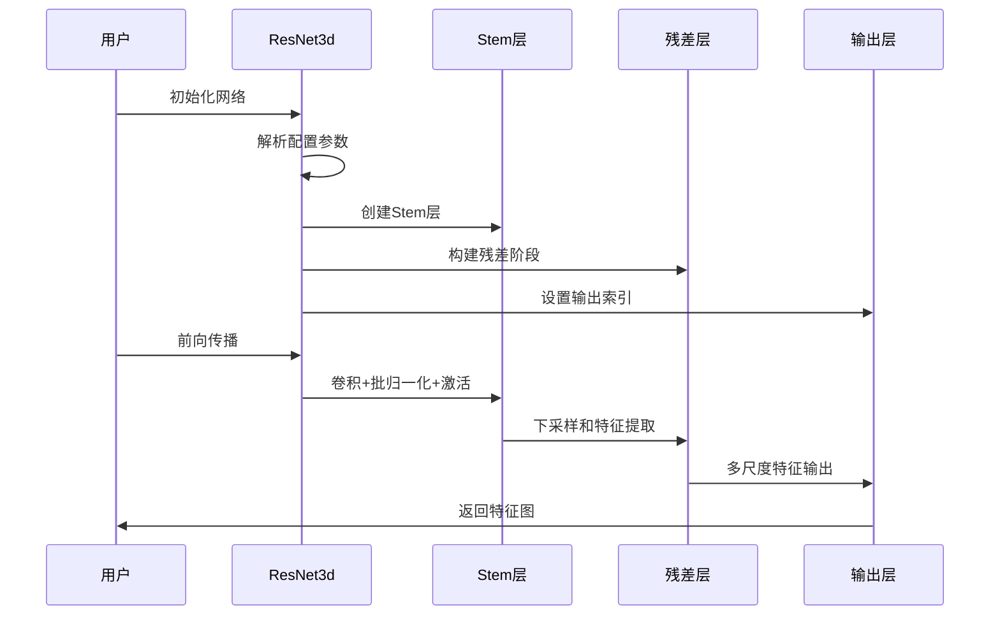
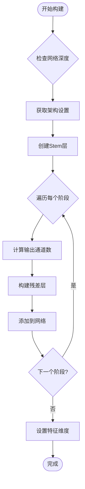
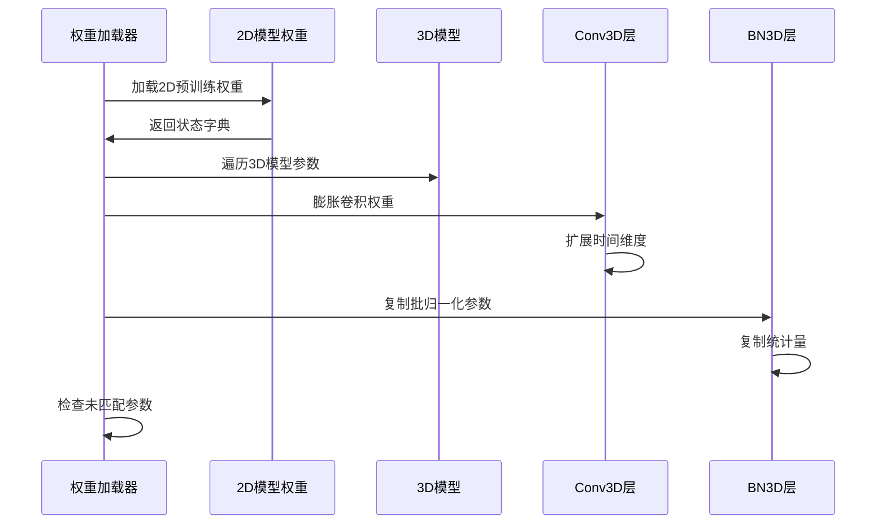
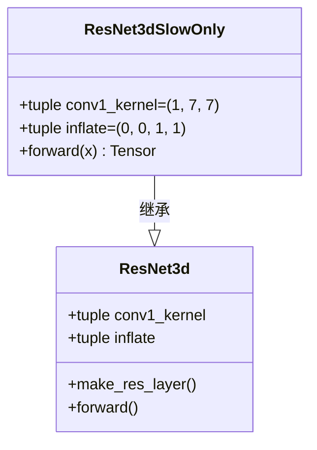
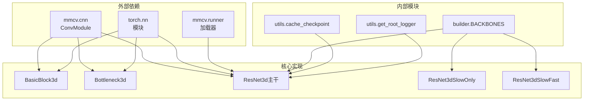

# ResNet3D基础架构

<cite>
**本文档引用的文件**
- [resnet3d.py](file://pyskl/models/cnns/resnet3d.py)
- [resnet3d_slowonly.py](file://pyskl/models/cnns/resnet3d_slowonly.py)
- [resnet3d_slowfast.py](file://pyskl/models/cnns/resnet3d_slowfast.py)
- [slowonly_r50_463_k400/joint.py](file://configs/posec3d/slowonly_r50_463_k400/joint.py)
- [slowonly_r50_463_k400/limb.py](file://configs/posec3d/slowonly_r50_463_k400/limb.py)
</cite>

## 目录
1. [简介](#简介)
2. [项目结构](#项目结构)
3. [核心组件](#核心组件)
4. [架构概览](#架构概览)
5. [详细组件分析](#详细组件分析)
6. [依赖关系分析](#依赖关系分析)
7. [性能考虑](#性能考虑)
8. [故障排除指南](#故障排除指南)
9. [结论](#结论)

## 简介

ResNet3D是PYSKL项目中的核心3D卷积神经网络架构，专门用于骨架动作识别任务。该架构基于经典的ResNet设计思想，通过引入时间维度的卷积操作来处理视频序列数据，实现了对时空信息的有效提取。

ResNet3D提供了多种变体，包括基础的ResNet3d、慢动作变体ResNet3dSlowOnly、以及双路径的SlowFast网络。这些变体针对不同的应用场景和计算需求进行了优化，支持从2D预训练模型进行权重迁移学习。

## 项目结构

ResNet3D相关的核心文件位于pyskl/models/cnns目录下，主要包含以下关键组件：



**图表来源**
- [resnet3d.py](file://pyskl/models/cnns/resnet3d.py#L1-L628)
- [resnet3d_slowonly.py](file://pyskl/models/cnns/resnet3d_slowonly.py#L1-L18)
- [resnet3d_slowfast.py](file://pyskl/models/cnns/resnet3d_slowfast.py#L1-L401)

**章节来源**
- [resnet3d.py](file://pyskl/models/cnns/resnet3d.py#L1-L628)
- [resnet3d_slowonly.py](file://pyskl/models/cnns/resnet3d_slowonly.py#L1-L18)
- [resnet3d_slowfast.py](file://pyskl/models/cnns/resnet3d_slowfast.py#L1-L401)

## 核心组件

ResNet3D架构由三个核心组件构成：基础模块、残差块类型和主干网络类。

### 基础模块类型

ResNet3D提供了两种基础模块类型，分别适用于不同的网络深度和计算需求：

1. **BasicBlock3d**: 适用于较浅的网络（18层和34层）
2. **Bottleneck3d**: 适用于较深的网络（50层、101层、152层）

### 模块膨胀策略

ResNet3D采用两种不同的卷积核膨胀策略来处理时间维度：

1. **3x1x1膨胀**: 在时间维度使用3x1x1卷积核
2. **3x3x3膨胀**: 在所有维度使用3x3x3卷积核

**章节来源**
- [resnet3d.py](file://pyskl/models/cnns/resnet3d.py#L13-L196)

## 架构概览

ResNet3D的整体架构遵循标准的ResNet设计模式，但在时间维度上进行了扩展：

```mermaid
graph TB
subgraph "输入层"
Input[视频序列输入<br/>N×C×T×H×W]
end
subgraph "Stem层"
Stem1[Conv3d<br/>kernel=(3,7,7)<br/>stride=(1,2,2)]
Stem2[BatchNorm3d]
Stem3[ReLU激活]
Pool[MaxPool3d<br/>kernel=(1,3,3)<br/>stride=(1,2,2)]
end
subgraph "残差阶段"
Stage1[Stage 1<br/>Layer1<br/>3个BasicBlock3d]
Stage2[Stage 2<br/>Layer2<br/>4个BasicBlock3d<br/>spatial_stride=2]
Stage3[Stage 3<br/>Layer3<br/>6个BasicBlock3d<br/>spatial_stride=2]
Stage4[Stage 4<br/>Layer4<br/>3个BasicBlock3d<br/>spatial_stride=2]
end
subgraph "输出层"
Output[特征图输出<br/>多尺度特征]
end
Input --> Stem1
Stem1 --> Stem2
Stem2 --> Stem3
Stem3 --> Pool
Pool --> Stage1
Stage1 --> Stage2
Stage2 --> Stage3
Stage3 --> Stage4
Stage4 --> Output
```

**图表来源**
- [resnet3d.py](file://pyskl/models/cnns/resnet3d.py#L200-L327)

### 网络配置参数详解

ResNet3D支持丰富的配置参数，以下是主要参数的详细说明：

| 参数名称 | 类型 | 默认值 | 描述 |
|---------|------|--------|------|
| depth | int | 50 | 网络深度，支持{18, 34, 50, 101, 152} |
| pretrained | str \| None | None | 预训练模型路径 |
| stage_blocks | tuple \| None | None | 每个阶段的残差块数量 |
| pretrained2d | bool | True | 是否加载2D预训练模型 |
| in_channels | int | 3 | 输入特征通道数 |
| base_channels | int | 64 | Stem输出特征通道数 |
| out_indices | tuple[int] | (3,) | 输出特征索引 |
| num_stages | int | 4 | ResNet阶段数 |
| spatial_strides | tuple[int] | (1, 2, 2, 2) | 每个阶段的空间步幅 |
| temporal_strides | tuple[int] | (1, 1, 1, 1) | 每个阶段的时间步幅 |
| conv1_kernel | tuple[int] | (3, 7, 7) | 第一个卷积层的核大小 |
| conv1_stride | tuple[int] | (1, 2) | 第一个卷积层的步幅 |
| pool1_stride | tuple[int] | (1, 2) | 第一个池化层的步幅 |
| advanced | bool | False | 是否使用高级下采样策略 |
| frozen_stages | int | -1 | 冻结的阶段数 |
| inflate | tuple[int] | (1, 1, 1, 1) | 每个阶段的膨胀策略 |
| inflate_style | str | '3x1x1' | 膨胀样式选择 |

**章节来源**
- [resnet3d.py](file://pyskl/models/cnns/resnet3d.py#L203-L229)

## 详细组件分析

### BasicBlock3d实现分析

BasicBlock3d是最简单的残差块实现，适用于浅层网络：



**图表来源**
- [resnet3d.py](file://pyskl/models/cnns/resnet3d.py#L13-L93)

#### 卷积核膨胀机制

BasicBlock3d支持两种膨胀策略：

1. **默认3x3x3膨胀**: 所有卷积都使用3x3x3核
2. **1x3x3非膨胀**: 时间维度使用1x3x3核

**章节来源**
- [resnet3d.py](file://pyskl/models/cnns/resnet3d.py#L28-L73)

### Bottleneck3d实现分析

Bottleneck3d是ResNet3D的核心模块，适用于深层网络：



**图表来源**
- [resnet3d.py](file://pyskl/models/cnns/resnet3d.py#L96-L196)

#### 膨胀样式对比

Bottleneck3d支持两种膨胀样式，区别如下：

| 特性 | 3x1x1样式 | 3x3x3样式 |
|------|-----------|-----------|
| conv1核大小 | (3, 1, 1) | 1 |
| conv2核大小 | (1, 3, 3) | 3 |
| conv1填充 | (1, 0, 0) | 0 |
| conv2填充 | (0, 1, 1) | 1 |
| 时间维度卷积 | 3x1x1 | 1x1x1 |

**章节来源**
- [resnet3d.py](file://pyskl/models/cnns/resnet3d.py#L113-L174)

### ResNet3d主干网络分析

ResNet3d类是整个架构的核心，负责构建完整的网络：



**图表来源**
- [resnet3d.py](file://pyskl/models/cnns/resnet3d.py#L199-L618)

#### 残差层构建流程



**图表来源**
- [resnet3d.py](file://pyskl/models/cnns/resnet3d.py#L306-L327)

**章节来源**
- [resnet3d.py](file://pyskl/models/cnns/resnet3d.py#L199-L327)

### 预训练权重迁移学习

ResNet3D支持从2D ImageNet预训练模型进行权重迁移学习：



**图表来源**
- [resnet3d.py](file://pyskl/models/cnns/resnet3d.py#L417-L525)

#### 膨胀策略实现

权重膨胀采用以下策略：

1. **卷积层膨胀**: 将2D权重扩展为3D权重，按时间维度平均分配
2. **批归一化适配**: 直接复制2D的BN参数到3D版本
3. **参数形状验证**: 确保膨胀后的参数形状兼容

**章节来源**
- [resnet3d.py](file://pyskl/models/cnns/resnet3d.py#L417-L468)

### 变体网络实现

#### ResNet3dSlowOnly

ResNet3dSlowOnly是ResNet3D的慢动作变体，专注于时间信息的充分提取：



**图表来源**
- [resnet3d_slowonly.py](file://pyskl/models/cnns/resnet3d_slowonly.py#L6-L17)

#### ResNet3dSlowFast

ResNet3dSlowFast采用双路径架构，结合慢路径和快路径的优势：

```mermaid
graph TB
subgraph "输入"
Input[视频输入]
end
subgraph "慢路径"
SlowConv[Conv1<br/>kernel=(1,7,7)]
SlowPool[MaxPool3d<br/>stride=(1,2,2)]
SlowLayers[残差层组]
end
subgraph "快路径"
FastConv[Conv1<br/>kernel=(5,7,7)]
FastPool[MaxPool3d<br/>stride=(1,2,2)]
FastLayers[残差层组]
end
subgraph "横向连接"
Lateral[Lateral连接]
end
subgraph "输出"
Output[双路径特征]
end
Input --> SlowConv
Input --> FastConv
SlowConv --> SlowPool
FastConv --> FastPool
SlowPool --> SlowLayers
FastPool --> FastLayers
FastLayers --> Lateral
Lateral --> SlowLayers
SlowLayers --> Output
FastLayers --> Output
```

**图表来源**
- [resnet3d_slowfast.py](file://pyskl/models/cnns/resnet3d_slowfast.py#L292-L400)

**章节来源**
- [resnet3d_slowonly.py](file://pyskl/models/cnns/resnet3d_slowonly.py#L1-L18)
- [resnet3d_slowfast.py](file://pyskl/models/cnns/resnet3d_slowfast.py#L1-L401)

## 依赖关系分析

ResNet3D架构的依赖关系体现了清晰的层次结构：



**图表来源**
- [resnet3d.py](file://pyskl/models/cnns/resnet3d.py#L1-L10)
- [resnet3d_slowfast.py](file://pyskl/models/cnns/resnet3d_slowfast.py#L1-L11)

**章节来源**
- [resnet3d.py](file://pyskl/models/cnns/resnet3d.py#L1-L10)
- [resnet3d_slowfast.py](file://pyskl/models/cnns/resnet3d_slowfast.py#L1-L11)

## 性能考虑

### 计算复杂度分析

ResNet3D的计算复杂度主要由以下因素决定：

1. **时间维度处理**: 3D卷积相比2D卷积增加了一个时间维度的计算
2. **膨胀策略影响**: 不同的膨胀策略会影响参数数量和计算量
3. **网络深度**: 更深的网络具有更高的计算复杂度但更好的特征表达能力

### 内存优化策略

1. **梯度检查点**: BasicBlock3d实现了前向传播的包装器以支持梯度检查点
2. **参数冻结**: 支持冻结特定阶段的参数以减少内存占用
3. **混合精度训练**: 支持半精度浮点数以降低内存使用

### 推理速度优化

1. **慢动作变体**: ResNet3dSlowOnly通过减少时间维度卷积来提高推理速度
2. **双路径架构**: ResNet3dSlowFast在保持精度的同时平衡速度和精度
3. **通道压缩**: 通过减少通道数量来降低计算负载

## 故障排除指南

### 常见问题及解决方案

#### 权重加载失败

**问题描述**: 预训练权重无法正确加载到3D模型中

**可能原因**:
1. 参数形状不匹配
2. 预训练模型格式不兼容
3. 膨胀过程中出现错误

**解决方案**:
1. 检查网络配置参数是否正确
2. 验证预训练权重文件完整性
3. 确认膨胀策略与预训练模型一致

#### 内存不足

**问题描述**: 训练或推理时出现内存不足错误

**解决方案**:
1. 减少batch size
2. 使用梯度检查点
3. 冻结部分网络层
4. 降低输入分辨率

#### 精度异常

**问题描述**: 模型精度低于预期

**解决方案**:
1. 检查数据预处理是否正确
2. 验证学习率调度策略
3. 确认正则化参数设置
4. 调整网络深度和宽度

**章节来源**
- [resnet3d.py](file://pyskl/models/cnns/resnet3d.py#L524-L595)

## 结论

ResNet3D基础架构为骨架动作识别任务提供了强大的3D卷积神经网络解决方案。其设计特点包括：

1. **灵活的膨胀策略**: 支持多种卷积核膨胀方式以适应不同场景需求
2. **多层次变体**: 提供基础、慢动作和双路径等多种网络变体
3. **高效的权重迁移**: 支持从2D ImageNet预训练模型进行有效的权重迁移
4. **模块化设计**: 清晰的组件分离便于理解和扩展

该架构在骨架动作识别领域展现了优秀的性能表现，为后续研究和应用开发奠定了坚实的基础。通过合理选择网络变体和配置参数，可以在精度、速度和资源消耗之间找到最佳平衡点。