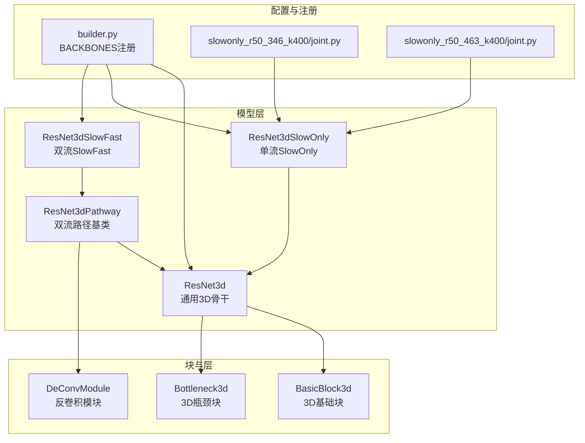
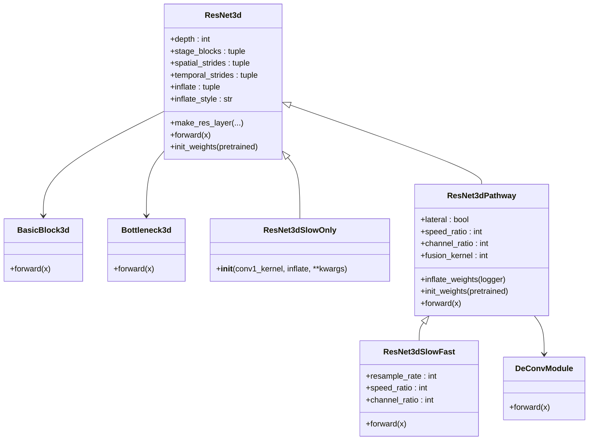
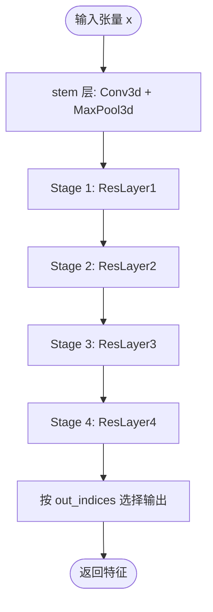
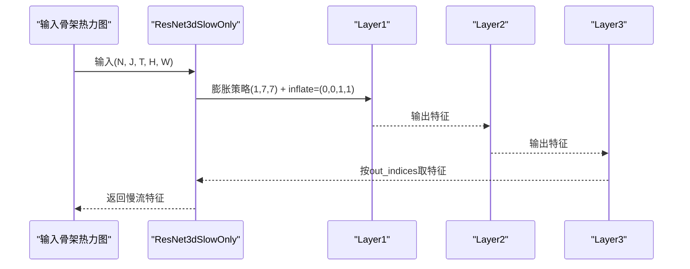
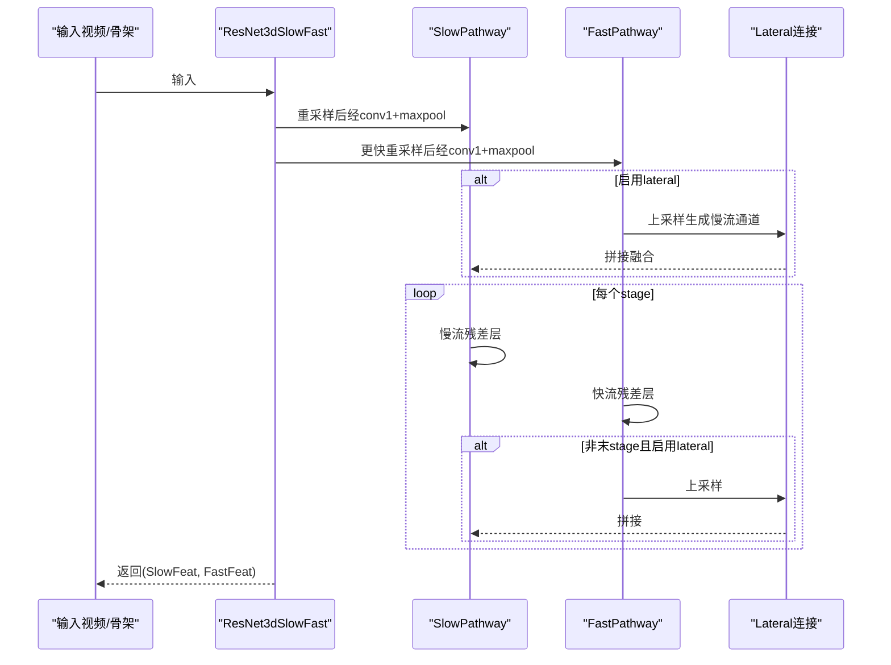
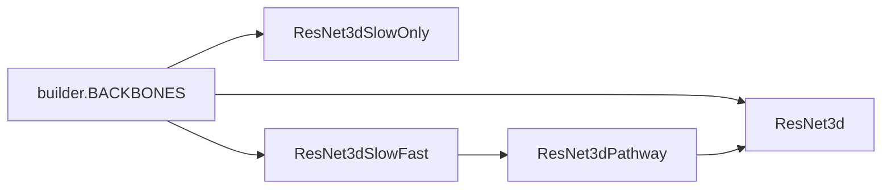

# ResNet3D系列网络

<cite>
**本文引用的文件列表**
- [resnet3d.py](file://pyskl/models/cnns/resnet3d.py)
- [resnet3d_slowonly.py](file://pyskl/models/cnns/resnet3d_slowonly.py)
- [resnet3d_slowfast.py](file://pyskl/models/cnns/resnet3d_slowfast.py)
- [resnet.py](file://pyskl/models/cnns/resnet.py)
- [builder.py](file://pyskl/models/builder.py)
- [README.md](file://README.md)
- [README_posec3d.md](file://configs/posec3d/README.md)
- [slowonly_r50_346_k400/joint.py](file://configs/posec3d/slowonly_r50_346_k400/joint.py)
- [slowonly_r50_463_k400/joint.py](file://configs/posec3d/slowonly_r50_463_k400/joint.py)
- [inference_speed.ipynb](file://examples/inference_speed.ipynb)
</cite>

## 目录
1. [简介](#简介)
2. [项目结构](#项目结构)
3. [核心组件](#核心组件)
4. [架构总览](#架构总览)
5. [详细组件分析](#详细组件分析)
6. [依赖关系分析](#依赖关系分析)
7. [性能与复杂度](#性能与复杂度)
8. [故障排查指南](#故障排查指南)
9. [结论](#结论)
10. [附录：配置与使用](#附录配置与使用)

## 简介
本技术文档聚焦于PySKL中的ResNet3D系列网络，系统梳理三类骨干网络：通用ResNet3D、单流SlowOnly以及双流SlowFast。文档从基础架构、3D残差块与时间维度残差连接机制入手，深入解析SlowOnly的单流设计及其在时间建模与计算效率上的权衡；随后阐述SlowFast的双流并行与跨流交互策略及特征融合方法。最后给出三者在参数规模、计算复杂度与识别精度方面的对比，并提供配置参数说明、预训练模型使用指南、在不同数据集上的性能基准、网络选择建议与实际应用案例。

## 项目结构
围绕ResNet3D系列网络的核心代码位于pyskl/models/cnns目录下，分别定义了通用3D残差块与骨干、SlowOnly单流变体、SlowFast双流变体。同时，配置样例位于configs/posec3d中，用于PoseC3D骨架动作识别任务。

图表来源
- [resnet3d.py](file://pyskl/models/cnns/resnet3d.py#L13-L196)
- [resnet3d_slowonly.py](file://pyskl/models/cnns/resnet3d_slowonly.py#L6-L17)
- [resnet3d_slowfast.py](file://pyskl/models/cnns/resnet3d_slowfast.py#L59-L400)
- [builder.py](file://pyskl/models/builder.py#L1-L39)
- [slowonly_r50_346_k400/joint.py](file://configs/posec3d/slowonly_r50_346_k400/joint.py#L1-L20)
- [slowonly_r50_463_k400/joint.py](file://configs/posec3d/slowonly_r50_463_k400/joint.py#L1-L20)

章节来源
- [resnet3d.py](file://pyskl/models/cnns/resnet3d.py#L1-L628)
- [resnet3d_slowonly.py](file://pyskl/models/cnns/resnet3d_slowonly.py#L1-L18)
- [resnet3d_slowfast.py](file://pyskl/models/cnns/resnet3d_slowfast.py#L1-L401)
- [builder.py](file://pyskl/models/builder.py#L1-L39)

## 核心组件
- 通用ResNet3D骨干（ResNet3d）
  - 支持多种深度（18/34/50/101/152），通过BasicBlock3d或Bottleneck3d构建残差堆叠。
  - 提供3D卷积的膨胀策略（inflate）与时间/空间步幅控制，支持预训练权重从2D迁移。
  - 支持冻结阶段、归一化评估模式等训练配置。
- 单流SlowOnly（ResNet3dSlowOnly）
  - 基于ResNet3d，通过conv1_kernel与inflate参数将时间维度膨胀限制在部分阶段，仅保留慢流的时间建模能力，显著降低计算开销。
- 双流SlowFast（ResNet3dSlowFast）
  - 由两个并行路径组成：慢流（slow_path）与快流（fast_path）。慢流关注时间建模与高分辨率特征，快流关注快速运动细节。
  - 慢流可启用横向连接（lateral），将快流特征上采样后与慢流融合，提升跨尺度时间建模能力。
  - 通过速度比（speed_ratio）与通道比（channel_ratio）控制两流的时序与通道差异。

章节来源
- [resnet3d.py](file://pyskl/models/cnns/resnet3d.py#L199-L628)
- [resnet3d_slowonly.py](file://pyskl/models/cnns/resnet3d_slowonly.py#L6-L17)
- [resnet3d_slowfast.py](file://pyskl/models/cnns/resnet3d_slowfast.py#L292-L400)

## 架构总览
下面的类图展示了ResNet3D系列的继承与组合关系，以及关键模块职责。

图表来源
- [resnet3d.py](file://pyskl/models/cnns/resnet3d.py#L13-L196)
- [resnet3d_slowonly.py](file://pyskl/models/cnns/resnet3d_slowonly.py#L6-L17)
- [resnet3d_slowfast.py](file://pyskl/models/cnns/resnet3d_slowfast.py#L59-L114)
- [resnet3d_slowfast.py](file://pyskl/models/cnns/resnet3d_slowfast.py#L14-L56)

## 详细组件分析

### 通用ResNet3D（ResNet3d）
- 3D残差块
  - BasicBlock3d：采用3×3×3或按inflate策略在时间维展开的卷积核，保持恒定的空间步幅，时间步幅由块级stride控制。
  - Bottleneck3d：支持两种膨胀策略（3x1x1与3x3x3），通过conv1与conv2的核尺寸与填充策略在时间与空间维度进行灵活膨胀。
- 骨干构建
  - 通过make_res_layer按stage_blocks配置堆叠残差块，支持advanced下采样策略（卷积+池化组合）。
  - 通过inflate与inflate_style控制每层是否膨胀，以及膨胀方式。
- 权重迁移与初始化
  - 支持从2D预训练权重迁移至3D，将2D卷积核沿时间轴平均扩展到3D卷积核。
  - 支持零初始化残差分支，便于优化稳定。
- 前向流程
  - 经过stem（conv+pool）后逐stage前向，按out_indices收集输出特征。

图表来源
- [resnet3d.py](file://pyskl/models/cnns/resnet3d.py#L597-L618)

章节来源
- [resnet3d.py](file://pyskl/models/cnns/resnet3d.py#L13-L196)
- [resnet3d.py](file://pyskl/models/cnns/resnet3d.py#L200-L628)

### SlowOnly单流设计
- 设计要点
  - 将首层卷积核设置为(1,7,7)，仅在时间维进行小步长卷积，其余层inflate仅在特定阶段开启，从而在保持时间建模的同时大幅减少时间维度的计算量。
  - 通过conv1_stride与pool1_stride控制初始时间/空间步幅，配合inflate策略形成“慢时间分辨率”的骨干。
- 时间维度残差连接
  - 在块内部，时间步幅与空间步幅分别由块级stride控制，保证时间信息在残差路径中得到保留与传递。
- 训练与推理
  - 与通用ResNet3d一致的初始化与冻结策略，适合大规模骨架动作识别任务。

图表来源
- [resnet3d_slowonly.py](file://pyskl/models/cnns/resnet3d_slowonly.py#L6-L17)
- [resnet3d.py](file://pyskl/models/cnns/resnet3d.py#L597-L618)

章节来源
- [resnet3d_slowonly.py](file://pyskl/models/cnns/resnet3d_slowonly.py#L1-L18)
- [resnet3d.py](file://pyskl/models/cnns/resnet3d.py#L199-L628)

### SlowFast双流架构
- 双流并行
  - 慢流（slow_path）：时间步幅较小，通道数较多，关注时间建模与高层语义。
  - 快流（fast_path）：时间步幅较大，通道数较少，关注快速运动细节。
- 跨流交互与特征融合
  - 慢流可启用lateral连接，将快流特征经反卷积或卷积上采样后与慢流拼接，增强跨尺度时间建模能力。
  - 在每个stage（除最后一层）结束后进行融合，形成多尺度时间特征。
- 关键参数
  - resample_rate：对输入帧进行重采样，控制快/慢流输入帧率差异。
  - speed_ratio：快慢流时间步幅比。
  - channel_ratio：快流通道数相对于慢流的压缩比例。
- 前向流程

图表来源
- [resnet3d_slowfast.py](file://pyskl/models/cnns/resnet3d_slowfast.py#L292-L400)
- [resnet3d_slowfast.py](file://pyskl/models/cnns/resnet3d_slowfast.py#L59-L146)

章节来源
- [resnet3d_slowfast.py](file://pyskl/models/cnns/resnet3d_slowfast.py#L1-L401)

## 依赖关系分析
- 注册机制
  - 所有骨干均通过BACKBONES注册表注册，统一由构建器按配置实例化。
- 继承与组合
  - ResNet3dSlowOnly直接继承ResNet3d，覆盖首层卷积核与膨胀策略。
  - ResNet3dSlowFast由两个ResNet3dPathway组成，Pathway进一步继承ResNet3d并扩展横向连接与权重迁移逻辑。
- 外部依赖
  - 使用mmcv的ConvModule、权重加载工具与日志记录接口。

图表来源
- [builder.py](file://pyskl/models/builder.py#L1-L39)
- [resnet3d_slowonly.py](file://pyskl/models/cnns/resnet3d_slowonly.py#L1-L18)
- [resnet3d_slowfast.py](file://pyskl/models/cnns/resnet3d_slowfast.py#L292-L400)

章节来源
- [builder.py](file://pyskl/models/builder.py#L1-L39)
- [resnet3d_slowonly.py](file://pyskl/models/cnns/resnet3d_slowonly.py#L1-L18)
- [resnet3d_slowfast.py](file://pyskl/models/cnns/resnet3d_slowfast.py#L1-L401)

## 性能与复杂度
- 参数规模与计算复杂度
  - 通用ResNet3D：随depth增大而线性增长；膨胀策略inflate会增加时间维卷积参数与计算量。
  - SlowOnly：通过限制时间膨胀与减小首层时间卷积核，显著降低参数与计算；适合大规模骨架动作识别。
  - SlowFast：双流并行带来约2倍的参数与计算开销，但通过lateral融合提升时间建模能力，适合对精度要求更高的场景。
- 识别精度（来自模型库基准）
  - Kinetics-400（HRNet 2D骨架，Joint Modality）：
    - SlowOnly-R50（stage_blocks=(3,4,6)）：Joint Top-1 ≈ 47.3%
    - SlowOnly-R50（stage_blocks=(4,6,3)）：Joint Top-1 ≈ 46.6%
  - NTURGB+D 120 XSub：SlowOnly-R50 Joint Top-1 ≈ 85.9%
  - NTURGB+D 120 XSet：SlowOnly-R50 Joint Top-1 ≈ 89.7%
  - FineGYM：SlowOnly-R50 Joint Top-1 ≈ 93.8%
- 推理速度（来自示例脚本）
  - PoseC3D（SlowOnly-R50配置）在典型输入下FPS约为2.86（batch=8，warmup=10，iters=10）。

章节来源
- [README_posec3d.md](file://configs/posec3d/README.md#L27-L42)
- [slowonly_r50_346_k400/joint.py](file://configs/posec3d/slowonly_r50_346_k400/joint.py#L1-L20)
- [slowonly_r50_463_k400/joint.py](file://configs/posec3d/slowonly_r50_463_k400/joint.py#L1-L20)
- [inference_speed.ipynb](file://examples/inference_speed.ipynb#L120-L174)

## 故障排查指南
- 预训练权重迁移失败
  - 现象：日志提示模块不存在或形状不匹配。
  - 处理：确认pretrained路径正确，检查2D与3D权重形状映射；必要时关闭pretrained2d或使用3D预训练权重直载。
- 形状不匹配导致的加载失败
  - 现象：某些参数未被加载或警告形状不兼容。
  - 处理：检查inflate策略与lateral连接导致的通道扩展，确保输入通道与膨胀策略一致。
- 冻结阶段无效
  - 现象：frozen_stages设置后仍可更新参数。
  - 处理：确认在train()调用后执行冻结逻辑，或在初始化后显式冻结相关模块。
- 双流融合异常
  - 现象：快流上采样后与慢流拼接通道不匹配。
  - 处理：检查channel_ratio与lateral_infl设置，确保上采样后的通道数与慢流期望一致。

章节来源
- [resnet3d.py](file://pyskl/models/cnns/resnet3d.py#L417-L525)
- [resnet3d_slowfast.py](file://pyskl/models/cnns/resnet3d_slowfast.py#L168-L255)
- [resnet3d_slowfast.py](file://pyskl/models/cnns/resnet3d_slowfast.py#L257-L276)

## 结论
- 通用ResNet3D提供了灵活的3D残差建模能力，支持多种膨胀策略与预训练迁移。
- SlowOnly通过单一流与受限时间膨胀，在保持良好时间建模能力的同时显著降低计算成本，适合大规模骨架动作识别。
- SlowFast通过双流并行与跨流融合，进一步提升时间建模能力，适合对精度要求更高的场景，但需承担更高的计算与内存开销。
- 在实际应用中，应根据数据集规模、硬件资源与精度目标选择合适的网络变体，并结合配置文件进行针对性调优。

## 附录：配置与使用

### 网络配置参数说明（关键字段）
- 通用ResNet3D（ResNet3d）
  - depth：网络深度（18/34/50/101/152）
  - stage_blocks：各stage的残差块数量
  - spatial_strides/temporal_strides：各stage的空间/时间步幅
  - inflate/inflate_style：每层是否膨胀及膨胀方式（3x1x1或3x3x3）
  - conv1_kernel/conv1_stride/pool1_stride：首层卷积核与步幅
  - pretrained/pretrained2d：预训练权重来源与迁移策略
  - out_indices/frozen_stages/norm_eval：输出索引、冻结阶段与BN评估模式
- SlowOnly（ResNet3dSlowOnly）
  - 在ResNet3d基础上覆盖conv1_kernel与inflate，通常设置inflate在部分阶段开启
- SlowFast（ResNet3dSlowFast）
  - slow_pathway/fast_pathway：慢/快流配置字典，含depth、lateral、conv1_kernel、inflate等
  - resample_rate/speed_ratio/channel_ratio：输入重采样率、快慢流速度比与通道比

章节来源
- [resnet3d.py](file://pyskl/models/cnns/resnet3d.py#L199-L292)
- [resnet3d_slowonly.py](file://pyskl/models/cnns/resnet3d_slowonly.py#L6-L17)
- [resnet3d_slowfast.py](file://pyskl/models/cnns/resnet3d_slowfast.py#L292-L341)

### 预训练模型使用指南
- 通用ResNet3D
  - 若pretrained2d=True，将自动从2D预训练权重迁移至3D；否则直接加载3D预训练权重。
  - 支持缓存远程权重与严格/非严格加载。
- SlowOnly/SlowFast
  - 可直接加载3D预训练权重；若未提供则分别初始化两流。
  - 注意：SlowFast的lateral连接部分不会从2D权重迁移，需单独初始化。

章节来源
- [resnet3d.py](file://pyskl/models/cnns/resnet3d.py#L524-L595)
- [resnet3d_slowfast.py](file://pyskl/models/cnns/resnet3d_slowfast.py#L343-L361)

### 在不同数据集上的性能基准
- Kinetics-400（HRNet 2D骨架，Joint Modality）
  - SlowOnly-R50（stage_blocks=(3,4,6)）：Joint Top-1 ≈ 47.3%
  - SlowOnly-R50（stage_blocks=(4,6,3)）：Joint Top-1 ≈ 46.6%
- NTURGB+D 120
  - XSub：Joint Top-1 ≈ 85.9%
  - XSet：Joint Top-1 ≈ 89.7%
- FineGYM：Joint Top-1 ≈ 93.8%

章节来源
- [README_posec3d.md](file://configs/posec3d/README.md#L27-L42)

### 网络选择建议
- 高精度优先：选择SlowFast，配合lateral融合与较大的resample_rate/speed_ratio。
- 实时性优先：选择SlowOnly，限制时间膨胀与首层卷积核，降低计算成本。
- 中等精度与效率平衡：选择通用ResNet3D，按数据集规模调整depth与inflate策略。

### 实际应用案例
- 姿态骨架动作识别（PoseC3D）
  - 使用HRNet 2D骨架作为输入，格式化为3D热力图体积，通过ResNet3D系列骨干提取时空特征，结合分类头进行动作分类。
  - 参考配置文件：slowonly_r50_346_k400/joint.py、slowonly_r50_463_k400/joint.py。

章节来源
- [README_posec3d.md](file://configs/posec3d/README.md#L1-L120)
- [slowonly_r50_346_k400/joint.py](file://configs/posec3d/slowonly_r50_346_k400/joint.py#L1-L110)
- [slowonly_r50_463_k400/joint.py](file://configs/posec3d/slowonly_r50_463_k400/joint.py#L1-L110)