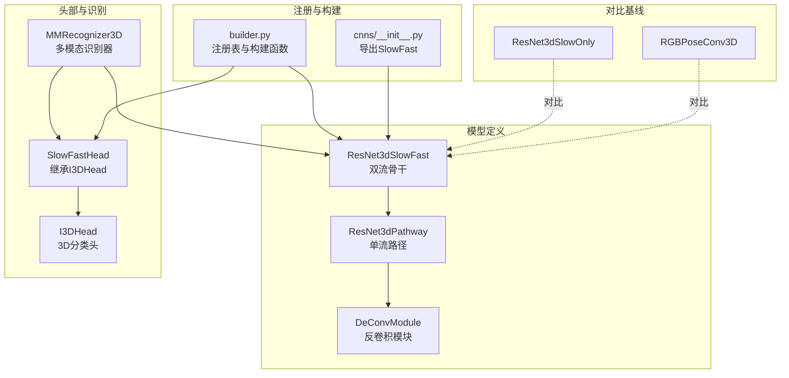
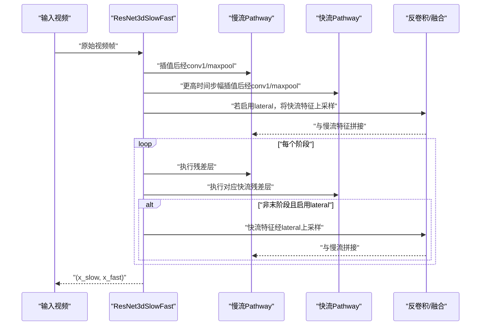
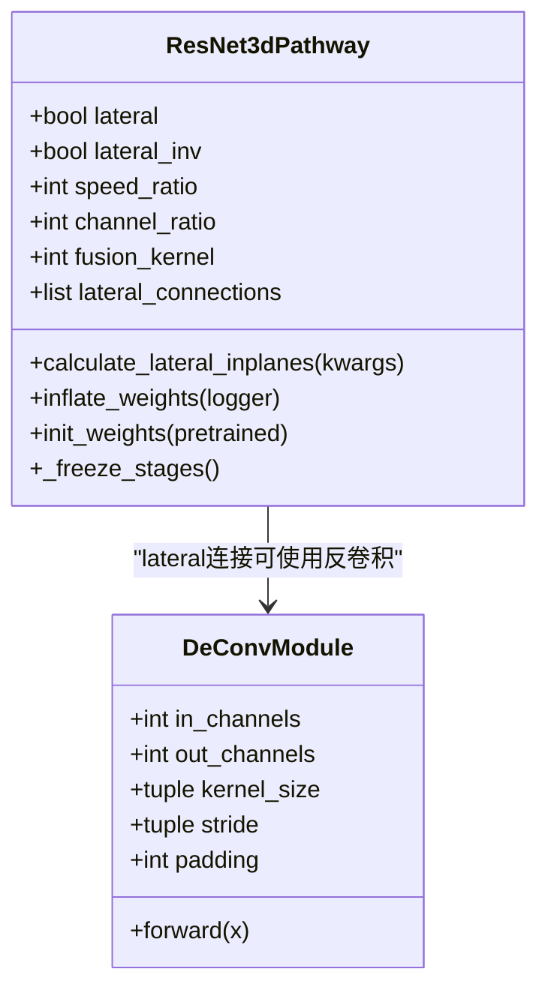
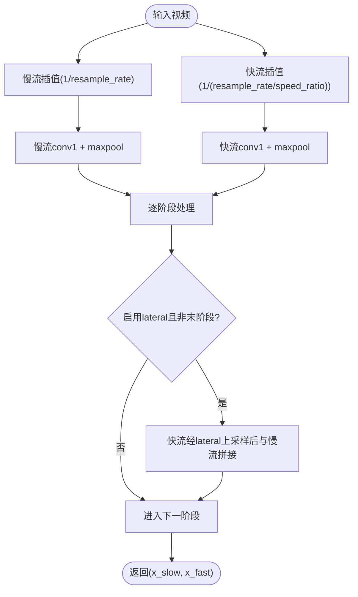
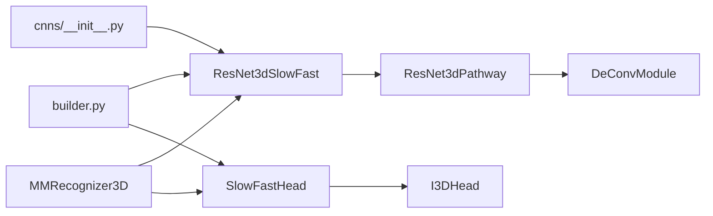

# SlowFast双流网络

<cite>
**本文引用的文件**
- [pyskl/models/cnns/resnet3d_slowfast.py](file://pyskl/models/cnns/resnet3d_slowfast.py)
- [pyskl/models/cnns/__init__.py](file://pyskl/models/cnns/__init__.py)
- [pyskl/models/builder.py](file://pyskl/models/builder.py)
- [pyskl/models/heads/simple_head.py](file://pyskl/models/heads/simple_head.py)
- [pyskl/models/recognizers/mm_recognizer3d.py](file://pyskl/models/recognizers/mm_recognizer3d.py)
- [pyskl/models/cnns/rgbposeconv3d.py](file://pyskl/models/cnns/rgbposeconv3d.py)
- [pyskl/models/cnns/resnet3d_slowonly.py](file://pyskl/models/cnns/resnet3d_slowonly.py)
- [configs/posec3d/slowonly_r50_346_k400/joint.py](file://configs/posec3d/slowonly_r50_346_k400/joint.py)
</cite>

## 目录
1. [引言](#引言)
2. [项目结构](#项目结构)
3. [核心组件](#核心组件)
4. [架构总览](#架构总览)
5. [详细组件分析](#详细组件分析)
6. [依赖关系分析](#依赖关系分析)
7. [性能考量](#性能考量)
8. [故障排查指南](#故障排查指南)
9. [结论](#结论)
10. [附录](#附录)

## 引言
本技术文档围绕SlowFast双流网络展开，系统阐述其双流架构设计、跨流交互策略、时间分辨率处理机制、参数共享与权重迁移、计算负载分配与内存优化，并结合配置参数与训练策略给出在复杂动作识别任务中的实践建议。文档面向具有一定深度学习背景但不熟悉SlowFast实现细节的读者，力求以循序渐进的方式呈现。

## 项目结构
本仓库中与SlowFast相关的核心代码集中在以下模块：
- 双流骨干网络：ResNet3dSlowFast及其子路径ResNet3dPathway
- 头部与识别框架：I3DHead、SlowFastHead、MMRecognizer3D
- 模型注册与构建：builder.py、cnns/__init__.py
- 其他对比基线：ResNet3dSlowOnly、RGBPoseConv3D
- 配置示例：slowonly_r50_346_k400等

图表来源
- [pyskl/models/cnns/resnet3d_slowfast.py](file://pyskl/models/cnns/resnet3d_slowfast.py#L292-L400)
- [pyskl/models/heads/simple_head.py](file://pyskl/models/heads/simple_head.py#L98-L118)
- [pyskl/models/recognizers/mm_recognizer3d.py](file://pyskl/models/recognizers/mm_recognizer3d.py#L5-L62)
- [pyskl/models/builder.py](file://pyskl/models/builder.py#L12-L39)
- [pyskl/models/cnns/__init__.py](file://pyskl/models/cnns/__init__.py#L5-L11)
- [pyskl/models/cnns/resnet3d_slowonly.py](file://pyskl/models/cnns/resnet3d_slowonly.py#L6-L18)
- [pyskl/models/cnns/rgbposeconv3d.py](file://pyskl/models/cnns/rgbposeconv3d.py#L12-L35)

章节来源
- [pyskl/models/cnns/resnet3d_slowfast.py](file://pyskl/models/cnns/resnet3d_slowfast.py#L292-L400)
- [pyskl/models/heads/simple_head.py](file://pyskl/models/heads/simple_head.py#L98-L118)
- [pyskl/models/recognizers/mm_recognizer3d.py](file://pyskl/models/recognizers/mm_recognizer3d.py#L5-L62)
- [pyskl/models/builder.py](file://pyskl/models/builder.py#L12-L39)
- [pyskl/models/cnns/__init__.py](file://pyskl/models/cnns/__init__.py#L5-L11)
- [pyskl/models/cnns/resnet3d_slowonly.py](file://pyskl/models/cnns/resnet3d_slowonly.py#L6-L18)
- [pyskl/models/cnns/rgbposeconv3d.py](file://pyskl/models/cnns/rgbposeconv3d.py#L12-L35)

## 核心组件
- ResNet3dSlowFast：双流骨干，包含慢流（slow pathway）与快流（fast pathway），二者并行处理，通过跨流连接进行特征融合。
- ResNet3dPathway：基于ResNet3d的单流实现，支持横向连接（lateral connections）、通道缩放、时间步加速等特性。
- DeConvModule：反卷积模块，用于将快流特征上采样到慢流的时间分辨率，实现跨流信息对齐。
- I3DHead/SlowFastHead：3D分类头，SlowFastHead继承自I3DHead，作为双流输出的最终分类层。
- MMRecognizer3D：多模态识别器，接收RGB与热图输入，调用双流骨干提取特征并送入分类头。

章节来源
- [pyskl/models/cnns/resnet3d_slowfast.py](file://pyskl/models/cnns/resnet3d_slowfast.py#L292-L400)
- [pyskl/models/heads/simple_head.py](file://pyskl/models/heads/simple_head.py#L98-L118)
- [pyskl/models/recognizers/mm_recognizer3d.py](file://pyskl/models/recognizers/mm_recognizer3d.py#L5-L62)

## 架构总览
SlowFast通过两个并行的ResNet3d路径实现双流架构：
- 慢流（slow pathway）：高时间分辨率、较低通道数，擅长捕捉长期时序模式与全局运动。
- 快流（fast pathway）：低时间分辨率、较高通道数，擅长捕捉高频细节与时敏变化。
两流在多个阶段通过横向连接进行跨流特征融合，使慢流获得快流的空间细节，快流获得慢流的时序稳定性。

图表来源
- [pyskl/models/cnns/resnet3d_slowfast.py](file://pyskl/models/cnns/resnet3d_slowfast.py#L363-L400)

章节来源
- [pyskl/models/cnns/resnet3d_slowfast.py](file://pyskl/models/cnns/resnet3d_slowfast.py#L363-L400)

## 详细组件分析

### ResNet3dPathway 组件分析
- 关键职责
  - 实现单流ResNet3d变体，支持横向连接（lateral connections）以与另一路进行跨流融合。
  - 支持通道缩放（channel_ratio）与时间步加速（speed_ratio）以匹配双流的分辨率差异。
  - 提供2D到3D权重膨胀（inflate_weights），兼容预训练2D模型。
- 参数要点
  - lateral/lateral_inv：是否启用横向连接及方向（正向/反向）。
  - speed_ratio：快慢流时间步长之比（α）。
  - channel_ratio：快流通道数相对慢流的缩放（β）。
  - fusion_kernel：横向连接的融合核大小。
  - lateral_infl/lateral_activate：横向连接的上采样倍率与激活开关。
- 权重初始化与冻结
  - lateral连接模块独立初始化，其余沿用ResNet3d默认流程。
  - 支持冻结前若干阶段参数，便于微调或迁移学习。

图表来源
- [pyskl/models/cnns/resnet3d_slowfast.py](file://pyskl/models/cnns/resnet3d_slowfast.py#L59-L166)
- [pyskl/models/cnns/resnet3d_slowfast.py](file://pyskl/models/cnns/resnet3d_slowfast.py#L14-L56)

章节来源
- [pyskl/models/cnns/resnet3d_slowfast.py](file://pyskl/models/cnns/resnet3d_slowfast.py#L59-L166)
- [pyskl/models/cnns/resnet3d_slowfast.py](file://pyskl/models/cnns/resnet3d_slowfast.py#L14-L56)

### ResNet3dSlowFast 组件分析
- 双流并行处理
  - 输入先按时间维度进行插值（resample_rate控制整体时间步幅；快流再按速度比进一步加速）。
  - 慢流与快流分别经过各自的conv1与maxpool，随后进入相同数量的残差阶段。
- 跨流交互
  - 在每个阶段（除末阶段）根据横向连接将快流特征上采样并与慢流拼接。
  - 首阶段还可将快流特征映射到慢流通道空间后拼接，增强早期融合。
- 初始化策略
  - 支持从3D检查点直接加载，或分别初始化快慢流。
  - 若提供2D预训练权重，将通过inflate_weights进行2D→3D膨胀。

图表来源
- [pyskl/models/cnns/resnet3d_slowfast.py](file://pyskl/models/cnns/resnet3d_slowfast.py#L363-L400)

章节来源
- [pyskl/models/cnns/resnet3d_slowfast.py](file://pyskl/models/cnns/resnet3d_slowfast.py#L315-L342)
- [pyskl/models/cnns/resnet3d_slowfast.py](file://pyskl/models/cnns/resnet3d_slowfast.py#L363-L400)

### I3DHead 与 SlowFastHead
- I3DHead：通用3D分类头，负责池化与全连接分类。
- SlowFastHead：继承I3DHead，作为双流骨干输出的分类头，通常在识别器中直接使用。

章节来源
- [pyskl/models/heads/simple_head.py](file://pyskl/models/heads/simple_head.py#L98-L118)

### MMRecognizer3D 与多模态集成
- 多模态识别器支持同时输入RGB与热图，调用backbone得到双流特征，再送入分类头生成多路（如rgb、pose、both）分类结果。
- 在训练与测试流程中，对输入进行reshape与平均聚合，确保多片段推理的一致性。

章节来源
- [pyskl/models/recognizers/mm_recognizer3d.py](file://pyskl/models/recognizers/mm_recognizer3d.py#L5-L62)

## 依赖关系分析
- 注册与构建
  - builder.py提供统一的注册表（BACKBONES/HEADS/RECOGNIZERS），通过build_*函数按类型构建对象。
  - cnns/__init__.py导出ResNet3dSlowFast等骨干，供配置文件引用。
- 模块耦合
  - ResNet3dSlowFast依赖ResNet3dPathway与DeConvModule；头部依赖I3DHead；识别器依赖两者与头部。
- 外部依赖
  - 使用mmcv的ConvModule、kaiming_init、load_checkpoint等工具，保证与OpenMMLab生态一致。

图表来源
- [pyskl/models/builder.py](file://pyskl/models/builder.py#L12-L39)
- [pyskl/models/cnns/__init__.py](file://pyskl/models/cnns/__init__.py#L5-L11)
- [pyskl/models/cnns/resnet3d_slowfast.py](file://pyskl/models/cnns/resnet3d_slowfast.py#L292-L400)
- [pyskl/models/heads/simple_head.py](file://pyskl/models/heads/simple_head.py#L98-L118)
- [pyskl/models/recognizers/mm_recognizer3d.py](file://pyskl/models/recognizers/mm_recognizer3d.py#L5-L62)

章节来源
- [pyskl/models/builder.py](file://pyskl/models/builder.py#L12-L39)
- [pyskl/models/cnns/__init__.py](file://pyskl/models/cnns/__init__.py#L5-L11)
- [pyskl/models/cnns/resnet3d_slowfast.py](file://pyskl/models/cnns/resnet3d_slowfast.py#L292-L400)
- [pyskl/models/heads/simple_head.py](file://pyskl/models/heads/simple_head.py#L98-L118)
- [pyskl/models/recognizers/mm_recognizer3d.py](file://pyskl/models/recognizers/mm_recognizer3d.py#L5-L62)

## 性能考量
- 时间分辨率与计算负载
  - 快流通过更高的时间步幅（由resample_rate与speed_ratio共同决定）降低时间维度计算量，适合捕捉高频细节。
  - 慢流保持较高时间分辨率，利于长期时序建模，但计算成本更高。
- 通道与内存优化
  - channel_ratio将快流通道数缩小，显著降低快流参数与显存占用；慢流保留更多通道以维持表达能力。
  - lateral连接仅在中间阶段进行，避免在末阶段重复融合带来的额外开销。
- 权重初始化与迁移
  - 通过inflate_weights将2D预训练权重膨胀至3D，减少从零训练所需资源；lateral部分不参与膨胀，避免形状不匹配。
  - _freeze_stages可冻结浅层参数，进一步节省显存与加速收敛。
- 训练策略
  - 建议采用余弦退火学习率策略，配合梯度裁剪，提升训练稳定性。
  - 数据增强（随机裁剪、翻转、时间均匀采样）有助于提升泛化能力。

章节来源
- [pyskl/models/cnns/resnet3d_slowfast.py](file://pyskl/models/cnns/resnet3d_slowfast.py#L168-L277)
- [pyskl/models/cnns/resnet3d_slowfast.py](file://pyskl/models/cnns/resnet3d_slowfast.py#L257-L277)
- [configs/posec3d/slowonly_r50_346_k400/joint.py](file://configs/posec3d/slowonly_r50_346_k400/joint.py#L100-L107)

## 故障排查指南
- 形状不匹配与膨胀失败
  - 症状：2D→3D膨胀时报错或警告。
  - 排查：确认lateral连接导致的输入通道扩展与目标形状一致；检查inflate_weights中对lateral模块的跳过逻辑。
- 横向连接未生效
  - 症状：融合后通道数不变或无特征融合迹象。
  - 排查：确认lateral与lateral_activate配置正确；检查forward中是否在非末阶段执行了lateral上采样与拼接。
- 冻结层参数仍可更新
  - 症状：冻结浅层阶段后参数仍在更新。
  - 排查：确认_frozen_stages索引范围与lateral连接冻结逻辑一致。
- 预训练权重加载异常
  - 症状：加载检查点时报错或参数未完全加载。
  - 排查：确认pretrained路径有效；检查state_dict键名映射（ConvModule→conv/bn）与inflate_weights流程。

章节来源
- [pyskl/models/cnns/resnet3d_slowfast.py](file://pyskl/models/cnns/resnet3d_slowfast.py#L185-L214)
- [pyskl/models/cnns/resnet3d_slowfast.py](file://pyskl/models/cnns/resnet3d_slowfast.py#L257-L277)
- [pyskl/models/cnns/resnet3d_slowfast.py](file://pyskl/models/cnns/resnet3d_slowfast.py#L382-L396)

## 结论
SlowFast双流网络通过慢流与快流的并行处理与跨流融合，在复杂动作识别任务中实现了“时序稳定+空间细节”的互补。合理的参数共享、通道缩放与时间步幅设计，使其在计算与内存上具备良好平衡。结合迁移学习与稳健的训练策略，可在多种数据集上取得优异性能。建议在实际部署中根据硬件条件调整resample_rate、speed_ratio与channel_ratio，并结合冻结策略与梯度裁剪以获得更稳定的训练过程。

## 附录

### 配置参数详解（关键字段）
- ResNet3dSlowFast
  - pretrained：预训练模型路径（支持3D检查点或None）。
  - resample_rate：输入帧的时间步幅系数（整体降采样）。
  - speed_ratio：快慢流时间步幅之比（α）。
  - channel_ratio：快流通道数相对慢流的缩放（β）。
  - slow_pathway/fast_pathway：分别传入ResNet3dPathway的配置字典。
- ResNet3dPathway
  - lateral/lateral_inv：是否启用横向连接及方向。
  - speed_ratio/channel_ratio/fusion_kernel：与骨干一致的跨流参数。
  - lateral_infl/lateral_activate：横向连接的上采样倍率与阶段激活开关。
- I3DHead/SlowFastHead
  - num_classes/in_channels/dropout/init_std：分类头超参。
- MMRecognizer3D
  - 与双流骨干与头部组合使用，支持多模态输入与多路分类输出。

章节来源
- [pyskl/models/cnns/resnet3d_slowfast.py](file://pyskl/models/cnns/resnet3d_slowfast.py#L299-L329)
- [pyskl/models/heads/simple_head.py](file://pyskl/models/heads/simple_head.py#L98-L118)
- [pyskl/models/recognizers/mm_recognizer3d.py](file://pyskl/models/recognizers/mm_recognizer3d.py#L5-L62)

### 训练策略与数据管线参考
- 学习率与优化器：SGD + 余弦退火，梯度裁剪（最大范数与范数类型）。
- 采样与增强：均匀时间采样、随机裁剪、翻转、热图格式化与收集。
- 训练周期与日志：总epoch、评估间隔、日志钩子等。

章节来源
- [configs/posec3d/slowonly_r50_346_k400/joint.py](file://configs/posec3d/slowonly_r50_346_k400/joint.py#L67-L109)