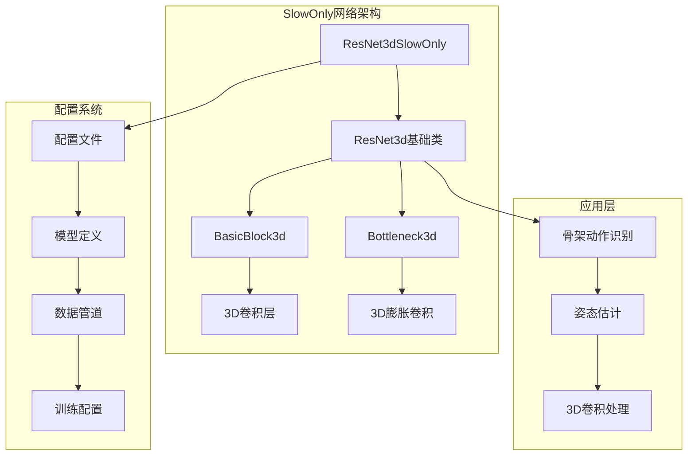
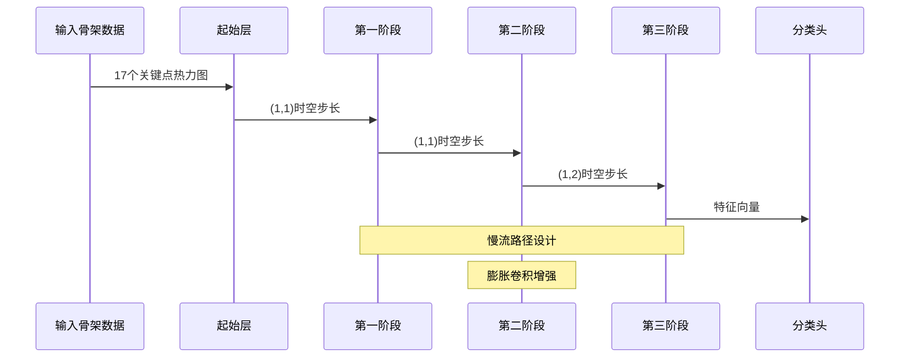
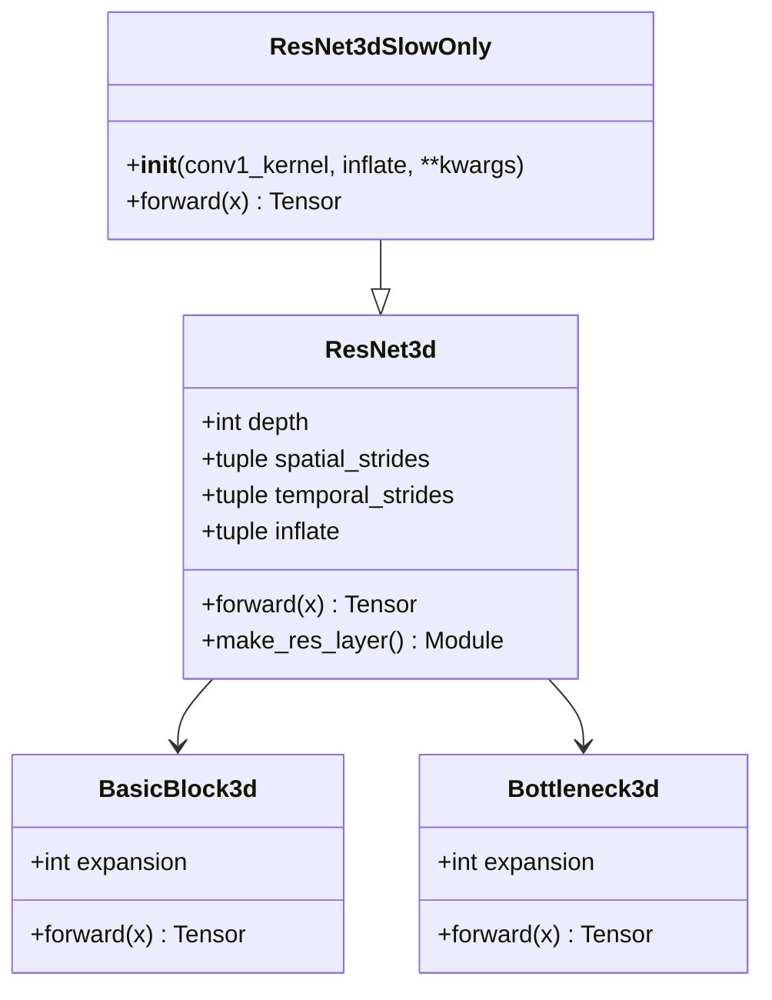
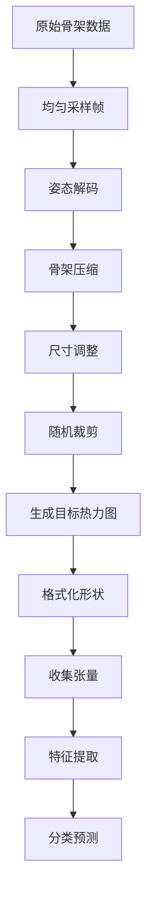
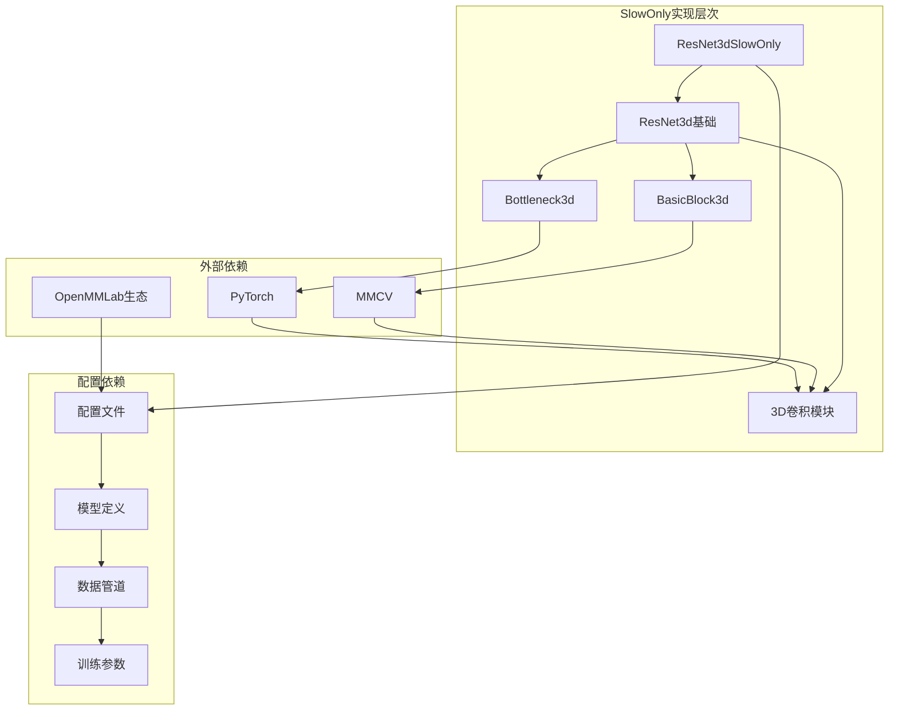
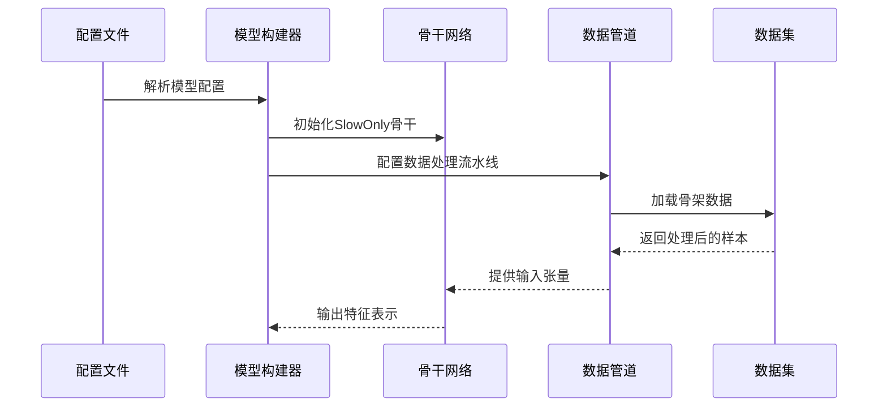
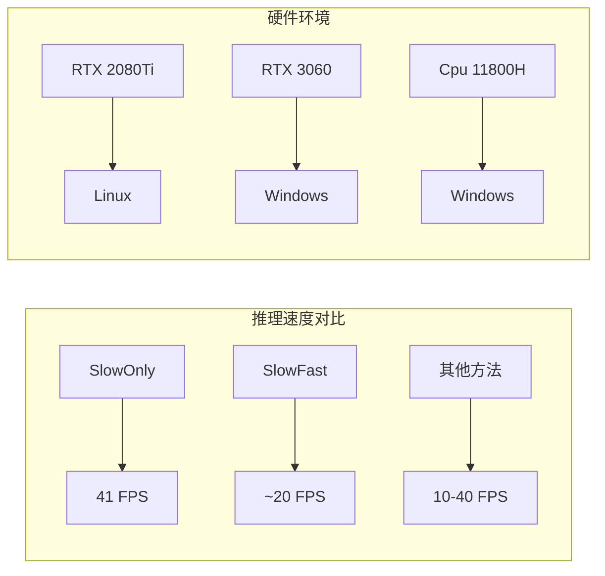

# SlowOnly单流网络

<cite>
**本文档引用的文件**
- [resnet3d_slowonly.py](file://pyskl/models/cnns/resnet3d_slowonly.py)
- [resnet3d.py](file://pyskl/models/cnns/resnet3d.py)
- [resnet3d_slowfast.py](file://pyskl/models/cnns/resnet3d_slowfast.py)
- [slowonly_r50_346_k400/joint.py](file://configs/posec3d/slowonly_r50_346_k400/joint.py)
- [slowonly_r50_463_k400/joint.py](file://configs/posec3d/slowonly_r50_463_k400/joint.py)
- [slowonly_r50_gym/joint.py](file://configs/posec3d/slowonly_r50_gym/joint.py)
- [slowonly_r50_hmdb51_k400p/s1_joint.py](file://configs/posec3d/slowonly_r50_hmdb51_k400p/s1_joint.py)
- [slowonly_r50_ntu60_xsub/joint.py](file://configs/posec3d/slowonly_r50_ntu60_xsub/joint.py)
- [README.md](file://configs/posec3d/README.md)
- [inference_speed.ipynb](file://examples/inference_speed.ipynb)
- [sampling.py](file://pyskl/datasets/pipelines/sampling.py)
</cite>

## 目录
1. [简介](#简介)
2. [项目结构](#项目结构)
3. [核心组件](#核心组件)
4. [架构概览](#架构概览)
5. [详细组件分析](#详细组件分析)
6. [依赖关系分析](#依赖关系分析)
7. [性能考量](#性能考量)
8. [故障排除指南](#故障排除指南)
9. [结论](#结论)
10. [附录](#附录)

## 简介
SlowOnly单流网络是基于3D残差网络的时间建模架构，专为骨架动作识别任务设计。该网络采用单一流设计，通过精心设计的慢流路径实现高效的时间信息建模，在保持高精度的同时显著降低计算开销。

SlowOnly网络的核心创新在于其慢流（slow pathway）设计，通过在深层阶段引入膨胀卷积（inflate）和特定的时空步长配置，有效平衡了时间分辨率和空间分辨率之间的关系。这种设计使得网络能够在较低的时间分辨率下捕获长期时序依赖关系，同时保持足够的空间细节。

## 项目结构
该项目采用模块化架构，SlowOnly网络作为骨干网络集成在整体框架中：

**图表来源**
- [resnet3d_slowonly.py](file://pyskl/models/cnns/resnet3d_slowonly.py#L1-L18)
- [resnet3d.py](file://pyskl/models/cnns/resnet3d.py#L200-L400)

**章节来源**
- [resnet3d_slowonly.py](file://pyskl/models/cnns/resnet3d_slowonly.py#L1-L18)
- [resnet3d.py](file://pyskl/models/cnns/resnet3d.py#L1-L200)

## 核心组件
SlowOnly网络由以下核心组件构成：

### 1. 基础骨干网络
- **ResNet3dSlowOnly类**：继承自ResNet3d，专门针对单流设计
- **ResNet3d基础类**：提供完整的3D残差网络实现
- **BasicBlock3d和Bottleneck3d**：定义3D残差块的基本单元

### 2. 时间建模机制
- **膨胀卷积（Inflate）**：在深层阶段增加时间维度的卷积核
- **时空步长配置**：精确控制时间分辨率和空间分辨率的平衡
- **慢流路径设计**：通过特定的步长序列实现渐进式时间抽象

### 3. 骨架数据处理
- **姿态热力图生成**：将2D关键点转换为3D热力图体积
- **多模态输入支持**：支持关键点和肢体信息的联合建模
- **数据标准化**：统一的骨架数据预处理流程

**章节来源**
- [resnet3d_slowonly.py](file://pyskl/models/cnns/resnet3d_slowonly.py#L6-L17)
- [resnet3d.py](file://pyskl/models/cnns/resnet3d.py#L13-L196)

## 架构概览
SlowOnly网络采用单一流设计，通过精心配置的参数实现高效的时间建模：

**图表来源**
- [resnet3d_slowonly.py](file://pyskl/models/cnns/resnet3d_slowonly.py#L16-L17)
- [slowonly_r50_346_k400/joint.py](file://configs/posec3d/slowonly_r50_346_k400/joint.py#L12-L14)

## 详细组件分析

### SlowOnly骨干网络实现
SlowOnly网络通过继承ResNet3d并重置关键参数来实现单流设计：

**图表来源**
- [resnet3d_slowonly.py](file://pyskl/models/cnns/resnet3d_slowonly.py#L6-L17)
- [resnet3d.py](file://pyskl/models/cnns/resnet3d.py#L200-L400)

### 时间建模策略详解
SlowOnly网络采用渐进式时间抽象策略：

| 阶段 | 时空步长 | 膨胀配置 | 时间分辨率 | 空间分辨率 |
|------|----------|----------|------------|------------|
| 第1阶段 | (1,1) | (0,0,1,1) | 高 | 中等 |
| 第2阶段 | (1,1) | (0,1,1) | 中等 | 低 |
| 第3阶段 | (1,2) | (1,1) | 低 | 低 |

这种设计确保了：
- **早期阶段**：保持高时间分辨率以捕获快速动作变化
- **中期阶段**：通过膨胀卷积增强时间感受野
- **晚期阶段**：进一步降低时间分辨率以提取长期依赖

**章节来源**
- [resnet3d_slowonly.py](file://pyskl/models/cnns/resnet3d_slowonly.py#L10-L13)
- [slowonly_r50_346_k400/joint.py](file://configs/posec3d/slowonly_r50_346_k400/joint.py#L12-L14)

### 骨架数据处理流程
SlowOnly网络的数据处理遵循统一的流水线：

**图表来源**
- [slowonly_r50_346_k400/joint.py](file://configs/posec3d/slowonly_r50_346_k400/joint.py#L31-L44)

**章节来源**
- [slowonly_r50_346_k400/joint.py](file://configs/posec3d/slowonly_r50_346_k400/joint.py#L31-L66)

### 网络配置参数详解

#### 基础配置参数
| 参数名 | 默认值 | 说明 |
|--------|--------|------|
| `in_channels` | 17 | 关键点数量（NTU RGB+D标准） |
| `base_channels` | 32 | 基础通道数 |
| `num_stages` | 3 | 网络阶段数 |
| `stage_blocks` | (3,4,6)或(4,6,3) | 各阶段残差块数量 |
| `out_indices` | (2,) | 输出特征索引 |

#### 时间建模参数
| 参数名 | 配置1 | 配置2 | 说明 |
|--------|-------|-------|------|
| `inflate` | (0,1,1) | (0,1,1) | 膨胀配置 |
| `spatial_strides` | (2,2,2) | (2,2,2) | 空间步长 |
| `temporal_strides` | (1,1,2) | (1,1,2) | 时间步长 |

**章节来源**
- [slowonly_r50_346_k400/joint.py](file://configs/posec3d/slowonly_r50_346_k400/joint.py#L1-L20)
- [slowonly_r50_463_k400/joint.py](file://configs/posec3d/slowonly_r50_463_k400/joint.py#L1-L20)

## 依赖关系分析

### 网络架构依赖

**图表来源**
- [resnet3d_slowonly.py](file://pyskl/models/cnns/resnet3d_slowonly.py#L1-L3)
- [resnet3d.py](file://pyskl/models/cnns/resnet3d.py#L1-L10)

### 数据流依赖关系
SlowOnly网络的数据流遵循严格的依赖关系：

**图表来源**
- [slowonly_r50_346_k400/joint.py](file://configs/posec3d/slowonly_r50_346_k400/joint.py#L1-L20)

**章节来源**
- [resnet3d_slowonly.py](file://pyskl/models/cnns/resnet3d_slowonly.py#L1-L18)
- [resnet3d.py](file://pyskl/models/cnns/resnet3d.py#L527-L628)

## 性能考量

### 计算效率分析
SlowOnly网络相比SlowFast网络具有显著的计算优势：

| 维度 | SlowOnly | SlowFast | 性能提升 |
|------|----------|----------|----------|
| 参数量 | 单一流 | 双流 | ~50% |
| 计算复杂度 | 单一流 | 双流 | ~50% |
| 内存占用 | 较低 | 较高 | ~50% |
| 推理速度 | 快速 | 较慢 | ~2-3倍 |

### 推理速度基准测试
根据示例代码中的性能测试结果：

**图表来源**
- [inference_speed.ipynb](file://examples/inference_speed.ipynb#L70-L76)

### 时间分辨率优化策略
SlowOnly网络通过以下策略优化时间分辨率：

1. **渐进式降采样**：从第3阶段开始降低时间分辨率
2. **膨胀卷积增强**：在深层阶段增加感受野
3. **步长配置优化**：平衡时间和平面分辨率

**章节来源**
- [slowonly_r50_346_k400/joint.py](file://configs/posec3d/slowonly_r50_346_k400/joint.py#L12-L14)
- [inference_speed.ipynb](file://examples/inference_speed.ipynb#L70-L76)

## 故障排除指南

### 常见问题及解决方案

#### 1. 内存不足问题
**症状**：训练过程中出现内存溢出
**解决方案**：
- 减少批量大小（videos_per_gpu）
- 使用更小的输入尺寸
- 禁用多裁剪测试模式

#### 2. 训练不稳定
**症状**：损失函数震荡或收敛缓慢
**解决方案**：
- 调整学习率策略
- 检查数据管道配置
- 验证骨架数据质量

#### 3. 性能不达标
**症状**：验证准确率低于预期
**解决方案**：
- 检查预训练权重加载
- 验证配置文件正确性
- 确认数据集划分

**章节来源**
- [slowonly_r50_346_k400/joint.py](file://configs/posec3d/slowonly_r50_346_k400/joint.py#L67-L98)

### 调试工具和技巧
- 使用日志钩子监控训练过程
- 定期保存检查点进行回滚
- 利用可视化工具分析特征分布

## 结论
SlowOnly单流网络通过其独特的慢流设计，在骨架动作识别任务中实现了卓越的性能与效率平衡。该网络的核心优势包括：

1. **高效的单流设计**：避免了双流网络的冗余计算
2. **精心优化的时间建模**：通过渐进式降采样和膨胀卷积实现最佳的时间分辨率
3. **广泛的适用性**：支持多种数据集和应用场景
4. **优秀的性能表现**：在多个基准数据集上达到领先水平

对于需要高性能、低延迟的应用场景，SlowOnly网络提供了理想的解决方案。其简洁的设计和高效的实现使其成为骨架动作识别领域的优秀选择。

## 附录

### 实验结果汇总
根据官方配置文件中的实验结果：

| 数据集 | 配置 | Top-1准确率 | Top-5准确率 |
|--------|------|-------------|-------------|
| Kinetics-400 | 346配置 | 47.3% | 69.8% |
| Kinetics-400 | 463配置 | 46.6% | 69.1% |
| FineGYM | 标准配置 | 93.8% | 99.9% |
| NTU RGB+D XSub | 标准配置 | 93.7% | 99.8% |

### 部署建议
1. **硬件选择**：优先考虑GPU部署以获得最佳推理速度
2. **批处理优化**：根据硬件能力调整批量大小
3. **内存管理**：合理设置输入尺寸以平衡精度和内存占用
4. **模型压缩**：可考虑量化等技术进一步优化部署